# Apache Airflow Orchestration

<cite>
**Referenced Files in This Document**
- [jol_daily_sync.py](file://data/airflow/dags/jol_daily_sync.py)
- [jol_gdpr_cleanup.py](file://data/airflow/dags/jol_gdpr_cleanup.py)
- [jol_hub_etl.py](file://data/airflow/dags/jol_hub_etl.py)
- [jol_weekly_reporting.py](file://data/airflow/dags/jol_weekly_reporting.py)
- [jol_operators.py](file://data/airflow/plugins/jol_operators.py)
- [airflow.cfg](file://data/airflow/config/airflow.cfg)
- [lt_sync.py](file://data/src/pipelines/country_sync/lt_sync.py)
- [template_sync.py](file://data/src/pipelines/country_sync/template_sync.py)
- [daily_aggregation.py](file://data/src/pipelines/donation_analytics/daily_aggregation.py)
- [retention_manager.py](file://data/src/gdpr/retention_manager.py)
- [ropa_generator.py](file://data/src/gdpr/ropa_generator.py)
- [anonymizer.py](file://data/src/gdpr/anonymizer.py)
- [config.py](file://data/src/config.py)
- [audit.py](file://data/src/audit.py)
- [processors.py](file://data/src/processors.py)
</cite>

## Table of Contents
1. Introduction
2. Project Structure
3. Core Components
4. Architecture Overview
5. Detailed Component Analysis
6. Dependency Analysis
7. Performance Considerations
8. Troubleshooting Guide
9. Conclusion
10. Appendices

## Introduction
This document describes the Apache Airflow orchestration layer for JOL-HUB, focusing on DAG definitions for daily ETL, GDPR compliance workflows, and reporting pipelines. It explains task dependencies, error handling and retry strategies, monitoring approaches, custom operators and utilities in the plugins directory, configuration management, scheduling patterns, and best practices for reliable data pipelines. It also provides guidance for creating new DAGs and troubleshooting common issues.

## Project Structure
The orchestration layer is organized around:
- DAG definitions under data/airflow/dags
- Custom operators and plugin registration under data/airflow/plugins
- Configuration under data/airflow/config
- Data processing logic and GDPR utilities under data/src

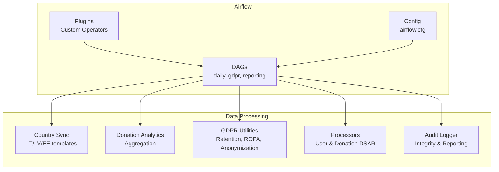

**Diagram sources**
- [jol_daily_sync.py:83-126](file://data/airflow/dags/jol_daily_sync.py#L83-L126)
- [jol_gdpr_cleanup.py:36-68](file://data/airflow/dags/jol_gdpr_cleanup.py#L36-L68)
- [jol_hub_etl.py:73-114](file://data/airflow/dags/jol_hub_etl.py#L73-L114)
- [jol_weekly_reporting.py:52-78](file://data/airflow/dags/jol_weekly_reporting.py#L52-L78)
- [jol_operators.py:10-35](file://data/airflow/plugins/jol_operators.py#L10-L35)
- [airflow.cfg:1-25](file://data/airflow/config/airflow.cfg#L1-L25)

**Section sources**
- [jol_daily_sync.py:1-126](file://data/airflow/dags/jol_daily_sync.py#L1-L126)
- [jol_gdpr_cleanup.py:1-68](file://data/airflow/dags/jol_gdpr_cleanup.py#L1-L68)
- [jol_hub_etl.py:1-214](file://data/airflow/dags/jol_hub_etl.py#L1-L214)
- [jol_weekly_reporting.py:1-78](file://data/airflow/dags/jol_weekly_reporting.py#L1-L78)
- [jol_operators.py:1-35](file://data/airflow/plugins/jol_operators.py#L1-L35)
- [airflow.cfg:1-25](file://data/airflow/config/airflow.cfg#L1-L25)

## Core Components
- Daily ETL DAG: Orchestrates country synchronization across EU countries, data quality checks, donation aggregation, retention cleanup, and compliance reporting.
- GDPR Cleanup DAG: Automated deletion of expired operational logs and user activity with verification.
- Hub ETL DAG: Processes donations, validates data quality, performs retention cleanup, and generates compliance reports; includes a manual-only GDPR data subject request pipeline (access, erasure, portability).
- Weekly Reporting DAG: Produces weekly analytics, country metrics, and compliance scorecards.
- Custom Plugin: GDPRCompliantOperator wraps PythonOperator to enforce logging and PII masking behavior.
- Configuration: Airflow core settings including folders, database connection, webserver, logging, and scheduler parameters.

Key responsibilities:
- Task dependency chains ensure ordered execution and isolation of concerns.
- Retention and legal hold enforcement prevent unauthorized deletions.
- Audit logging ensures integrity and traceability of all operations.
- K-anonymity protects donor privacy in analytics outputs.

**Section sources**
- [jol_daily_sync.py:15-126](file://data/airflow/dags/jol_daily_sync.py#L15-L126)
- [jol_gdpr_cleanup.py:14-68](file://data/airflow/dags/jol_gdpr_cleanup.py#L14-L68)
- [jol_hub_etl.py:14-214](file://data/airflow/dags/jol_hub_etl.py#L14-L214)
- [jol_weekly_reporting.py:13-78](file://data/airflow/dags/jol_weekly_reporting.py#L13-L78)
- [jol_operators.py:10-35](file://data/airflow/plugins/jol_operators.py#L10-L35)
- [airflow.cfg:1-25](file://data/airflow/config/airflow.cfg#L1-L25)

## Architecture Overview
The system uses Airflow DAGs to coordinate multiple data processing components:
- Country sync pipelines fetch, validate, transform, and load entity and donation data per country.
- Donation analytics aggregate financial data with k-anonymity thresholds tailored by country.
- GDPR utilities manage retention rules, legal holds, and generate Records of Processing Activities (ROPA).
- Processors implement Data Subject Access Requests (DSAR) and erasure with audit trails.
- Audit logger secures logs with hash chains and HMAC signatures for tamper detection.

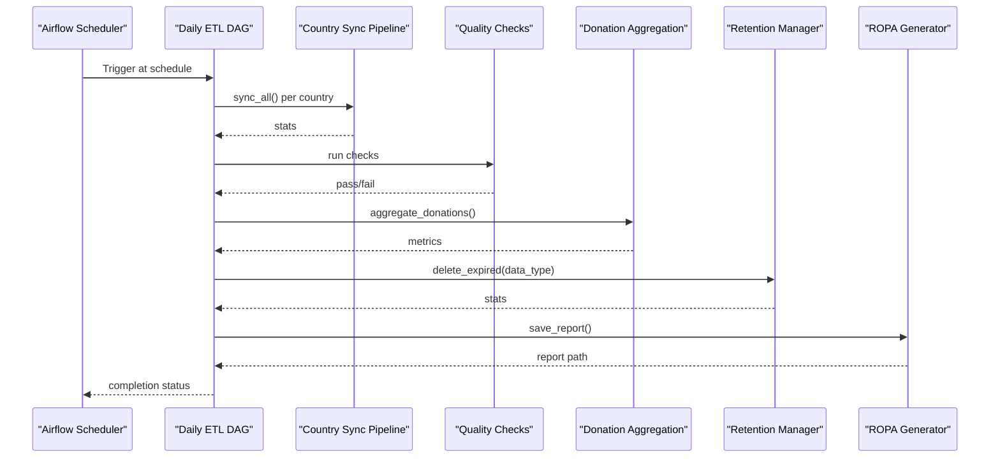

**Diagram sources**
- [jol_daily_sync.py:83-126](file://data/airflow/dags/jol_daily_sync.py#L83-L126)
- [lt_sync.py:72-140](file://data/src/pipelines/country_sync/lt_sync.py#L72-L140)
- [daily_aggregation.py:82-142](file://data/src/pipelines/donation_analytics/daily_aggregation.py#L82-L142)
- [retention_manager.py:206-246](file://data/src/gdpr/retention_manager.py#L206-L246)
- [ropa_generator.py:121-169](file://data/src/gdpr/ropa_generator.py#L121-L169)

## Detailed Component Analysis

### Daily ETL DAG (jol_daily_sync)
- Purpose: Run daily ETL across 27 EU countries, perform data quality checks, aggregate donations, clean up expired data, and generate compliance reports.
- Scheduling: Runs daily at 2 AM UTC with retries and timeouts configured via default_args.
- Task flow: start -> country_sync (parallel per country) -> data_quality_checks -> aggregate_donations -> retention_cleanup -> compliance_report -> end.
- Error handling: Default retries and email notifications on failure; each country sync encapsulates exceptions and returns stats.

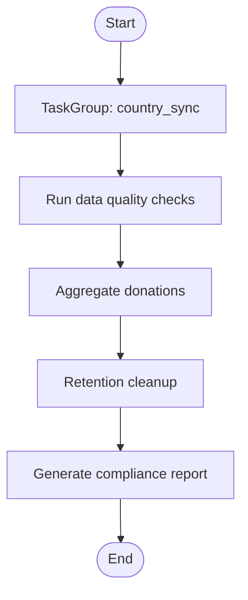

**Diagram sources**
- [jol_daily_sync.py:83-126](file://data/airflow/dags/jol_daily_sync.py#L83-L126)

**Section sources**
- [jol_daily_sync.py:15-126](file://data/airflow/dags/jol_daily_sync.py#L15-L126)

### GDPR Cleanup DAG (jol_gdpr_cleanup)
- Purpose: Automate deletion of expired operational logs and user activity per retention policies.
- Scheduling: Daily at 4 AM UTC.
- Task flow: start -> cleanup_operational_logs, cleanup_user_activity (parallel) -> verify_deletions -> end.
- Verification: Post-cleanup verification step ensures deletions completed correctly.

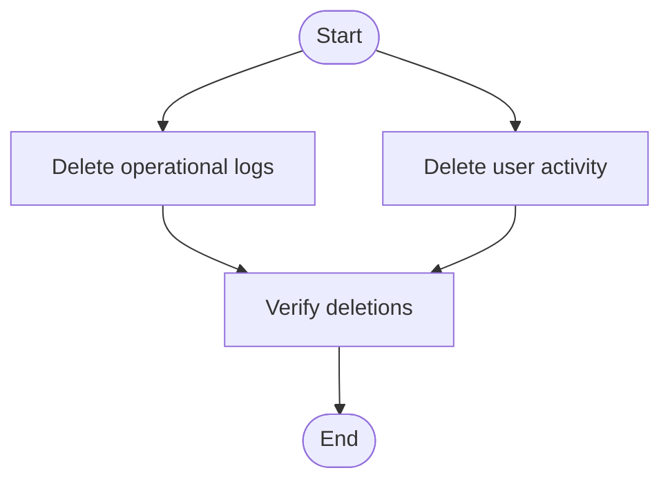

**Diagram sources**
- [jol_gdpr_cleanup.py:36-68](file://data/airflow/dags/jol_gdpr_cleanup.py#L36-L68)

**Section sources**
- [jol_gdpr_cleanup.py:14-68](file://data/airflow/dags/jol_gdpr_cleanup.py#L14-L68)

### Hub ETL DAG (jol_hub_daily_etl)
- Purpose: Process donations, validate data quality, apply retention cleanup, and generate compliance reports. Includes a manual-only GDPR data subject request pipeline.
- Scheduling: Daily at 2 AM UTC; GDPR requests DAG has no schedule (manual trigger only).
- Task groups:
  - data_processing: process_donations -> validate_data_quality
  - gdpr_compliance: retention_cleanup -> generate_compliance_report
- GDPR requests tasks: access, erasure, portability can be triggered independently with dag_run.conf inputs.

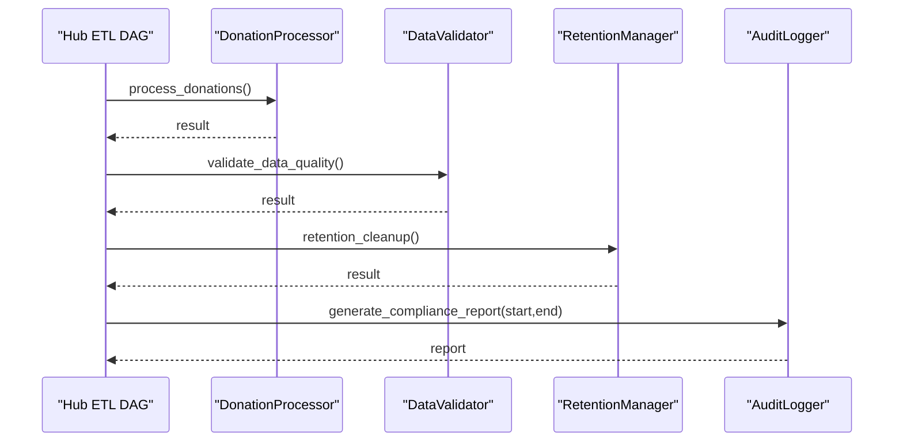

**Diagram sources**
- [jol_hub_etl.py:73-114](file://data/airflow/dags/jol_hub_etl.py#L73-L114)
- [processors.py:223-503](file://data/src/processors.py#L223-L503)
- [retention_manager.py:206-246](file://data/src/gdpr/retention_manager.py#L206-L246)
- [audit.py:475-511](file://data/src/audit.py#L475-L511)

**Section sources**
- [jol_hub_etl.py:14-214](file://data/airflow/dags/jol_hub_etl.py#L14-L214)

### Weekly Reporting DAG (jol_weekly_reporting)
- Purpose: Generate weekly analytics, country-level metrics (k-anonymized), and compliance scorecards.
- Scheduling: Weekly on Mondays at 3 AM UTC.
- Task flow: weekly_analytics -> country_metrics -> compliance_scorecard.

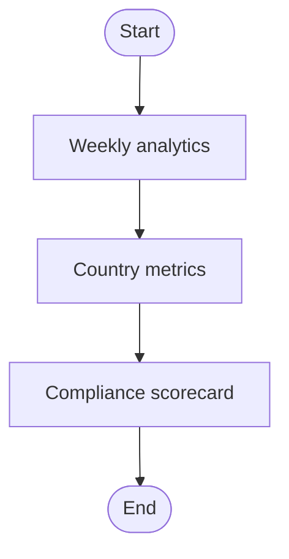

**Diagram sources**
- [jol_weekly_reporting.py:52-78](file://data/airflow/dags/jol_weekly_reporting.py#L52-L78)

**Section sources**
- [jol_weekly_reporting.py:13-78](file://data/airflow/dags/jol_weekly_reporting.py#L13-L78)

### Custom Operators and Plugins
- GDPRCompliantOperator extends PythonOperator to log execution boundaries and mask PII in logs.
- Registered via JolHubPlugin to expose the operator to Airflow.

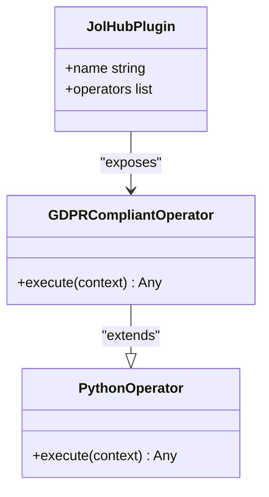

**Diagram sources**
- [jol_operators.py:10-35](file://data/airflow/plugins/jol_operators.py#L10-L35)

**Section sources**
- [jol_operators.py:1-35](file://data/airflow/plugins/jol_operators.py#L1-35)

### Country Synchronization Pipelines
- LithuaniaSyncPipeline orchestrates fetching, validation, anonymization, and loading of parish and donation data.
- TemplateSyncTemplate provides a reusable blueprint for adding new country pipelines with required GDPR fields and compliance checks.

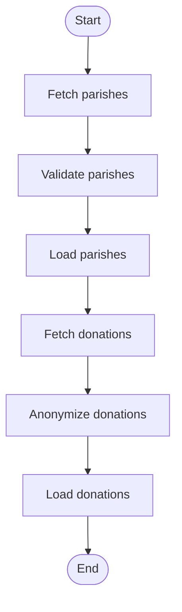

**Diagram sources**
- [lt_sync.py:72-140](file://data/src/pipelines/country_sync/lt_sync.py#L72-L140)
- [template_sync.py:84-127](file://data/src/pipelines/country_sync/template_sync.py#L84-L127)

**Section sources**
- [lt_sync.py:23-207](file://data/src/pipelines/country_sync/lt_sync.py#L23-L207)
- [template_sync.py:22-163](file://data/src/pipelines/country_sync/template_sync.py#L22-L163)

### Donation Analytics Aggregation
- DailyAggregationPipeline aggregates donations into k-anonymized metrics, suppressing small groups and computing percentiles where sufficient volume exists.
- Supports grouping by country and organization type.

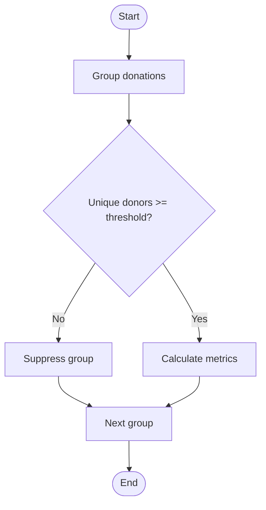

**Diagram sources**
- [daily_aggregation.py:82-142](file://data/src/pipelines/donation_analytics/daily_aggregation.py#L82-L142)

**Section sources**
- [daily_aggregation.py:24-242](file://data/src/pipelines/donation_analytics/daily_aggregation.py#L24-L242)

### GDPR Retention and Legal Holds
- RetentionManager enforces storage limitation and right to erasure with legal hold checks before any deletion.
- LegalHoldRegistry tracks active holds that block deletion even when retention expires.

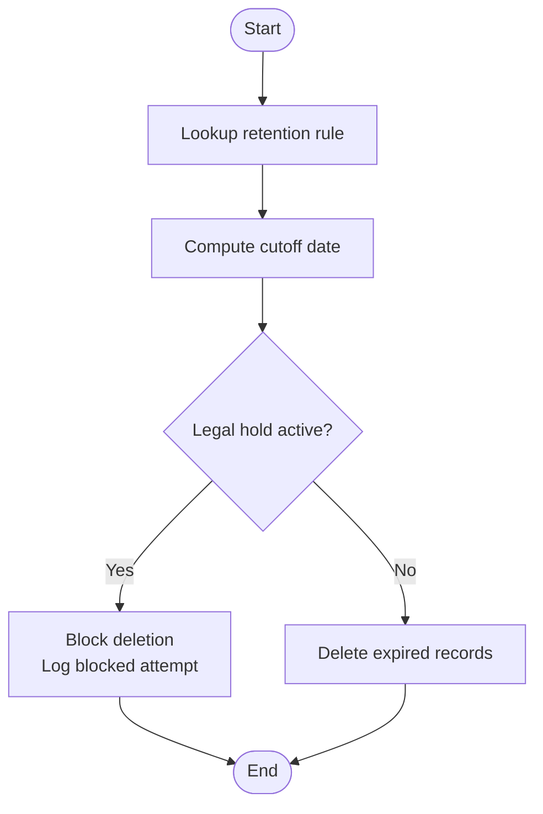

**Diagram sources**
- [retention_manager.py:206-336](file://data/src/gdpr/retention_manager.py#L206-L336)

**Section sources**
- [retention_manager.py:21-336](file://data/src/gdpr/retention_manager.py#L21-L336)

### ROPA Generation
- ROPAGenerator produces Records of Processing Activities in JSON or Markdown formats, capturing controller details, purposes, legal bases, and security measures.

**Section sources**
- [ropa_generator.py:19-182](file://data/src/gdpr/ropa_generator.py#L19-L182)

### K-Anonymity Implementation
- KAnonymizer applies country-specific k-values and hashes direct identifiers; supports count rounding and dataset checks for k-anonymity compliance.

**Section sources**
- [anonymizer.py:25-180](file://data/src/gdpr/anonymizer.py#L25-L180)

### Data Processors (DSAR and Erasure)
- DonationProcessor and UserdataProcessor implement GDPR Art. 15 (access), Art. 17 (erasure), and Art. 20 (portability) with audit logging and retention-aware deletion.

**Section sources**
- [processors.py:94-762](file://data/src/processors.py#L94-L762)

### Audit Logging and Integrity
- AuditLogger writes append-only JSONL logs with hash chains and HMAC signatures to ensure integrity and support compliance reporting and chain verification.

**Section sources**
- [audit.py:29-644](file://data/src/audit.py#L29-L644)

### Configuration Management
- airflow.cfg defines DAGs and plugins folders, base log folder, database connection, webserver settings, logging level, and scheduler interval.

**Section sources**
- [airflow.cfg:1-25](file://data/airflow/config/airflow.cfg#L1-L25)

## Dependency Analysis
High-level dependencies between DAGs and processing modules:

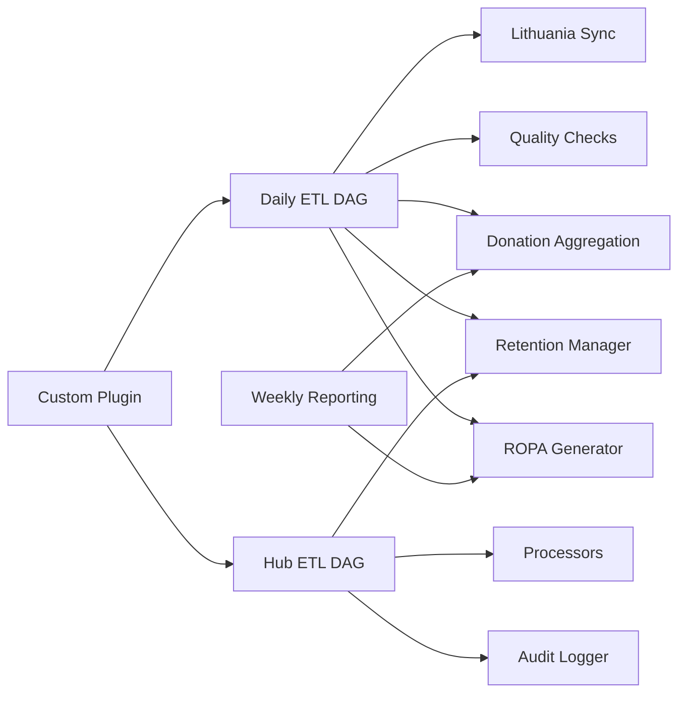

**Diagram sources**
- [jol_daily_sync.py:83-126](file://data/airflow/dags/jol_daily_sync.py#L83-L126)
- [jol_hub_etl.py:73-214](file://data/airflow/dags/jol_hub_etl.py#L73-L214)
- [jol_weekly_reporting.py:52-78](file://data/airflow/dags/jol_weekly_reporting.py#L52-L78)
- [lt_sync.py:72-140](file://data/src/pipelines/country_sync/lt_sync.py#L72-L140)
- [daily_aggregation.py:82-142](file://data/src/pipelines/donation_analytics/daily_aggregation.py#L82-L142)
- [retention_manager.py:206-246](file://data/src/gdpr/retention_manager.py#L206-L246)
- [ropa_generator.py:121-169](file://data/src/gdpr/ropa_generator.py#L121-L169)
- [processors.py:223-762](file://data/src/processors.py#L223-L762)
- [audit.py:205-644](file://data/src/audit.py#L205-L644)
- [jol_operators.py:10-35](file://data/airflow/plugins/jol_operators.py#L10-L35)

**Section sources**
- [jol_daily_sync.py:83-126](file://data/airflow/dags/jol_daily_sync.py#L83-L126)
- [jol_hub_etl.py:73-214](file://data/airflow/dags/jol_hub_etl.py#L73-L214)
- [jol_weekly_reporting.py:52-78](file://data/airflow/dags/jol_weekly_reporting.py#L52-L78)

## Performance Considerations
- Parallelism: Use TaskGroup for country sync to parallelize per-country workloads.
- Batching: Configure batch sizes in country sync and aggregation to balance throughput and memory usage.
- Timeouts: Set execution_timeout in default_args to prevent long-running tasks from blocking the scheduler.
- Retention: Apply retention rules early to reduce dataset size for downstream processing.
- K-anonymity thresholds: Adjust k-values per country to meet regulatory guidance while preserving analytical utility.
- Database connections: Ensure connection pooling and efficient queries in processors to avoid bottlenecks.

[No sources needed since this section provides general guidance]

## Troubleshooting Guide
Common issues and resolutions:
- DAG not triggering:
  - Verify schedule_interval and start_date in DAG definitions.
  - Confirm catchup=False if backfill is not desired.
  - Check scheduler interval and DAG discovery in airflow.cfg.
- Tasks failing repeatedly:
  - Inspect retries and retry_delay in default_args.
  - Review email_on_failure and email_on_retry settings.
  - Examine logs for specific errors in Python callables.
- GDPR erasure blocked:
  - Check for active legal holds using RetentionManager and LegalHoldRegistry.
  - Resolve holds before attempting deletion.
- Audit log integrity issues:
  - Use verify_chain to detect broken hash chains or invalid signatures.
  - Ensure secret key persistence and environment variables are correct.
- Data quality failures:
  - Validate input schemas and field requirements in processors.
  - Review suppression thresholds in aggregation to avoid empty outputs.

**Section sources**
- [retention_manager.py:248-336](file://data/src/gdpr/retention_manager.py#L248-L336)
- [audit.py:513-624](file://data/src/audit.py#L513-L624)
- [processors.py:260-503](file://data/src/processors.py#L260-L503)
- [daily_aggregation.py:120-142](file://data/src/pipelines/donation_analytics/daily_aggregation.py#L120-L142)
- [airflow.cfg:1-25](file://data/airflow/config/airflow.cfg#L1-L25)

## Conclusion
The Airflow orchestration layer provides robust, GDPR-compliant pipelines for daily ETL, automated cleanup, and reporting. It integrates country-specific synchronization, k-anonymized analytics, retention enforcement with legal holds, and comprehensive audit logging. By following the documented patterns for scheduling, error handling, and monitoring, teams can maintain reliable and compliant data pipelines while scaling to additional countries and use cases.

[No sources needed since this section summarizes without analyzing specific files]

## Appendices

### Creating a New DAG
Steps:
- Define default_args with owner, retries, retry_delay, and execution_timeout.
- Create PythonOperator tasks for each step and group related tasks using TaskGroup.
- Set schedule_interval, start_date, catchup, and tags for discoverability.
- Wire dependencies to ensure logical ordering and isolation.
- Integrate with existing processors and utilities (e.g., DonationProcessor, RetentionManager, AuditLogger).

Example references:
- Daily ETL structure and TaskGroup usage
- GDPR cleanup parallel tasks and verification
- Weekly reporting sequential flow

**Section sources**
- [jol_daily_sync.py:83-126](file://data/airflow/dags/jol_daily_sync.py#L83-L126)
- [jol_gdpr_cleanup.py:36-68](file://data/airflow/dags/jol_gdpr_cleanup.py#L36-L68)
- [jol_weekly_reporting.py:52-78](file://data/airflow/dags/jol_weekly_reporting.py#L52-L78)

### Best Practices for Reliable Pipelines
- Use TaskGroup for parallelizable workloads (e.g., per-country sync).
- Implement idempotent tasks to handle retries safely.
- Enforce retention and legal hold checks before deletions.
- Log all processing steps with structured audit events.
- Apply k-anonymity thresholds appropriate to jurisdictional guidance.
- Monitor DAG health via Airflow UI and alerting on failures.

**Section sources**
- [retention_manager.py:206-336](file://data/src/gdpr/retention_manager.py#L206-L336)
- [audit.py:205-644](file://data/src/audit.py#L205-L644)
- [anonymizer.py:25-180](file://data/src/gdpr/anonymizer.py#L25-L180)