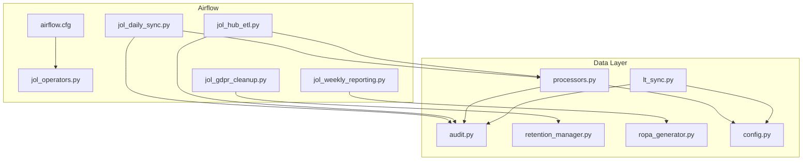
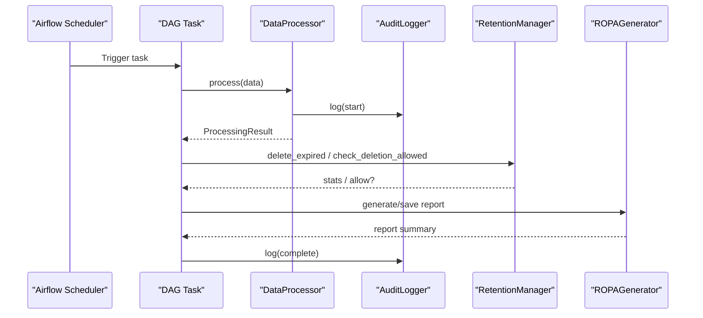
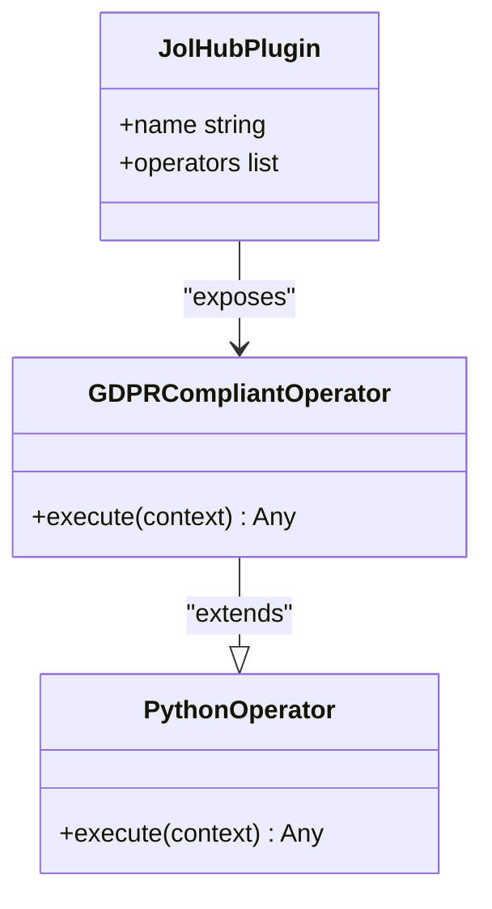
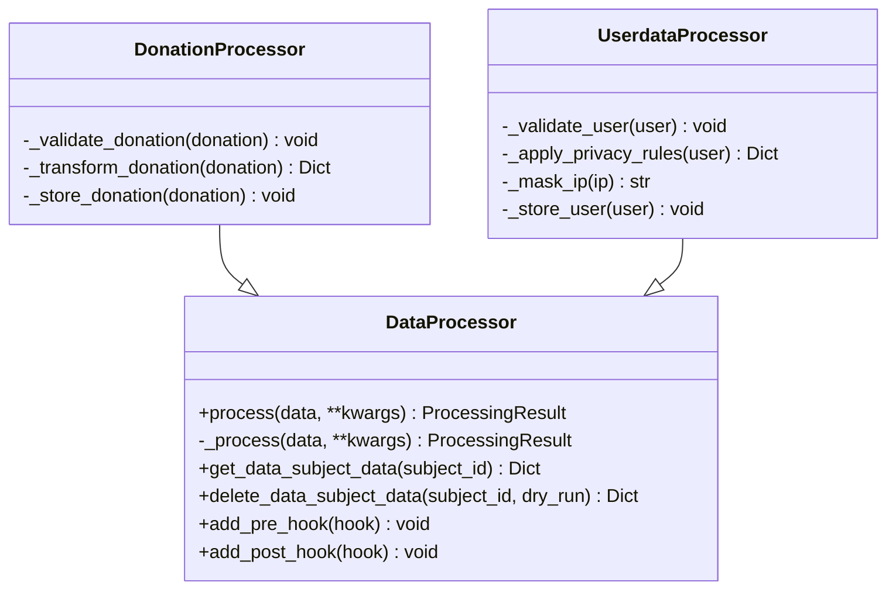
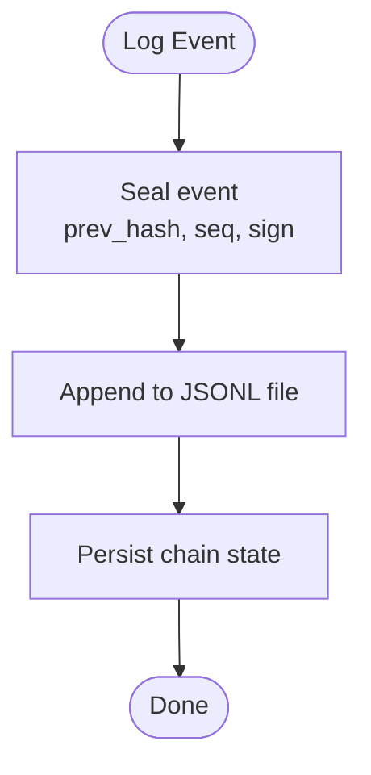
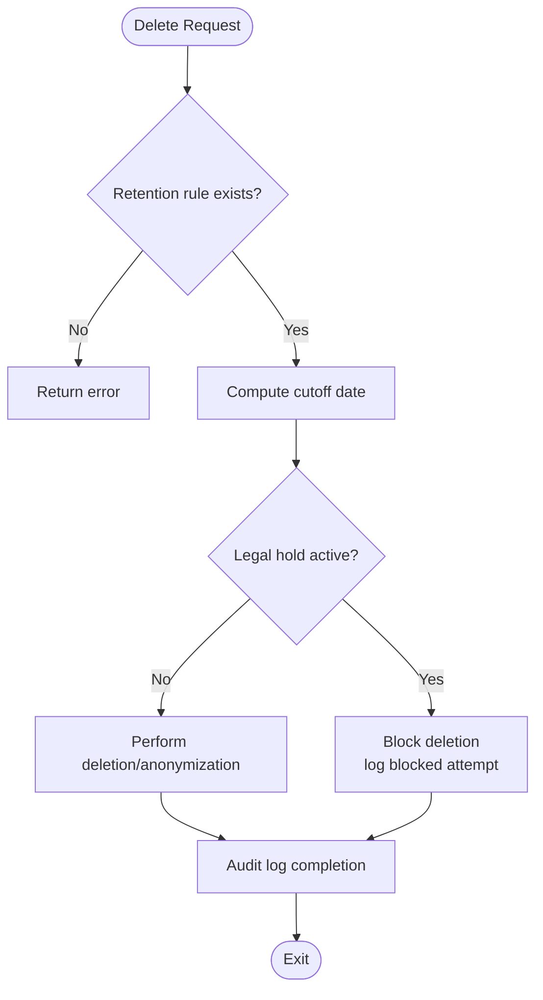
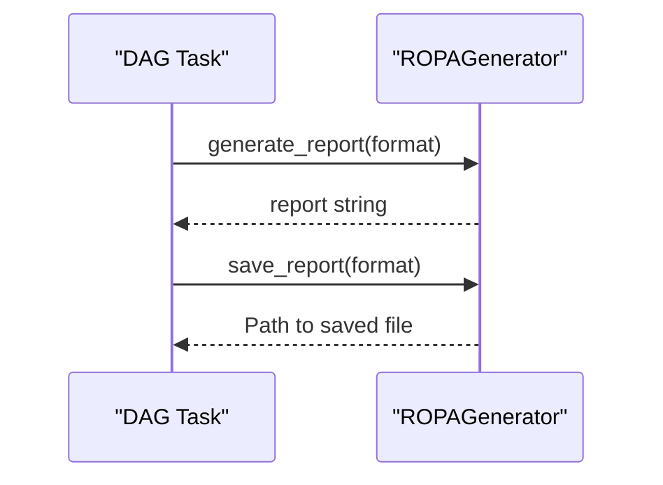
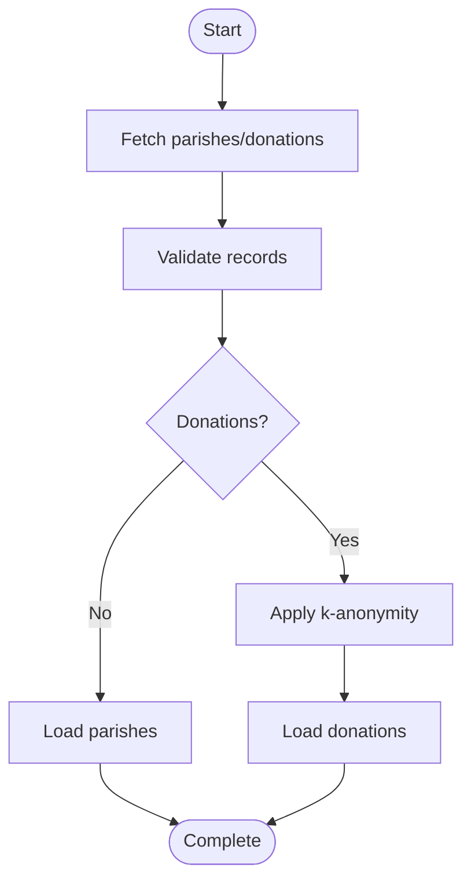
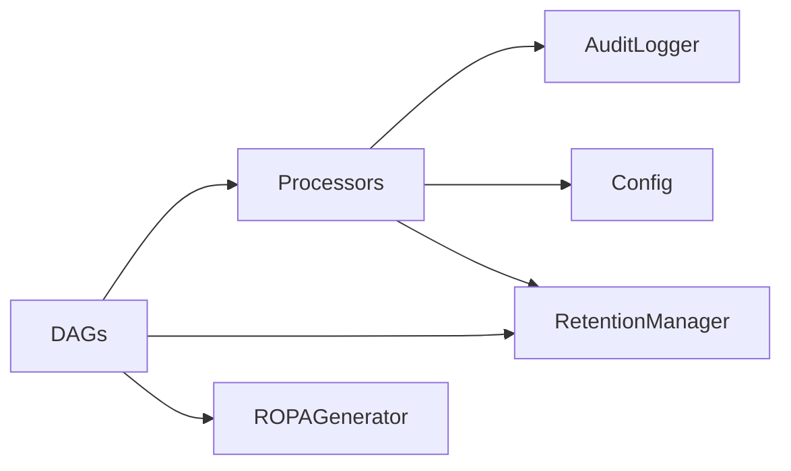

# Custom Operators & Plugins

<cite>
**Referenced Files in This Document**
- [jol_operators.py](file://data/airflow/plugins/jol_operators.py)
- [airflow.cfg](file://data/airflow/config/airflow.cfg)
- [jol_daily_sync.py](file://data/airflow/dags/jol_daily_sync.py)
- [jol_gdpr_cleanup.py](file://data/airflow/dags/jol_gdpr_cleanup.py)
- [jol_hub_etl.py](file://data/airflow/dags/jol_hub_etl.py)
- [jol_weekly_reporting.py](file://data/airflow/dags/jol_weekly_reporting.py)
- [lt_sync.py](file://data/src/pipelines/country_sync/lt_sync.py)
- [retention_manager.py](file://data/src/gdpr/retention_manager.py)
- [ropa_generator.py](file://data/src/gdpr/ropa_generator.py)
- [processors.py](file://data/src/processors.py)
- [audit.py](file://data/src/audit.py)
- [config.py](file://data/src/config.py)
- [test_processors.py](file://data/tests/test_processors.py)
- [test_gdpr.py](file://data/tests/test_gdpr.py)
</cite>

## Table of Contents
1. [Introduction](#introduction)
2. [Project Structure](#project-structure)
3. [Core Components](#core-components)
4. [Architecture Overview](#architecture-overview)
5. [Detailed Component Analysis](#detailed-component-analysis)
6. [Dependency Analysis](#dependency-analysis)
7. [Performance Considerations](#performance-considerations)
8. [Troubleshooting Guide](#troubleshooting-guide)
9. [Conclusion](#conclusion)
10. [Appendices](#appendices)

## Introduction
This document explains the custom Airflow operators and plugins developed for JOL-HUB, focusing on how they extend Airflow to enforce GDPR-compliant data processing across daily ETL, cleanup, and reporting workflows. It covers operator architecture, base classes used, extension patterns, integration points with platform services (audit logging, retention management, ROPA generation), and guidance for creating new custom operators following established patterns. It also documents plugin registration, lifecycle considerations, testing approaches, best practices, error handling, and performance optimization strategies.

## Project Structure
JOL-HUB organizes Airflow-related code under data/airflow:
- DAGs define scheduled or manual pipelines for daily sync, GDPR cleanup, weekly reporting, and general ETL.
- A custom plugin registers a GDPR-aware base operator that wraps PythonOperator behavior with audit-friendly logging and PII-safe outputs.
- Configuration sets Airflow’s folders, database connection, and log masking.

**Diagram sources**
- [airflow.cfg:1-25](file://data/airflow/config/airflow.cfg#L1-L25)
- [jol_operators.py:1-35](file://data/airflow/plugins/jol_operators.py#L1-L35)
- [jol_daily_sync.py:1-126](file://data/airflow/dags/jol_daily_sync.py#L1-L126)
- [jol_gdpr_cleanup.py:1-68](file://data/airflow/dags/jol_gdpr_cleanup.py#L1-L68)
- [jol_hub_etl.py:1-214](file://data/airflow/dags/jol_hub_etl.py#L1-L214)
- [jol_weekly_reporting.py:1-78](file://data/airflow/dags/jol_weekly_reporting.py#L1-L78)
- [processors.py:1-762](file://data/src/processors.py#L1-L762)
- [audit.py:1-644](file://data/src/audit.py#L1-L644)
- [retention_manager.py:1-336](file://data/src/gdpr/retention_manager.py#L1-L336)
- [ropa_generator.py:1-182](file://data/src/gdpr/ropa_generator.py#L1-L182)
- [lt_sync.py:1-207](file://data/src/pipelines/country_sync/lt_sync.py#L1-L207)
- [config.py:1-124](file://data/src/config.py#L1-L124)

**Section sources**
- [airflow.cfg:1-25](file://data/airflow/config/airflow.cfg#L1-L25)
- [jol_operators.py:1-35](file://data/airflow/plugins/jol_operators.py#L1-L35)
- [jol_daily_sync.py:1-126](file://data/airflow/dags/jol_daily_sync.py#L1-L126)
- [jol_gdpr_cleanup.py:1-68](file://data/airflow/dags/jol_gdpr_cleanup.py#L1-L68)
- [jol_hub_etl.py:1-214](file://data/airflow/dags/jol_hub_etl.py#L1-L214)
- [jol_weekly_reporting.py:1-78](file://data/airflow/dags/jol_weekly_reporting.py#L1-L78)

## Core Components
- Custom Operator: A GDPR-aware base operator extending PythonOperator to ensure consistent logging and safe output handling for tasks.
- Plugin Registration: The plugin exposes the custom operator to Airflow via the standard plugin mechanism.
- Data Processors: Abstract base class and concrete processors implement GDPR-compliant processing with hooks, audit logging, and DSAR support.
- Audit Logger: Immutable, hash-chained audit logs with HMAC signatures for integrity verification.
- Retention Manager: Enforces storage limitation and legal holds before deletion.
- ROPA Generator: Produces Records of Processing Activities per GDPR Article 30.
- Country Sync Pipeline: Example pipeline orchestrating fetch, validate, anonymize, and load steps with audit trails.

Key responsibilities:
- Ensure every task logs start/completion without exposing PII.
- Provide reusable compliance utilities (audit, retention, ROPA).
- Offer a clean abstraction for data processors to implement access/erasure/portability flows.

**Section sources**
- [jol_operators.py:10-34](file://data/airflow/plugins/jol_operators.py#L10-L34)
- [processors.py:94-221](file://data/src/processors.py#L94-L221)
- [audit.py:205-369](file://data/src/audit.py#L205-L369)
- [retention_manager.py:188-336](file://data/src/gdpr/retention_manager.py#L188-L336)
- [ropa_generator.py:103-182](file://data/src/gdpr/ropa_generator.py#L103-L182)
- [lt_sync.py:48-140](file://data/src/pipelines/country_sync/lt_sync.py#L48-L140)

## Architecture Overview
The system integrates Airflow DAGs with domain-specific processors and compliance services. DAGs orchestrate tasks; each task invokes processors or utilities that emit structured, tamper-evident audit events and respect retention/legal holds.

**Diagram sources**
- [jol_daily_sync.py:25-72](file://data/airflow/dags/jol_daily_sync.py#L25-L72)
- [processors.py:138-192](file://data/src/processors.py#L138-L192)
- [audit.py:330-369](file://data/src/audit.py#L330-L369)
- [retention_manager.py:206-246](file://data/src/gdpr/retention_manager.py#L206-L246)
- [ropa_generator.py:121-169](file://data/src/gdpr/ropa_generator.py#L121-L169)

## Detailed Component Analysis

### Custom Operator and Plugin
- Base operator extends PythonOperator to wrap execution with GDPR-conscious logging and safe result propagation.
- Plugin registers the operator under a unique name so it is discoverable by Airflow.

**Diagram sources**
- [jol_operators.py:10-34](file://data/airflow/plugins/jol_operators.py#L10-L34)

**Section sources**
- [jol_operators.py:10-34](file://data/airflow/plugins/jol_operators.py#L10-L34)
- [airflow.cfg:1-25](file://data/airflow/config/airflow.cfg#L1-L25)

### Data Processor Abstraction and Implementations
- Abstract base class provides a standardized process() method that enforces pre/post hooks, audit logging, and exception capture.
- Concrete processors implement domain logic for donations and user data, including DSAR access and erasure flows with retention checks.

**Diagram sources**
- [processors.py:94-221](file://data/src/processors.py#L94-L221)
- [processors.py:223-503](file://data/src/processors.py#L223-L503)
- [processors.py:506-762](file://data/src/processors.py#L506-L762)

**Section sources**
- [processors.py:94-221](file://data/src/processors.py#L94-L221)
- [processors.py:223-503](file://data/src/processors.py#L223-L503)
- [processors.py:506-762](file://data/src/processors.py#L506-L762)

### Audit Logging and Integrity
- AuditEvent encapsulates GDPR-required fields plus integrity metadata (hash chain, sequence number, HMAC signature).
- AuditLogger writes append-only JSONL files, persists chain state, and supports querying and verification.

**Diagram sources**
- [audit.py:160-203](file://data/src/audit.py#L160-L203)
- [audit.py:330-369](file://data/src/audit.py#L330-L369)

**Section sources**
- [audit.py:65-203](file://data/src/audit.py#L65-L203)
- [audit.py:205-369](file://data/src/audit.py#L205-L369)
- [audit.py:475-624](file://data/src/audit.py#L475-L624)

### Retention Management and Legal Holds
- RetentionManager enforces storage limitation and blocks deletions when legal holds are active.
- LegalHoldRegistry tracks holds and exposes helpers to query and lift holds.

**Diagram sources**
- [retention_manager.py:206-336](file://data/src/gdpr/retention_manager.py#L206-L336)

**Section sources**
- [retention_manager.py:21-106](file://data/src/gdpr/retention_manager.py#L21-L106)
- [retention_manager.py:109-185](file://data/src/gdpr/retention_manager.py#L109-L185)
- [retention_manager.py:188-336](file://data/src/gdpr/retention_manager.py#L188-L336)

### ROPA Generation
- ROPAGenerator produces Records of Processing Activities in JSON or Markdown, capturing controller info, activities, and summaries.

**Diagram sources**
- [ropa_generator.py:103-182](file://data/src/gdpr/ropa_generator.py#L103-L182)

**Section sources**
- [ropa_generator.py:19-43](file://data/src/gdpr/ropa_generator.py#L19-L43)
- [ropa_generator.py:45-100](file://data/src/gdpr/ropa_generator.py#L45-L100)
- [ropa_generator.py:103-182](file://data/src/gdpr/ropa_generator.py#L103-L182)

### Country Sync Pipeline (Example)
- LithuaniaSyncPipeline demonstrates a typical pipeline: fetch, validate, anonymize, load, with audit logging at key steps.

**Diagram sources**
- [lt_sync.py:72-140](file://data/src/pipelines/country_sync/lt_sync.py#L72-L140)
- [lt_sync.py:147-179](file://data/src/pipelines/country_sync/lt_sync.py#L147-L179)

**Section sources**
- [lt_sync.py:23-46](file://data/src/pipelines/country_sync/lt_sync.py#L23-L46)
- [lt_sync.py:48-140](file://data/src/pipelines/country_sync/lt_sync.py#L48-L140)
- [lt_sync.py:147-207](file://data/src/pipelines/country_sync/lt_sync.py#L147-L207)

### DAG Integration Points
- Daily ETL: country sync, quality checks, donation aggregation, retention cleanup, compliance report.
- GDPR Cleanup: automated deletion for operational logs and user activity, followed by verification.
- Weekly Reporting: analytics, country metrics, compliance scorecard using ROPA generator.
- ETL and DSAR: donation/user processing, validation, retention cleanup, and manual DSAR triggers.

**Section sources**
- [jol_daily_sync.py:25-126](file://data/airflow/dags/jol_daily_sync.py#L25-L126)
- [jol_gdpr_cleanup.py:21-68](file://data/airflow/dags/jol_gdpr_cleanup.py#L21-L68)
- [jol_weekly_reporting.py:20-78](file://data/airflow/dags/jol_weekly_reporting.py#L20-L78)
- [jol_hub_etl.py:25-113](file://data/airflow/dags/jol_hub_etl.py#L25-L113)
- [jol_hub_etl.py:117-214](file://data/airflow/dags/jol_hub_etl.py#L117-L214)

## Dependency Analysis
- DAGs depend on:
  - Data processors for business logic and DSAR support.
  - Audit logger for immutable, verifiable logs.
  - Retention manager for lawful deletion and legal hold enforcement.
  - ROPA generator for compliance documentation.
- Processors depend on configuration for classification and retention policies.
- Country sync depends on validators and anonymizers (via imports) and audit logger.

**Diagram sources**
- [processors.py:94-221](file://data/src/processors.py#L94-L221)
- [audit.py:205-369](file://data/src/audit.py#L205-L369)
- [retention_manager.py:188-336](file://data/src/gdpr/retention_manager.py#L188-L336)
- [ropa_generator.py:103-182](file://data/src/gdpr/ropa_generator.py#L103-L182)
- [config.py:1-124](file://data/src/config.py#L1-L124)

**Section sources**
- [processors.py:94-221](file://data/src/processors.py#L94-L221)
- [audit.py:205-369](file://data/src/audit.py#L205-L369)
- [retention_manager.py:188-336](file://data/src/gdpr/retention_manager.py#L188-L336)
- [ropa_generator.py:103-182](file://data/src/gdpr/ropa_generator.py#L103-L182)
- [config.py:1-124](file://data/src/config.py#L1-L124)

## Performance Considerations
- Batch sizes: Use processor and pipeline batch sizes to avoid memory pressure; tune based on dataset size and resource limits.
- Timeouts and retries: Configure DAG default_args with appropriate retry_delay and execution_timeout to balance reliability and throughput.
- I/O efficiency: Prefer streaming or chunked reads/writes in processors; minimize large in-memory structures.
- Audit overhead: Audit logging is append-only and efficient; still consider batching where applicable and ensuring disk capacity.
- Database interactions: Keep queries targeted and indexed; reuse connections within tasks where safe; close cursors and connections promptly.
- Anonymization cost: Apply k-anonymity only to necessary datasets; pre-filter to reduce workload.

[No sources needed since this section provides general guidance]

## Troubleshooting Guide
Common issues and diagnostics:
- Audit log integrity failures:
  - Verify chain continuity, sequence monotonicity, and HMAC signatures using provided verification methods.
  - Check environment secret key consistency and log directory permissions.
- Deletion blocked unexpectedly:
  - Inspect legal holds for the subject; use registry helpers to list active holds and reasons.
- DSAR requests failing:
  - Confirm database connectivity and schema; review processor error paths and audit logs for specifics.
- DAG task timeouts or retries:
  - Adjust execution_timeout and retries; inspect task logs for long-running operations or external service latency.

**Section sources**
- [audit.py:513-624](file://data/src/audit.py#L513-L624)
- [retention_manager.py:248-336](file://data/src/gdpr/retention_manager.py#L248-L336)
- [processors.py:282-503](file://data/src/processors.py#L282-L503)
- [processors.py:570-762](file://data/src/processors.py#L570-L762)

## Conclusion
JOL-HUB’s Airflow operators and plugins provide a robust foundation for GDPR-compliant data processing. By centralizing audit logging, retention enforcement, and ROPA generation behind well-defined interfaces, the system ensures consistent compliance across all DAGs. The abstract processor pattern enables teams to build new data handlers while inheriting compliance guarantees. With clear testing coverage and strong integrity mechanisms, the platform supports reliable, auditable, and legally compliant operations.

[No sources needed since this section summarizes without analyzing specific files]

## Appendices

### Creating New Custom Operators
Follow these steps to create a new operator aligned with JOL-HUB patterns:
- Extend the existing GDPR-aware base operator to inherit logging and safety behaviors.
- Register the operator in the plugin’s operators list so Airflow discovers it.
- In your DAG, use the operator instead of raw PythonOperator to ensure consistent audit and compliance behavior.
- For complex logic, prefer delegating to processors rather than embedding business logic in operators.

Best practices:
- Keep operators thin; offload heavy work to processors and services.
- Always pass context safely; avoid logging sensitive data.
- Use op_kwargs to parameterize tasks cleanly.
- Add tags and descriptions for discoverability and monitoring.

**Section sources**
- [jol_operators.py:10-34](file://data/airflow/plugins/jol_operators.py#L10-L34)
- [airflow.cfg:1-25](file://data/airflow/config/airflow.cfg#L1-L25)
- [processors.py:94-221](file://data/src/processors.py#L94-L221)

### Testing Approaches
- Unit tests validate processors, validators, retention rules, and ROPA generation.
- Tests assert expected outcomes such as record counts, retention periods, and report structure.
- Use temporary directories for ROPA output and isolated configurations where needed.

Recommended additions:
- Test operator execution paths with mocked callables.
- Assert audit events are emitted with correct actions and metadata.
- Simulate legal holds to verify deletion blocking behavior.

**Section sources**
- [test_processors.py:91-144](file://data/tests/test_processors.py#L91-L144)
- [test_gdpr.py:57-125](file://data/tests/test_gdpr.py#L57-L125)

### Best Practices for Operator Development
- Encapsulate compliance logic in shared components (audit, retention, ROPA).
- Use explicit configuration for classifications and retention policies.
- Handle errors gracefully; always log via the audit logger.
- Avoid hardcoding secrets; rely on environment variables and secure stores.
- Keep tasks idempotent and testable; prefer deterministic outputs.

[No sources needed since this section provides general guidance]