# Daily ETL Pipeline

<cite>
**Referenced Files in This Document**
- [jol_daily_sync.py](file://data/airflow/dags/jol_daily_sync.py)
- [jol_gdpr_cleanup.py](file://data/airflow/dags/jol_gdpr_cleanup.py)
- [jol_hub_etl.py](file://data/airflow/dags/jol_hub_etl.py)
- [jol_operators.py](file://data/airflow/plugins/jol_operators.py)
- [config.py](file://data/src/config.py)
- [processors.py](file://data/src/processors.py)
- [validators.py](file://data/src/validators.py)
- [daily_aggregation.py](file://data/src/pipelines/donation_analytics/daily_aggregation.py)
- [retention_manager.py](file://data/src/gdpr/retention_manager.py)
- [anonymizer.py](file://data/src/gdpr/anonymizer.py)
- [template_sync.py](file://data/src/pipelines/country_sync/template_sync.py)
- [audit.py](file://data/src/audit.py)
- [airflow.cfg](file://data/airflow/config/airflow.cfg)
</cite>

## Table of Contents
1. Introduction
2. Project Structure
3. Core Components
4. Architecture Overview
5. Detailed Component Analysis
6. Dependency Analysis
7. Performance Considerations
8. Troubleshooting Guide
9. Conclusion
10. Appendices

## Introduction
This document describes the daily ETL pipeline DAGs that orchestrate data ingestion, processing, validation, aggregation, and GDPR compliance tasks across 27 EU countries. It explains task dependencies, error handling and retries, configuration parameters, scheduling intervals, monitoring approaches, and how to extend the pipeline with new data sources and processors. It also covers performance optimization techniques and troubleshooting guidance for common issues.

## Project Structure
The ETL system is implemented as Airflow DAGs under data/airflow/dags, with supporting Python modules under data/src and Airflow plugin operators under data/airflow/plugins. Configuration for Airflow is provided in data/airflow/config/airflow.cfg.

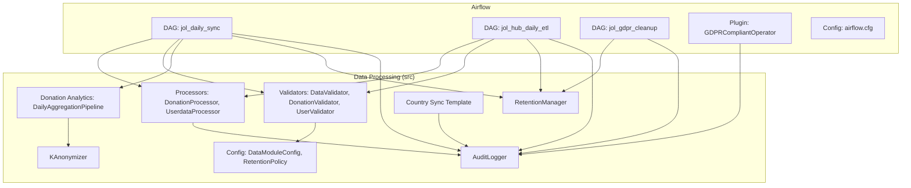

**Diagram sources**
- [jol_daily_sync.py:83-125](file://data/airflow/dags/jol_daily_sync.py#L83-L125)
- [jol_hub_etl.py:73-113](file://data/airflow/dags/jol_hub_etl.py#L73-L113)
- [jol_gdpr_cleanup.py:36-67](file://data/airflow/dags/jol_gdpr_cleanup.py#L36-L67)
- [jol_operators.py:10-34](file://data/airflow/plugins/jol_operators.py#L10-L34)
- [processors.py:94-220](file://data/src/processors.py#L94-L220)
- [validators.py:75-119](file://data/src/validators.py#L75-L119)
- [daily_aggregation.py:62-142](file://data/src/pipelines/donation_analytics/daily_aggregation.py#L62-L142)
- [retention_manager.py:188-246](file://data/src/gdpr/retention_manager.py#L188-L246)
- [anonymizer.py:106-143](file://data/src/gdpr/anonymizer.py#L106-L143)
- [template_sync.py:49-127](file://data/src/pipelines/country_sync/template_sync.py#L49-L127)
- [audit.py:205-369](file://data/src/audit.py#L205-L369)
- [config.py:55-82](file://data/src/config.py#L55-L82)
- [airflow.cfg:1-25](file://data/airflow/config/airflow.cfg#L1-L25)

**Section sources**
- [jol_daily_sync.py:83-125](file://data/airflow/dags/jol_daily_sync.py#L83-L125)
- [jol_hub_etl.py:73-113](file://data/airflow/dags/jol_hub_etl.py#L73-L113)
- [jol_gdpr_cleanup.py:36-67](file://data/airflow/dags/jol_gdpr_cleanup.py#L36-L67)
- [airflow.cfg:1-25](file://data/airflow/config/airflow.cfg#L1-L25)

## Core Components
- Airflow DAGs:
  - jol_daily_sync: Orchestrates country sync, data quality checks, donation aggregation, retention cleanup, and compliance reporting.
  - jol_hub_daily_etl: Processes donations, validates data, performs retention cleanup, and generates compliance reports; includes a manual-only GDPR requests DAG.
  - jol_gdpr_cleanup: Automated deletion of expired operational logs and user activity, with verification.
- Processors:
  - DonationProcessor: Validates, transforms, stores donations; supports DSAR access and erasure with retention rules.
  - UserdataProcessor: Validates, applies privacy rules, stores users; supports DSAR access and erasure.
- Validators:
  - DataValidator and domain-specific validators enforce required fields, types, GDPR-sensitive content detection, and data quality.
- Aggregation:
  - DailyAggregationPipeline computes k-anonymized metrics per period and group, suppressing small groups to protect donor privacy.
- GDPR:
  - RetentionManager enforces retention policies and legal holds; blocks deletions when necessary.
  - KAnonymizer provides country-aware k-anonymity thresholds and anonymization utilities.
- Audit:
  - AuditLogger records tamper-evident audit events with hash chains and HMAC signatures; supports queries and compliance report generation.
- Configuration:
  - DataModuleConfig sets DB/Redis settings, processing limits, and GDPR toggles; RetentionPolicy defines retention periods by data type.
- Airflow Plugin:
  - GDPRCompliantOperator wraps PythonOperator to ensure consistent logging and PII masking behavior.

**Section sources**
- [processors.py:94-220](file://data/src/processors.py#L94-L220)
- [processors.py:223-503](file://data/src/processors.py#L223-L503)
- [processors.py:506-761](file://data/src/processors.py#L506-L761)
- [validators.py:75-293](file://data/src/validators.py#L75-L293)
- [daily_aggregation.py:62-242](file://data/src/pipelines/donation_analytics/daily_aggregation.py#L62-L242)
- [retention_manager.py:188-336](file://data/src/gdpr/retention_manager.py#L188-L336)
- [anonymizer.py:25-83](file://data/src/gdpr/anonymizer.py#L25-L83)
- [anonymizer.py:106-143](file://data/src/gdpr/anonymizer.py#L106-L143)
- [audit.py:205-369](file://data/src/audit.py#L205-L369)
- [config.py:55-124](file://data/src/config.py#L55-L124)
- [jol_operators.py:10-34](file://data/airflow/plugins/jol_operators.py#L10-L34)

## Architecture Overview
The daily ETL runs at 2 AM UTC, synchronizing data for each EU country, performing data quality checks, aggregating donations with k-anonymity, cleaning up expired data, and generating compliance reports. A separate DAG handles GDPR Article 17 automated deletions at 4 AM UTC. An additional DAG processes GDPR data subject requests on demand.

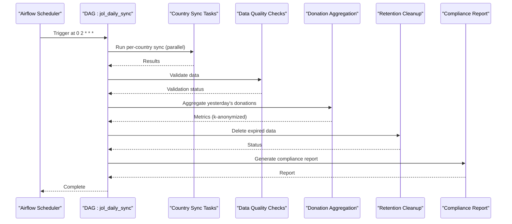

**Diagram sources**
- [jol_daily_sync.py:83-125](file://data/airflow/dags/jol_daily_sync.py#L83-L125)
- [daily_aggregation.py:82-142](file://data/src/pipelines/donation_analytics/daily_aggregation.py#L82-L142)
- [retention_manager.py:206-246](file://data/src/gdpr/retention_manager.py#L206-L246)
- [audit.py:475-511](file://data/src/audit.py#L475-L511)

**Section sources**
- [jol_daily_sync.py:15-22](file://data/airflow/dags/jol_daily_sync.py#L15-L22)
- [jol_daily_sync.py:83-125](file://data/airflow/dags/jol_daily_sync.py#L83-L125)
- [jol_gdpr_cleanup.py:14-18](file://data/airflow/dags/jol_gdpr_cleanup.py#L14-L18)
- [jol_gdpr_cleanup.py:36-67](file://data/airflow/dags/jol_gdpr_cleanup.py#L36-L67)
- [jol_hub_etl.py:14-22](file://data/airflow/dags/jol_hub_etl.py#L14-L22)
- [jol_hub_etl.py:73-113](file://data/airflow/dags/jol_hub_etl.py#L73-L113)

## Detailed Component Analysis

### Daily ETL DAG (jol_daily_sync)
- Scheduling: Runs daily at 2 AM UTC with retries and email-on-failure enabled.
- Task flow:
  - Parallel country synchronization for 27 EU countries using a TaskGroup.
  - Data quality checks via a checkpoint runner.
  - Donation aggregation with k-anonymity.
  - Retention cleanup for operational logs and user activity.
  - Compliance report generation.
- Error handling: Default retries (3) with 5-minute delay; failures trigger emails.

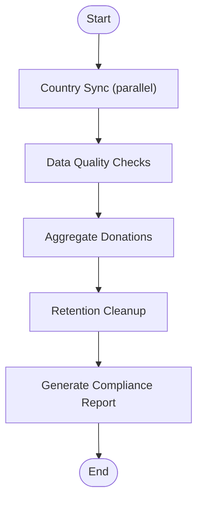

**Diagram sources**
- [jol_daily_sync.py:83-125](file://data/airflow/dags/jol_daily_sync.py#L83-L125)

**Section sources**
- [jol_daily_sync.py:15-22](file://data/airflow/dags/jol_daily_sync.py#L15-L22)
- [jol_daily_sync.py:25-72](file://data/airflow/dags/jol_daily_sync.py#L25-L72)
- [jol_daily_sync.py:75-125](file://data/airflow/dags/jol_daily_sync.py#L75-L125)

### GDPR Cleanup DAG (jol_gdpr_cleanup)
- Scheduling: Runs daily at 4 AM UTC.
- Tasks:
  - Clean up expired operational logs.
  - Clean up expired user activity.
  - Verify deletions completed correctly.
- Error handling: Single retry with 5-minute delay.

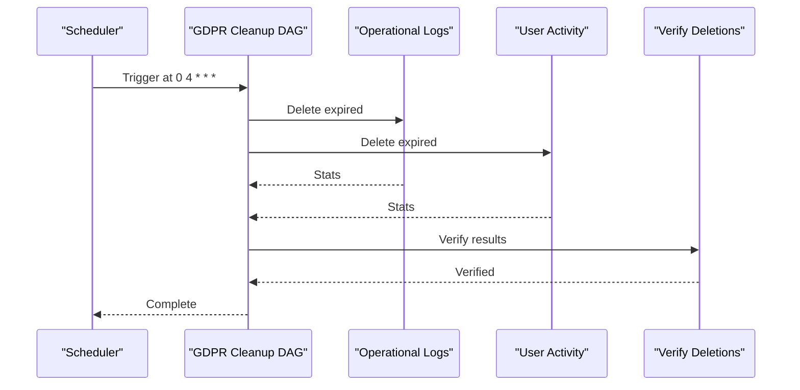

**Diagram sources**
- [jol_gdpr_cleanup.py:36-67](file://data/airflow/dags/jol_gdpr_cleanup.py#L36-L67)

**Section sources**
- [jol_gdpr_cleanup.py:14-18](file://data/airflow/dags/jol_gdpr_cleanup.py#L14-L18)
- [jol_gdpr_cleanup.py:21-33](file://data/airflow/dags/jol_gdpr_cleanup.py#L21-L33)
- [jol_gdpr_cleanup.py:36-67](file://data/airflow/dags/jol_gdpr_cleanup.py#L36-L67)

### Hub ETL DAG (jol_hub_daily_etl)
- Scheduling: Runs daily at 2 AM UTC with execution timeout of 1 hour.
- Task flow:
  - Process donations and validate data quality within a TaskGroup.
  - Perform retention cleanup and generate compliance report within another TaskGroup.
- Manual-only GDPR Requests DAG:
  - Supports access, erasure, and portability requests with audit logging.

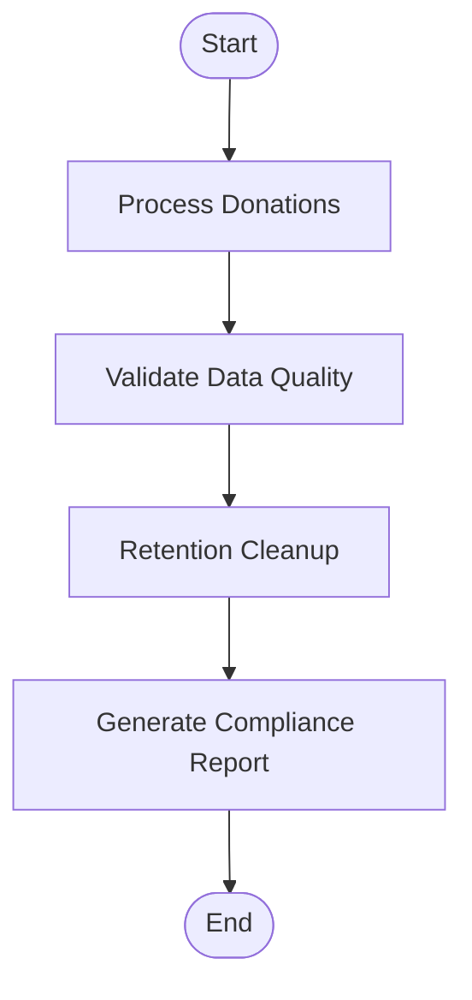

**Diagram sources**
- [jol_hub_etl.py:73-113](file://data/airflow/dags/jol_hub_etl.py#L73-L113)

**Section sources**
- [jol_hub_etl.py:14-22](file://data/airflow/dags/jol_hub_etl.py#L14-L22)
- [jol_hub_etl.py:25-70](file://data/airflow/dags/jol_hub_etl.py#L25-L70)
- [jol_hub_etl.py:73-113](file://data/airflow/dags/jol_hub_etl.py#L73-L113)
- [jol_hub_etl.py:117-213](file://data/airflow/dags/jol_hub_etl.py#L117-L213)

### Data Processors and Validation
- DonationProcessor:
  - Validates required fields and positive amounts.
  - Transforms and stores donations.
  - Implements DSAR access and erasure with retention exemptions for financial records.
- UserdataProcessor:
  - Applies privacy rules (e.g., IP masking without consent).
  - Implements DSAR access and erasure with membership checks.
- Validators:
  - Enforce required fields, types, GDPR-sensitive content detection, and data quality checks.
  - Domain-specific validators for donations and users.

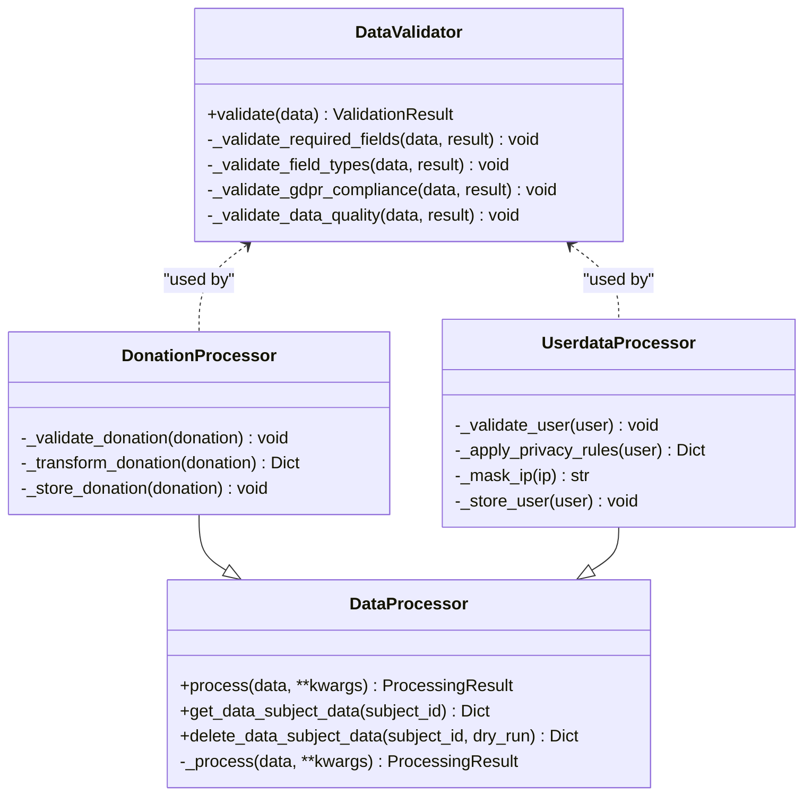

**Diagram sources**
- [processors.py:94-220](file://data/src/processors.py#L94-L220)
- [processors.py:223-503](file://data/src/processors.py#L223-L503)
- [processors.py:506-761](file://data/src/processors.py#L506-L761)
- [validators.py:75-293](file://data/src/validators.py#L75-L293)

**Section sources**
- [processors.py:223-503](file://data/src/processors.py#L223-L503)
- [processors.py:506-761](file://data/src/processors.py#L506-L761)
- [validators.py:75-293](file://data/src/validators.py#L75-L293)

### Donation Analytics Aggregation
- Computes aggregated metrics per period and group (country, organization type).
- Suppresses small groups below threshold to protect donor privacy.
- Uses k-anonymity to anonymize counts and optionally compute percentiles.

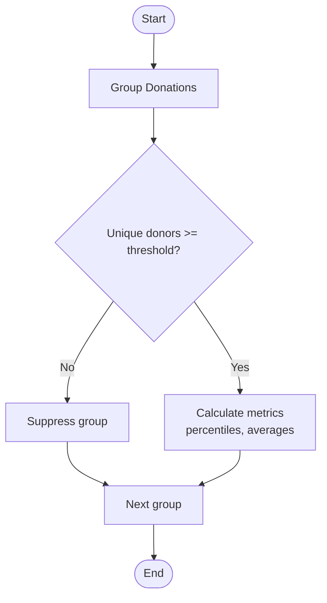

**Diagram sources**
- [daily_aggregation.py:82-142](file://data/src/pipelines/donation_analytics/daily_aggregation.py#L82-L142)
- [daily_aggregation.py:170-214](file://data/src/pipelines/donation_analytics/daily_aggregation.py#L170-L214)

**Section sources**
- [daily_aggregation.py:62-242](file://data/src/pipelines/donation_analytics/daily_aggregation.py#L62-L242)

### GDPR Retention and Legal Holds
- RetentionManager enforces retention rules per data type and checks legal holds before any deletion.
- LegalHoldRegistry tracks active holds and prevents deletion when applicable.
- Provides dry-run support and detailed stats for audits.

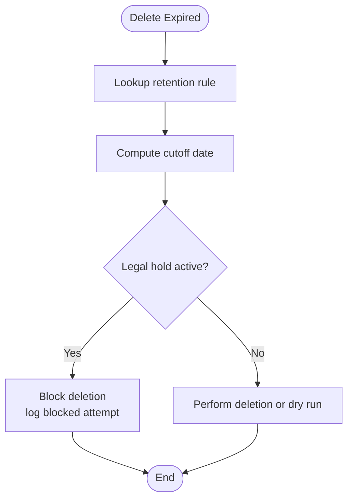

**Diagram sources**
- [retention_manager.py:206-336](file://data/src/gdpr/retention_manager.py#L206-L336)

**Section sources**
- [retention_manager.py:188-336](file://data/src/gdpr/retention_manager.py#L188-L336)

### K-Anonymity and Country-Specific Thresholds
- KAnonymizer provides country-specific k-values based on regulatory guidance.
- Supports anonymization of direct identifiers and count rounding to satisfy k-anonymity.

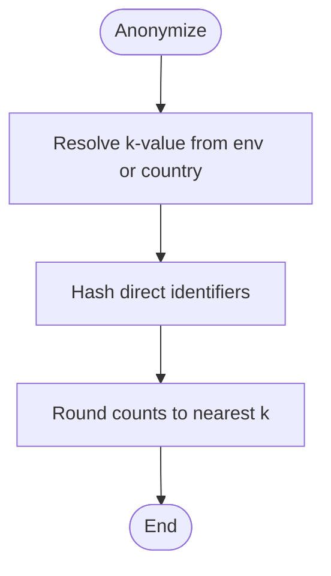

**Diagram sources**
- [anonymizer.py:25-83](file://data/src/gdpr/anonymizer.py#L25-L83)
- [anonymizer.py:106-143](file://data/src/gdpr/anonymizer.py#L106-L143)

**Section sources**
- [anonymizer.py:25-83](file://data/src/gdpr/anonymizer.py#L25-L83)
- [anonymizer.py:106-143](file://data/src/gdpr/anonymizer.py#L106-L143)

### Audit Logging and Compliance Reports
- AuditLogger writes tamper-evident events with hash chains and HMAC signatures.
- Supports querying events and generating compliance reports summarizing actions and GDPR requests.

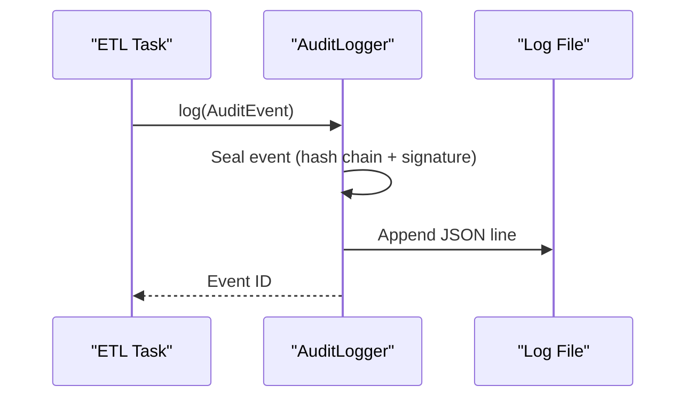

**Diagram sources**
- [audit.py:205-369](file://data/src/audit.py#L205-L369)
- [audit.py:475-511](file://data/src/audit.py#L475-L511)

**Section sources**
- [audit.py:205-369](file://data/src/audit.py#L205-L369)
- [audit.py:475-511](file://data/src/audit.py#L475-L511)

### Extending the Pipeline with New Data Sources and Processors
- Add a new country pipeline:
  - Copy template_sync.py to a new file named after the country code.
  - Configure CountrySyncConfig with country_code, timezone, language, currency, and retention_days.
  - Implement sync_entities, sync_donations, and sync_events methods.
  - Register the country in PROCESSING_ACTIVITIES if needed.
- Integrate with DAGs:
  - Ensure the new country is included in the EU_COUNTRIES list in jol_daily_sync.py.
  - Use existing processors and validators to handle data transformations and validations.
- Example references:
  - Template implementation and steps are documented in template_sync.py.

**Section sources**
- [template_sync.py:22-66](file://data/src/pipelines/country_sync/template_sync.py#L22-L66)
- [template_sync.py:84-127](file://data/src/pipelines/country_sync/template_sync.py#L84-L127)
- [jol_daily_sync.py:75-101](file://data/airflow/dags/jol_daily_sync.py#L75-L101)
- [config.py:85-124](file://data/src/config.py#L85-L124)

## Dependency Analysis
- DAG-level dependencies:
  - jol_daily_sync: start -> country_sync (parallel) -> data_quality_checks -> aggregate_donations -> retention_cleanup -> compliance_report -> end.
  - jol_hub_daily_etl: start -> process_donations -> validate_data_quality -> retention_cleanup -> generate_compliance_report -> end.
  - jol_gdpr_cleanup: start -> cleanup_operational_logs & cleanup_user_activity (parallel) -> verify_deletions -> end.
- Module-level dependencies:
  - Processors depend on config and audit.
  - Validators depend on config.
  - Aggregation depends on anonymizer and audit.
  - Retention manager depends on audit and legal hold registry.

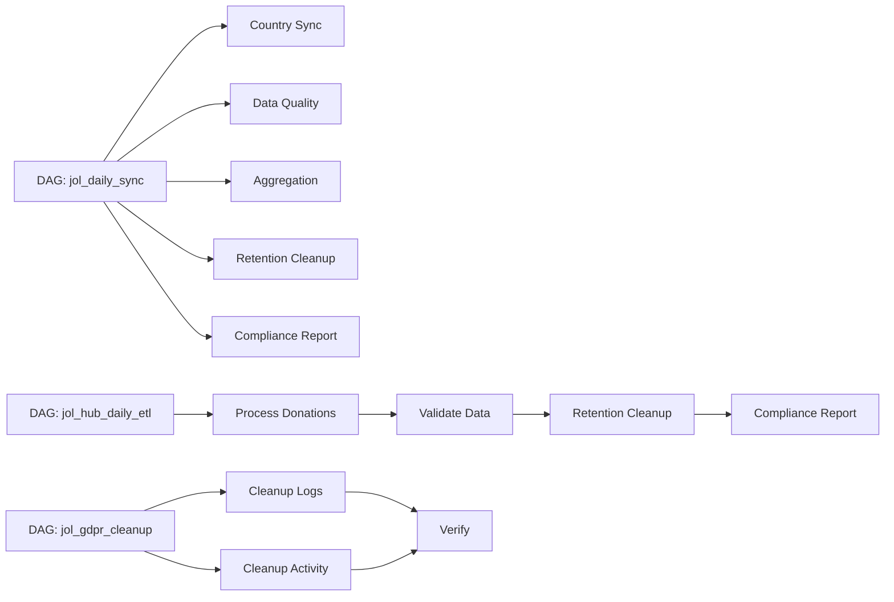

**Diagram sources**
- [jol_daily_sync.py:83-125](file://data/airflow/dags/jol_daily_sync.py#L83-L125)
- [jol_hub_etl.py:73-113](file://data/airflow/dags/jol_hub_etl.py#L73-L113)
- [jol_gdpr_cleanup.py:36-67](file://data/airflow/dags/jol_gdpr_cleanup.py#L36-L67)

**Section sources**
- [jol_daily_sync.py:83-125](file://data/airflow/dags/jol_daily_sync.py#L83-L125)
- [jol_hub_etl.py:73-113](file://data/airflow/dags/jol_hub_etl.py#L73-L113)
- [jol_gdpr_cleanup.py:36-67](file://data/airflow/dags/jol_gdpr_cleanup.py#L36-L67)

## Performance Considerations
- Parallelism:
  - Use TaskGroup for parallel country synchronization to reduce overall runtime.
- Batch sizes and timeouts:
  - Adjust max_batch_size and max_processing_time_minutes in DataModuleConfig for throughput vs. memory trade-offs.
- K-anonymity thresholds:
  - Increase k for stricter privacy requirements; note that higher k may suppress more groups.
- Database connections:
  - Ensure connection pooling and appropriate timeouts for high-volume operations.
- Audit logging overhead:
  - AuditLogger appends to files; consider log rotation and storage capacity planning.

[No sources needed since this section provides general guidance]

## Troubleshooting Guide
- Common issues:
  - Missing required fields in donations or users: Validators will flag errors; check input schemas.
  - Invalid email formats: Detected by validators; correct formatting or mask appropriately.
  - Large donations triggering warnings: Review for compliance and potential AML checks.
  - Deletion blocked by legal holds: Check LegalHoldRegistry and lift holds when appropriate.
  - Audit log integrity issues: Use verify_chain to detect chain breaks or invalid signatures.
- Monitoring:
  - Airflow UI: Inspect task states, durations, and logs.
  - Audit logs: Query events and generate compliance reports for trends and anomalies.
  - Retention stats: Monitor deleted/skipped counts during cleanup tasks.

**Section sources**
- [validators.py:201-293](file://data/src/validators.py#L201-L293)
- [retention_manager.py:248-336](file://data/src/gdpr/retention_manager.py#L248-L336)
- [audit.py:513-624](file://data/src/audit.py#L513-L624)

## Conclusion
The daily ETL pipeline provides a robust, GDPR-compliant workflow for processing donations, validating data, aggregating analytics with k-anonymity, and enforcing retention policies. The modular design allows easy extension with new countries and data sources while maintaining strong audit trails and compliance reporting. Proper configuration, monitoring, and troubleshooting practices ensure reliable operation across all 27 EU countries.

[No sources needed since this section summarizes without analyzing specific files]

## Appendices

### Configuration Parameters and Scheduling
- Airflow configuration:
  - DAGs folder, plugins folder, base log folder, database connection, web server settings, logging level, and scheduler interval.
- Data module configuration:
  - Database and Redis hosts/ports, GDPR toggles, batch size, processing time limits, default retention days.
- Retention policies:
  - Financial records: 7 years.
  - User data: 2 years.
  - Operational logs: 90 days.
  - Backups: 30 days.

**Section sources**
- [airflow.cfg:1-25](file://data/airflow/config/airflow.cfg#L1-L25)
- [config.py:55-82](file://data/src/config.py#L55-L82)
- [config.py:20-27](file://data/src/config.py#L20-L27)