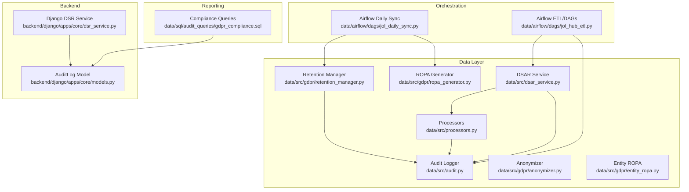
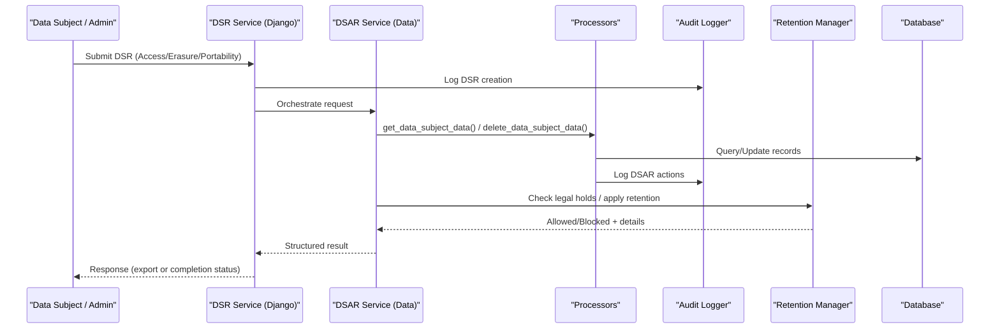
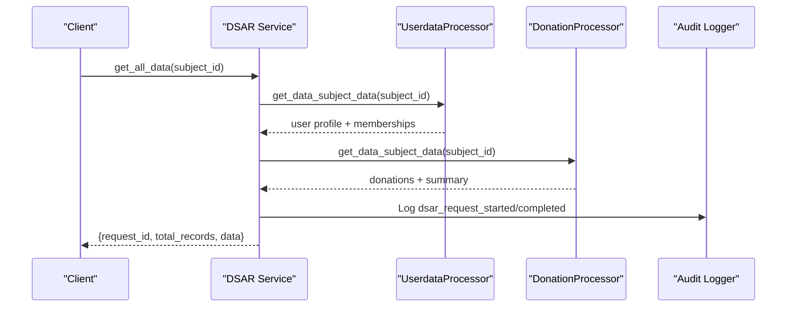
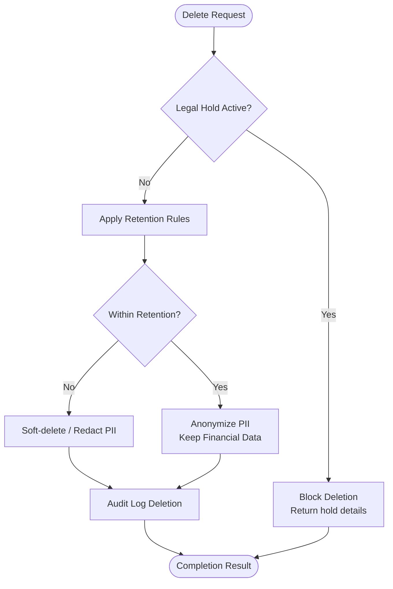
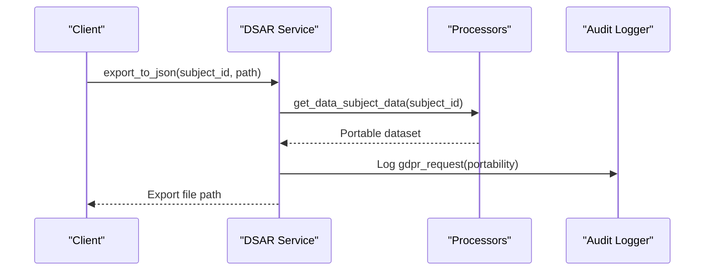
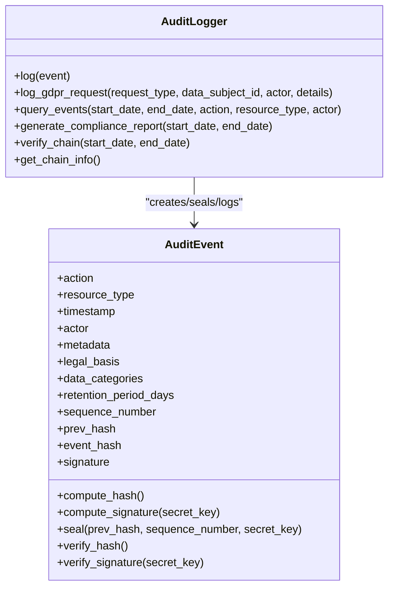
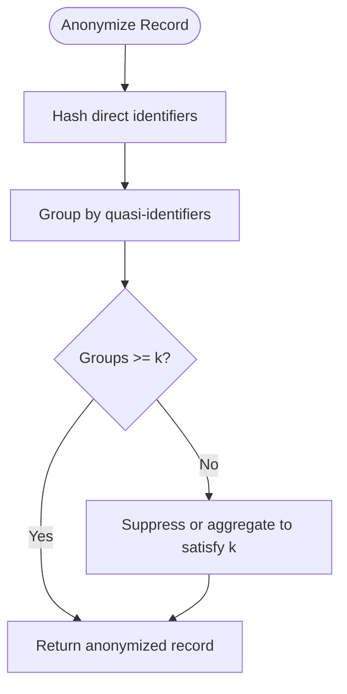
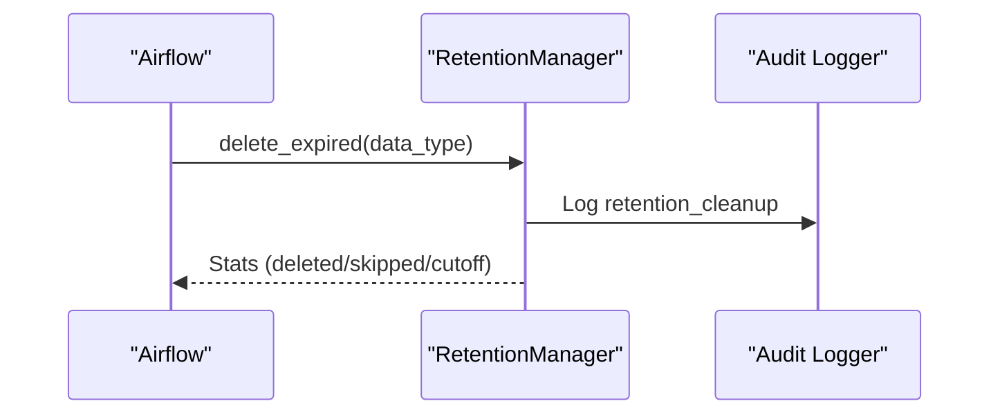
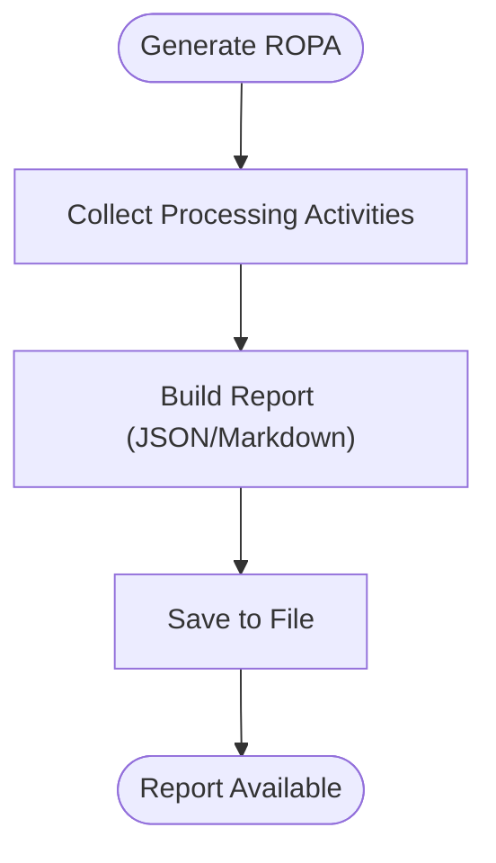
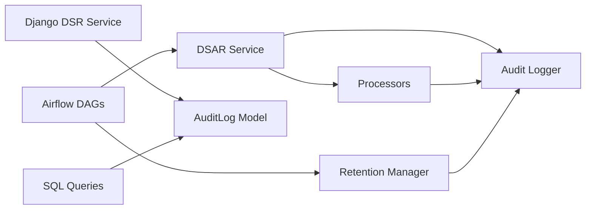

# GDPR Compliance Workflows

<cite>
**Referenced Files in This Document**
- [dsar_service.py](file://data/src/dsar_service.py)
- [processors.py](file://data/src/processors.py)
- [audit.py](file://data/src/audit.py)
- [retention_manager.py](file://data/src/gdpr/retention_manager.py)
- [anonymizer.py](file://data/src/gdpr/anonymizer.py)
- [ropa_generator.py](file://data/src/gdpr/ropa_generator.py)
- [entity_ropa.py](file://data/src/gdpr/entity_ropa.py)
- [models.py](file://backend/django/apps/core/models.py)
- [dsr_service.py](file://backend/django/apps/core/dsr_service.py)
- [jol_daily_sync.py](file://data/airflow/dags/jol_daily_sync.py)
- [jol_hub_etl.py](file://data/airflow/dags/jol_hub_etl.py)
- [gdpr_compliance.sql](file://data/sql/audit_queries/gdpr_compliance.sql)
</cite>

## Table of Contents
1. [Introduction](#introduction)
2. [Project Structure](#project-structure)
3. [Core Components](#core-components)
4. [Architecture Overview](#architecture-overview)
5. [Detailed Component Analysis](#detailed-component-analysis)
6. [Dependency Analysis](#dependency-analysis)
7. [Performance Considerations](#performance-considerations)
8. [Troubleshooting Guide](#troubleshooting-guide)
9. [Conclusion](#conclusion)
10. [Appendices](#appendices)

## Introduction
This document explains how the repository implements GDPR compliance workflows for data subject requests, retention cleanup, and compliance reporting. It focuses on:
- Data Subject Access Requests (GDPR Article 15)
- Right to Erasure (GDPR Article 17), including legal hold handling
- Right to Data Portability (GDPR Article 20)
- Audit logging with integrity protection
- Data anonymization and k-anonymity
- Retention policies and automated cleanup
- Compliance verification and reporting

The implementation spans Python services, Airflow DAGs, Django models, and SQL queries to provide end-to-end coverage from request ingestion to audit trails and reports.

## Project Structure
The GDPR-related functionality is distributed across several modules:
- Data processing and DSAR orchestration in the data layer
- Django-based DSR service and audit model in the backend
- Airflow DAGs for scheduled cleanup and report generation
- ROPA generator for Records of Processing Activities
- SQL queries for compliance auditing

**Diagram sources**
- [dsar_service.py:59-157](file://data/src/dsar_service.py#L59-L157)
- [processors.py:94-220](file://data/src/processors.py#L94-L220)
- [audit.py:205-369](file://data/src/audit.py#L205-L369)
- [retention_manager.py:188-336](file://data/src/gdpr/retention_manager.py#L188-L336)
- [anonymizer.py:106-180](file://data/src/gdpr/anonymizer.py#L106-L180)
- [ropa_generator.py:103-182](file://data/src/gdpr/ropa_generator.py#L103-L182)
- [entity_ropa.py:39-66](file://data/src/gdpr/entity_ropa.py#L39-L66)
- [dsr_service.py:36-128](file://backend/django/apps/core/dsr_service.py#L36-L128)
- [models.py:67-151](file://backend/django/apps/core/models.py#L67-L151)
- [jol_daily_sync.py:53-72](file://data/airflow/dags/jol_daily_sync.py#L53-L72)
- [jol_hub_etl.py:116-213](file://data/airflow/dags/jol_hub_etl.py#L116-L213)
- [gdpr_compliance.sql:1-66](file://data/sql/audit_queries/gdpr_compliance.sql#L1-L66)

**Section sources**
- [dsar_service.py:59-157](file://data/src/dsar_service.py#L59-L157)
- [processors.py:94-220](file://data/src/processors.py#L94-L220)
- [audit.py:205-369](file://data/src/audit.py#L205-L369)
- [retention_manager.py:188-336](file://data/src/gdpr/retention_manager.py#L188-L336)
- [anonymizer.py:106-180](file://data/src/gdpr/anonymizer.py#L106-L180)
- [ropa_generator.py:103-182](file://data/src/gdpr/ropa_generator.py#L103-L182)
- [entity_ropa.py:39-66](file://data/src/gdpr/entity_ropa.py#L39-L66)
- [dsr_service.py:36-128](file://backend/django/apps/core/dsr_service.py#L36-L128)
- [models.py:67-151](file://backend/django/apps/core/models.py#L67-L151)
- [jol_daily_sync.py:53-72](file://data/airflow/dags/jol_daily_sync.py#L53-L72)
- [jol_hub_etl.py:116-213](file://data/airflow/dags/jol_hub_etl.py#L116-L213)
- [gdpr_compliance.sql:1-66](file://data/sql/audit_queries/gdpr_compliance.sql#L1-L66)

## Core Components
- DSAR Service: Orchestrates access, erasure, and portability requests across processors; logs all steps; returns structured results.
- Processors: Implement per-domain data retrieval and deletion with retention rules and audit logging.
- Audit Logger: Provides tamper-evident, hash-chained audit events with HMAC signatures and chain verification.
- Retention Manager: Enforces storage limitation and right to erasure with legal hold checks and retention rules.
- Anonymizer: Implements k-anonymity thresholds by country and direct identifier hashing for safe exports.
- ROPA Generator: Produces Records of Processing Activities for compliance documentation.
- Django DSR Service and AuditLog Model: Provide backend request lifecycle, consent management, and immutable audit trail.
- Airflow DAGs: Schedule retention cleanup and compliance reporting tasks.
- SQL Queries: Support compliance audits and retention status checks.

**Section sources**
- [dsar_service.py:59-157](file://data/src/dsar_service.py#L59-L157)
- [processors.py:94-220](file://data/src/processors.py#L94-L220)
- [audit.py:205-369](file://data/src/audit.py#L205-L369)
- [retention_manager.py:188-336](file://data/src/gdpr/retention_manager.py#L188-L336)
- [anonymizer.py:106-180](file://data/src/gdpr/anonymizer.py#L106-L180)
- [ropa_generator.py:103-182](file://data/src/gdpr/ropa_generator.py#L103-L182)
- [dsr_service.py:36-128](file://backend/django/apps/core/dsr_service.py#L36-L128)
- [models.py:67-151](file://backend/django/apps/core/models.py#L67-L151)
- [jol_daily_sync.py:53-72](file://data/airflow/dags/jol_daily_sync.py#L53-L72)
- [jol_hub_etl.py:116-213](file://data/airflow/dags/jol_hub_etl.py#L116-L213)
- [gdpr_compliance.sql:1-66](file://data/sql/audit_queries/gdpr_compliance.sql#L1-L66)

## Architecture Overview
The system coordinates multiple components to fulfill GDPR obligations:
- Inbound requests are handled by either the data-layer DSAR Service or the Django DSR Service.
- Processors retrieve or delete domain-specific data while applying retention and privacy rules.
- All operations are recorded in a tamper-evident audit log with hash chains and HMAC signatures.
- Scheduled jobs perform retention cleanup and generate ROPA reports.
- SQL queries support ongoing compliance monitoring.

**Diagram sources**
- [dsr_service.py:81-128](file://backend/django/apps/core/dsr_service.py#L81-L128)
- [dsar_service.py:88-157](file://data/src/dsar_service.py#L88-L157)
- [processors.py:282-503](file://data/src/processors.py#L282-L503)
- [retention_manager.py:257-336](file://data/src/gdpr/retention_manager.py#L257-L336)
- [audit.py:330-369](file://data/src/audit.py#L330-L369)

## Detailed Component Analysis

### Data Subject Access Request (Article 15)
- The DSAR Service collects personal data from all processors and returns a machine-readable export.
- Each processor implements retrieval logic with audit logging and error handling.
- The Django DSR Service provides request lifecycle management and audit logging via the AuditLog model.

**Diagram sources**
- [dsar_service.py:88-157](file://data/src/dsar_service.py#L88-L157)
- [processors.py:570-666](file://data/src/processors.py#L570-L666)
- [processors.py:282-379](file://data/src/processors.py#L282-L379)
- [audit.py:391-407](file://data/src/audit.py#L391-L407)

**Section sources**
- [dsar_service.py:88-157](file://data/src/dsar_service.py#L88-L157)
- [processors.py:570-666](file://data/src/processors.py#L570-L666)
- [processors.py:282-379](file://data/src/processors.py#L282-L379)
- [audit.py:391-407](file://data/src/audit.py#L391-L407)

### Right to Erasure (Article 17)
- Deletion flows check for legal holds before any deletion.
- Retention rules determine which records can be deleted versus retained (e.g., financial records).
- Processors implement soft-delete or anonymization strategies based on retention periods.
- The Django DSR Service enforces organization-level legal holds and canonical record exceptions.

**Diagram sources**
- [retention_manager.py:257-336](file://data/src/gdpr/retention_manager.py#L257-L336)
- [processors.py:381-503](file://data/src/processors.py#L381-L503)
- [dsr_service.py:194-252](file://backend/django/apps/core/dsr_service.py#L194-L252)

**Section sources**
- [retention_manager.py:257-336](file://data/src/gdpr/retention_manager.py#L257-L336)
- [processors.py:381-503](file://data/src/processors.py#L381-L503)
- [dsr_service.py:194-252](file://backend/django/apps/core/dsr_service.py#L194-L252)

### Right to Data Portability (Article 20)
- The DSAR Service supports exporting data in JSON format.
- Processors return structured, machine-readable datasets suitable for portability.
- Airflow DAGs include tasks to process portability requests and log them.

**Diagram sources**
- [dsar_service.py:269-289](file://data/src/dsar_service.py#L269-L289)
- [processors.py:282-379](file://data/src/processors.py#L282-L379)
- [audit.py:391-407](file://data/src/audit.py#L391-L407)
- [jol_hub_etl.py:147-193](file://data/airflow/dags/jol_hub_etl.py#L147-L193)

**Section sources**
- [dsar_service.py:269-289](file://data/src/dsar_service.py#L269-L289)
- [processors.py:282-379](file://data/src/processors.py#L282-L379)
- [audit.py:391-407](file://data/src/audit.py#L391-L407)
- [jol_hub_etl.py:147-193](file://data/airflow/dags/jol_hub_etl.py#L147-L193)

### Audit Logging Mechanisms
- The AuditLogger creates tamper-evident events with:
  - Hash chain linking each event to the previous one
  - HMAC signature using a secret key
  - Monotonically increasing sequence numbers
- Events include GDPR fields such as legal basis, data categories, and retention period.
- Chain verification tools detect insertions, modifications, or gaps.

**Diagram sources**
- [audit.py:65-203](file://data/src/audit.py#L65-L203)
- [audit.py:205-369](file://data/src/audit.py#L205-L369)
- [audit.py:475-589](file://data/src/audit.py#L475-L589)

**Section sources**
- [audit.py:65-203](file://data/src/audit.py#L65-L203)
- [audit.py:205-369](file://data/src/audit.py#L205-L369)
- [audit.py:475-589](file://data/src/audit.py#L475-L589)

### Data Anonymization Processes
- Country-specific k-anonymity thresholds ensure groups meet minimum sizes.
- Direct identifiers are hashed for safe exports.
- Counts are rounded to nearest k to prevent re-identification.

**Diagram sources**
- [anonymizer.py:106-180](file://data/src/gdpr/anonymizer.py#L106-L180)

**Section sources**
- [anonymizer.py:106-180](file://data/src/gdpr/anonymizer.py#L106-L180)

### Retention Cleanup
- RetentionManager applies predefined retention rules per data type.
- Legal holds block deletions even when retention expires.
- Airflow daily sync triggers cleanup for operational logs and user activity.

**Diagram sources**
- [retention_manager.py:206-246](file://data/src/gdpr/retention_manager.py#L206-L246)
- [jol_daily_sync.py:53-62](file://data/airflow/dags/jol_daily_sync.py#L53-L62)
- [audit.py:330-369](file://data/src/audit.py#L330-L369)

**Section sources**
- [retention_manager.py:206-246](file://data/src/gdpr/retention_manager.py#L206-L246)
- [jol_daily_sync.py:53-62](file://data/airflow/dags/jol_daily_sync.py#L53-L62)
- [audit.py:330-369](file://data/src/audit.py#L330-L369)

### Compliance Reporting
- ROPA Generator produces Records of Processing Activities for controllers and entity types.
- Entity-specific activities define purposes, legal bases, retention, and security measures.
- SQL queries support compliance audits and retention status checks.

**Diagram sources**
- [ropa_generator.py:103-182](file://data/src/gdpr/ropa_generator.py#L103-L182)
- [entity_ropa.py:762-797](file://data/src/gdpr/entity_ropa.py#L762-L797)
- [gdpr_compliance.sql:1-66](file://data/sql/audit_queries/gdpr_compliance.sql#L1-L66)

**Section sources**
- [ropa_generator.py:103-182](file://data/src/gdpr/ropa_generator.py#L103-L182)
- [entity_ropa.py:762-797](file://data/src/gdpr/entity_ropa.py#L762-L797)
- [gdpr_compliance.sql:1-66](file://data/sql/audit_queries/gdpr_compliance.sql#L1-L66)

## Dependency Analysis
Key dependencies and relationships:
- DSAR Service depends on Processors and Audit Logger.
- Processors depend on database connections and Audit Logger.
- Retention Manager depends on Audit Logger and LegalHoldRegistry.
- Django DSR Service depends on AuditLog model and Organization context.
- Airflow DAGs invoke DSAR and Retention functions and log via Audit Logger.
- SQL queries rely on AuditLog and retention tables for reporting.

**Diagram sources**
- [dsar_service.py:88-157](file://data/src/dsar_service.py#L88-L157)
- [processors.py:94-220](file://data/src/processors.py#L94-L220)
- [retention_manager.py:188-336](file://data/src/gdpr/retention_manager.py#L188-L336)
- [dsr_service.py:36-128](file://backend/django/apps/core/dsr_service.py#L36-L128)
- [models.py:67-151](file://backend/django/apps/core/models.py#L67-L151)
- [jol_daily_sync.py:53-72](file://data/airflow/dags/jol_daily_sync.py#L53-L72)
- [jol_hub_etl.py:116-213](file://data/airflow/dags/jol_hub_etl.py#L116-L213)
- [gdpr_compliance.sql:1-66](file://data/sql/audit_queries/gdpr_compliance.sql#L1-L66)

**Section sources**
- [dsar_service.py:88-157](file://data/src/dsar_service.py#L88-L157)
- [processors.py:94-220](file://data/src/processors.py#L94-L220)
- [retention_manager.py:188-336](file://data/src/gdpr/retention_manager.py#L188-L336)
- [dsr_service.py:36-128](file://backend/django/apps/core/dsr_service.py#L36-L128)
- [models.py:67-151](file://backend/django/apps/core/models.py#L67-L151)
- [jol_daily_sync.py:53-72](file://data/airflow/dags/jol_daily_sync.py#L53-L72)
- [jol_hub_etl.py:116-213](file://data/airflow/dags/jol_hub_etl.py#L116-L213)
- [gdpr_compliance.sql:1-66](file://data/sql/audit_queries/gdpr_compliance.sql#L1-L66)

## Performance Considerations
- Batch processing: DSAR Service aggregates results across processors; consider pagination for large datasets.
- Database queries: Processors use targeted queries; ensure indexes on donor_id/user_id and created_at for performance.
- Audit log rotation: Daily log files reduce I/O overhead; verify disk space and retention settings.
- k-anonymity grouping: Grouping by quasi-identifiers can be expensive; limit group fields and pre-filter datasets.
- Legal hold checks: Central registry lookup should be cached where appropriate to avoid repeated scans.

[No sources needed since this section provides general guidance]

## Troubleshooting Guide
Common issues and resolutions:
- Legal hold blocks erasure: Check active holds and lift if appropriate; review hold details returned by RetentionManager.
- Missing retention rule: Ensure data_type has a corresponding rule; otherwise cleanup will return an error.
- Audit chain integrity failures: Use verify_chain to detect breaks; investigate missing events or tampering.
- DSAR processor errors: Inspect processor logs and database connectivity; validate required fields and permissions.
- Export size limits: For large datasets, consider streaming or segmented exports; apply anonymization to reduce risk.

**Section sources**
- [retention_manager.py:257-336](file://data/src/gdpr/retention_manager.py#L257-L336)
- [audit.py:513-589](file://data/src/audit.py#L513-L589)
- [processors.py:282-503](file://data/src/processors.py#L282-L503)

## Conclusion
The repository provides a comprehensive GDPR compliance framework:
- Robust DSAR handling for Articles 15, 17, and 20
- Tamper-evident audit logging with chain verification
- Configurable retention policies with legal hold enforcement
- Anonymization techniques aligned with national guidance
- Automated scheduling for cleanup and reporting
- SQL-backed compliance queries for ongoing assurance

Adopting these workflows ensures accountability, transparency, and defensibility in data processing practices.

[No sources needed since this section summarizes without analyzing specific files]

## Appendices

### Examples of Triggering GDPR Requests
- Access Request:
  - Use DSAR Service to retrieve all data for a subject; processors return portable datasets.
  - Reference: [dsar_service.py:88-157](file://data/src/dsar_service.py#L88-L157), [processors.py:570-666](file://data/src/processors.py#L570-L666)
- Erasure Request:
  - Call deletion flow; legal holds are checked first; retention rules applied per data type.
  - Reference: [retention_manager.py:257-336](file://data/src/gdpr/retention_manager.py#L257-L336), [processors.py:381-503](file://data/src/processors.py#L381-L503)
- Portability Request:
  - Export data to JSON; Airflow DAGs can process and log portability tasks.
  - Reference: [dsar_service.py:269-289](file://data/src/dsar_service.py#L269-L289), [jol_hub_etl.py:147-193](file://data/airflow/dags/jol_hub_etl.py#L147-L193)

### Monitoring Execution
- Audit logs: Query events by date range, action, or resource type; verify chain integrity.
  - Reference: [audit.py:409-473](file://data/src/audit.py#L409-L473), [audit.py:513-589](file://data/src/audit.py#L513-L589)
- Compliance reports: Generate ROPA and retention summaries; use SQL queries for dashboards.
  - Reference: [ropa_generator.py:121-182](file://data/src/gdpr/ropa_generator.py#L121-L182), [gdpr_compliance.sql:1-66](file://data/sql/audit_queries/gdpr_compliance.sql#L1-L66)

### Security Considerations and Best Practices
- Protect audit secret keys and restrict file permissions.
- Enforce tenant isolation in Django audit logs to prevent cross-tenant leakage.
- Apply k-anonymity thresholds appropriate to jurisdiction; prefer higher k for sensitive contexts.
- Minimize PII in exports; anonymize or redact where retention allows.
- Regularly verify audit chain integrity and investigate anomalies promptly.

**Section sources**
- [audit.py:225-286](file://data/src/audit.py#L225-L286)
- [models.py:156-200](file://backend/django/apps/core/models.py#L156-L200)
- [anonymizer.py:25-83](file://data/src/gdpr/anonymizer.py#L25-L83)