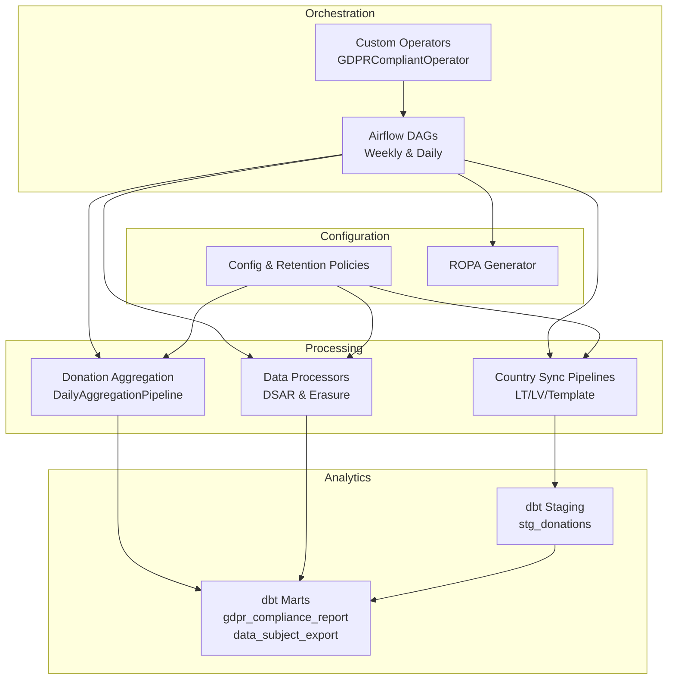
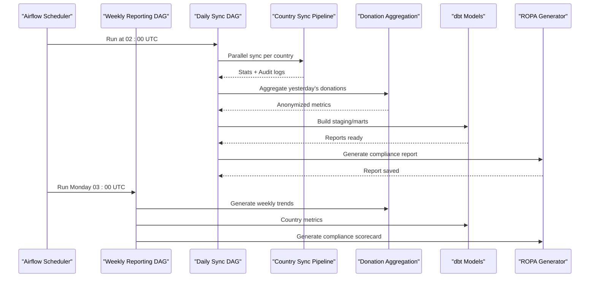
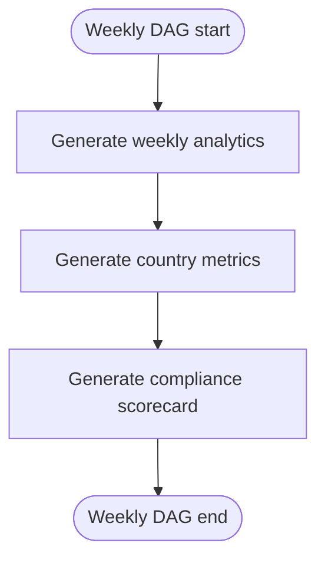
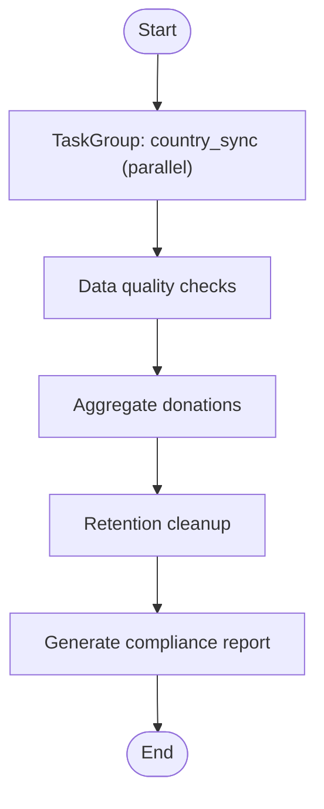
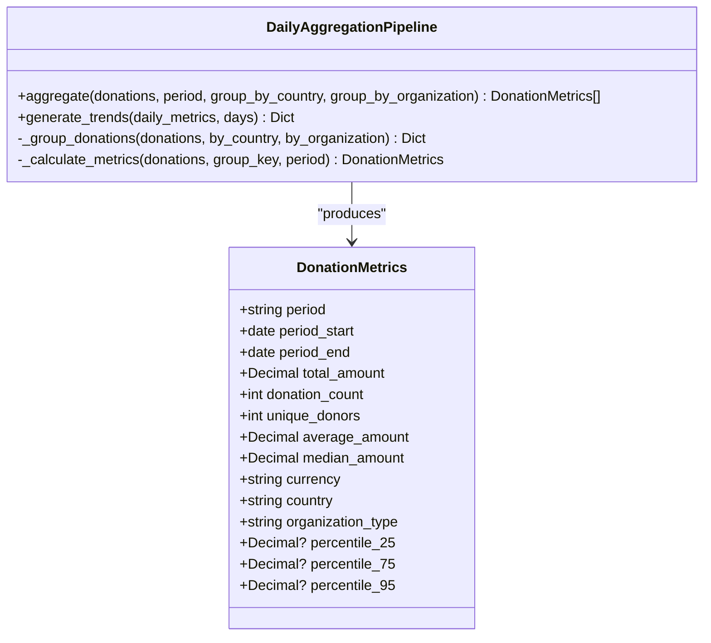
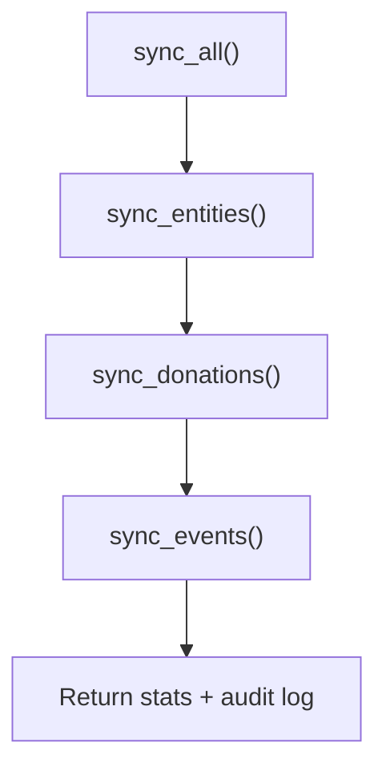
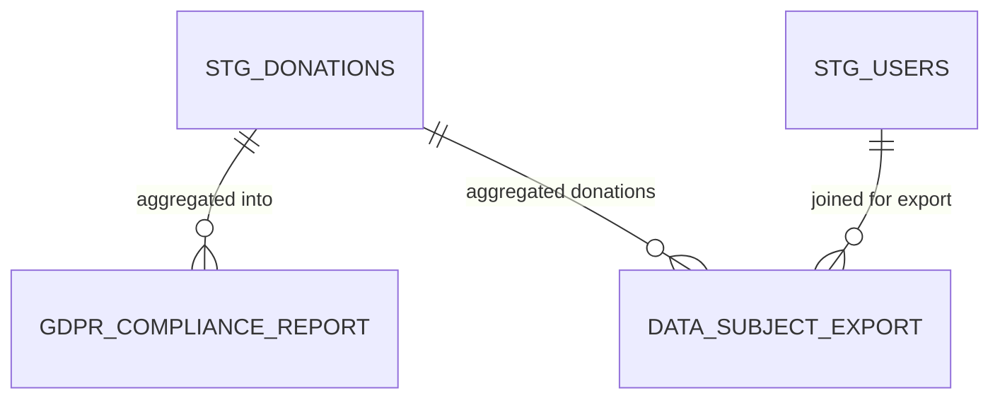
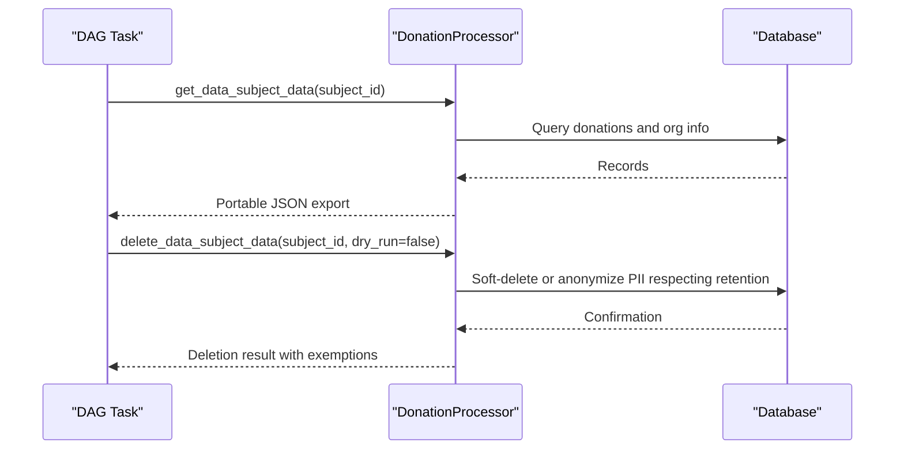
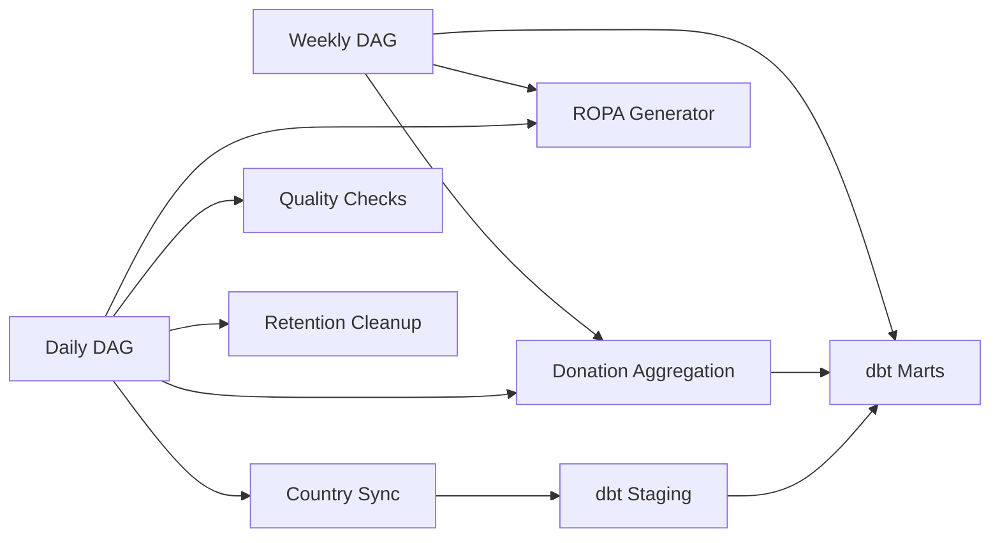

# Reporting Pipelines

<cite>
**Referenced Files in This Document**
- [jol_weekly_reporting.py](file://data/airflow/dags/jol_weekly_reporting.py)
- [jol_daily_sync.py](file://data/airflow/dags/jol_daily_sync.py)
- [jol_hub_etl.py](file://data/airflow/dags/jol_hub_etl.py)
- [daily_aggregation.py](file://data/src/pipelines/donation_analytics/daily_aggregation.py)
- [lt_sync.py](file://data/src/pipelines/country_sync/lt_sync.py)
- [template_sync.py](file://data/src/pipelines/country_sync/template_sync.py)
- [gdpr_compliance_report.sql](file://data/dbt/models/marts/gdpr_compliance_report.sql)
- [stg_donations.sql](file://data/dbt/models/staging/stg_donations.sql)
- [data_subject_export.sql](file://data/dbt/models/marts/data_subject_export.sql)
- [config.py](file://data/src/config.py)
- [processors.py](file://data/src/processors.py)
- [ropa_generator.py](file://data/src/gdpr/ropa_generator.py)
- [jol_operators.py](file://data/airflow/plugins/jol_operators.py)
</cite>

## Table of Contents
1. [Introduction](#introduction)
2. [Project Structure](#project-structure)
3. [Core Components](#core-components)
4. [Architecture Overview](#architecture-overview)
5. [Detailed Component Analysis](#detailed-component-analysis)
6. [Dependency Analysis](#dependency-analysis)
7. [Performance Considerations](#performance-considerations)
8. [Troubleshooting Guide](#troubleshooting-guide)
9. [Conclusion](#conclusion)
10. [Appendices](#appendices)

## Introduction
This document explains the reporting and synchronization pipelines that power weekly analytics, daily data ingestion, GDPR compliance reporting, and cross-country data synchronization. It covers:
- Weekly reporting DAG structure and report generation workflows
- Daily sync operations for external integrations and country-specific pipelines
- Data aggregation processes with privacy-preserving techniques (k-anonymity)
- Configuration options for formats, scheduling, and notifications
- Examples for creating custom reports and integrating with external tools
- Performance considerations for large datasets

## Project Structure
The reporting and sync system is orchestrated by Airflow DAGs, implemented with Python tasks and dbt models, and backed by processors and configuration modules. Key areas:
- Orchestration: Airflow DAGs define schedules, dependencies, retries, and email alerts
- Processing: Python modules implement ETL, aggregation, anonymization, and DSAR handling
- Analytics: dbt models transform staging data into marts for compliance and export
- Country sync: Reusable templates and country-specific implementations standardize ingestion
- Compliance: ROPA generator and retention policies ensure GDPR alignment

**Diagram sources**
- [jol_weekly_reporting.py:52-78](file://data/airflow/dags/jol_weekly_reporting.py#L52-L78)
- [jol_daily_sync.py:83-126](file://data/airflow/dags/jol_daily_sync.py#L83-L126)
- [daily_aggregation.py:62-142](file://data/src/pipelines/donation_analytics/daily_aggregation.py#L62-L142)
- [lt_sync.py:48-140](file://data/src/pipelines/country_sync/lt_sync.py#L48-L140)
- [gdpr_compliance_report.sql:4-68](file://data/dbt/models/marts/gdpr_compliance_report.sql#L4-L68)
- [stg_donations.sql:4-36](file://data/dbt/models/staging/stg_donations.sql#L4-L36)
- [config.py:20-79](file://data/src/config.py#L20-L79)
- [ropa_generator.py:103-182](file://data/src/gdpr/ropa_generator.py#L103-L182)
- [jol_operators.py:10-35](file://data/airflow/plugins/jol_operators.py#L10-L35)

**Section sources**
- [jol_weekly_reporting.py:1-78](file://data/airflow/dags/jol_weekly_reporting.py#L1-L78)
- [jol_daily_sync.py:1-126](file://data/airflow/dags/jol_daily_sync.py#L1-L126)
- [daily_aggregation.py:1-242](file://data/src/pipelines/donation_analytics/daily_aggregation.py#L1-L242)
- [lt_sync.py:1-207](file://data/src/pipelines/country_sync/lt_sync.py#L1-L207)
- [template_sync.py:1-163](file://data/src/pipelines/country_sync/template_sync.py#L1-L163)
- [gdpr_compliance_report.sql:1-68](file://data/dbt/models/marts/gdpr_compliance_report.sql#L1-L68)
- [stg_donations.sql:1-36](file://data/dbt/models/staging/stg_donations.sql#L1-L36)
- [data_subject_export.sql:1-55](file://data/dbt/models/marts/data_subject_export.sql#L1-L55)
- [config.py:1-124](file://data/src/config.py#L1-L124)
- [processors.py:1-762](file://data/src/processors.py#L1-L762)
- [ropa_generator.py:1-182](file://data/src/gdpr/ropa_generator.py#L1-L182)
- [jol_operators.py:1-35](file://data/airflow/plugins/jol_operators.py#L1-L35)

## Core Components
- Weekly reporting DAG: Orchestrates weekly analytics, country metrics, and compliance scorecard generation on a Monday schedule.
- Daily sync DAG: Runs parallel country syncs across EU countries, followed by data quality checks, donation aggregation, retention cleanup, and compliance reporting.
- Donation aggregation pipeline: Groups donations, enforces k-anonymity thresholds, computes metrics and percentiles, and produces anonymized trends.
- Country sync pipelines: Template-based and country-specific implementations fetch, validate, anonymize, and load data with full audit logging.
- dbt models: Staging and mart layers produce GDPR-compliant views and tables for reporting and data subject exports.
- Configuration and compliance: Centralized retention policies, processing activities registry, and ROPA generation.

**Section sources**
- [jol_weekly_reporting.py:20-78](file://data/airflow/dags/jol_weekly_reporting.py#L20-L78)
- [jol_daily_sync.py:25-126](file://data/airflow/dags/jol_daily_sync.py#L25-L126)
- [daily_aggregation.py:24-242](file://data/src/pipelines/donation_analytics/daily_aggregation.py#L24-L242)
- [lt_sync.py:23-207](file://data/src/pipelines/country_sync/lt_sync.py#L23-L207)
- [template_sync.py:22-163](file://data/src/pipelines/country_sync/template_sync.py#L22-L163)
- [gdpr_compliance_report.sql:10-68](file://data/dbt/models/marts/gdpr_compliance_report.sql#L10-L68)
- [stg_donations.sql:10-36](file://data/dbt/models/staging/stg_donations.sql#L10-L36)
- [config.py:20-124](file://data/src/config.py#L20-L124)
- [ropa_generator.py:45-182](file://data/src/gdpr/ropa_generator.py#L45-L182)

## Architecture Overview
The system combines scheduled orchestration (Airflow), modular processing (Python), and SQL transformations (dbt). The weekly DAG focuses on analytics and compliance outputs; the daily DAG ensures fresh, validated, and compliant data across all countries before aggregating and reporting.

**Diagram sources**
- [jol_daily_sync.py:83-126](file://data/airflow/dags/jol_daily_sync.py#L83-L126)
- [jol_weekly_reporting.py:52-78](file://data/airflow/dags/jol_weekly_reporting.py#L52-L78)
- [daily_aggregation.py:82-142](file://data/src/pipelines/donation_analytics/daily_aggregation.py#L82-L142)
- [gdpr_compliance_report.sql:4-68](file://data/dbt/models/marts/gdpr_compliance_report.sql#L4-L68)
- [ropa_generator.py:121-182](file://data/src/gdpr/ropa_generator.py#L121-L182)

## Detailed Component Analysis

### Weekly Reporting DAG
- Schedule: Monday at 03:00 UTC
- Tasks:
  - Weekly analytics: Computes last 7 days trends using the donation aggregation pipeline
  - Country metrics: Triggers dbt models to compute country-level metrics
  - Compliance scorecard: Uses ROPAGenerator to summarize processing activities
- Dependencies: analytics -> country_metrics -> compliance

**Diagram sources**
- [jol_weekly_reporting.py:52-78](file://data/airflow/dags/jol_weekly_reporting.py#L52-L78)

**Section sources**
- [jol_weekly_reporting.py:20-78](file://data/airflow/dags/jol_weekly_reporting.py#L20-L78)

### Daily Sync DAG
- Schedule: Daily at 02:00 UTC
- Tasks:
  - Country sync group: Parallel tasks per EU country code
  - Data quality checks: Runs checkpoint runner
  - Donation aggregation: Processes previous day’s donations with k-anonymity
  - Retention cleanup: Deletes expired operational logs and user activity
  - Compliance report: Generates daily GDPR compliance report via ROPAGenerator
- Notifications: Email on failure enabled

**Diagram sources**
- [jol_daily_sync.py:83-126](file://data/airflow/dags/jol_daily_sync.py#L83-L126)

**Section sources**
- [jol_daily_sync.py:15-126](file://data/airflow/dags/jol_daily_sync.py#L15-L126)

### Donation Aggregation Pipeline
- Purpose: Produce k-anonymized analytics from financial data
- Key behaviors:
  - Groups donations by country and organization type
  - Suppresses groups below minimum donor threshold
  - Applies k-anonymity to unique donor counts
  - Computes totals, averages, medians, and percentiles when sufficient volume
  - Produces trend summaries without individual-level data
- Configuration:
  - K-anonymity threshold and minimum donors for reporting
  - Optional percentile inclusion

**Diagram sources**
- [daily_aggregation.py:32-51](file://data/src/pipelines/donation_analytics/daily_aggregation.py#L32-L51)
- [daily_aggregation.py:62-142](file://data/src/pipelines/donation_analytics/daily_aggregation.py#L62-L142)

**Section sources**
- [daily_aggregation.py:24-242](file://data/src/pipelines/donation_analytics/daily_aggregation.py#L24-L242)

### Country Sync Pipelines
- Template: Provides a standardized structure for new country pipelines
  - Enforces required fields (country_code, timezone, language, currency)
  - Implements sync_all with entity, donation, and event steps
  - Logs GDPR-related metadata and legal basis
- Lithuania implementation:
  - Defines data sources (bishopric, registry, donation system, calendar)
  - Fetch-validate-load flow for parishes and donations
  - Applies k-anonymity to donations and supports DSAR endpoints

**Diagram sources**
- [template_sync.py:84-127](file://data/src/pipelines/country_sync/template_sync.py#L84-L127)
- [lt_sync.py:72-140](file://data/src/pipelines/country_sync/lt_sync.py#L72-L140)

**Section sources**
- [template_sync.py:22-163](file://data/src/pipelines/country_sync/template_sync.py#L22-L163)
- [lt_sync.py:23-207](file://data/src/pipelines/country_sync/lt_sync.py#L23-L207)

### dbt Models for Reporting and Exports
- Staging layer:
  - stg_donations: Masks sensitive payment references based on variables and adds classification and retention expiry
- Mart layer:
  - gdpr_compliance_report: Aggregates processing activities, subjects, earliest/latest records, legal basis, retention days, and flags approaching expiry
  - data_subject_export: Joins user data with aggregated donations for portability requests

**Diagram sources**
- [stg_donations.sql:10-36](file://data/dbt/models/staging/stg_donations.sql#L10-L36)
- [gdpr_compliance_report.sql:10-68](file://data/dbt/models/marts/gdpr_compliance_report.sql#L10-L68)
- [data_subject_export.sql:13-55](file://data/dbt/models/marts/data_subject_export.sql#L13-L55)

**Section sources**
- [stg_donations.sql:1-36](file://data/dbt/models/staging/stg_donations.sql#L1-36)
- [gdpr_compliance_report.sql:1-68](file://data/dbt/models/marts/gdpr_compliance_report.sql#L1-68)
- [data_subject_export.sql:1-55](file://data/dbt/models/marts/data_subject_export.sql#L1-55)

### Data Processors and DSAR Handling
- Base processor:
  - Encapsulates pre/post hooks, audit logging, error handling, and duration tracking
- DonationProcessor:
  - Validates, transforms, stores donations
  - Implements access (Art. 15) and erasure (Art. 17) with retention-aware logic
  - Soft-deletes or anonymizes PII while retaining financial records per policy
- UserdataProcessor:
  - Applies privacy rules (masking IPs, passwords)
  - Supports access and erasure with membership constraints

**Diagram sources**
- [processors.py:94-197](file://data/src/processors.py#L94-L197)
- [processors.py:223-503](file://data/src/processors.py#L223-L503)
- [processors.py:506-762](file://data/src/processors.py#L506-L762)

**Section sources**
- [processors.py:1-762](file://data/src/processors.py#L1-L762)

### Configuration and Compliance
- Retention policies:
  - Financial and donation records retained for 7 years
  - User data retained for 2 years
  - Operational logs retained for 90 days
- Processing activities registry:
  - Documents purpose, categories, subjects, recipients, retention, security measures, and legal basis
- ROPA generator:
  - Produces structured reports in JSON or Markdown
  - Saves timestamped files and provides summary statistics

**Section sources**
- [config.py:20-124](file://data/src/config.py#L20-L124)
- [ropa_generator.py:45-182](file://data/src/gdpr/ropa_generator.py#L45-L182)

## Dependency Analysis
- DAGs depend on:
  - Country sync modules for data ingestion
  - Donation aggregation for analytics
  - dbt models for transformation and reporting
  - ROPA generator for compliance outputs
- Modules depend on:
  - Configuration for retention and processing activities
  - Audit logger for traceability
  - Database connectors for DSAR and storage

**Diagram sources**
- [jol_weekly_reporting.py:52-78](file://data/airflow/dags/jol_weekly_reporting.py#L52-L78)
- [jol_daily_sync.py:83-126](file://data/airflow/dags/jol_daily_sync.py#L83-L126)
- [daily_aggregation.py:82-142](file://data/src/pipelines/donation_analytics/daily_aggregation.py#L82-L142)
- [lt_sync.py:72-140](file://data/src/pipelines/country_sync/lt_sync.py#L72-L140)
- [gdpr_compliance_report.sql:10-68](file://data/dbt/models/marts/gdpr_compliance_report.sql#L10-L68)
- [stg_donations.sql:10-36](file://data/dbt/models/staging/stg_donations.sql#L10-L36)

**Section sources**
- [jol_weekly_reporting.py:1-78](file://data/airflow/dags/jol_weekly_reporting.py#L1-L78)
- [jol_daily_sync.py:1-126](file://data/airflow/dags/jol_daily_sync.py#L1-L126)
- [daily_aggregation.py:1-242](file://data/src/pipelines/donation_analytics/daily_aggregation.py#L1-L242)
- [lt_sync.py:1-207](file://data/src/pipelines/country_sync/lt_sync.py#L1-L207)
- [gdpr_compliance_report.sql:1-68](file://data/dbt/models/marts/gdpr_compliance_report.sql#L1-L68)
- [stg_donations.sql:1-36](file://data/dbt/models/staging/stg_donations.sql#L1-L36)

## Performance Considerations
- Batch sizes:
  - Country sync uses configurable batch sizes to manage memory and throughput
  - Aggregation processes grouped donations efficiently; consider grouping granularity to balance performance and insight
- K-anonymity thresholds:
  - Minimum donor thresholds suppress small groups; tune to avoid excessive suppression while preserving privacy
- dbt materializations:
  - Use appropriate materializations (view vs table) to optimize query performance and refresh costs
- Retention cleanup:
  - Scheduled deletion reduces dataset size over time; ensure indexes and partitioning align with cleanup strategies
- Concurrency:
  - Parallel country syncs scale horizontally; monitor task concurrency limits and resource quotas
- Auditing overhead:
  - Audit logging is comprehensive; ensure log volumes are managed and indexed appropriately

[No sources needed since this section provides general guidance]

## Troubleshooting Guide
- DAG failures:
  - Daily and weekly DAGs have retry policies and email-on-failure configured; check Airflow logs for task-level errors
  - Verify environment variables for database connectivity used by processors
- Data quality issues:
  - Quality checks run post-sync; inspect checkpoint results and adjust validation rules if necessary
- Retention and erasure:
  - DSAR erasure respects retention periods; verify exemption lists and soft-delete outcomes
- ROPA reports:
  - Ensure output directory permissions; fallback to temp directory if default path is not writable
- Custom operators:
  - GDPRCompliantOperator wraps execution with audit-friendly logs; use it for new tasks requiring consistent compliance behavior

**Section sources**
- [jol_daily_sync.py:15-22](file://data/airflow/dags/jol_daily_sync.py#L15-L22)
- [processors.py:381-503](file://data/src/processors.py#L381-L503)
- [ropa_generator.py:103-119](file://data/src/gdpr/ropa_generator.py#L103-L119)
- [jol_operators.py:10-35](file://data/airflow/plugins/jol_operators.py#L10-L35)

## Conclusion
The reporting and synchronization pipelines provide a robust, GDPR-aligned framework for weekly analytics, daily data ingestion, and compliance reporting. They combine scalable orchestration, privacy-preserving aggregation, and standardized country sync templates. With clear configuration, auditing, and dbt-driven transformations, the system supports both operational needs and regulatory requirements. Extending the system involves adding country-specific syncs, customizing aggregation parameters, and integrating additional dbt models or external reporting tools.

[No sources needed since this section summarizes without analyzing specific files]

## Appendices

### Configuration Options
- Scheduling patterns:
  - Weekly DAG runs Monday at 03:00 UTC
  - Daily DAG runs every day at 02:00 UTC
- Report formats:
  - ROPA generator supports JSON and Markdown outputs
- Notification systems:
  - Email on failure enabled for daily DAG; configure Airflow SMTP settings for delivery
- Data retention:
  - Configurable retention policies for financial, user, and operational data

**Section sources**
- [jol_weekly_reporting.py:52-59](file://data/airflow/dags/jol_weekly_reporting.py#L52-L59)
- [jol_daily_sync.py:83-91](file://data/airflow/dags/jol_daily_sync.py#L83-L91)
- [ropa_generator.py:121-169](file://data/src/gdpr/ropa_generator.py#L121-L169)
- [config.py:20-79](file://data/src/config.py#L20-L79)

### Creating Custom Reports
- Add dbt models under models/marts to define new metrics or exports
- Reference staging models and apply masking/classification consistently
- Integrate model builds into DAGs via existing dbt execution steps or new tasks

**Section sources**
- [gdpr_compliance_report.sql:4-68](file://data/dbt/models/marts/gdpr_compliance_report.sql#L4-L68)
- [stg_donations.sql:4-36](file://data/dbt/models/staging/stg_donations.sql#L4-L36)

### Integrating with External Reporting Tools
- Export ROPA reports to shared storage or trigger downstream tools via Airflow hooks
- Use dbt artifacts or generated tables as inputs for BI tools
- Leverage DSAR export tables for portable data sharing where permitted

**Section sources**
- [ropa_generator.py:121-169](file://data/src/gdpr/ropa_generator.py#L121-L169)
- [data_subject_export.sql:13-55](file://data/dbt/models/marts/data_subject_export.sql#L13-L55)