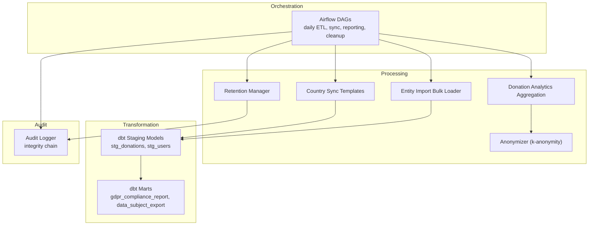
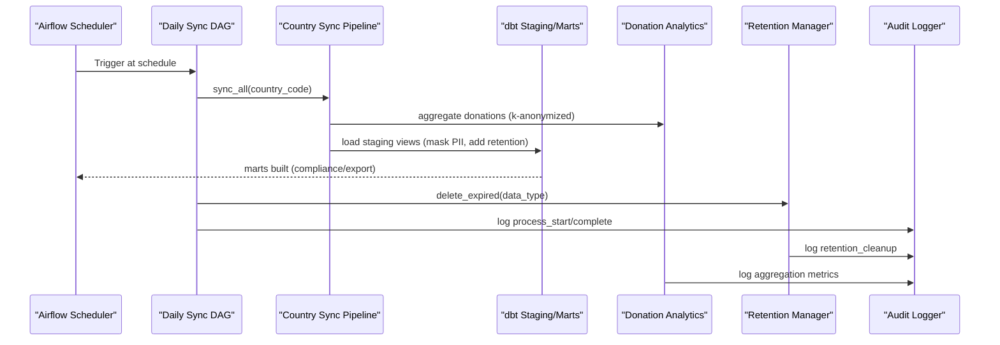
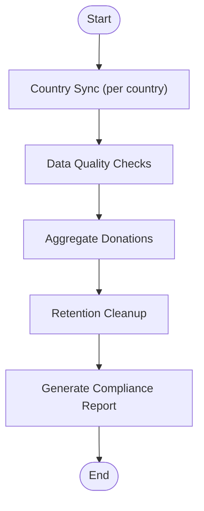
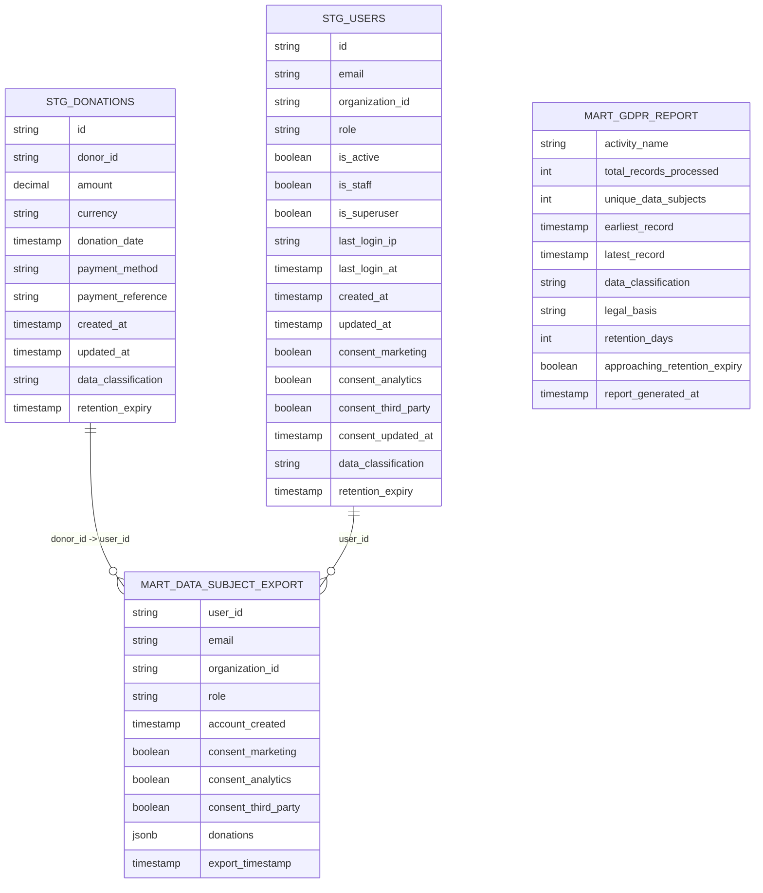
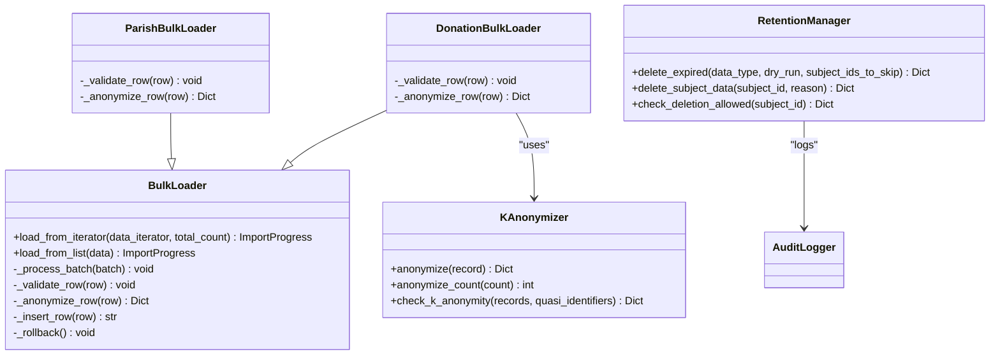
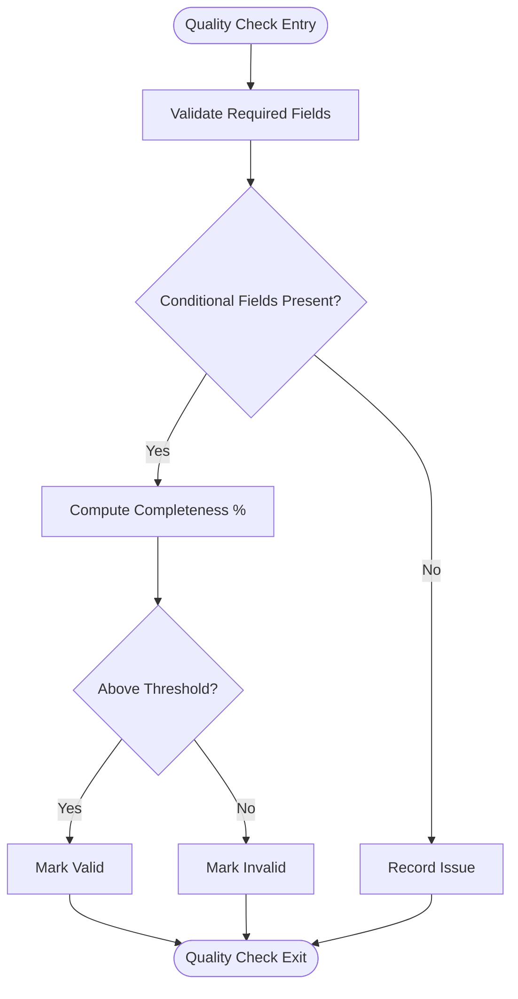
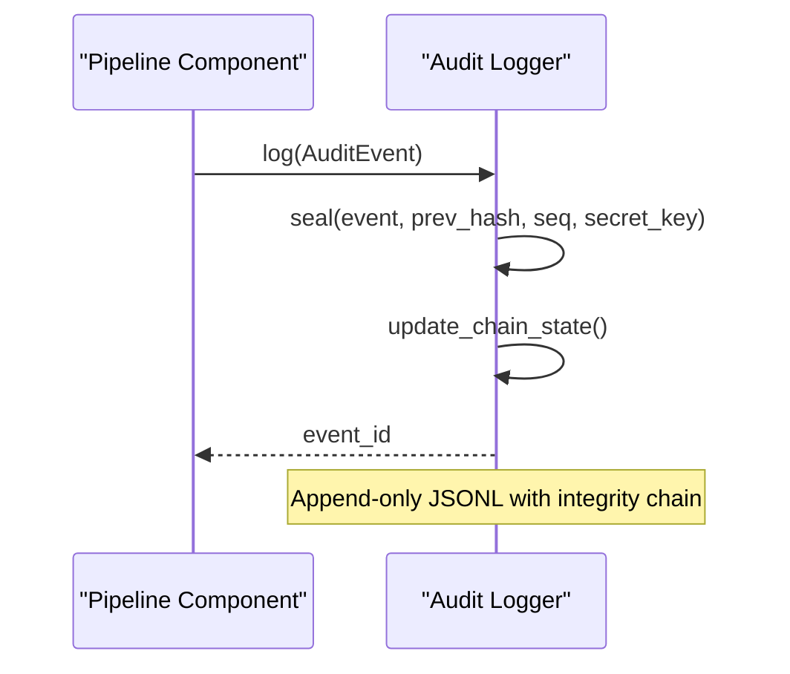
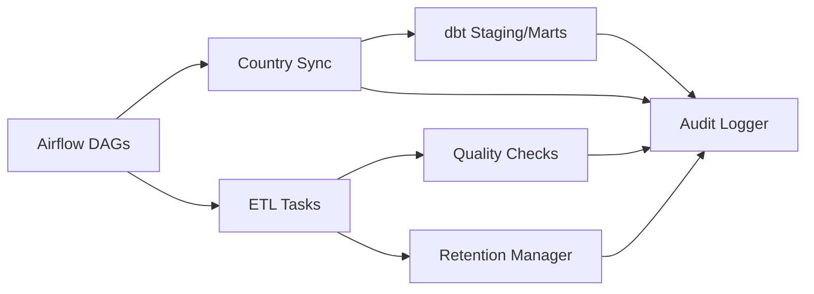

# Data Pipelines & Analytics

<cite>
**Referenced Files in This Document**
- [data/airflow/dags/jol_hub_etl.py](file://data/airflow/dags/jol_hub_etl.py)
- [data/airflow/dags/jol_daily_sync.py](file://data/airflow/dags/jol_daily_sync.py)
- [data/airflow/dags/jol_weekly_reporting.py](file://data/airflow/dags/jol_weekly_reporting.py)
- [data/airflow/dags/jol_gdpr_cleanup.py](file://data/airflow/dags/jol_gdpr_cleanup.py)
- [data/dbt/dbt_project.yml](file://data/dbt/dbt_project.yml)
- [data/dbt/models/staging/stg_donations.sql](file://data/dbt/models/staging/stg_donations.sql)
- [data/dbt/models/staging/stg_users.sql](file://data/dbt/models/staging/stg_users.sql)
- [data/dbt/models/marts/gdpr_compliance_report.sql](file://data/dbt/models/marts/gdpr_compliance_report.sql)
- [data/dbt/models/marts/data_subject_export.sql](file://data/dbt/models/marts/data_subject_export.sql)
- [data/src/pipelines/entity_import/bulk_loader.py](file://data/src/pipelines/entity_import/bulk_loader.py)
- [data/src/pipelines/donation_analytics/daily_aggregation.py](file://data/src/pipelines/donation_analytics/daily_aggregation.py)
- [data/src/pipelines/country_sync/template_sync.py](file://data/src/pipelines/country_sync/template_sync.py)
- [data/src/gdpr/anonymizer.py](file://data/src/gdpr/anonymizer.py)
- [data/src/gdpr/retention_manager.py](file://data/src/gdpr/retention_manager.py)
- [data/src/quality/expectations/entity_completeness.py](file://data/src/quality/expectations/entity_completeness.py)
- [data/src/quality/expectations/gdpr_consent_validation.py](file://data/src/quality/expectations/gdpr_consent_validation.py)
- [data/src/audit.py](file://data/src/audit.py)
</cite>

## Table of Contents
1. Introduction
2. Project Structure
3. Core Components
4. Architecture Overview
5. Detailed Component Analysis
6. Dependency Analysis
7. Performance Considerations
8. Troubleshooting Guide
9. Conclusion

## Introduction
This document describes the data pipeline and analytics system for JOL-HUB, covering:
- Apache Airflow orchestration layer with DAGs for ETL, daily synchronization across 27 EU countries, weekly reporting, and GDPR cleanup.
- dbt transformation layer with staging models and marts for business intelligence and compliance reporting.
- Data processing scripts for entity imports, GDPR automation (anonymization, retention), and donation/user analytics aggregation.
- Data flow from sources through transformations to analytical outputs, including error handling strategies and monitoring approaches.

## Project Structure
The data platform is organized into:
- Orchestration: Airflow DAGs define schedules, dependencies, and task execution for daily sync, ETL, reporting, and GDPR cleanup.
- Transformation: dbt project defines staging views and marts tables with GDPR-aware variables and schemas.
- Processing: Python modules implement bulk import, country sync templates, donation analytics, anonymization, retention management, and quality expectations.
- Audit and Compliance: Centralized audit logging with integrity protection; ROPA generation per entity type.

**Diagram sources**
- [data/airflow/dags/jol_daily_sync.py:83-126](file://data/airflow/dags/jol_daily_sync.py#L83-L126)
- [data/dbt/dbt_project.yml:1-44](file://data/dbt/dbt_project.yml#L1-L44)
- [data/src/pipelines/country_sync/template_sync.py:84-127](file://data/src/pipelines/country_sync/template_sync.py#L84-L127)
- [data/src/pipelines/entity_import/bulk_loader.py:72-151](file://data/src/pipelines/entity_import/bulk_loader.py#L72-L151)
- [data/src/pipelines/donation_analytics/daily_aggregation.py:62-142](file://data/src/pipelines/donation_analytics/daily_aggregation.py#L62-L142)
- [data/src/gdpr/anonymizer.py:106-143](file://data/src/gdpr/anonymizer.py#L106-L143)
- [data/src/gdpr/retention_manager.py:188-246](file://data/src/gdpr/retention_manager.py#L188-L246)
- [data/src/audit.py:205-369](file://data/src/audit.py#L205-L369)

**Section sources**
- [data/airflow/dags/jol_daily_sync.py:83-126](file://data/airflow/dags/jol_daily_sync.py#L83-L126)
- [data/dbt/dbt_project.yml:1-44](file://data/dbt/dbt_project.yml#L1-L44)

## Core Components
- Airflow DAGs:
  - Daily ETL: processes donations, validates data quality, performs retention cleanup, generates compliance reports.
  - Daily Sync: orchestrates per-country sync, runs Great Expectations checks, aggregates donations, cleans expired data, produces compliance report.
  - Weekly Reporting: generates weekly analytics, country metrics, and compliance scorecard.
  - GDPR Cleanup: automated deletion of operational logs and user activity with verification.
- dbt Models:
  - Staging: masks PII, adds classification and retention expiry fields.
  - Marts: builds GDPR compliance report and data subject export for portability.
- Processing Scripts:
  - Entity Import: batch loader with progress tracking, rollback, validation, and anonymization hooks.
  - Donation Analytics: k-anonymized aggregation by country and organization type, trend generation.
  - Country Sync Template: standardized pipeline structure for new countries with GDPR compliance checks.
  - Anonymizer: country-specific k-anonymity thresholds and hashing for direct identifiers.
  - Retention Manager: legal hold registry and deletion controls aligned with GDPR Articles 5(1)(e) and 17.
- Quality Expectations:
  - Completeness rules for entities and conditional field requirements.
  - Consent validation against GDPR Article 7 with expiration and withdrawal checks.
- Audit Logging:
  - Immutable chain with HMAC signatures, sequence numbers, and query/reporting utilities.

**Section sources**
- [data/airflow/dags/jol_hub_etl.py:73-114](file://data/airflow/dags/jol_hub_etl.py#L73-L114)
- [data/airflow/dags/jol_daily_sync.py:83-126](file://data/airflow/dags/jol_daily_sync.py#L83-L126)
- [data/airflow/dags/jol_weekly_reporting.py:52-78](file://data/airflow/dags/jol_weekly_reporting.py#L52-L78)
- [data/airflow/dags/jol_gdpr_cleanup.py:36-68](file://data/airflow/dags/jol_gdpr_cleanup.py#L36-L68)
- [data/dbt/models/staging/stg_donations.sql:1-36](file://data/dbt/models/staging/stg_donations.sql#L1-L36)
- [data/dbt/models/staging/stg_users.sql:1-50](file://data/dbt/models/staging/stg_users.sql#L1-L50)
- [data/dbt/models/marts/gdpr_compliance_report.sql:1-68](file://data/dbt/models/marts/gdpr_compliance_report.sql#L1-L68)
- [data/dbt/models/marts/data_subject_export.sql:1-55](file://data/dbt/models/marts/data_subject_export.sql#L1-L55)
- [data/src/pipelines/entity_import/bulk_loader.py:72-151](file://data/src/pipelines/entity_import/bulk_loader.py#L72-L151)
- [data/src/pipelines/donation_analytics/daily_aggregation.py:62-142](file://data/src/pipelines/donation_analytics/daily_aggregation.py#L62-L142)
- [data/src/pipelines/country_sync/template_sync.py:84-127](file://data/src/pipelines/country_sync/template_sync.py#L84-L127)
- [data/src/gdpr/anonymizer.py:106-143](file://data/src/gdpr/anonymizer.py#L106-L143)
- [data/src/gdpr/retention_manager.py:188-246](file://data/src/gdpr/retention_manager.py#L188-L246)
- [data/src/quality/expectations/entity_completeness.py:81-166](file://data/src/quality/expectations/entity_completeness.py#L81-L166)
- [data/src/quality/expectations/gdpr_consent_validation.py:52-142](file://data/src/quality/expectations/gdpr_consent_validation.py#L52-L142)
- [data/src/audit.py:205-369](file://data/src/audit.py#L205-L369)

## Architecture Overview
End-to-end flow:
- Airflow triggers daily tasks: country sync, data quality checks, donation aggregation, retention cleanup, and compliance reporting.
- Country sync pipelines fetch and transform data, applying anonymization where needed.
- dbt staging models prepare raw data with privacy controls and retention metadata; marts produce compliance and export datasets.
- Audit logger records all processing events with integrity protection.

**Diagram sources**
- [data/airflow/dags/jol_daily_sync.py:83-126](file://data/airflow/dags/jol_daily_sync.py#L83-L126)
- [data/src/pipelines/country_sync/template_sync.py:84-127](file://data/src/pipelines/country_sync/template_sync.py#L84-L127)
- [data/dbt/models/staging/stg_donations.sql:1-36](file://data/dbt/models/staging/stg_donations.sql#L1-L36)
- [data/dbt/models/staging/stg_users.sql:1-50](file://data/dbt/models/staging/stg_users.sql#L1-L50)
- [data/src/pipelines/donation_analytics/daily_aggregation.py:62-142](file://data/src/pipelines/donation_analytics/daily_aggregation.py#L62-L142)
- [data/src/gdpr/retention_manager.py:188-246](file://data/src/gdpr/retention_manager.py#L188-L246)
- [data/src/audit.py:205-369](file://data/src/audit.py#L205-L369)

## Detailed Component Analysis

### Airflow Orchestration Layer
- Daily ETL DAG:
  - Tasks: process donations, validate data quality, retention cleanup, generate compliance report.
  - Scheduling: daily at 2 AM UTC; retries and timeouts configured.
- Daily Sync DAG:
  - Parallelizes per-country sync using a TaskGroup loop over EU country codes.
  - Runs data quality checks, aggregates donations, cleans expired data, and generates compliance report.
- Weekly Reporting DAG:
  - Generates weekly analytics, country metrics, and compliance scorecard on Mondays at 3 AM.
- GDPR Cleanup DAG:
  - Deletes expired operational logs and user activity; verifies deletions.

**Diagram sources**
- [data/airflow/dags/jol_daily_sync.py:83-126](file://data/airflow/dags/jol_daily_sync.py#L83-L126)

**Section sources**
- [data/airflow/dags/jol_hub_etl.py:73-114](file://data/airflow/dags/jol_hub_etl.py#L73-L114)
- [data/airflow/dags/jol_daily_sync.py:83-126](file://data/airflow/dags/jol_daily_sync.py#L83-L126)
- [data/airflow/dags/jol_weekly_reporting.py:52-78](file://data/airflow/dags/jol_weekly_reporting.py#L52-L78)
- [data/airflow/dags/jol_gdpr_cleanup.py:36-68](file://data/airflow/dags/jol_gdpr_cleanup.py#L36-L68)

### dbt Transformation Layer
- Staging Models:
  - stg_donations: masks payment references unless explicitly allowed; adds data_classification and retention_expiry based on variables.
  - stg_users: masks email and IP addresses unless explicitly allowed; includes consent fields and retention_expiry.
- Marts:
  - gdpr_compliance_report: aggregates processing activities, counts unique subjects, flags approaching retention expiry.
  - data_subject_export: joins user data with aggregated donations for portability requests.

**Diagram sources**
- [data/dbt/models/staging/stg_donations.sql:1-36](file://data/dbt/models/staging/stg_donations.sql#L1-L36)
- [data/dbt/models/staging/stg_users.sql:1-50](file://data/dbt/models/staging/stg_users.sql#L1-L50)
- [data/dbt/models/marts/gdpr_compliance_report.sql:1-68](file://data/dbt/models/marts/gdpr_compliance_report.sql#L1-L68)
- [data/dbt/models/marts/data_subject_export.sql:1-55](file://data/dbt/models/marts/data_subject_export.sql#L1-L55)

**Section sources**
- [data/dbt/dbt_project.yml:1-44](file://data/dbt/dbt_project.yml#L1-L44)
- [data/dbt/models/staging/stg_donations.sql:1-36](file://data/dbt/models/staging/stg_donations.sql#L1-L36)
- [data/dbt/models/staging/stg_users.sql:1-50](file://data/dbt/models/staging/stg_users.sql#L1-L50)
- [data/dbt/models/marts/gdpr_compliance_report.sql:1-68](file://data/dbt/models/marts/gdpr_compliance_report.sql#L1-L68)
- [data/dbt/models/marts/data_subject_export.sql:1-55](file://data/dbt/models/marts/data_subject_export.sql#L1-L55)

### Data Processing Scripts
- Entity Import Bulk Loader:
  - Batch processing with configurable batch size, progress tracking, rollback on failure, validation, and anonymization hooks.
  - Specialized loaders for parish and donation entities with required field validation and PII masking/k-anonymization.
- Donation Analytics Aggregation:
  - Groups donations by country and organization type; suppresses small groups below threshold; k-anonymizes donor counts; computes percentiles when sufficient volume.
  - Produces trends over recent days without individual-level data.
- Country Sync Template:
  - Standardized pipeline with GDPR compliance verification; placeholders for entity, donation, and event synchronization; audit logging around start/complete.
- Anonymizer:
  - Country-specific k-anonymity thresholds; hashes direct identifiers; checks dataset satisfaction of k-anonymity.
- Retention Manager:
  - Legal hold registry prevents deletion when holds are active; supports dry-run and subject skip lists; logs blocked attempts and completions.

**Diagram sources**
- [data/src/pipelines/entity_import/bulk_loader.py:72-151](file://data/src/pipelines/entity_import/bulk_loader.py#L72-L151)
- [data/src/pipelines/entity_import/bulk_loader.py:259-320](file://data/src/pipelines/entity_import/bulk_loader.py#L259-L320)
- [data/src/gdpr/anonymizer.py:106-143](file://data/src/gdpr/anonymizer.py#L106-L143)
- [data/src/gdpr/retention_manager.py:188-336](file://data/src/gdpr/retention_manager.py#L188-L336)

**Section sources**
- [data/src/pipelines/entity_import/bulk_loader.py:72-151](file://data/src/pipelines/entity_import/bulk_loader.py#L72-L151)
- [data/src/pipelines/entity_import/bulk_loader.py:259-320](file://data/src/pipelines/entity_import/bulk_loader.py#L259-L320)
- [data/src/pipelines/donation_analytics/daily_aggregation.py:62-142](file://data/src/pipelines/donation_analytics/daily_aggregation.py#L62-L142)
- [data/src/pipelines/country_sync/template_sync.py:84-127](file://data/src/pipelines/country_sync/template_sync.py#L84-L127)
- [data/src/gdpr/anonymizer.py:106-143](file://data/src/gdpr/anonymizer.py#L106-L143)
- [data/src/gdpr/retention_manager.py:188-336](file://data/src/gdpr/retention_manager.py#L188-L336)

### Data Quality and Consent Validation
- Entity Completeness Checker:
  - Validates required and conditional fields per entity type; enforces minimum completeness percentage; cross-validates relationships (e.g., parishes must have priests).
- GDPR Consent Validator:
  - Ensures consents are present, active, and not expired for specified processing types; provides batch validation and compliance statistics.

**Diagram sources**
- [data/src/quality/expectations/entity_completeness.py:81-166](file://data/src/quality/expectations/entity_completeness.py#L81-L166)

**Section sources**
- [data/src/quality/expectations/entity_completeness.py:81-166](file://data/src/quality/expectations/entity_completeness.py#L81-L166)
- [data/src/quality/expectations/gdpr_consent_validation.py:52-142](file://data/src/quality/expectations/gdpr_consent_validation.py#L52-L142)

### Audit and Monitoring
- Audit Logger:
  - Appends immutable events with hash chains and HMAC signatures; tracks sequence numbers; supports querying and generating compliance reports; verifies chain integrity.
- Integration Points:
  - All major components (ETL, sync, analytics, retention) log actions via the audit logger for traceability and compliance reporting.

**Diagram sources**
- [data/src/audit.py:205-369](file://data/src/audit.py#L205-L369)

**Section sources**
- [data/src/audit.py:205-369](file://data/src/audit.py#L205-L369)

## Dependency Analysis
Key dependencies and relationships:
- Airflow DAGs depend on processing modules (country sync, donation analytics, retention manager) and trigger dbt model builds indirectly via downstream steps or external commands.
- dbt models depend on staging views that mask PII and compute retention metadata; marts consume staging for compliance and export.
- Processing modules rely on anonymizer and audit logger; retention manager integrates with legal hold registry to block deletions.
- Quality expectations are invoked during sync or ETL to enforce data integrity before aggregation.

**Diagram sources**
- [data/airflow/dags/jol_daily_sync.py:83-126](file://data/airflow/dags/jol_daily_sync.py#L83-L126)
- [data/dbt/dbt_project.yml:1-44](file://data/dbt/dbt_project.yml#L1-L44)
- [data/src/gdpr/retention_manager.py:188-246](file://data/src/gdpr/retention_manager.py#L188-L246)
- [data/src/audit.py:205-369](file://data/src/audit.py#L205-L369)

**Section sources**
- [data/airflow/dags/jol_daily_sync.py:83-126](file://data/airflow/dags/jol_daily_sync.py#L83-L126)
- [data/dbt/dbt_project.yml:1-44](file://data/dbt/dbt_project.yml#L1-L44)
- [data/src/gdpr/retention_manager.py:188-246](file://data/src/gdpr/retention_manager.py#L188-L246)
- [data/src/audit.py:205-369](file://data/src/audit.py#L205-L369)

## Performance Considerations
- Batch sizes: Configure bulk loader batch size to balance throughput and memory usage; adjust per environment constraints.
- Aggregation thresholds: Ensure minimum donor counts for percentile calculations to avoid unstable metrics; suppress small groups to protect privacy and reduce noise.
- dbt materialization: Use views for staging to minimize storage and keep transformations lightweight; materialize marts as tables for query performance.
- Retention cleanup: Schedule off-peak deletions; use dry-run mode to assess impact before actual removal.
- Audit logging: Monitor append-only log growth; rotate files and archive historical logs to maintain performance.

[No sources needed since this section provides general guidance]

## Troubleshooting Guide
Common issues and resolutions:
- Data quality failures:
  - Inspect completeness validation results; address missing required or conditional fields; re-run sync after corrections.
- Consent validation errors:
  - Identify missing or expired consents; prompt re-consent or adjust processing scope accordingly.
- Retention deletion blocked:
  - Check legal hold registry for active holds; lift holds if appropriate; review audit logs for blocked attempts.
- Audit chain integrity:
  - Verify chain using provided utilities; investigate sequence gaps or signature mismatches; ensure secret key availability.

**Section sources**
- [data/src/quality/expectations/entity_completeness.py:81-166](file://data/src/quality/expectations/entity_completeness.py#L81-L166)
- [data/src/quality/expectations/gdpr_consent_validation.py:52-142](file://data/src/quality/expectations/gdpr_consent_validation.py#L52-L142)
- [data/src/gdpr/retention_manager.py:248-336](file://data/src/gdpr/retention_manager.py#L248-L336)
- [data/src/audit.py:513-589](file://data/src/audit.py#L513-L589)

## Conclusion
The JOL-HUB data pipeline integrates robust orchestration, transformation, and processing layers with strong GDPR compliance features:
- Airflow DAGs coordinate daily sync, ETL, reporting, and cleanup across multiple countries.
- dbt staging and marts enforce privacy controls and produce compliance and export datasets.
- Processing scripts implement k-anonymization, retention management, and quality expectations.
- Audit logging ensures traceability and integrity for forensic and compliance needs.

[No sources needed since this section summarizes without analyzing specific files]