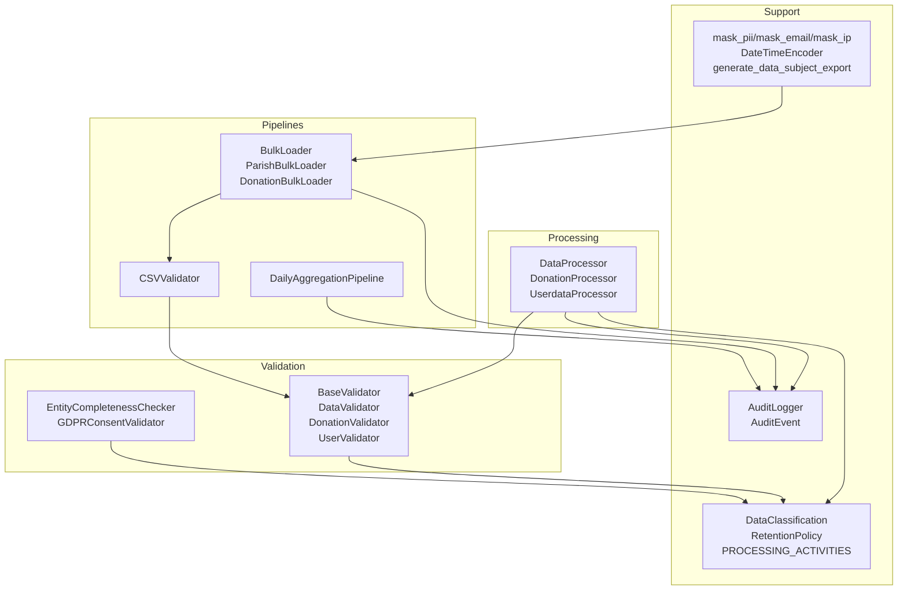
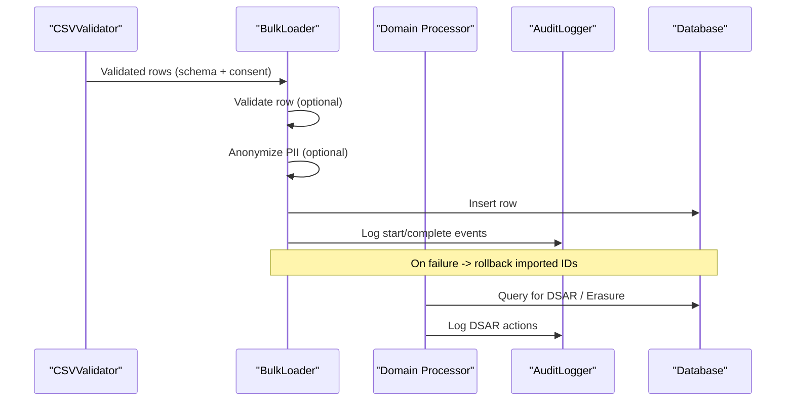
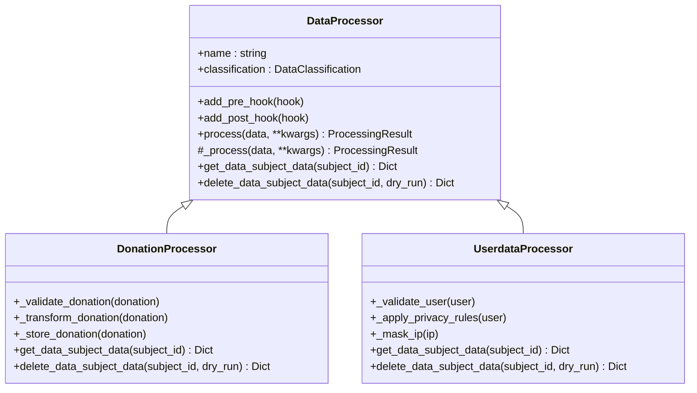
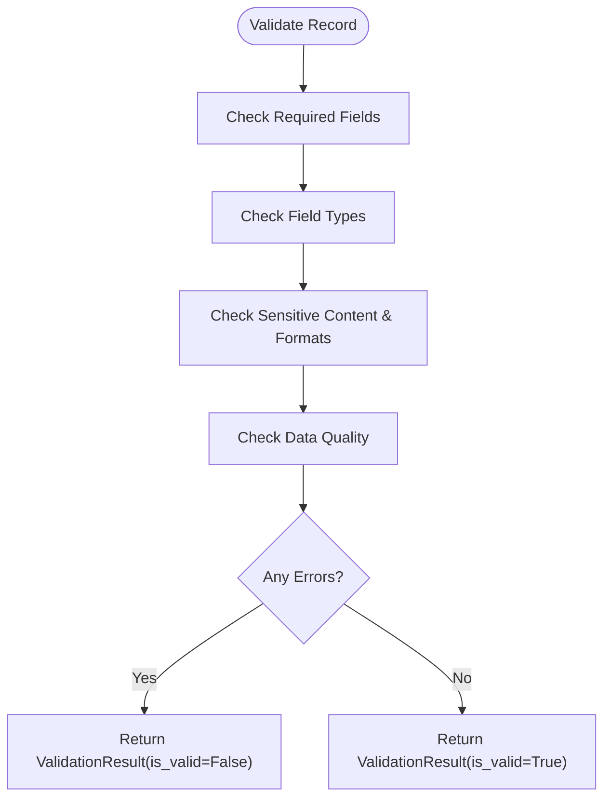
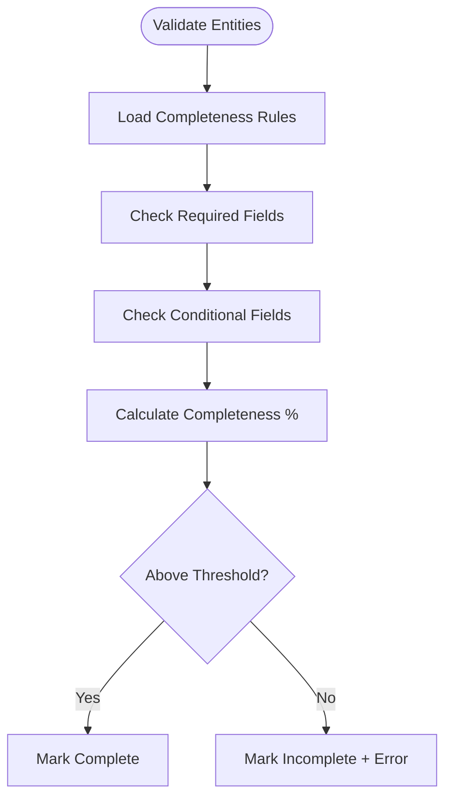
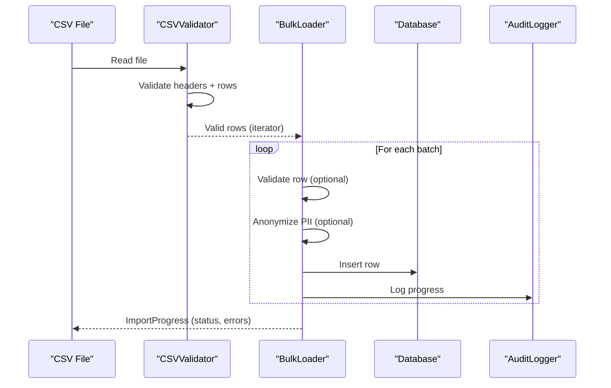
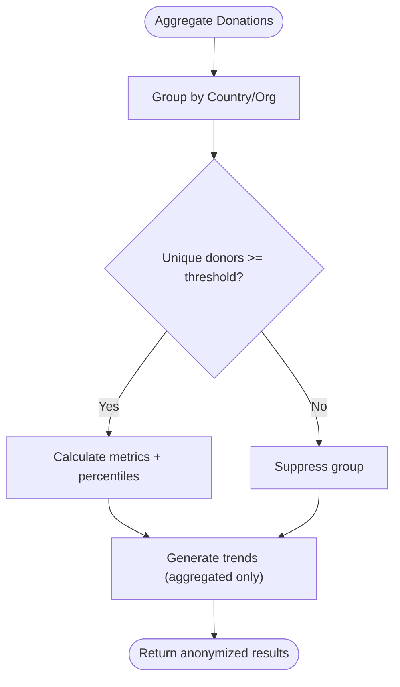
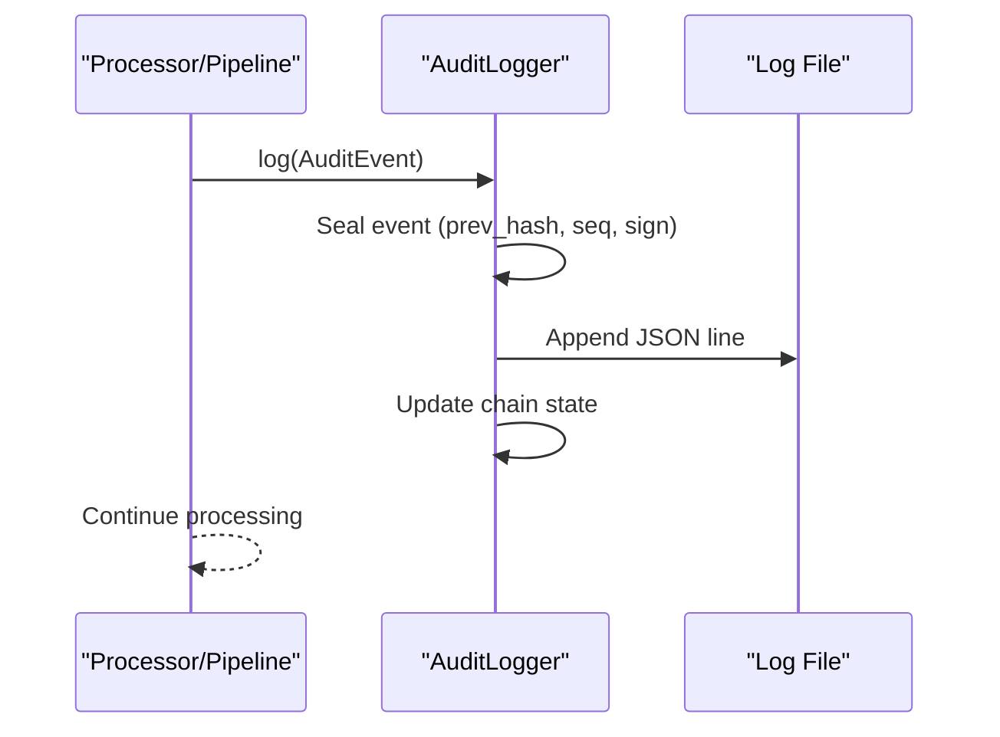
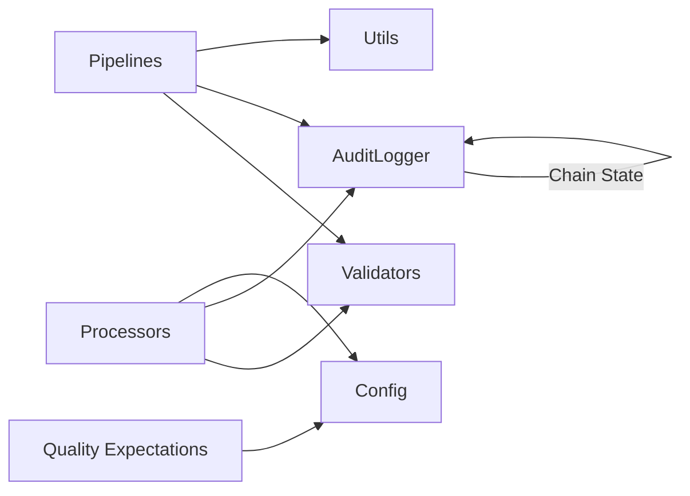

# Core Processors and Validators

<cite>
**Referenced Files in This Document**
- [processors.py](file://data/src/processors.py)
- [validators.py](file://data/src/validators.py)
- [config.py](file://data/src/config.py)
- [audit.py](file://data/src/audit.py)
- [utils.py](file://data/src/utils.py)
- [bulk_loader.py](file://data/src/pipelines/entity_import/bulk_loader.py)
- [csv_validator.py](file://data/src/pipelines/entity_import/csv_validator.py)
- [daily_aggregation.py](file://data/src/pipelines/donation_analytics/daily_aggregation.py)
- [entity_completeness.py](file://data/src/quality/expectations/entity_completeness.py)
- [gdpr_consent_validation.py](file://data/src/quality/expectations/gdpr_consent_validation.py)
- [test_processors.py](file://data/tests/test_processors.py)
</cite>

## Table of Contents
1. Introduction
2. Project Structure
3. Core Components
4. Architecture Overview
5. Detailed Component Analysis
6. Dependency Analysis
7. Performance Considerations
8. Troubleshooting Guide
9. Conclusion
10. Appendices

## Introduction
This document explains the core data processing and validation frameworks used across the data module. It focuses on processor classes for different data types, transformation pipelines, and data quality enforcement. It also documents validator patterns, schema validation, custom validation rules, error handling strategies, logging mechanisms, performance considerations, testing approaches, and debugging techniques. The goal is to help developers implement custom processors and validators, extend existing functionality, and integrate with the broader data pipeline ecosystem while maintaining GDPR compliance and robust data quality.

## Project Structure
The data processing and validation framework is organized into focused modules:
- Processors: Abstract base class and concrete processors for donations and user data, implementing GDPR rights (access, erasure).
- Validators: Base and domain-specific validators with severity-based issues and batch validation utilities.
- Quality Expectations: Completeness and consent validation expectations for entities and GDPR consent records.
- Pipelines: Bulk import loaders and CSV validators, plus analytics aggregation pipelines that enforce k-anonymity.
- Audit Logging: Tamper-evident audit logs with hash chains and HMAC signatures.
- Configuration: Data classification, retention policies, and processing activities registry.
- Utilities: Common helpers for masking PII, JSON encoding, retention calculations, and exports.

**Diagram sources**
- [processors.py:94-220](file://data/src/processors.py#L94-L220)
- [validators.py:67-119](file://data/src/validators.py#L67-L119)
- [bulk_loader.py:72-151](file://data/src/pipelines/entity_import/bulk_loader.py#L72-L151)
- [csv_validator.py:120-210](file://data/src/pipelines/entity_import/csv_validator.py#L120-L210)
- [daily_aggregation.py:62-142](file://data/src/pipelines/donation_analytics/daily_aggregation.py#L62-L142)
- [audit.py:205-369](file://data/src/audit.py#L205-L369)
- [config.py:12-27](file://data/src/config.py#L12-L27)
- [utils.py:52-80](file://data/src/utils.py#L52-L80)

**Section sources**
- [processors.py:94-220](file://data/src/processors.py#L94-L220)
- [validators.py:67-119](file://data/src/validators.py#L67-L119)
- [bulk_loader.py:72-151](file://data/src/pipelines/entity_import/bulk_loader.py#L72-L151)
- [csv_validator.py:120-210](file://data/src/pipelines/entity_import/csv_validator.py#L120-L210)
- [daily_aggregation.py:62-142](file://data/src/pipelines/donation_analytics/daily_aggregation.py#L62-L142)
- [audit.py:205-369](file://data/src/audit.py#L205-L369)
- [config.py:12-27](file://data/src/config.py#L12-L27)
- [utils.py:52-80](file://data/src/utils.py#L52-L80)

## Core Components
- DataProcessor abstract base class defines a standardized processing lifecycle with pre/post hooks, audit logging, and GDPR support methods for access and erasure. Concrete processors implement domain-specific logic for donations and users.
- Validation framework provides a base validator with GDPR-aware checks and domain-specific validators for donations and users. Batch validation utility supports high-throughput scenarios.
- Quality expectations define completeness rules for entities and consent validation for GDPR Article 7 compliance.
- Pipelines include bulk loaders with progress tracking, rollback, and anonymization; CSV validators with schema enforcement and PII encryption; and analytics aggregation with k-anonymity.
- Audit logger ensures tamper-evident logs with hash chains and HMAC signatures, supporting queries and chain verification.
- Configuration centralizes data classification, retention policies, and processing activities per GDPR Article 30.
- Utilities provide common helpers for masking PII, JSON serialization, retention calculations, and generating portable data exports.

**Section sources**
- [processors.py:94-220](file://data/src/processors.py#L94-L220)
- [validators.py:67-119](file://data/src/validators.py#L67-L119)
- [entity_completeness.py:81-166](file://data/src/quality/expectations/entity_completeness.py#L81-L166)
- [gdpr_consent_validation.py:52-142](file://data/src/quality/expectations/gdpr_consent_validation.py#L52-L142)
- [bulk_loader.py:72-151](file://data/src/pipelines/entity_import/bulk_loader.py#L72-L151)
- [csv_validator.py:120-210](file://data/src/pipelines/entity_import/csv_validator.py#L120-L210)
- [daily_aggregation.py:62-142](file://data/src/pipelines/donation_analytics/daily_aggregation.py#L62-L142)
- [audit.py:205-369](file://data/src/audit.py#L205-L369)
- [config.py:12-27](file://data/src/config.py#L12-L27)
- [utils.py:52-80](file://data/src/utils.py#L52-L80)

## Architecture Overview
The architecture follows a layered approach:
- Ingestion layer: CSVValidator validates incoming files against schemas, enforces consent requirements, and optionally encrypts PII.
- Processing layer: BulkLoader orchestrates batched imports with validation, anonymization, insertion, and rollback. Domain processors handle business transformations and GDPR rights.
- Analytics layer: DailyAggregationPipeline aggregates metrics with k-anonymity and suppresses small groups to protect privacy.
- Quality layer: EntityCompletenessChecker and GDPRConsentValidator enforce data quality and consent compliance.
- Support layer: AuditLogger provides tamper-evident logging; Config centralizes classifications and retention; Utils provide shared helpers.

**Diagram sources**
- [csv_validator.py:135-210](file://data/src/pipelines/entity_import/csv_validator.py#L135-L210)
- [bulk_loader.py:96-151](file://data/src/pipelines/entity_import/bulk_loader.py#L96-L151)
- [processors.py:282-503](file://data/src/processors.py#L282-L503)
- [audit.py:330-369](file://data/src/audit.py#L330-L369)

## Detailed Component Analysis

### DataProcessor and Domain Processors
- DataProcessor defines a consistent lifecycle:
  - Pre-hooks run before processing.
  - _process is implemented by subclasses.
  - Post-hooks run after processing.
  - Full audit logging around start, completion, and errors.
  - GDPR methods: get_data_subject_data and delete_data_subject_data.
- DonationProcessor:
  - Validates required fields and positive amounts.
  - Transforms and stores donation records.
  - Implements DSAR access and erasure with retention checks and anonymization for retained records.
- UserdataProcessor:
  - Validates email presence.
  - Applies privacy rules (e.g., masking IP without consent).
  - Implements DSAR access and erasure with membership checks and soft-delete behavior.

**Diagram sources**
- [processors.py:94-220](file://data/src/processors.py#L94-L220)
- [processors.py:223-503](file://data/src/processors.py#L223-L503)
- [processors.py:506-762](file://data/src/processors.py#L506-L762)

**Section sources**
- [processors.py:94-220](file://data/src/processors.py#L94-L220)
- [processors.py:223-503](file://data/src/processors.py#L223-L503)
- [processors.py:506-762](file://data/src/processors.py#L506-L762)

### Validators and Validation Patterns
- BaseValidator defines validate interface.
- DataValidator implements:
  - Required field checks (subclass override).
  - Type checks with warnings.
  - GDPR-sensitive content detection and personal data format checks.
  - Data quality checks (empty strings, injection patterns).
- DonationValidator and UserValidator add domain-specific rules:
  - DonationValidator enforces required fields, positive amounts, currency checks, and AML-like large donation warnings.
  - UserValidator warns when no explicit consent recorded.
- Batch validation utility returns counts and aggregated issues.

**Diagram sources**
- [validators.py:101-119](file://data/src/validators.py#L101-L119)
- [validators.py:121-198](file://data/src/validators.py#L121-L198)
- [validators.py:201-233](file://data/src/validators.py#L201-L233)
- [validators.py:236-269](file://data/src/validators.py#L236-L269)

**Section sources**
- [validators.py:67-119](file://data/src/validators.py#L67-L119)
- [validators.py:121-198](file://data/src/validators.py#L121-L198)
- [validators.py:201-233](file://data/src/validators.py#L201-L233)
- [validators.py:236-269](file://data/src/validators.py#L236-L269)
- [validators.py:272-293](file://data/src/validators.py#L272-L293)

### Quality Expectations: Completeness and Consent
- EntityCompletenessChecker validates entity completeness based on required and conditional fields, calculates completeness percentages, and enforces thresholds. It can also validate cross-entity relationships like parish-priest assignments.
- GDPRConsentValidator validates consent records for specific processing types, checking active status, expiration, and missing consents. It supports batch validation and generates compliance statistics.

**Diagram sources**
- [entity_completeness.py:81-166](file://data/src/quality/expectations/entity_completeness.py#L81-L166)

**Section sources**
- [entity_completeness.py:81-166](file://data/src/quality/expectations/entity_completeness.py#L81-L166)
- [gdpr_consent_validation.py:52-142](file://data/src/quality/expectations/gdpr_consent_validation.py#L52-L142)

### Pipelines: Bulk Import and CSV Validation
- BulkLoader:
  - Processes iterators or lists in configurable batches.
  - Tracks progress, supports rollback on failure, and integrates audit logging.
  - Subclasses implement entity-specific validation and anonymization.
- CSVValidator:
  - Validates headers and rows against predefined schemas.
  - Enforces consent requirements and PII validation.
  - Provides anonymization and optional encryption for PII fields.
  - Streams valid rows for memory-efficient processing.

**Diagram sources**
- [csv_validator.py:135-210](file://data/src/pipelines/entity_import/csv_validator.py#L135-L210)
- [bulk_loader.py:96-151](file://data/src/pipelines/entity_import/bulk_loader.py#L96-L151)
- [bulk_loader.py:259-320](file://data/src/pipelines/entity_import/bulk_loader.py#L259-L320)

**Section sources**
- [bulk_loader.py:72-151](file://data/src/pipelines/entity_import/bulk_loader.py#L72-L151)
- [bulk_loader.py:259-320](file://data/src/pipelines/entity_import/bulk_loader.py#L259-L320)
- [csv_validator.py:120-210](file://data/src/pipelines/entity_import/csv_validator.py#L120-L210)
- [csv_validator.py:276-339](file://data/src/pipelines/entity_import/csv_validator.py#L276-L339)

### Analytics Aggregation Pipeline
- DailyAggregationPipeline:
  - Groups donations by country and/or organization type.
  - Suppresses small groups to maintain k-anonymity.
  - Calculates metrics including totals, averages, medians, and percentiles.
  - Generates trend summaries without individual-level data.

**Diagram sources**
- [daily_aggregation.py:82-142](file://data/src/pipelines/donation_analytics/daily_aggregation.py#L82-L142)
- [daily_aggregation.py:170-214](file://data/src/pipelines/donation_analytics/daily_aggregation.py#L170-L214)
- [daily_aggregation.py:216-242](file://data/src/pipelines/donation_analytics/daily_aggregation.py#L216-L242)

**Section sources**
- [daily_aggregation.py:62-142](file://data/src/pipelines/donation_analytics/daily_aggregation.py#L62-L142)
- [daily_aggregation.py:170-214](file://data/src/pipelines/donation_analytics/daily_aggregation.py#L170-L214)
- [daily_aggregation.py:216-242](file://data/src/pipelines/donation_analytics/daily_aggregation.py#L216-L242)

### Audit Logging and Integrity
- AuditEvent encapsulates structured event data with integrity fields (hash chain, sequence number, signature).
- AuditLogger writes append-only daily log files, maintains chain state, and supports querying and verification.
- Methods provide convenience logging for data access and GDPR requests, plus chain verification and compliance reporting.

**Diagram sources**
- [audit.py:65-190](file://data/src/audit.py#L65-L190)
- [audit.py:330-369](file://data/src/audit.py#L330-L369)
- [audit.py:513-589](file://data/src/audit.py#L513-L589)

**Section sources**
- [audit.py:65-190](file://data/src/audit.py#L65-L190)
- [audit.py:205-369](file://data/src/audit.py#L205-L369)
- [audit.py:475-589](file://data/src/audit.py#L475-L589)

### Configuration and Utilities
- Configuration:
  - DataClassification enumerates sensitivity levels.
  - RetentionPolicy defines retention periods for different data types.
  - PROCESSING_ACTIVITIES registers GDPR Article 30 activities with legal basis and security measures.
- Utilities:
  - DateTimeEncoder handles datetime and decimal serialization.
  - mask_pii, mask_email, mask_ip provide privacy-preserving masking.
  - calculate_retention_date and is_data_expired support retention enforcement.
  - generate_data_subject_export scaffolds portable data exports.

**Section sources**
- [config.py:12-27](file://data/src/config.py#L12-L27)
- [config.py:55-82](file://data/src/config.py#L55-L82)
- [config.py:85-124](file://data/src/config.py#L85-L124)
- [utils.py:14-24](file://data/src/utils.py#L14-L24)
- [utils.py:52-80](file://data/src/utils.py#L52-L80)
- [utils.py:83-103](file://data/src/utils.py#L83-L103)
- [utils.py:105-131](file://data/src/utils.py#L105-L131)

## Dependency Analysis
Key dependencies and relationships:
- Processors depend on validators for input validation and audit logger for compliance logging.
- Pipelines depend on validators and utilities for schema enforcement and PII masking.
- Quality expectations rely on configuration for policy definitions.
- Audit logger is central to all components for tamper-evident logging.

**Diagram sources**
- [processors.py:94-220](file://data/src/processors.py#L94-L220)
- [validators.py:67-119](file://data/src/validators.py#L67-L119)
- [bulk_loader.py:72-151](file://data/src/pipelines/entity_import/bulk_loader.py#L72-L151)
- [csv_validator.py:120-210](file://data/src/pipelines/entity_import/csv_validator.py#L120-L210)
- [entity_completeness.py:81-166](file://data/src/quality/expectations/entity_completeness.py#L81-L166)
- [audit.py:205-369](file://data/src/audit.py#L205-L369)

**Section sources**
- [processors.py:94-220](file://data/src/processors.py#L94-L220)
- [validators.py:67-119](file://data/src/validators.py#L67-L119)
- [bulk_loader.py:72-151](file://data/src/pipelines/entity_import/bulk_loader.py#L72-L151)
- [csv_validator.py:120-210](file://data/src/pipelines/entity_import/csv_validator.py#L120-L210)
- [entity_completeness.py:81-166](file://data/src/quality/expectations/entity_completeness.py#L81-L166)
- [audit.py:205-369](file://data/src/audit.py#L205-L369)

## Performance Considerations
- Batch size tuning: Configure BulkLoader.batch_size to balance throughput and memory usage.
- Streaming CSV validation: Use iter_valid_rows to process large files without loading all into memory.
- Suppression thresholds: Set min_donors_for_reporting in DailyAggregationPipeline to avoid leaking small groups.
- Audit overhead: Enable audit logging selectively in development; ensure append-only log rotation to prevent I/O bottlenecks.
- Database connections: Reuse connections where possible and close cursors promptly to avoid resource leaks.
- Encryption costs: Apply encryption only to PII columns and consider key management latency in production.

[No sources needed since this section provides general guidance]

## Troubleshooting Guide
Common issues and resolutions:
- Missing required fields:
  - Validators will report errors; inspect ValidationResult.errors and adjust input data.
- Invalid email formats:
  - Email validation fails; correct format or remove invalid entries.
- Consent missing:
  - CSVValidator requires consent_timestamp for PII; add consent metadata or mark data as non-PII.
- Large donation warnings:
  - DonationValidator flags unusually large amounts; verify compliance and adjust thresholds if necessary.
- Audit chain integrity failures:
  - Use AuditLogger.verify_chain to detect broken chains, sequence gaps, or invalid signatures; investigate log directory permissions and secret key persistence.
- Rollback failures:
  - Ensure _delete_row implementation is present in subclasses; check database permissions and transaction handling.

**Section sources**
- [validators.py:121-198](file://data/src/validators.py#L121-L198)
- [csv_validator.py:226-274](file://data/src/pipelines/entity_import/csv_validator.py#L226-L274)
- [bulk_loader.py:213-229](file://data/src/pipelines/entity_import/bulk_loader.py#L213-L229)
- [audit.py:513-589](file://data/src/audit.py#L513-L589)

## Conclusion
The core data processing and validation framework provides a robust, GDPR-compliant foundation for handling sensitive data across ingestion, processing, analytics, and quality assurance. By leveraging abstract processors, extensible validators, schema-driven CSV validation, and tamper-evident audit logging, teams can implement custom processors and validators confidently while ensuring data quality and regulatory compliance. The pipelines emphasize privacy-preserving aggregation and efficient batch processing, making them suitable for large-scale operations.

[No sources needed since this section summarizes without analyzing specific files]

## Appendices

### Implementing Custom Processors
- Extend DataProcessor and implement _process with domain-specific logic.
- Add pre/post hooks for reusable steps (e.g., normalization, enrichment).
- Implement get_data_subject_data and delete_data_subject_data to support GDPR rights.
- Integrate with AuditLogger for compliance logging.

**Section sources**
- [processors.py:94-220](file://data/src/processors.py#L94-L220)
- [processors.py:223-503](file://data/src/processors.py#L223-L503)
- [processors.py:506-762](file://data/src/processors.py#L506-L762)

### Extending Validators
- Create a subclass of DataValidator and override _validate_required_fields for domain-specific required fields.
- Add custom checks in validate for domain rules (e.g., currency validation, amount ranges).
- Use ValidationSeverity to distinguish blocking errors from warnings.

**Section sources**
- [validators.py:67-119](file://data/src/validators.py#L67-L119)
- [validators.py:201-233](file://data/src/validators.py#L201-L233)
- [validators.py:236-269](file://data/src/validators.py#L236-L269)

### Integrating with Pipelines
- Use CSVValidator to validate incoming files against schemas and enforce consent requirements.
- Employ BulkLoader to process validated rows in batches with progress tracking and rollback.
- Leverage DailyAggregationPipeline for privacy-preserving analytics outputs.

**Section sources**
- [csv_validator.py:120-210](file://data/src/pipelines/entity_import/csv_validator.py#L120-L210)
- [bulk_loader.py:72-151](file://data/src/pipelines/entity_import/bulk_loader.py#L72-L151)
- [daily_aggregation.py:62-142](file://data/src/pipelines/donation_analytics/daily_aggregation.py#L62-L142)

### Testing Approaches
- Unit tests cover data classification, retention policies, processing activities, donation processing, validators, and audit events.
- Assertions validate success/failure conditions, error accumulation, and GDPR method availability.
- Use pytest to run comprehensive test suites for processors and validators.

**Section sources**
- [test_processors.py:38-89](file://data/tests/test_processors.py#L38-L89)
- [test_processors.py:91-144](file://data/tests/test_processors.py#L91-L144)
- [test_processors.py:146-188](file://data/tests/test_processors.py#L146-L188)
- [test_processors.py:190-222](file://data/tests/test_processors.py#L190-L222)
- [test_processors.py:224-257](file://data/tests/test_processors.py#L224-L257)

### Debugging Techniques
- Inspect ProcessingResult.errors and ValidationResult.issues for detailed failure reasons.
- Review audit logs using query_events and verify_chain to detect integrity issues.
- Use utils.mask_* functions to safely log sensitive values during debugging.
- Enable progress callbacks in BulkLoader to monitor import status in real-time.

**Section sources**
- [processors.py:75-92](file://data/src/processors.py#L75-L92)
- [validators.py:23-65](file://data/src/validators.py#L23-L65)
- [audit.py:409-473](file://data/src/audit.py#L409-L473)
- [audit.py:513-589](file://data/src/audit.py#L513-L589)
- [utils.py:52-80](file://data/src/utils.py#L52-L80)
- [bulk_loader.py:33-57](file://data/src/pipelines/entity_import/bulk_loader.py#L33-L57)