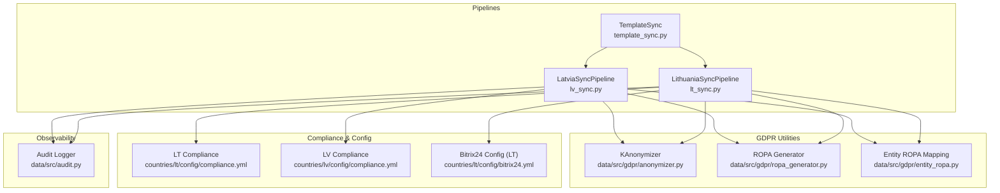
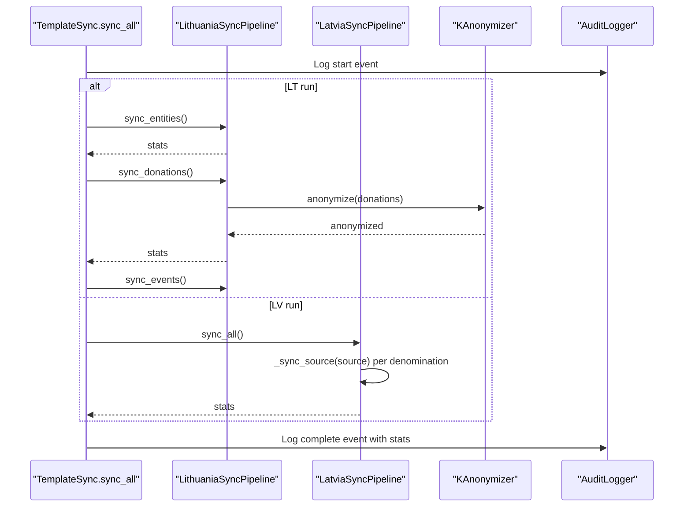
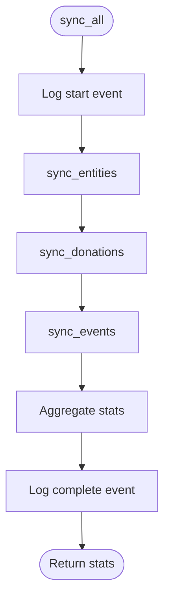
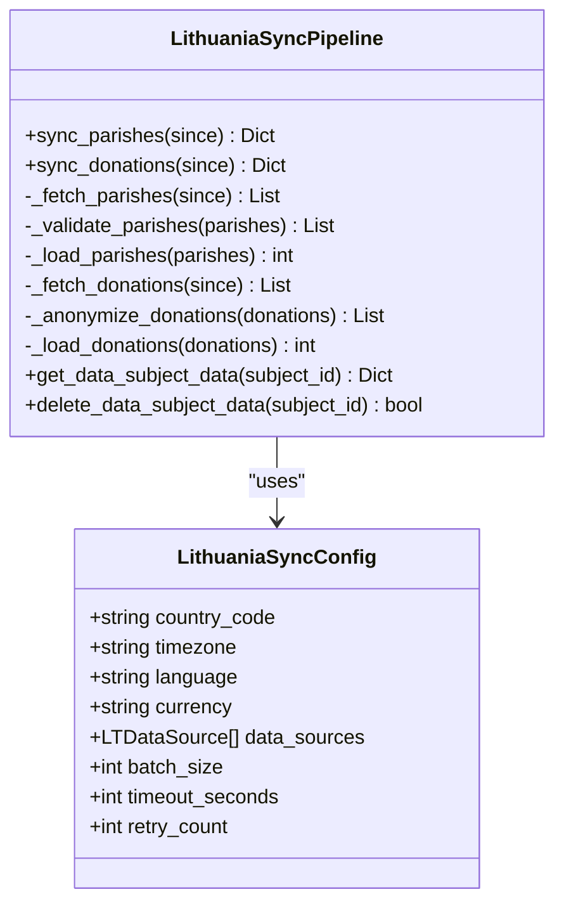
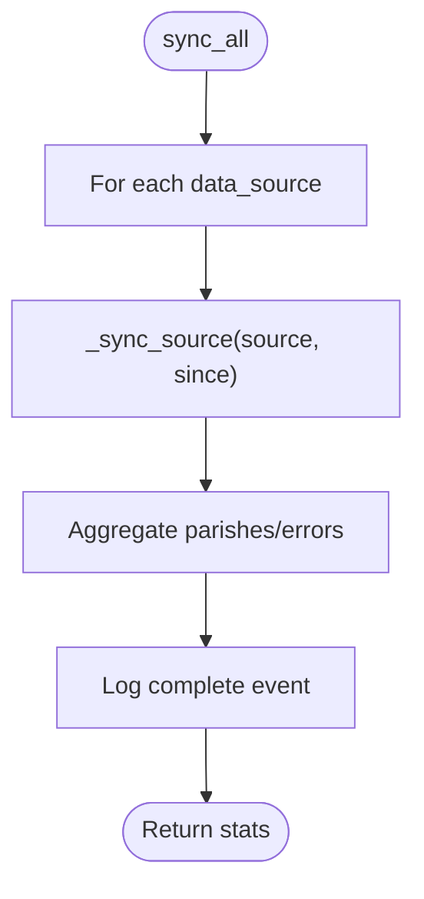
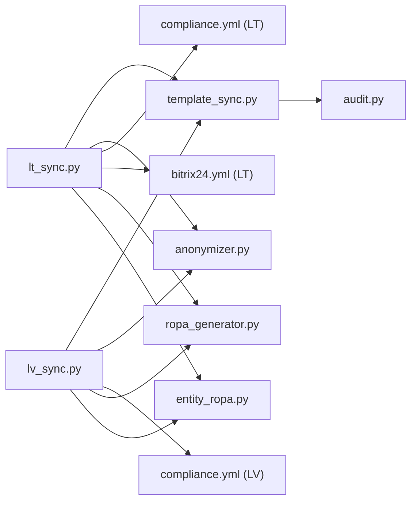

# Country-Specific Sync Pipelines

<cite>
**Referenced Files in This Document**
- [template_sync.py](file://data/src/pipelines/country_sync/template_sync.py)
- [lt_sync.py](file://data/src/pipelines/country_sync/lt_sync.py)
- [lv_sync.py](file://data/src/pipelines/country_sync/lv_sync.py)
- [compliance.yml (LT)](file://countries/lt/config/compliance.yml)
- [compliance.yml (LV)](file://countries/lv/config/compliance.yml)
- [bitrix24.yml (LT)](file://countries/lt/config/bitrix24.yml)
- [anonymizer.py](file://data/src/gdpr/anonymizer.py)
- [entity_ropa.py](file://data/src/gdpr/entity_ropa.py)
- [ropa_generator.py](file://data/src/gdpr/ropa_generator.py)
- [audit.py](file://data/src/audit.py)
- [money.ts](file://frontend/packages/commerce/src/money.ts)
</cite>

## Table of Contents
1. Introduction
2. Project Structure
3. Core Components
4. Architecture Overview
5. Detailed Component Analysis
6. Dependency Analysis
7. Performance Considerations
8. Troubleshooting Guide
9. Conclusion
10. Appendices

## Introduction
This document explains the country-specific synchronization pipelines for Lithuania (LT) and Latvia (LV), focusing on template-based architecture, regional data mapping strategies, compliance requirements, localization handling, error handling for cross-border transfers, currency conversions, validation rules, integration patterns with local systems, and monitoring/troubleshooting approaches for international data synchronization.

The system uses a shared template to standardize pipeline structure while allowing country-specific configuration and logic. It integrates with local CRM systems (e.g., Bitrix24 in LT), applies GDPR-compliant anonymization, and enforces retention and transfer policies defined per country.

## Project Structure
Country sync pipelines are implemented under data/src/pipelines/country_sync with a reusable template and country-specific implementations. Compliance settings and integrations are stored under countries/{lt|lv}/config. GDPR utilities (anonymization, ROPA generation) live under data/src/gdpr. Audit logging is provided by data/src/audit.py. Currency formatting and VAT helpers are in frontend packages but inform backend expectations for EUR-centric flows.

**Diagram sources**
- [template_sync.py:49-163](file://data/src/pipelines/country_sync/template_sync.py#L49-L163)
- [lt_sync.py:48-207](file://data/src/pipelines/country_sync/lt_sync.py#L48-L207)
- [lv_sync.py:47-97](file://data/src/pipelines/country_sync/lv_sync.py#L47-L97)
- [compliance.yml (LT):1-201](file://countries/lt/config/compliance.yml#L1-L201)
- [compliance.yml (LV):1-218](file://countries/lv/config/compliance.yml#L1-L218)
- [bitrix24.yml (LT):1-354](file://countries/lt/config/bitrix24.yml#L1-L354)
- [anonymizer.py:25-83](file://data/src/gdpr/anonymizer.py#L25-L83)
- [ropa_generator.py:19-100](file://data/src/gdpr/ropa_generator.py#L19-L100)
- [entity_ropa.py:39-65](file://data/src/gdpr/entity_ropa.py#L39-L65)
- [audit.py:205-370](file://data/src/audit.py#L205-L370)

**Section sources**
- [template_sync.py:22-163](file://data/src/pipelines/country_sync/template_sync.py#L22-L163)
- [lt_sync.py:23-207](file://data/src/pipelines/country_sync/lt_sync.py#L23-L207)
- [lv_sync.py:23-97](file://data/src/pipelines/country_sync/lv_sync.py#L23-L97)
- [compliance.yml (LT):1-201](file://countries/lt/config/compliance.yml#L1-L201)
- [compliance.yml (LV):1-218](file://countries/lv/config/compliance.yml#L1-L218)
- [bitrix24.yml (LT):1-354](file://countries/lt/config/bitrix24.yml#L1-L354)
- [anonymizer.py:25-83](file://data/src/gdpr/anonymizer.py#L25-L83)
- [ropa_generator.py:19-100](file://data/src/gdpr/ropa_generator.py#L19-L100)
- [entity_ropa.py:39-65](file://data/src/gdpr/entity_ropa.py#L39-L65)
- [audit.py:205-370](file://data/src/audit.py#L205-L370)

## Core Components
- Template-based pipeline: A base class defines lifecycle hooks (sync_all, sync_entities, sync_donations, sync_events) and audit logging. Country implementations override methods to fetch, validate, transform, and load data from local sources.
- Country configs: Per-country compliance documents define lawful basis, consent thresholds, retention periods, data transfer restrictions, and religious organization specifics.
- GDPR utilities: K-anonymity engine with country-specific k-values; ROPA generator and entity-specific processing activities for compliance reporting.
- Audit logger: Immutable, hash-chained audit log with HMAC signatures, sequence numbers, and chain verification for forensic integrity.
- Integration config: For LT, Bitrix24 CRM configuration includes multi-tenant portals, entity mappings, webhooks, rate limits, and GDPR settings.

**Section sources**
- [template_sync.py:49-163](file://data/src/pipelines/country_sync/template_sync.py#L49-L163)
- [lt_sync.py:48-207](file://data/src/pipelines/country_sync/lt_sync.py#L48-L207)
- [lv_sync.py:47-97](file://data/src/pipelines/country_sync/lv_sync.py#L47-L97)
- [compliance.yml (LT):1-201](file://countries/lt/config/compliance.yml#L1-L201)
- [compliance.yml (LV):1-218](file://countries/lv/config/compliance.yml#L1-L218)
- [anonymizer.py:25-83](file://data/src/gdpr/anonymizer.py#L25-L83)
- [entity_ropa.py:39-65](file://data/src/gdpr/entity_ropa.py#L39-L65)
- [audit.py:205-370](file://data/src/audit.py#L205-L370)
- [bitrix24.yml (LT):1-354](file://countries/lt/config/bitrix24.yml#L1-L354)

## Architecture Overview
The template orchestrates three main phases: entities, donations, events. Each phase logs start/complete events and aggregates stats. Country pipelines implement source-specific fetching, validation, and loading. Donations are anonymized using k-anonymity before persistence. All operations are audited with tamper-evident logs.

**Diagram sources**
- [template_sync.py:84-127](file://data/src/pipelines/country_sync/template_sync.py#L84-L127)
- [lt_sync.py:72-140](file://data/src/pipelines/country_sync/lt_sync.py#L72-L140)
- [lv_sync.py:62-97](file://data/src/pipelines/country_sync/lv_sync.py#L62-L97)
- [anonymizer.py:106-180](file://data/src/gdpr/anonymizer.py#L106-L180)
- [audit.py:330-370](file://data/src/audit.py#L330-L370)

## Detailed Component Analysis

### Template-Based Sync Architecture
- Purpose: Provide a consistent lifecycle for country pipelines with built-in audit logging and error aggregation.
- Key methods:
  - sync_all: Logs start/end, runs entity/donation/event syncs, aggregates stats, handles exceptions.
  - sync_entities/sync_donations/sync_events: Overridable hooks for country-specific logic.
- GDPR: Enforces legal_basis and retention fields in config; logs GDPR requests via audit logger.

**Diagram sources**
- [template_sync.py:84-127](file://data/src/pipelines/country_sync/template_sync.py#L84-L127)

**Section sources**
- [template_sync.py:22-163](file://data/src/pipelines/country_sync/template_sync.py#L22-L163)

### Lithuania (LT) Pipeline
- Data sources: Catholic bishopric, parish registry, donation system, event calendar.
- Processing:
  - Parishes: fetch -> validate -> load; validates via DataValidator; logs start/complete.
  - Donations: fetch -> anonymize (k=5) -> load; uses KAnonymizer.
  - GDPR rights: access and erasure endpoints logged via audit logger.
- Integration:
  - Bitrix24 CRM configured for multi-tenant dioceses, custom fields, webhooks, rate limits, and GDPR features.
- Localization:
  - Default language lt; supported languages include lt, en, pl, ru; date/time formats and timezone Europe/Vilnius.

**Diagram sources**
- [lt_sync.py:31-207](file://data/src/pipelines/country_sync/lt_sync.py#L31-L207)

**Section sources**
- [lt_sync.py:23-207](file://data/src/pipelines/country_sync/lt_sync.py#L23-L207)
- [bitrix24.yml (LT):1-354](file://countries/lt/config/bitrix24.yml#L1-L354)

### Latvia (LV) Pipeline
- Data sources: Catholic church, Lutheran church, Orthodox church, parish registry.
- Processing:
  - Iterates over denominations and calls _sync_source per source; aggregates counts and errors.
  - Placeholder implementation for per-source sync; designed to be extended.
- Localization:
  - Default language lv; supported languages include lv, en, ru; timezone Europe/Riga.

**Diagram sources**
- [lv_sync.py:62-97](file://data/src/pipelines/country_sync/lv_sync.py#L62-L97)

**Section sources**
- [lv_sync.py:23-97](file://data/src/pipelines/country_sync/lv_sync.py#L23-L97)

### Regional Data Mapping Strategies
- Entity-to-CRM mapping (LT):
  - Bitrix24 entity_crm_config maps entity types (basilica, cathedral, diocese, deanery, church, protestant, orthodox, other_christian, funeral_home, cemetery_service) to enabled modules, custom fields, and deal stages.
  - Multi-tenant support with diocese-level portals and shared CRM where applicable.
- Denomination-aware sync (LV):
  - Separate sources for Catholic, Lutheran, and Orthodox churches reflect jurisdictional differences and distinct record-keeping practices.

**Section sources**
- [bitrix24.yml (LT):27-273](file://countries/lt/config/bitrix24.yml#L27-L273)
- [lv_sync.py:23-45](file://data/src/pipelines/country_sync/lv_sync.py#L23-L45)

### Compliance Requirements
- Lawful basis and consent:
  - LT: reduced age of consent for data processing at 14; parental consent required below that; consent validity 24 months.
  - LV: standard age of consent at 13; parental consent required below that; consent validity 24 months.
- Special categories:
  - Religious data explicitly permitted under Art. 9(2)(d) with safeguards (encryption, RBAC, immutable audit).
  - Health data permitted for funeral services and cemetery records with long retention and encryption.
- Right to erasure:
  - Canonical records exception applies; sacramental records retained permanently per Canon Law.
- Data transfers:
  - Restricted destinations include US, RU, BY, CN; permitted destinations list includes EU/EEA members and Vatican City.
- Retention periods:
  - Sacramental records permanent; parishioner records 10 years; donation/financial records 7–10 years; funeral/cemetery records 75 years; analytics/marketing limited durations.
- Audit and breach notification:
  - Internal/external audits required; authority notification within 72 hours; subject notification for high-risk breaches.

**Section sources**
- [compliance.yml (LT):1-201](file://countries/lt/config/compliance.yml#L1-L201)
- [compliance.yml (LV):1-218](file://countries/lv/config/compliance.yml#L1-L218)

### Template-Based Field Mapping and Validation
- Validation:
  - LT uses DataValidator to validate parish records; invalid entries are logged and skipped.
- Anonymization:
  - Donations are anonymized using KAnonymizer with k=5 for LT/LV; direct identifiers hashed; counts rounded to nearest k.
- ROPA:
  - Entity-specific processing activities generated for all entity types; supports JSON/Markdown output and summary metrics.

**Section sources**
- [lt_sync.py:147-179](file://data/src/pipelines/country_sync/lt_sync.py#L147-L179)
- [anonymizer.py:25-83](file://data/src/gdpr/anonymizer.py#L25-L83)
- [anonymizer.py:106-180](file://data/src/gdpr/anonymizer.py#L106-L180)
- [entity_ropa.py:39-65](file://data/src/gdpr/entity_ropa.py#L39-L65)
- [ropa_generator.py:103-182](file://data/src/gdpr/ropa_generator.py#L103-L182)

### Localization Handling
- LT:
  - Default language lt; supported languages lt, en, pl, ru; date/time format Y-m-d, H:i; timezone Europe/Vilnius.
- LV:
  - Default language lv; supported languages lv, en, ru; timezone Europe/Riga.
- Currency:
  - Backend uses EUR; frontend money helpers format amounts in EUR with locale-aware separators and apply LT VAT rate for calculations.

**Section sources**
- [bitrix24.yml (LT):320-331](file://countries/lt/config/bitrix24.yml#L320-L331)
- [compliance.yml (LV):117-136](file://countries/lv/config/compliance.yml#L117-L136)
- [money.ts:1-42](file://frontend/packages/commerce/src/money.ts#L1-L42)

### Error Handling for Cross-Border Transfers, Currency Conversions, Regulatory Compliance
- Cross-border transfers:
  - Compliance configs restrict transfers to non-EU/EEA destinations unless adequate safeguards apply; pipelines should enforce destination checks before export.
- Currency conversions:
  - Use integer cents for precision; format with Intl.NumberFormat for EUR; compute VAT using LT_VAT_RATE when applicable.
- Regulatory compliance:
  - Apply k-anonymity thresholds per country; enforce retention periods; log all processing activities with legal basis and data categories; generate ROPA reports.

**Section sources**
- [compliance.yml (LT):81-116](file://countries/lt/config/compliance.yml#L81-L116)
- [compliance.yml (LV):81-116](file://countries/lv/config/compliance.yml#L81-L116)
- [anonymizer.py:25-83](file://data/src/gdpr/anonymizer.py#L25-L83)
- [money.ts:10-42](file://frontend/packages/commerce/src/money.ts#L10-L42)

### Examples of Country-Specific Data Transformations and Validation Rules
- LT parish sync:
  - Fetch -> validate via DataValidator -> load; invalid records logged with errors.
- LT donation sync:
  - Fetch -> anonymize with k=5 -> load; donor identifiers hashed; counts adjusted to k multiples.
- LV multi-denomination sync:
  - Loop through sources (Catholic, Lutheran, Orthodox) and aggregate results; errors captured per source.

**Section sources**
- [lt_sync.py:72-140](file://data/src/pipelines/country_sync/lt_sync.py#L72-L140)
- [lv_sync.py:62-97](file://data/src/pipelines/country_sync/lv_sync.py#L62-L97)

### Integration Patterns with Local Systems
- LT Bitrix24:
  - Multi-tenant portals per diocese; webhook events for CRM changes; rate limiting and retry policies; GDPR consent tracking and right-to-erasure flags.
- LV:
  - Designed to integrate with multiple church registries; placeholder _sync_source to be extended per jurisdiction.

**Section sources**
- [bitrix24.yml (LT):1-354](file://countries/lt/config/bitrix24.yml#L1-L354)
- [lv_sync.py:93-97](file://data/src/pipelines/country_sync/lv_sync.py#L93-L97)

## Dependency Analysis
- Template depends on audit logger and config; country pipelines depend on validators, anonymizer, and local integrations.
- Compliance configs influence retention, consent, and transfer policies applied during sync.
- ROPA generator and entity mapping provide compliance artifacts based on entity types.

**Diagram sources**
- [template_sync.py:49-163](file://data/src/pipelines/country_sync/template_sync.py#L49-L163)
- [lt_sync.py:48-207](file://data/src/pipelines/country_sync/lt_sync.py#L48-L207)
- [lv_sync.py:47-97](file://data/src/pipelines/country_sync/lv_sync.py#L47-L97)
- [anonymizer.py:25-83](file://data/src/gdpr/anonymizer.py#L25-L83)
- [compliance.yml (LT):1-201](file://countries/lt/config/compliance.yml#L1-L201)
- [compliance.yml (LV):1-218](file://countries/lv/config/compliance.yml#L1-L218)
- [bitrix24.yml (LT):1-354](file://countries/lt/config/bitrix24.yml#L1-L354)
- [ropa_generator.py:103-182](file://data/src/gdpr/ropa_generator.py#L103-L182)
- [entity_ropa.py:39-65](file://data/src/gdpr/entity_ropa.py#L39-L65)

**Section sources**
- [template_sync.py:49-163](file://data/src/pipelines/country_sync/template_sync.py#L49-L163)
- [lt_sync.py:48-207](file://data/src/pipelines/country_sync/lt_sync.py#L48-L207)
- [lv_sync.py:47-97](file://data/src/pipelines/country_sync/lv_sync.py#L47-L97)
- [anonymizer.py:25-83](file://data/src/gdpr/anonymizer.py#L25-L83)
- [compliance.yml (LT):1-201](file://countries/lt/config/compliance.yml#L1-L201)
- [compliance.yml (LV):1-218](file://countries/lv/config/compliance.yml#L1-L218)
- [bitrix24.yml (LT):1-354](file://countries/lt/config/bitrix24.yml#L1-L354)
- [ropa_generator.py:103-182](file://data/src/gdpr/ropa_generator.py#L103-L182)
- [entity_ropa.py:39-65](file://data/src/gdpr/entity_ropa.py#L39-L65)

## Performance Considerations
- Batch sizes and timeouts:
  - Configurable batch_size and timeout_seconds in templates and country configs to balance throughput and stability.
- Rate limits:
  - Bitrix24 API limits enforced (requests per second, daily limit); retries with exponential backoff.
- Anonymization cost:
  - K-anonymity grouping and hashing add overhead; consider pre-grouping and caching quasi-identifier groups.
- Audit logging:
  - Hash chaining and HMAC signing ensure integrity; ensure append-only writes and periodic rotation to avoid I/O bottlenecks.

[No sources needed since this section provides general guidance]

## Troubleshooting Guide
- Audit chain verification:
  - Use verify_chain to detect chain breaks, sequence gaps, hash mismatches, or signature invalidations.
- Query events:
  - Filter by action, resource_type, actor, and date ranges to isolate issues in specific sync phases.
- Common failures:
  - Source connectivity (Bitrix24 webhooks/API), validation errors (invalid parish data), anonymization violations (groups below k), and compliance checks (restricted destinations).
- Monitoring:
  - Review audit logs for gdpr_* actions, process_start/process_complete/process_error events; track error lists in pipeline stats.

**Section sources**
- [audit.py:409-589](file://data/src/audit.py#L409-L589)
- [lt_sync.py:108-113](file://data/src/pipelines/country_sync/lt_sync.py#L108-L113)
- [lv_sync.py:77-83](file://data/src/pipelines/country_sync/lv_sync.py#L77-L83)

## Conclusion
The country-specific sync pipelines leverage a robust template to standardize lifecycle management, auditing, and GDPR compliance while accommodating regional differences in data sources, denominations, and regulatory requirements. Lithuania’s implementation integrates deeply with Bitrix24 CRM and applies strict anonymization and retention policies. Latvia’s pipeline is structured to handle multiple denominations and can be extended per jurisdiction. Together, they provide a scalable, compliant foundation for international data synchronization across Baltic states.

[No sources needed since this section summarizes without analyzing specific files]

## Appendices

### Appendix A: Country Differences Summary
- Consent age: LT 14, LV 13.
- Supported languages: LT includes pl and ru; LV includes ru.
- Denominations: LV explicitly models Catholic, Lutheran, Orthodox; LT focuses on Catholic structures with broader service types.
- CRM integration: LT uses Bitrix24 with detailed entity mappings; LV placeholders for multi-source sync.

**Section sources**
- [compliance.yml (LT):31-45](file://countries/lt/config/compliance.yml#L31-L45)
- [compliance.yml (LV):31-45](file://countries/lv/config/compliance.yml#L31-L45)
- [bitrix24.yml (LT):27-273](file://countries/lt/config/bitrix24.yml#L27-L273)
- [lv_sync.py:23-45](file://data/src/pipelines/country_sync/lv_sync.py#L23-L45)

### Appendix B: Currency and VAT Notes
- Amounts handled in integer cents; formatted with Intl.NumberFormat for EUR.
- LT VAT rate used for inclusive/exclusive calculations in frontend; backend should align with these conventions for consistency.

**Section sources**
- [money.ts:10-42](file://frontend/packages/commerce/src/money.ts#L10-L42)