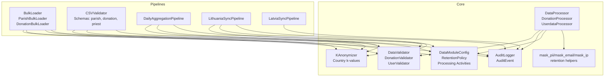
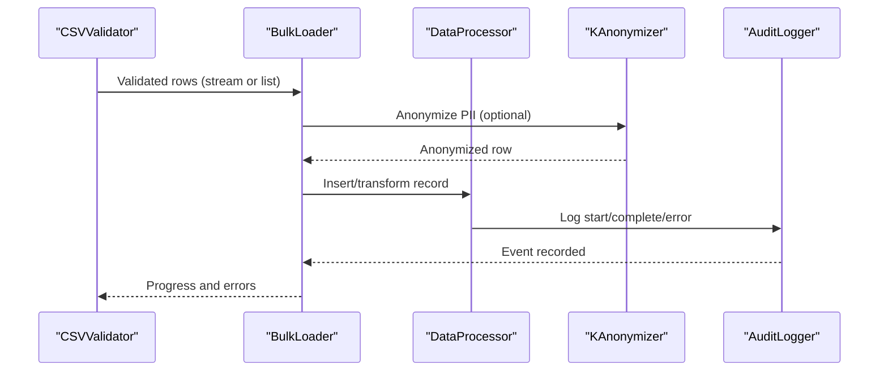
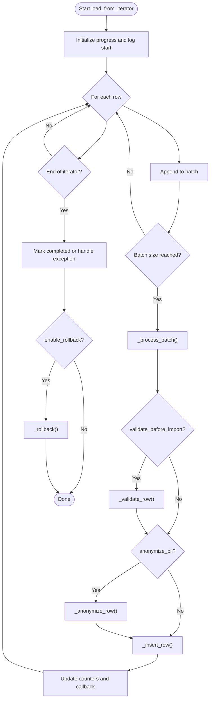
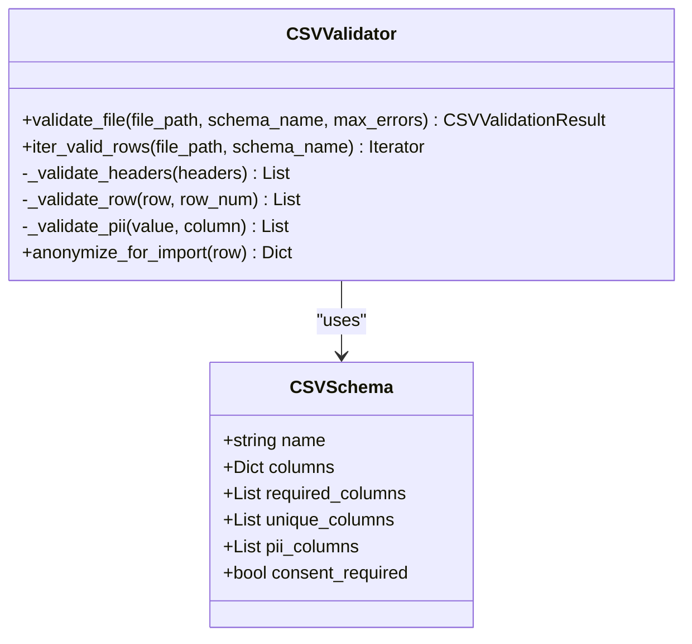
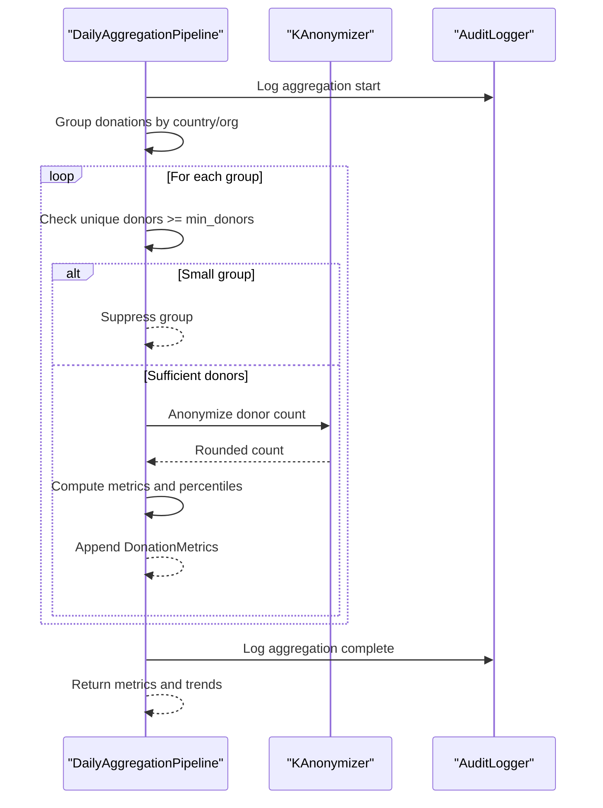
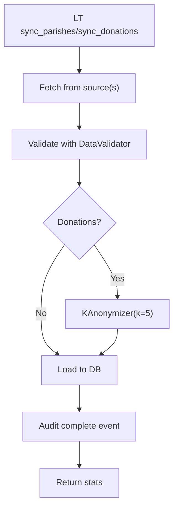
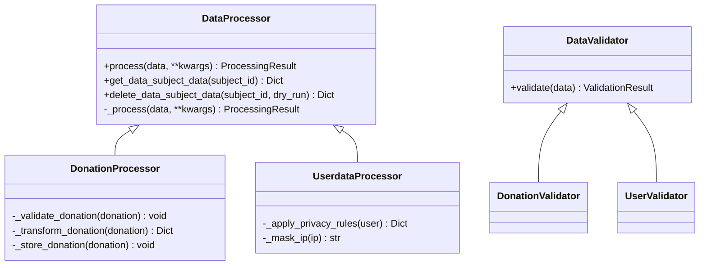
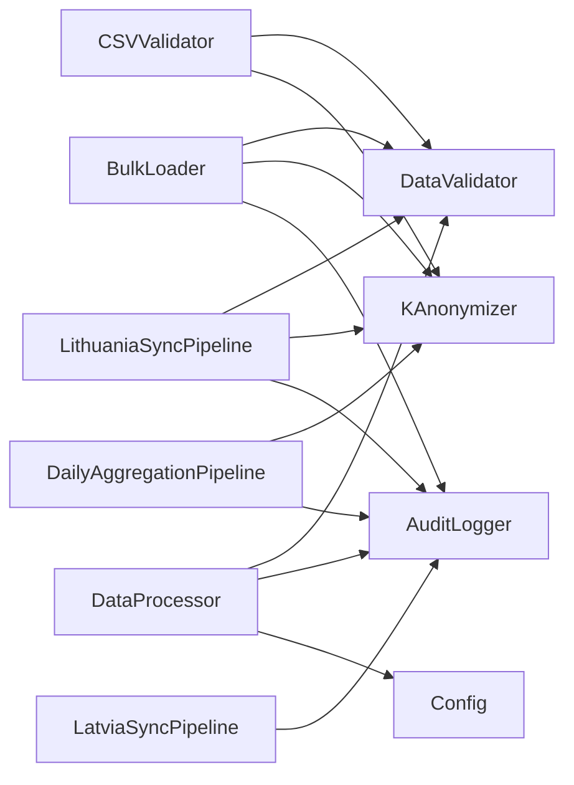

# Data Processing Scripts

<cite>
**Referenced Files in This Document**
- [bulk_loader.py](file://data/src/pipelines/entity_import/bulk_loader.py)
- [csv_validator.py](file://data/src/pipelines/entity_import/csv_validator.py)
- [daily_aggregation.py](file://data/src/pipelines/donation_analytics/daily_aggregation.py)
- [lt_sync.py](file://data/src/pipelines/country_sync/lt_sync.py)
- [lv_sync.py](file://data/src/pipelines/country_sync/lv_sync.py)
- [processors.py](file://data/src/processors.py)
- [validators.py](file://data/src/validators.py)
- [anonymizer.py](file://data/src/gdpr/anonymizer.py)
- [audit.py](file://data/src/audit.py)
- [config.py](file://data/src/config.py)
- [utils.py](file://data/src/utils.py)
- [cli.py](file://data/src/cli.py)
</cite>

## Table of Contents
1. [Introduction](#introduction)
2. [Project Structure](#project-structure)
3. [Core Components](#core-components)
4. [Architecture Overview](#architecture-overview)
5. [Detailed Component Analysis](#detailed-component-analysis)
6. [Dependency Analysis](#dependency-analysis)
7. [Performance Considerations](#performance-considerations)
8. [Troubleshooting Guide](#troubleshooting-guide)
9. [Conclusion](#conclusion)
10. [Appendices](#appendices)

## Introduction
This document explains the data processing scripts and pipeline components that power entity imports, CSV validation, donation analytics aggregation, and country-specific synchronization for Lithuania and Latvia. It covers processor classes, validation frameworks, error handling strategies, configuration options, performance considerations, and integration patterns with external systems. The design emphasizes GDPR compliance, auditability, and privacy-preserving analytics.

## Project Structure
The data processing logic is organized under data/src with clear separation of concerns:
- Pipelines: bulk import, CSV validation, donation analytics, country sync (LT/LV)
- Processors: abstract base and concrete processors for donations and users
- Validators: generic and domain-specific validators
- GDPR utilities: k-anonymization and country-specific thresholds
- Audit: tamper-evident audit logging with chain integrity
- Configuration: classification, retention policies, and module settings
- Utilities: masking, retention helpers, JSON encoding
- CLI: commands to inspect activities, generate reports, export data, query audits

**Diagram sources**
- [bulk_loader.py:72-257](file://data/src/pipelines/entity_import/bulk_loader.py#L72-L257)
- [csv_validator.py:120-210](file://data/src/pipelines/entity_import/csv_validator.py#L120-L210)
- [daily_aggregation.py:62-142](file://data/src/pipelines/donation_analytics/daily_aggregation.py#L62-L142)
- [lt_sync.py:48-140](file://data/src/pipelines/country_sync/lt_sync.py#L48-L140)
- [lv_sync.py:47-91](file://data/src/pipelines/country_sync/lv_sync.py#L47-L91)
- [processors.py:94-197](file://data/src/processors.py#L94-L197)
- [validators.py:75-119](file://data/src/validators.py#L75-L119)
- [anonymizer.py:106-157](file://data/src/gdpr/anonymizer.py#L106-L157)
- [audit.py:205-369](file://data/src/audit.py#L205-L369)
- [config.py:55-82](file://data/src/config.py#L55-L82)
- [utils.py:52-80](file://data/src/utils.py#L52-L80)

**Section sources**
- [bulk_loader.py:1-320](file://data/src/pipelines/entity_import/bulk_loader.py#L1-L320)
- [csv_validator.py:1-339](file://data/src/pipelines/entity_import/csv_validator.py#L1-L339)
- [daily_aggregation.py:1-242](file://data/src/pipelines/donation_analytics/daily_aggregation.py#L1-L242)
- [lt_sync.py:1-207](file://data/src/pipelines/country_sync/lt_sync.py#L1-L207)
- [lv_sync.py:1-97](file://data/src/pipelines/country_sync/lv_sync.py#L1-L97)
- [processors.py:1-762](file://data/src/processors.py#L1-L762)
- [validators.py:1-293](file://data/src/validators.py#L1-L293)
- [anonymizer.py:1-180](file://data/src/gdpr/anonymizer.py#L1-L180)
- [audit.py:1-644](file://data/src/audit.py#L1-L644)
- [config.py:1-124](file://data/src/config.py#L1-L124)
- [utils.py:1-131](file://data/src/utils.py#L1-L131)
- [cli.py:1-147](file://data/src/cli.py#L1-L147)

## Core Components
- Bulk Loader: Batched import with progress tracking, rollback, optional PII anonymization, and audit logging. Supports custom entity loaders (e.g., Parish, Donation).
- CSV Validator: Schema-driven validation for entity imports, consent checks, PII detection, encryption hooks, and streaming iteration for large files.
- Donation Analytics: Aggregates donations into k-anonymized metrics by country and organization type; suppresses small groups; computes percentiles; generates trends.
- Country Sync (LT/LV): Synchronizes parish and donation data from local church systems with validation, anonymization, and audit trails; supports incremental syncs.
- Processors: Abstract base for GDPR-compliant processing with pre/post hooks; concrete processors for donations and users including DSAR access and erasure workflows.
- Validators: Generic validator with GDPR-sensitive pattern detection and domain-specific validators for donations and users.
- K-Anonymizer: Country-specific k-thresholds and hashing of direct identifiers; count rounding for privacy.
- Audit Logger: Tamper-evident logs with hash chains, HMAC signatures, sequence numbers, and verification tools.
- Configuration: Data classification, retention policies, processing activity registry, and module-level settings.
- Utilities: Masking functions, retention calculations, and JSON encoders for datetime/decimal.

**Section sources**
- [bulk_loader.py:72-257](file://data/src/pipelines/entity_import/bulk_loader.py#L72-L257)
- [csv_validator.py:120-210](file://data/src/pipelines/entity_import/csv_validator.py#L120-L210)
- [daily_aggregation.py:62-142](file://data/src/pipelines/donation_analytics/daily_aggregation.py#L62-L142)
- [lt_sync.py:48-140](file://data/src/pipelines/country_sync/lt_sync.py#L48-L140)
- [lv_sync.py:47-91](file://data/src/pipelines/country_sync/lv_sync.py#L47-L91)
- [processors.py:94-197](file://data/src/processors.py#L94-L197)
- [validators.py:75-119](file://data/src/validators.py#L75-L119)
- [anonymizer.py:106-157](file://data/src/gdpr/anonymizer.py#L106-L157)
- [audit.py:205-369](file://data/src/audit.py#L205-L369)
- [config.py:55-82](file://data/src/config.py#L55-L82)
- [utils.py:52-80](file://data/src/utils.py#L52-L80)

## Architecture Overview
The system composes pipelines around a shared core:
- Ingestion: CSVValidator validates and optionally encrypts PII; BulkLoader batches and inserts records with rollback on failure.
- Transformation: Processors apply domain rules, privacy transformations, and store results; KAnonymizer ensures privacy for outputs.
- Analytics: DailyAggregationPipeline aggregates donations into privacy-safe metrics and trends.
- Country Sync: LT/LV pipelines fetch, validate, anonymize, and load data from external church systems with full audit trails.
- Compliance: AuditLogger provides tamper-evident logs; Config defines retention and classification; Utils provide masking and retention helpers.

**Diagram sources**
- [csv_validator.py:135-210](file://data/src/pipelines/entity_import/csv_validator.py#L135-L210)
- [bulk_loader.py:96-151](file://data/src/pipelines/entity_import/bulk_loader.py#L96-L151)
- [processors.py:138-192](file://data/src/processors.py#L138-L192)
- [anonymizer.py:112-125](file://data/src/gdpr/anonymizer.py#L112-L125)
- [audit.py:330-369](file://data/src/audit.py#L330-L369)

## Detailed Component Analysis

### Bulk Import Pipeline
- Purpose: Batch import entities with progress tracking, rollback, and audit logging.
- Key behaviors:
  - Batching configurable via batch_size; stop_on_error and max_errors control flow.
  - Optional validation before import and PII anonymization.
  - Rollback deletes imported IDs on failure; tracks status transitions.
  - Subclasses implement entity-specific validation and anonymization.
- Error handling: Accumulates per-row errors; raises when thresholds exceeded; logs exceptions and triggers rollback if enabled.

**Diagram sources**
- [bulk_loader.py:96-151](file://data/src/pipelines/entity_import/bulk_loader.py#L96-L151)
- [bulk_loader.py:160-197](file://data/src/pipelines/entity_import/bulk_loader.py#L160-L197)
- [bulk_loader.py:213-229](file://data/src/pipelines/entity_import/bulk_loader.py#L213-L229)

**Section sources**
- [bulk_loader.py:72-257](file://data/src/pipelines/entity_import/bulk_loader.py#L72-L257)
- [bulk_loader.py:259-320](file://data/src/pipelines/entity_import/bulk_loader.py#L259-L320)

### CSV Validation Framework
- Purpose: Validate CSV files against schemas with GDPR checks, consent requirements, and PII handling.
- Features:
  - Predefined schemas for parish, donation, priest with column types and required fields.
  - Header validation, required field checks, consent timestamp enforcement.
  - PII field validation (e.g., email format), encryption hook for PII prior to import.
  - Streaming iteration to avoid loading entire files into memory.
- Error handling: Collects up to max_errors; returns structured result with valid/invalid counts and errors.

**Diagram sources**
- [csv_validator.py:36-117](file://data/src/pipelines/entity_import/csv_validator.py#L36-L117)
- [csv_validator.py:120-210](file://data/src/pipelines/entity_import/csv_validator.py#L120-L210)
- [csv_validator.py:276-339](file://data/src/pipelines/entity_import/csv_validator.py#L276-L339)

**Section sources**
- [csv_validator.py:120-210](file://data/src/pipelines/entity_import/csv_validator.py#L120-L210)
- [csv_validator.py:276-339](file://data/src/pipelines/entity_import/csv_validator.py#L276-L339)

### Donation Analytics Aggregation
- Purpose: Generate k-anonymized donation analytics grouped by country and organization type.
- Key behaviors:
  - Groups donations, enforces minimum donor threshold to suppress small groups.
  - Computes total amount, counts, averages, medians, and percentiles (when sufficient data).
  - Uses KAnonymizer to round donor counts and anonymize identifiers.
  - Produces trend summaries over recent days without individual-level data.
- Privacy: Outputs are aggregated and k-anonymized; no raw donor identifiers exposed.

**Diagram sources**
- [daily_aggregation.py:82-142](file://data/src/pipelines/donation_analytics/daily_aggregation.py#L82-L142)
- [daily_aggregation.py:170-214](file://data/src/pipelines/donation_analytics/daily_aggregation.py#L170-L214)
- [daily_aggregation.py:216-242](file://data/src/pipelines/donation_analytics/daily_aggregation.py#L216-L242)
- [anonymizer.py:123-125](file://data/src/gdpr/anonymizer.py#L123-L125)

**Section sources**
- [daily_aggregation.py:62-142](file://data/src/pipelines/donation_analytics/daily_aggregation.py#L62-L142)
- [daily_aggregation.py:170-214](file://data/src/pipelines/donation_analytics/daily_aggregation.py#L170-L214)
- [daily_aggregation.py:216-242](file://data/src/pipelines/donation_analytics/daily_aggregation.py#L216-L242)

### Country-Specific Synchronization (Lithuania and Latvia)
- Lithuania (LT):
  - Sources: Catholic bishopric, parish registry, donation system, event calendar.
  - Workflow: Fetch parishes/donations, validate with DataValidator, anonymize donations (k=5), load to database, audit events for start/complete/errors.
  - Incremental sync support via since timestamp.
  - DSAR support: access and erasure endpoints with audit logging.
- Latvia (LV):
  - Sources: Catholic, Lutheran, Orthodox churches, parish registry.
  - Workflow: Iterate configured sources, sync each, aggregate stats, audit events.
  - Extensible per-source implementation placeholder.

**Diagram sources**
- [lt_sync.py:72-140](file://data/src/pipelines/country_sync/lt_sync.py#L72-L140)
- [lt_sync.py:147-179](file://data/src/pipelines/country_sync/lt_sync.py#L147-L179)
- [lt_sync.py:181-207](file://data/src/pipelines/country_sync/lt_sync.py#L181-L207)

**Section sources**
- [lt_sync.py:48-140](file://data/src/pipelines/country_sync/lt_sync.py#L48-L140)
- [lt_sync.py:147-207](file://data/src/pipelines/country_sync/lt_sync.py#L147-L207)
- [lv_sync.py:47-91](file://data/src/pipelines/country_sync/lv_sync.py#L47-L91)

### Processor Classes and Validation Framework
- DataProcessor:
  - Provides standardized lifecycle: pre-hooks, process, post-hooks, audit logging, error capture.
  - Enforces data classification and supports DSAR access/erasure contracts.
- DonationProcessor:
  - Validates required fields, transforms records, stores them, implements DSAR access and erasure with retention-aware deletion.
- UserdataProcessor:
  - Applies privacy rules (e.g., IP masking), stores user data, implements DSAR access and erasure with membership checks.
- Validators:
  - Base validator with GDPR-sensitive pattern detection and type checks.
  - DonationValidator enforces positive amounts, currency checks, AML warnings.
  - UserValidator checks consent fields and warns if none present.

**Diagram sources**
- [processors.py:94-197](file://data/src/processors.py#L94-L197)
- [processors.py:223-503](file://data/src/processors.py#L223-L503)
- [processors.py:506-762](file://data/src/processors.py#L506-L762)
- [validators.py:75-119](file://data/src/validators.py#L75-L119)
- [validators.py:201-269](file://data/src/validators.py#L201-L269)

**Section sources**
- [processors.py:94-197](file://data/src/processors.py#L94-L197)
- [processors.py:223-503](file://data/src/processors.py#L223-L503)
- [processors.py:506-762](file://data/src/processors.py#L506-L762)
- [validators.py:75-119](file://data/src/validators.py#L75-L119)
- [validators.py:201-269](file://data/src/validators.py#L201-L269)

### K-Anonymity and Country-Specific Thresholds
- KAnonymizer:
  - Hashes direct identifiers (name, email, donor_id, phone).
  - Rounds counts to nearest k for privacy.
  - Checks dataset k-anonymity against quasi-identifiers.
- Country thresholds:
  - Higher k for stricter jurisdictions (e.g., Germany, France).
  - Default EU k=5; environment override supported.
- Integration: Used by donation analytics and country sync pipelines to ensure privacy.

**Section sources**
- [anonymizer.py:25-83](file://data/src/gdpr/anonymizer.py#L25-L83)
- [anonymizer.py:106-157](file://data/src/gdpr/anonymizer.py#L106-L157)

### Audit Logging and Integrity
- AuditEvent:
  - Includes action, resource metadata, legal basis, data categories, retention period.
  - Computes hash and HMAC signature; seals with previous hash and sequence number.
- AuditLogger:
  - Writes append-only daily JSONL logs with chain state persistence.
  - Provides query, compliance report generation, and chain verification.
  - Logs GDPR requests and data subject operations.

**Section sources**
- [audit.py:65-203](file://data/src/audit.py#L65-L203)
- [audit.py:205-369](file://data/src/audit.py#L205-L369)
- [audit.py:475-624](file://data/src/audit.py#L475-L624)

### Configuration and Retention Policies
- DataModuleConfig:
  - Database and Redis connection settings.
  - GDPR flags (audit logging, masking, encryption at rest).
  - Processing limits (batch size, time limits).
- RetentionPolicy:
  - Financial and donation records retained for 7 years; user data 2 years; logs 90 days; backups 30 days.
- Processing Activities Registry:
  - Documents purposes, categories, recipients, retention, classification, security measures, and legal basis.

**Section sources**
- [config.py:12-27](file://data/src/config.py#L12-L27)
- [config.py:55-82](file://data/src/config.py#L55-L82)
- [config.py:85-124](file://data/src/config.py#L85-L124)

### Utilities and CLI
- Utilities:
  - Masking functions for PII, emails, IPs.
  - Retention date calculation and expiry checks.
  - JSON encoder for datetime/decimal.
- CLI:
  - Commands to list processing activities, generate compliance reports, export data subjects, display retention policies, and query audit events.

**Section sources**
- [utils.py:52-80](file://data/src/utils.py#L52-L80)
- [utils.py:83-131](file://data/src/utils.py#L83-L131)
- [cli.py:28-142](file://data/src/cli.py#L28-L142)

## Dependency Analysis
- Pipelines depend on validators, anonymizer, and audit logger for compliance and traceability.
- Processors encapsulate business logic and integrate with validators and audit logger; they also rely on configuration for retention and classification.
- Country sync pipelines orchestrate fetching, validation, anonymization, and loading while maintaining audit trails.
- CSV validator integrates with encryption utilities and validators to enforce GDPR constraints before import.

**Diagram sources**
- [csv_validator.py:120-210](file://data/src/pipelines/entity_import/csv_validator.py#L120-L210)
- [bulk_loader.py:96-151](file://data/src/pipelines/entity_import/bulk_loader.py#L96-L151)
- [daily_aggregation.py:82-142](file://data/src/pipelines/donation_analytics/daily_aggregation.py#L82-L142)
- [lt_sync.py:72-140](file://data/src/pipelines/country_sync/lt_sync.py#L72-L140)
- [lv_sync.py:62-91](file://data/src/pipelines/country_sync/lv_sync.py#L62-L91)
- [processors.py:138-197](file://data/src/processors.py#L138-L197)

**Section sources**
- [bulk_loader.py:96-151](file://data/src/pipelines/entity_import/bulk_loader.py#L96-L151)
- [csv_validator.py:120-210](file://data/src/pipelines/entity_import/csv_validator.py#L120-L210)
- [daily_aggregation.py:82-142](file://data/src/pipelines/donation_analytics/daily_aggregation.py#L82-L142)
- [lt_sync.py:72-140](file://data/src/pipelines/country_sync/lt_sync.py#L72-L140)
- [lv_sync.py:62-91](file://data/src/pipelines/country_sync/lv_sync.py#L62-L91)
- [processors.py:138-197](file://data/src/processors.py#L138-L197)

## Performance Considerations
- Batch sizing: Tune batch_size in BulkLoader and DailyAggregationConfig to balance throughput and memory usage.
- Streaming: Use CSVValidator.iter_valid_rows to process large CSVs without loading all rows into memory.
- Suppression: DailyAggregationPipeline suppresses small groups to protect privacy; adjust min_donors_for_reporting based on data volume.
- K-anonymity thresholds: Configure country-specific k values via environment or config to meet regulatory guidance.
- Audit overhead: Audit logging adds minimal overhead but ensures compliance; consider log rotation and retention policies.
- Database connections: Reuse connections where possible; use psycopg2 cursors efficiently in processors.

[No sources needed since this section provides general guidance]

## Troubleshooting Guide
- Bulk import failures:
  - Check progress.errors for per-row issues; review stop_on_error and max_errors settings.
  - Enable rollback to revert partial imports; verify _insert_row/_delete_row implementations.
- CSV validation errors:
  - Inspect CSVValidationResult.errors for missing headers, empty required fields, invalid PII formats.
  - Ensure consent_timestamp is present for PII fields; adjust ENTITY_SCHEMAS as needed.
- Donation analytics suppression:
  - If few groups produced, verify unique donor counts and min_donors_for_reporting threshold.
  - Confirm grouping keys (country, organization_type) are populated correctly.
- Country sync issues:
  - Validate fetched data with DataValidator; check _fetch_* placeholders for actual API integrations.
  - Review audit logs for start/complete/error events; confirm anonymization steps.
- Audit integrity:
  - Use verify_chain to detect chain breaks, sequence gaps, hash mismatches, or invalid signatures.
  - Ensure secret key is persisted and accessible; check log directory permissions.

**Section sources**
- [bulk_loader.py:160-197](file://data/src/pipelines/entity_import/bulk_loader.py#L160-L197)
- [csv_validator.py:135-210](file://data/src/pipelines/entity_import/csv_validator.py#L135-L210)
- [daily_aggregation.py:119-130](file://data/src/pipelines/donation_analytics/daily_aggregation.py#L119-L130)
- [lt_sync.py:89-113](file://data/src/pipelines/country_sync/lt_sync.py#L89-L113)
- [audit.py:513-624](file://data/src/audit.py#L513-L624)

## Conclusion
The data processing scripts provide a robust, GDPR-compliant foundation for entity imports, CSV validation, donation analytics, and country-specific synchronization. The architecture emphasizes privacy through k-anonymity, comprehensive audit logging with integrity protection, and configurable retention policies. Processors and validators offer extensibility for new data types and domains, while utilities and CLI support operational tasks and compliance reporting.

[No sources needed since this section summarizes without analyzing specific files]

## Appendices

### Configuration Options Summary
- BulkLoader.ImportConfig:
  - batch_size, stop_on_error, max_errors, enable_rollback, validate_before_import, anonymize_pii, audit_enabled, progress_callback.
- DailyAggregationConfig:
  - k_anonymity_threshold, min_donors_for_reporting, currencies, include_percentiles.
- DataModuleConfig:
  - postgres_host/port/database, redis_host/port, enable_audit_logging, enable_data_masking, enable_encryption_at_rest, max_batch_size, max_processing_time_minutes, default_retention_days.
- Environment overrides:
  - GDPR_K_ANONYMITY_VALUE for k-threshold; AUDIT_LOG_DIR for audit logs; DB_* variables for database connectivity.

**Section sources**
- [bulk_loader.py:59-70](file://data/src/pipelines/entity_import/bulk_loader.py#L59-L70)
- [daily_aggregation.py:53-60](file://data/src/pipelines/donation_analytics/daily_aggregation.py#L53-L60)
- [config.py:55-82](file://data/src/config.py#L55-L82)
- [anonymizer.py:73-83](file://data/src/gdpr/anonymizer.py#L73-L83)
- [utils.py:27-49](file://data/src/utils.py#L27-L49)

### Integration Patterns with External Systems
- Country sync pipelines:
  - Implement _fetch_parishes/_fetch_donations to call Lithuanian/Latvian church APIs.
  - Use DataValidator for schema conformance; KAnonymizer for privacy; AuditLogger for traceability.
- Processors:
  - Integrate with PostgreSQL via psycopg2; implement _store_* methods for persistence.
  - Support DSAR access/erasure by querying relevant tables and applying retention rules.
- CSV import:
  - Use CSVValidator.schemas to define column mappings; encrypt PII via encryption utilities before insertion.

**Section sources**
- [lt_sync.py:142-179](file://data/src/pipelines/country_sync/lt_sync.py#L142-L179)
- [lv_sync.py:93-97](file://data/src/pipelines/country_sync/lv_sync.py#L93-L97)
- [processors.py:29-37](file://data/src/processors.py#L29-L37)
- [processors.py:278-281](file://data/src/processors.py#L278-L281)
- [csv_validator.py:276-307](file://data/src/pipelines/entity_import/csv_validator.py#L276-L307)