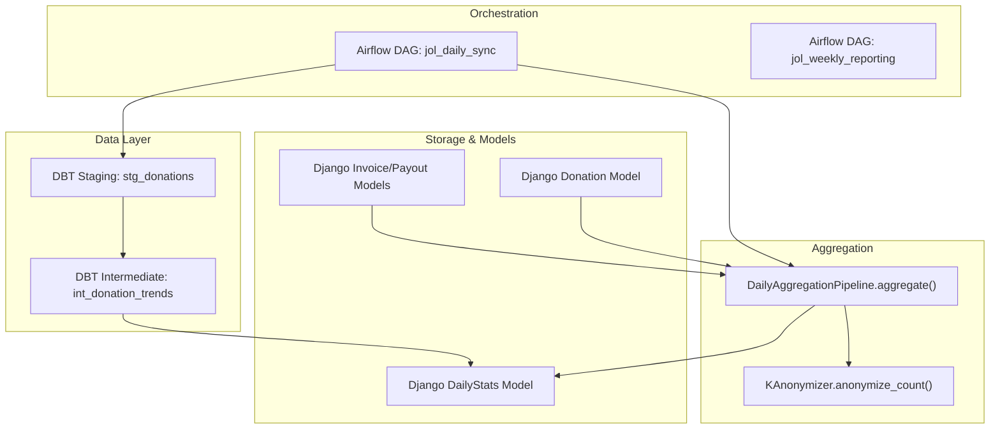
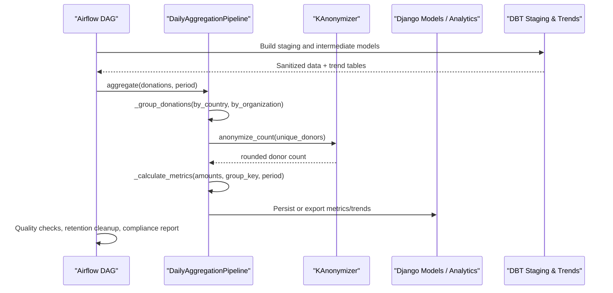
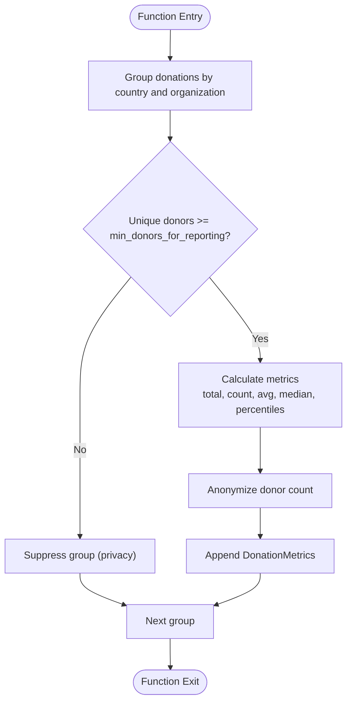
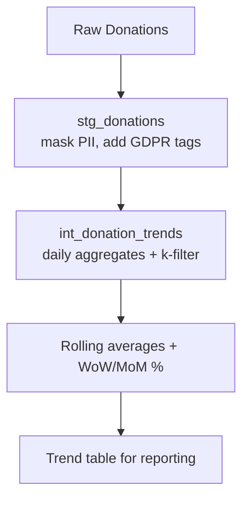
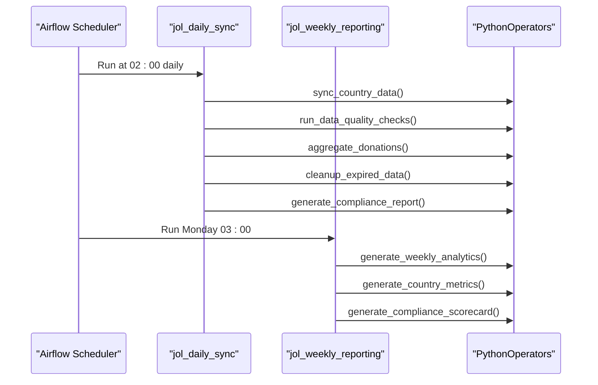
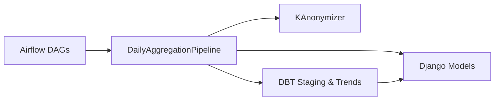

# Donation Analytics Aggregation

<cite>
**Referenced Files in This Document**
- [daily_aggregation.py](file://data/src/pipelines/donation_analytics/daily_aggregation.py)
- [__init__.py](file://data/src/pipelines/donation_analytics/__init__.py)
- [jol_daily_sync.py](file://data/airflow/dags/jol_daily_sync.py)
- [jol_weekly_reporting.py](file://data/airflow/dags/jol_weekly_reporting.py)
- [stg_donations.sql](file://data/dbt/models/staging/stg_donations.sql)
- [int_donation_trends.sql](file://data/src/transformations/intermediate/int_donation_trends.sql)
- [dbt_project.yml](file://data/dbt/dbt_project.yml)
- [models.py (Donations)](file://backend/django/apps/donations/models.py)
- [models.py (Financial)](file://backend/django/apps/financial/models.py)
- [models.py (Analytics)](file://backend/django/apps/analytics/models.py)
- [anonymizer.py](file://data/src/gdpr/anonymizer.py)
</cite>

## Table of Contents
1. [Introduction](#introduction)
2. [Project Structure](#project-structure)
3. [Core Components](#core-components)
4. [Architecture Overview](#architecture-overview)
5. [Detailed Component Analysis](#detailed-component-analysis)
6. [Dependency Analysis](#dependency-analysis)
7. [Performance Considerations](#performance-considerations)
8. [Troubleshooting Guide](#troubleshooting-guide)
9. [Conclusion](#conclusion)
10. [Appendices](#appendices)

## Introduction
This document describes the donation analytics aggregation pipeline that transforms raw donation data into GDPR-compliant, k-anonymized daily metrics and trend reports. It explains:
- Daily aggregation processes for donation metrics
- Financial reporting calculations and outputs
- Trend analysis methods and time-based grouping strategies
- Data transformations via dbt models
- Integration points with Airflow orchestration and Django-backed financial/analytics models
- Data quality checks, error handling, and monitoring approaches for financial data processing

The system ensures privacy by suppressing small groups and anonymizing donor counts, while providing robust aggregation for finance and analytics stakeholders.

## Project Structure
The donation analytics pipeline spans several layers:
- Orchestration: Airflow DAGs schedule daily and weekly tasks
- Ingestion/Staging: dbt staging model prepares raw donations with GDPR controls
- Transformation: Intermediate SQL computes trends with k-anonymity filters
- Aggregation: Python pipeline aggregates donations into k-anonymized metrics and trends
- Storage/Models: Django models represent donations, invoices, payouts, and aggregated stats

**Diagram sources**
- [jol_daily_sync.py:44-50](file://data/airflow/dags/jol_daily_sync.py#L44-L50)
- [jol_weekly_reporting.py:20-33](file://data/airflow/dags/jol_weekly_reporting.py#L20-L33)
- [stg_donations.sql:10-35](file://data/dbt/models/staging/stg_donations.sql#L10-L35)
- [int_donation_trends.sql:11-74](file://data/src/transformations/intermediate/int_donation_trends.sql#L11-L74)
- [daily_aggregation.py:82-142](file://data/src/pipelines/donation_analytics/daily_aggregation.py#L82-L142)
- [anonymizer.py:123-125](file://data/src/gdpr/anonymizer.py#L123-L125)
- [models.py (Donations):13-94](file://backend/django/apps/donations/models.py#L13-L94)
- [models.py (Financial):14-170](file://backend/django/apps/financial/models.py#L14-L170)
- [models.py (Analytics):107-134](file://backend/django/apps/analytics/models.py#L107-L134)

**Section sources**
- [jol_daily_sync.py:1-126](file://data/airflow/dags/jol_daily_sync.py#L1-L126)
- [jol_weekly_reporting.py:1-78](file://data/airflow/dags/jol_weekly_reporting.py#L1-L78)
- [stg_donations.sql:1-36](file://data/dbt/models/staging/stg_donations.sql#L1-L36)
- [int_donation_trends.sql:1-74](file://data/src/transformations/intermediate/int_donation_trends.sql#L1-L74)
- [dbt_project.yml:1-44](file://data/dbt/dbt_project.yml#L1-L44)
- [daily_aggregation.py:1-242](file://data/src/pipelines/donation_analytics/daily_aggregation.py#L1-L242)
- [anonymizer.py:1-180](file://data/src/gdpr/anonymizer.py#L1-L180)
- [models.py (Donations):1-146](file://backend/django/apps/donations/models.py#L1-L146)
- [models.py (Financial):1-170](file://backend/django/apps/financial/models.py#L1-L170)
- [models.py (Analytics):1-174](file://backend/django/apps/analytics/models.py#L1-L174)

## Core Components
- DailyAggregationPipeline: Groups donations by country and organization type, applies k-anonymity thresholds, calculates totals, averages, medians, percentiles, and generates trend summaries.
- KAnonymizer: Provides country-specific k-values and count rounding to ensure minimum group sizes; hashes direct identifiers when needed.
- DBT Staging and Intermediate Models: Prepare sanitized donation data and compute rolling averages and week/month-over-month changes with k-anonymity filters.
- Airflow DAGs: Orchestrate daily sync, quality checks, aggregation, retention cleanup, and compliance reporting; weekly DAG produces analytics and compliance scorecards.
- Django Models: Represent donations, invoices, payouts, and pre-aggregated daily stats used by reporting systems.

Key responsibilities:
- Privacy: Suppress groups below threshold; round donor counts; mask sensitive fields in staging.
- Accuracy: Use Decimal arithmetic for amounts; compute median and percentiles correctly.
- Auditability: Log start/complete events with metadata for traceability.
- Extensibility: Configurable grouping, periods, and inclusion of percentiles.

**Section sources**
- [daily_aggregation.py:32-80](file://data/src/pipelines/donation_analytics/daily_aggregation.py#L32-L80)
- [anonymizer.py:25-83](file://data/src/gdpr/anonymizer.py#L25-L83)
- [stg_donations.sql:10-35](file://data/dbt/models/staging/stg_donations.sql#L10-L35)
- [int_donation_trends.sql:11-74](file://data/src/transformations/intermediate/int_donation_trends.sql#L11-L74)
- [jol_daily_sync.py:44-50](file://data/airflow/dags/jol_daily_sync.py#L44-L50)
- [models.py (Donations):13-94](file://backend/django/apps/donations/models.py#L13-L94)
- [models.py (Financial):14-170](file://backend/django/apps/financial/models.py#L14-L170)
- [models.py (Analytics):107-134](file://backend/django/apps/analytics/models.py#L107-L134)

## Architecture Overview
The pipeline integrates orchestration, transformation, and aggregation layers:
- Airflow triggers daily tasks: country sync, data quality checks, donation aggregation, retention cleanup, and compliance reporting.
- DBT staging sanitizes raw donations and adds GDPR metadata; intermediate SQL computes trends with k-anonymity constraints.
- Python aggregation consumes donations, groups them, enforces privacy thresholds, and outputs metrics and trends.
- Django models persist operational data and pre-aggregated daily stats consumed by reporting dashboards.

**Diagram sources**
- [jol_daily_sync.py:44-50](file://data/airflow/dags/jol_daily_sync.py#L44-L50)
- [daily_aggregation.py:112-142](file://data/src/pipelines/donation_analytics/daily_aggregation.py#L112-L142)
- [anonymizer.py:123-125](file://data/src/gdpr/anonymizer.py#L123-L125)
- [stg_donations.sql:10-35](file://data/dbt/models/staging/stg_donations.sql#L10-L35)
- [int_donation_trends.sql:11-74](file://data/src/transformations/intermediate/int_donation_trends.sql#L11-L74)
- [models.py (Analytics):107-134](file://backend/django/apps/analytics/models.py#L107-L134)

## Detailed Component Analysis

### DailyAggregationPipeline
Responsibilities:
- Group donations by country and organization type
- Enforce k-anonymity thresholds to suppress small groups
- Compute metrics: total amount, count, average, median, percentiles
- Generate trend summaries over a configurable window

Processing logic:
- Grouping builds composite keys from country and organization type
- Unique donors are counted per group; if below threshold, group is suppressed
- Amounts are converted to Decimal for precision; sorted for median and percentile calculation
- Donor counts are anonymized by rounding to nearest k
- Trend generation aggregates recent daily metrics into totals and averages

**Diagram sources**
- [daily_aggregation.py:112-142](file://data/src/pipelines/donation_analytics/daily_aggregation.py#L112-L142)
- [daily_aggregation.py:170-214](file://data/src/pipelines/donation_analytics/daily_aggregation.py#L170-L214)
- [anonymizer.py:123-125](file://data/src/gdpr/anonymizer.py#L123-L125)

**Section sources**
- [daily_aggregation.py:82-142](file://data/src/pipelines/donation_analytics/daily_aggregation.py#L82-L142)
- [daily_aggregation.py:170-214](file://data/src/pipelines/donation_analytics/daily_aggregation.py#L170-L214)
- [daily_aggregation.py:216-242](file://data/src/pipelines/donation_analytics/daily_aggregation.py#L216-L242)

### KAnonymizer
Responsibilities:
- Provide country-specific k values based on regulatory guidance
- Round donor counts to nearest k to satisfy k-anonymity
- Hash direct identifiers when anonymizing records
- Validate dataset satisfaction of k-anonymity

Implementation highlights:
- Country mapping defines higher k for stricter jurisdictions
- Environment variable can override k value
- Count rounding uses integer division and multiplication to ensure multiples of k

**Section sources**
- [anonymizer.py:25-83](file://data/src/gdpr/anonymizer.py#L25-L83)
- [anonymizer.py:106-125](file://data/src/gdpr/anonymizer.py#L106-L125)
- [anonymizer.py:127-143](file://data/src/gdpr/anonymizer.py#L127-L143)

### DBT Staging and Intermediate Models
Staging:
- Masks payment references unless explicitly allowed
- Adds GDPR classification and retention expiry
- Filters out soft-deleted records

Intermediate:
- Computes daily totals, counts, unique donors, averages, and median
- Applies k-anonymity filter (minimum distinct donors)
- Calculates rolling 7-day average and week/month-over-month change percentages

**Diagram sources**
- [stg_donations.sql:10-35](file://data/dbt/models/staging/stg_donations.sql#L10-L35)
- [int_donation_trends.sql:11-74](file://data/src/transformations/intermediate/int_donation_trends.sql#L11-L74)

**Section sources**
- [stg_donations.sql:1-36](file://data/dbt/models/staging/stg_donations.sql#L1-L36)
- [int_donation_trends.sql:1-74](file://data/src/transformations/intermediate/int_donation_trends.sql#L1-L74)
- [dbt_project.yml:22-44](file://data/dbt/dbt_project.yml#L22-L44)

### Airflow Orchestration
Daily DAG:
- Syncs country data
- Runs data quality checks
- Executes donation aggregation
- Cleans expired data
- Generates compliance reports

Weekly DAG:
- Produces weekly analytics
- Generates country-level metrics
- Creates compliance scorecard

**Diagram sources**
- [jol_daily_sync.py:83-126](file://data/airflow/dags/jol_daily_sync.py#L83-L126)
- [jol_weekly_reporting.py:52-78](file://data/airflow/dags/jol_weekly_reporting.py#L52-L78)

**Section sources**
- [jol_daily_sync.py:1-126](file://data/airflow/dags/jol_daily_sync.py#L1-L126)
- [jol_weekly_reporting.py:1-78](file://data/airflow/dags/jol_weekly_reporting.py#L1-L78)

### Django Models Integration
- Donation model captures transaction details, status, payment method, recurring flags, gift aid, and optional messages; includes tenant context validation to prevent cross-tenant manipulation.
- Financial models define invoices and payouts with statuses, dates, amounts, VAT, and settlement tracking; also enforce tenant context validation.
- Analytics model stores page view events and pre-aggregated daily stats including total donations and donation count per organization per date.

These models provide the source and target structures for aggregation and reporting.

**Section sources**
- [models.py (Donations):13-94](file://backend/django/apps/donations/models.py#L13-L94)
- [models.py (Financial):14-170](file://backend/django/apps/financial/models.py#L14-L170)
- [models.py (Analytics):12-134](file://backend/django/apps/analytics/models.py#L12-L134)

## Dependency Analysis
- The aggregation pipeline depends on:
  - Airflow DAGs for scheduling and task execution
  - DBT models for staging and intermediate transformations
  - KAnonymizer for privacy-preserving count rounding
  - Django models for data persistence and retrieval
- Cohesion: Each component has a focused responsibility (orchestration, transformation, aggregation, storage).
- Coupling: Minimal coupling between components via well-defined interfaces (function calls, SQL views/tables, model schemas).
- External dependencies:
  - Airflow orchestrator
  - DBT engine
  - Django ORM and database
  - Logging and audit utilities

**Diagram sources**
- [jol_daily_sync.py:44-50](file://data/airflow/dags/jol_daily_sync.py#L44-L50)
- [daily_aggregation.py:82-142](file://data/src/pipelines/donation_analytics/daily_aggregation.py#L82-L142)
- [stg_donations.sql:10-35](file://data/dbt/models/staging/stg_donations.sql#L10-L35)
- [int_donation_trends.sql:11-74](file://data/src/transformations/intermediate/int_donation_trends.sql#L11-L74)
- [models.py (Donations):13-94](file://backend/django/apps/donations/models.py#L13-L94)

**Section sources**
- [jol_daily_sync.py:1-126](file://data/airflow/dags/jol_daily_sync.py#L1-L126)
- [daily_aggregation.py:1-242](file://data/src/pipelines/donation_analytics/daily_aggregation.py#L1-L242)
- [stg_donations.sql:1-36](file://data/dbt/models/staging/stg_donations.sql#L1-L36)
- [int_donation_trends.sql:1-74](file://data/src/transformations/intermediate/int_donation_trends.sql#L1-L74)
- [models.py (Donations):1-146](file://backend/django/apps/donations/models.py#L1-L146)

## Performance Considerations
- Use Decimal arithmetic for monetary amounts to avoid floating-point inaccuracies.
- Grouping by composite keys reduces repeated scans and improves aggregation efficiency.
- Apply k-anonymity filters early (in SQL where possible) to minimize downstream processing.
- Rolling windows and lag functions leverage database window functions for efficient trend computation.
- Batch operations in Airflow reduce overhead; configure retries and retry delays appropriately.
- Indexes on frequently filtered fields (e.g., organization, status, created_at) improve query performance.

[No sources needed since this section provides general guidance]

## Troubleshooting Guide
Common issues and resolutions:
- Small group suppression: If too many groups are suppressed, verify donor counts and adjust thresholds or grouping granularity.
- Missing trends: Ensure DBT staging and intermediate models build successfully; check for deleted records filtering and k-anonymity thresholds.
- Tenant context errors: Cross-tenant attempts raise validation errors; confirm correct tenant context during writes.
- Retention cleanup failures: Verify retention manager configuration and permissions for deleting expired data.
- Compliance reporting gaps: Confirm ROPA generator runs and produces expected summaries.

Operational checks:
- Monitor Airflow task logs for errors and retries
- Validate DBT model outputs for expected row counts and null distributions
- Inspect Django model validations and indexes for performance bottlenecks

**Section sources**
- [daily_aggregation.py:119-130](file://data/src/pipelines/donation_analytics/daily_aggregation.py#L119-L130)
- [stg_donations.sql:31-35](file://data/dbt/models/staging/stg_donations.sql#L31-L35)
- [int_donation_trends.sql:24-26](file://data/src/transformations/intermediate/int_donation_trends.sql#L24-L26)
- [models.py (Donations):105-136](file://backend/django/apps/donations/models.py#L105-L136)
- [models.py (Financial):57-94](file://backend/django/apps/financial/models.py#L57-L94)
- [models.py (Analytics):67-104](file://backend/django/apps/analytics/models.py#L67-L104)
- [jol_daily_sync.py:53-72](file://data/airflow/dags/jol_daily_sync.py#L53-L72)

## Conclusion
The donation analytics aggregation pipeline delivers GDPR-compliant, k-anonymized daily metrics and trend reports through a coordinated stack of Airflow orchestration, DBT transformations, Python aggregation, and Django models. It emphasizes privacy, accuracy, auditability, and extensibility, enabling reliable financial reporting and analytics across multiple countries and organization types.

[No sources needed since this section summarizes without analyzing specific files]

## Appendices

### Example Metric Calculations
- Total amount: Sum of all donation amounts in the group
- Average amount: Total amount divided by donation count
- Median amount: Middle value of sorted amounts
- Percentiles: 25th, 75th, 95th percentiles computed from sorted amounts when sufficient data exists
- Unique donors: Rounded to nearest k for k-anonymity

**Section sources**
- [daily_aggregation.py:170-214](file://data/src/pipelines/donation_analytics/daily_aggregation.py#L170-L214)
- [anonymizer.py:123-125](file://data/src/gdpr/anonymizer.py#L123-L125)

### Time-Based Grouping Strategies
- Daily aggregation by date truncation
- Rolling 7-day average for smoothing trends
- Week-over-week and month-over-month comparisons using lag functions

**Section sources**
- [int_donation_trends.sql:11-74](file://data/src/transformations/intermediate/int_donation_trends.sql#L11-L74)

### Output Formats
- DonationMetrics dataclass fields include period, totals, counts, averages, percentiles, currency, country, and organization type
- Trend summary includes period days, total donations, total amount, and daily averages

**Section sources**
- [daily_aggregation.py:32-50](file://data/src/pipelines/donation_analytics/daily_aggregation.py#L32-L50)
- [daily_aggregation.py:216-242](file://data/src/pipelines/donation_analytics/daily_aggregation.py#L216-L242)

### Integration Points
- Airflow DAGs trigger aggregation and reporting tasks
- DBT models prepare sanitized data and compute trends
- Django models store operational and aggregated data for reporting systems

**Section sources**
- [jol_daily_sync.py:83-126](file://data/airflow/dags/jol_daily_sync.py#L83-L126)
- [stg_donations.sql:10-35](file://data/dbt/models/staging/stg_donations.sql#L10-L35)
- [int_donation_trends.sql:11-74](file://data/src/transformations/intermediate/int_donation_trends.sql#L11-L74)
- [models.py (Analytics):107-134](file://backend/django/apps/analytics/models.py#L107-L134)