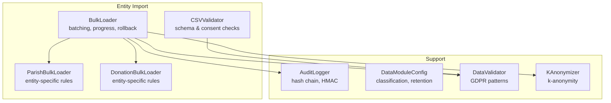
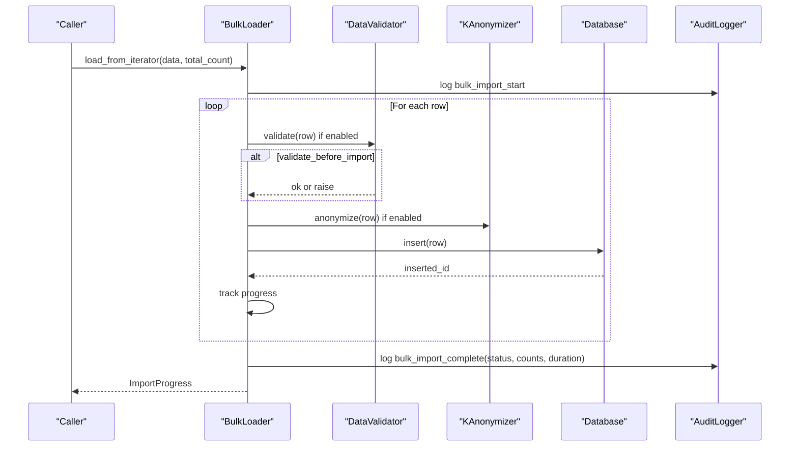
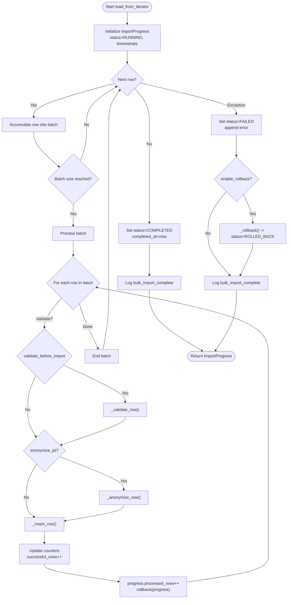
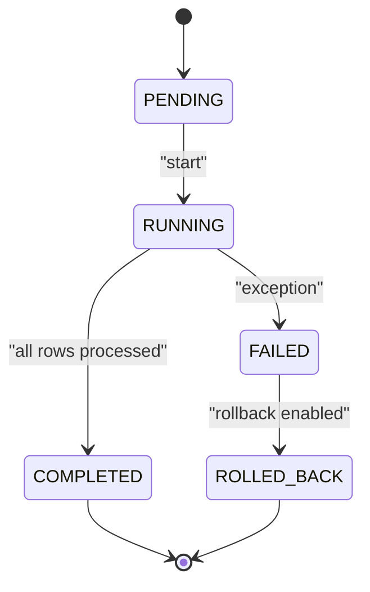
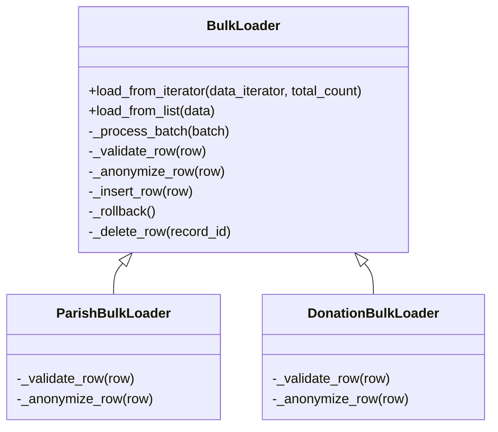
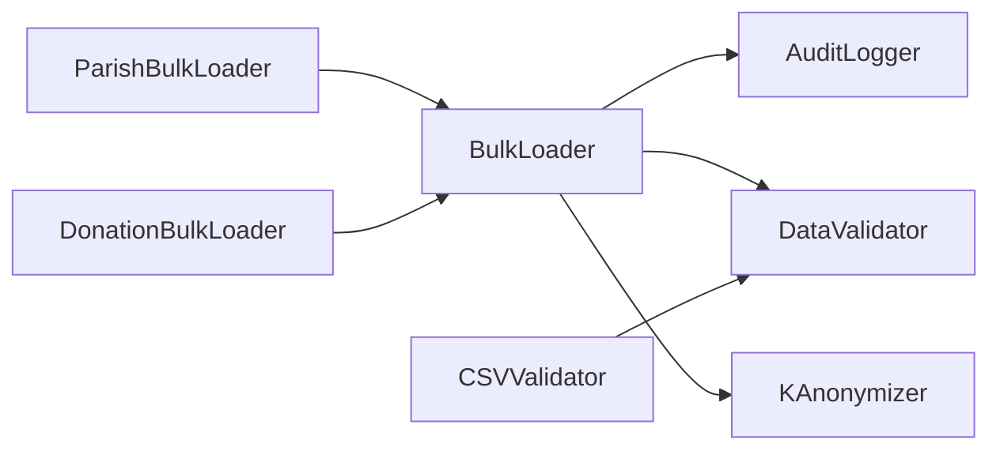

# Bulk Loader Framework

<cite>
**Referenced Files in This Document**
- [bulk_loader.py](file://data/src/pipelines/entity_import/bulk_loader.py)
- [csv_validator.py](file://data/src/pipelines/entity_import/csv_validator.py)
- [audit.py](file://data/src/audit.py)
- [config.py](file://data/src/config.py)
- [validators.py](file://data/src/validators.py)
- [anonymizer.py](file://data/src/gdpr/anonymizer.py)
</cite>

## Table of Contents
1. [Introduction](#introduction)
2. [Project Structure](#project-structure)
3. [Core Components](#core-components)
4. [Architecture Overview](#architecture-overview)
5. [Detailed Component Analysis](#detailed-component-analysis)
6. [Dependency Analysis](#dependency-analysis)
7. [Performance Considerations](#performance-considerations)
8. [Troubleshooting Guide](#troubleshooting-guide)
9. [Conclusion](#conclusion)
10. [Appendices](#appendices)

## Introduction
This document explains the BulkLoader framework architecture used for GDPR-compliant bulk data imports. It focuses on:
- The core BulkLoader class with batch processing, progress tracking, and rollback mechanisms
- ImportConfig configuration options controlling batching, error handling, validation, anonymization, and auditing
- ImportProgress dataclass for tracking import status, success/failure counts, and timing metrics
- ImportStatus enum states and their transitions during an import run
- Examples of extending the framework by implementing custom loaders with entity-specific validation and anonymization methods

The framework is designed to be extensible, secure, and auditable, supporting entity-specific logic via subclassing while centralizing cross-cutting concerns like batching, progress reporting, rollback, and audit logging.

## Project Structure
The BulkLoader framework resides under the data processing pipelines and related utilities:
- Core loader and entity-specific loaders: data/src/pipelines/entity_import/bulk_loader.py
- CSV schema and validation helpers: data/src/pipelines/entity_import/csv_validator.py
- Audit logging and integrity chain: data/src/audit.py
- Data classification and module config: data/src/config.py
- Validators and validation results: data/src/validators.py
- K-anonymity anonymization: data/src/gdpr/anonymizer.py

**Diagram sources**
- [bulk_loader.py:72-256](file://data/src/pipelines/entity_import/bulk_loader.py#L72-L256)
- [csv_validator.py:120-210](file://data/src/pipelines/entity_import/csv_validator.py#L120-L210)
- [audit.py:205-369](file://data/src/audit.py#L205-L369)
- [config.py:55-82](file://data/src/config.py#L55-L82)
- [validators.py:75-119](file://data/src/validators.py#L75-L119)
- [anonymizer.py:106-121](file://data/src/gdpr/anonymizer.py#L106-L121)

**Section sources**
- [bulk_loader.py:1-320](file://data/src/pipelines/entity_import/bulk_loader.py#L1-L320)
- [csv_validator.py:1-339](file://data/src/pipelines/entity_import/csv_validator.py#L1-L339)
- [audit.py:1-644](file://data/src/audit.py#L1-L644)
- [config.py:1-124](file://data/src/config.py#L1-L124)
- [validators.py:1-293](file://data/src/validators.py#L1-L293)
- [anonymizer.py:1-180](file://data/src/gdpr/anonymizer.py#L1-L180)

## Core Components
- BulkLoader: Orchestrates batched imports, tracks progress, handles errors, supports rollback, and emits audit events.
- ImportConfig: Controls batch_size, stop_on_error, max_errors, enable_rollback, validate_before_import, anonymize_pii, audit_enabled, and progress_callback.
- ImportProgress: Tracks total_rows, processed_rows, successful_rows, failed_rows, started_at, completed_at, status, and errors; provides progress_percent and duration_seconds.
- ImportStatus: Enumerates PENDING, RUNNING, COMPLETED, FAILED, ROLLED_BACK states and transitions.
- Entity-specific loaders (e.g., ParishBulkLoader, DonationBulkLoader): Override _validate_row and _anonymize_row to implement domain rules.

Key behaviors:
- Batching: Rows are accumulated until batch_size is reached or the iterator ends, then processed as a batch.
- Validation: Optional per-row validation before insertion.
- Anonymization: Optional PII masking/anonymization before insertion.
- Insertion: Subclasses provide actual database insertion logic.
- Error handling: stop_on_error halts immediately; otherwise continue up to max_errors.
- Rollback: On failure, imported IDs are deleted to restore state.
- Audit: Start and completion events are logged with metadata including status, counts, and duration.

**Section sources**
- [bulk_loader.py:24-70](file://data/src/pipelines/entity_import/bulk_loader.py#L24-L70)
- [bulk_loader.py:72-256](file://data/src/pipelines/entity_import/bulk_loader.py#L72-L256)

## Architecture Overview
The BulkLoader coordinates data ingestion through configurable batching, validation, anonymization, persistence, and auditing. Entity-specific subclasses customize validation and anonymization steps.

**Diagram sources**
- [bulk_loader.py:96-151](file://data/src/pipelines/entity_import/bulk_loader.py#L96-L151)
- [bulk_loader.py:160-196](file://data/src/pipelines/entity_import/bulk_loader.py#L160-L196)
- [audit.py:330-369](file://data/src/audit.py#L330-L369)

## Detailed Component Analysis

### BulkLoader Class
Responsibilities:
- Initialize with entity_type, optional ImportConfig, and optional AuditLogger
- Maintain ImportProgress and list of imported IDs for rollback
- Provide load_from_iterator and load_from_list entry points
- Process batches, invoke validation/anonymization/insertion, update progress, handle errors, and perform rollback when needed
- Emit audit events at start and completion

Batch processing flow:
- Accumulate rows into a batch until batch_size or end of iterator
- For each row in batch:
  - Validate if configured
  - Anonymize if configured
  - Insert and record ID
  - Update counters and progress
  - Report progress via callback if provided
- On exception: mark FAILED, append error, optionally rollback, log exception, complete audit

Rollback mechanism:
- On failure, iterate over tracked imported IDs and delete them
- Set status to ROLLED_BACK and clear tracked IDs

Extensibility points:
- _validate_row: override for entity-specific validation
- _anonymize_row: override for entity-specific anonymization
- _insert_row: override to persist records
- _delete_row: override to support rollback deletion

**Diagram sources**
- [bulk_loader.py:96-151](file://data/src/pipelines/entity_import/bulk_loader.py#L96-L151)
- [bulk_loader.py:160-229](file://data/src/pipelines/entity_import/bulk_loader.py#L160-L229)
- [bulk_loader.py:231-256](file://data/src/pipelines/entity_import/bulk_loader.py#L231-L256)

**Section sources**
- [bulk_loader.py:72-256](file://data/src/pipelines/entity_import/bulk_loader.py#L72-L256)

### ImportConfig Dataclass
Configuration options:
- batch_size: number of rows per batch
- stop_on_error: whether to halt on first error
- max_errors: maximum errors allowed before raising RuntimeError
- enable_rollback: whether to roll back imported records on failure
- validate_before_import: whether to validate each row before insertion
- anonymize_pii: whether to anonymize PII fields before insertion
- audit_enabled: whether to emit audit events for start and completion
- progress_callback: callable invoked with current ImportProgress after each row

These settings control the behavior of the BulkLoader’s processing pipeline and determine when validation, anonymization, auditing, and rollback occur.

**Section sources**
- [bulk_loader.py:59-70](file://data/src/pipelines/entity_import/bulk_loader.py#L59-L70)

### ImportProgress Dataclass
Tracks:
- total_rows: total rows encountered
- processed_rows: rows processed so far
- successful_rows: rows successfully inserted
- failed_rows: rows that failed during processing
- started_at: timestamp when import began
- completed_at: timestamp when import finished
- status: current ImportStatus
- errors: list of error details

Computed properties:
- progress_percent: percentage of total rows processed
- duration_seconds: elapsed time from start to now or completion

**Section sources**
- [bulk_loader.py:33-57](file://data/src/pipelines/entity_import/bulk_loader.py#L33-L57)

### ImportStatus Enum and Transitions
States:
- PENDING: initial state before processing
- RUNNING: processing has begun
- COMPLETED: all rows processed without fatal exceptions
- FAILED: a fatal exception occurred
- ROLLED_BACK: rollback was executed after failure

Transitions:
- PENDING → RUNNING: at start of load_from_iterator
- RUNNING → COMPLETED: after successful processing of all rows
- RUNNING → FAILED: on unhandled exception
- FAILED → ROLLED_BACK: if enable_rollback is True and rollback executes
- Any terminal state remains unless re-initialized

**Diagram sources**
- [bulk_loader.py:24-31](file://data/src/pipelines/entity_import/bulk_loader.py#L24-L31)
- [bulk_loader.py:111-151](file://data/src/pipelines/entity_import/bulk_loader.py#L111-L151)
- [bulk_loader.py:213-224](file://data/src/pipelines/entity_import/bulk_loader.py#L213-L224)

**Section sources**
- [bulk_loader.py:24-31](file://data/src/pipelines/entity_import/bulk_loader.py#L24-L31)
- [bulk_loader.py:111-151](file://data/src/pipelines/entity_import/bulk_loader.py#L111-L151)
- [bulk_loader.py:213-224](file://data/src/pipelines/entity_import/bulk_loader.py#L213-L224)

### Entity-Specific Loaders: Custom Validation and Anonymization
Examples included in the framework:
- ParishBulkLoader: validates required parish fields and masks emails/IPs for PII
- DonationBulkLoader: validates donation fields and amount positivity; applies k-anonymity to donor identifiers

To extend:
- Subclass BulkLoader with your entity_type
- Implement _validate_row to enforce entity-specific business rules
- Implement _anonymize_row to mask or pseudonymize PII according to policy
- Implement _insert_row to persist records to your storage backend
- Optionally implement _delete_row to support rollback deletions

**Diagram sources**
- [bulk_loader.py:72-256](file://data/src/pipelines/entity_import/bulk_loader.py#L72-L256)
- [bulk_loader.py:259-320](file://data/src/pipelines/entity_import/bulk_loader.py#L259-L320)

**Section sources**
- [bulk_loader.py:259-320](file://data/src/pipelines/entity_import/bulk_loader.py#L259-L320)

### CSV Validation and Schema Support
The CSVValidator provides schema-based validation for CSV files prior to import:
- Defines schemas for entities such as parish, donation, priest with column types and requirements
- Validates headers, required columns, consent fields, and PII formats
- Supports streaming iteration over valid rows for large files
- Provides encryption helpers for PII fields when integrating with secure storage

While not part of BulkLoader’s runtime, it complements the import pipeline by ensuring data quality and compliance before loading.

**Section sources**
- [csv_validator.py:36-117](file://data/src/pipelines/entity_import/csv_validator.py#L36-L117)
- [csv_validator.py:120-210](file://data/src/pipelines/entity_import/csv_validator.py#L120-L210)
- [csv_validator.py:276-339](file://data/src/pipelines/entity_import/csv_validator.py#L276-L339)

### Audit Logging Integration
BulkLoader integrates with AuditLogger to record:
- Start of bulk import with configuration metadata
- Completion with status, totals, failures, and duration

AuditLogger maintains a hash chain and HMAC signatures for tamper detection and includes sequence numbers for ordering verification.

**Section sources**
- [bulk_loader.py:231-256](file://data/src/pipelines/entity_import/bulk_loader.py#L231-L256)
- [audit.py:65-203](file://data/src/audit.py#L65-L203)
- [audit.py:205-369](file://data/src/audit.py#L205-L369)

### Data Classification and Module Configuration
DataModuleConfig defines global settings such as database connections, Redis caching, GDPR flags, processing limits, and default retention periods. DataClassification enumerates data sensitivity levels aligned with GDPR requirements.

**Section sources**
- [config.py:12-27](file://data/src/config.py#L12-L27)
- [config.py:55-82](file://data/src/config.py#L55-L82)

### Validators and Anonymization Utilities
- DataValidator provides GDPR-aware validation rules, pattern checks, and quality checks
- KAnonymizer implements k-anonymity with country-specific thresholds and hashing of direct identifiers

These utilities can be leveraged within custom loaders’ validation and anonymization methods.

**Section sources**
- [validators.py:75-119](file://data/src/validators.py#L75-L119)
- [validators.py:201-233](file://data/src/validators.py#L201-L233)
- [anonymizer.py:106-121](file://data/src/gdpr/anonymizer.py#L106-L121)
- [anonymizer.py:127-143](file://data/src/gdpr/anonymizer.py#L127-L143)

## Dependency Analysis
BulkLoader depends on:
- AuditLogger for audit event emission
- DataValidator indirectly via CSVValidator and potential custom validations
- KAnonymizer for donor anonymization in DonationBulkLoader
- Config for data classification and module-level settings

**Diagram sources**
- [bulk_loader.py:72-256](file://data/src/pipelines/entity_import/bulk_loader.py#L72-L256)
- [csv_validator.py:120-210](file://data/src/pipelines/entity_import/csv_validator.py#L120-L210)
- [audit.py:205-369](file://data/src/audit.py#L205-L369)
- [anonymizer.py:106-121](file://data/src/gdpr/anonymizer.py#L106-L121)

**Section sources**
- [bulk_loader.py:72-256](file://data/src/pipelines/entity_import/bulk_loader.py#L72-L256)
- [csv_validator.py:120-210](file://data/src/pipelines/entity_import/csv_validator.py#L120-L210)
- [audit.py:205-369](file://data/src/audit.py#L205-L369)
- [anonymizer.py:106-121](file://data/src/gdpr/anonymizer.py#L106-L121)

## Performance Considerations
- Batch size tuning: Larger batches reduce overhead but increase memory usage and rollback scope; smaller batches improve responsiveness and limit rollback impact
- Validation and anonymization costs: Enable only when necessary; consider pre-validation via CSVValidator to reduce runtime overhead
- Error thresholds: Use max_errors to prevent runaway error accumulation; configure stop_on_error for strict modes
- Progress callbacks: Keep callbacks lightweight to avoid slowing the import loop
- Rollback efficiency: Ensure _delete_row is efficient; consider transactional semantics if supported by your storage layer

[No sources needed since this section provides general guidance]

## Troubleshooting Guide
Common issues and resolutions:
- Max errors exceeded: Increase max_errors or fix data quality; review errors in ImportProgress.errors
- Stop on error: Disable stop_on_error to continue processing despite individual row failures
- Rollback failures: Verify _delete_row implementation and permissions; check logs for rollback warnings
- Audit logs missing: Ensure audit_enabled is True and AuditLogger is properly initialized
- Validation failures: Check required fields and formats; use CSVValidator to pre-validate CSVs

**Section sources**
- [bulk_loader.py:160-196](file://data/src/pipelines/entity_import/bulk_loader.py#L160-L196)
- [bulk_loader.py:213-229](file://data/src/pipelines/entity_import/bulk_loader.py#L213-L229)
- [bulk_loader.py:231-256](file://data/src/pipelines/entity_import/bulk_loader.py#L231-L256)
- [csv_validator.py:135-210](file://data/src/pipelines/entity_import/csv_validator.py#L135-L210)

## Conclusion
The BulkLoader framework provides a robust, configurable, and auditable foundation for bulk data imports. Its design emphasizes:
- Clear separation of concerns via subclassing for entity-specific logic
- Comprehensive progress tracking and error handling
- Secure anonymization and validation hooks
- Tamper-evident audit logging with integrity protection

By leveraging ImportConfig, ImportProgress, and ImportStatus, teams can implement reliable, compliant, and observable import pipelines tailored to their entities and policies.

[No sources needed since this section summarizes without analyzing specific files]

## Appendices

### Example: Extending the Framework with a Custom Loader
Steps:
- Create a subclass of BulkLoader with your entity_type
- Implement _validate_row to enforce required fields and business rules
- Implement _anonymize_row to mask or pseudonymize PII using utilities like KAnonymizer or masking functions
- Implement _insert_row to persist records to your database
- Optionally implement _delete_row to support rollback

Reference implementations:
- ParishBulkLoader demonstrates field validation and email/IP masking
- DonationBulkLoader demonstrates amount validation and k-anonymity application

**Section sources**
- [bulk_loader.py:259-320](file://data/src/pipelines/entity_import/bulk_loader.py#L259-L320)
- [anonymizer.py:106-121](file://data/src/gdpr/anonymizer.py#L106-L121)