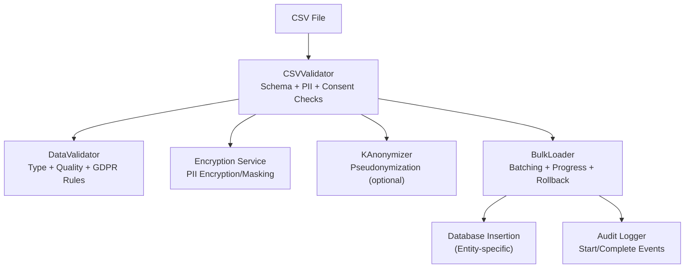
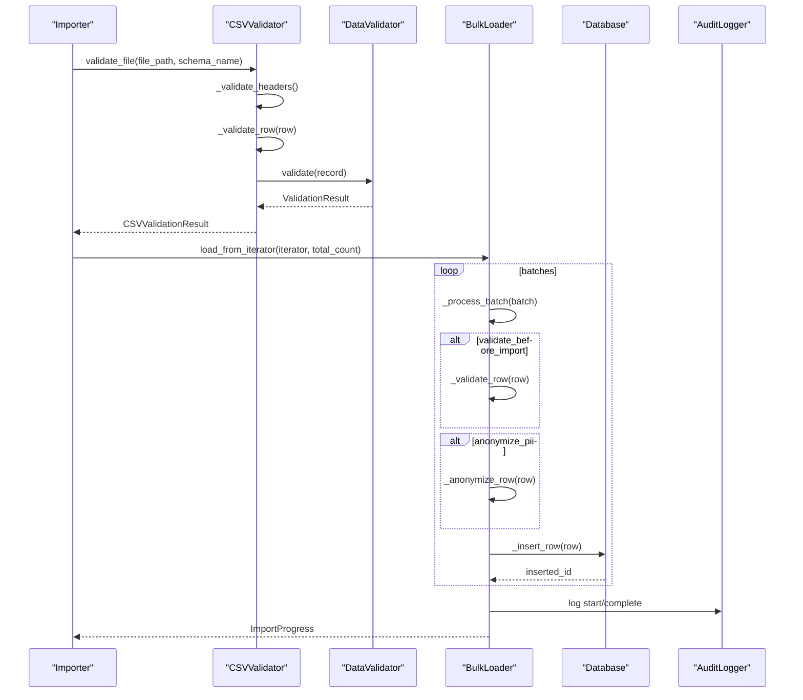
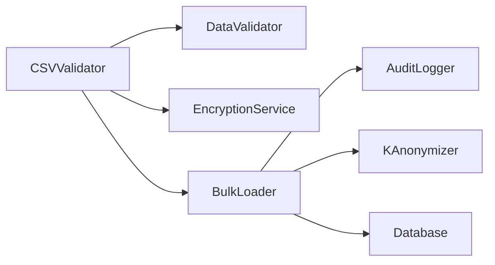
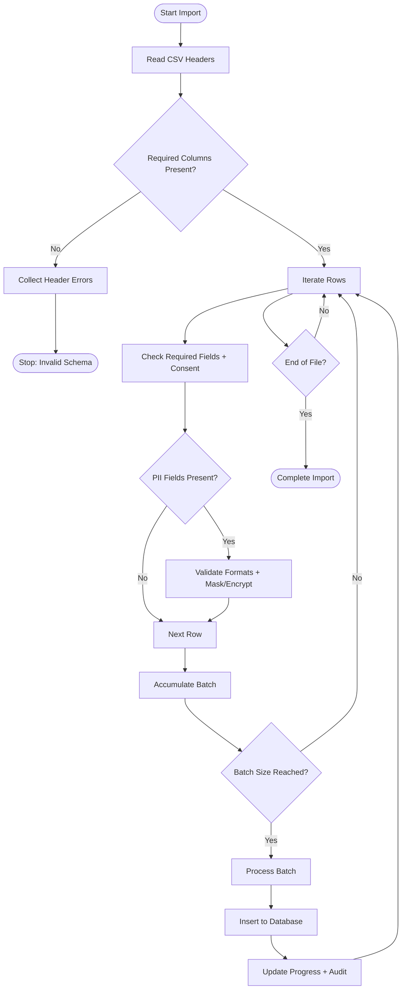
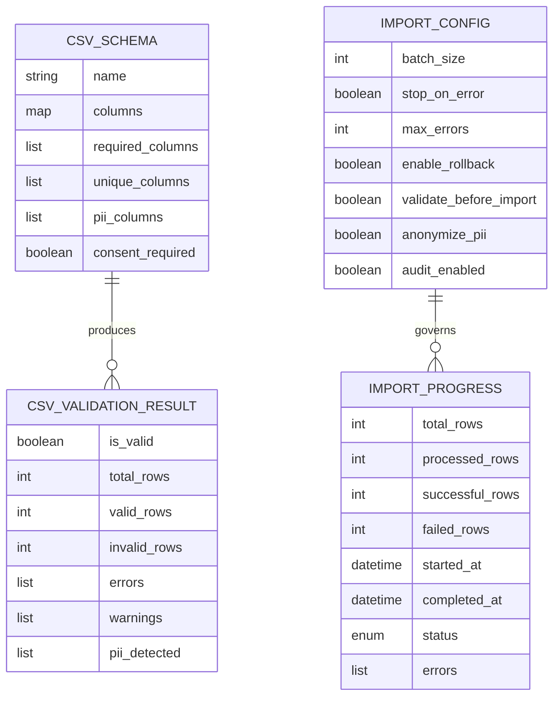

# CSV Validation System

<cite>
**Referenced Files in This Document**
- [csv_validator.py](file://data/src/pipelines/entity_import/csv_validator.py)
- [bulk_loader.py](file://data/src/pipelines/entity_import/bulk_loader.py)
- [validators.py](file://data/src/validators.py)
- [anonymizer.py](file://data/src/gdpr/anonymizer.py)
- [encryption.py](file://data/src/encryption.py)
- [config.py](file://data/src/config.py)
- [entity_completeness.py](file://data/src/quality/expectations/entity_completeness.py)
</cite>

## Table of Contents
1. [Introduction](#introduction)
2. [Project Structure](#project-structure)
3. [Core Components](#core-components)
4. [Architecture Overview](#architecture-overview)
5. [Detailed Component Analysis](#detailed-component-analysis)
6. [Dependency Analysis](#dependency-analysis)
7. [Performance Considerations](#performance-considerations)
8. [Troubleshooting Guide](#troubleshooting-guide)
9. [Conclusion](#conclusion)
10. [Appendices](#appendices)

## Introduction
This document explains the CSV validation system used for entity imports and bulk loading. It covers the end-to-end pipeline that validates CSV files before they are loaded into the database, including schema validation, data type checks, business rule enforcement, GDPR compliance (PII detection and masking), and error reporting. It also documents integration patterns with the bulk loader framework and provides examples of custom validators for different entity types.

## Project Structure
The CSV validation system is implemented under the data processing module and integrates with a bulk loader to perform batched, audited, and rollback-capable imports.

**Diagram sources**
- [csv_validator.py:120-210](file://data/src/pipelines/entity_import/csv_validator.py#L120-L210)
- [validators.py:75-119](file://data/src/validators.py#L75-L119)
- [encryption.py:346-462](file://data/src/encryption.py#L346-L462)
- [anonymizer.py:106-143](file://data/src/gdpr/anonymizer.py#L106-L143)
- [bulk_loader.py:72-151](file://data/src/pipelines/entity_import/bulk_loader.py#L72-L151)

**Section sources**
- [csv_validator.py:1-339](file://data/src/pipelines/entity_import/csv_validator.py#L1-L339)
- [bulk_loader.py:1-320](file://data/src/pipelines/entity_import/bulk_loader.py#L1-L320)
- [validators.py:1-293](file://data/src/validators.py#L1-L293)
- [anonymizer.py:1-180](file://data/src/gdpr/anonymizer.py#L1-L180)
- [encryption.py:1-575](file://data/src/encryption.py#L1-L575)
- [config.py:1-124](file://data/src/config.py#L1-L124)
- [entity_completeness.py:36-78](file://data/src/quality/expectations/entity_completeness.py#L36-L78)

## Core Components
- CSVValidator: Validates CSV headers, required fields, consent presence, and PII formatting; supports streaming iteration over rows.
- DataValidator: Provides generic field type checks, GDPR-sensitive content warnings, and data quality rules.
- BulkLoader: Orchestrates batched imports, progress tracking, optional pre-import validation, anonymization, audit logging, and rollback on failure.
- KAnonymizer: Applies pseudonymization and k-anonymity checks for GDPR-compliant handling of identifiers.
- EncryptionService: Secure encryption/decryption with key management and rotation for PII at rest.

Key responsibilities:
- Schema validation: Required columns and unique constraints per entity type.
- Data type checking: Type hints and format validation (e.g., email).
- Business rules: Positive amounts, currency allowlists, consent requirements.
- GDPR features: PII detection, consent verification, masking/encryption, k-anonymity.
- Error reporting: Structured errors with row/column context and severity.

**Section sources**
- [csv_validator.py:120-210](file://data/src/pipelines/entity_import/csv_validator.py#L120-L210)
- [validators.py:75-119](file://data/src/validators.py#L75-L119)
- [bulk_loader.py:72-151](file://data/src/pipelines/entity_import/bulk_loader.py#L72-L151)
- [anonymizer.py:106-143](file://data/src/gdpr/anonymizer.py#L106-L143)
- [encryption.py:346-462](file://data/src/encryption.py#L346-L462)

## Architecture Overview
The import pipeline processes CSVs through a layered validation approach before committing to storage.

**Diagram sources**
- [csv_validator.py:135-210](file://data/src/pipelines/entity_import/csv_validator.py#L135-L210)
- [validators.py:101-119](file://data/src/validators.py#L101-L119)
- [bulk_loader.py:96-151](file://data/src/pipelines/entity_import/bulk_loader.py#L96-L151)
- [bulk_loader.py:231-256](file://data/src/pipelines/entity_import/bulk_loader.py#L231-L256)

## Detailed Component Analysis

### CSVValidator
Responsibilities:
- Load CSV using DictReader and enforce schema-defined required columns.
- Enforce consent presence when configured for the schema.
- Validate PII fields (e.g., email format) and mask sensitive values in logs.
- Provide streaming iteration over valid rows for memory-efficient processing.

Error handling:
- Missing required columns produce header-level errors.
- Missing required fields per row produce row-scoped errors.
- Consent timestamp missing triggers GDPR-related errors when consent is required.
- File read exceptions are captured and reported.

GDPR features:
- Column classification distinguishes PII, sensitive, consent, business, and public fields.
- PII fields are flagged for encryption/masking during import.
- Optional encryption via EncryptionService or fallback hashing for standalone usage.

Integration points:
- Uses DataValidator for generic type and quality checks.
- Works with BulkLoader by yielding validated rows or providing iterators.

**Section sources**
- [csv_validator.py:27-117](file://data/src/pipelines/entity_import/csv_validator.py#L27-L117)
- [csv_validator.py:120-210](file://data/src/pipelines/entity_import/csv_validator.py#L120-L210)
- [csv_validator.py:212-275](file://data/src/pipelines/entity_import/csv_validator.py#L212-L275)
- [csv_validator.py:276-339](file://data/src/pipelines/entity_import/csv_validator.py#L276-L339)

### DataValidator
Responsibilities:
- Validate required fields (subclass-specific).
- Check expected types for known keys.
- Detect potential sensitive categories (health, religion, political, etc.) and warn about consent.
- Enforce personal data formats (e.g., email).
- Basic data quality checks (empty strings, injection patterns).

Extensibility:
- Subclass for domain-specific validations (e.g., DonationValidator enforces positive amounts and currency lists).

**Section sources**
- [validators.py:16-65](file://data/src/validators.py#L16-L65)
- [validators.py:75-119](file://data/src/validators.py#L75-L119)
- [validators.py:121-199](file://data/src/validators.py#L121-L199)
- [validators.py:201-233](file://data/src/validators.py#L201-L233)
- [validators.py:236-269](file://data/src/validators.py#L236-L269)
- [validators.py:272-293](file://data/src/validators.py#L272-L293)

### BulkLoader
Responsibilities:
- Batch ingestion with configurable batch size.
- Track progress and duration.
- Optional pre-import validation and PII anonymization.
- Audit logging for start and completion events.
- Automatic rollback on failure by deleting imported records.

Integration patterns:
- Accepts an iterator of rows from CSVValidator.iter_valid_rows or any upstream generator.
- Entity-specific loaders override validation and anonymization logic (e.g., ParishBulkLoader, DonationBulkLoader).

Error handling:
- Collects per-row errors up to a configured maximum.
- Stops early if configured to stop on first error.
- Rolls back all previously inserted records on failure.

**Section sources**
- [bulk_loader.py:24-70](file://data/src/pipelines/entity_import/bulk_loader.py#L24-L70)
- [bulk_loader.py:72-151](file://data/src/pipelines/entity_import/bulk_loader.py#L72-L151)
- [bulk_loader.py:160-229](file://data/src/pipelines/entity_import/bulk_loader.py#L160-L229)
- [bulk_loader.py:231-256](file://data/src/pipelines/entity_import/bulk_loader.py#L231-L256)
- [bulk_loader.py:259-320](file://data/src/pipelines/entity_import/bulk_loader.py#L259-L320)

### GDPR Compliance: PII Detection and Masking
- PII detection:
  - Column classification marks PII and sensitive fields.
  - DataValidator detects sensitive text patterns and warns about consent.
- Masking and encryption:
  - CSVValidator masks partial values in error logs for emails.
  - BulkLoader can anonymize rows using utility functions or KAnonymizer.
  - EncryptionService provides secure encryption/decryption with key lifecycle management and rotation.
- K-anonymity:
  - KAnonymizer hashes direct identifiers and supports k-anonymity checks based on country-specific thresholds.

**Section sources**
- [csv_validator.py:249-275](file://data/src/pipelines/entity_import/csv_validator.py#L249-L275)
- [bulk_loader.py:272-319](file://data/src/pipelines/entity_import/bulk_loader.py#L272-L319)
- [anonymizer.py:25-83](file://data/src/gdpr/anonymizer.py#L25-L83)
- [anonymizer.py:106-143](file://data/src/gdpr/anonymizer.py#L106-L143)
- [encryption.py:346-462](file://data/src/encryption.py#L346-L462)

### Custom Validators for Different Entities
Examples:
- ParishBulkLoader:
  - Requires parish_id, parish_name, country.
  - Masks email and priest_email using utility functions.
- DonationBulkLoader:
  - Requires donation_id, parish_id, amount, currency, date.
  - Validates amount positivity and currency validity.
  - Applies KAnonymizer to donor information.

These demonstrate how to extend BulkLoader with entity-specific rules and anonymization strategies.

**Section sources**
- [bulk_loader.py:259-320](file://data/src/pipelines/entity_import/bulk_loader.py#L259-L320)
- [validators.py:201-233](file://data/src/validators.py#L201-L233)

### Integration Patterns with Bulk Loader Framework
- Pre-validation:
  - Use CSVValidator.validate_file or iter_valid_rows to filter invalid rows before feeding BulkLoader.
- Streaming:
  - CSVValidator.iter_valid_rows yields (row, errors) tuples for memory-efficient processing.
- Configuration:
  - ImportConfig controls batch_size, stop_on_error, max_errors, enable_rollback, validate_before_import, anonymize_pii, and progress_callback.
- Auditing:
  - BulkLoader logs start and complete events with metadata for compliance.

**Section sources**
- [csv_validator.py:320-339](file://data/src/pipelines/entity_import/csv_validator.py#L320-L339)
- [bulk_loader.py:59-70](file://data/src/pipelines/entity_import/bulk_loader.py#L59-L70)
- [bulk_loader.py:96-151](file://data/src/pipelines/entity_import/bulk_loader.py#L96-L151)
- [bulk_loader.py:231-256](file://data/src/pipelines/entity_import/bulk_loader.py#L231-L256)

## Dependency Analysis
High-level dependencies between components:

**Diagram sources**
- [csv_validator.py:120-210](file://data/src/pipelines/entity_import/csv_validator.py#L120-L210)
- [bulk_loader.py:72-151](file://data/src/pipelines/entity_import/bulk_loader.py#L72-L151)
- [anonymizer.py:106-143](file://data/src/gdpr/anonymizer.py#L106-L143)
- [encryption.py:346-462](file://data/src/encryption.py#L346-L462)

Coupling and cohesion:
- CSVValidator encapsulates schema and PII checks, delegating generic validation to DataValidator.
- BulkLoader centralizes batching, auditing, and rollback, while allowing entity-specific overrides.
- GDPR utilities (KAnonymizer, EncryptionService) are pluggable and invoked conditionally.

Potential circular dependencies:
- None observed; CSVValidator depends on validators and encryption, BulkLoader depends on audit and anonymizer.

External integrations:
- Database insertion is abstracted in BulkLoader._insert_row for implementation flexibility.
- Audit logging uses an external logger abstraction.

**Section sources**
- [csv_validator.py:120-210](file://data/src/pipelines/entity_import/csv_validator.py#L120-L210)
- [bulk_loader.py:72-151](file://data/src/pipelines/entity_import/bulk_loader.py#L72-L151)
- [anonymizer.py:106-143](file://data/src/gdpr/anonymizer.py#L106-L143)
- [encryption.py:346-462](file://data/src/encryption.py#L346-L462)

## Performance Considerations
- Streaming validation:
  - CSVValidator.iter_valid_rows avoids loading entire files into memory.
- Batch sizing:
  - Tune ImportConfig.batch_size to balance throughput and memory usage.
- Error limits:
  - Configure max_errors to prevent excessive error collection overhead.
- Anonymization cost:
  - KAnonymizer hashing and grouping add CPU overhead; apply only when needed.
- Encryption overhead:
  - EncryptionService adds cryptographic operations; use efficient providers and consider caching where appropriate.

[No sources needed since this section provides general guidance]

## Troubleshooting Guide
Common issues and resolutions:
- Missing required columns:
  - Ensure CSV headers match schema.required_columns.
- Empty required fields:
  - Populate all required fields per row; validator reports row and column context.
- Invalid email format:
  - Correct email syntax; validator flags invalid formats.
- Missing consent timestamp:
  - Include consent_timestamp when consent is required by schema.
- Excessive errors:
  - Adjust max_errors and review batch processing logs.
- Rollback failures:
  - Verify database deletion logic in BulkLoader._delete_row implementation.

Operational tips:
- Enable audit logging to track import start/complete events and durations.
- Use progress callbacks to monitor real-time status.
- For large datasets, prefer streaming via iter_valid_rows and larger batch sizes.

**Section sources**
- [csv_validator.py:212-275](file://data/src/pipelines/entity_import/csv_validator.py#L212-L275)
- [bulk_loader.py:160-229](file://data/src/pipelines/entity_import/bulk_loader.py#L160-L229)
- [bulk_loader.py:231-256](file://data/src/pipelines/entity_import/bulk_loader.py#L231-L256)

## Conclusion
The CSV validation system provides a robust, GDPR-aware pipeline for entity imports. It combines schema validation, type and quality checks, business rules, and strong privacy controls (masking, encryption, k-anonymity). The BulkLoader ensures reliable, audited, and reversible batch processing. Extensibility points allow custom validators and anonymization strategies per entity type, making the system adaptable to diverse business needs while maintaining compliance and performance.

[No sources needed since this section summarizes without analyzing specific files]

## Appendices

### Validation Pipeline Flowchart

**Diagram sources**
- [csv_validator.py:135-210](file://data/src/pipelines/entity_import/csv_validator.py#L135-L210)
- [bulk_loader.py:96-151](file://data/src/pipelines/entity_import/bulk_loader.py#L96-L151)

### Data Models Diagram

**Diagram sources**
- [csv_validator.py:36-57](file://data/src/pipelines/entity_import/csv_validator.py#L36-L57)
- [bulk_loader.py:33-70](file://data/src/pipelines/entity_import/bulk_loader.py#L33-L70)