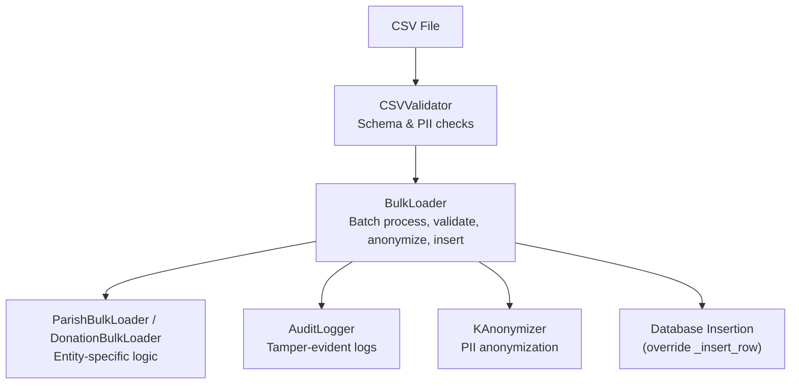
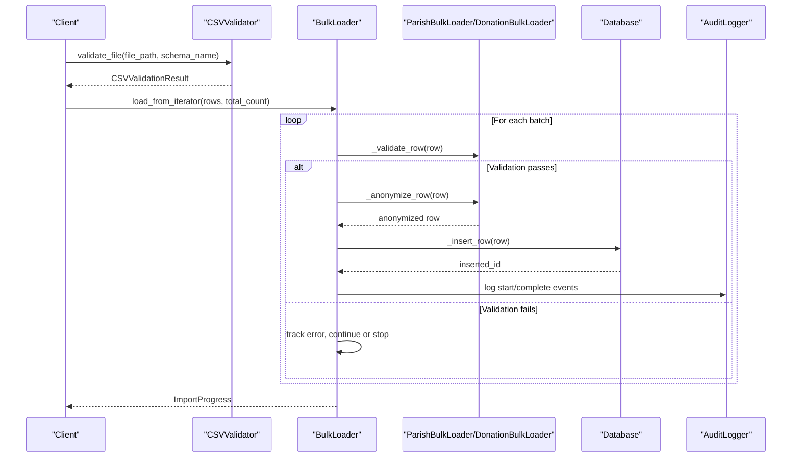
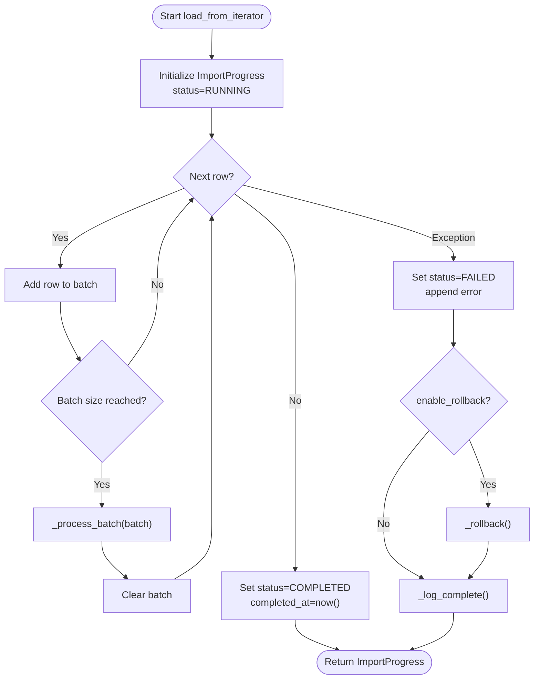
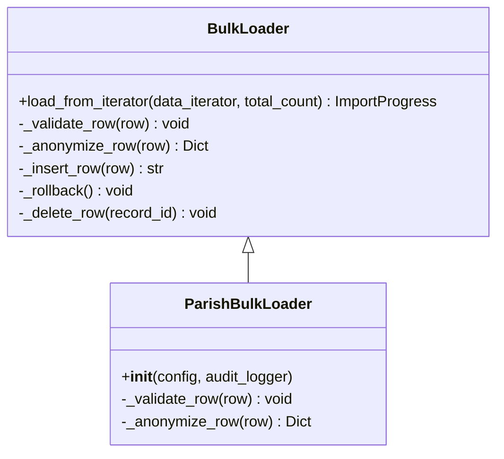
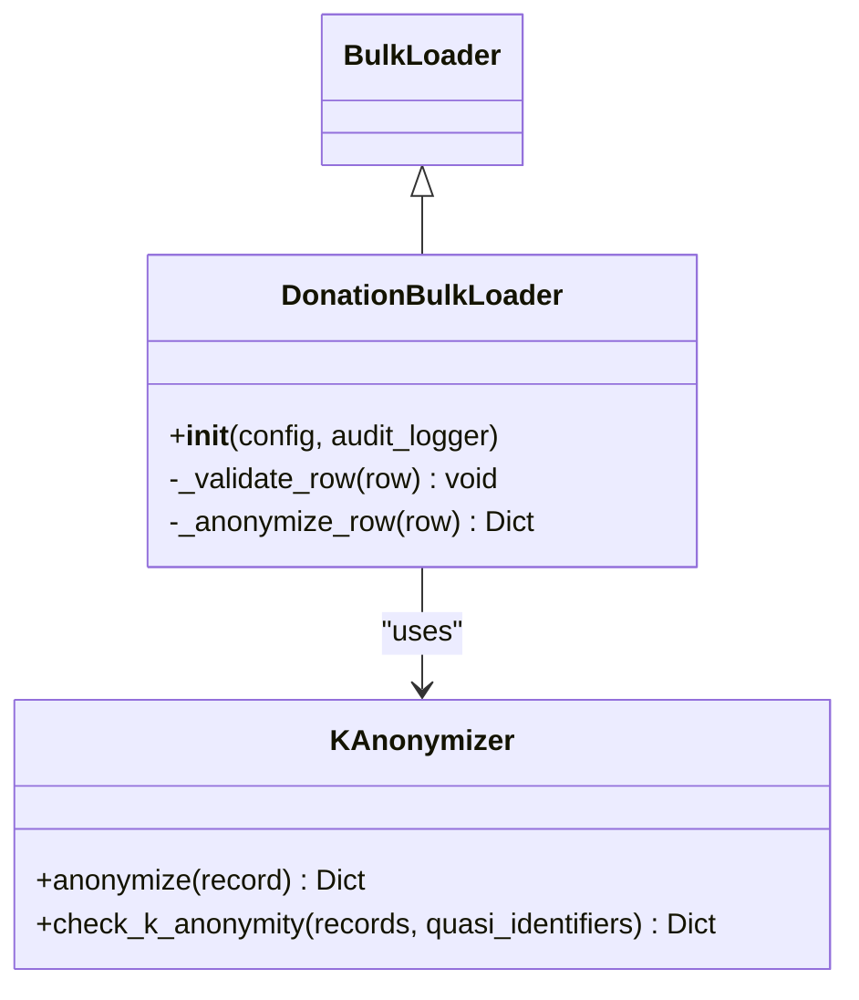
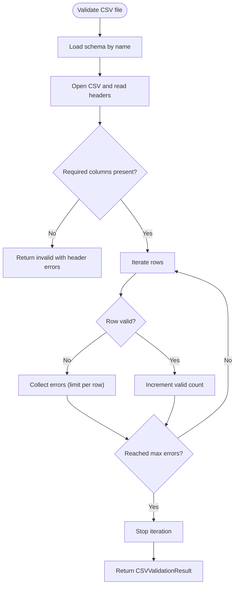
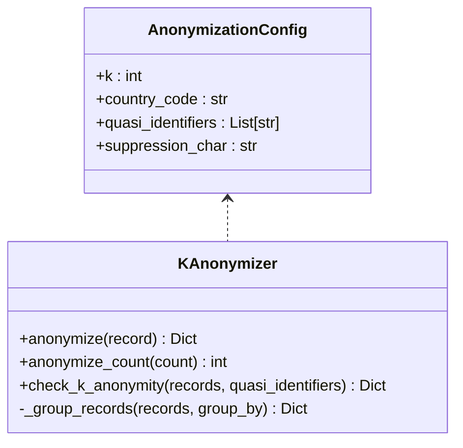
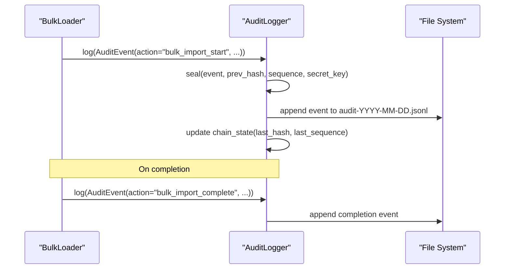
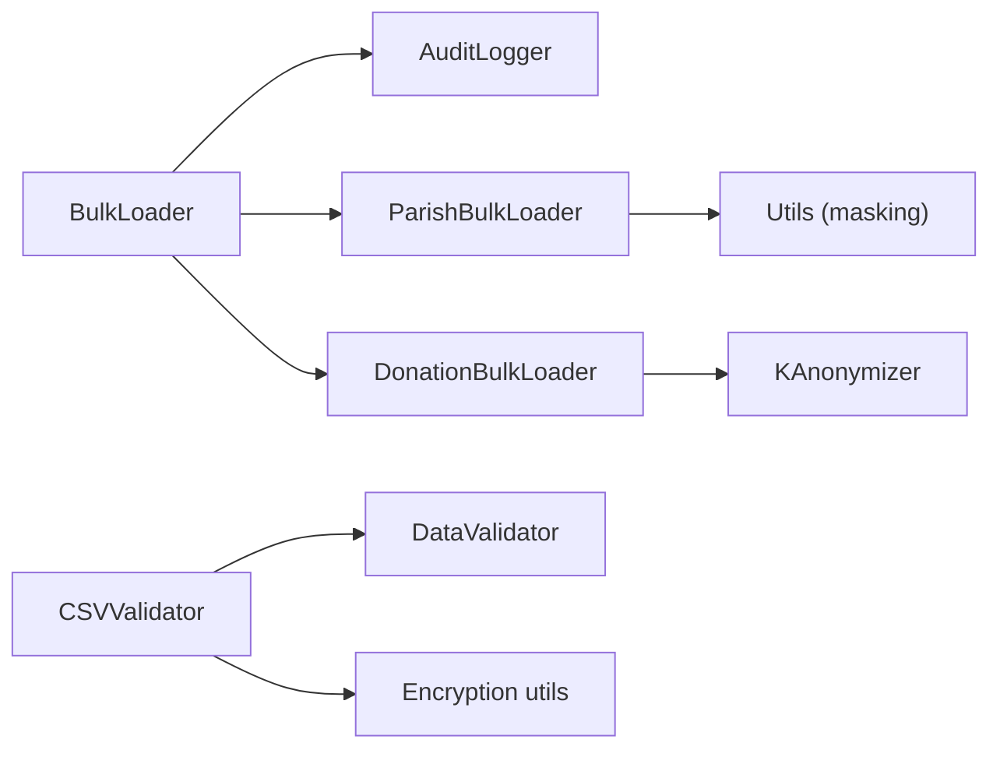

# Entity Import Pipeline

<cite>
**Referenced Files in This Document**
- [bulk_loader.py](file://data/src/pipelines/entity_import/bulk_loader.py)
- [csv_validator.py](file://data/src/pipelines/entity_import/csv_validator.py)
- [anonymizer.py](file://data/src/gdpr/anonymizer.py)
- [audit.py](file://data/src/audit.py)
- [validators.py](file://data/src/validators.py)
- [config.py](file://data/src/config.py)
- [utils.py](file://data/src/utils.py)
</cite>

## Table of Contents
1. [Introduction](#introduction)
2. [Project Structure](#project-structure)
3. [Core Components](#core-components)
4. [Architecture Overview](#architecture-overview)
5. [Detailed Component Analysis](#detailed-component-analysis)
6. [Dependency Analysis](#dependency-analysis)
7. [Performance Considerations](#performance-considerations)
8. [Troubleshooting Guide](#troubleshooting-guide)
9. [Conclusion](#conclusion)
10. [Appendices](#appendices)

## Introduction
This document explains the entity import pipeline system with a focus on GDPR-compliant bulk loading, CSV validation, data anonymization, audit logging, and configuration options. It covers the BulkLoader architecture for batch processing, progress tracking, and rollback capabilities; the CSVValidator for schema-based validation and PII handling; the KAnonymizer for anonymization; and the AuditLogger for tamper-evident audit trails. It also provides examples of ParishBulkLoader and DonationBulkLoader implementations to illustrate entity-specific validation and anonymization patterns, and outlines integration points for external data sources and database insertion strategies.

## Project Structure
The entity import pipeline is implemented under the data module’s pipelines directory and integrates with GDPR utilities and auditing:

- Bulk loader orchestration and batch processing: data/src/pipelines/entity_import/bulk_loader.py
- CSV schema validation and PII checks: data/src/pipelines/entity_import/csv_validator.py
- K-anonymity and anonymization helpers: data/src/gdpr/anonymizer.py
- Tamper-evident audit logging: data/src/audit.py
- Data validators and quality rules: data/src/validators.py
- Configuration and retention policies: data/src/config.py
- Utilities (masking, encryption helpers): data/src/utils.py

**Diagram sources**
- [bulk_loader.py:72-256](file://data/src/pipelines/entity_import/bulk_loader.py#L72-L256)
- [csv_validator.py:120-210](file://data/src/pipelines/entity_import/csv_validator.py#L120-L210)
- [anonymizer.py:106-122](file://data/src/gdpr/anonymizer.py#L106-L122)
- [audit.py:205-369](file://data/src/audit.py#L205-L369)

**Section sources**
- [bulk_loader.py:1-320](file://data/src/pipelines/entity_import/bulk_loader.py#L1-L320)
- [csv_validator.py:1-339](file://data/src/pipelines/entity_import/csv_validator.py#L1-L339)
- [anonymizer.py:1-180](file://data/src/gdpr/anonymizer.py#L1-L180)
- [audit.py:1-644](file://data/src/audit.py#L1-L644)
- [validators.py:1-293](file://data/src/validators.py#L1-L293)
- [config.py:1-124](file://data/src/config.py#L1-L124)
- [utils.py:1-131](file://data/src/utils.py#L1-L131)

## Core Components
- BulkLoader: Orchestrates batched imports with progress tracking, error handling, rollback, and audit logging. Provides extension points for entity-specific validation, anonymization, and database insertion.
- ParishBulkLoader and DonationBulkLoader: Concrete loaders implementing required field validation and PII anonymization per entity type.
- CSVValidator: Validates CSV files against predefined schemas, enforces consent requirements, validates PII fields, and supports streaming iteration over valid rows.
- KAnonymizer: Applies k-anonymity thresholds based on country-specific defaults and environment overrides; hashes direct identifiers for pseudonymization.
- AuditLogger: Produces integrity-protected audit events with hash chaining and HMAC signatures; supports querying and chain verification.
- Validators and Config: Provide reusable validation rules, severity levels, and configuration for data classification and retention.

**Section sources**
- [bulk_loader.py:72-256](file://data/src/pipelines/entity_import/bulk_loader.py#L72-L256)
- [csv_validator.py:120-210](file://data/src/pipelines/entity_import/csv_validator.py#L120-L210)
- [anonymizer.py:106-122](file://data/src/gdpr/anonymizer.py#L106-L122)
- [audit.py:205-369](file://data/src/audit.py#L205-L369)
- [validators.py:75-119](file://data/src/validators.py#L75-L119)
- [config.py:55-82](file://data/src/config.py#L55-L82)

## Architecture Overview
The pipeline processes CSV data through validation, then batches it for import. Each row is validated, optionally anonymized, inserted into the database, and logged to an immutable audit trail. Errors are tracked, and optional rollback can be triggered on failure.

**Diagram sources**
- [csv_validator.py:135-210](file://data/src/pipelines/entity_import/csv_validator.py#L135-L210)
- [bulk_loader.py:96-151](file://data/src/pipelines/entity_import/bulk_loader.py#L96-L151)
- [bulk_loader.py:160-197](file://data/src/pipelines/entity_import/bulk_loader.py#L160-L197)
- [bulk_loader.py:231-256](file://data/src/pipelines/entity_import/bulk_loader.py#L231-L256)
- [audit.py:330-369](file://data/src/audit.py#L330-L369)

## Detailed Component Analysis

### BulkLoader: Batch Processing, Progress Tracking, Rollback
- Batch processing: Accumulates rows until batch_size is reached, then processes via _process_batch.
- Progress tracking: Maintains ImportProgress with totals, timestamps, status, errors, and percentage/duration properties.
- Error handling: Per-row exceptions increment failed_rows, append errors, and either stop immediately or continue up to max_errors.
- Rollback: On overall failure, deletes previously imported IDs via _delete_row and sets status to rolled_back.
- Extension points: Override _validate_row, _anonymize_row, and _insert_row for entity-specific behavior.

**Diagram sources**
- [bulk_loader.py:96-151](file://data/src/pipelines/entity_import/bulk_loader.py#L96-L151)
- [bulk_loader.py:160-197](file://data/src/pipelines/entity_import/bulk_loader.py#L160-L197)
- [bulk_loader.py:213-229](file://data/src/pipelines/entity_import/bulk_loader.py#L213-L229)

**Section sources**
- [bulk_loader.py:24-70](file://data/src/pipelines/entity_import/bulk_loader.py#L24-L70)
- [bulk_loader.py:72-151](file://data/src/pipelines/entity_import/bulk_loader.py#L72-L151)
- [bulk_loader.py:160-229](file://data/src/pipelines/entity_import/bulk_loader.py#L160-L229)

### ParishBulkLoader: Entity-Specific Validation and Anonymization
- Required fields: parish_id, parish_name, country.
- PII anonymization: Masks email and priest_email using masking utilities.
- Extends BulkLoader with entity_type="parish".

**Diagram sources**
- [bulk_loader.py:72-256](file://data/src/pipelines/entity_import/bulk_loader.py#L72-L256)
- [bulk_loader.py:259-284](file://data/src/pipelines/entity_import/bulk_loader.py#L259-L284)

**Section sources**
- [bulk_loader.py:259-284](file://data/src/pipelines/entity_import/bulk_loader.py#L259-L284)
- [utils.py:52-80](file://data/src/utils.py#L52-L80)

### DonationBulkLoader: Entity-Specific Validation and Anonymization
- Required fields: donation_id, parish_id, amount, currency, date.
- Amount validation: Positive numeric value required.
- PII anonymization: Uses KAnonymizer to pseudonymize donor information.

**Diagram sources**
- [bulk_loader.py:287-320](file://data/src/pipelines/entity_import/bulk_loader.py#L287-L320)
- [anonymizer.py:106-122](file://data/src/gdpr/anonymizer.py#L106-L122)

**Section sources**
- [bulk_loader.py:287-320](file://data/src/pipelines/entity_import/bulk_loader.py#L287-L320)
- [anonymizer.py:106-122](file://data/src/gdpr/anonymizer.py#L106-L122)

### CSVValidator: Schema-Based Validation and PII Handling
- Predefined schemas for parish, donation, and priest define column types, required columns, unique columns, and PII columns.
- Validates headers and rows, enforces consent_timestamp when required, and performs basic PII format checks.
- Supports streaming iteration over valid rows to handle large files efficiently.
- Encrypts PII fields before import using configured encryption service or fallback hashing.

**Diagram sources**
- [csv_validator.py:135-210](file://data/src/pipelines/entity_import/csv_validator.py#L135-L210)
- [csv_validator.py:212-274](file://data/src/pipelines/entity_import/csv_validator.py#L212-L274)

**Section sources**
- [csv_validator.py:27-117](file://data/src/pipelines/entity_import/csv_validator.py#L27-L117)
- [csv_validator.py:120-210](file://data/src/pipelines/entity_import/csv_validator.py#L120-L210)
- [csv_validator.py:276-339](file://data/src/pipelines/entity_import/csv_validator.py#L276-L339)

### KAnonymizer: GDPR-Aligned Anonymization
- Country-specific k-values determine minimum group sizes; environment variable can override defaults.
- Hashes direct identifiers (name, email, donor_id, phone) for pseudonymization.
- Provides methods to check k-anonymity across records grouped by quasi-identifiers.

**Diagram sources**
- [anonymizer.py:86-122](file://data/src/gdpr/anonymizer.py#L86-L122)
- [anonymizer.py:127-157](file://data/src/gdpr/anonymizer.py#L127-L157)

**Section sources**
- [anonymizer.py:25-83](file://data/src/gdpr/anonymizer.py#L25-L83)
- [anonymizer.py:86-122](file://data/src/gdpr/anonymizer.py#L86-L122)
- [anonymizer.py:127-180](file://data/src/gdpr/anonymizer.py#L127-L180)

### AuditLogger: Tamper-Evident Audit Trail
- Creates AuditEvent objects with action, resource metadata, and GDPR fields.
- Seals events with hash chaining and HMAC signatures to ensure integrity.
- Persists daily JSONL logs and maintains chain state for continuity.
- Provides query, compliance report generation, and chain verification utilities.

**Diagram sources**
- [audit.py:65-189](file://data/src/audit.py#L65-L189)
- [audit.py:205-369](file://data/src/audit.py#L205-L369)

**Section sources**
- [audit.py:65-189](file://data/src/audit.py#L65-L189)
- [audit.py:205-369](file://data/src/audit.py#L205-L369)
- [audit.py:409-589](file://data/src/audit.py#L409-L589)

### Configuration Options
- ImportConfig (in BulkLoader):
  - batch_size: Controls number of rows per batch.
  - stop_on_error: Whether to halt on first error.
  - max_errors: Maximum allowed errors before raising.
  - enable_rollback: Whether to delete imported records on failure.
  - validate_before_import: Run entity-specific validation per row.
  - anonymize_pii: Apply anonymization before insertion.
  - audit_enabled: Emit audit events for start/complete.
  - progress_callback: Optional callback to receive ImportProgress updates.
- DataModuleConfig (global settings):
  - Database and Redis connection parameters.
  - Feature flags for audit logging, data masking, encryption at rest.
  - Processing limits (max_batch_size, max_processing_time_minutes).
  - Default retention days.

**Section sources**
- [bulk_loader.py:59-70](file://data/src/pipelines/entity_import/bulk_loader.py#L59-L70)
- [config.py:55-82](file://data/src/config.py#L55-L82)

## Dependency Analysis
Key dependencies and relationships:

- BulkLoader depends on:
  - AuditLogger for audit events.
  - DataClassification from config for metadata.
  - Entity-specific loaders (ParishBulkLoader, DonationBulkLoader) extend core behavior.
- CSVValidator depends on:
  - DataValidator for generic validation rules.
  - Encryption utilities for PII encryption.
- KAnonymizer used by DonationBulkLoader for pseudonymization.
- Utils provide masking helpers used by ParishBulkLoader.

**Diagram sources**
- [bulk_loader.py:72-256](file://data/src/pipelines/entity_import/bulk_loader.py#L72-L256)
- [csv_validator.py:120-210](file://data/src/pipelines/entity_import/csv_validator.py#L120-L210)
- [anonymizer.py:106-122](file://data/src/gdpr/anonymizer.py#L106-L122)
- [utils.py:52-80](file://data/src/utils.py#L52-L80)

**Section sources**
- [bulk_loader.py:72-256](file://data/src/pipelines/entity_import/bulk_loader.py#L72-L256)
- [csv_validator.py:120-210](file://data/src/pipelines/entity_import/csv_validator.py#L120-L210)
- [anonymizer.py:106-122](file://data/src/gdpr/anonymizer.py#L106-L122)
- [utils.py:52-80](file://data/src/utils.py#L52-L80)

## Performance Considerations
- Batch size tuning: Larger batches reduce overhead but increase memory usage and rollback scope. Choose batch_size based on available memory and acceptable rollback window.
- Streaming CSV reads: Use CSVValidator.iter_valid_rows to avoid loading entire files into memory.
- Error limits: Set max_errors to prevent runaway error accumulation while still capturing enough diagnostics.
- Anonymization cost: K-anonymity hashing is lightweight; however, grouping checks can be expensive on large datasets—use only when necessary.
- Audit logging: Append-only JSONL logs are efficient; consider log rotation and remote storage for high-volume environments.

[No sources needed since this section provides general guidance]

## Troubleshooting Guide
Common issues and resolutions:

- Missing required fields: Ensure CSV includes all required columns per schema; CSVValidator will flag missing headers and empty values.
- Invalid PII formats: Email validation failures indicate malformed emails; correct formatting or remove PII if not needed.
- Consent timestamp missing: When consent_required=True, every row must include consent_timestamp; add appropriate consent records.
- Excessive errors: If max_errors exceeded, the import halts; review CSV and adjust batch_size or fix data quality issues.
- Rollback failures: If _delete_row raises exceptions during rollback, inspect database connectivity and permissions; partial rollbacks may leave orphaned records requiring manual cleanup.
- Audit chain integrity: Use verify_chain to detect broken chains or invalid signatures; investigate unauthorized modifications or misconfiguration of secret keys.

**Section sources**
- [csv_validator.py:212-274](file://data/src/pipelines/entity_import/csv_validator.py#L212-L274)
- [bulk_loader.py:160-197](file://data/src/pipelines/entity_import/bulk_loader.py#L160-L197)
- [bulk_loader.py:213-229](file://data/src/pipelines/entity_import/bulk_loader.py#L213-L229)
- [audit.py:513-589](file://data/src/audit.py#L513-L589)

## Conclusion
The entity import pipeline provides a robust, GDPR-compliant framework for bulk data ingestion. BulkLoader offers configurable batch processing, progress tracking, and rollback; CSVValidator ensures schema adherence and PII protection; KAnonymizer supports pseudonymization aligned with regional guidance; and AuditLogger delivers tamper-evident audit trails. By extending BulkLoader with entity-specific loaders like ParishBulkLoader and DonationBulkLoader, organizations can implement tailored validation and anonymization while maintaining consistent operational controls.

[No sources needed since this section summarizes without analyzing specific files]

## Appendices

### Integration Patterns with External Data Sources
- CSV sources: Use CSVValidator.validate_file or iter_valid_rows to stream and validate data before feeding into BulkLoader.load_from_iterator.
- APIs/ETL: Transform external API responses into dictionaries conforming to entity schemas, then pass iterators to BulkLoader.
- Database insertion: Implement _insert_row in your custom BulkLoader subclass to perform actual inserts (e.g., using SQLAlchemy or Django ORM), returning inserted IDs for rollback support.

[No sources needed since this section provides general guidance]

### Example Workflows
- Parish import:
  - Validate CSV with schema "parish".
  - Instantiate ParishBulkLoader with desired ImportConfig.
  - Call load_from_iterator with validated rows.
  - Monitor ImportProgress via progress_callback.
- Donation import:
  - Validate CSV with schema "donation".
  - Instantiate DonationBulkLoader with ImportConfig enabling anonymize_pii.
  - Call load_from_iterator; KAnonymizer will pseudonymize donor fields.

[No sources needed since this section provides general guidance]