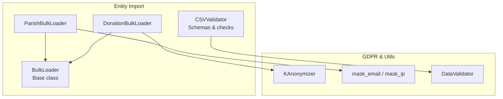
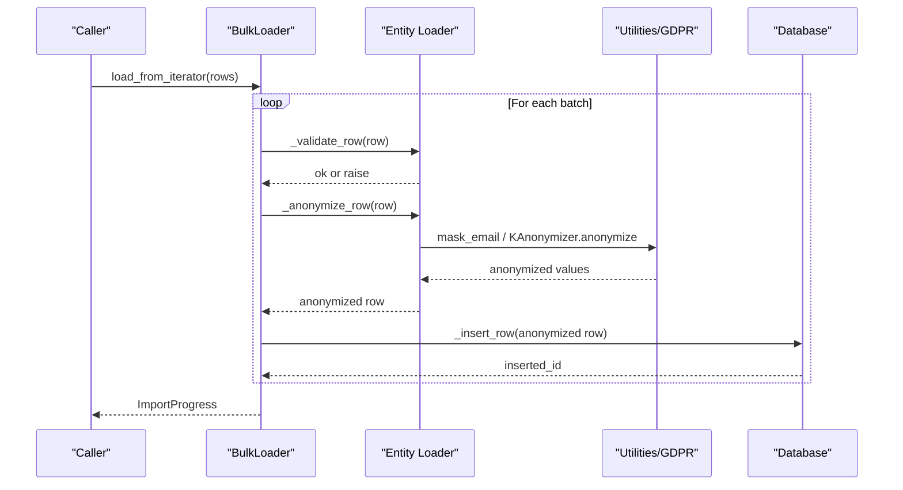
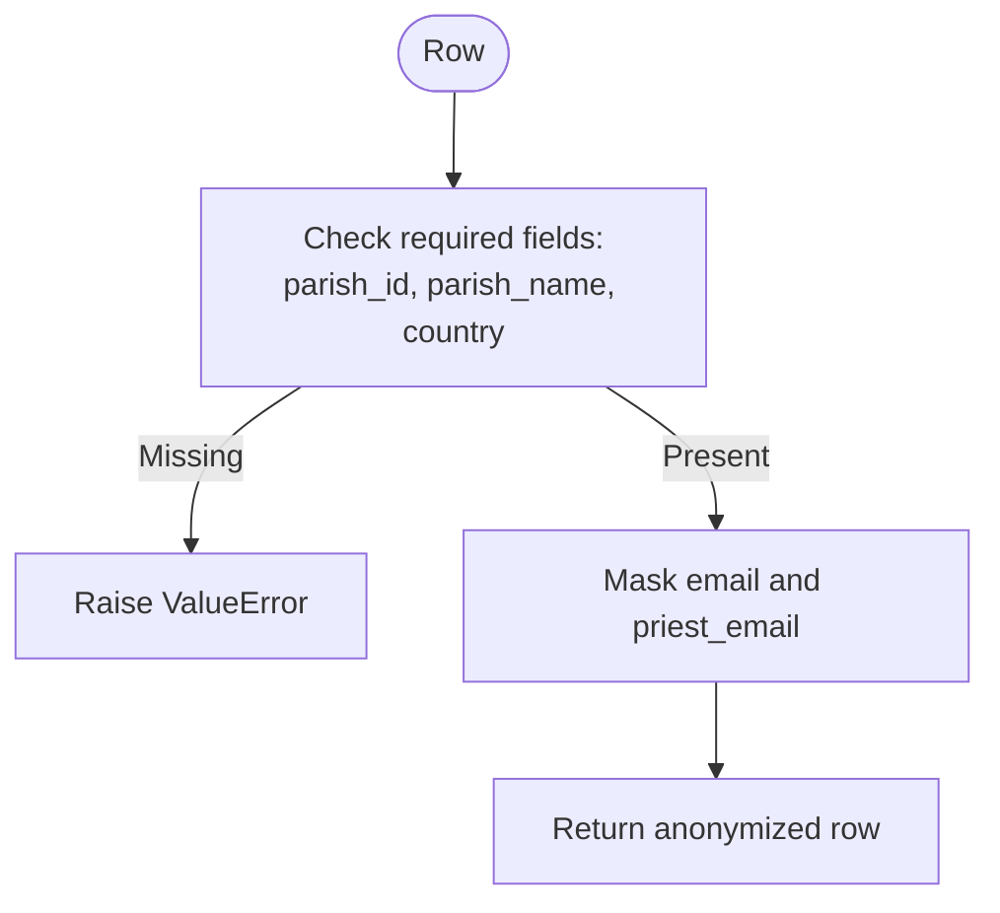
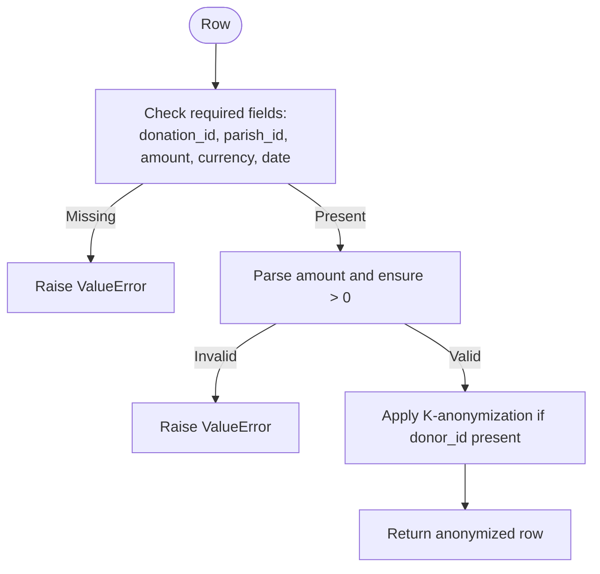
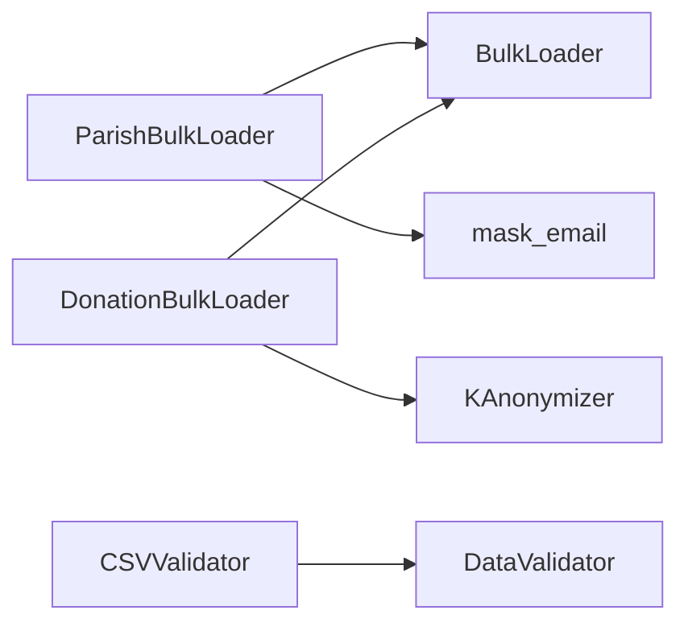

# Entity-Specific Loaders

<cite>
**Referenced Files in This Document**
- [bulk_loader.py](file://data/src/pipelines/entity_import/bulk_loader.py)
- [csv_validator.py](file://data/src/pipelines/entity_import/csv_validator.py)
- [anonymizer.py](file://data/src/gdpr/anonymizer.py)
- [utils.py](file://data/src/utils.py)
- [validators.py](file://data/src/validators.py)
</cite>

## Table of Contents
1. [Introduction](#introduction)
2. [Project Structure](#project-structure)
3. [Core Components](#core-components)
4. [Architecture Overview](#architecture-overview)
5. [Detailed Component Analysis](#detailed-component-analysis)
6. [Dependency Analysis](#dependency-analysis)
7. [Performance Considerations](#performance-considerations)
8. [Troubleshooting Guide](#troubleshooting-guide)
9. [Conclusion](#conclusion)
10. [Appendices](#appendices)

## Introduction
This document explains the entity-specific bulk loaders that extend a shared base loader to provide domain-specific validation and anonymization for parish and donation records. It covers how ParishBulkLoader enforces parish data requirements and masks emails, and how DonationBulkLoader validates amounts and currencies while applying K-anonymization to donor identifiers. It also provides guidance on creating custom entity loaders and implementing entity-specific business rules.

## Project Structure
The relevant code resides under the data pipeline module for entity import:
- Base loader and entity-specific loaders: data/src/pipelines/entity_import/bulk_loader.py
- CSV schema and pre-import validation: data/src/pipelines/entity_import/csv_validator.py
- GDPR anonymization utilities (K-anonymity): data/src/gdpr/anonymizer.py
- General masking utilities: data/src/utils.py
- Data validators with domain-specific rules: data/src/validators.py

**Diagram sources**
- [bulk_loader.py:72-319](file://data/src/pipelines/entity_import/bulk_loader.py#L72-L319)
- [csv_validator.py:120-117](file://data/src/pipelines/entity_import/csv_validator.py#L120-L117)
- [anonymizer.py:106-121](file://data/src/gdpr/anonymizer.py#L106-L121)
- [utils.py:52-80](file://data/src/utils.py#L52-L80)
- [validators.py:75-233](file://data/src/validators.py#L75-L233)

**Section sources**
- [bulk_loader.py:72-319](file://data/src/pipelines/entity_import/bulk_loader.py#L72-L319)
- [csv_validator.py:120-117](file://data/src/pipelines/entity_import/csv_validator.py#L120-L117)

## Core Components
- BulkLoader: A GDPR-compliant batch importer providing progress tracking, rollback, audit logging, and pluggable validation/anonymization hooks.
- ParishBulkLoader: Extends BulkLoader to enforce parish-specific required fields and mask sensitive email fields.
- DonationBulkLoader: Extends BulkLoader to validate donation fields (including amount and currency) and apply K-anonymization to donor identifiers.
- CSVValidator: Pre-import validator that defines schemas per entity type, checks required columns, consent, and PII handling.
- KAnonymizer: Implements k-anonymity with country-specific defaults and hashing of direct identifiers.
- Utilities: Masking helpers for emails/IPs and general ETL utilities.

Key responsibilities:
- Validation: Enforce required fields and business rules per entity.
- Anonymization: Apply privacy-preserving transformations before persistence.
- Batch processing: Process rows in configurable batches with progress reporting and rollback support.
- Audit: Log start/completion events with metadata.

**Section sources**
- [bulk_loader.py:72-256](file://data/src/pipelines/entity_import/bulk_loader.py#L72-L256)
- [bulk_loader.py:259-319](file://data/src/pipelines/entity_import/bulk_loader.py#L259-L319)
- [csv_validator.py:60-117](file://data/src/pipelines/entity_import/csv_validator.py#L60-L117)
- [anonymizer.py:106-121](file://data/src/gdpr/anonymizer.py#L106-L121)
- [utils.py:52-80](file://data/src/utils.py#L52-L80)

## Architecture Overview
The bulk import flow is orchestrated by BulkLoader, which delegates entity-specific behavior to subclasses. Before insertion, each row can be validated and anonymized. The process supports batching, error accumulation, rollback, and audit logging.

**Diagram sources**
- [bulk_loader.py:96-196](file://data/src/pipelines/entity_import/bulk_loader.py#L96-L196)
- [bulk_loader.py:265-284](file://data/src/pipelines/entity_import/bulk_loader.py#L265-L284)
- [bulk_loader.py:293-319](file://data/src/pipelines/entity_import/bulk_loader.py#L293-L319)
- [utils.py:60-68](file://data/src/utils.py#L60-L68)
- [anonymizer.py:112-121](file://data/src/gdpr/anonymizer.py#L112-L121)

## Detailed Component Analysis

### BulkLoader (Base Class)
Responsibilities:
- Manages lifecycle: start, batch processing, completion, failure, rollback.
- Tracks progress and errors; supports callbacks.
- Provides extension points:
  - _validate_row(row): override for entity-specific validation.
  - _anonymize_row(row): override for entity-specific anonymization.
  - _insert_row(row): override for actual persistence logic.
- Audits start and completion with metadata.

Configuration highlights:
- batch_size, stop_on_error, max_errors, enable_rollback, validate_before_import, anonymize_pii, audit_enabled, progress_callback.

Error handling:
- Accumulates errors up to max_errors.
- On exception, sets status to failed and optionally rolls back imported IDs.

Audit logging:
- Logs start and completion events with counts and duration.

**Section sources**
- [bulk_loader.py:33-69](file://data/src/pipelines/entity_import/bulk_loader.py#L33-L69)
- [bulk_loader.py:72-256](file://data/src/pipelines/entity_import/bulk_loader.py#L72-L256)

### ParishBulkLoader
Validation:
- Requires parish_id, parish_name, and country. Missing any raises an error.

Anonymization:
- Masks email and priest_email using a utility function that preserves domain visibility.

Integration notes:
- Inherits all batch, progress, rollback, and audit features from BulkLoader.

**Diagram sources**
- [bulk_loader.py:265-284](file://data/src/pipelines/entity_import/bulk_loader.py#L265-L284)
- [utils.py:60-68](file://data/src/utils.py#L60-L68)

**Section sources**
- [bulk_loader.py:259-284](file://data/src/pipelines/entity_import/bulk_loader.py#L259-L284)
- [utils.py:60-68](file://data/src/utils.py#L60-L68)

### DonationBulkLoader
Validation:
- Requires donation_id, parish_id, amount, currency, date.
- Validates amount is numeric and positive; otherwise raises an error.

Anonymization:
- Applies K-anonymization to donor information when donor_id is present using KAnonymizer.

Currency handling:
- While DonationBulkLoader ensures presence and positivity of amount, broader currency validation and warnings are available via DataValidator and DonationValidator.

**Diagram sources**
- [bulk_loader.py:293-319](file://data/src/pipelines/entity_import/bulk_loader.py#L293-L319)
- [anonymizer.py:112-121](file://data/src/gdpr/anonymizer.py#L112-L121)

**Section sources**
- [bulk_loader.py:287-319](file://data/src/pipelines/entity_import/bulk_loader.py#L287-L319)
- [anonymizer.py:106-121](file://data/src/gdpr/anonymizer.py#L106-L121)

### CSVValidator and Schemas
Purpose:
- Define entity schemas with column types, required columns, unique constraints, and PII classification.
- Validate CSV headers and rows prior to import.
- Provide encryption helpers for PII fields during import.

Parish schema highlights:
- Required: parish_id, parish_name, country.
- PII columns include address, priest_name, priest_email, phone, email.
- Consent fields supported.

Donation schema highlights:
- Required: donation_id, parish_id, amount, currency, date.
- PII columns include donor_id, donor_email.
- Consent fields supported.

Pre-import workflow:
- Validate headers against schema.
- Iterate rows, check required fields, consent, and PII format.
- Optionally encrypt PII fields before import.

**Section sources**
- [csv_validator.py:60-117](file://data/src/pipelines/entity_import/csv_validator.py#L60-L117)
- [csv_validator.py:135-210](file://data/src/pipelines/entity_import/csv_validator.py#L135-L210)
- [csv_validator.py:226-290](file://data/src/pipelines/entity_import/csv_validator.py#L226-L290)

### K-Anonymization Details
KAnonymizer:
- Hashes direct identifiers (name, email, donor_id, phone) to pseudonymous tokens.
- Supports checking k-anonymity across quasi-identifiers.
- Country-specific default k-values are available; environment variable can override.

Usage in DonationBulkLoader:
- When donor_id is present, the record is passed through KAnonymizer to hash identifiers.

**Section sources**
- [anonymizer.py:25-83](file://data/src/gdpr/anonymizer.py#L25-L83)
- [anonymizer.py:106-121](file://data/src/gdpr/anonymizer.py#L106-L121)

### Data Validators (Domain Rules)
DonationValidator:
- Validates required fields and amount positivity.
- Warns on unusually large donations.
- Validates currency against a known list and warns on unusual currencies.

These validators complement the bulk loader’s lightweight checks and can be integrated into pipelines for richer quality assurance.

**Section sources**
- [validators.py:201-233](file://data/src/validators.py#L201-L233)

## Dependency Analysis
- ParishBulkLoader depends on:
  - BulkLoader base functionality.
  - Email masking utility for anonymization.
- DonationBulkLoader depends on:
  - BulkLoader base functionality.
  - KAnonymizer for donor identifier anonymization.
- CSVValidator depends on:
  - DataValidator for generic validations.
  - Optional encryption utilities for PII.

**Diagram sources**
- [bulk_loader.py:259-319](file://data/src/pipelines/entity_import/bulk_loader.py#L259-L319)
- [utils.py:60-68](file://data/src/utils.py#L60-L68)
- [anonymizer.py:106-121](file://data/src/gdpr/anonymizer.py#L106-L121)
- [csv_validator.py:120-117](file://data/src/pipelines/entity_import/csv_validator.py#L120-L117)

**Section sources**
- [bulk_loader.py:259-319](file://data/src/pipelines/entity_import/bulk_loader.py#L259-L319)
- [csv_validator.py:120-117](file://data/src/pipelines/entity_import/csv_validator.py#L120-L117)

## Performance Considerations
- Batch size tuning: Adjust batch_size to balance memory usage and throughput.
- Error limits: Use max_errors to prevent runaway error logs and early termination.
- Streaming: Prefer iterators for large datasets to avoid loading entire files into memory.
- Anonymization cost: K-anonymization adds hashing overhead; consider batching and parallelization where appropriate.
- Rollback cost: Enable rollback only when necessary; it incurs additional delete operations.

[No sources needed since this section provides general guidance]

## Troubleshooting Guide
Common issues and resolutions:
- Missing required fields: Ensure parish_id, parish_name, country for parishes; donation_id, parish_id, amount, currency, date for donations.
- Invalid amount: Amount must be numeric and positive.
- Currency warnings: Non-standard currencies may trigger warnings; verify against supported lists.
- Consent missing: CSVValidator requires consent_timestamp for PII; include consent fields in source files.
- K-anonymity violations: If downstream analytics require k-anonymity thresholds, ensure sufficient grouping or adjust k-value configuration.

Operational tips:
- Inspect ImportProgress.errors for detailed row-level failures.
- Use audit logs to track import start/completion and durations.
- For large imports, monitor progress_callback updates and adjust batch_size accordingly.

**Section sources**
- [bulk_loader.py:160-196](file://data/src/pipelines/entity_import/bulk_loader.py#L160-L196)
- [csv_validator.py:226-290](file://data/src/pipelines/entity_import/csv_validator.py#L226-L290)

## Conclusion
ParishBulkLoader and DonationBulkLoader build upon a robust, GDPR-aware base loader to deliver entity-specific validation and anonymization. Parish imports enforce core identity fields and mask emails, while donation imports validate financial fields and apply K-anonymization to protect donor identities. CSVValidator provides schema-driven pre-import checks, and DataValidator offers deeper domain rules. Together, these components form a scalable, compliant foundation for bulk data ingestion.

[No sources needed since this section summarizes without analyzing specific files]

## Appendices

### Creating a Custom Entity Loader
Steps:
1. Subclass BulkLoader and set the entity_type.
2. Implement _validate_row to enforce required fields and business rules.
3. Implement _anonymize_row to apply entity-specific privacy transformations (e.g., masking emails, hashing identifiers).
4. Override _insert_row to persist records to your database.
5. Optionally integrate CSVValidator schemas for pre-import validation.

Example pattern:
- Define required fields and raise descriptive errors on missing data.
- Use utilities like mask_email or KAnonymizer for privacy.
- Leverage existing validators for additional checks (e.g., DonationValidator).

Best practices:
- Keep validation strict but informative; return clear error messages.
- Apply anonymization consistently to all PII fields.
- Use batch sizes appropriate to dataset scale.
- Enable rollback for critical imports to maintain data integrity.
- Audit every import with start/completion logs.

**Section sources**
- [bulk_loader.py:72-256](file://data/src/pipelines/entity_import/bulk_loader.py#L72-L256)
- [bulk_loader.py:259-319](file://data/src/pipelines/entity_import/bulk_loader.py#L259-L319)
- [csv_validator.py:60-117](file://data/src/pipelines/entity_import/csv_validator.py#L60-L117)
- [validators.py:201-233](file://data/src/validators.py#L201-L233)