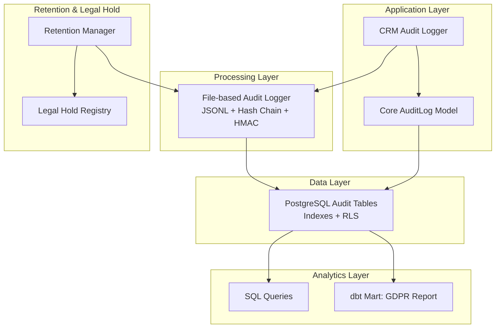
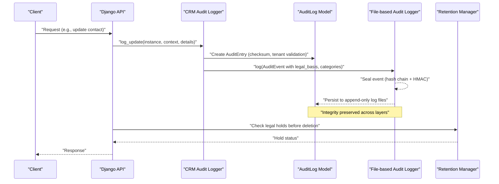
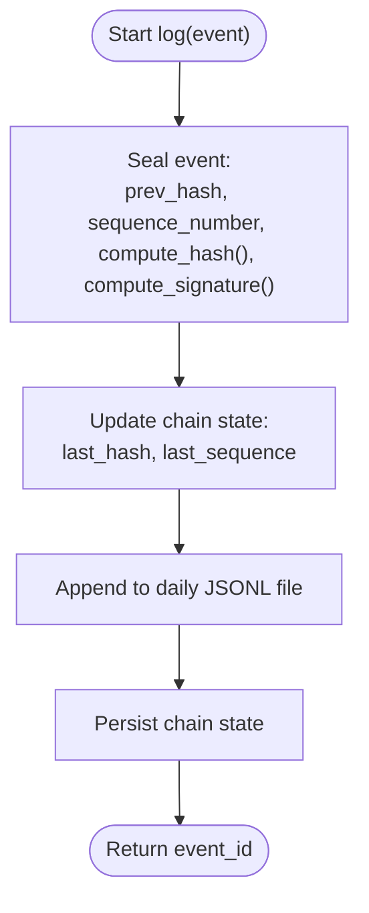
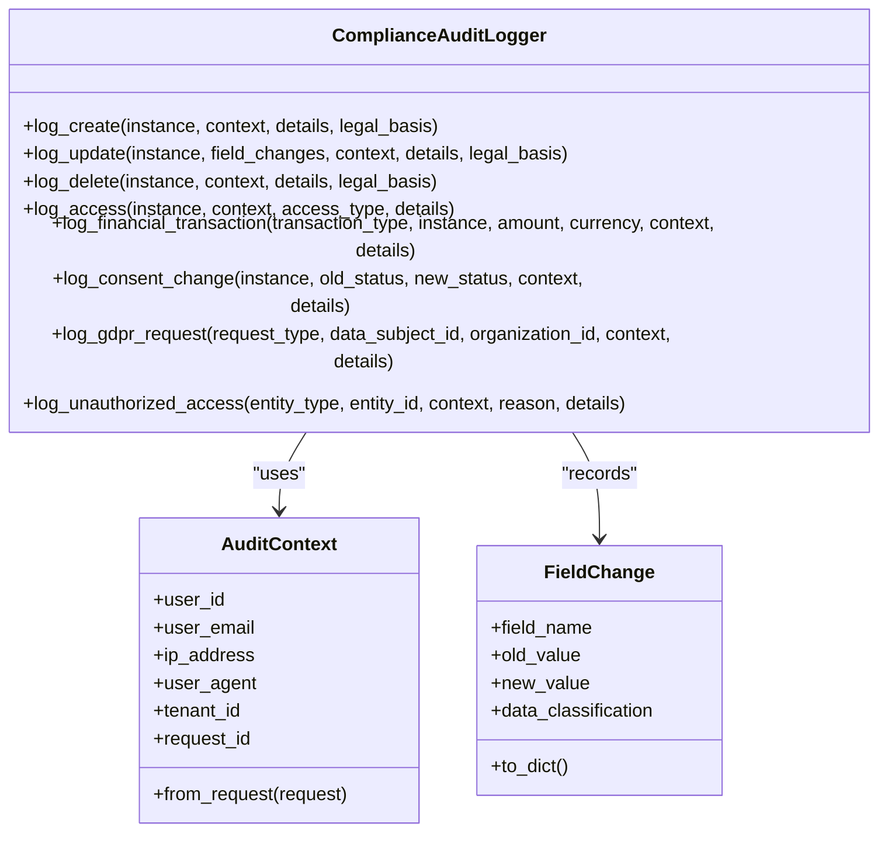
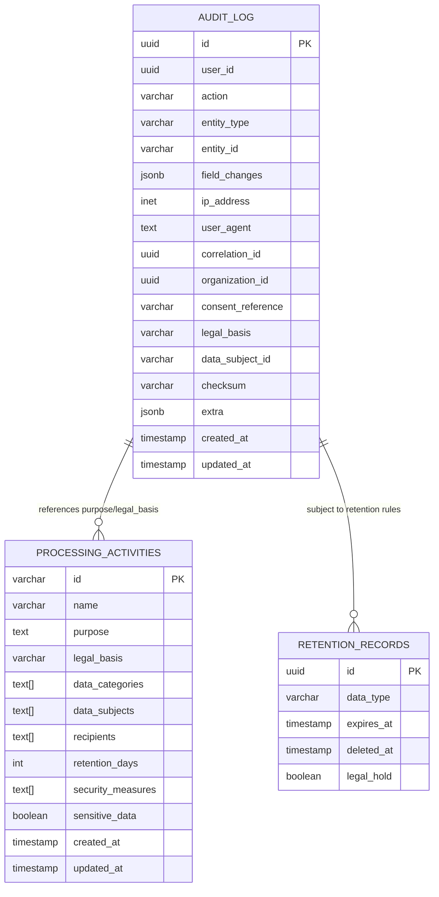
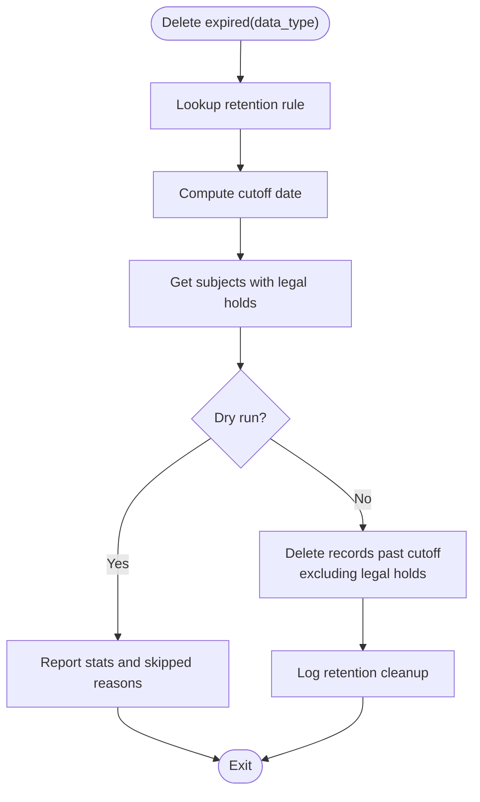
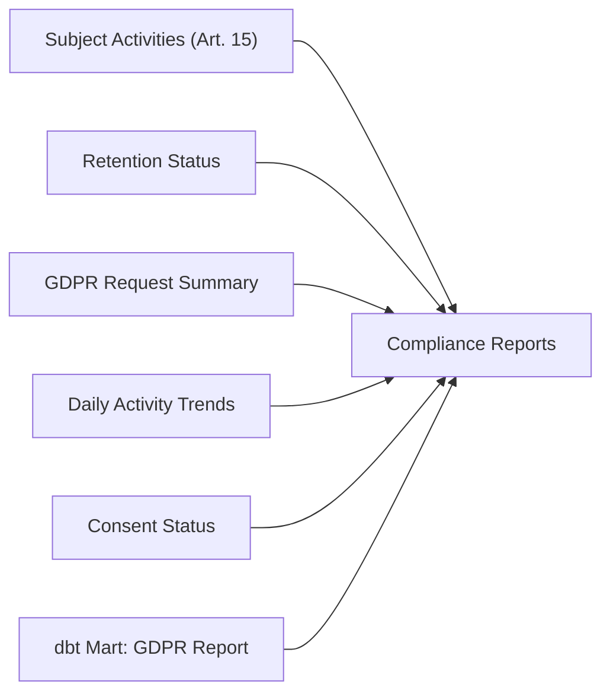
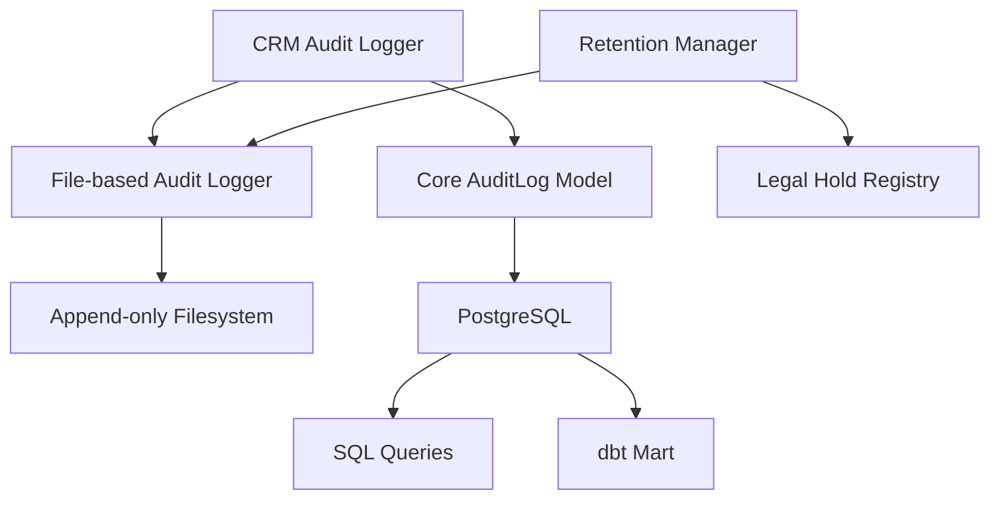

# Compliance Audit Logging

<cite>
**Referenced Files in This Document**
- [audit.py](file://data/src/audit.py)
- [audit_logger.py](file://backend/django/apps/crm/audit_logger.py)
- [models.py](file://backend/django/apps/core/models.py)
- [gdpr_compliance.sql](file://data/sql/audit_queries/gdpr_compliance.sql)
- [gdpr_compliance_report.sql](file://data/dbt/models/marts/gdpr_compliance_report.sql)
- [retention_manager.py](file://data/src/gdpr/retention_manager.py)
- [001_initial_schema.sql](file://data/sql/schema_setup/001_initial_schema.sql)
- [check_compliance.py](file://backend/django/apps/crm/management/commands/check_compliance.py)
- [security-model.md](file://docs/architecture/security-model.md)
- [GDPR-checklist.md](file://docs/compliance/GDPR-checklist.md)
</cite>

## Table of Contents
1. [Introduction](#introduction)
2. [Project Structure](#project-structure)
3. [Core Components](#core-components)
4. [Architecture Overview](#architecture-overview)
5. [Detailed Component Analysis](#detailed-component-analysis)
6. [Dependency Analysis](#dependency-analysis)
7. [Performance Considerations](#performance-considerations)
8. [Troubleshooting Guide](#troubleshooting-guide)
9. [Conclusion](#conclusion)
10. [Appendices](#appendices)

## Introduction
This document explains how the system implements GDPR-compliant audit logging to demonstrate accountability under Article 5(2). It covers:
- How all data processing activities are logged with timestamps, user attribution, and purpose specification
- SQL queries for compliance reporting, audit trail analysis, and regulatory inspection preparation
- Examples of generating compliance reports, investigating data breaches, and maintaining audit integrity
- Log retention policies, access controls, and tamper-evident logging mechanisms

The design ensures that every meaningful action is recorded with sufficient detail to support audits, inspections, and incident investigations while enforcing legal basis tracking, consent management, and retention rules.

## Project Structure
Audit logging spans multiple layers:
- Data layer: immutable log model and schema with indexes and row-level security
- Application layer: Django-based CRM audit logger capturing context, field changes, and legal basis
- Processing layer: file-based append-only JSONL logs with hash chains and HMAC signatures
- Analytics layer: dbt models and SQL queries for compliance reporting and retention status
- Retention and legal hold: automated cleanup with legal hold checks and approval gates

**Diagram sources**
- [audit_logger.py:154-274](file://backend/django/apps/crm/audit_logger.py#L154-L274)
- [models.py:67-200](file://backend/django/apps/core/models.py#L67-L200)
- [audit.py:205-369](file://data/src/audit.py#L205-L369)
- [gdpr_compliance_report.sql:10-67](file://data/dbt/models/marts/gdpr_compliance_report.sql#L10-L67)
- [retention_manager.py:188-265](file://data/src/gdpr/retention_manager.py#L188-L265)

**Section sources**
- [audit_logger.py:154-274](file://backend/django/apps/crm/audit_logger.py#L154-L274)
- [models.py:67-200](file://backend/django/apps/core/models.py#L67-L200)
- [audit.py:205-369](file://data/src/audit.py#L205-L369)
- [gdpr_compliance_report.sql:10-67](file://data/dbt/models/marts/gdpr_compliance_report.sql#L10-L67)
- [retention_manager.py:188-265](file://data/src/gdpr/retention_manager.py#L188-L265)

## Core Components
- File-based tamper-evident audit logger:
  - Append-only JSONL files per day
  - Hash chain linking each event to the previous
  - HMAC signature using a secret key for tamper detection
  - Sequence numbers for ordering verification
  - Querying and verification utilities for compliance and forensics
- Django CRM audit logger:
  - Captures request context (user, IP, user agent, tenant)
  - Records field-level changes and data classification
  - Tracks GDPR legal basis automatically based on fields and consent
  - Logs financial transactions and consent changes
  - Integrates with external systems via structured logging
- Core audit log model:
  - Immutable audit trail with checksums
  - Tenant isolation enforcement at save time
  - Indexed fields for efficient querying by entity, user, organization, and subject
- Retention manager and legal holds:
  - Configurable retention rules per data type
  - Legal hold registry preventing deletion when active
  - Automated cleanup with dry-run and audit logging

**Section sources**
- [audit.py:29-203](file://data/src/audit.py#L29-L203)
- [audit.py:205-369](file://data/src/audit.py#L205-L369)
- [audit_logger.py:97-181](file://backend/django/apps/crm/audit_logger.py#L97-L181)
- [audit_logger.py:218-447](file://backend/django/apps/crm/audit_logger.py#L218-L447)
- [models.py:67-200](file://backend/django/apps/core/models.py#L67-L200)
- [retention_manager.py:78-106](file://data/src/gdpr/retention_manager.py#L78-L106)
- [retention_manager.py:109-185](file://data/src/gdpr/retention_manager.py#L109-L185)
- [retention_manager.py:188-265](file://data/src/gdpr/retention_manager.py#L188-L265)

## Architecture Overview
The system uses a layered approach to ensure comprehensive, tamper-evident audit logging:
- Application layer captures rich context and enforces legal basis and classification
- Processing layer persists events immutably with cryptographic integrity
- Data layer stores normalized records with strong indexing and row-level security
- Analytics layer provides standardized reporting and retention metrics
- Retention and legal hold subsystem enforce storage limitation and prevent unlawful erasure

**Diagram sources**
- [audit_logger.py:276-347](file://backend/django/apps/crm/audit_logger.py#L276-L347)
- [models.py:156-200](file://backend/django/apps/core/models.py#L156-L200)
- [audit.py:330-369](file://data/src/audit.py#L330-L369)
- [retention_manager.py:206-246](file://data/src/gdpr/retention_manager.py#L206-L246)

## Detailed Component Analysis

### Tamper-Evident File-Based Audit Logger
- Event structure includes action, resource type, timestamp, actor, metadata, legal basis, data categories, retention period, sequence number, previous hash, event hash, and signature
- Each event is sealed with a hash chain and HMAC signature; any modification breaks the chain or invalidates the signature
- Daily rotation keeps logs manageable; query methods filter by date range, action, resource type, and actor
- Verification routines check chain continuity, sequence monotonicity, event hash consistency, and HMAC validity

**Diagram sources**
- [audit.py:330-369](file://data/src/audit.py#L330-L369)
- [audit.py:134-203](file://data/src/audit.py#L134-L203)

**Section sources**
- [audit.py:29-203](file://data/src/audit.py#L29-L203)
- [audit.py:205-369](file://data/src/audit.py#L205-L369)
- [audit.py:409-589](file://data/src/audit.py#L409-L589)

### Django CRM Audit Logger
- Captures request context (user ID, email, IP, user agent, tenant, request ID)
- Records field-level changes with data classification and flags for PII and special category data
- Determines GDPR legal basis automatically based on instance attributes and field changes
- Logs creation, updates, deletions, access, financial transactions, consent changes, and unauthorized access attempts
- Integrates with external systems via structured logging for SIEM ingestion

**Diagram sources**
- [audit_logger.py:97-181](file://backend/django/apps/crm/audit_logger.py#L97-L181)
- [audit_logger.py:218-447](file://backend/django/apps/crm/audit_logger.py#L218-L447)

**Section sources**
- [audit_logger.py:97-181](file://backend/django/apps/crm/audit_logger.py#L97-L181)
- [audit_logger.py:218-447](file://backend/django/apps/crm/audit_logger.py#L218-L447)
- [audit_logger.py:449-629](file://backend/django/apps/crm/audit_logger.py#L449-L629)

### Core Audit Log Model and Schema
- Immutable audit trail with checksum generation at save time
- Tenant isolation enforced during save to prevent cross-tenant writes
- Indexes optimize queries by entity, user, organization, and data subject
- Row-level security enabled for multi-tenant access control
- Additional tables include processing activities registry and retention records with indexes for compliance queries

**Diagram sources**
- [models.py:67-200](file://backend/django/apps/core/models.py#L67-L200)
- [001_initial_schema.sql:45-74](file://data/sql/schema_setup/001_initial_schema.sql#L45-L74)

**Section sources**
- [models.py:67-200](file://backend/django/apps/core/models.py#L67-L200)
- [001_initial_schema.sql:45-74](file://data/sql/schema_setup/001_initial_schema.sql#L45-L74)

### Retention Management and Legal Holds
- Retention rules define data types, retention periods, legal basis, and approval requirements
- Legal hold registry prevents deletion when active holds exist (litigation, investigation, audit, subpoena, law enforcement)
- Deletion operations check legal holds first and log actions for auditability
- Dry-run mode supports planning and verification without affecting data

**Diagram sources**
- [retention_manager.py:78-106](file://data/src/gdpr/retention_manager.py#L78-L106)
- [retention_manager.py:109-185](file://data/src/gdpr/retention_manager.py#L109-L185)
- [retention_manager.py:206-265](file://data/src/gdpr/retention_manager.py#L206-L265)

**Section sources**
- [retention_manager.py:78-106](file://data/src/gdpr/retention_manager.py#L78-L106)
- [retention_manager.py:109-185](file://data/src/gdpr/retention_manager.py#L109-L185)
- [retention_manager.py:188-265](file://data/src/gdpr/retention_manager.py#L188-L265)

### Compliance Reporting and SQL Queries
- SQL queries provide:
  - All processing activities for a data subject (Article 15)
  - Retention compliance status (overdue, deleted, on hold)
  - GDPR request status summary with average completion times
  - Audit log activity by day for trend analysis
  - Consent status aggregation for subjects with invalid or expired consents
- dbt mart aggregates processing activities and calculates approaching retention expiry alerts

**Diagram sources**
- [gdpr_compliance.sql:4-66](file://data/sql/audit_queries/gdpr_compliance.sql#L4-L66)
- [gdpr_compliance_report.sql:10-67](file://data/dbt/models/marts/gdpr_compliance_report.sql#L10-L67)

**Section sources**
- [gdpr_compliance.sql:4-66](file://data/sql/audit_queries/gdpr_compliance.sql#L4-L66)
- [gdpr_compliance_report.sql:10-67](file://data/dbt/models/marts/gdpr_compliance_report.sql#L10-L67)

## Dependency Analysis
- The Django CRM audit logger depends on:
  - Django models for persistence and tenant validation
  - Structured logging for external SIEM integration
  - Optional external systems for additional observability
- The file-based audit logger depends on:
  - Environment configuration for log directory and secret key
  - Append-only filesystem semantics for integrity
- Retention manager depends on:
  - Audit logger for recording cleanup actions
  - Legal hold registry to block deletions
- Analytics depend on:
  - Database indexes for performance
  - dbt transformations for consistent reporting

**Diagram sources**
- [audit_logger.py:218-447](file://backend/django/apps/crm/audit_logger.py#L218-L447)
- [models.py:67-200](file://backend/django/apps/core/models.py#L67-L200)
- [audit.py:205-369](file://data/src/audit.py#L205-L369)
- [retention_manager.py:188-265](file://data/src/gdpr/retention_manager.py#L188-L265)

**Section sources**
- [audit_logger.py:218-447](file://backend/django/apps/crm/audit_logger.py#L218-L447)
- [models.py:67-200](file://backend/django/apps/core/models.py#L67-L200)
- [audit.py:205-369](file://data/src/audit.py#L205-L369)
- [retention_manager.py:188-265](file://data/src/gdpr/retention_manager.py#L188-L265)

## Performance Considerations
- Use database indexes on frequently queried fields (entity_type, entity_id, user_id, organization_id, data_subject_id) to speed up compliance queries
- Partition audit logs by month or quarter to improve retention cleanup and query performance
- Keep append-only log files small via daily rotation; archive older files to cold storage
- Avoid logging sensitive fields; mask or redact where necessary
- Batch analytics jobs during off-peak hours to minimize impact on production

[No sources needed since this section provides general guidance]

## Troubleshooting Guide
Common issues and resolutions:
- Audit log integrity compromised:
  - Run chain verification to detect broken links, sequence gaps, hash mismatches, or invalid signatures
  - Investigate environment changes or unauthorized access to log directories
  - Restore from verified backups if chain is broken
- Missing or inconsistent legal basis:
  - Ensure CRM audit logger determines legal basis based on instance attributes and field changes
  - Validate consent status and special category data handling
- Retention cleanup failures:
  - Check legal holds before deletion; use dry-run to plan
  - Verify retention rules and cutoff dates
- Cross-tenant audit log attempts:
  - Review tenant validation logic and middleware context
  - Ensure organization_id matches current tenant context

**Section sources**
- [audit.py:513-589](file://data/src/audit.py#L513-L589)
- [models.py:156-200](file://backend/django/apps/core/models.py#L156-L200)
- [retention_manager.py:206-265](file://data/src/gdpr/retention_manager.py#L206-L265)
- [check_compliance.py:125-158](file://backend/django/apps/crm/management/commands/check_compliance.py#L125-L158)

## Conclusion
The system implements robust, GDPR-compliant audit logging through:
- Comprehensive capture of processing activities with timestamps, user attribution, and purpose specification
- Tamper-evident mechanisms including hash chains and HMAC signatures
- Strong retention policies with legal hold protections
- Standardized SQL and dbt reporting for compliance and regulatory inspection
- Access controls and tenant isolation to maintain data boundaries

These components collectively support accountability under Article 5(2), facilitate breach investigations, and enable reliable compliance reporting.

[No sources needed since this section summarizes without analyzing specific files]

## Appendices

### Example Workflows

#### Generating a Compliance Report
- Use dbt mart to aggregate processing activities and calculate retention proximity alerts
- Combine with SQL queries for subject activities, retention status, and GDPR request summaries
- Schedule regular report generation and distribute to compliance officers

**Section sources**
- [gdpr_compliance_report.sql:10-67](file://data/dbt/models/marts/gdpr_compliance_report.sql#L10-L67)
- [gdpr_compliance.sql:4-66](file://data/sql/audit_queries/gdpr_compliance.sql#L4-L66)

#### Investigating a Data Breach
- Retrieve all audit entries for affected entities and users within the incident timeframe
- Verify chain integrity to ensure evidence has not been tampered with
- Correlate access logs, financial transactions, and consent changes
- Preserve snapshots and network captures per incident response procedures

**Section sources**
- [security-model.md:350-400](file://docs/architecture/security-model.md#L350-L400)
- [audit.py:409-589](file://data/src/audit.py#L409-L589)

#### Maintaining Audit Integrity
- Regularly verify chain integrity and HMAC signatures
- Monitor sequence numbers for gaps or reorderings
- Protect secret keys and restrict access to log directories
- Enforce append-only storage and immutable backups

**Section sources**
- [audit.py:134-203](file://data/src/audit.py#L134-L203)
- [audit.py:513-589](file://data/src/audit.py#L513-L589)