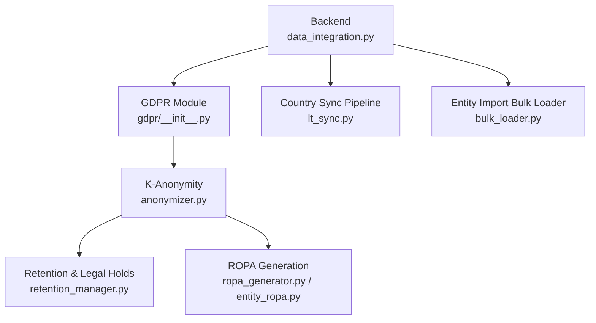
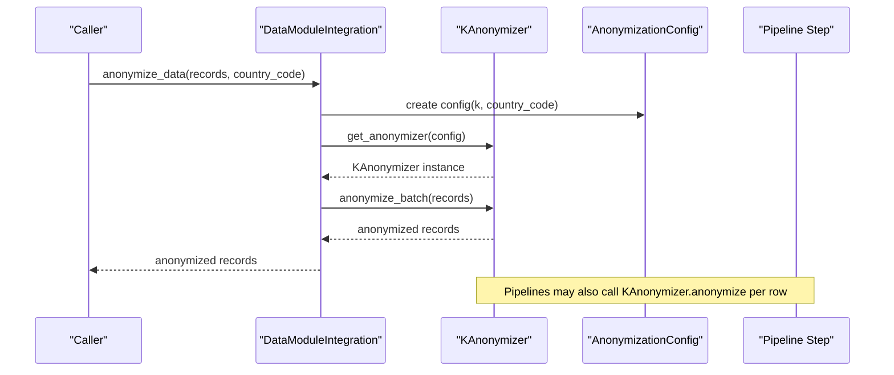
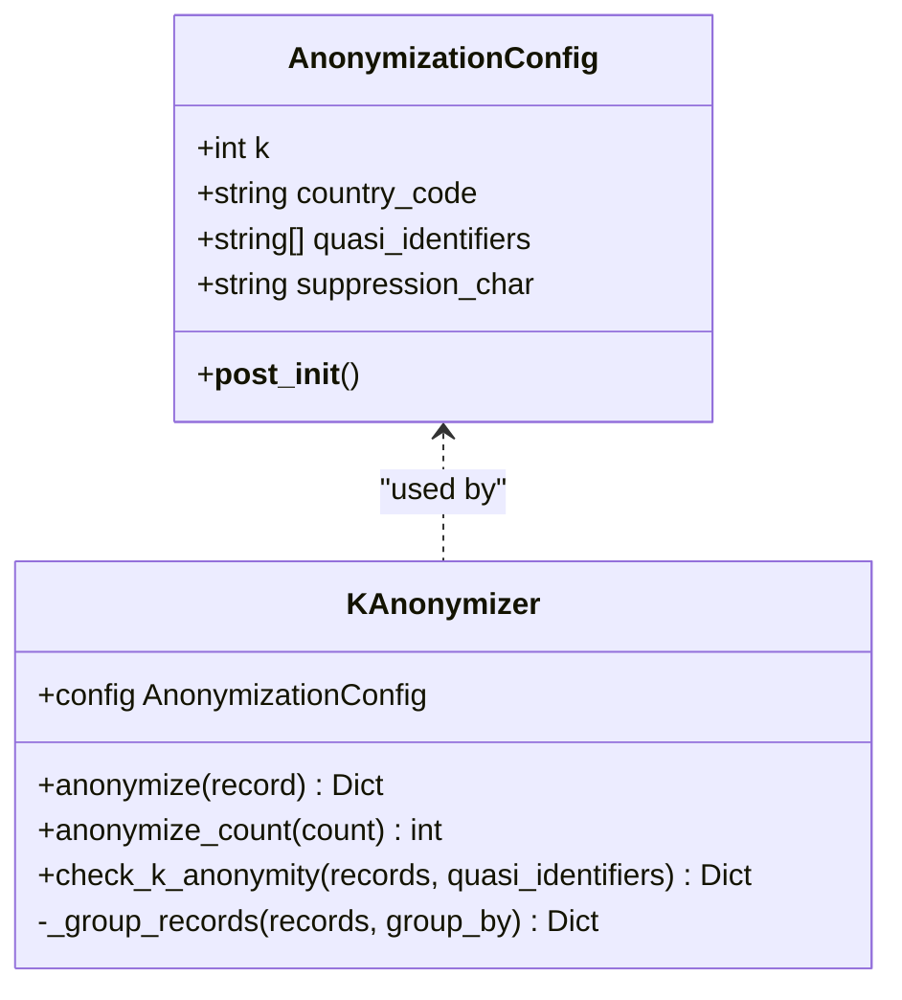
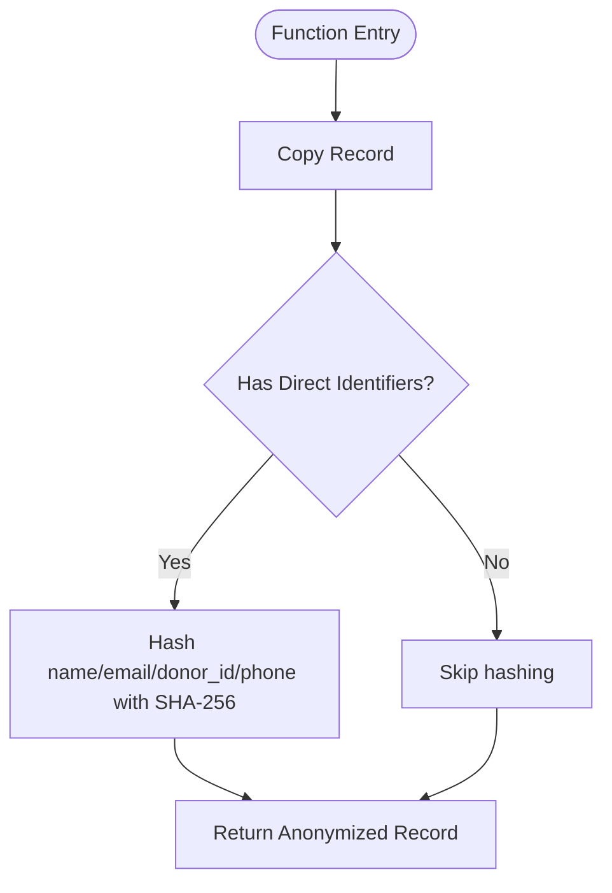
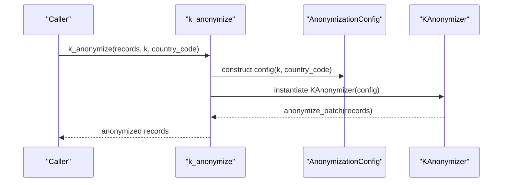
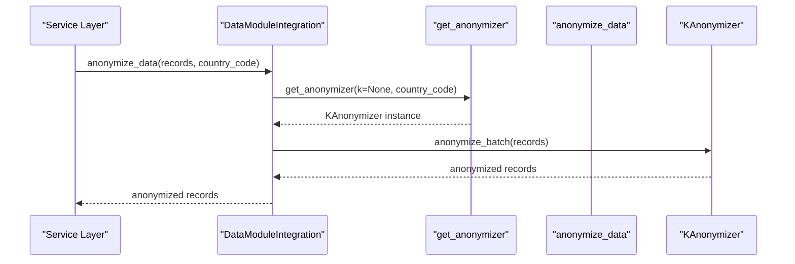
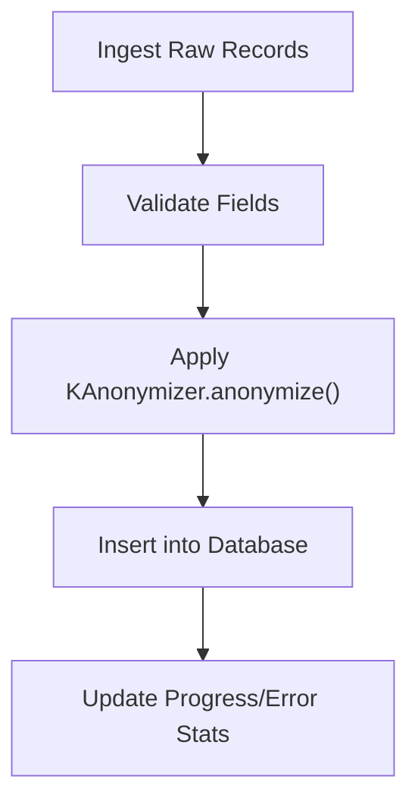
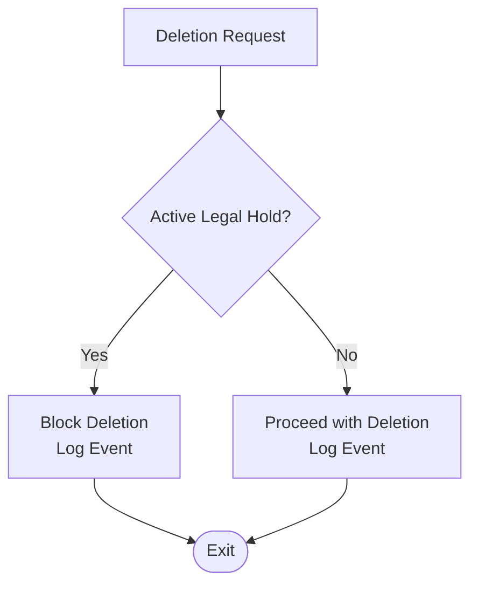
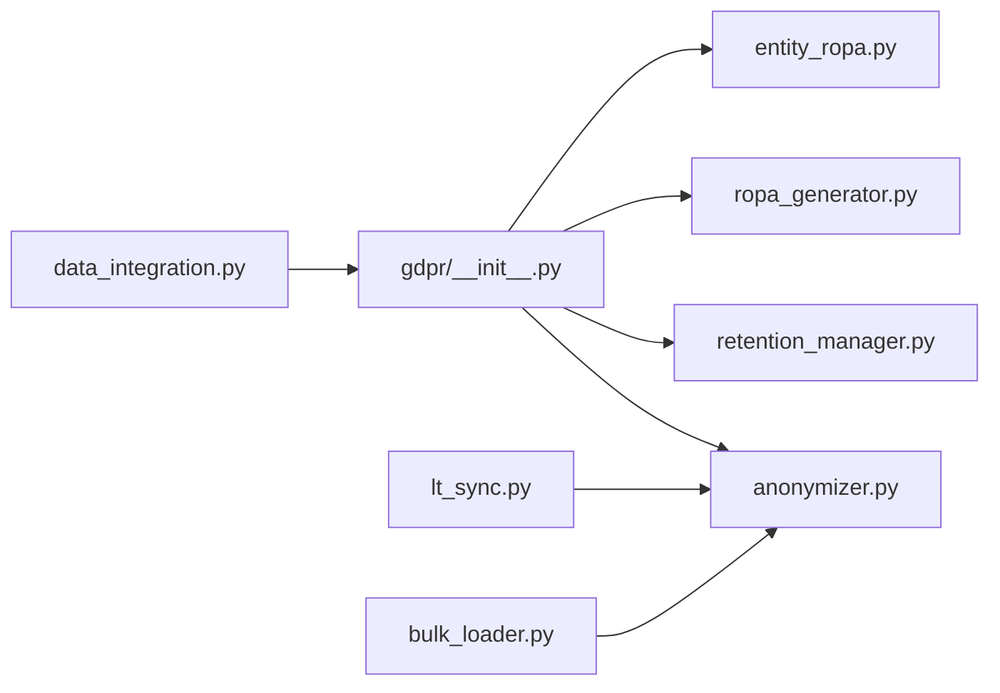

# Data Anonymization

<cite>
**Referenced Files in This Document**
- [anonymizer.py](file://data/src/gdpr/anonymizer.py)
- [__init__.py](file://data/src/gdpr/__init__.py)
- [retention_manager.py](file://data/src/gdpr/retention_manager.py)
- [ropa_generator.py](file://data/src/gdpr/ropa_generator.py)
- [entity_ropa.py](file://data/src/gdpr/entity_ropa.py)
- [data_integration.py](file://backend/django/apps/core/data_integration.py)
- [lt_sync.py](file://data/src/pipelines/country_sync/lt_sync.py)
- [bulk_loader.py](file://data/src/pipelines/entity_import/bulk_loader.py)
- [test_gdpr.py](file://data/tests/test_gdpr.py)
</cite>

## Table of Contents
1. [Introduction](#introduction)
2. [Project Structure](#project-structure)
3. [Core Components](#core-components)
4. [Architecture Overview](#architecture-overview)
5. [Detailed Component Analysis](#detailed-component-analysis)
6. [Dependency Analysis](#dependency-analysis)
7. [Performance Considerations](#performance-considerations)
8. [Troubleshooting Guide](#troubleshooting-guide)
9. [Conclusion](#conclusion)
10. [Appendices](#appendices)

## Introduction
This document describes the data anonymization system that implements k-anonymity to support GDPR compliance across multiple EU jurisdictions. It explains country-specific thresholds, configuration options, hashing of direct identifiers, quasi-identifier grouping, and validation of k-anonymity. It also documents the AnonymizationConfig class, KAnonymizer methods, and convenience functions used for batch processing and integration points within the backend and pipelines.

## Project Structure
The anonymization logic is implemented under the GDPR utilities module and integrated into both backend services and data pipelines:
- Core implementation: data/src/gdpr/anonymizer.py
- Module exports: data/src/gdpr/__init__.py
- Retention and legal hold: data/src/gdpr/retention_manager.py
- ROPA generation: data/src/gdpr/ropa_generator.py and entity_ropa.py
- Backend integration: backend/django/apps/core/data_integration.py
- Pipeline usage: data/src/pipelines/country_sync/lt_sync.py and data/src/pipelines/entity_import/bulk_loader.py
- Tests: data/tests/test_gdpr.py

**Diagram sources**
- [data_integration.py:75-129](file://backend/django/apps/core/data_integration.py#L75-L129)
- [__init__.py:1-19](file://data/src/gdpr/__init__.py#L1-L19)
- [anonymizer.py:25-179](file://data/src/gdpr/anonymizer.py#L25-L179)
- [retention_manager.py:188-336](file://data/src/gdpr/retention_manager.py#L188-L336)
- [ropa_generator.py:19-182](file://data/src/gdpr/ropa_generator.py#L19-L182)
- [entity_ropa.py:39-800](file://data/src/gdpr/entity_ropa.py#L39-L800)
- [lt_sync.py:171-175](file://data/src/pipelines/country_sync/lt_sync.py#L171-L175)
- [bulk_loader.py:308-319](file://data/src/pipelines/entity_import/bulk_loader.py#L308-L319)

**Section sources**
- [anonymizer.py:25-179](file://data/src/gdpr/anonymizer.py#L25-L179)
- [data_integration.py:75-129](file://backend/django/apps/core/data_integration.py#L75-L129)
- [lt_sync.py:171-175](file://data/src/pipelines/country_sync/lt_sync.py#L171-L175)
- [bulk_loader.py:308-319](file://data/src/pipelines/entity_import/bulk_loader.py#L308-L319)

## Core Components
- Country-specific k-thresholds: The system defines per-country k values with higher thresholds for stricter jurisdictions (e.g., Germany k=10), medium thresholds for others, and a default EU threshold (k=5). An environment variable can override defaults.
- AnonymizationConfig: Encapsulates k value, country code, quasi-identifiers, and suppression character; resolves k from environment or country defaults.
- KAnonymizer: Provides record-level anonymization by hashing direct identifiers, count rounding to nearest k, and dataset-level k-anonymity checks via quasi-identifier grouping.
- Convenience function: k_anonymize builds configuration based on country and invokes batch anonymization.
- Integration points: Backend exposes helpers to obtain an anonymizer and anonymize records; pipelines apply anonymization during sync and bulk import.

**Section sources**
- [anonymizer.py:25-83](file://data/src/gdpr/anonymizer.py#L25-L83)
- [anonymizer.py:86-179](file://data/src/gdpr/anonymizer.py#L86-L179)
- [data_integration.py:75-129](file://backend/django/apps/core/data_integration.py#L75-L129)
- [lt_sync.py:171-175](file://data/src/pipelines/country_sync/lt_sync.py#L171-L175)
- [bulk_loader.py:308-319](file://data/src/pipelines/entity_import/bulk_loader.py#L308-L319)

## Architecture Overview
The anonymization architecture integrates directly into data flows:
- Backend services request anonymization through a unified integration layer that constructs KAnonymizer instances with country-aware configuration.
- Pipelines use KAnonymizer at ingestion points to ensure PII is hashed before persistence.
- Retention management enforces deletion policies and legal holds, ensuring erasure requests are blocked when required.
- ROPA generation documents processing activities, including those using anonymization techniques.

**Diagram sources**
- [data_integration.py:75-129](file://backend/django/apps/core/data_integration.py#L75-L129)
- [anonymizer.py:86-179](file://data/src/gdpr/anonymizer.py#L86-L179)
- [lt_sync.py:171-175](file://data/src/pipelines/country_sync/lt_sync.py#L171-L175)
- [bulk_loader.py:308-319](file://data/src/pipelines/entity_import/bulk_loader.py#L308-L319)

## Detailed Component Analysis

### AnonymizationConfig
- Purpose: Centralizes configuration for k-anonymity with country-specific defaults and environment overrides.
- Key fields:
  - k: minimum group size; resolved from environment or country mapping if not set.
  - country_code: ISO 3166-1 alpha-2 code used to select jurisdiction-specific k.
  - quasi_identifiers: list of fields used for grouping to evaluate k-anonymity.
  - suppression_char: character used for suppression (not applied in current hashing-only flow).
- Behavior: On initialization, if k is None, it resolves via environment variable or country mapping.

**Diagram sources**
- [anonymizer.py:86-179](file://data/src/gdpr/anonymizer.py#L86-L179)

**Section sources**
- [anonymizer.py:86-104](file://data/src/gdpr/anonymizer.py#L86-L104)

### KAnonymizer
- Direct identifier hashing: Hashes specific fields (name, email, donor_id, phone) using SHA-256 and truncates to a fixed length.
- Count rounding: Rounds numeric counts down to the nearest multiple of k to avoid small-group disclosure.
- Quasi-identifier grouping: Groups records by provided fields and evaluates whether each group meets the k threshold.
- Validation output: Returns metrics including total groups, groups below k, and whether the dataset satisfies k-anonymity.

**Diagram sources**
- [anonymizer.py:112-121](file://data/src/gdpr/anonymizer.py#L112-L121)

**Section sources**
- [anonymizer.py:106-157](file://data/src/gdpr/anonymizer.py#L106-L157)

### Convenience Function: k_anonymize
- Builds AnonymizationConfig from parameters (k and country_code).
- Instantiates KAnonymizer and calls batch anonymization to return anonymized records.

**Diagram sources**
- [anonymizer.py:160-179](file://data/src/gdpr/anonymizer.py#L160-L179)

**Section sources**
- [anonymizer.py:160-179](file://data/src/gdpr/anonymizer.py#L160-L179)

### Backend Integration: DataModuleIntegration
- Provides get_anonymizer to construct KAnonymizer with country-specific defaults.
- Exposes anonymize_data as a convenience method to anonymize records for analytics and dashboards.
- Gracefully handles missing dependencies by returning original records when anonymizer is unavailable.

**Diagram sources**
- [data_integration.py:75-129](file://backend/django/apps/core/data_integration.py#L75-L129)
- [anonymizer.py:106-179](file://data/src/gdpr/anonymizer.py#L106-L179)

**Section sources**
- [data_integration.py:75-129](file://backend/django/apps/core/data_integration.py#L75-L129)

### Pipeline Usage Examples
- Country sync pipeline applies k-anonymity to donation data during synchronization.
- Entity import bulk loader anonymizes donor information prior to database insertion.

**Diagram sources**
- [lt_sync.py:171-175](file://data/src/pipelines/country_sync/lt_sync.py#L171-L175)
- [bulk_loader.py:308-319](file://data/src/pipelines/entity_import/bulk_loader.py#L308-L319)

**Section sources**
- [lt_sync.py:171-175](file://data/src/pipelines/country_sync/lt_sync.py#L171-L175)
- [bulk_loader.py:308-319](file://data/src/pipelines/entity_import/bulk_loader.py#L308-L319)

### Retention Manager and Legal Holds
- Enforces storage limitation and right to erasure with explicit checks for active legal holds before deletion.
- Provides retention rules for different data types and supports dry-run modes for safe planning.
- Logs GDPR-related events for auditability.

**Diagram sources**
- [retention_manager.py:257-336](file://data/src/gdpr/retention_manager.py#L257-L336)

**Section sources**
- [retention_manager.py:188-336](file://data/src/gdpr/retention_manager.py#L188-L336)

### ROPA Generation
- Generates Records of Processing Activities aligned with GDPR Article 30.
- Includes standard and entity-specific activities, capturing purposes, legal bases, retention periods, and security measures.
- Supports JSON and Markdown outputs and provides summaries.

**Section sources**
- [ropa_generator.py:19-182](file://data/src/gdpr/ropa_generator.py#L19-L182)
- [entity_ropa.py:39-800](file://data/src/gdpr/entity_ropa.py#L39-L800)

## Dependency Analysis
- The GDPR module exports core classes and generators for reuse across the application.
- Backend integration depends on the GDPR module to provide anonymization capabilities.
- Pipelines depend on KAnonymizer for row-level anonymization during ingestion.
- Retention manager depends on audit logging and legal hold registry to enforce deletion constraints.

**Diagram sources**
- [__init__.py:1-19](file://data/src/gdpr/__init__.py#L1-L19)
- [data_integration.py:75-129](file://backend/django/apps/core/data_integration.py#L75-L129)
- [lt_sync.py:171-175](file://data/src/pipelines/country_sync/lt_sync.py#L171-L175)
- [bulk_loader.py:308-319](file://data/src/pipelines/entity_import/bulk_loader.py#L308-L319)

**Section sources**
- [__init__.py:1-19](file://data/src/gdpr/__init__.py#L1-L19)
- [data_integration.py:75-129](file://backend/django/apps/core/data_integration.py#L75-L129)
- [lt_sync.py:171-175](file://data/src/pipelines/country_sync/lt_sync.py#L171-L175)
- [bulk_loader.py:308-319](file://data/src/pipelines/entity_import/bulk_loader.py#L308-L319)

## Performance Considerations
- Hashing direct identifiers uses SHA-256 and truncation; this is lightweight but should be applied only to necessary fields to minimize overhead.
- Grouping records by quasi-identifiers scales with dataset size; consider batching and indexing strategies for large datasets.
- Count rounding is O(1) and negligible cost.
- Environment-based k resolution avoids repeated lookups; cache country-to-k mappings where appropriate.

[No sources needed since this section provides general guidance]

## Troubleshooting Guide
- Missing anonymizer dependency: If the GDPR module is unavailable, backend integration returns original records and logs a warning. Ensure the gdpr package is installed and importable.
- Invalid environment variable: If GDPR_K_ANONYMITY_VALUE is malformed, a warning is logged and fallback country/default k is used.
- K-anonymity violations: Use check_k_anonymity to detect groups below k; adjust quasi-identifiers or increase k to satisfy requirements.
- Legal holds blocking deletion: RetentionManager will block deletions when active legal holds exist; review hold details and lift holds when appropriate.

**Section sources**
- [data_integration.py:106-129](file://backend/django/apps/core/data_integration.py#L106-L129)
- [anonymizer.py:73-83](file://data/src/gdpr/anonymizer.py#L73-L83)
- [anonymizer.py:127-143](file://data/src/gdpr/anonymizer.py#L127-L143)
- [retention_manager.py:257-336](file://data/src/gdpr/retention_manager.py#L257-L336)

## Conclusion
The anonymization system provides robust k-anonymity with country-specific thresholds, secure hashing of direct identifiers, and validation mechanisms to ensure compliance with GDPR principles. Integrated into backend services and data pipelines, it supports consistent anonymization practices while respecting retention policies and legal holds. For best results, configure country codes appropriately, validate quasi-identifier sets, and monitor k-anonymity checks during data processing.

[No sources needed since this section summarizes without analyzing specific files]

## Appendices

### Practical Configuration Examples
- Default EU: Use no country code to apply k=5.
- Germany: Set country_code='de' to apply k=10.
- France: Set country_code='fr' to apply k=10 (or adjust via environment variable for higher thresholds).
- Override via environment: Set GDPR_K_ANONYMITY_VALUE to force a specific k across all configurations.

**Section sources**
- [anonymizer.py:25-83](file://data/src/gdpr/anonymizer.py#L25-L83)

### Edge Cases and Validation
- Empty or missing fields: Hashing skips empty fields; ensure required identifiers are present for effective pseudonymization.
- Small groups: Use check_k_anonymity to identify and remediate groups below k by adjusting quasi-identifiers or increasing k.
- Batch processing: When using convenience functions, ensure records are structured consistently to avoid grouping errors.

**Section sources**
- [anonymizer.py:112-143](file://data/src/gdpr/anonymizer.py#L112-L143)
- [test_gdpr.py:15-54](file://data/tests/test_gdpr.py#L15-L54)