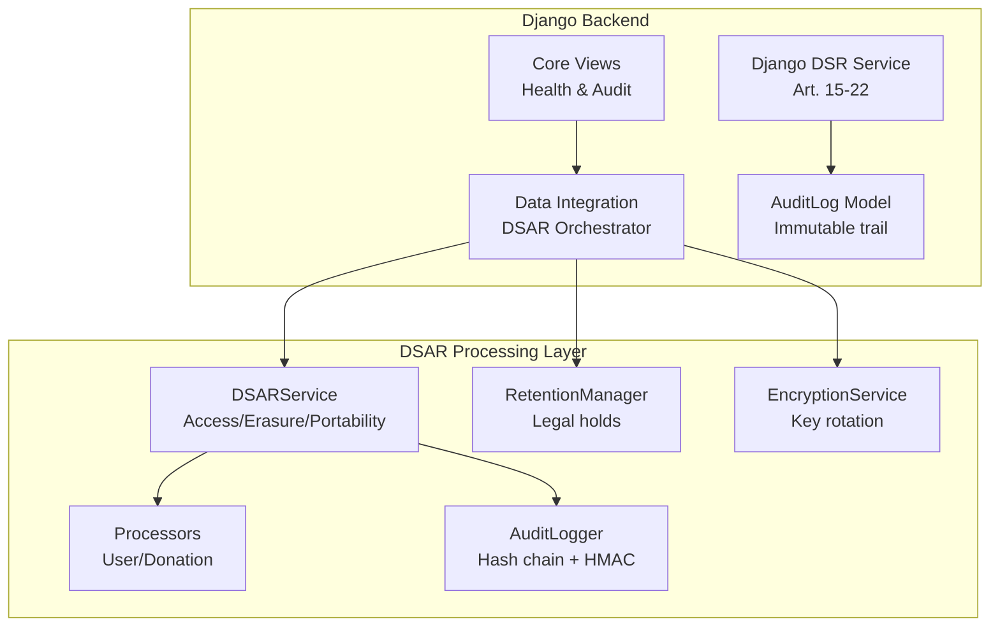
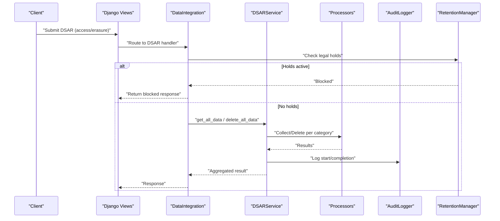
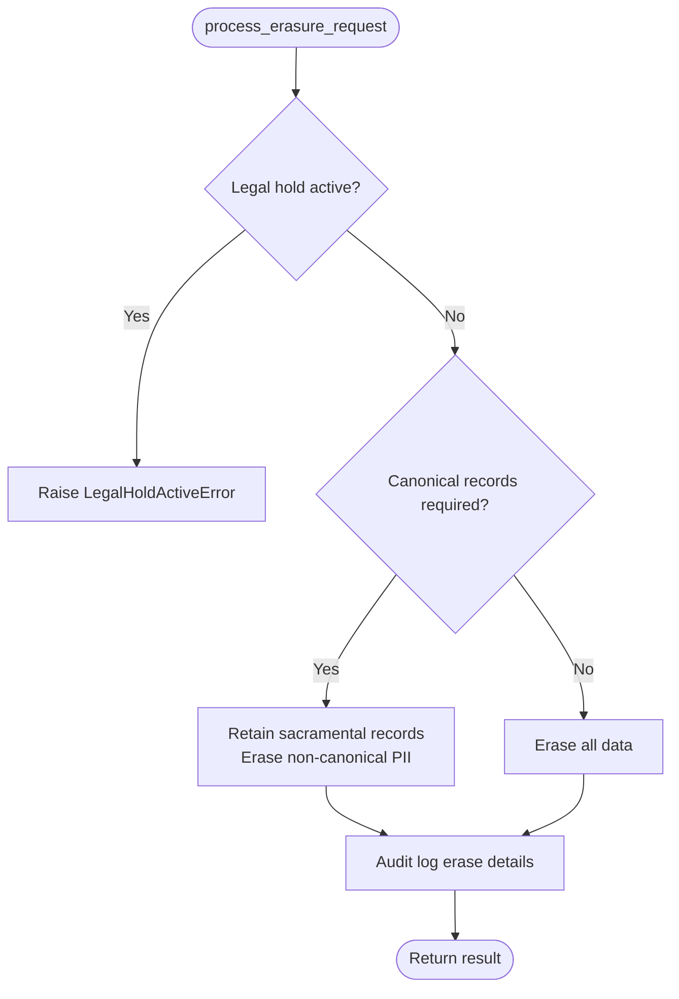
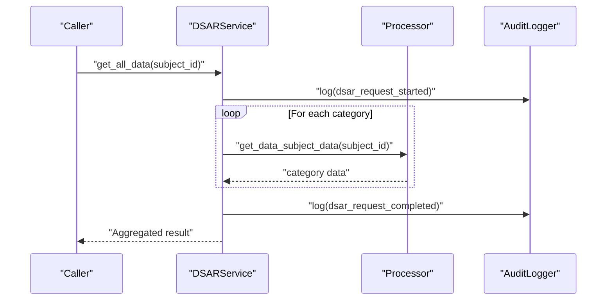
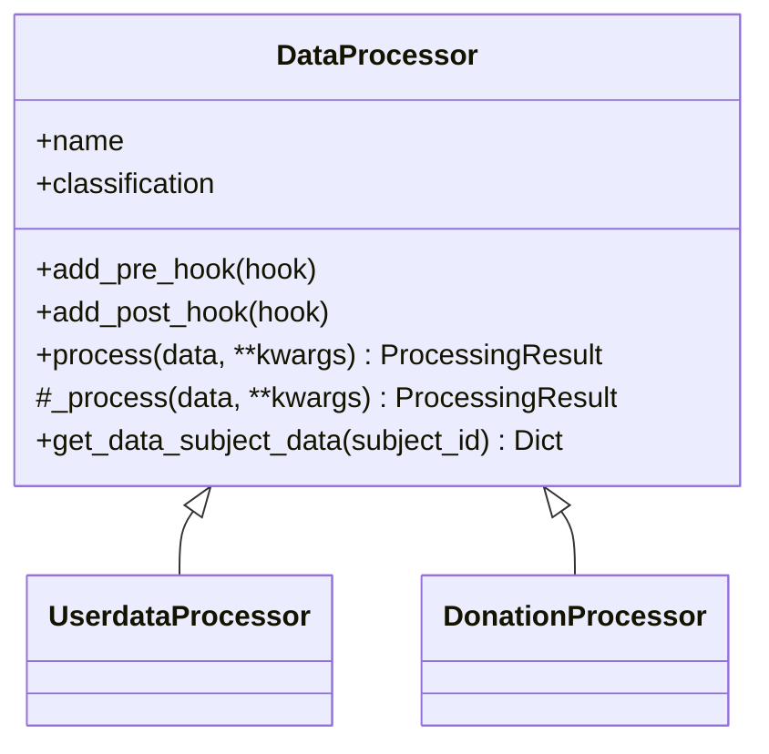
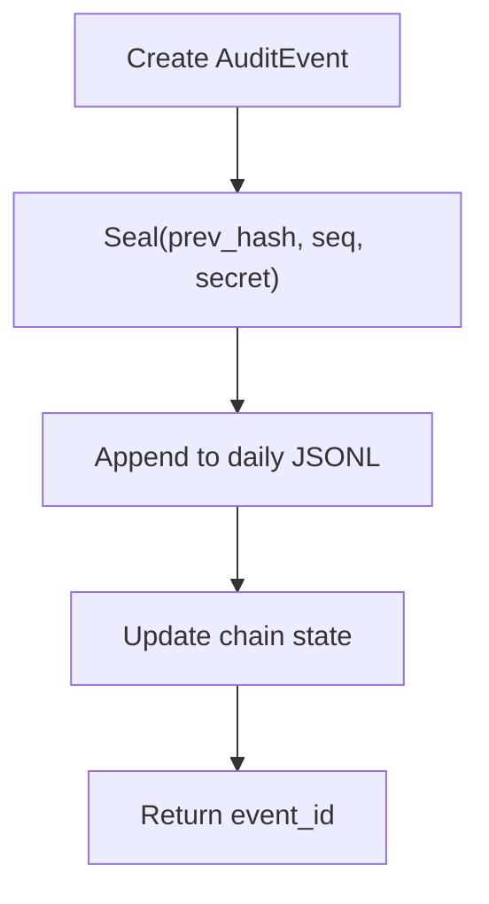
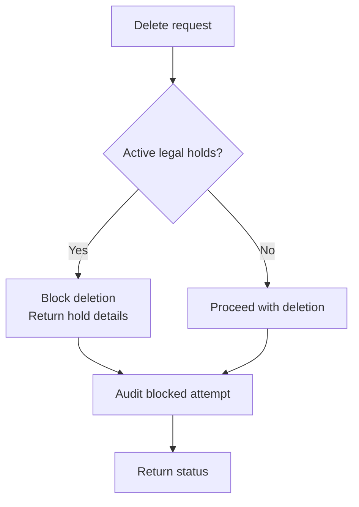
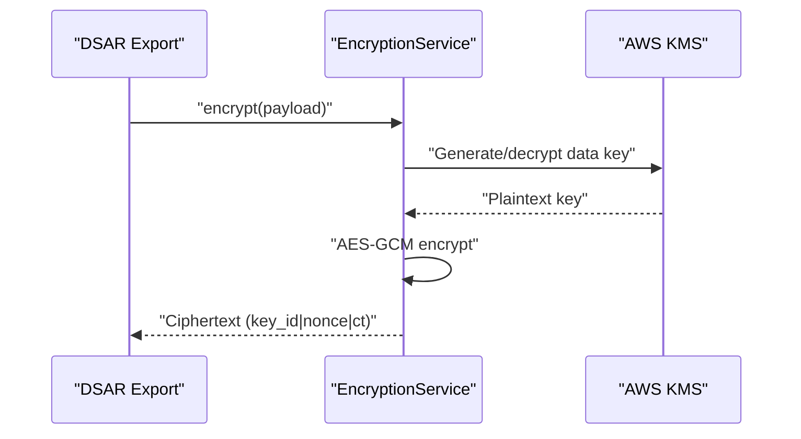
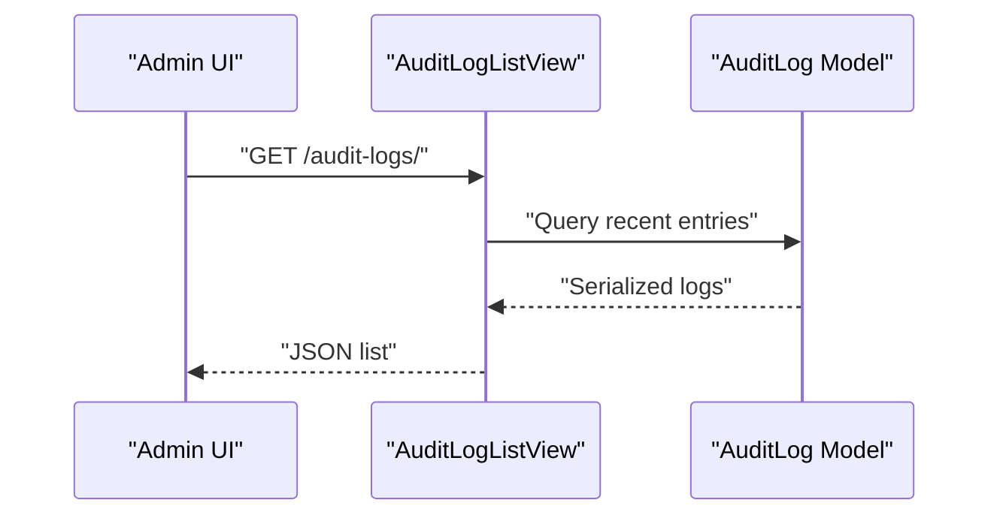
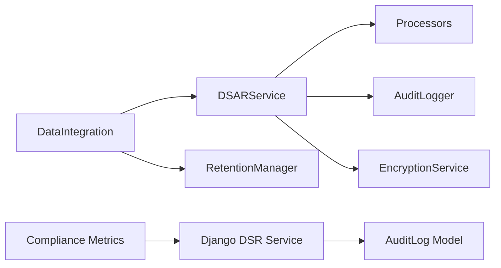

# Data Subject Access Requests (DSAR)

<cite>
**Referenced Files in This Document**
- [dsr_service.py](file://backend/django/apps/core/dsr_service.py)
- [models.py](file://backend/django/apps/core/models.py)
- [views.py](file://backend/django/apps/core/views.py)
- [data_integration.py](file://backend/django/apps/core/data_integration.py)
- [dsar_service.py](file://data/src/dsar_service.py)
- [processors.py](file://data/src/processors.py)
- [audit.py](file://data/src/audit.py)
- [retention_manager.py](file://data/src/gdpr/retention_manager.py)
- [encryption.py](file://data/src/encryption.py)
- [metrics.py](file://backend/django/apps/crm/observability/metrics.py)
- [compliance page](file://frontend/apps/admin-dashboard/src/app/(dashboard)/compliance/page.tsx)
</cite>

## Table of Contents
1. Introduction
2. Project Structure
3. Core Components
4. Architecture Overview
5. Detailed Component Analysis
6. Dependency Analysis
7. Performance Considerations
8. Troubleshooting Guide
9. Conclusion
10. Appendices

## Introduction
This document explains the automated processing of Data Subject Access Requests under GDPR Articles 15–22 across the repository. It covers request intake, verification workflows, data collection from multiple sources, format standardization, secure delivery mechanisms, DSAR service architecture, workflow automation, timeline tracking, and compliance reporting. It also provides examples for access, rectification, erasure, and portability requests, along with error handling and audit trails suitable for regulatory compliance.

## Project Structure
The DSAR capability spans two layers:
- Django backend services that orchestrate DSARs, enforce legal holds, and integrate with processors and encryption.
- A Python-based DSAR service layer that coordinates data retrieval and deletion across processors, with tamper-evident audit logging and retention controls.

**Diagram sources**
- [views.py:1-162](file://backend/django/apps/core/views.py#L1-L162)
- [data_integration.py:263-342](file://backend/django/apps/core/data_integration.py#L263-L342)
- [dsr_service.py:1-496](file://backend/django/apps/core/dsr_service.py#L1-L496)
- [dsar_service.py:1-303](file://data/src/dsar_service.py#L1-L303)
- [processors.py:1-200](file://data/src/processors.py#L1-L200)
- [audit.py:1-644](file://data/src/audit.py#L1-L644)
- [retention_manager.py:1-336](file://data/src/gdpr/retention_manager.py#L1-L336)
- [encryption.py:1-575](file://data/src/encryption.py#L1-L575)

**Section sources**
- [views.py:1-162](file://backend/django/apps/core/views.py#L1-L162)
- [data_integration.py:263-342](file://backend/django/apps/core/data_integration.py#L263-L342)
- [dsr_service.py:1-496](file://backend/django/apps/core/dsr_service.py#L1-L496)
- [dsar_service.py:1-303](file://data/src/dsar_service.py#L1-L303)
- [processors.py:1-200](file://data/src/processors.py#L1-L200)
- [audit.py:1-644](file://data/src/audit.py#L1-L644)
- [retention_manager.py:1-336](file://data/src/gdpr/retention_manager.py#L1-L336)
- [encryption.py:1-575](file://data/src/encryption.py#L1-L575)

## Core Components
- Django DSR Service: Implements GDPR Art. 15–22 request types, deadlines, and organization-scoped logic; logs actions to an immutable audit model.
- DSAR Service (Python): Coordinates access and erasure across processors, aggregates results, and writes integrity-protected audit events.
- Processors: Abstract base and concrete implementations for user and donation data, each enforcing classification and audit logging.
- Audit Logger: Hash-chain and HMAC-signed event log with sequence numbers, query/reporting, and chain verification.
- Retention Manager: Legal hold registry and retention rules; blocks deletions when required by law or policy.
- Encryption Service: Pluggable key providers (AWS KMS/local), envelope encryption, automatic rotation, and re-encryption support.
- Compliance Metrics: Aggregates pending/overdue DSARs, consent status, active legal holds, and audit integrity into a score and alerts.

**Section sources**
- [dsr_service.py:1-496](file://backend/django/apps/core/dsr_service.py#L1-L496)
- [dsar_service.py:1-303](file://data/src/dsar_service.py#L1-L303)
- [processors.py:1-200](file://data/src/processors.py#L1-L200)
- [audit.py:1-644](file://data/src/audit.py#L1-L644)
- [retention_manager.py:1-336](file://data/src/gdpr/retention_manager.py#L1-L336)
- [encryption.py:1-575](file://data/src/encryption.py#L1-L575)
- [metrics.py:125-294](file://backend/django/apps/crm/observability/metrics.py#L125-L294)

## Architecture Overview
The system separates concerns between orchestration and execution:
- Orchestration (Django): Receives DSARs, enforces tenant isolation, checks legal holds, and delegates to the DSAR service.
- Execution (Python DSAR layer): Invokes processors per category, aggregates results, and persists tamper-evident audit events.
- Security: Encryption protects sensitive payloads; audit logs provide integrity guarantees.
- Compliance: Retention rules and legal holds prevent unlawful erasure; metrics track SLAs and risks.

**Diagram sources**
- [views.py:1-162](file://backend/django/apps/core/views.py#L1-L162)
- [data_integration.py:263-342](file://backend/django/apps/core/data_integration.py#L263-L342)
- [dsar_service.py:88-157](file://data/src/dsar_service.py#L88-L157)
- [retention_manager.py:257-317](file://data/src/gdpr/retention_manager.py#L257-L317)
- [audit.py:330-369](file://data/src/audit.py#L330-L369)

## Detailed Component Analysis

### Django DSR Service (Art. 15–22)
- Request lifecycle: Creates requests with unique IDs, sets deadlines (30 days, extendable), and records initial audit entries.
- Rights implemented:
  - Access: Collects personal data and returns JSON with metadata.
  - Rectification: Applies corrections and logs updated fields without storing old values.
  - Erasure: Enforces legal hold and canonical record exceptions; distinguishes retained vs erased records.
  - Restriction: Marks data as restricted with reason.
  - Portability: Exports machine-readable data with metadata.
  - Objection: Stops specified processing types.
- Error handling: Custom exceptions for legal hold and canonical record constraints.

**Diagram sources**
- [dsr_service.py:194-252](file://backend/django/apps/core/dsr_service.py#L194-L252)

**Section sources**
- [dsr_service.py:36-376](file://backend/django/apps/core/dsr_service.py#L36-L376)

### DSAR Service (Access/Erasure/Portability)
- Access: Iterates processors, aggregates categories and counts, logs start/completion, and returns structured JSON.
- Erasure: Supports dry-run and skip categories; aggregates deleted/retained counts and errors; logs completion.
- Export: Writes consolidated JSON export for portability.

**Diagram sources**
- [dsar_service.py:88-157](file://data/src/dsar_service.py#L88-L157)
- [audit.py:330-369](file://data/src/audit.py#L330-L369)

**Section sources**
- [dsar_service.py:59-303](file://data/src/dsar_service.py#L59-L303)

### Processors (Abstract Base and Implementations)
- Abstract base enforces pre/post hooks, standardized processing result, and audit logging around operations.
- Concrete processors implement subject data retrieval and deletion with classification-aware behavior.

**Diagram sources**
- [processors.py:94-200](file://data/src/processors.py#L94-L200)

**Section sources**
- [processors.py:1-200](file://data/src/processors.py#L1-L200)

### Audit Logging (Tamper-Evident Chain)
- Each event is sealed with previous hash, sequence number, and HMAC signature.
- Provides append-only daily files, chain state persistence, querying, compliance reports, and chain verification.

**Diagram sources**
- [audit.py:160-189](file://data/src/audit.py#L160-L189)
- [audit.py:330-369](file://data/src/audit.py#L330-L369)

**Section sources**
- [audit.py:1-644](file://data/src/audit.py#L1-L644)

### Retention Management and Legal Holds
- LegalHoldRegistry tracks active holds per subject; deletion paths check holds before proceeding.
- RetentionManager applies retention rules and skips subjects with holds during cleanup.

**Diagram sources**
- [retention_manager.py:257-317](file://data/src/gdpr/retention_manager.py#L257-L317)

**Section sources**
- [retention_manager.py:1-336](file://data/src/gdpr/retention_manager.py#L1-L336)

### Encryption and Secure Delivery
- EncryptionService supports AWS KMS and local providers with envelope encryption and automatic rotation.
- Used to protect PII in transit/storage and to secure DSAR exports prior to delivery.

**Diagram sources**
- [encryption.py:177-226](file://data/src/encryption.py#L177-L226)

**Section sources**
- [encryption.py:1-575](file://data/src/encryption.py#L1-L575)

### Django Integration Points
- DataIntegration orchestrates DSAR calls, enforces legal holds, and integrates encryption where needed.
- Core views expose health/readiness and admin-only audit log listing.

**Diagram sources**
- [views.py:104-121](file://backend/django/apps/core/views.py#L104-L121)
- [models.py:67-200](file://backend/django/apps/core/models.py#L67-L200)

**Section sources**
- [data_integration.py:263-342](file://backend/django/apps/core/data_integration.py#L263-L342)
- [views.py:1-162](file://backend/django/apps/core/views.py#L1-L162)
- [models.py:1-200](file://backend/django/apps/core/models.py#L1-L200)

## Dependency Analysis

**Diagram sources**
- [data_integration.py:263-342](file://backend/django/apps/core/data_integration.py#L263-L342)
- [dsar_service.py:59-303](file://data/src/dsar_service.py#L59-L303)
- [retention_manager.py:188-336](file://data/src/gdpr/retention_manager.py#L188-L336)
- [audit.py:205-369](file://data/src/audit.py#L205-L369)
- [encryption.py:346-521](file://data/src/encryption.py#L346-L521)
- [dsr_service.py:36-376](file://backend/django/apps/core/dsr_service.py#L36-L376)
- [metrics.py:125-294](file://backend/django/apps/crm/observability/metrics.py#L125-L294)

**Section sources**
- [data_integration.py:263-342](file://backend/django/apps/core/data_integration.py#L263-L342)
- [dsar_service.py:59-303](file://data/src/dsar_service.py#L59-L303)
- [retention_manager.py:188-336](file://data/src/gdpr/retention_manager.py#L188-L336)
- [audit.py:205-369](file://data/src/audit.py#L205-L369)
- [encryption.py:346-521](file://data/src/encryption.py#L346-L521)
- [dsr_service.py:36-376](file://backend/django/apps/core/dsr_service.py#L36-L376)
- [metrics.py:125-294](file://backend/django/apps/crm/observability/metrics.py#L125-L294)

## Performance Considerations
- Batched processor calls: The DSAR service iterates processors sequentially; consider parallelization if processors are independent and safe to run concurrently.
- Audit I/O: Append-only JSONL with daily rotation reduces contention; ensure adequate disk throughput for high-volume environments.
- Encryption overhead: Envelope encryption minimizes KMS calls; reuse data keys within process lifetimes via caching where appropriate.
- Database queries: Processors should use efficient queries and indexes on subject identifiers and timestamps.

[No sources needed since this section provides general guidance]

## Troubleshooting Guide
Common issues and resolutions:
- Legal hold blocking erasure: Verify active holds and lift them when appropriate; check retention manager outputs for hold details.
- Missing processors: Ensure processor modules are available and configured; inspect import errors in orchestration logs.
- Audit chain integrity failures: Use chain verification to detect tampering or gaps; regenerate chain state only after investigation.
- Encryption key rotation errors: Confirm provider configuration and key availability; validate current key and versions.

**Section sources**
- [retention_manager.py:257-317](file://data/src/gdpr/retention_manager.py#L257-L317)
- [audit.py:513-589](file://data/src/audit.py#L513-L589)
- [encryption.py:346-521](file://data/src/encryption.py#L346-L521)
- [data_integration.py:263-342](file://backend/django/apps/core/data_integration.py#L263-L342)

## Conclusion
The DSAR implementation provides a robust, compliant pipeline for handling GDPR rights across multiple data sources. It enforces legal holds, maintains tamper-evident audit trails, supports secure export, and offers visibility through compliance metrics. By separating orchestration from execution and integrating strong security controls, the system meets both functional and regulatory requirements.

[No sources needed since this section summarizes without analyzing specific files]

## Appendices

### Examples by Request Type
- Access (Art. 15): Retrieve all personal data across categories; return JSON with metadata and totals.
- Rectification (Art. 16): Apply field-level corrections; log updated fields without retaining old values.
- Erasure (Art. 17): Respect legal holds and canonical records; distinguish erased vs retained records.
- Portability (Art. 20): Export consolidated dataset in machine-readable format with metadata.

**Section sources**
- [dsr_service.py:130-347](file://backend/django/apps/core/dsr_service.py#L130-L347)
- [dsar_service.py:88-303](file://data/src/dsar_service.py#L88-L303)

### Timeline Tracking and Deadlines
- Default deadline: 30 days per GDPR Art. 12(3); extension up to 60 days supported.
- Metrics compute average response time and flag overdue requests.

**Section sources**
- [dsr_service.py:67-77](file://backend/django/apps/core/dsr_service.py#L67-L77)
- [metrics.py:222-237](file://backend/django/apps/crm/observability/metrics.py#L222-L237)

### Compliance Reporting and Dashboards
- Backend metrics aggregate pending/overdue DSARs, consent status, active legal holds, and audit integrity into a score and issues list.
- Frontend dashboard surfaces compliance status, data residency, consent management, retention countdown, and audit logs.

**Section sources**
- [metrics.py:125-294](file://backend/django/apps/crm/observability/metrics.py#L125-L294)
- [compliance page:30-227](file://frontend/apps/admin-dashboard/src/app/(dashboard)/compliance/page.tsx#L30-L227)