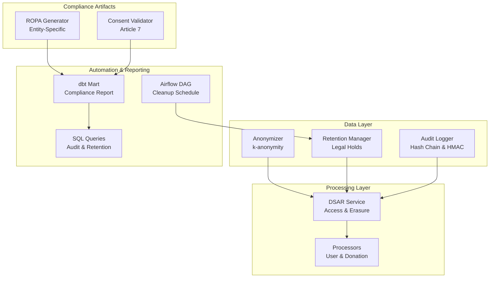
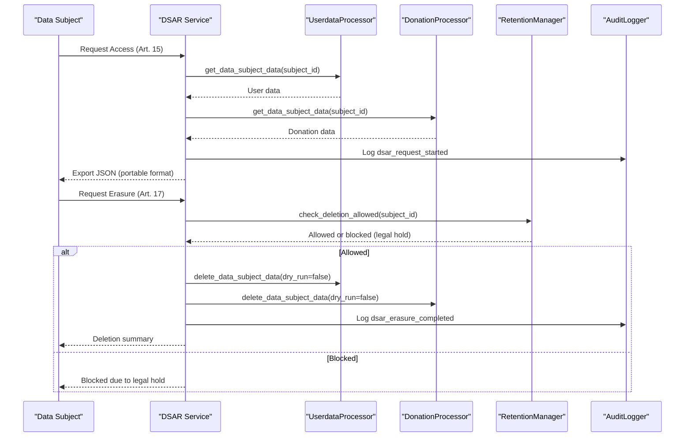
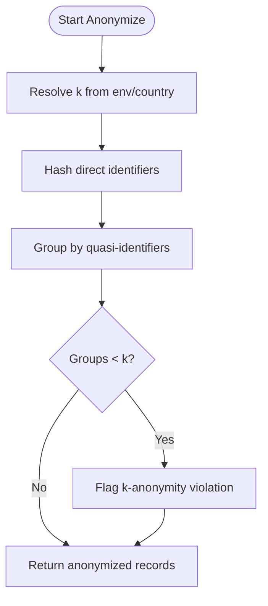
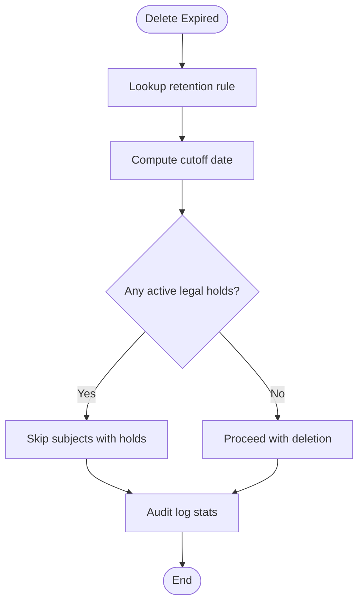
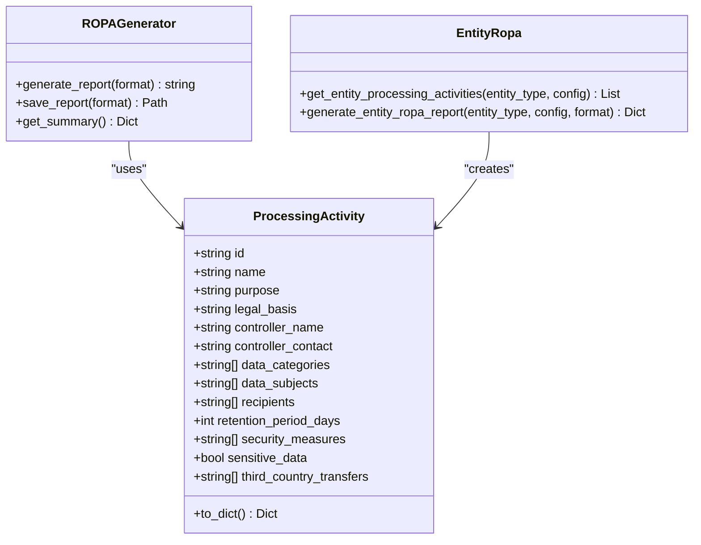
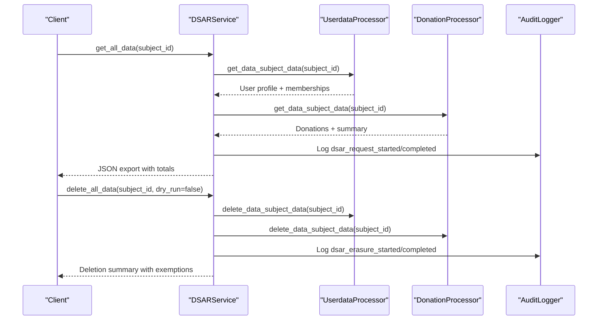
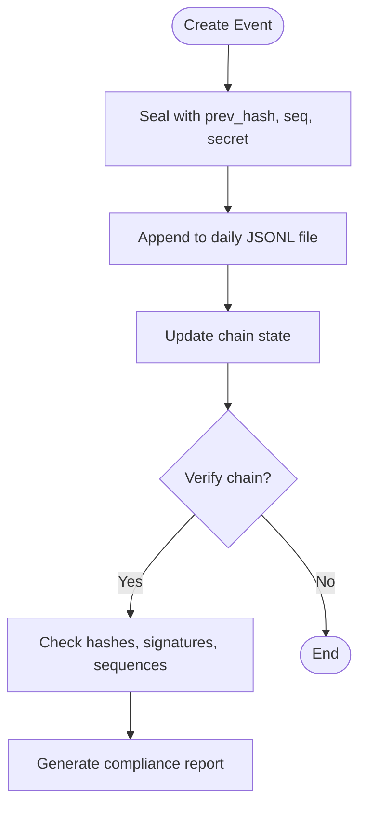
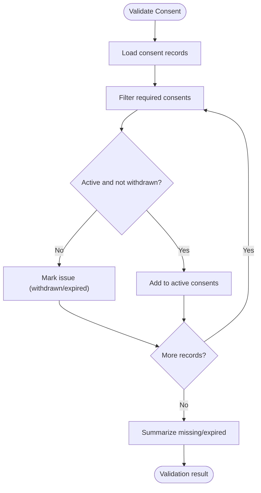
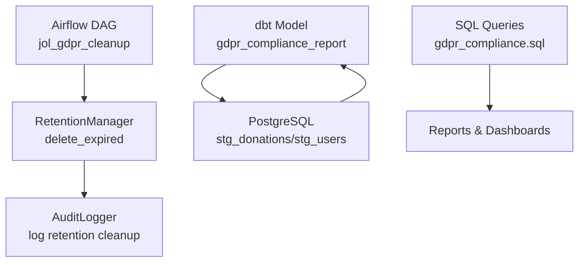
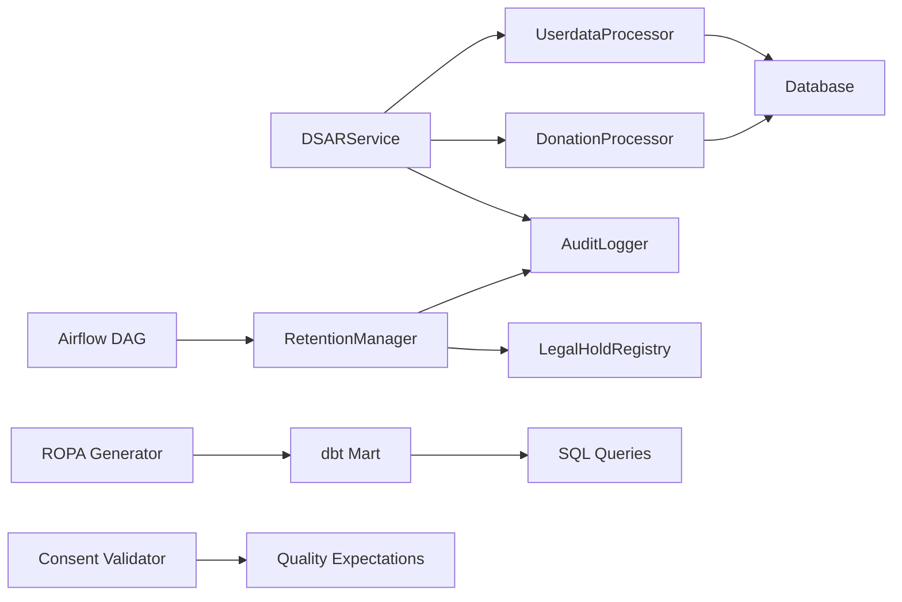

# GDPR Compliance Automation

<cite>
**Referenced Files in This Document**
- [anonymizer.py](file://data/src/gdpr/anonymizer.py)
- [retention_manager.py](file://data/src/gdpr/retention_manager.py)
- [entity_ropa.py](file://data/src/gdpr/entity_ropa.py)
- [ropa_generator.py](file://data/src/gdpr/ropa_generator.py)
- [dsar_service.py](file://data/src/dsar_service.py)
- [audit.py](file://data/src/audit.py)
- [processors.py](file://data/src/processors.py)
- [gdpr_consent_validation.py](file://data/src/quality/expectations/gdpr_consent_validation.py)
- [jol_gdpr_cleanup.py](file://data/airflow/dags/jol_gdpr_cleanup.py)
- [gdpr_compliance_report.sql](file://data/dbt/models/marts/gdpr_compliance_report.sql)
- [gdpr_compliance.sql](file://data/sql/audit_queries/gdpr_compliance.sql)
</cite>

## Table of Contents
1. Introduction
2. Project Structure
3. Core Components
4. Architecture Overview
5. Detailed Component Analysis
6. Dependency Analysis
7. Performance Considerations
8. Troubleshooting Guide
9. Conclusion
10. Appendices

## Introduction
This document explains the GDPR compliance automation features implemented across the repository, focusing on:
- Data anonymization and k-anonymity thresholds by country
- Retention policy management with legal holds
- Records of Processing Activities (ROPA) generation per entity type
- Data Subject Access Requests (DSAR) handling for access and erasure
- Audit logging with integrity protection for compliance tracking
- Automated compliance reporting via Airflow DAGs and dbt models
- Legal basis documentation, consent validation, and data protection impact assessment (DPIA) references

The goal is to provide a practical guide for implementing and operating GDPR workflows end-to-end, including troubleshooting common issues.

## Project Structure
GDPR-related functionality spans several modules:
- Anonymization and retention logic under data/src/gdpr
- DSAR orchestration and processors under data/src
- Audit logging under data/src/audit
- Consent validation under data/src/quality/expectations
- Automated scheduling via Airflow DAGs under data/airflow/dags
- Reporting via dbt models under data/dbt/models/marts and SQL queries under data/sql/audit_queries

**Diagram sources**
- [anonymizer.py:106-180](file://data/src/gdpr/anonymizer.py#L106-L180)
- [retention_manager.py:188-336](file://data/src/gdpr/retention_manager.py#L188-L336)
- [audit.py:205-369](file://data/src/audit.py#L205-L369)
- [dsar_service.py:59-157](file://data/src/dsar_service.py#L59-L157)
- [processors.py:223-503](file://data/src/processors.py#L223-L503)
- [entity_ropa.py:39-797](file://data/src/gdpr/entity_ropa.py#L39-L797)
- [ropa_generator.py:103-182](file://data/src/gdpr/ropa_generator.py#L103-L182)
- [gdpr_consent_validation.py:52-172](file://data/src/quality/expectations/gdpr_consent_validation.py#L52-L172)
- [jol_gdpr_cleanup.py:21-67](file://data/airflow/dags/jol_gdpr_cleanup.py#L21-L67)
- [gdpr_compliance_report.sql:10-67](file://data/dbt/models/marts/gdpr_compliance_report.sql#L10-L67)
- [gdpr_compliance.sql:7-65](file://data/sql/audit_queries/gdpr_compliance.sql#L7-L65)

**Section sources**
- [anonymizer.py:1-180](file://data/src/gdpr/anonymizer.py#L1-L180)
- [retention_manager.py:1-336](file://data/src/gdpr/retention_manager.py#L1-L336)
- [dsar_service.py:1-303](file://data/src/dsar_service.py#L1-L303)
- [processors.py:1-762](file://data/src/processors.py#L1-L762)
- [audit.py:1-644](file://data/src/audit.py#L1-L644)
- [entity_ropa.py:1-821](file://data/src/gdpr/entity_ropa.py#L1-L821)
- [ropa_generator.py:1-182](file://data/src/gdpr/ropa_generator.py#L1-L182)
- [gdpr_consent_validation.py:1-211](file://data/src/quality/expectations/gdpr_consent_validation.py#L1-L211)
- [jol_gdpr_cleanup.py:1-68](file://data/airflow/dags/jol_gdpr_cleanup.py#L1-L68)
- [gdpr_compliance_report.sql:1-68](file://data/dbt/models/marts/gdpr_compliance_report.sql#L1-L68)
- [gdpr_compliance.sql:1-66](file://data/sql/audit_queries/gdpr_compliance.sql#L1-L66)

## Core Components
- K-Anonymity Anonymizer: Country-specific k-thresholds, hashing direct identifiers, grouping checks, and convenience functions.
- Retention Manager: Rules-based retention, legal hold registry, deletion gating, and audit logging.
- DSAR Service: Orchestrates access and erasure across processors, tracks results, and audits requests.
- Processors: Concrete implementations for user and donation data, implementing right of access and erasure with retention exemptions.
- Audit Logger: Immutable, signed, hash-chained audit events with verification utilities and compliance reports.
- ROPA Generator: Entity-specific processing activities mapped to GDPR Article 30 requirements, with report generation.
- Consent Validator: Validates consent records against required types, expiry, and withdrawal status.
- Automation: Airflow DAG schedules cleanup tasks; dbt model aggregates compliance metrics; SQL queries support auditing and retention checks.

**Section sources**
- [anonymizer.py:25-180](file://data/src/gdpr/anonymizer.py#L25-L180)
- [retention_manager.py:21-106](file://data/src/gdpr/retention_manager.py#L21-L106)
- [dsar_service.py:59-157](file://data/src/dsar_service.py#L59-L157)
- [processors.py:94-220](file://data/src/processors.py#L94-L220)
- [audit.py:29-203](file://data/src/audit.py#L29-L203)
- [entity_ropa.py:39-797](file://data/src/gdpr/entity_ropa.py#L39-L797)
- [ropa_generator.py:19-100](file://data/src/gdpr/ropa_generator.py#L19-L100)
- [gdpr_consent_validation.py:15-172](file://data/src/quality/expectations/gdpr_consent_validation.py#L15-L172)
- [jol_gdpr_cleanup.py:21-67](file://data/airflow/dags/jol_gdpr_cleanup.py#L21-L67)
- [gdpr_compliance_report.sql:10-67](file://data/dbt/models/marts/gdpr_compliance_report.sql#L10-L67)
- [gdpr_compliance.sql:21-65](file://data/sql/audit_queries/gdpr_compliance.sql#L21-L65)

## Architecture Overview
The system implements a layered approach:
- Input: DSAR requests or scheduled cleanup jobs
- Processing: DSAR service coordinates processors; retention manager enforces rules and legal holds; anonymizer applies pseudonymization where needed
- Output: Compliant exports, deletions, and immutable audit trails; automated reports via dbt and SQL

**Diagram sources**
- [dsar_service.py:88-157](file://data/src/dsar_service.py#L88-L157)
- [dsar_service.py:159-267](file://data/src/dsar_service.py#L159-L267)
- [processors.py:282-503](file://data/src/processors.py#L282-L503)
- [processors.py:570-761](file://data/src/processors.py#L570-L761)
- [retention_manager.py:319-336](file://data/src/gdpr/retention_manager.py#L319-L336)
- [audit.py:391-407](file://data/src/audit.py#L391-L407)

## Detailed Component Analysis

### Data Anonymization (K-Anonymity)
- Country-specific k values are applied based on regulatory guidance; environment override supported
- Direct identifiers hashed; quasi-identifier grouping checked for violations
- Utility function provides batch anonymization with configurable k and country code

**Diagram sources**
- [anonymizer.py:66-83](file://data/src/gdpr/anonymizer.py#L66-L83)
- [anonymizer.py:112-143](file://data/src/gdpr/anonymizer.py#L112-L143)
- [anonymizer.py:160-180](file://data/src/gdpr/anonymizer.py#L160-L180)

**Section sources**
- [anonymizer.py:25-180](file://data/src/gdpr/anonymizer.py#L25-L180)

### Retention Policy Management and Legal Holds
- Retention rules define days and legal basis per data type
- LegalHoldRegistry prevents deletion when active holds exist
- RetentionManager.delete_expired computes cutoff dates and logs actions
- Deletion gating ensures compliance with legal obligations and claims

**Diagram sources**
- [retention_manager.py:78-106](file://data/src/gdpr/retention_manager.py#L78-L106)
- [retention_manager.py:206-246](file://data/src/gdpr/retention_manager.py#L206-L246)
- [retention_manager.py:257-317](file://data/src/gdpr/retention_manager.py#L257-L317)

**Section sources**
- [retention_manager.py:21-106](file://data/src/gdpr/retention_manager.py#L21-L106)
- [retention_manager.py:188-336](file://data/src/gdpr/retention_manager.py#L188-L336)

### Records of Processing Activities (ROPA) Generation
- Entity-specific mapping defines processing activities for each entity type
- Base helper constructs ProcessingActivity objects with metadata
- Reports include controller details, compliance frameworks, and summaries

**Diagram sources**
- [ropa_generator.py:19-100](file://data/src/gdpr/ropa_generator.py#L19-L100)
- [ropa_generator.py:103-182](file://data/src/gdpr/ropa_generator.py#L103-L182)
- [entity_ropa.py:39-797](file://data/src/gdpr/entity_ropa.py#L39-L797)

**Section sources**
- [entity_ropa.py:39-797](file://data/src/gdpr/entity_ropa.py#L39-L797)
- [ropa_generator.py:19-182](file://data/src/gdpr/ropa_generator.py#L19-L182)

### DSAR Handling (Access and Erasure)
- DSARService orchestrates access and erasure across processors
- Access returns machine-readable JSON export; erasure respects retention exemptions and legal holds
- All steps are audited with detailed metadata

**Diagram sources**
- [dsar_service.py:88-157](file://data/src/dsar_service.py#L88-L157)
- [dsar_service.py:159-267](file://data/src/dsar_service.py#L159-L267)
- [processors.py:282-503](file://data/src/processors.py#L282-L503)
- [processors.py:570-761](file://data/src/processors.py#L570-L761)
- [audit.py:391-407](file://data/src/audit.py#L391-L407)

**Section sources**
- [dsar_service.py:59-267](file://data/src/dsar_service.py#L59-L267)
- [processors.py:282-761](file://data/src/processors.py#L282-L761)

### Audit Logging for Compliance Tracking
- Immutable chain: each event sealed with previous hash, sequence number, and HMAC signature
- Supports querying events, generating compliance reports, and verifying chain integrity
- Provides convenience methods for GDPR request logging

**Diagram sources**
- [audit.py:134-203](file://data/src/audit.py#L134-L203)
- [audit.py:330-369](file://data/src/audit.py#L330-L369)
- [audit.py:475-511](file://data/src/audit.py#L475-L511)
- [audit.py:513-589](file://data/src/audit.py#L513-L589)

**Section sources**
- [audit.py:29-203](file://data/src/audit.py#L29-L203)
- [audit.py:205-369](file://data/src/audit.py#L205-L369)
- [audit.py:475-589](file://data/src/audit.py#L475-L589)

### Consent Management and Validation
- Validates consent records for required types, expiry, and withdrawal
- Batch validation supports multiple subjects and generates compliance statistics
- Integrates with processing pipelines to enforce consent before processing

**Diagram sources**
- [gdpr_consent_validation.py:77-142](file://data/src/quality/expectations/gdpr_consent_validation.py#L77-L142)
- [gdpr_consent_validation.py:152-172](file://data/src/quality/expectations/gdpr_consent_validation.py#L152-L172)
- [gdpr_consent_validation.py:174-211](file://data/src/quality/expectations/gdpr_consent_validation.py#L174-L211)

**Section sources**
- [gdpr_consent_validation.py:15-172](file://data/src/quality/expectations/gdpr_consent_validation.py#L15-L172)
- [gdpr_consent_validation.py:174-211](file://data/src/quality/expectations/gdpr_consent_validation.py#L174-L211)

### Automated Compliance Reporting
- Airflow DAG schedules cleanup tasks for operational logs and user activity
- dbt model aggregates processing activities, retention status, and approaching expiry alerts
- SQL queries support audit and retention compliance checks

**Diagram sources**
- [jol_gdpr_cleanup.py:21-67](file://data/airflow/dags/jol_gdpr_cleanup.py#L21-L67)
- [gdpr_compliance_report.sql:10-67](file://data/dbt/models/marts/gdpr_compliance_report.sql#L10-L67)
- [gdpr_compliance.sql:21-65](file://data/sql/audit_queries/gdpr_compliance.sql#L21-L65)

**Section sources**
- [jol_gdpr_cleanup.py:21-67](file://data/airflow/dags/jol_gdpr_cleanup.py#L21-L67)
- [gdpr_compliance_report.sql:10-67](file://data/dbt/models/marts/gdpr_compliance_report.sql#L10-L67)
- [gdpr_compliance.sql:21-65](file://data/sql/audit_queries/gdpr_compliance.sql#L21-L65)

## Dependency Analysis
Key dependencies and relationships:
- DSARService depends on processors and audit logger
- Processors depend on database connections and audit logger
- RetentionManager depends on legal hold registry and audit logger
- ROPA generator produces artifacts consumed by reporting
- Consent validator integrates with quality expectations and processing pipelines
- Airflow DAG triggers retention cleanup tasks
- dbt model consumes staging tables to produce compliance metrics

**Diagram sources**
- [dsar_service.py:79-86](file://data/src/dsar_service.py#L79-L86)
- [processors.py:29-37](file://data/src/processors.py#L29-L37)
- [retention_manager.py:109-185](file://data/src/gdpr/retention_manager.py#L109-L185)
- [ropa_generator.py:103-182](file://data/src/gdpr/ropa_generator.py#L103-L182)
- [gdpr_consent_validation.py:52-172](file://data/src/quality/expectations/gdpr_consent_validation.py#L52-L172)
- [jol_gdpr_cleanup.py:21-67](file://data/airflow/dags/jol_gdpr_cleanup.py#L21-L67)
- [gdpr_compliance_report.sql:10-67](file://data/dbt/models/marts/gdpr_compliance_report.sql#L10-L67)

**Section sources**
- [dsar_service.py:79-86](file://data/src/dsar_service.py#L79-L86)
- [processors.py:29-37](file://data/src/processors.py#L29-L37)
- [retention_manager.py:109-185](file://data/src/gdpr/retention_manager.py#L109-L185)
- [ropa_generator.py:103-182](file://data/src/gdpr/ropa_generator.py#L103-L182)
- [gdpr_consent_validation.py:52-172](file://data/src/quality/expectations/gdpr_consent_validation.py#L52-L172)
- [jol_gdpr_cleanup.py:21-67](file://data/airflow/dags/jol_gdpr_cleanup.py#L21-L67)
- [gdpr_compliance_report.sql:10-67](file://data/dbt/models/marts/gdpr_compliance_report.sql#L10-L67)

## Performance Considerations
- K-anonymity grouping complexity scales with dataset size; consider batching and indexing quasi-identifiers
- DSAR access queries should be optimized with appropriate indexes on subject identifiers
- Retention cleanup runs nightly; ensure database performance during bulk updates
- Audit log writes are append-only; monitor disk usage and implement rotation policies
- dbt model aggregation benefits from materialized tables and incremental builds

[No sources needed since this section provides general guidance]

## Troubleshooting Guide
Common issues and resolutions:
- DSAR access failures: Check processor connectivity and database permissions; review audit logs for errors
- Erasure blocked by legal hold: Inspect legal hold registry for active holds; lift holds only when legally permissible
- Consent validation failures: Ensure consent records have valid timestamps and are not withdrawn; re-consent if expired
- Audit chain integrity issues: Use verify_chain to detect breaks; investigate tampering or misconfiguration
- Retention cleanup not deleting: Confirm retention rules and cutoff calculations; validate legal holds and skip lists

**Section sources**
- [dsar_service.py:117-123](file://data/src/dsar_service.py#L117-L123)
- [retention_manager.py:272-300](file://data/src/gdpr/retention_manager.py#L272-L300)
- [gdpr_consent_validation.py:112-142](file://data/src/quality/expectations/gdpr_consent_validation.py#L112-L142)
- [audit.py:513-589](file://data/src/audit.py#L513-L589)

## Conclusion
The repository implements a comprehensive GDPR compliance automation framework covering anonymization, retention, ROPA generation, DSAR handling, audit logging, consent validation, and automated reporting. The modular design enables extensibility and maintainability while ensuring strong compliance controls and verifiable audit trails.

[No sources needed since this section summarizes without analyzing specific files]

## Appendices

### Practical Examples of Implementing GDPR Workflows
- Anonymize datasets using country-specific k thresholds and quasi-identifier grouping
- Execute DSAR access to retrieve portable JSON exports across all data categories
- Perform DSAR erasure with dry-run mode to simulate deletions and review exemptions
- Generate entity-specific ROPA reports for compliance documentation
- Validate consent records prior to processing marketing or analytics activities
- Schedule nightly retention cleanup via Airflow and monitor dbt compliance reports

**Section sources**
- [anonymizer.py:160-180](file://data/src/gdpr/anonymizer.py#L160-L180)
- [dsar_service.py:88-157](file://data/src/dsar_service.py#L88-L157)
- [dsar_service.py:159-267](file://data/src/dsar_service.py#L159-L267)
- [entity_ropa.py:762-797](file://data/src/gdpr/entity_ropa.py#L762-L797)
- [gdpr_consent_validation.py:77-142](file://data/src/quality/expectations/gdpr_consent_validation.py#L77-L142)
- [jol_gdpr_cleanup.py:21-67](file://data/airflow/dags/jol_gdpr_cleanup.py#L21-L67)
- [gdpr_compliance_report.sql:10-67](file://data/dbt/models/marts/gdpr_compliance_report.sql#L10-L67)