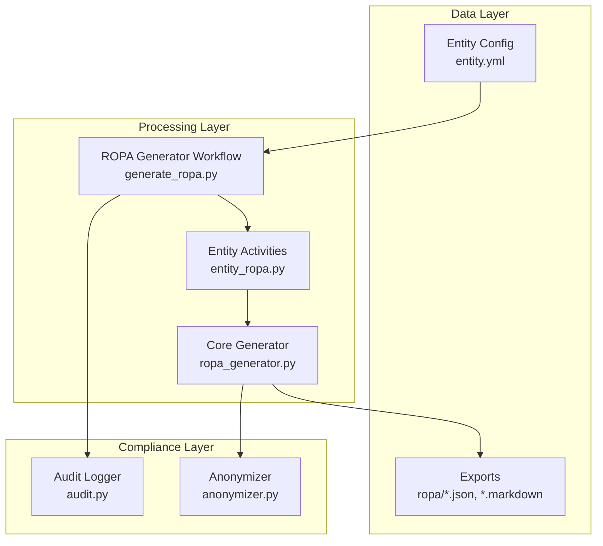
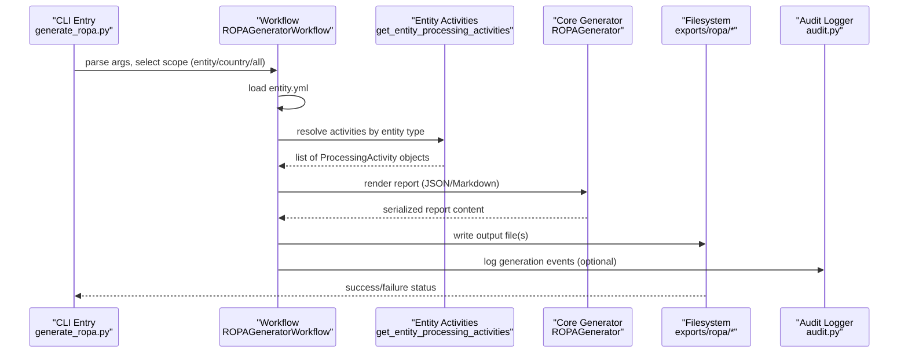
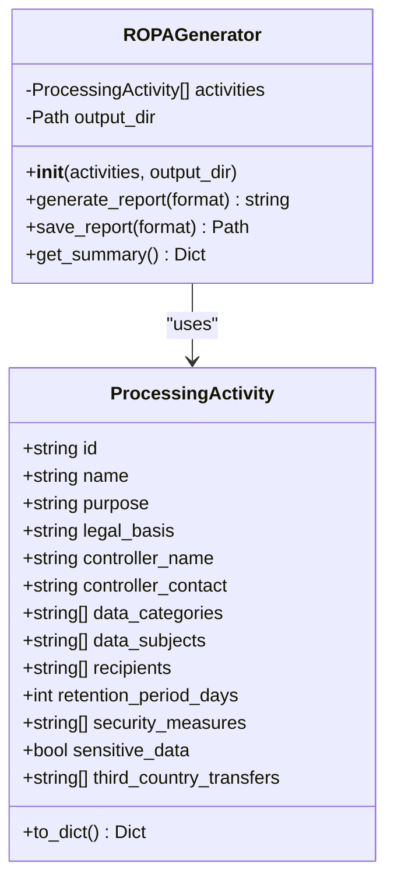
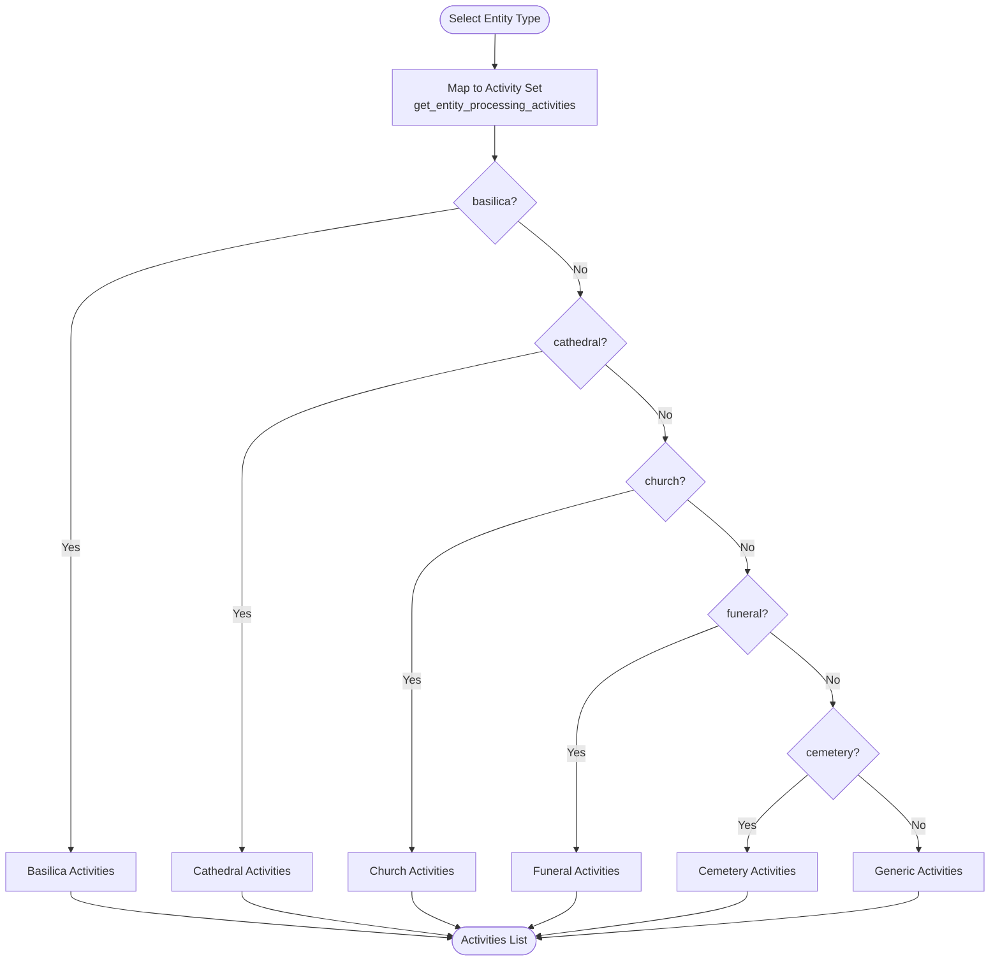
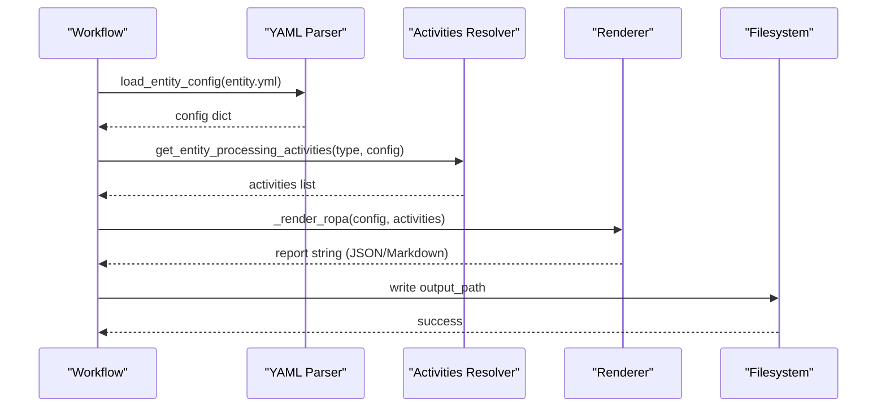
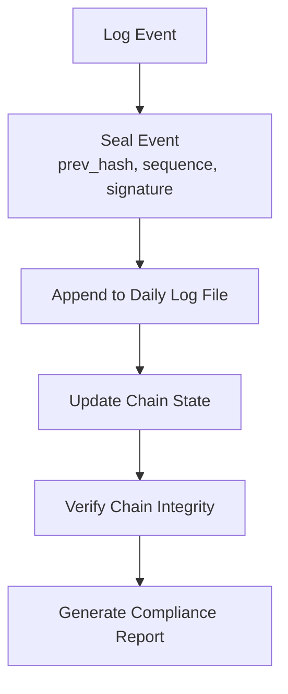
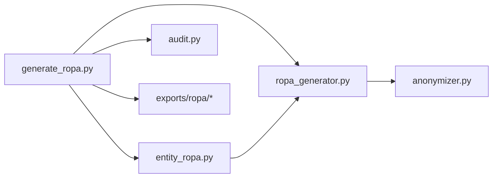

# Records of Processing Activities (ROPA)

<cite>
**Referenced Files in This Document**
- [ropa_generator.py](file://data/src/gdpr/ropa_generator.py)
- [entity_ropa.py](file://data/src/gdpr/entity_ropa.py)
- [generate_ropa.py](file://tools/qoder/workflows/generate_ropa.py)
- [anonymizer.py](file://data/src/gdpr/anonymizer.py)
- [audit.py](file://data/src/audit.py)
- [lt-catholic-church-001_ropa.json](file://data/exports/ropa/lt/church/lt-catholic-church-001_ropa.json)
- [lt-catholic-diocese-001_ropa.markdown](file://data/exports/ropa/lt/diocese/lt-catholic-diocese-001_ropa.markdown)
- [entity.yml](file://countries/lt/examples/catholic/church/st-john-vilnius/entity.yml)
</cite>

## Table of Contents
1. [Introduction](#introduction)
2. [Project Structure](#project-structure)
3. [Core Components](#core-components)
4. [Architecture Overview](#architecture-overview)
5. [Detailed Component Analysis](#detailed-component-analysis)
6. [Dependency Analysis](#dependency-analysis)
7. [Performance Considerations](#performance-considerations)
8. [Troubleshooting Guide](#troubleshooting-guide)
9. [Conclusion](#conclusion)
10. [Appendices](#appendices)

## Introduction
This document explains how the system automatically generates GDPR Article 30 Records of Processing Activities (ROPA) for all data processing operations across JOL-HUB entities. It covers purpose specification, legal basis identification, data category mapping, third-party processor tracking, entity-based ROPA structure, template generation, and compliance reporting features. It also includes examples of generated outputs, customization options, and integration with compliance audits.

The automation supports:
- Single-entity ROPA generation from entity configuration files
- Country-wide and multi-country batch generation
- JSON and Markdown output formats
- Entity-type-specific processing activities aligned with religious and commercial contexts
- Audit logging and chain integrity verification to support compliance reviews

## Project Structure
The ROPA feature spans several modules:
- Core ROPA model and generator utilities
- Entity-specific activity definitions for multiple entity types
- A CLI-driven workflow that reads entity configurations and produces outputs
- Anonymization utilities for privacy-preserving analytics
- A comprehensive audit logger with hash-chain integrity for compliance evidence

**Diagram sources**
- [generate_ropa.py:192-497](file://tools/qoder/workflows/generate_ropa.py#L192-L497)
- [entity_ropa.py:39-797](file://data/src/gdpr/entity_ropa.py#L39-L797)
- [ropa_generator.py:19-182](file://data/src/gdpr/ropa_generator.py#L19-L182)
- [audit.py:205-624](file://data/src/audit.py#L205-L624)
- [anonymizer.py:106-180](file://data/src/gdpr/anonymizer.py#L106-L180)

**Section sources**
- [generate_ropa.py:192-497](file://tools/qoder/workflows/generate_ropa.py#L192-L497)
- [entity_ropa.py:39-797](file://data/src/gdpr/entity_ropa.py#L39-L797)
- [ropa_generator.py:19-182](file://data/src/gdpr/ropa_generator.py#L19-L182)
- [audit.py:205-624](file://data/src/audit.py#L205-L624)
- [anonymizer.py:106-180](file://data/src/gdpr/anonymizer.py#L106-L180)

## Core Components
- ProcessingActivity dataclass: Defines a GDPR Article 30 record with fields for purpose, legal basis, data categories, data subjects, recipients, retention, security measures, sensitive data flags, and third-country transfers.
- ROPAGenerator: Produces standardized reports in JSON or Markdown, saves timestamped files, and provides summaries.
- Entity-specific activities: Maps entity types (e.g., church, diocese, funeral, cemetery) to tailored processing activities with appropriate legal bases and retention periods.
- ROPAGeneratorWorkflow: Orchestrates reading entity configs, selecting activities, rendering outputs, and writing files; supports single, country-wide, and all-countries runs.
- AuditLogger: Provides tamper-evident audit logs with hash chains and HMAC signatures, enabling compliance verification and reporting.
- KAnonymizer: Implements k-anonymity thresholds per country to support anonymized analytics and reporting.

Key responsibilities:
- Purpose specification: Each activity defines a clear purpose tied to business or canonical requirements.
- Legal basis identification: Activities specify GDPR articles (e.g., Art. 6(1)(b), Art. 9(2)(d)) as applicable.
- Data category mapping: Activities enumerate categories such as identification, financial, religious, family, behavioral.
- Third-party processor tracking: Recipients list external processors (e.g., payment processors, diocesan archives).
- Retention and security: Activities define retention periods and security measures (encryption, access control, PCI-DSS, canonical seal).

**Section sources**
- [ropa_generator.py:19-182](file://data/src/gdpr/ropa_generator.py#L19-L182)
- [entity_ropa.py:39-797](file://data/src/gdpr/entity_ropa.py#L39-L797)
- [generate_ropa.py:192-497](file://tools/qoder/workflows/generate_ropa.py#L192-L497)
- [audit.py:205-624](file://data/src/audit.py#L205-L624)
- [anonymizer.py:106-180](file://data/src/gdpr/anonymizer.py#L106-L180)

## Architecture Overview
The automated ROPA pipeline reads entity configurations, resolves entity-type-specific activities, renders structured reports, and persists them to exports. Audit logging and anonymization support compliance and privacy needs.

**Diagram sources**
- [generate_ropa.py:226-297](file://tools/qoder/workflows/generate_ropa.py#L226-L297)
- [entity_ropa.py:39-797](file://data/src/gdpr/entity_ropa.py#L39-L797)
- [ropa_generator.py:121-169](file://data/src/gdpr/ropa_generator.py#L121-L169)
- [audit.py:330-369](file://data/src/audit.py#L330-L369)

## Detailed Component Analysis

### ROPA Model and Generator
- ProcessingActivity encapsulates all required GDPR Article 30 fields and converts to dictionaries for serialization.
- ROPAGenerator builds a report object with controller metadata, processing activities, timestamps, and supports JSON and Markdown outputs. It also saves timestamped files and provides summary statistics.

**Diagram sources**
- [ropa_generator.py:19-182](file://data/src/gdpr/ropa_generator.py#L19-L182)

**Section sources**
- [ropa_generator.py:19-182](file://data/src/gdpr/ropa_generator.py#L19-L182)

### Entity-Specific Activities
- The system maps each entity type to a curated set of processing activities with appropriate purposes, legal bases, data categories, recipients, retention periods, and security measures.
- Catholic entities include sacramental records management under religious purposes; commercial entities include payment processing with PCI-DSS measures.

**Diagram sources**
- [entity_ropa.py:39-797](file://data/src/gdpr/entity_ropa.py#L39-L797)

**Section sources**
- [entity_ropa.py:39-797](file://data/src/gdpr/entity_ropa.py#L39-L797)

### Workflow Orchestration and Output Rendering
- The workflow loads entity configurations, determines entity type, retrieves activities, renders reports, and writes outputs. It supports dry-run mode and verbose logging.
- Outputs are organized by country and entity type, with filenames including entity IDs and formats (.json, .markdown).

**Diagram sources**
- [generate_ropa.py:226-297](file://tools/qoder/workflows/generate_ropa.py#L226-L297)
- [generate_ropa.py:356-453](file://tools/qoder/workflows/generate_ropa.py#L356-L453)

**Section sources**
- [generate_ropa.py:226-297](file://tools/qoder/workflows/generate_ropa.py#L226-L297)
- [generate_ropa.py:356-453](file://tools/qoder/workflows/generate_ropa.py#L356-L453)

### Compliance Reporting and Audit Integration
- AuditLogger creates tamper-evident logs with hash chains and HMAC signatures, supporting compliance verification and reporting.
- KAnonymizer applies country-specific k-anonymity thresholds for anonymized analytics and reporting.

**Diagram sources**
- [audit.py:330-369](file://data/src/audit.py#L330-L369)
- [audit.py:513-589](file://data/src/audit.py#L513-L589)
- [anonymizer.py:106-180](file://data/src/gdpr/anonymizer.py#L106-L180)

**Section sources**
- [audit.py:330-369](file://data/src/audit.py#L330-L369)
- [audit.py:513-589](file://data/src/audit.py#L513-L589)
- [anonymizer.py:106-180](file://data/src/gdpr/anonymizer.py#L106-L180)

## Dependency Analysis
- generate_ropa.py depends on gdpr.ropa_generator and gdpr.entity_ropa for core models and entity-specific activities.
- entity_ropa.py imports ProcessingActivity from ropa_generator.py.
- Outputs are written to data/exports/ropa/<country>/<entity_type>/...
- Audit logging is available for compliance evidence and can be integrated into workflows.

**Diagram sources**
- [generate_ropa.py:27-38](file://tools/qoder/workflows/generate_ropa.py#L27-L38)
- [entity_ropa.py:28-33](file://data/src/gdpr/entity_ropa.py#L28-L33)
- [ropa_generator.py:8-16](file://data/src/gdpr/ropa_generator.py#L8-L16)

**Section sources**
- [generate_ropa.py:27-38](file://tools/qoder/workflows/generate_ropa.py#L27-L38)
- [entity_ropa.py:28-33](file://data/src/gdpr/entity_ropa.py#L28-L33)
- [ropa_generator.py:8-16](file://data/src/gdpr/ropa_generator.py#L8-L16)

## Performance Considerations
- Batch generation: The workflow supports country-wide and all-countries runs, minimizing repeated setup overhead.
- Output formatting: JSON is compact and efficient; Markdown is human-readable but larger. Choose format based on use case.
- Audit logging: Hash chaining and HMAC signing add computational overhead; consider batching or asynchronous logging for high-volume environments.
- Anonymization: k-anonymity grouping scales with dataset size; tune quasi-identifier sets and k values per country to balance privacy and utility.

[No sources needed since this section provides general guidance]

## Troubleshooting Guide
Common issues and resolutions:
- YAML parsing errors: Ensure entity.yml uses supported key-value and list structures; fallback parser handles basic cases.
- Missing entity type: If entity type is unknown, generic activities are used; verify entity.yml type field and aliases.
- Write permissions: If default output directory is not writable, the system falls back to a temporary directory; ensure proper permissions or specify custom output path.
- Audit chain integrity: Use chain verification to detect gaps, hash mismatches, or invalid signatures; investigate affected sequences and re-seal if necessary.

**Section sources**
- [generate_ropa.py:54-174](file://tools/qoder/workflows/generate_ropa.py#L54-L174)
- [generate_ropa.py:226-297](file://tools/qoder/workflows/generate_ropa.py#L226-L297)
- [audit.py:513-589](file://data/src/audit.py#L513-L589)

## Conclusion
The automated ROPA system provides a robust, entity-aware mechanism to generate GDPR Article 30 records across diverse entity types. It integrates purpose specification, legal basis identification, data category mapping, and third-party processor tracking within a structured workflow. Outputs are available in JSON and Markdown, suitable for both machine processing and human review. Audit logging and anonymization enhance compliance and privacy, while the modular design allows customization and extension for new entity types and processing activities.

[No sources needed since this section summarizes without analyzing specific files]

## Appendices

### Examples of Generated ROPA Documents
- JSON example for a Catholic church entity:
  - [lt-catholic-church-001_ropa.json](file://data/exports/ropa/lt/church/lt-catholic-church-001_ropa.json)
- Markdown example for a diocese entity:
  - [lt-catholic-diocese-001_ropa.markdown](file://data/exports/ropa/lt/diocese/lt-catholic-diocese-001_ropa.markdown)

These examples demonstrate controller information, entity type, jurisdiction, compliance flags, and detailed processing activities including purposes, legal bases, data categories, data subjects, recipients, retention periods, security measures, and sensitive data indicators.

**Section sources**
- [lt-catholic-church-001_ropa.json:1-94](file://data/exports/ropa/lt/church/lt-catholic-church-001_ropa.json#L1-L94)
- [lt-catholic-diocese-001_ropa.markdown:1-82](file://data/exports/ropa/lt/diocese/lt-catholic-diocese-001_ropa.markdown#L1-L82)

### Customization Options
- Entity configuration: Modify entity.yml to adjust names, contacts, jurisdictions, compliance flags, and service settings.
- Activity sets: Extend entity_ropa.py with new entity types or tailor existing activities for specific processing needs.
- Output formats: Choose JSON for programmatic consumption or Markdown for human-readable reports.
- Audit integration: Configure AuditLogger parameters (log directory, retention days, secret key) to align with organizational policies.

**Section sources**
- [entity.yml:1-97](file://countries/lt/examples/catholic/church/st-john-vilnius/entity.yml#L1-L97)
- [entity_ropa.py:39-797](file://data/src/gdpr/entity_ropa.py#L39-L797)
- [generate_ropa.py:203-219](file://tools/qoder/workflows/generate_ropa.py#L203-L219)
- [audit.py:225-264](file://data/src/audit.py#L225-L264)

### Integration with Compliance Audits
- Use AuditLogger to record ROPA generation events and maintain an immutable chain for audit trails.
- Generate compliance reports summarizing actions, resource types, and GDPR requests over specified periods.
- Verify chain integrity to ensure logs have not been tampered with during audits.

**Section sources**
- [audit.py:475-511](file://data/src/audit.py#L475-L511)
- [audit.py:513-589](file://data/src/audit.py#L513-L589)