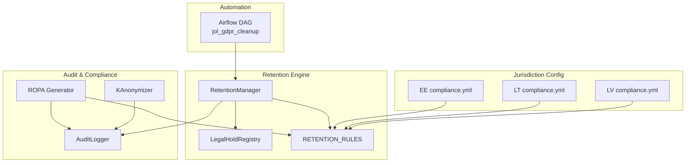
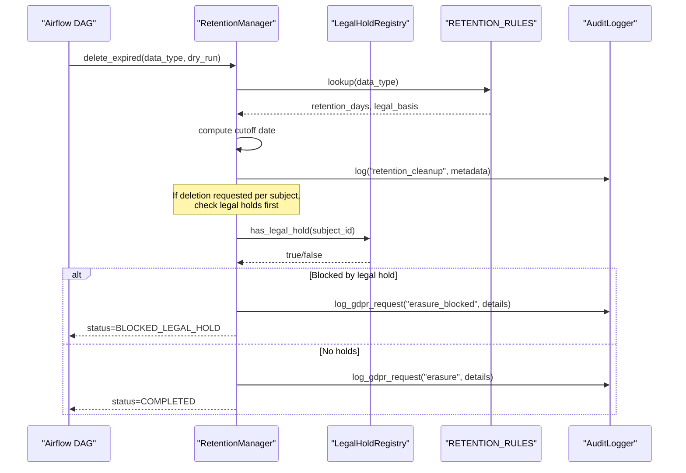
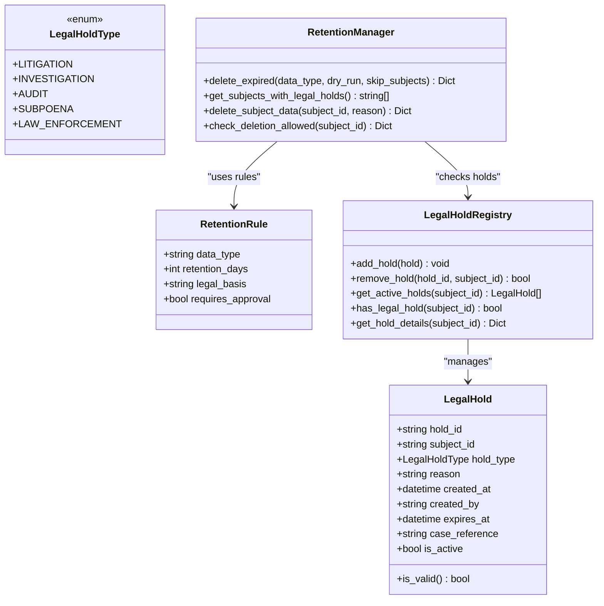
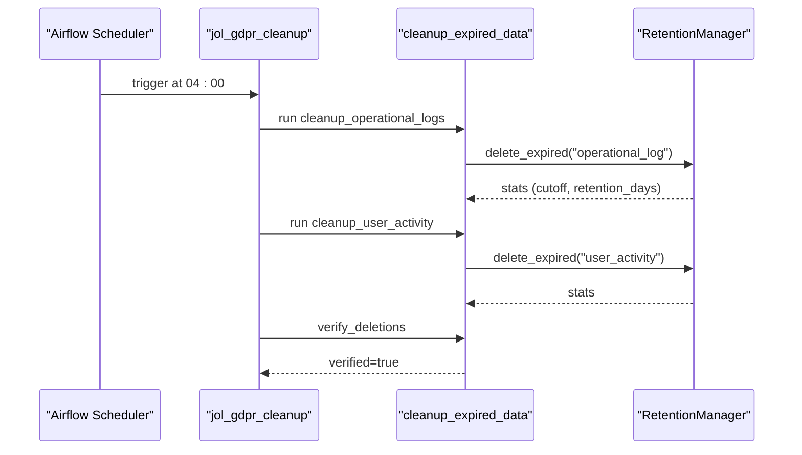
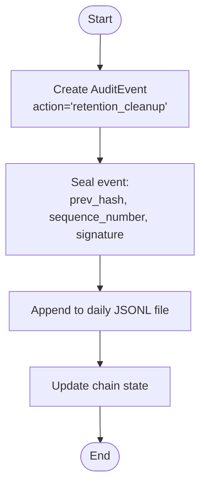
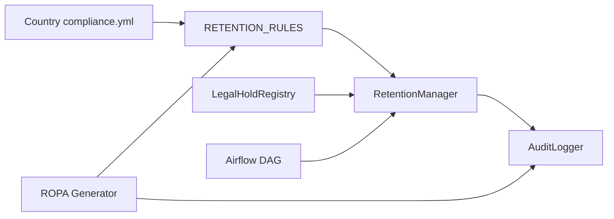

# Retention Policy Management

<cite>
**Referenced Files in This Document**
- [retention_manager.py](file://data/src/gdpr/retention_manager.py)
- [audit.py](file://data/src/audit.py)
- [anonymizer.py](file://data/src/gdpr/anonymizer.py)
- [entity_ropa.py](file://data/src/gdpr/entity_ropa.py)
- [ropa_generator.py](file://data/src/gdpr/ropa_generator.py)
- [config.py](file://data/src/config.py)
- [compliance.yml (Estonia)](file://countries/ee/config/compliance.yml)
- [compliance.yml (Lithuania)](file://countries/lt/config/compliance.yml)
- [compliance.yml (Latvia)](file://countries/lv/config/compliance.yml)
- [jol_gdpr_cleanup.py](file://data/airflow/dags/jol_gdpr_cleanup.py)
- [test_gdpr.py](file://data/tests/test_gdpr.py)
</cite>

## Table of Contents
1. Introduction
2. Project Structure
3. Core Components
4. Architecture Overview
5. Detailed Component Analysis
6. Dependency Analysis
7. Performance Considerations
8. Troubleshooting Guide
9. Conclusion
10. Appendices

## Introduction
This document explains how automated retention policy management is implemented to comply with GDPR Article 5(1)(e) storage limitation principle. It covers:
- How retention periods are configured per data type and jurisdiction
- Automated deletion workflows and scheduling
- Audit logging for all retention actions
- Exception handling for legal holds that block deletion
- Examples for configuring retention policies for user profiles, donation records, and analytics data

The system combines a configurable retention engine, an immutable audit log chain, k-anonymization for analytics, and Airflow-based automation to ensure data is retained only as long as legally required.

## Project Structure
Retention-related functionality spans several modules:
- Retention rules and enforcement live in the GDPR module
- Jurisdiction-specific retention periods and exceptions are defined in country compliance configs
- Automated cleanup runs via Airflow DAGs
- Audit logging ensures tamper-evident records of all retention actions
- ROPA generation documents processing activities and their retention periods

**Diagram sources**
- [retention_manager.py:188-336](file://data/src/gdpr/retention_manager.py#L188-L336)
- [audit.py:205-369](file://data/src/audit.py#L205-L369)
- [entity_ropa.py:39-65](file://data/src/gdpr/entity_ropa.py#L39-L65)
- [ropa_generator.py:103-169](file://data/src/gdpr/ropa_generator.py#L103-L169)
- [anonymizer.py:106-180](file://data/src/gdpr/anonymizer.py#L106-L180)
- [compliance.yml (Estonia):137-147](file://countries/ee/config/compliance.yml#L137-L147)
- [compliance.yml (Lithuania):137-147](file://countries/lt/config/compliance.yml#L137-L147)
- [compliance.yml (Latvia):137-147](file://countries/lv/config/compliance.yml#L137-L147)
- [jol_gdpr_cleanup.py:21-68](file://data/airflow/dags/jol_gdpr_cleanup.py#L21-L68)

**Section sources**
- [retention_manager.py:188-336](file://data/src/gdpr/retention_manager.py#L188-L336)
- [audit.py:205-369](file://data/src/audit.py#L205-L369)
- [entity_ropa.py:39-65](file://data/src/gdpr/entity_ropa.py#L39-L65)
- [ropa_generator.py:103-169](file://data/src/gdpr/ropa_generator.py#L103-L169)
- [anonymizer.py:106-180](file://data/src/gdpr/anonymizer.py#L106-L180)
- [compliance.yml (Estonia):137-147](file://countries/ee/config/compliance.yml#L137-L147)
- [compliance.yml (Lithuania):137-147](file://countries/lt/config/compliance.yml#L137-L147)
- [compliance.yml (Latvia):137-147](file://countries/lv/config/compliance.yml#L137-L147)
- [jol_gdpr_cleanup.py:21-68](file://data/airflow/dags/jol_gdpr_cleanup.py#L21-L68)

## Core Components
- RetentionManager: Orchestrates deletion based on retention rules, checks legal holds, logs actions, and supports dry-run mode.
- LegalHoldRegistry: Tracks active legal holds by subject; blocks deletion when holds exist.
- RETENTION_RULES: Centralized mapping of data types to retention days and legal basis.
- AuditLogger: Immutable, hash-chained audit log with HMAC signatures for integrity verification.
- KAnonymizer: Provides k-anonymity thresholds per country and anonymizes identifiers for analytics.
- ROPA Generator: Documents processing activities, including retention periods and security measures.
- Country Compliance Configs: Define jurisdiction-specific retention periods and exceptions (e.g., canonical records).

Key responsibilities:
- Enforce storage limitation by deleting data past its retention period
- Respect legal holds and canonical record exceptions
- Log every retention action immutably
- Support jurisdictional overrides where applicable

**Section sources**
- [retention_manager.py:21-106](file://data/src/gdpr/retention_manager.py#L21-L106)
- [retention_manager.py:109-186](file://data/src/gdpr/retention_manager.py#L109-L186)
- [retention_manager.py:188-336](file://data/src/gdpr/retention_manager.py#L188-L336)
- [audit.py:205-369](file://data/src/audit.py#L205-L369)
- [anonymizer.py:25-83](file://data/src/gdpr/anonymizer.py#L25-L83)
- [entity_ropa.py:39-65](file://data/src/gdpr/entity_ropa.py#L39-L65)
- [ropa_generator.py:19-42](file://data/src/gdpr/ropa_generator.py#L19-L42)
- [compliance.yml (Estonia):137-147](file://countries/ee/config/compliance.yml#L137-L147)
- [compliance.yml (Lithuania):137-147](file://countries/lt/config/compliance.yml#L137-L147)
- [compliance.yml (Latvia):137-147](file://countries/lv/config/compliance.yml#L137-L147)

## Architecture Overview
The retention architecture integrates configuration, enforcement, automation, and auditability:

**Diagram sources**
- [retention_manager.py:206-336](file://data/src/gdpr/retention_manager.py#L206-L336)
- [audit.py:391-407](file://data/src/audit.py#L391-L407)
- [jol_gdpr_cleanup.py:21-68](file://data/airflow/dags/jol_gdpr_cleanup.py#L21-L68)

## Detailed Component Analysis

### Retention Rules and Enforcement
- Data types supported include donations, user accounts, user activity, audit logs, and operational logs.
- Each rule defines retention_days and legal_basis aligned with GDPR and national laws.
- Deletion logic computes a cutoff date and prepares stats for audit logging.
- Subject-level deletion checks for active legal holds before proceeding.

**Diagram sources**
- [retention_manager.py:21-106](file://data/src/gdpr/retention_manager.py#L21-L106)
- [retention_manager.py:109-186](file://data/src/gdpr/retention_manager.py#L109-L186)
- [retention_manager.py:188-336](file://data/src/gdpr/retention_manager.py#L188-L336)

**Section sources**
- [retention_manager.py:78-106](file://data/src/gdpr/retention_manager.py#L78-L106)
- [retention_manager.py:206-336](file://data/src/gdpr/retention_manager.py#L206-L336)

### Jurisdiction-Specific Retention Periods
Country configurations define retention periods and exceptions:
- Sacramental records: permanent retention under Canon Law
- Donation records: 7 years (tax law)
- Financial records: 10 years (national tax law)
- Funeral/cemetery records: 75 years
- Website analytics: 26 months (GDPR best practice)
- Email marketing and consent records: 36 months

These values inform retention rules and ROPA documentation.

**Section sources**
- [compliance.yml (Estonia):137-147](file://countries/ee/config/compliance.yml#L137-L147)
- [compliance.yml (Lithuania):137-147](file://countries/lt/config/compliance.yml#L137-L147)
- [compliance.yml (Latvia):137-147](file://countries/lv/config/compliance.yml#L137-L147)

### Automated Cleanup Workflows
Airflow DAG schedules daily cleanup tasks:
- Cleans operational logs and user activity
- Invokes RetentionManager.delete_expired per data type
- Verifies completion

**Diagram sources**
- [jol_gdpr_cleanup.py:21-68](file://data/airflow/dags/jol_gdpr_cleanup.py#L21-L68)
- [retention_manager.py:206-246](file://data/src/gdpr/retention_manager.py#L206-L246)

**Section sources**
- [jol_gdpr_cleanup.py:21-68](file://data/airflow/dags/jol_gdpr_cleanup.py#L21-L68)

### Audit Logging for Retention Actions
All retention actions are recorded with:
- Immutable hash chain linking events
- HMAC signatures for tamper detection
- Sequence numbers for ordering verification
- Structured metadata including data type, cutoff dates, and results

**Diagram sources**
- [audit.py:330-369](file://data/src/audit.py#L330-L369)

**Section sources**
- [audit.py:205-369](file://data/src/audit.py#L205-L369)

### Anonymization for Analytics
Analytics data uses k-anonymity with country-specific thresholds:
- Default EU k=5; stricter countries use higher k
- Direct identifiers hashed; counts rounded to nearest k
- Ensures analytics do not retain personal data longer than necessary

**Section sources**
- [anonymizer.py:25-83](file://data/src/gdpr/anonymizer.py#L25-L83)
- [anonymizer.py:106-180](file://data/src/gdpr/anonymizer.py#L106-L180)

### Records of Processing Activities (ROPA)
ROPA generator documents each processing activity with:
- Purpose, legal basis, data categories, subjects, recipients
- Retention periods and security measures
- Sensitive data flags for religious or special category data

Entity-specific activities include donation processing, user account management, and analytics reporting.

**Section sources**
- [ropa_generator.py:19-42](file://data/src/gdpr/ropa_generator.py#L19-L42)
- [ropa_generator.py:45-100](file://data/src/gdpr/ropa_generator.py#L45-L100)
- [entity_ropa.py:39-65](file://data/src/gdpr/entity_ropa.py#L39-L65)

## Dependency Analysis
Retention components depend on:
- RETENTION_RULES for data-type-specific durations and legal basis
- LegalHoldRegistry to enforce legal hold exceptions
- AuditLogger for immutable logging
- Country compliance configs for jurisdictional overrides
- Airflow DAG for scheduling and orchestration

**Diagram sources**
- [retention_manager.py:78-106](file://data/src/gdpr/retention_manager.py#L78-L106)
- [retention_manager.py:109-186](file://data/src/gdpr/retention_manager.py#L109-L186)
- [retention_manager.py:188-336](file://data/src/gdpr/retention_manager.py#L188-L336)
- [audit.py:205-369](file://data/src/audit.py#L205-L369)
- [compliance.yml (Estonia):137-147](file://countries/ee/config/compliance.yml#L137-L147)
- [compliance.yml (Lithuania):137-147](file://countries/lt/config/compliance.yml#L137-L147)
- [compliance.yml (Latvia):137-147](file://countries/lv/config/compliance.yml#L137-L147)
- [jol_gdpr_cleanup.py:21-68](file://data/airflow/dags/jol_gdpr_cleanup.py#L21-L68)
- [entity_ropa.py:39-65](file://data/src/gdpr/entity_ropa.py#L39-L65)
- [ropa_generator.py:103-169](file://data/src/gdpr/ropa_generator.py#L103-L169)

**Section sources**
- [retention_manager.py:78-106](file://data/src/gdpr/retention_manager.py#L78-L106)
- [retention_manager.py:109-186](file://data/src/gdpr/retention_manager.py#L109-L186)
- [retention_manager.py:188-336](file://data/src/gdpr/retention_manager.py#L188-L336)
- [audit.py:205-369](file://data/src/audit.py#L205-L369)
- [compliance.yml (Estonia):137-147](file://countries/ee/config/compliance.yml#L137-L147)
- [compliance.yml (Lithuania):137-147](file://countries/lt/config/compliance.yml#L137-L147)
- [compliance.yml (Latvia):137-147](file://countries/lv/config/compliance.yml#L137-L147)
- [jol_gdpr_cleanup.py:21-68](file://data/airflow/dags/jol_gdpr_cleanup.py#L21-L68)
- [entity_ropa.py:39-65](file://data/src/gdpr/entity_ropa.py#L39-L65)
- [ropa_generator.py:103-169](file://data/src/gdpr/ropa_generator.py#L103-L169)

## Performance Considerations
- Batch operations: Use dry_run mode to preview deletions before executing
- Cutoff computation: Efficiently calculate retention cutoff using timedelta
- Audit logging: Append-only JSONL files minimize overhead and preserve integrity
- Legal hold checks: Fast in-memory registry lookup prevents unnecessary deletions
- K-anonymity: Grouping and counting are linear in dataset size; tune k per jurisdiction

[No sources needed since this section provides general guidance]

## Troubleshooting Guide
Common issues and resolutions:
- Missing retention rule: Ensure data_type exists in RETENTION_RULES; otherwise, add a rule with appropriate retention_days and legal_basis
- Legal hold blocking deletion: Check LegalHoldRegistry for active holds; lift holds when appropriate
- Audit chain integrity: Use chain verification to detect tampering or gaps; investigate if issues are reported
- Airflow task failures: Verify DAG schedule and Python callable parameters; inspect logs for errors

**Section sources**
- [retention_manager.py:206-246](file://data/src/gdpr/retention_manager.py#L206-L246)
- [retention_manager.py:248-336](file://data/src/gdpr/retention_manager.py#L248-L336)
- [audit.py:513-589](file://data/src/audit.py#L513-L589)
- [jol_gdpr_cleanup.py:21-68](file://data/airflow/dags/jol_gdpr_cleanup.py#L21-L68)

## Conclusion
The retention policy management system enforces GDPR storage limitation through configurable rules, jurisdiction-aware settings, automated cleanup, robust legal hold handling, and immutable audit logging. It supports diverse data categories such as donations, user accounts, and analytics, while respecting canonical record exceptions and national legal requirements.

[No sources needed since this section summarizes without analyzing specific files]

## Appendices

### Example: Setting Up Retention Policies by Data Category
- User profiles (user_account): 2-year retention based on GDPR Art. 5(1)(e); cleaned up via Airflow tasks
- Donation records: 7-year retention aligned with tax law; documented in ROPA and country configs
- Analytics data: Short retention (90 days) with k-anonymization; pseudonymized identifiers

Configuration references:
- Retention rules and enforcement: [retention_manager.py:78-106](file://data/src/gdpr/retention_manager.py#L78-L106), [retention_manager.py:206-336](file://data/src/gdpr/retention_manager.py#L206-L336)
- Jurisdiction retention periods: [compliance.yml (Estonia):137-147](file://countries/ee/config/compliance.yml#L137-L147), [compliance.yml (Lithuania):137-147](file://countries/lt/config/compliance.yml#L137-L147), [compliance.yml (Latvia):137-147](file://countries/lv/config/compliance.yml#L137-L147)
- Automation: [jol_gdpr_cleanup.py:21-68](file://data/airflow/dags/jol_gdpr_cleanup.py#L21-L68)
- Audit logging: [audit.py:205-369](file://data/src/audit.py#L205-L369)
- Analytics anonymization: [anonymizer.py:25-83](file://data/src/gdpr/anonymizer.py#L25-L83), [anonymizer.py:106-180](file://data/src/gdpr/anonymizer.py#L106-L180)
- ROPA documentation: [ropa_generator.py:45-100](file://data/src/gdpr/ropa_generator.py#L45-L100), [entity_ropa.py:39-65](file://data/src/gdpr/entity_ropa.py#L39-L65)

**Section sources**
- [retention_manager.py:78-106](file://data/src/gdpr/retention_manager.py#L78-L106)
- [retention_manager.py:206-336](file://data/src/gdpr/retention_manager.py#L206-L336)
- [compliance.yml (Estonia):137-147](file://countries/ee/config/compliance.yml#L137-L147)
- [compliance.yml (Lithuania):137-147](file://countries/lt/config/compliance.yml#L137-L147)
- [compliance.yml (Latvia):137-147](file://countries/lv/config/compliance.yml#L137-L147)
- [jol_gdpr_cleanup.py:21-68](file://data/airflow/dags/jol_gdpr_cleanup.py#L21-L68)
- [audit.py:205-369](file://data/src/audit.py#L205-L369)
- [anonymizer.py:25-83](file://data/src/gdpr/anonymizer.py#L25-L83)
- [anonymizer.py:106-180](file://data/src/gdpr/anonymizer.py#L106-L180)
- [ropa_generator.py:45-100](file://data/src/gdpr/ropa_generator.py#L45-L100)
- [entity_ropa.py:39-65](file://data/src/gdpr/entity_ropa.py#L39-L65)