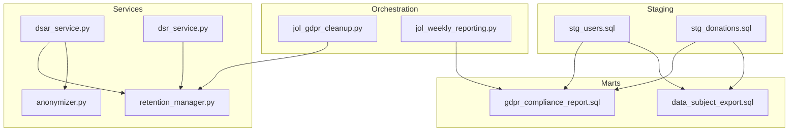
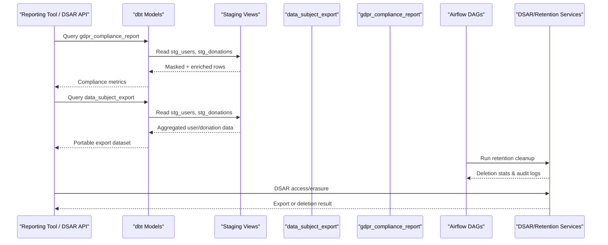
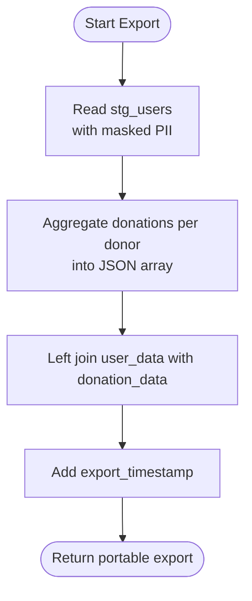
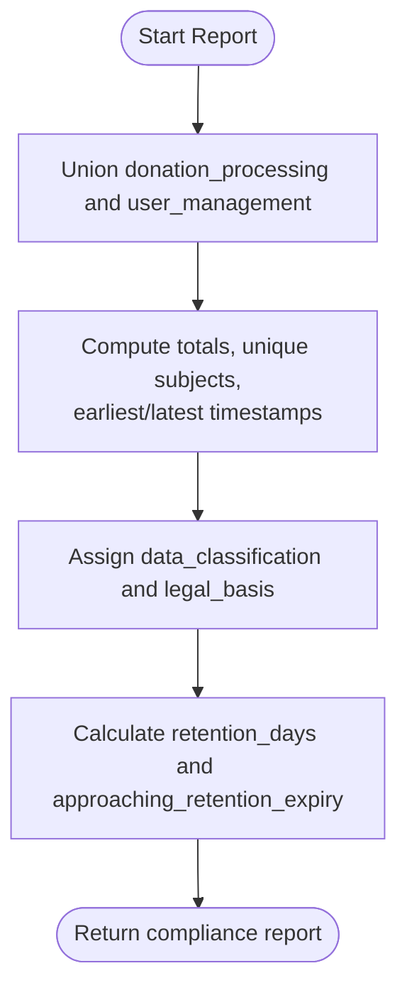
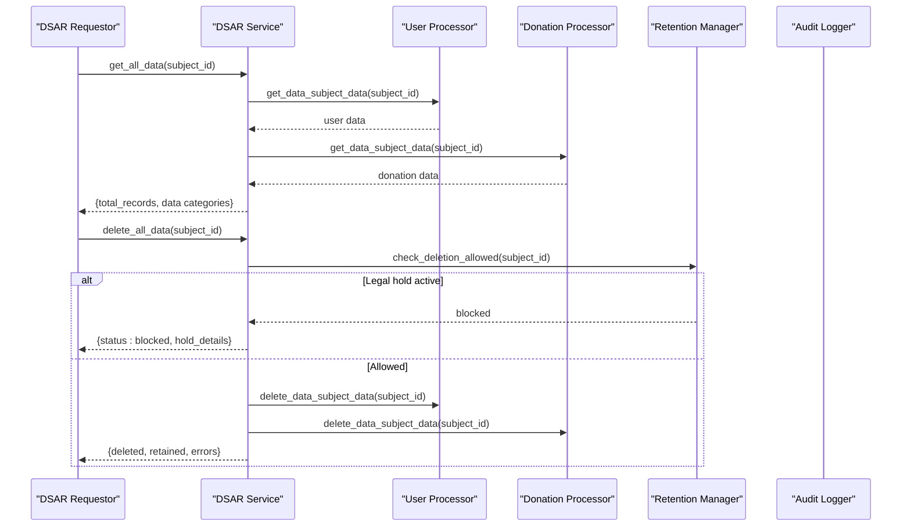
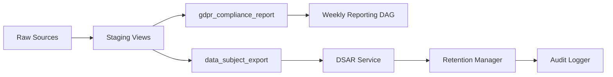

# Business Intelligence Marts

<cite>
**Referenced Files in This Document**
- [data_subject_export.sql](file://data/dbt/models/marts/data_subject_export.sql)
- [gdpr_compliance_report.sql](file://data/dbt/models/marts/gdpr_compliance_report.sql)
- [stg_users.sql](file://data/dbt/models/staging/stg_users.sql)
- [stg_donations.sql](file://data/dbt/models/staging/stg_donations.sql)
- [schema.yml](file://data/dbt/models/staging/schema.yml)
- [anonymizer.py](file://data/src/gdpr/anonymizer.py)
- [retention_manager.py](file://data/src/gdpr/retention_manager.py)
- [dsar_service.py](file://data/src/dsar_service.py)
- [dsr_service.py](file://backend/django/apps/core/dsr_service.py)
- [jol_gdpr_cleanup.py](file://data/airflow/dags/jol_gdpr_cleanup.py)
- [jol_weekly_reporting.py](file://data/airflow/dags/jol_weekly_reporting.py)
- [gdpr_compliance.sql](file://data/sql/audit_queries/gdpr_compliance.sql)
</cite>

## Table of Contents
1. [Introduction](#introduction)
2. [Project Structure](#project-structure)
3. [Core Components](#core-components)
4. [Architecture Overview](#architecture-overview)
5. [Detailed Component Analysis](#detailed-component-analysis)
6. [Dependency Analysis](#dependency-analysis)
7. [Performance Considerations](#performance-considerations)
8. [Troubleshooting Guide](#troubleshooting-guide)
9. [Conclusion](#conclusion)
10. [Appendices](#appendices)

## Introduction
This document explains the business intelligence marts layer focused on GDPR-specific analytical models that support compliance reporting and data subject rights. It covers:
- The data_subject_export model for generating comprehensive user data exports (GDPR Art. 20 - Right to Data Portability).
- The gdpr_compliance_report model for regulatory compliance metrics (GDPR Art. 30 - Records of Processing Activities).
It also describes the underlying staging layer, privacy controls, retention logic, orchestration, and integration points with external reporting tools.

## Project Structure
The marts layer is implemented using dbt and sits above a staging layer that normalizes raw operational data with GDPR-aware transformations. Orchestration via Airflow schedules cleanup and reporting tasks, while Python services implement DSAR workflows, anonymization, and retention enforcement.

**Diagram sources**
- [data_subject_export.sql:1-55](file://data/dbt/models/marts/data_subject_export.sql#L1-L55)
- [gdpr_compliance_report.sql:1-68](file://data/dbt/models/marts/gdpr_compliance_report.sql#L1-L68)
- [stg_users.sql:1-50](file://data/dbt/models/staging/stg_users.sql#L1-L50)
- [stg_donations.sql:1-36](file://data/dbt/models/staging/stg_donations.sql#L1-L36)
- [jol_gdpr_cleanup.py:1-68](file://data/airflow/dags/jol_gdpr_cleanup.py#L1-L68)
- [jol_weekly_reporting.py:1-78](file://data/airflow/dags/jol_weekly_reporting.py#L1-L78)
- [dsar_service.py:1-303](file://data/src/dsar_service.py#L1-L303)
- [dsr_service.py:1-496](file://backend/django/apps/core/dsr_service.py#L1-L496)
- [anonymizer.py:1-180](file://data/src/gdpr/anonymizer.py#L1-L180)
- [retention_manager.py:1-336](file://data/src/gdpr/retention_manager.py#L1-L336)

**Section sources**
- [data_subject_export.sql:1-55](file://data/dbt/models/marts/data_subject_export.sql#L1-L55)
- [gdpr_compliance_report.sql:1-68](file://data/dbt/models/marts/gdpr_compliance_report.sql#L1-L68)
- [stg_users.sql:1-50](file://data/dbt/models/staging/stg_users.sql#L1-L50)
- [stg_donations.sql:1-36](file://data/dbt/models/staging/stg_donations.sql#L1-L36)
- [schema.yml:1-48](file://data/dbt/models/staging/schema.yml#L1-L48)
- [jol_gdpr_cleanup.py:1-68](file://data/airflow/dags/jol_gdpr_cleanup.py#L1-L68)
- [jol_weekly_reporting.py:1-78](file://data/airflow/dags/jol_weekly_reporting.py#L1-L78)
- [dsar_service.py:1-303](file://data/src/dsar_service.py#L1-L303)
- [dsr_service.py:1-496](file://backend/django/apps/core/dsr_service.py#L1-L496)
- [anonymizer.py:1-180](file://data/src/gdpr/anonymizer.py#L1-L180)
- [retention_manager.py:1-336](file://data/src/gdpr/retention_manager.py#L1-L336)

## Core Components
- data_subject_export: Aggregates all personal data for a specific data subject across users and donations, producing a portable export payload suitable for GDPR Art. 20 requests.
- gdpr_compliance_report: Computes processing activity metrics, legal basis, retention windows, and alerts for records approaching retention expiry, supporting GDPR Art. 30 reporting.
- Staging views: Apply privacy-preserving transformations (e.g., masking PII), add data classification and retention expiry fields, and enforce source-level filters.
- Services and orchestration: DSAR service coordinates access and erasure; retention manager enforces deletion rules and legal holds; anonymizer provides k-anonymity; Airflow DAGs schedule cleanup and reporting.

**Section sources**
- [data_subject_export.sql:10-55](file://data/dbt/models/marts/data_subject_export.sql#L10-L55)
- [gdpr_compliance_report.sql:10-68](file://data/dbt/models/marts/gdpr_compliance_report.sql#L10-L68)
- [stg_users.sql:10-50](file://data/dbt/models/staging/stg_users.sql#L10-L50)
- [stg_donations.sql:10-36](file://data/dbt/models/staging/stg_donations.sql#L10-L36)
- [dsar_service.py:59-157](file://data/src/dsar_service.py#L59-L157)
- [retention_manager.py:188-336](file://data/src/gdpr/retention_manager.py#L188-L336)
- [anonymizer.py:106-180](file://data/src/gdpr/anonymizer.py#L106-L180)
- [jol_gdpr_cleanup.py:21-68](file://data/airflow/dags/jol_gdpr_cleanup.py#L21-L68)
- [jol_weekly_reporting.py:20-78](file://data/airflow/dags/jol_weekly_reporting.py#L20-L78)

## Architecture Overview
The marts are built on top of staging views that normalize and mask sensitive fields. The data_subject_export mart joins user and donation aggregates to produce a single export per subject. The gdpr_compliance_report mart unions processing activities from multiple sources and computes retention status. Airflow orchestrates periodic cleanup and reporting, while Python services handle DSAR flows and enforce retention and legal holds.

**Diagram sources**
- [gdpr_compliance_report.sql:10-68](file://data/dbt/models/marts/gdpr_compliance_report.sql#L10-L68)
- [data_subject_export.sql:13-55](file://data/dbt/models/marts/data_subject_export.sql#L13-L55)
- [stg_users.sql:10-50](file://data/dbt/models/staging/stg_users.sql#L10-L50)
- [stg_donations.sql:10-36](file://data/dbt/models/staging/stg_donations.sql#L10-L36)
- [jol_gdpr_cleanup.py:21-68](file://data/airflow/dags/jol_gdpr_cleanup.py#L21-L68)
- [dsar_service.py:88-157](file://data/src/dsar_service.py#L88-L157)
- [retention_manager.py:206-336](file://data/src/gdpr/retention_manager.py#L206-L336)

## Detailed Component Analysis

### data_subject_export Model
Purpose:
- Implements GDPR Art. 20 by aggregating all personal data for a given data subject into a portable format.
- Joins normalized user data with aggregated donation history per donor.

Key logic:
- User data includes identifiers, organization context, role, account creation time, and consent flags.
- Donation data is aggregated into a JSON array containing donation details per donor.
- Left join ensures subjects without donations still receive an empty donations array.
- Adds an export timestamp for traceability.

Privacy and controls:
- Sensitive fields are masked at the staging layer based on variables controlling PII inclusion.
- Data classification is set to confidential in staging for downstream governance.

Query patterns:
- Filter by user_id to retrieve a complete export for a specific subject.
- Use export_timestamp to track when the export was generated.

Performance considerations:
- Aggregation occurs at the mart level; ensure indexes on donor_id and user id for efficient joins.
- Consider materializing intermediate aggregation if datasets grow large.

Integration:
- Export results can be consumed by DSAR workflows and exported to secure storage for delivery to data subjects.

**Diagram sources**
- [data_subject_export.sql:13-55](file://data/dbt/models/marts/data_subject_export.sql#L13-L55)
- [stg_users.sql:10-50](file://data/dbt/models/staging/stg_users.sql#L10-L50)
- [stg_donations.sql:10-36](file://data/dbt/models/staging/stg_donations.sql#L10-L36)

**Section sources**
- [data_subject_export.sql:1-55](file://data/dbt/models/marts/data_subject_export.sql#L1-L55)
- [stg_users.sql:1-50](file://data/dbt/models/staging/stg_users.sql#L1-L50)
- [stg_donations.sql:1-36](file://data/dbt/models/staging/stg_donations.sql#L1-L36)

### gdpr_compliance_report Model
Purpose:
- Provides compliance metrics for GDPR Art. 30 by summarizing processing activities, legal basis, and retention status.

Key logic:
- Unions processing activities from donations and user management.
- Computes counts of total records processed and unique data subjects.
- Captures earliest and latest record timestamps per activity.
- Assigns data classification and legal basis per activity type.
- Calculates retention_days per activity and flags records approaching retention expiry within a configurable window.

Query patterns:
- Filter by activity_name to focus on specific processing types.
- Use approaching_retention_expiry to trigger remediation workflows.

Performance considerations:
- Materialized table enables fast reporting queries; consider incremental builds if source volumes increase.
- Ensure indexes on created_at and donor_id/id for efficient min/max computations.

Integration:
- Feeds dashboards and compliance scorecards; can be queried by weekly reporting DAGs.

**Diagram sources**
- [gdpr_compliance_report.sql:10-68](file://data/dbt/models/marts/gdpr_compliance_report.sql#L10-L68)
- [stg_donations.sql:10-36](file://data/dbt/models/staging/stg_donations.sql#L10-L36)
- [stg_users.sql:10-50](file://data/dbt/models/staging/stg_users.sql#L10-L50)

**Section sources**
- [gdpr_compliance_report.sql:1-68](file://data/dbt/models/marts/gdpr_compliance_report.sql#L1-L68)

### Staging Layer Privacy Controls
- stg_users masks emails and IP addresses unless explicitly enabled via variables; adds data_classification and retention_expiry based on configured days.
- stg_donations redacts payment references unless explicitly enabled; adds data_classification and retention_expiry based on financial retention policy.
- schema.yml defines source tables and column tests to ensure data quality and acceptable values for currency codes.

Privacy considerations:
- Default behavior excludes PII from analytics outputs; explicit opt-in required for sensitive fields.
- Retention expiry computed from configured policies supports automated lifecycle management.

**Section sources**
- [stg_users.sql:10-50](file://data/dbt/models/staging/stg_users.sql#L10-L50)
- [stg_donations.sql:10-36](file://data/dbt/models/staging/stg_donations.sql#L10-L36)
- [schema.yml:1-48](file://data/dbt/models/staging/schema.yml#L1-L48)

### DSAR and Retention Integration
- DSAR service coordinates access and erasure across processors, auditing each step and returning structured results including totals and exemptions.
- Retention manager enforces deletion rules, checks legal holds before any deletion, and logs outcomes for auditability.
- Django DSR service implements request lifecycle, status tracking, and exceptions for legal holds and canonical records.

Operational flow:
- Access requests gather data from processors and return machine-readable exports.
- Erasure requests check legal holds; if active, deletion is blocked and audited.
- Cleanup DAGs run scheduled retention deletions for operational logs and user activity.

**Diagram sources**
- [dsar_service.py:88-267](file://data/src/dsar_service.py#L88-L267)
- [retention_manager.py:206-336](file://data/src/gdpr/retention_manager.py#L206-L336)
- [dsr_service.py:194-252](file://backend/django/apps/core/dsr_service.py#L194-L252)

**Section sources**
- [dsar_service.py:1-303](file://data/src/dsar_service.py#L1-L303)
- [retention_manager.py:1-336](file://data/src/gdpr/retention_manager.py#L1-L336)
- [dsr_service.py:1-496](file://backend/django/apps/core/dsr_service.py#L1-L496)

### Anonymization and K-Anonymity
- Provides country-specific k-anonymity thresholds and utilities to anonymize direct identifiers and check group sizes against k.
- Useful for publishing aggregated analytics without re-identification risk.

Usage:
- Configure k-value per country or environment variable.
- Apply anonymization to quasi-identifiers and verify satisfaction of k-anonymity before publication.

**Section sources**
- [anonymizer.py:1-180](file://data/src/gdpr/anonymizer.py#L1-L180)

### Orchestration and Reporting
- jol_gdpr_cleanup.py schedules daily retention cleanup for operational logs and user activity, invoking retention manager functions.
- jol_weekly_reporting.py runs weekly analytics and generates compliance scorecards, integrating with ROPA generation.

**Section sources**
- [jol_gdpr_cleanup.py:1-68](file://data/airflow/dags/jol_gdpr_cleanup.py#L1-L68)
- [jol_weekly_reporting.py:1-78](file://data/airflow/dags/jol_weekly_reporting.py#L1-L78)

## Dependency Analysis
- Marts depend on staging views for normalized, privacy-controlled data.
- Staging depends on raw sources defined in schema.yml with quality tests.
- DSAR and retention services integrate with audit logging and may interact with Django models for request lifecycle.
- Airflow DAGs call retention manager and generate reports, feeding back into compliance monitoring.

**Diagram sources**
- [schema.yml:1-48](file://data/dbt/models/staging/schema.yml#L1-L48)
- [data_subject_export.sql:13-55](file://data/dbt/models/marts/data_subject_export.sql#L13-L55)
- [gdpr_compliance_report.sql:10-68](file://data/dbt/models/marts/gdpr_compliance_report.sql#L10-L68)
- [jol_weekly_reporting.py:20-78](file://data/airflow/dags/jol_weekly_reporting.py#L20-L78)
- [dsar_service.py:88-267](file://data/src/dsar_service.py#L88-L267)
- [retention_manager.py:206-336](file://data/src/gdpr/retention_manager.py#L206-L336)

**Section sources**
- [schema.yml:1-48](file://data/dbt/models/staging/schema.yml#L1-L48)
- [data_subject_export.sql:13-55](file://data/dbt/models/marts/data_subject_export.sql#L13-L55)
- [gdpr_compliance_report.sql:10-68](file://data/dbt/models/marts/gdpr_compliance_report.sql#L10-L68)
- [dsar_service.py:88-267](file://data/src/dsar_service.py#L88-L267)
- [retention_manager.py:206-336](file://data/src/gdpr/retention_manager.py#L206-L336)

## Performance Considerations
- Materialization strategy: Both marts are materialized as tables; evaluate incremental builds for high-volume sources.
- Indexing: Ensure indexes on foreign keys (donor_id, user id) and timestamps (created_at) to optimize aggregations and joins.
- Variable-driven masking: Avoid enabling PII inclusion in production to reduce exposure and query complexity.
- Retention calculations: Precompute retention_expiry in staging to avoid repeated interval arithmetic in marts.
- Aggregation scope: Limit export queries to specific subjects to minimize scan size; consider partitioning by organization or date ranges if needed.

[No sources needed since this section provides general guidance]

## Troubleshooting Guide
Common issues and resolutions:
- Missing or inconsistent PII masking: Verify staging variables include_pii and retention days; confirm schema tests pass for currency and uniqueness constraints.
- Excessive export latency: Check indexes on donor_id and user id; consider filtering by organization or date range; evaluate materialization strategies.
- Retention not enforced: Confirm legal holds are checked before deletion; review retention rules and scheduled DAG execution.
- Compliance report anomalies: Validate union logic for processing activities; ensure earliest/latest timestamps are computed correctly; check approaching_retention_expiry thresholds.

Useful audit queries:
- Retrieve processing activities for a subject to validate access requests.
- Inspect retention compliance status to identify overdue or on-hold records.
- Review GDPR request status summaries and audit log activity trends.

**Section sources**
- [schema.yml:1-48](file://data/dbt/models/staging/schema.yml#L1-L48)
- [gdpr_compliance.sql:1-66](file://data/sql/audit_queries/gdpr_compliance.sql#L1-L66)
- [retention_manager.py:206-336](file://data/src/gdpr/retention_manager.py#L206-L336)
- [jol_gdpr_cleanup.py:21-68](file://data/airflow/dags/jol_gdpr_cleanup.py#L21-L68)

## Conclusion
The marts layer delivers robust, privacy-first analytics for GDPR compliance and data subject rights:
- data_subject_export provides a comprehensive, portable export per subject, aligned with Art. 20.
- gdpr_compliance_report supplies actionable metrics for Art. 30, including retention alerts.
- Staging enforces PII masking and retention metadata; services and orchestration ensure lawful processing, deletion, and auditability.
Adopt the recommended performance optimizations and integrate with external reporting tools via the provided marts and scheduled DAGs.

[No sources needed since this section summarizes without analyzing specific files]

## Appendices

### Example Query Patterns
- Export for a specific subject:
  - Select from data_subject_export where user_id equals the target identifier; use export_timestamp to filter recent exports.
- Compliance metrics by activity:
  - Select from gdpr_compliance_report where activity_name equals 'donation_processing' or 'user_management'; filter approaching_retention_expiry to identify at-risk records.
- Audit trail for a subject:
  - Use audit queries to list actions, resources, actors, and timestamps for a subject_id.

**Section sources**
- [data_subject_export.sql:42-55](file://data/dbt/models/marts/data_subject_export.sql#L42-L55)
- [gdpr_compliance_report.sql:56-68](file://data/dbt/models/marts/gdpr_compliance_report.sql#L56-L68)
- [gdpr_compliance.sql:1-66](file://data/sql/audit_queries/gdpr_compliance.sql#L1-L66)

### Data Privacy and Access Controls
- Default masking of emails and IPs in staging; enable only when necessary via variables.
- Data classification set to confidential for sensitive datasets.
- Legal holds block erasure; always check before deletion and log outcomes.
- Anonymization utilities support safe publication of aggregated analytics.

**Section sources**
- [stg_users.sql:10-50](file://data/dbt/models/staging/stg_users.sql#L10-L50)
- [stg_donations.sql:10-36](file://data/dbt/models/staging/stg_donations.sql#L10-L36)
- [retention_manager.py:206-336](file://data/src/gdpr/retention_manager.py#L206-L336)
- [anonymizer.py:106-180](file://data/src/gdpr/anonymizer.py#L106-L180)