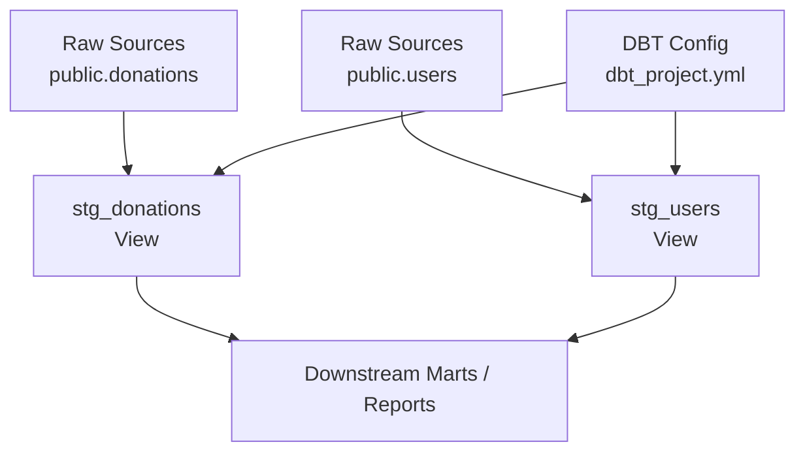
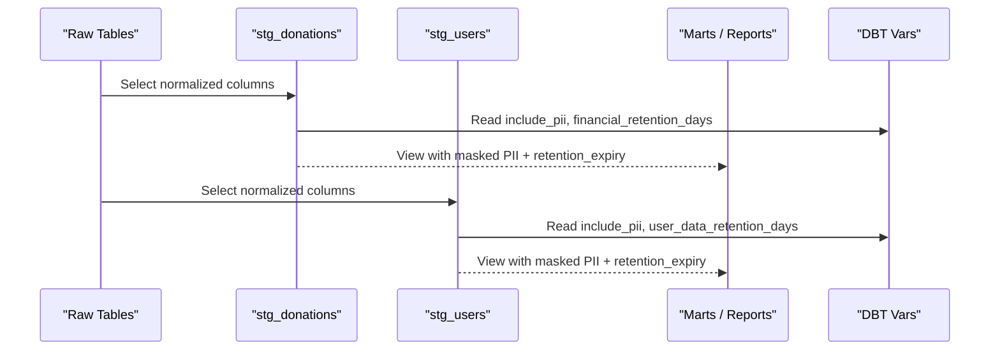
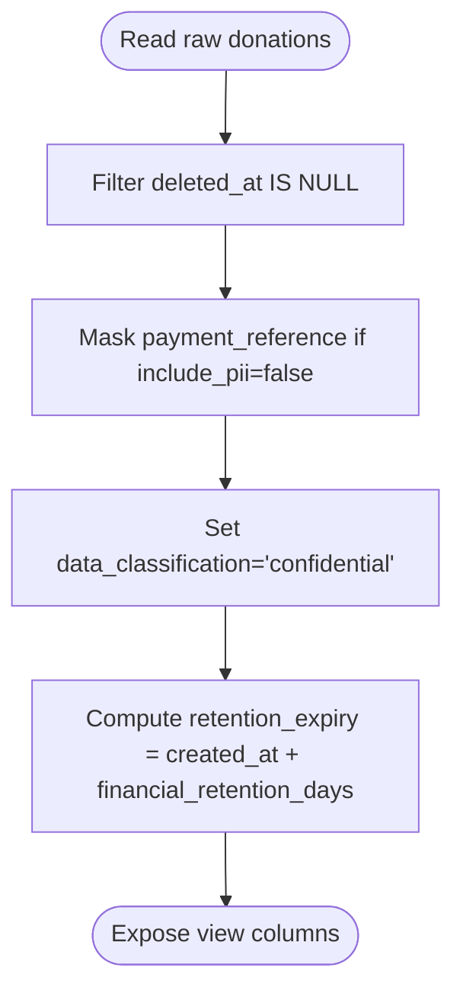
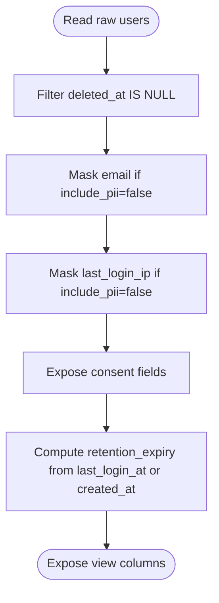
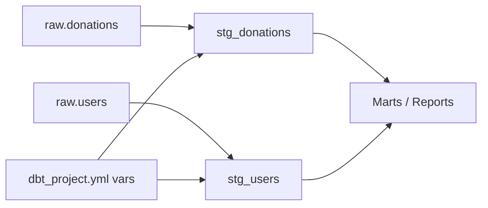
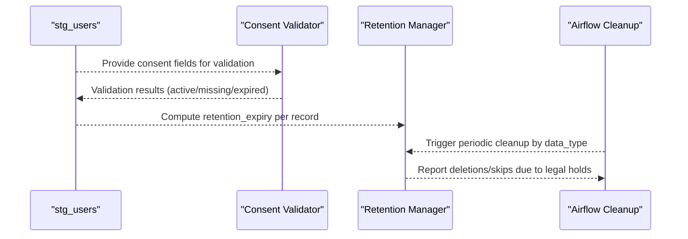

# Staging Models

<cite>
**Referenced Files in This Document**
- [stg_donations.sql](file://data/dbt/models/staging/stg_donations.sql)
- [stg_users.sql](file://data/dbt/models/staging/stg_users.sql)
- [schema.yml](file://data/dbt/models/staging/schema.yml)
- [dbt_project.yml](file://data/dbt/dbt_project.yml)
- [retention_manager.py](file://data/src/gdpr/retention_manager.py)
- [anonymizer.py](file://data/src/gdpr/anonymizer.py)
- [gdpr_consent_validation.py](file://data/src/quality/expectations/gdpr_consent_validation.py)
- [jol_gdpr_cleanup.py](file://data/airflow/dags/jol_gdpr_cleanup.py)
</cite>

## Table of Contents
1. [Introduction](#introduction)
2. [Project Structure](#project-structure)
3. [Core Components](#core-components)
4. [Architecture Overview](#architecture-overview)
5. [Detailed Component Analysis](#detailed-component-analysis)
6. [Dependency Analysis](#dependency-analysis)
7. [Performance Considerations](#performance-considerations)
8. [Troubleshooting Guide](#troubleshooting-guide)
9. [Conclusion](#conclusion)
10. [Appendices](#appendices)

## Introduction
This document explains the dbt staging models layer that normalizes raw data from source systems into clean, consistent formats suitable for downstream analytics and compliance reporting. It focuses on stg_donations and stg_users, detailing schema design patterns, transformation logic (type handling, nulls, standardization), and GDPR-related practices such as retention expiry calculation and consent tracking integration points. It also provides guidance for creating new staging models following established conventions.

## Project Structure
The staging layer resides under data/dbt/models/staging and is configured by data/dbt/dbt_project.yml. The staging models are materialized as views within a dedicated schema and tagged for governance and filtering.

**Diagram sources**
- [dbt_project.yml:33-43](file://data/dbt/dbt_project.yml#L33-L43)
- [stg_donations.sql:4-8](file://data/dbt/models/staging/stg_donations.sql#L4-L8)
- [stg_users.sql:4-8](file://data/dbt/models/staging/stg_users.sql#L4-L8)

**Section sources**
- [dbt_project.yml:1-44](file://data/dbt/dbt_project.yml#L1-L44)

## Core Components
- stg_donations: Normalizes donation records, masks sensitive payment references unless explicitly allowed, adds data classification and retention expiry based on configurable retention days, and filters out soft-deleted rows.
- stg_users: Normalizes user records, conditionally masks PII (email, IP) based on a variable flag, includes consent fields, adds data classification and retention expiry derived from last activity or creation time, and filters out soft-deleted rows.
- schema.yml: Declares source tables and column-level tests (uniqueness, not null, accepted values) to enforce quality at ingestion boundaries.

Key behaviors:
- Conditional PII exposure via a project variable.
- Retention expiry computed as a timestamp plus a configurable number of days.
- Data classification tag set to confidential for auditability.
- Soft-delete exclusion using a deleted_at filter.

**Section sources**
- [stg_donations.sql:10-35](file://data/dbt/models/staging/stg_donations.sql#L10-L35)
- [stg_users.sql:10-49](file://data/dbt/models/staging/stg_users.sql#L10-L49)
- [schema.yml:3-48](file://data/dbt/models/staging/schema.yml#L3-L48)

## Architecture Overview
Staging models act as a thin normalization layer over raw operational tables. They do not perform heavy aggregation; instead, they ensure consistent types, safe masking of sensitive fields, and add governance metadata (classification and retention). Downstream marts consume these stable views.

**Diagram sources**
- [stg_donations.sql:20-30](file://data/dbt/models/staging/stg_donations.sql#L20-L30)
- [stg_users.sql:14-44](file://data/dbt/models/staging/stg_users.sql#L14-L44)
- [dbt_project.yml:22-26](file://data/dbt/dbt_project.yml#L22-L26)

## Detailed Component Analysis

### stg_donations
Purpose:
- Normalize donation records for downstream use.
- Mask payment_reference unless include_pii is enabled.
- Add data_classification and retention_expiry based on financial_retention_days.
- Exclude soft-deleted donations.

Transformation highlights:
- Conditional masking of payment_reference using a project variable.
- Computation of retention_expiry as created_at plus a configurable interval.
- Filtering where deleted_at is null.

Schema and quality:
- Source table public.donations declared with column tests for id, donor_id, amount, currency, including accepted_values for currency codes.

**Diagram sources**
- [stg_donations.sql:10-35](file://data/dbt/models/staging/stg_donations.sql#L10-L35)
- [schema.yml:8-29](file://data/dbt/models/staging/schema.yml#L8-L29)

**Section sources**
- [stg_donations.sql:1-36](file://data/dbt/models/staging/stg_donations.sql#L1-L36)
- [schema.yml:8-29](file://data/dbt/models/staging/schema.yml#L8-L29)

### stg_users
Purpose:
- Normalize user records for downstream use.
- Conditionally mask PII (email, last_login_ip) unless include_pii is enabled.
- Include consent fields and compute retention_expiry based on last activity or creation time.
- Exclude soft-deleted users.

Transformation highlights:
- Email masking preserves first two characters and domain suffix while hiding middle content when include_pii is false.
- IP masking replaces host portion with placeholder when include_pii is false.
- retention_expiry uses coalesced last_login_at or created_at plus user_data_retention_days.
- Consent fields exposed for downstream validation and reporting.

**Diagram sources**
- [stg_users.sql:10-49](file://data/dbt/models/staging/stg_users.sql#L10-L49)

**Section sources**
- [stg_users.sql:1-50](file://data/dbt/models/staging/stg_users.sql#L1-L50)

### Schema Design Patterns
- Source declarations with descriptive names and tests ensure early detection of anomalies.
- Currency acceptance list constrains valid codes to known ISO-like values.
- Primary keys and critical identifiers are enforced as unique and not null.
- Staging models are views to keep transformations lightweight and reproducible.

**Section sources**
- [schema.yml:3-48](file://data/dbt/models/staging/schema.yml#L3-L48)
- [dbt_project.yml:33-43](file://data/dbt/dbt_project.yml#L33-L43)

## Dependency Analysis
- Staging models depend on raw tables declared in schema.yml.
- Both models rely on DBT variables defined in dbt_project.yml for retention periods and PII toggling.
- Downstream consumers (marts/reports) depend on the stable column sets produced by staging.

**Diagram sources**
- [schema.yml:3-48](file://data/dbt/models/staging/schema.yml#L3-L48)
- [dbt_project.yml:22-43](file://data/dbt/dbt_project.yml#L22-L43)
- [stg_donations.sql:4-8](file://data/dbt/models/staging/stg_donations.sql#L4-L8)
- [stg_users.sql:4-8](file://data/dbt/models/staging/stg_users.sql#L4-L8)

**Section sources**
- [dbt_project.yml:22-43](file://data/dbt/dbt_project.yml#L22-L43)
- [schema.yml:3-48](file://data/dbt/models/staging/schema.yml#L3-L48)

## Performance Considerations
- Views minimize storage and ensure freshness; avoid heavy joins or aggregations in staging to preserve performance.
- Use selective filtering (e.g., deleted_at) to reduce row counts early.
- Keep conditional expressions simple and leverage DBT variables for branching behavior without duplicating logic.
- Ensure indexes exist on raw tables for frequently filtered columns (e.g., deleted_at, organization_id) outside dbt scope.

[No sources needed since this section provides general guidance]

## Troubleshooting Guide
Common issues and resolutions:
- Unexpected PII exposure: Verify include_pii variable is set to false in your environment; confirm masking logic paths in both models.
- Missing retention_expiry: Confirm retention variables (financial_retention_days, user_data_retention_days) are defined in dbt_project.yml and referenced correctly.
- Null or invalid currency: Check accepted_values test and upstream data quality; consider adding additional tests or mappings.
- Soft-deleted rows appearing: Ensure deleted_at filter is applied; validate raw data consistency.

Operational safeguards:
- Automated cleanup DAG enforces retention policies for logs and activity data, complementing staging-level retention calculations.
- Consent validation utilities can be used to verify consent completeness and expiration before downstream processing.

**Section sources**
- [jol_gdpr_cleanup.py:21-28](file://data/airflow/dags/jol_gdpr_cleanup.py#L21-L28)
- [gdpr_consent_validation.py:77-142](file://data/src/quality/expectations/gdpr_consent_validation.py#L77-L142)

## Conclusion
The staging layer provides a consistent, privacy-aware foundation for downstream analytics and compliance. By centralizing normalization, masking, classification, and retention calculations in stg_donations and stg_users, the system ensures reliable inputs for marts while maintaining strong GDPR controls. Adhering to the documented patterns will help maintain consistency, safety, and auditability as new models are added.

[No sources needed since this section summarizes without analyzing specific files]

## Appendices

### Creating New Staging Models: Guidelines
Follow these steps to create a new staging model aligned with existing patterns:
- Define source and columns in schema.yml with appropriate tests (unique, not_null, accepted_values).
- Create a SQL file under data/dbt/models/staging with:
  - Model config setting materialized=view, schema=staging, and relevant tags (e.g., gdpr).
  - A CTE to select and normalize columns from the raw source.
  - Conditional masking for any PII using the include_pii variable.
  - Data classification field set to confidential.
  - Retention expiry computed from a base timestamp plus a configurable interval.
  - A filter to exclude soft-deleted records.
- Reference DBT variables for retention periods and PII flags consistently.
- Add downstream tests or expectations as needed.

Reference patterns:
- Conditional masking and retention computation similar to stg_donations and stg_users.
- Source declaration and testing similar to schema.yml entries.

**Section sources**
- [stg_donations.sql:4-35](file://data/dbt/models/staging/stg_donations.sql#L4-L35)
- [stg_users.sql:4-49](file://data/dbt/models/staging/stg_users.sql#L4-L49)
- [schema.yml:3-48](file://data/dbt/models/staging/schema.yml#L3-L48)
- [dbt_project.yml:22-43](file://data/dbt/dbt_project.yml#L22-L43)

### GDPR Compliance Integration Points
- Retention management:
  - Staging computes retention_expiry per record for visibility and downstream scheduling.
  - RetentionManager defines rules and legal holds to prevent deletion when required.
  - Airflow DAG schedules automated cleanup tasks for logs and activity data.
- Consent tracking:
  - stg_users exposes consent fields for downstream validation.
  - Consent validator checks active, missing, and expired consents and reports compliance metrics.
- Anonymization:
  - K-anonymity utilities provide thresholds and hashing strategies for anonymized outputs downstream.

**Diagram sources**
- [stg_users.sql:33-44](file://data/dbt/models/staging/stg_users.sql#L33-L44)
- [gdpr_consent_validation.py:77-142](file://data/src/quality/expectations/gdpr_consent_validation.py#L77-L142)
- [retention_manager.py:78-106](file://data/src/gdpr/retention_manager.py#L78-L106)
- [jol_gdpr_cleanup.py:21-28](file://data/airflow/dags/jol_gdpr_cleanup.py#L21-L28)

**Section sources**
- [retention_manager.py:188-336](file://data/src/gdpr/retention_manager.py#L188-L336)
- [anonymizer.py:25-83](file://data/src/gdpr/anonymizer.py#L25-L83)
- [gdpr_consent_validation.py:15-72](file://data/src/quality/expectations/gdpr_consent_validation.py#L15-L72)
- [jol_gdpr_cleanup.py:36-67](file://data/airflow/dags/jol_gdpr_cleanup.py#L36-L67)