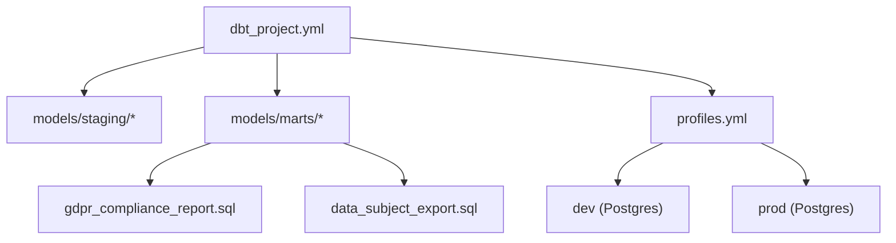
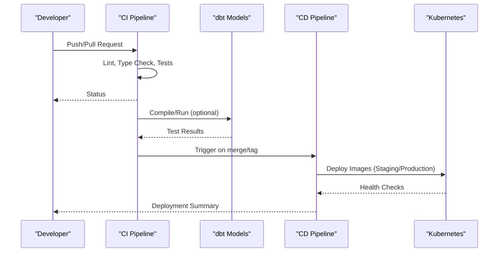
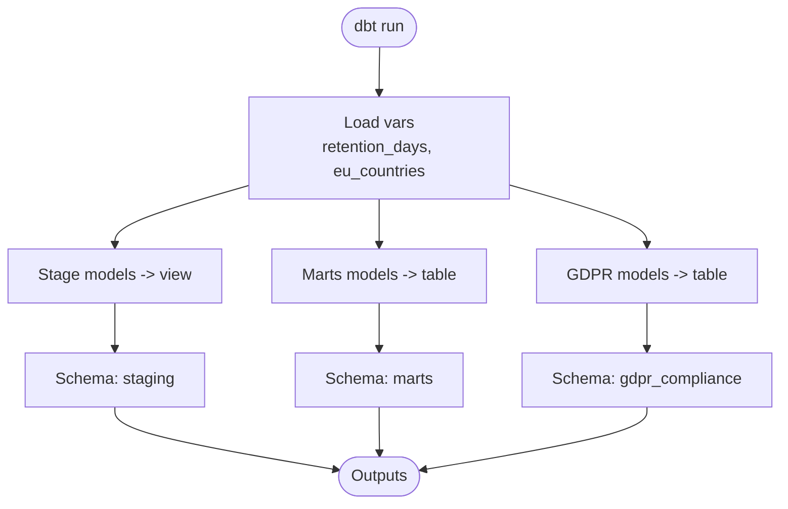
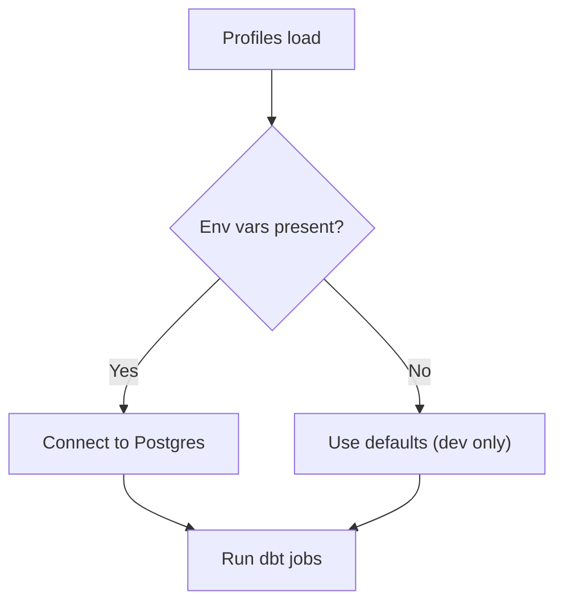
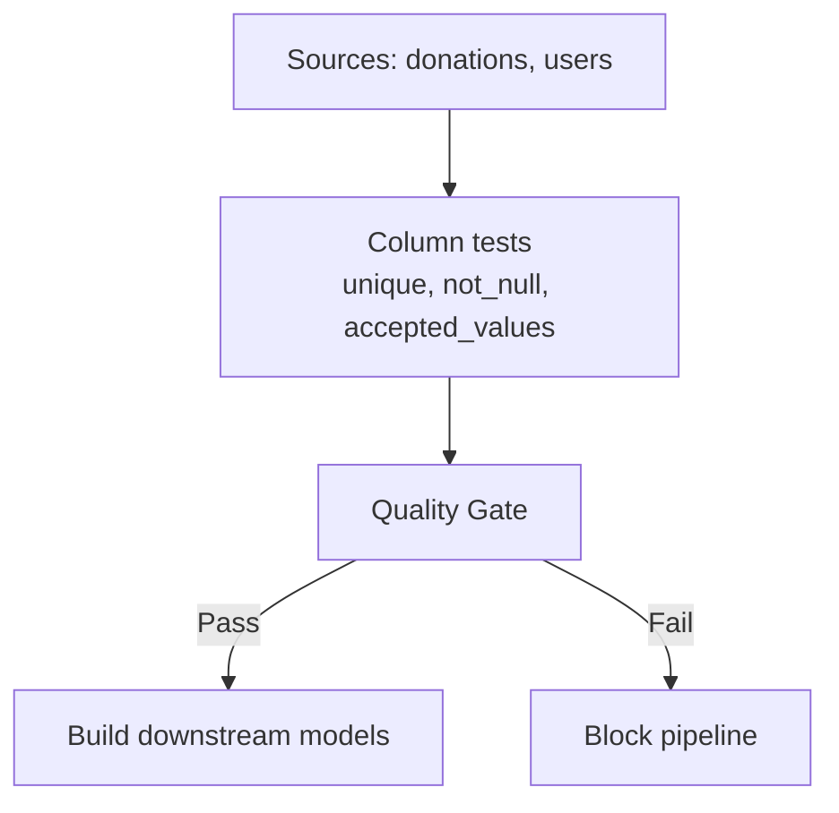
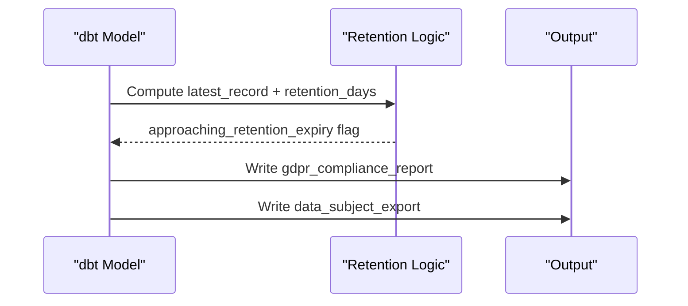
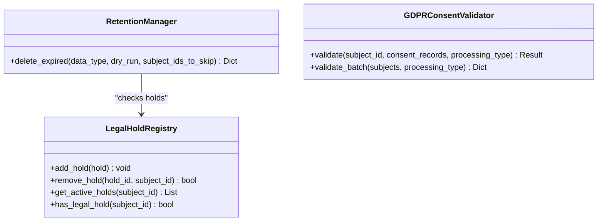
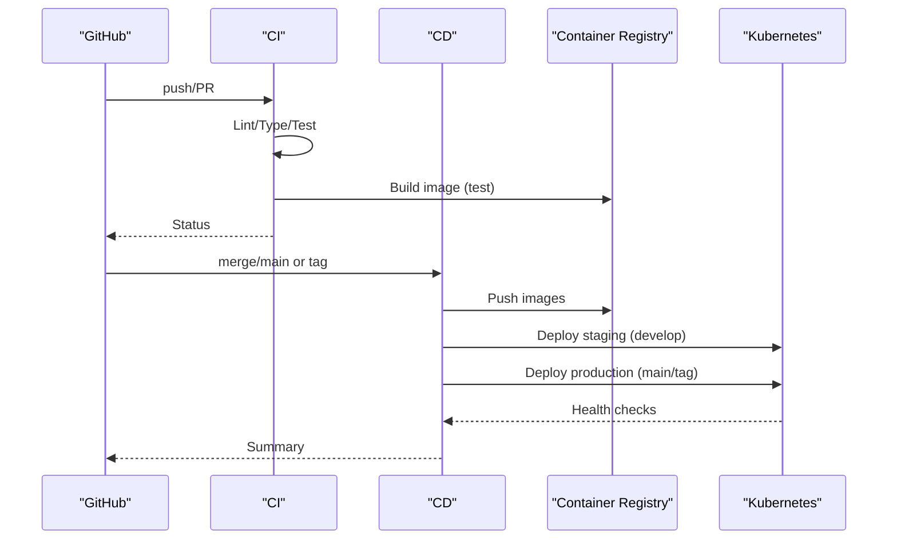
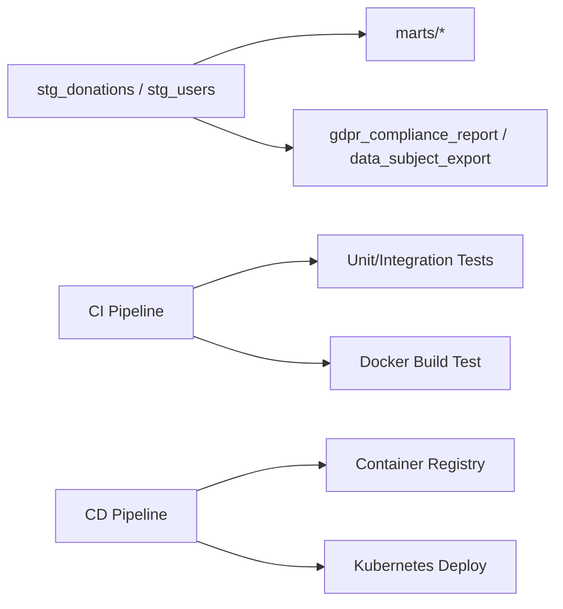

# Testing & Deployment

<cite>
**Referenced Files in This Document**
- [dbt_project.yml](file://data/dbt/dbt_project.yml)
- [profiles.yml](file://data/dbt/profiles.yml)
- [schema.yml](file://data/dbt/models/staging/schema.yml)
- [gdpr_compliance_report.sql](file://data/dbt/models/marts/gdpr_compliance_report.sql)
- [data_subject_export.sql](file://data/dbt/models/marts/data_subject_export.sql)
- [retention_manager.py](file://data/src/gdpr/retention_manager.py)
- [gdpr_consent_validation.py](file://data/src/quality/expectations/gdpr_consent_validation.py)
- [test_compliance.py](file://data/tests/test_compliance.py)
- [ci.yml](file://.github/workflows/ci.yml)
- [cd.yml](file://.github/workflows/cd.yml)
- [compliance-check.yml](file://.github/workflows/compliance-check.yml)
</cite>

## Table of Contents
1. [Introduction](#introduction)
2. [Project Structure](#project-structure)
3. [Core Components](#core-components)
4. [Architecture Overview](#architecture-overview)
5. [Detailed Component Analysis](#detailed-component-analysis)
6. [Dependency Analysis](#dependency-analysis)
7. [Performance Considerations](#performance-considerations)
8. [Troubleshooting Guide](#troubleshooting-guide)
9. [Conclusion](#conclusion)

## Introduction
This document explains the dbt testing strategies and deployment processes for the project, focusing on:
- Project configuration: retention policies, EU country settings, and materialization strategies
- Testing frameworks for data quality, model relationships, and GDPR compliance
- Deployment workflows across development, staging, and production environments with profile management and secret handling
- Best practices for version control, CI/CD integration, and monitoring dbt runs
- Troubleshooting common deployment issues and performance optimization techniques

## Project Structure
The dbt project is organized under data/dbt with models split into staging and marts, plus a dedicated gdpr schema for compliance outputs. The profiles define environment-specific database connections using environment variables.

**Diagram sources**
- [dbt_project.yml:1-44](file://data/dbt/dbt_project.yml#L1-L44)
- [profiles.yml:1-26](file://data/dbt/profiles.yml#L1-L26)
- [gdpr_compliance_report.sql:1-68](file://data/dbt/models/marts/gdpr_compliance_report.sql#L1-L68)
- [data_subject_export.sql:1-55](file://data/dbt/models/marts/data_subject_export.sql#L1-L55)

**Section sources**
- [dbt_project.yml:10-44](file://data/dbt/dbt_project.yml#L10-L44)
- [profiles.yml:4-26](file://data/dbt/profiles.yml#L4-L26)

## Core Components
- Retention policies and EU country settings are defined as dbt vars to drive compliance logic and filtering.
- Materialization strategy separates staging views from marts tables and isolates GDPR outputs into a dedicated schema.
- Profiles manage dev/prod Postgres connections via environment variables for secure, environment-aware deployments.

Key highlights:
- Retention periods: financial, user data, logs
- EU countries list used for regional processing constraints
- Staging materialized as views; marts and gdpr schemas materialized as tables

**Section sources**
- [dbt_project.yml:22-43](file://data/dbt/dbt_project.yml#L22-L43)
- [profiles.yml:4-26](file://data/dbt/profiles.yml#L4-L26)

## Architecture Overview
The end-to-end flow integrates dbt transformations with compliance reporting and CI/CD pipelines:
- CI validates code quality and runs tests
- CD builds container images and deploys to staging or production
- dbt models produce GDPR reports and subject export datasets
- Data quality checks enforce consent and retention rules

**Diagram sources**
- [ci.yml:1-379](file://.github/workflows/ci.yml#L1-L379)
- [cd.yml:1-335](file://.github/workflows/cd.yml#L1-L335)
- [gdpr_compliance_report.sql:1-68](file://data/dbt/models/marts/gdpr_compliance_report.sql#L1-L68)

## Detailed Component Analysis

### dbt Project Configuration and Materialization Strategy
- Project defines paths, target directories, and clean targets for consistent builds.
- Vars include retention days and an EU countries list for regional controls.
- Model groups set materialization and schema per layer:
  - staging: view, schema staging
  - marts: table, schema marts
  - gdpr: table, schema gdpr_compliance

**Diagram sources**
- [dbt_project.yml:10-44](file://data/dbt/dbt_project.yml#L10-L44)

**Section sources**
- [dbt_project.yml:10-44](file://data/dbt/dbt_project.yml#L10-L44)

### Profile Management and Secrets Handling
- Environment-specific Postgres profiles use environment variables for host, port, user, password, dbname, and threads.
- Default values provided for local development; production requires explicit secrets.

**Diagram sources**
- [profiles.yml:4-26](file://data/dbt/profiles.yml#L4-L26)

**Section sources**
- [profiles.yml:4-26](file://data/dbt/profiles.yml#L4-L26)

### Data Quality and Relationship Testing
- Source definitions declare raw tables and column-level tests (unique, not_null, accepted_values).
- These tests validate data integrity at ingestion boundaries and ensure referential consistency upstream.

**Diagram sources**
- [schema.yml:1-48](file://data/dbt/models/staging/schema.yml#L1-L48)

**Section sources**
- [schema.yml:1-48](file://data/dbt/models/staging/schema.yml#L1-L48)

### GDPR Compliance Reporting and Data Subject Export
- GDPR compliance report aggregates processing activities, legal basis, retention windows, and flags records approaching expiry.
- Data subject export consolidates user and donation data for portability requests.

**Diagram sources**
- [gdpr_compliance_report.sql:10-68](file://data/dbt/models/marts/gdpr_compliance_report.sql#L10-L68)
- [data_subject_export.sql:10-55](file://data/dbt/models/marts/data_subject_export.sql#L10-L55)

**Section sources**
- [gdpr_compliance_report.sql:10-68](file://data/dbt/models/marts/gdpr_compliance_report.sql#L10-L68)
- [data_subject_export.sql:10-55](file://data/dbt/models/marts/data_subject_export.sql#L10-L55)

### Retention Management and Consent Validation
- RetentionManager enforces storage limitation and right to erasure, with legal hold checks before deletion.
- GDPRConsentValidator ensures consent validity, expiration, and withdrawal handling per processing type.

**Diagram sources**
- [retention_manager.py:188-226](file://data/src/gdpr/retention_manager.py#L188-L226)
- [retention_manager.py:109-174](file://data/src/gdpr/retention_manager.py#L109-L174)
- [gdpr_consent_validation.py:52-150](file://data/src/quality/expectations/gdpr_consent_validation.py#L52-L150)

**Section sources**
- [retention_manager.py:78-106](file://data/src/gdpr/retention_manager.py#L78-L106)
- [retention_manager.py:188-226](file://data/src/gdpr/retention_manager.py#L188-L226)
- [gdpr_consent_validation.py:52-150](file://data/src/quality/expectations/gdpr_consent_validation.py#L52-L150)

### CI/CD Integration and Monitoring
- CI performs linting, type checking, unit/integration tests, Docker build test, and coverage upload.
- CD builds and pushes backend/frontend images, deploys to staging on develop, and to production on main/tags with health checks and optional rollback.
- Compliance checks run automated GDPR/SOC2/PCI-DSS tests in CI.

**Diagram sources**
- [ci.yml:1-379](file://.github/workflows/ci.yml#L1-L379)
- [cd.yml:1-335](file://.github/workflows/cd.yml#L1-L335)
- [compliance-check.yml:156-192](file://.github/workflows/compliance-check.yml#L156-L192)

**Section sources**
- [ci.yml:36-174](file://.github/workflows/ci.yml#L36-L174)
- [cd.yml:39-196](file://.github/workflows/cd.yml#L39-L196)
- [cd.yml:211-335](file://.github/workflows/cd.yml#L211-L335)
- [compliance-check.yml:156-192](file://.github/workflows/compliance-check.yml#L156-L192)

## Dependency Analysis
- dbt models depend on source tables and each other via refs; staging feeds marts; GDPR models aggregate staging outputs.
- CI depends on Python and Node toolchains; CD depends on container registry and Kubernetes credentials.
- Compliance tests depend on presence of specific modules and configurations.

**Diagram sources**
- [dbt_project.yml:10-44](file://data/dbt/dbt_project.yml#L10-L44)
- [ci.yml:1-379](file://.github/workflows/ci.yml#L1-L379)
- [cd.yml:1-335](file://.github/workflows/cd.yml#L1-L335)

**Section sources**
- [dbt_project.yml:10-44](file://data/dbt/dbt_project.yml#L10-L44)
- [ci.yml:36-174](file://.github/workflows/ci.yml#L36-L174)
- [cd.yml:39-196](file://.github/workflows/cd.yml#L39-L196)

## Performance Considerations
- Use staging views to avoid redundant computation and keep marts lean.
- Increase threads for production profiles when running large dbt jobs.
- Leverage CI caching for Python and Node dependencies to speed up builds.
- Monitor dbt run times and query plans; consider partitioning or indexing in the warehouse for large tables.
- Keep GDPR report queries efficient by aggregating only necessary fields and using appropriate indexes.

[No sources needed since this section provides general guidance]

## Troubleshooting Guide
Common issues and resolutions:
- Database connection failures: verify environment variables for host, port, user, password, dbname; ensure network access and firewall rules.
- Permission errors: confirm schema ownership and roles for dbt service account.
- CI failures: check lint/type/test steps; ensure services (Postgres, Redis) are healthy in CI job.
- CD deployment failures: validate kubectl config and namespace; review rollout status and health endpoints.
- GDPR compliance test failures: ensure required modules and configs exist; fix missing fields or assertions.

**Section sources**
- [profiles.yml:4-26](file://data/dbt/profiles.yml#L4-L26)
- [ci.yml:96-174](file://.github/workflows/ci.yml#L96-L174)
- [cd.yml:166-196](file://.github/workflows/cd.yml#L166-L196)
- [cd.yml:224-275](file://.github/workflows/cd.yml#L224-L275)
- [compliance-check.yml:156-192](file://.github/workflows/compliance-check.yml#L156-L192)

## Conclusion
The project implements robust dbt testing and deployment practices:
- Clear separation of concerns with staging views and marts tables, plus isolated GDPR outputs
- Strong data quality and relationship tests at the source layer
- Comprehensive CI/CD with environment-specific profiles and secure secret handling
- Automated compliance validation and retention enforcement aligned with GDPR requirements
Adhering to these patterns ensures reliable, compliant, and maintainable data operations across environments.

[No sources needed since this section summarizes without analyzing specific files]