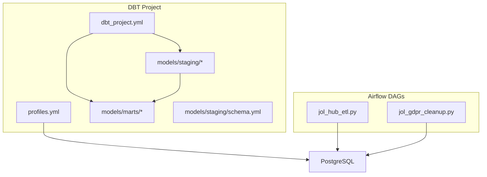
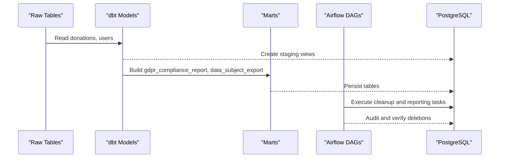
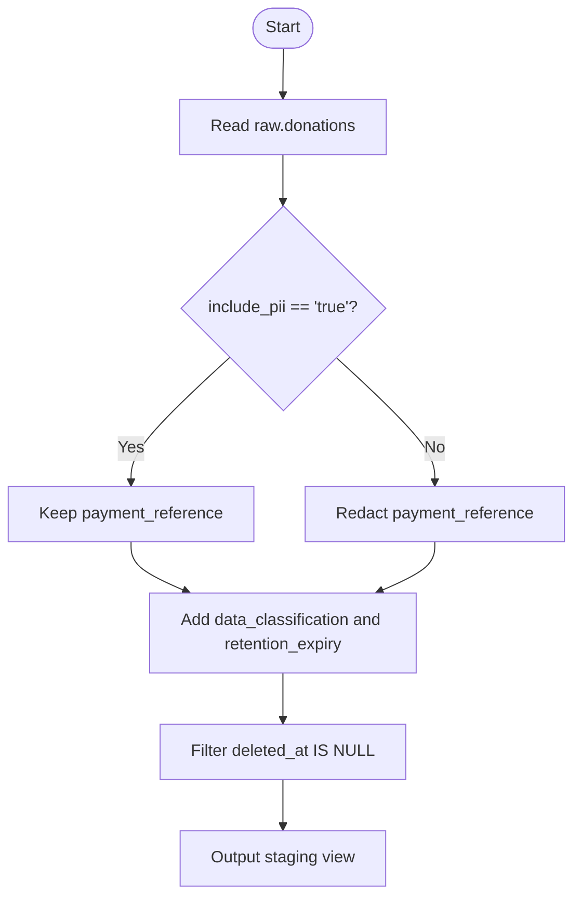
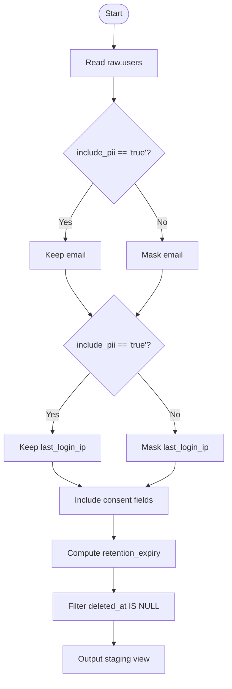
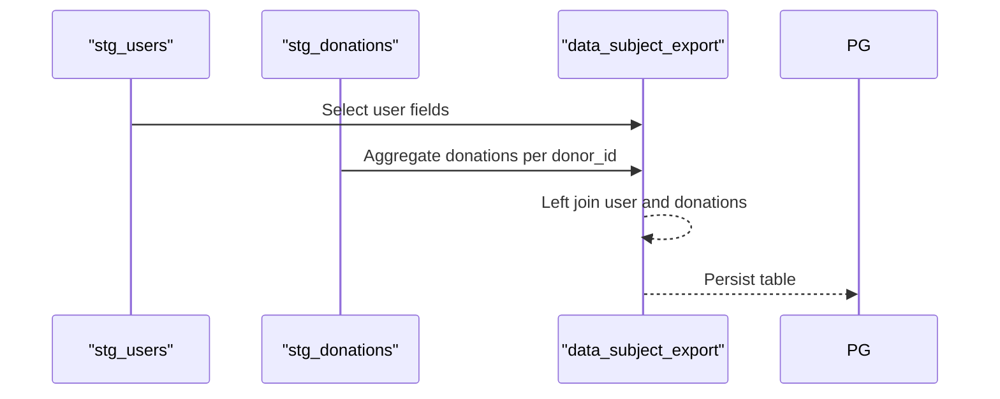
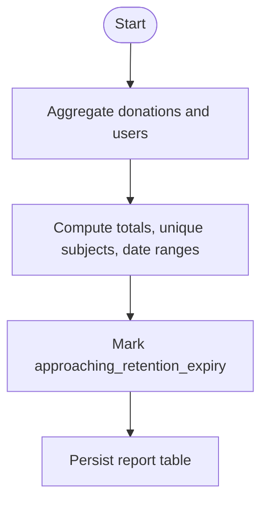
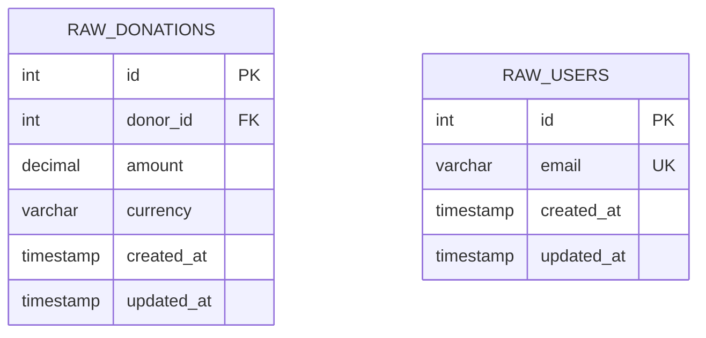
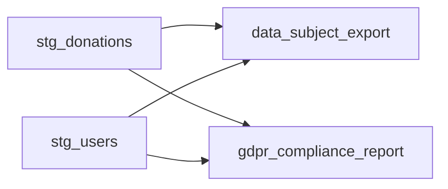

# dbt Data Transformations

<cite>
**Referenced Files in This Document**
- [dbt_project.yml](file://data/dbt/dbt_project.yml)
- [profiles.yml](file://data/dbt/profiles.yml)
- [stg_donations.sql](file://data/dbt/models/staging/stg_donations.sql)
- [stg_users.sql](file://data/dbt/models/staging/stg_users.sql)
- [schema.yml](file://data/dbt/models/staging/schema.yml)
- [data_subject_export.sql](file://data/dbt/models/marts/data_subject_export.sql)
- [gdpr_compliance_report.sql](file://data/dbt/models/marts/gdpr_compliance_report.sql)
- [jol_hub_etl.py](file://data/airflow/dags/jol_hub_etl.py)
- [jol_gdpr_cleanup.py](file://data/airflow/dags/jol_gdpr_cleanup.py)
- [README.md](file://data/README.md)
</cite>

## Table of Contents
1. [Introduction](#introduction)
2. [Project Structure](#project-structure)
3. [Core Components](#core-components)
4. [Architecture Overview](#architecture-overview)
5. [Detailed Component Analysis](#detailed-component-analysis)
6. [Dependency Analysis](#dependency-analysis)
7. [Performance Considerations](#performance-considerations)
8. [Troubleshooting Guide](#troubleshooting-guide)
9. [Conclusion](#conclusion)
10. [Appendices](#appendices)

## Introduction
This document describes the dbt data transformation layer for JOL-HUB, focusing on staging models that normalize raw operational data and marts that produce business intelligence and GDPR-compliant outputs. It explains schema design, model relationships, transformation logic, testing strategies, documentation generation, and deployment processes. It also provides examples for creating new models and running transformations.

## Project Structure
The dbt project is organized into:
- Staging models: normalized views over raw tables with privacy controls and retention metadata.
- Marts: analytical tables for business reporting and GDPR compliance (data subject export and compliance metrics).
- Configuration: project settings, variables, and database profiles.

**Diagram sources**
- [dbt_project.yml:1-44](file://data/dbt/dbt_project.yml#L1-L44)
- [profiles.yml:1-26](file://data/dbt/profiles.yml#L1-L26)
- [stg_donations.sql:1-36](file://data/dbt/models/staging/stg_donations.sql#L1-L36)
- [stg_users.sql:1-50](file://data/dbt/models/staging/stg_users.sql#L1-L50)
- [data_subject_export.sql:1-55](file://data/dbt/models/marts/data_subject_export.sql#L1-L55)
- [gdpr_compliance_report.sql:1-68](file://data/dbt/models/marts/gdpr_compliance_report.sql#L1-L68)
- [jol_hub_etl.py:1-214](file://data/airflow/dags/jol_hub_etl.py#L1-L214)
- [jol_gdpr_cleanup.py:1-68](file://data/airflow/dags/jol_gdpr_cleanup.py#L1-L68)

**Section sources**
- [dbt_project.yml:1-44](file://data/dbt/dbt_project.yml#L1-L44)
- [profiles.yml:1-26](file://data/dbt/profiles.yml#L1-L26)
- [README.md:1-63](file://data/README.md#L1-L63)

## Core Components
- Staging models:
  - stg_donations: Normalizes donation records, masks sensitive fields based on a variable, adds data classification and retention expiry.
  - stg_users: Normalizes user records, masks PII by default, includes consent fields, adds data classification and retention expiry.
- Marts:
  - data_subject_export: Aggregates all data for a specific data subject to support GDPR Article 20 (Right to Data Portability).
  - gdpr_compliance_report: Produces metrics for GDPR Article 30 reporting, including processing activities and retention status.
- Schema and tests:
  - schema.yml declares source tables and column-level tests (unique, not_null, accepted_values).

Key configuration highlights:
- Model materialization and schemas are set per folder (staging as views, marts as tables).
- Variables define retention periods and supported EU countries.
- Profile configures PostgreSQL connections for dev and prod via environment variables.

**Section sources**
- [stg_donations.sql:1-36](file://data/dbt/models/staging/stg_donations.sql#L1-L36)
- [stg_users.sql:1-50](file://data/dbt/models/staging/stg_users.sql#L1-L50)
- [data_subject_export.sql:1-55](file://data/dbt/models/marts/data_subject_export.sql#L1-L55)
- [gdpr_compliance_report.sql:1-68](file://data/dbt/models/marts/gdpr_compliance_report.sql#L1-L68)
- [schema.yml:1-48](file://data/dbt/models/staging/schema.yml#L1-L48)
- [dbt_project.yml:22-43](file://data/dbt/dbt_project.yml#L22-L43)
- [profiles.yml:1-26](file://data/dbt/profiles.yml#L1-L26)

## Architecture Overview
End-to-end flow from raw data to compliant outputs:

**Diagram sources**
- [stg_donations.sql:1-36](file://data/dbt/models/staging/stg_donations.sql#L1-L36)
- [stg_users.sql:1-50](file://data/dbt/models/staging/stg_users.sql#L1-L50)
- [data_subject_export.sql:1-55](file://data/dbt/models/marts/data_subject_export.sql#L1-L55)
- [gdpr_compliance_report.sql:1-68](file://data/dbt/models/marts/gdpr_compliance_report.sql#L1-L68)
- [jol_hub_etl.py:73-113](file://data/airflow/dags/jol_hub_etl.py#L73-L113)
- [jol_gdpr_cleanup.py:36-67](file://data/airflow/dags/jol_gdpr_cleanup.py#L36-L67)

## Detailed Component Analysis

### Staging Layer: stg_donations
- Purpose: Normalize raw donation records and apply privacy controls.
- Key behaviors:
  - Masks payment_reference unless include_pii is explicitly enabled.
  - Adds data_classification and retention_expiry derived from financial_retention_days.
  - Filters out soft-deleted rows.
- Materialization: view in staging schema.

**Diagram sources**
- [stg_donations.sql:10-35](file://data/dbt/models/staging/stg_donations.sql#L10-L35)

**Section sources**
- [stg_donations.sql:1-36](file://data/dbt/models/staging/stg_donations.sql#L1-L36)

### Staging Layer: stg_users
- Purpose: Normalize user records with strong privacy defaults.
- Key behaviors:
  - Masks email and last_login_ip unless include_pii is enabled.
  - Includes consent flags and timestamps.
  - Adds data_classification and retention_expiry using user_data_retention_days.
  - Filters out soft-deleted rows.
- Materialization: view in staging schema.

**Diagram sources**
- [stg_users.sql:10-49](file://data/dbt/models/staging/stg_users.sql#L10-L49)

**Section sources**
- [stg_users.sql:1-50](file://data/dbt/models/staging/stg_users.sql#L1-L50)

### Mart: GDPR Data Subject Export
- Purpose: Aggregate all data for a specific data subject to fulfill GDPR Article 20 (Right to Data Portability).
- Logic:
  - Joins user data with aggregated donation JSONB array.
  - Defaults to empty JSON array when no donations exist.
  - Persists as a table in gdpr_compliance schema.

**Diagram sources**
- [data_subject_export.sql:13-54](file://data/dbt/models/marts/data_subject_export.sql#L13-L54)

**Section sources**
- [data_subject_export.sql:1-55](file://data/dbt/models/marts/data_subject_export.sql#L1-L55)

### Mart: GDPR Compliance Report
- Purpose: Provide metrics for GDPR Article 30 reporting across processing activities.
- Logic:
  - Computes counts, date ranges, legal basis, and retention days for donations and users.
  - Flags activities approaching retention expiry within 30 days.
  - Persists as a table in gdpr_compliance schema.

**Diagram sources**
- [gdpr_compliance_report.sql:10-67](file://data/dbt/models/marts/gdpr_compliance_report.sql#L10-L67)

**Section sources**
- [gdpr_compliance_report.sql:1-68](file://data/dbt/models/marts/gdpr_compliance_report.sql#L1-L68)

### Schema Design and Tests
- Sources declared under public schema with column-level tests:
  - Unique and not_null constraints for identifiers and emails.
  - Accepted values for currency codes.
- These tests ensure data quality at the source boundary before transformation.

**Diagram sources**
- [schema.yml:3-48](file://data/dbt/models/staging/schema.yml#L3-L48)

**Section sources**
- [schema.yml:1-48](file://data/dbt/models/staging/schema.yml#L1-L48)

## Dependency Analysis
Model dependencies and execution order:

**Diagram sources**
- [data_subject_export.sql:23-39](file://data/dbt/models/marts/data_subject_export.sql#L23-L39)
- [gdpr_compliance_report.sql:20-33](file://data/dbt/models/marts/gdpr_compliance_report.sql#L20-L33)

**Section sources**
- [data_subject_export.sql:1-55](file://data/dbt/models/marts/data_subject_export.sql#L1-L55)
- [gdpr_compliance_report.sql:1-68](file://data/dbt/models/marts/gdpr_compliance_report.sql#L1-L68)

## Performance Considerations
- Staging models are materialized as views to avoid redundant storage and keep transformations close to source.
- Marts are materialized as tables to optimize downstream queries and reporting.
- Use variables to control PII exposure and retention calculations without code changes.
- Ensure indexes on foreign keys and filters (e.g., deleted_at) in source tables to improve performance.
- Limit threads per profile according to warehouse capacity; production uses higher concurrency.

[No sources needed since this section provides general guidance]

## Troubleshooting Guide
Common issues and resolutions:
- Connection failures:
  - Verify environment variables for host, port, user, password, and dbname match the target profile.
  - Confirm network access and firewall rules for the PostgreSQL instance.
- Missing or invalid source tables:
  - Ensure raw.donations and raw.users exist in the configured schema and pass schema.yml tests.
- PII masking behavior:
  - If sensitive fields appear unexpectedly, confirm include_pii is not set to true in your run context.
- Retention expiry anomalies:
  - Validate retention_days variables and ensure created_at/last_login_at are populated.
- Airflow task failures:
  - Check logs for PythonOperator errors in daily ETL and GDPR cleanup DAGs.
  - Ensure required modules and credentials are available in the Airflow environment.

**Section sources**
- [profiles.yml:7-25](file://data/dbt/profiles.yml#L7-L25)
- [schema.yml:3-48](file://data/dbt/models/staging/schema.yml#L3-L48)
- [stg_donations.sql:20-30](file://data/dbt/models/staging/stg_donations.sql#L20-L30)
- [stg_users.sql:14-44](file://data/dbt/models/staging/stg_users.sql#L14-L44)
- [jol_hub_etl.py:73-113](file://data/airflow/dags/jol_hub_etl.py#L73-L113)
- [jol_gdpr_cleanup.py:36-67](file://data/airflow/dags/jol_gdpr_cleanup.py#L36-L67)

## Conclusion
The dbt layer provides a clear separation between normalization (staging) and analytics/compliance (marts), with built-in privacy controls and retention tracking. The design supports GDPR obligations through explicit data subject exports and compliance reporting, while Airflow orchestrates periodic maintenance and cleanup tasks.

[No sources needed since this section summarizes without analyzing specific files]

## Appendices

### Running Transformations
- Install and configure dbt:
  - Set environment variables for database connection.
  - Run dbt commands from the data/dbt directory.
- Example commands:
  - Build staging and marts: dbt build
  - Run tests: dbt test
  - Generate docs: dbt docs generate && dbt docs serve
  - Run a single model: dbt run --model stg_users
  - Seed data (if used): dbt seed

**Section sources**
- [README.md:4-19](file://data/README.md#L4-L19)
- [dbt_project.yml:10-20](file://data/dbt/dbt_project.yml#L10-L20)
- [profiles.yml:7-25](file://data/dbt/profiles.yml#L7-L25)

### Creating New Models
- Staging model example:
  - Place a new SQL file under models/staging.
  - Reference raw sources via source() and add privacy and retention logic.
  - Add column tests in schema.yml if applicable.
- Mart model example:
  - Place a new SQL file under models/marts.
  - Reference staging models via ref() and aggregate into a table.
  - Tag models appropriately for governance and filtering.

**Section sources**
- [stg_donations.sql:4-8](file://data/dbt/models/staging/stg_donations.sql#L4-L8)
- [stg_users.sql:4-8](file://data/dbt/models/staging/stg_users.sql#L4-L8)
- [data_subject_export.sql:4-8](file://data/dbt/models/marts/data_subject_export.sql#L4-L8)
- [gdpr_compliance_report.sql:4-8](file://data/dbt/models/marts/gdpr_compliance_report.sql#L4-L8)
- [schema.yml:3-48](file://data/dbt/models/staging/schema.yml#L3-L48)

### Deployment Processes
- CI/CD integration:
  - Run dbt tests and docs generation in CI pipelines.
  - Promote changes after successful validation and peer review.
- Environment management:
  - Use separate profiles for dev and prod with appropriate credentials and thread counts.
- Orchestration:
  - Schedule dbt runs via Airflow or other schedulers.
  - Combine with data quality checks and GDPR cleanup tasks.

**Section sources**
- [profiles.yml:7-25](file://data/dbt/profiles.yml#L7-L25)
- [jol_hub_etl.py:73-113](file://data/airflow/dags/jol_hub_etl.py#L73-L113)
- [jol_gdpr_cleanup.py:36-67](file://data/airflow/dags/jol_gdpr_cleanup.py#L36-L67)
- [README.md:49-62](file://data/README.md#L49-L62)