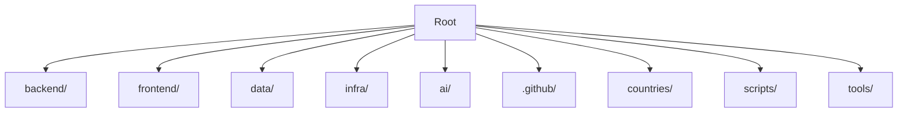
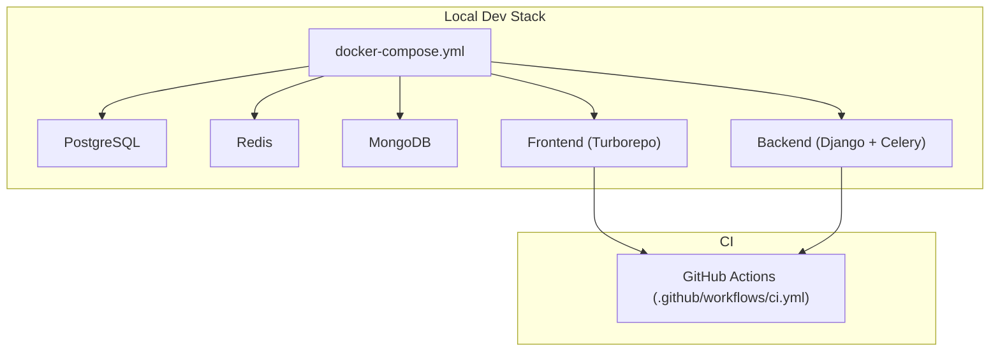
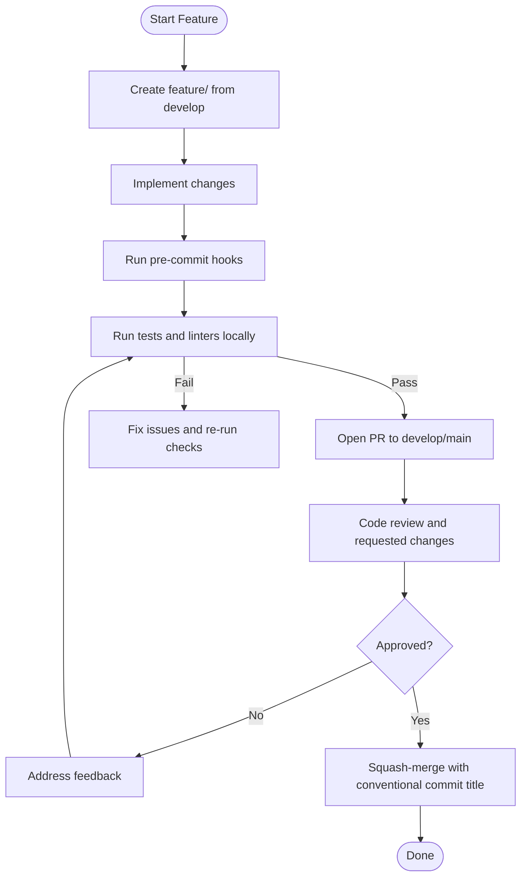
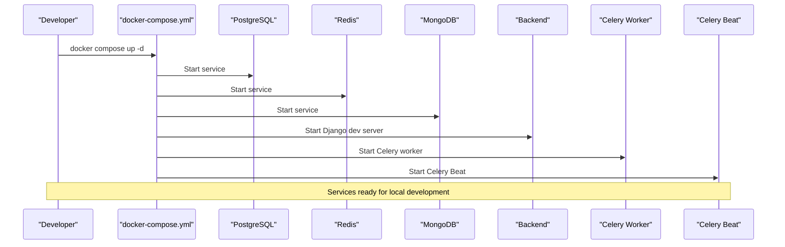
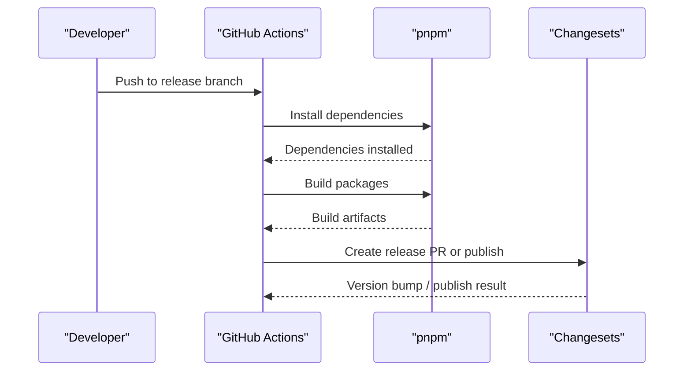
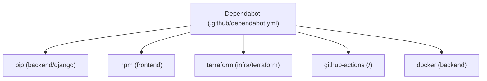

# Development Guide

<cite>
**Referenced Files in This Document**
- [CONTRIBUTING.md](file://CONTRIBUTING.md)
- [README.md](file://README.md)
- [docker-compose.yml](file://docker-compose.yml)
- [qodana.yaml](file://qodana.yaml)
- [backend/requirements.txt](file://backend/requirements.txt)
- [frontend/package.json](file://frontend/package.json)
- [frontend/.eslintrc.js](file://frontend/.eslintrc.js)
- [frontend/.prettierrc](file://frontend/.prettierrc)
- [.github/workflows/ci.yml](file://.github/workflows/ci.yml)
- [.github/workflows/release.yml](file://.github/workflows/release.yml)
- [.github/dependabot.yml](file://.github/dependabot.yml)
</cite>

## Table of Contents
1. [Introduction](#introduction)
2. [Project Structure](#project-structure)
3. [Core Components](#core-components)
4. [Architecture Overview](#architecture-overview)
5. [Detailed Component Analysis](#detailed-component-analysis)
6. [Dependency Analysis](#dependency-analysis)
7. [Performance Considerations](#performance-considerations)
8. [Troubleshooting Guide](#troubleshooting-guide)
9. [Conclusion](#conclusion)
10. [Appendices](#appendices)

## Introduction
This guide explains how to contribute to the JOL-HUB platform, including development workflow, coding standards, environment setup, testing, and release management. It consolidates repository conventions for GitFlow branching, pull requests, code review, commit messages, linting/formatting, tests, and quality checks with Qodana.

## Project Structure
JOL-HUB is a monorepo coordinating backend (Django), frontend (Next.js/Turborepo), data pipelines, infrastructure, and AI modules. The root contains orchestration artifacts such as Docker Compose for local services, CI workflows, and configuration files for linters and quality gates.

**Section sources**
- [README.md:85-155](file://README.md#L85-L155)

## Core Components
- Backend: Django-based API and services with Celery workers and beat scheduler. Dependencies are pinned/constrained in requirements files.
- Frontend: Turborepo monorepo with Next.js apps and shared packages; linting via ESLint and formatting via Prettier.
- Local Services: PostgreSQL, Redis, MongoDB orchestrated by Docker Compose.
- CI/CD: GitHub Actions run linting, type checks, tests, builds, and Docker build verification.
- Quality: Qodana configuration present at the repository root.

**Section sources**
- [backend/requirements.txt:1-66](file://backend/requirements.txt#L1-L66)
- [frontend/package.json:1-67](file://frontend/package.json#L1-L67)
- [docker-compose.yml:1-156](file://docker-compose.yml#L1-L156)
- [.github/workflows/ci.yml:1-379](file://.github/workflows/ci.yml#L1-L379)
- [qodana.yaml:1-50](file://qodana.yaml#L1-L50)

## Architecture Overview
The development stack runs locally using Docker Compose to provide database, cache, and document store services, while the backend serves APIs and background jobs. The frontend builds and serves applications through Turborepo scripts. CI enforces consistent quality across languages and tools.

**Diagram sources**
- [docker-compose.yml:15-148](file://docker-compose.yml#L15-L148)
- [.github/workflows/ci.yml:31-379](file://.github/workflows/ci.yml#L31-L379)

**Section sources**
- [docker-compose.yml:15-148](file://docker-compose.yml#L15-L148)
- [.github/workflows/ci.yml:31-379](file://.github/workflows/ci.yml#L31-L379)

## Detailed Component Analysis

### Development Workflow and Branching Strategy
- Follow GitFlow with branches: main, develop, feature/*, release/*, hotfix/*, fix/*.
- PRs must be rebased onto target branch, include clear descriptions, and pass all checks.
- Approval thresholds: main requires two approvals; develop requires one.

**Section sources**
- [CONTRIBUTING.md:31-147](file://CONTRIBUTING.md#L31-L147)
- [README.md:469-491](file://README.md#L469-L491)

### Pull Request Process and Code Review
- Rebase onto latest target branch before opening PR.
- Run backend and frontend checks locally prior to PR submission.
- Include description, related issues, screenshots for UI changes, and updated docs if needed.
- Address feedback promptly; push new commits rather than force-pushing.
- Squash-merge when approved; PR title becomes commit message.

**Section sources**
- [CONTRIBUTING.md:110-147](file://CONTRIBUTING.md#L110-L147)

### Commit Standards (Conventional Commits and GPG Signing)
- All commits must be GPG-signed.
- Use Conventional Commits format: type(scope): short description.
- Types include feat, fix, docs, style, refactor, test, chore, ci, perf.

**Section sources**
- [CONTRIBUTING.md:61-107](file://CONTRIBUTING.md#L61-L107)

### Coding Standards and Editor Configuration

#### Python (Backend)
- Linter: Ruff check and format.
- Type checker: mypy.
- Security scanner: Bandit.
- Test coverage minimum: 80% for new code.
- Dependencies managed via requirements file.

**Section sources**
- [CONTRIBUTING.md:149-178](file://CONTRIBUTING.md#L149-L178)
- [backend/requirements.txt:1-66](file://backend/requirements.txt#L1-L66)

#### TypeScript/JavaScript (Frontend)
- Linter: ESLint with TypeScript rules and React plugins.
- Formatter: Prettier with Tailwind plugin.
- Type checker: tsc via package scripts.
- Build system: Turborepo.

**Section sources**
- [CONTRIBUTING.md:159-166](file://CONTRIBUTING.md#L159-L166)
- [frontend/package.json:11-37](file://frontend/package.json#L11-L37)
- [frontend/.eslintrc.js:1-81](file://frontend/.eslintrc.js#L1-L81)
- [frontend/.prettierrc:1-14](file://frontend/.prettierrc#L1-L14)

### IDE Setup Recommendations
- Primary IDE: PhpStorm for monorepo work; PyCharm for Python-only tasks.
- Configure project interpreter to use the virtual environment created during setup.
- Open the repository root in the IDE to enable workspace-wide indexing.

**Section sources**
- [README.md:281-290](file://README.md#L281-L290)

### Development Environment Setup with Docker Compose
- Prerequisites include Python 3.12+, Node.js 20+, Docker, Docker Compose, Git, and required databases.
- Clone repo, create virtual environment, install dependencies, then start services with Docker Compose.
- Services include PostgreSQL, Redis, MongoDB, Django dev server, Celery worker, and Celery Beat.

**Diagram sources**
- [docker-compose.yml:15-148](file://docker-compose.yml#L15-L148)

**Section sources**
- [README.md:192-277](file://README.md#L192-L277)
- [docker-compose.yml:15-148](file://docker-compose.yml#L15-L148)

### Database Seeding and Local Service Configuration
- Seed fixtures exist under frontend seed-data packages and can be built/validated per documentation.
- Environment variables should be configured via .env (gitignored); never commit secrets.
- Ensure DATABASE_URL, REDIS_URL, and other required variables are set for local services.

**Section sources**
- [README.md:294-316](file://README.md#L294-L316)
- [docs/compliance/evidence/onboarding-runbook.md:34-58](file://docs/compliance/evidence/onboarding-runbook.md#L34-L58)

### Running Linters and Formatters
- Backend: ruff check and ruff format; mypy for types; bandit for security scanning.
- Frontend: pnpm lint (ESLint), pnpm format (Prettier), pnpm type-check (tsc).
- Pre-commit hooks enforce detection of secrets, Python lint/format, type checking, and security scans.

**Section sources**
- [CONTRIBUTING.md:149-178](file://CONTRIBUTING.md#L149-L178)
- [frontend/package.json:11-37](file://frontend/package.json#L11-L37)

### Executing Test Suites
- Backend: pytest with coverage; minimum coverage thresholds enforced in CI.
- Frontend: unit tests via Turborepo; e2e tests available for template-renderer.
- CI runs backend and frontend tests on pushes and pull requests.

**Section sources**
- [README.md:340-361](file://README.md#L340-L361)
- [.github/workflows/ci.yml:96-174](file://.github/workflows/ci.yml#L96-L174)
- [.github/workflows/ci.yml:240-276](file://.github/workflows/ci.yml#L240-L276)

### Performing Code Quality Checks with Qodana
- Qodana configuration exists at the repository root; used for JetBrains-based quality analysis.
- Can be executed locally or integrated into CI pipelines.

**Section sources**
- [qodana.yaml:1-50](file://qodana.yaml#L1-L50)

### Release Management
- Releases are automated via Changesets in CI triggered on specific branches.
- Package builds are performed, and versioning/publishing steps are executed with appropriate tokens.

**Diagram sources**
- [.github/workflows/release.yml:1-48](file://.github/workflows/release.yml#L1-L48)

**Section sources**
- [.github/workflows/release.yml:1-48](file://.github/workflows/release.yml#L1-L48)

### Contribution Process and Issue Reporting
- Fork or create a feature branch from develop; write tests; ensure all tests pass; sign commits with GPG; open PR with clear description; address review comments.
- Use issue templates for bug reports, feature requests, documentation issues, and security vulnerabilities.

**Section sources**
- [README.md:494-505](file://README.md#L494-L505)
- [CONTRIBUTING.md:284-303](file://CONTRIBUTING.md#L284-L303)

### Community Guidelines
- Be respectful, professional, and constructive. Focus on code, not people. Assume good intent.

**Section sources**
- [CONTRIBUTING.md:306-311](file://CONTRIBUTING.md#L306-L311)

## Dependency Analysis
Automated dependency updates are managed via Dependabot across ecosystems: pip (backend), npm (frontend), Terraform, GitHub Actions, and Docker images. Updates are scheduled weekly and grouped by ecosystem with labels and reviewers.

**Diagram sources**
- [.github/dependabot.yml:1-165](file://.github/dependabot.yml#L1-L165)

**Section sources**
- [.github/dependabot.yml:1-165](file://.github/dependabot.yml#L1-L165)

## Performance Considerations
- Keep local services minimal and use healthchecks to avoid starting dependent services prematurely.
- Prefer running only necessary containers for focused development tasks.
- Use Turborepo caching and parallel execution for faster frontend builds and tests.
- Monitor coverage thresholds and performance budgets in CI to prevent regressions.

[No sources needed since this section provides general guidance]

## Troubleshooting Guide
- If local services fail to start, verify environment variables and credentials in .env; ensure ports are free and Docker is running.
- For database connectivity issues, confirm DATABASE_URL matches the containerized service configuration.
- For Celery issues, ensure Redis is reachable and that worker/beat commands reference correct settings.
- For frontend build failures, run pnpm lint and pnpm type-check to identify issues early.
- For CI failures, inspect job logs for lint/type/test/build errors and address them locally first.

**Section sources**
- [docker-compose.yml:15-148](file://docker-compose.yml#L15-L148)
- [.github/workflows/ci.yml:31-379](file://.github/workflows/ci.yml#L31-L379)

## Conclusion
This guide consolidates the essential practices for contributing to JOL-HUB: GitFlow branching, conventional commits, rigorous linting and testing, secure environment setup, and automated releases. Adhering to these standards ensures consistent quality, maintainability, and safe deployments across the platform.

[No sources needed since this section summarizes without analyzing specific files]

## Appendices

### Quick Commands Reference
- Start local stack: docker compose up -d
- Backend tests: pytest with coverage
- Frontend tests: pnpm test and pnpm test:e2e
- Linting/formatting: ruff check/format (backend), pnpm lint/format (frontend)
- Type checks: mypy (backend), pnpm type-check (frontend)
- Qodana: run via provided configuration

**Section sources**
- [README.md:319-361](file://README.md#L319-L361)
- [CONTRIBUTING.md:118-125](file://CONTRIBUTING.md#L118-L125)
- [qodana.yaml:1-50](file://qodana.yaml#L1-L50)