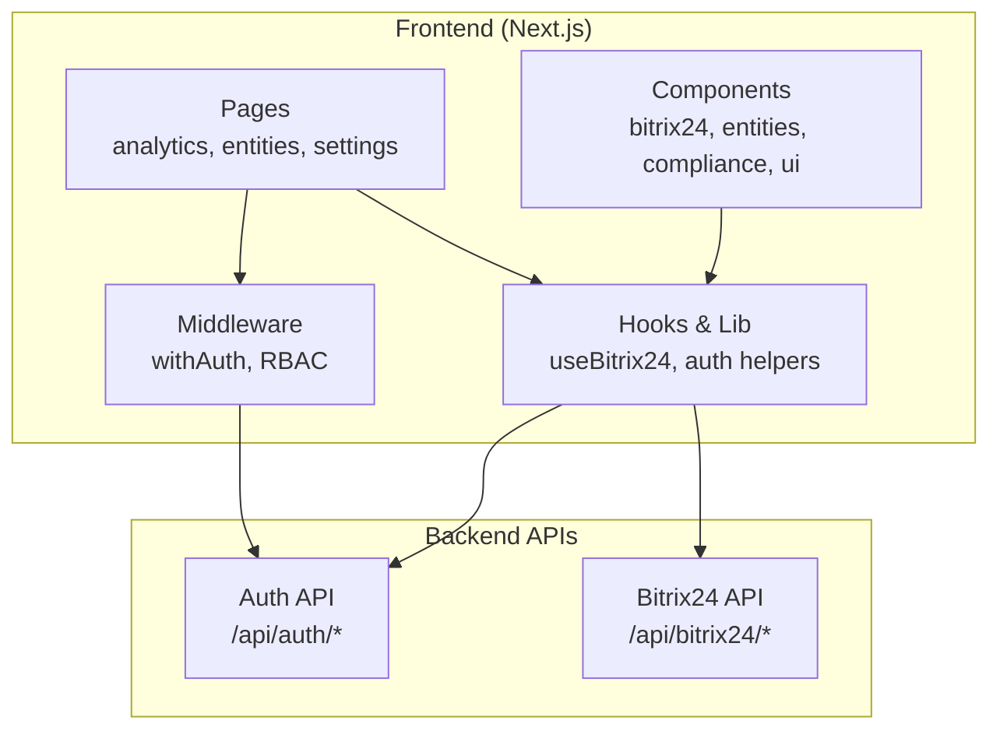
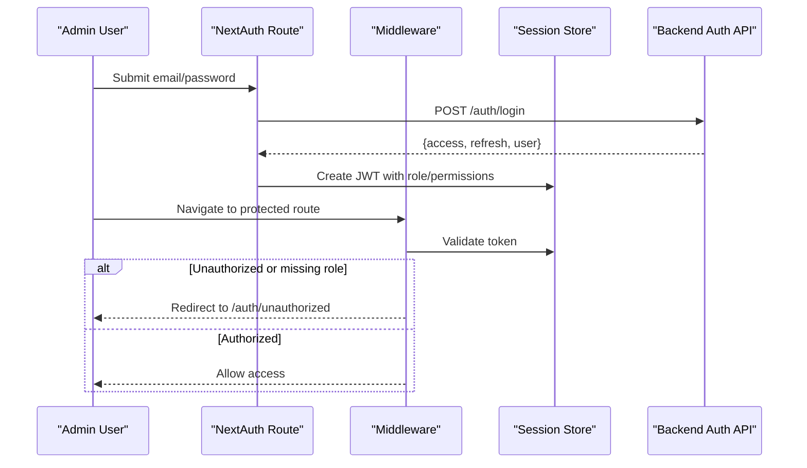
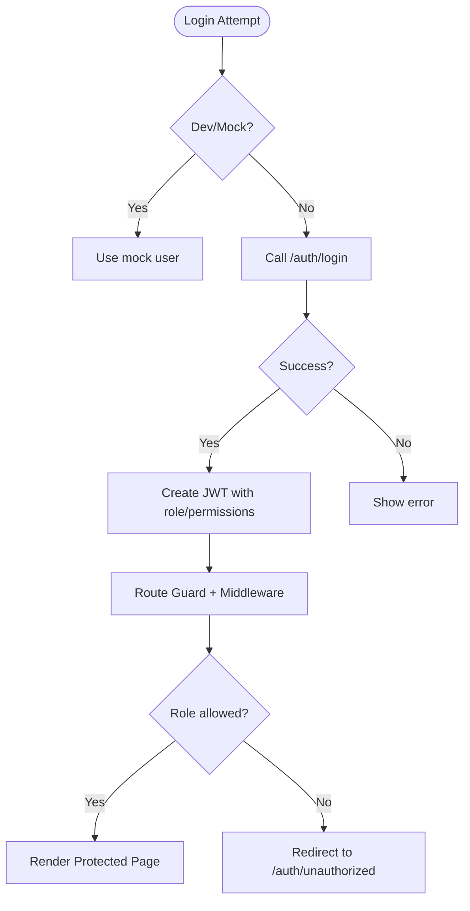
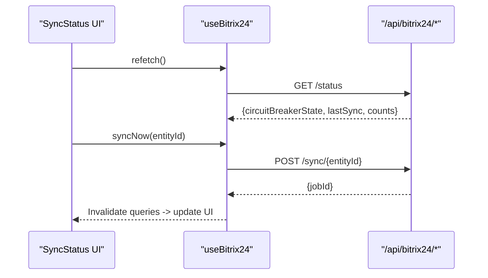
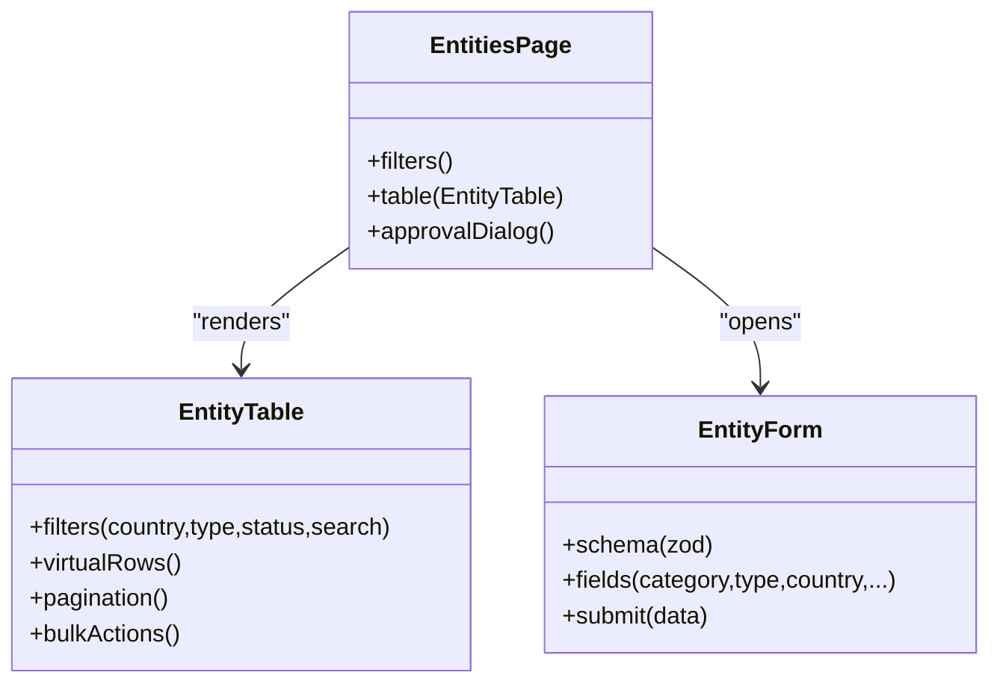
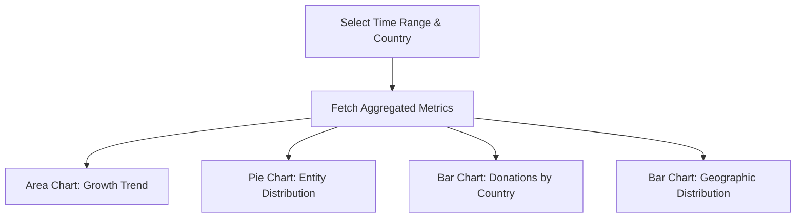
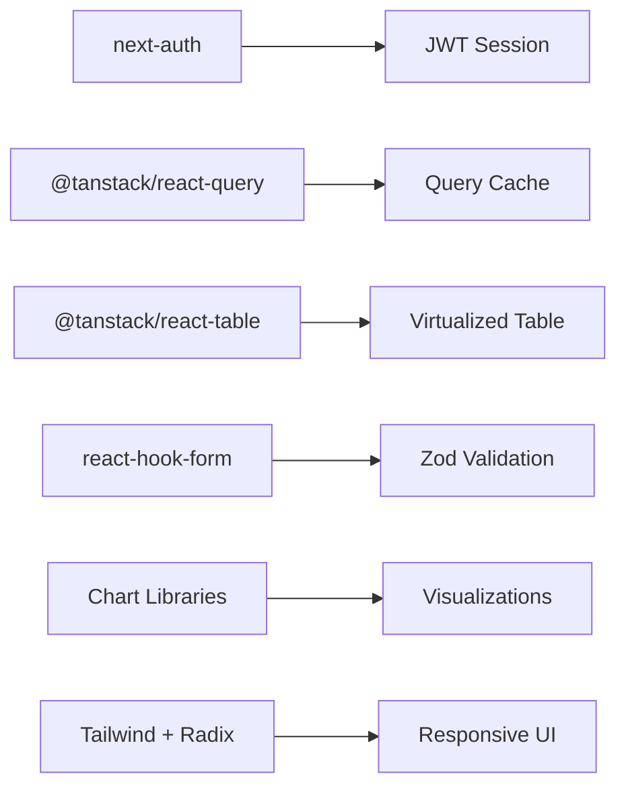

# Admin Dashboard Application

<cite>
**Referenced Files in This Document**
- [package.json](file://frontend/apps/admin-dashboard/package.json)
- [route.ts](file://frontend/apps/admin-dashboard/src/app/api/auth/[...nextauth]/route.ts)
- [auth.ts](file://frontend/apps/admin-dashboard/src/lib/auth.ts)
- [auth-guard.tsx](file://frontend/apps/admin-dashboard/src/components/auth/auth-guard.tsx)
- [middleware.ts](file://frontend/apps/admin-dashboard/src/middleware.ts)
- [SyncStatus.tsx](file://frontend/apps/admin-dashboard/src/components/bitrix24/SyncStatus.tsx)
- [FieldMapper.tsx](file://frontend/apps/admin-dashboard/src/components/bitrix24/FieldMapper.tsx)
- [useBitrix24.ts](file://frontend/apps/admin-dashboard/src/hooks/useBitrix24.ts)
- [page.tsx (analytics)](file://frontend/apps/admin-dashboard/src/app/(dashboard)/analytics/page.tsx)
- [EntityTable.tsx](file://frontend/apps/admin-dashboard/src/components/entities/EntityTable.tsx)
- [EntityForm.tsx](file://frontend/apps/admin-dashboard/src/components/entities/EntityForm.tsx)
- [page.tsx (entities)](file://frontend/apps/admin-dashboard/src/app/(dashboard)/entities/page.tsx)
- [ConsentDashboard.tsx](file://frontend/apps/admin-dashboard/src/components/compliance/ConsentDashboard.tsx)
</cite>

## Table of Contents
1. Introduction
2. Project Structure
3. Core Components
4. Architecture Overview
5. Detailed Component Analysis
6. Dependency Analysis
7. Performance Considerations
8. Troubleshooting Guide
9. Conclusion
10. Appendices

## Introduction
This document provides comprehensive documentation for the Admin Dashboard application, which delivers content management, analytics, and configuration interfaces for platform administrators. It explains authentication with NextAuth.js, role-based access control, entity management, Bitrix24 CRM integration, analytics dashboards, and compliance monitoring tools. It also covers responsive design patterns, data visualization components, form handling, real-time updates, and guidance for customizing layouts, adding new admin features, and integrating external services.

## Project Structure
The Admin Dashboard is a Next.js application organized into:
- App Router pages under src/app for routes like analytics, entities, settings, and auth flows
- Feature-specific components under src/components (bitrix24, entities, compliance, layout, ui)
- Data hooks and utilities under src/hooks and src/lib
- Middleware for route protection and role checks
- Package dependencies including NextAuth, React Query, TanStack Table, Chart.js/Recharts, and UI primitives

**Diagram sources**
- [route.ts:1-235](file://frontend/apps/admin-dashboard/src/app/api/auth/[...nextauth]/route.ts#L1-L235)
- [useBitrix24.ts:1-202](file://frontend/apps/admin-dashboard/src/hooks/useBitrix24.ts#L1-L202)
- [middleware.ts:1-82](file://frontend/apps/admin-dashboard/src/middleware.ts#L1-L82)

**Section sources**
- [package.json:1-76](file://frontend/apps/admin-dashboard/package.json#L1-L76)

## Core Components
- Authentication and Authorization
  - NextAuth.js credentials provider with JWT session strategy, token refresh, and mock dev mode
  - Role-based middleware protecting dashboard routes and enforcing permissions
  - Client-side AuthGuard component to gate page rendering based on roles and permissions
  - Hierarchy context and permission utilities implementing GDPR-compliant data residency and tiered access

- Bitrix24 Integration
  - useBitrix24 hook polling status, jobs, health; mutations for sync, conflict resolution, retry
  - SyncStatus component showing circuit breaker state, last sync time, success/failure counts, recent activity
  - FieldMapper component configuring field mappings between JOL-HUB and Bitrix24 per entity type

- Entity Management
  - EntityTable with virtualization, sorting, filtering, pagination, column visibility, bulk actions
  - EntityForm with Zod validation, dynamic fields by category/type, country selection for data residency

- Analytics Dashboards
  - Aggregated metrics with area, bar, and pie charts; filters for time range and country
  - Compliance notice emphasizing aggregated-only views and no PII display

- Compliance Monitoring
  - ConsentDashboard for managing consent records, statuses, and export capabilities

**Section sources**
- [route.ts:1-235](file://frontend/apps/admin-dashboard/src/app/api/auth/[...nextauth]/route.ts#L1-L235)
- [auth.ts:1-356](file://frontend/apps/admin-dashboard/src/lib/auth.ts#L1-L356)
- [auth-guard.tsx:1-119](file://frontend/apps/admin-dashboard/src/components/auth/auth-guard.tsx#L1-L119)
- [middleware.ts:1-82](file://frontend/apps/admin-dashboard/src/middleware.ts#L1-L82)
- [useBitrix24.ts:1-202](file://frontend/apps/admin-dashboard/src/hooks/useBitrix24.ts#L1-L202)
- [SyncStatus.tsx:1-245](file://frontend/apps/admin-dashboard/src/components/bitrix24/SyncStatus.tsx#L1-L245)
- [FieldMapper.tsx:1-304](file://frontend/apps/admin-dashboard/src/components/bitrix24/FieldMapper.tsx#L1-L304)
- [EntityTable.tsx:1-650](file://frontend/apps/admin-dashboard/src/components/entities/EntityTable.tsx#L1-L650)
- [EntityForm.tsx:1-344](file://frontend/apps/admin-dashboard/src/components/entities/EntityForm.tsx#L1-L344)
- [page.tsx (analytics):1-333](file://frontend/apps/admin-dashboard/src/app/(dashboard)/analytics/page.tsx#L1-L333)
- [ConsentDashboard.tsx:1-308](file://frontend/apps/admin-dashboard/src/components/compliance/ConsentDashboard.tsx#L1-L308)

## Architecture Overview
Authentication flow with NextAuth.js and middleware-enforced RBAC:

**Diagram sources**
- [route.ts:1-235](file://frontend/apps/admin-dashboard/src/app/api/auth/[...nextauth]/route.ts#L1-L235)
- [middleware.ts:1-82](file://frontend/apps/admin-dashboard/src/middleware.ts#L1-L82)

## Detailed Component Analysis

### Authentication Flow and Role-Based Access Control
- NextAuth Credentials Provider authenticates via backend login endpoint or mock users in development
- JWT strategy stores access/refresh tokens and user metadata; automatic refresh on expiry
- Middleware enforces public vs protected routes and maps paths to required roles
- Client-side guards check session status and redirect to login or unauthorized pages
- Hierarchy utilities implement 4-tier federation model with strict data residency enforcement

**Diagram sources**
- [route.ts:1-235](file://frontend/apps/admin-dashboard/src/app/api/auth/[...nextauth]/route.ts#L1-L235)
- [middleware.ts:1-82](file://frontend/apps/admin-dashboard/src/middleware.ts#L1-L82)
- [auth-guard.tsx:1-119](file://frontend/apps/admin-dashboard/src/components/auth/auth-guard.tsx#L1-L119)
- [auth.ts:1-356](file://frontend/apps/admin-dashboard/src/lib/auth.ts#L1-L356)

**Section sources**
- [route.ts:1-235](file://frontend/apps/admin-dashboard/src/app/api/auth/[...nextauth]/route.ts#L1-L235)
- [middleware.ts:1-82](file://frontend/apps/admin-dashboard/src/middleware.ts#L1-L82)
- [auth-guard.tsx:1-119](file://frontend/apps/admin-dashboard/src/components/auth/auth-guard.tsx#L1-L119)
- [auth.ts:1-356](file://frontend/apps/admin-dashboard/src/lib/auth.ts#L1-L356)

### Bitrix24 CRM Integration
- useBitrix24 hook polls status, jobs, health endpoints and exposes mutations for syncing, resolving conflicts, and retrying failed jobs
- SyncStatus component visualizes connection health, circuit breaker state, sync statistics, and recent activity
- FieldMapper component allows mapping JOL-HUB fields to Bitrix24 fields per entity type with direction controls and enable/disable toggles

**Diagram sources**
- [useBitrix24.ts:1-202](file://frontend/apps/admin-dashboard/src/hooks/useBitrix24.ts#L1-L202)
- [SyncStatus.tsx:1-245](file://frontend/apps/admin-dashboard/src/components/bitrix24/SyncStatus.tsx#L1-L245)

**Section sources**
- [useBitrix24.ts:1-202](file://frontend/apps/admin-dashboard/src/hooks/useBitrix24.ts#L1-L202)
- [SyncStatus.tsx:1-245](file://frontend/apps/admin-dashboard/src/components/bitrix24/SyncStatus.tsx#L1-L245)
- [FieldMapper.tsx:1-304](file://frontend/apps/admin-dashboard/src/components/bitrix24/FieldMapper.tsx#L1-L304)

### Entity Management Interfaces
- Entities page provides search, filters by country/type/status, and actions to add/export/import
- EntityTable implements virtualized rendering for large datasets, supports sorting, filtering, pagination, column visibility, and bulk actions
- EntityForm uses Zod schema validation, dynamic fields based on category/type, and country selection aligned with GDPR data residency

**Diagram sources**
- [EntityTable.tsx:1-650](file://frontend/apps/admin-dashboard/src/components/entities/EntityTable.tsx#L1-L650)
- [EntityForm.tsx:1-344](file://frontend/apps/admin-dashboard/src/components/entities/EntityForm.tsx#L1-L344)
- [page.tsx (entities):1-177](file://frontend/apps/admin-dashboard/src/app/(dashboard)/entities/page.tsx#L1-L177)

**Section sources**
- [page.tsx (entities):1-177](file://frontend/apps/admin-dashboard/src/app/(dashboard)/entities/page.tsx#L1-L177)
- [EntityTable.tsx:1-650](file://frontend/apps/admin-dashboard/src/components/entities/EntityTable.tsx#L1-L650)
- [EntityForm.tsx:1-344](file://frontend/apps/admin-dashboard/src/components/entities/EntityForm.tsx#L1-L344)

### Analytics Dashboards
- Aggregated metrics overview with area chart for growth trends, pie chart for entity distribution, bar charts for donations and geographic breakdowns
- Filters for time range and country scope; compliance notice emphasizes aggregated-only views without PII

**Diagram sources**
- [page.tsx (analytics):1-333](file://frontend/apps/admin-dashboard/src/app/(dashboard)/analytics/page.tsx#L1-L333)

**Section sources**
- [page.tsx (analytics):1-333](file://frontend/apps/admin-dashboard/src/app/(dashboard)/analytics/page.tsx#L1-L333)

### Compliance Monitoring Tools
- ConsentDashboard displays consent records with status badges, search, filters, and export capability
- Emphasizes GDPR Article 7 requirements for consent management

**Section sources**
- [ConsentDashboard.tsx:1-308](file://frontend/apps/admin-dashboard/src/components/compliance/ConsentDashboard.tsx#L1-L308)

## Dependency Analysis
Key frontend dependencies and their roles:
- next-auth: Authentication and session management
- @tanstack/react-query: Data fetching, caching, and background updates
- @tanstack/react-table: Advanced table features (sorting, filtering, pagination)
- react-hook-form + zod: Form handling and validation
- chart.js/react-chartjs-2 and recharts: Data visualization
- tailwindcss and Radix UI primitives: Responsive design and accessible components

**Diagram sources**
- [package.json:1-76](file://frontend/apps/admin-dashboard/package.json#L1-L76)

**Section sources**
- [package.json:1-76](file://frontend/apps/admin-dashboard/package.json#L1-L76)

## Performance Considerations
- Virtualized tables using TanStack Virtual render only visible rows to support 10k+ datasets efficiently
- Polling intervals for Bitrix24 status/jobs/health balance freshness with network load
- Query caching via React Query reduces redundant requests and improves responsiveness
- Aggregated analytics minimize client-side computation and respect data residency constraints

[No sources needed since this section provides general guidance]

## Troubleshooting Guide
Common issues and resolutions:
- Authentication failures
  - Verify backend availability or enable mock auth in development
  - Ensure correct environment variables for API URL
  - Check token refresh logic when access tokens expire
- Unauthorized access
  - Confirm user role matches required roles for the route
  - Review middleware path-to-role mappings
- Bitrix24 sync errors
  - Inspect circuit breaker state and failure count
  - Retry failed jobs and resolve conflicts through provided actions
  - Validate field mappings and enabled flags
- Form validation errors
  - Use Zod error messages to guide corrections
  - Ensure required fields are populated before submission

**Section sources**
- [route.ts:1-235](file://frontend/apps/admin-dashboard/src/app/api/auth/[...nextauth]/route.ts#L1-L235)
- [middleware.ts:1-82](file://frontend/apps/admin-dashboard/src/middleware.ts#L1-L82)
- [useBitrix24.ts:1-202](file://frontend/apps/admin-dashboard/src/hooks/useBitrix24.ts#L1-L202)
- [SyncStatus.tsx:1-245](file://frontend/apps/admin-dashboard/src/components/bitrix24/SyncStatus.tsx#L1-L245)
- [EntityForm.tsx:1-344](file://frontend/apps/admin-dashboard/src/components/entities/EntityForm.tsx#L1-L344)

## Conclusion
The Admin Dashboard provides a robust, secure, and scalable interface for platform administrators. It integrates NextAuth.js for authentication, enforces role-based access control with GDPR-compliant data residency, offers powerful entity management with virtualized tables, supports Bitrix24 CRM synchronization with real-time status and conflict resolution, and presents aggregated analytics and compliance tools. The modular architecture and clear separation of concerns facilitate customization, extension, and integration with external services.

[No sources needed since this section summarizes without analyzing specific files]

## Appendices

### Customizing Dashboard Layouts
- Add new navigation items in the sidebar component and ensure middleware protects corresponding routes
- Extend the AuthGuard to enforce additional role or permission checks for new sections
- Use existing UI primitives (cards, tabs, selects) to maintain consistent responsive behavior

**Section sources**
- [middleware.ts:1-82](file://frontend/apps/admin-dashboard/src/middleware.ts#L1-L82)
- [auth-guard.tsx:1-119](file://frontend/apps/admin-dashboard/src/components/auth/auth-guard.tsx#L1-L119)

### Adding New Admin Features
- Create a new page under src/app with appropriate routing group
- Implement data fetching with React Query hooks and cache invalidation on mutations
- Add table or form components following established patterns (virtualization, validation, filters)

**Section sources**
- [page.tsx (analytics):1-333](file://frontend/apps/admin-dashboard/src/app/(dashboard)/analytics/page.tsx#L1-L333)
- [EntityTable.tsx:1-650](file://frontend/apps/admin-dashboard/src/components/entities/EntityTable.tsx#L1-L650)
- [EntityForm.tsx:1-344](file://frontend/apps/admin-dashboard/src/components/entities/EntityForm.tsx#L1-L344)

### Integrating External Services
- For Bitrix24, extend useBitrix24 with new endpoints and expose mutations for operations
- Configure field mappings in FieldMapper to align local fields with remote schemas
- Use SyncStatus to monitor health and provide operators for manual intervention

**Section sources**
- [useBitrix24.ts:1-202](file://frontend/apps/admin-dashboard/src/hooks/useBitrix24.ts#L1-L202)
- [FieldMapper.tsx:1-304](file://frontend/apps/admin-dashboard/src/components/bitrix24/FieldMapper.tsx#L1-L304)
- [SyncStatus.tsx:1-245](file://frontend/apps/admin-dashboard/src/components/bitrix24/SyncStatus.tsx#L1-L245)