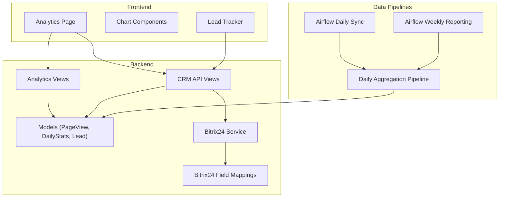
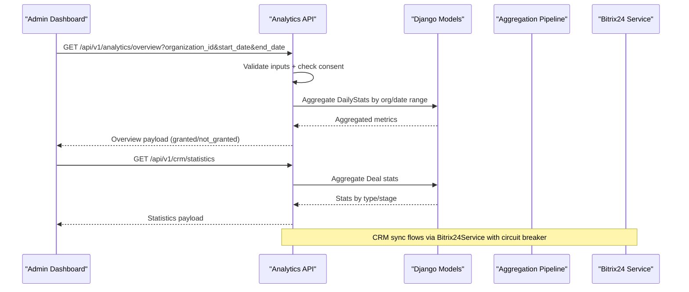
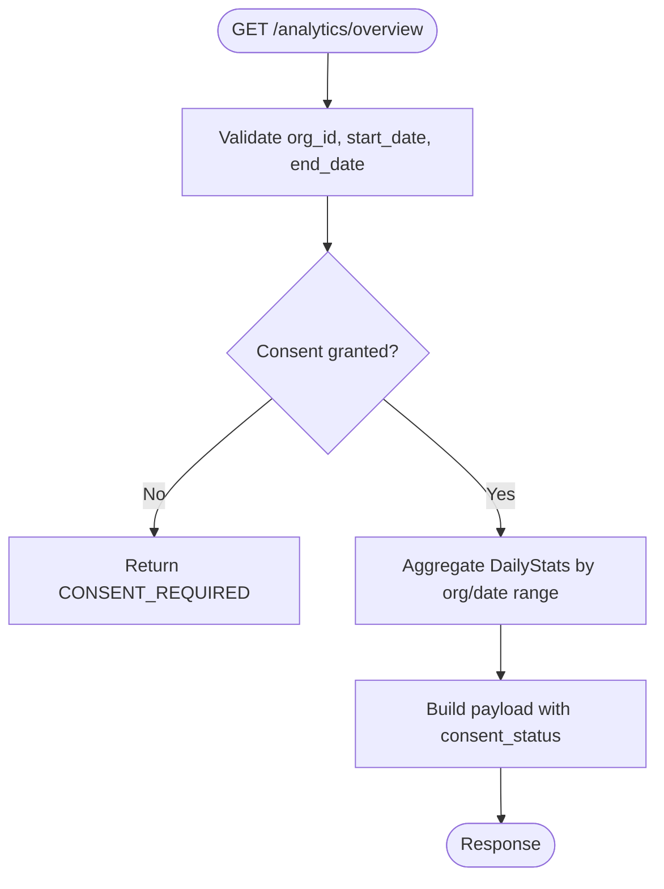
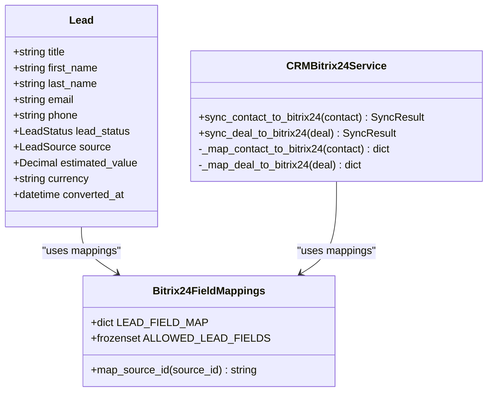
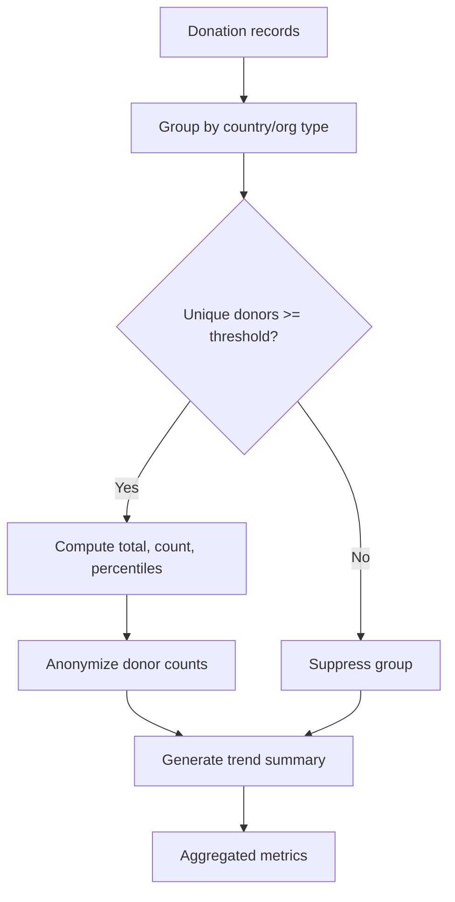
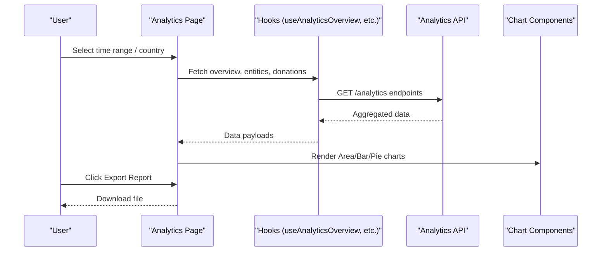
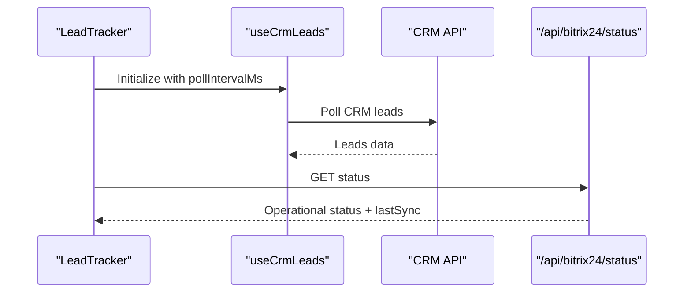
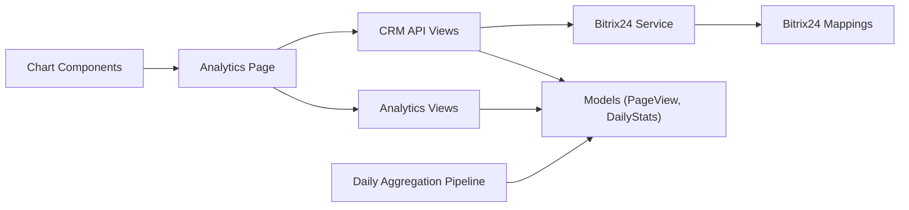

# Analytics & Reporting

<cite>
**Referenced Files in This Document**
- [analytics/models.py](file://backend/django/apps/analytics/models.py)
- [analytics/views.py](file://backend/django/apps/analytics/views.py)
- [analytics/serializers.py](file://backend/django/apps/analytics/serializers.py)
- [analytics/urls.py](file://backend/django/apps/analytics/urls.py)
- [crm/models.py](file://backend/django/apps/crm/models.py)
- [crm/api/views.py](file://backend/django/apps/crm/api/views.py)
- [integrations/bitrix24_mappings.py](file://backend/django/apps/integrations/bitrix24_mappings.py)
- [bitrix24_service.py](file://backend/django/apps/crm/bitrix24_service.py)
- [daily_aggregation.py](file://data/src/pipelines/donation_analytics/daily_aggregation.py)
- [jol_daily_sync.py](file://data/airflow/dags/jol_daily_sync.py)
- [jol_weekly_reporting.py](file://data/airflow/dags/jol_weekly_reporting.py)
- [charts.tsx](file://frontend/apps/admin-dashboard/src/components/charts/charts.tsx)
- [analytics/page.tsx](file://frontend/apps/admin-dashboard/src/app/(dashboard)/analytics/page.tsx)
- [LeadTracker.tsx](file://frontend/apps/template-renderer/src/components/crm/LeadTracker.tsx)
- [useBitrix24.ts](file://frontend/apps/admin-dashboard/src/hooks/useBitrix24.ts)
- [route.ts](file://frontend/apps/admin-dashboard/src/app/api/bitrix24/status/route.ts)
</cite>

## Table of Contents
1. Introduction
2. Project Structure
3. Core Components
4. Architecture Overview
5. Detailed Component Analysis
6. Dependency Analysis
7. Performance Considerations
8. Troubleshooting Guide
9. Conclusion
10. Appendices

## Introduction
This document explains the analytics and reporting dashboard that provides business intelligence and performance metrics. It covers:
- Chart components built on top of a visualization library
- Real-time data updates for CRM lead tracking
- Metric calculations and aggregation pipelines
- Integration with Bitrix24 CRM for leads, contacts, and deals
- Customizable dashboard layouts, export capabilities, and automated report generation
- How to add new metrics, create custom visualizations, and configure data sources

The system enforces GDPR-compliant analytics (consent checks, k-anonymity, aggregated outputs) while exposing actionable insights through a modern frontend dashboard.

## Project Structure
The analytics and reporting system spans backend services, data pipelines, and a React-based admin dashboard:
- Backend Django app exposes analytics APIs with consent enforcement and aggregated metrics
- CRM module integrates with Bitrix24 via an abstraction layer and field mappings
- Data pipelines compute donation analytics and daily aggregations
- Frontend renders charts, filters, and real-time lead tracking

**Diagram sources**
- [analytics/views.py:173-241](file://backend/django/apps/analytics/views.py#L173-L241)
- [analytics/models.py:12-174](file://backend/django/apps/analytics/models.py#L12-L174)
- [crm/api/views.py:141-445](file://backend/django/apps/crm/api/views.py#L141-L445)
- [bitrix24_service.py:238-572](file://backend/django/apps/crm/bitrix24_service.py#L238-L572)
- [daily_aggregation.py:62-242](file://data/src/pipelines/donation_analytics/daily_aggregation.py#L62-L242)
- [charts.tsx:1-387](file://frontend/apps/admin-dashboard/src/components/charts/charts.tsx#L1-L387)
- [analytics/page.tsx:35-333](file://frontend/apps/admin-dashboard/src/app/(dashboard)/analytics/page.tsx#L35-L333)

**Section sources**
- [analytics/views.py:173-241](file://backend/django/apps/analytics/views.py#L173-L241)
- [analytics/models.py:12-174](file://backend/django/apps/analytics/models.py#L12-L174)
- [crm/api/views.py:141-445](file://backend/django/apps/crm/api/views.py#L141-L445)
- [daily_aggregation.py:62-242](file://data/src/pipelines/donation_analytics/daily_aggregation.py#L62-L242)
- [charts.tsx:1-387](file://frontend/apps/admin-dashboard/src/components/charts/charts.tsx#L1-L387)
- [analytics/page.tsx:35-333](file://frontend/apps/admin-dashboard/src/app/(dashboard)/analytics/page.tsx#L35-L333)

## Core Components
- Analytics models store raw page-view events and pre-aggregated daily statistics with tenant isolation and consent flags.
- Analytics views expose endpoints for overview and daily stats, enforcing consent checks and input validation.
- CRM models include Lead entities tied to Bitrix24 lifecycle stages and conversion tracking.
- Bitrix24 integration uses a service layer with circuit breaker protection, mapping fields between systems.
- Donation analytics pipeline computes k-anonymized metrics and trends.
- Frontend dashboard renders charts, supports time range and country filters, and includes export actions.

Key responsibilities:
- Consent-gated analytics retrieval and aggregation
- Secure, validated API responses
- Bitrix24 synchronization with fail-safe behavior
- Privacy-preserving aggregation and trend computation
- Reusable chart components and dashboard layout

**Section sources**
- [analytics/models.py:12-174](file://backend/django/apps/analytics/models.py#L12-L174)
- [analytics/views.py:173-241](file://backend/django/apps/analytics/views.py#L173-L241)
- [crm/models.py:377-502](file://backend/django/apps/crm/models.py#L377-L502)
- [bitrix24_service.py:238-572](file://backend/django/apps/crm/bitrix24_service.py#L238-L572)
- [daily_aggregation.py:62-242](file://data/src/pipelines/donation_analytics/daily_aggregation.py#L62-L242)
- [charts.tsx:1-387](file://frontend/apps/admin-dashboard/src/components/charts/charts.tsx#L1-L387)
- [analytics/page.tsx:35-333](file://frontend/apps/admin-dashboard/src/app/(dashboard)/analytics/page.tsx#L35-L333)

## Architecture Overview
The architecture separates concerns across layers:
- Frontend: Dashboard UI with reusable chart components and real-time lead tracking
- Backend: Django REST APIs for analytics and CRM, with strict consent and validation
- Integration: Bitrix24 client factory and service with circuit breaker and audit logging
- Data Pipelines: Airflow DAGs orchestrate daily and weekly analytics and compliance reporting

**Diagram sources**
- [analytics/views.py:173-241](file://backend/django/apps/analytics/views.py#L173-L241)
- [crm/api/views.py:415-445](file://backend/django/apps/crm/api/views.py#L415-L445)
- [bitrix24_service.py:238-572](file://backend/django/apps/crm/bitrix24_service.py#L238-L572)

## Detailed Component Analysis

### Analytics API and Consent Enforcement
- Input validation ensures safe organization IDs and date ranges
- Consent gating prevents returning analytics without explicit consent
- Aggregation queries compute totals and averages from DailyStats
- Top parishes endpoint applies k-anonymity thresholds and audits access

**Diagram sources**
- [analytics/views.py:173-241](file://backend/django/apps/analytics/views.py#L173-L241)

**Section sources**
- [analytics/views.py:173-241](file://backend/django/apps/analytics/views.py#L173-L241)
- [analytics/models.py:107-174](file://backend/django/apps/analytics/models.py#L107-L174)

### CRM Lead Tracking and Conversion Metrics
- Lead model captures lifecycle stages, source, estimated value, and conversion metadata
- Bitrix24 field mappings enforce allowed fields and transform values safely
- CRM API exposes statistics and operations with tenant isolation and rate limiting

**Diagram sources**
- [crm/models.py:377-502](file://backend/django/apps/crm/models.py#L377-L502)
- [integrations/bitrix24_mappings.py:87-136](file://backend/django/apps/integrations/bitrix24_mappings.py#L87-L136)
- [bitrix24_service.py:238-572](file://backend/django/apps/crm/bitrix24_service.py#L238-L572)

**Section sources**
- [crm/models.py:377-502](file://backend/django/apps/crm/models.py#L377-L502)
- [integrations/bitrix24_mappings.py:87-136](file://backend/django/apps/integrations/bitrix24_mappings.py#L87-L136)
- [crm/api/views.py:415-445](file://backend/django/apps/crm/api/views.py#L415-L445)

### Donation Analytics Pipeline
- Groups donations by country and organization type
- Enforces minimum donor counts for reporting (k-anonymity)
- Computes percentiles and anonymizes unique donor counts
- Generates trend summaries without individual-level data

**Diagram sources**
- [daily_aggregation.py:82-242](file://data/src/pipelines/donation_analytics/daily_aggregation.py#L82-L242)

**Section sources**
- [daily_aggregation.py:82-242](file://data/src/pipelines/donation_analytics/daily_aggregation.py#L82-L242)

### Frontend Dashboard and Charts
- Time range and country filters drive data requests
- Derived stats computed from API responses
- Reusable chart components render area, bar, and pie charts
- Export Report button triggers download action; Refresh re-fetches data

**Diagram sources**
- [analytics/page.tsx:35-333](file://frontend/apps/admin-dashboard/src/app/(dashboard)/analytics/page.tsx#L35-L333)
- [charts.tsx:1-387](file://frontend/apps/admin-dashboard/src/components/charts/charts.tsx#L1-L387)

**Section sources**
- [analytics/page.tsx:35-333](file://frontend/apps/admin-dashboard/src/app/(dashboard)/analytics/page.tsx#L35-L333)
- [charts.tsx:1-387](file://frontend/apps/admin-dashboard/src/components/charts/charts.tsx#L1-L387)

### Real-Time Updates and CRM Status
- Lead tracker polls CRM data with configurable intervals
- Bitrix24 status route returns operational health and sync state
- Optional SSE hook connects to stream endpoint for real-time updates

**Diagram sources**
- [LeadTracker.tsx:33-85](file://frontend/apps/template-renderer/src/components/crm/LeadTracker.tsx#L33-L85)
- [route.ts:1-11](file://frontend/apps/admin-dashboard/src/app/api/bitrix24/status/route.ts#L1-L11)
- [useBitrix24.ts:161-201](file://frontend/apps/admin-dashboard/src/hooks/useBitrix24.ts#L161-L201)

**Section sources**
- [LeadTracker.tsx:33-85](file://frontend/apps/template-renderer/src/components/crm/LeadTracker.tsx#L33-L85)
- [route.ts:1-11](file://frontend/apps/admin-dashboard/src/app/api/bitrix24/status/route.ts#L1-L11)
- [useBitrix24.ts:161-201](file://frontend/apps/admin-dashboard/src/hooks/useBitrix24.ts#L161-L201)

## Dependency Analysis
- Analytics views depend on Django models and serializers; they enforce consent and validate inputs before querying aggregated stats
- CRM API depends on models and Bitrix24 service for synchronization and statistics
- Bitrix24 service depends on field mappings and client factory for tenant-aware configuration and circuit breaker
- Data pipelines depend on aggregation logic and produce outputs consumed by analytics APIs
- Frontend depends on hooks and chart components to render dashboards and handle user interactions

**Diagram sources**
- [analytics/views.py:173-241](file://backend/django/apps/analytics/views.py#L173-L241)
- [crm/api/views.py:141-445](file://backend/django/apps/crm/api/views.py#L141-L445)
- [bitrix24_service.py:238-572](file://backend/django/apps/crm/bitrix24_service.py#L238-L572)
- [daily_aggregation.py:62-242](file://data/src/pipelines/donation_analytics/daily_aggregation.py#L62-L242)
- [charts.tsx:1-387](file://frontend/apps/admin-dashboard/src/components/charts/charts.tsx#L1-L387)
- [analytics/page.tsx:35-333](file://frontend/apps/admin-dashboard/src/app/(dashboard)/analytics/page.tsx#L35-L333)

**Section sources**
- [analytics/views.py:173-241](file://backend/django/apps/analytics/views.py#L173-L241)
- [crm/api/views.py:141-445](file://backend/django/apps/crm/api/views.py#L141-L445)
- [bitrix24_service.py:238-572](file://backend/django/apps/crm/bitrix24_service.py#L238-L572)
- [daily_aggregation.py:62-242](file://data/src/pipelines/donation_analytics/daily_aggregation.py#L62-L242)
- [charts.tsx:1-387](file://frontend/apps/admin-dashboard/src/components/charts/charts.tsx#L1-L387)
- [analytics/page.tsx:35-333](file://frontend/apps/admin-dashboard/src/app/(dashboard)/analytics/page.tsx#L35-L333)

## Performance Considerations
- Use aggregated DailyStats for overview queries to reduce database load
- Apply k-anonymity thresholds to avoid expensive per-entity computations for small groups
- Limit date ranges and result sets in APIs to prevent DoS and improve response times
- Cache Bitrix24 client configurations per tenant to reduce initialization overhead
- Rate-limit sensitive operations (exports, financial actions) to protect resources
- Prefer server-side filtering and ordering in CRM endpoints for large datasets

[No sources needed since this section provides general guidance]

## Troubleshooting Guide
Common issues and resolutions:
- Consent required errors: Ensure organization has analytics consent enabled before requesting analytics data
- Validation errors: Verify organization_id is a valid UUID and dates are within allowed ranges
- Bitrix24 sync failures: Check circuit breaker state and retry after transient failures; review audit logs for error details
- Empty charts or no data: Confirm time range and country filters; verify aggregation pipeline ran successfully
- Real-time connection drops: Inspect SSE stream availability and reconnect logic in hooks

**Section sources**
- [analytics/views.py:173-241](file://backend/django/apps/analytics/views.py#L173-L241)
- [crm/api/views.py:587-634](file://backend/django/apps/crm/api/views.py#L587-L634)
- [bitrix24_service.py:238-572](file://backend/django/apps/crm/bitrix24_service.py#L238-L572)
- [useBitrix24.ts:161-201](file://frontend/apps/admin-dashboard/src/hooks/useBitrix24.ts#L161-L201)

## Conclusion
The analytics and reporting system delivers privacy-first, consent-gated insights through robust backend APIs, secure integrations with Bitrix24, and a flexible frontend dashboard. Aggregation pipelines ensure k-anonymity and compliance, while reusable chart components enable customizable visualizations. Automated reporting and export capabilities support ongoing business intelligence needs.

[No sources needed since this section summarizes without analyzing specific files]

## Appendices

### Adding New Metrics
Steps:
- Define or extend models if storing new raw or aggregated metrics
- Implement aggregation logic in the donation analytics pipeline or daily aggregation
- Expose new metrics via analytics or CRM API endpoints with proper validation and consent checks
- Update frontend hooks to fetch and display new metrics
- Add chart rendering using existing chart components

**Section sources**
- [daily_aggregation.py:82-242](file://data/src/pipelines/donation_analytics/daily_aggregation.py#L82-L242)
- [analytics/views.py:173-241](file://backend/django/apps/analytics/views.py#L173-L241)
- [charts.tsx:1-387](file://frontend/apps/admin-dashboard/src/components/charts/charts.tsx#L1-L387)

### Creating Custom Visualizations
Steps:
- Use provided chart components (Area, Bar, Pie) with appropriate props
- Transform API data into chart-compatible structures
- Customize colors, legends, and tooltips via component options
- Wrap charts in ChartCard for consistent layout

**Section sources**
- [charts.tsx:1-387](file://frontend/apps/admin-dashboard/src/components/charts/charts.tsx#L1-L387)
- [analytics/page.tsx:35-333](file://frontend/apps/admin-dashboard/src/app/(dashboard)/analytics/page.tsx#L35-L333)

### Configuring Data Sources
Steps:
- Configure Bitrix24 credentials per tenant via organization settings
- Use Bitrix24ClientFactory to obtain tenant-specific clients
- Map fields using centralized mappings to ensure deterministic transformations
- Enable real-time updates via SSE hooks where applicable

**Section sources**
- [bitrix24_service.py:109-236](file://backend/django/apps/crm/bitrix24_service.py#L109-L236)
- [integrations/bitrix24_mappings.py:87-136](file://backend/django/apps/integrations/bitrix24_mappings.py#L87-L136)
- [useBitrix24.ts:161-201](file://frontend/apps/admin-dashboard/src/hooks/useBitrix24.ts#L161-L201)

### Export Capabilities and Automated Reports
- CRM API supports exporting contact data and audit logs with integrity verification
- Airflow DAGs schedule daily and weekly reporting tasks
- Export endpoints apply throttling and audit logging for compliance

**Section sources**
- [crm/api/views.py:587-634](file://backend/django/apps/crm/api/views.py#L587-L634)
- [jol_daily_sync.py:53-80](file://data/airflow/dags/jol_daily_sync.py#L53-L80)
- [jol_weekly_reporting.py:52-77](file://data/airflow/dags/jol_weekly_reporting.py#L52-L77)