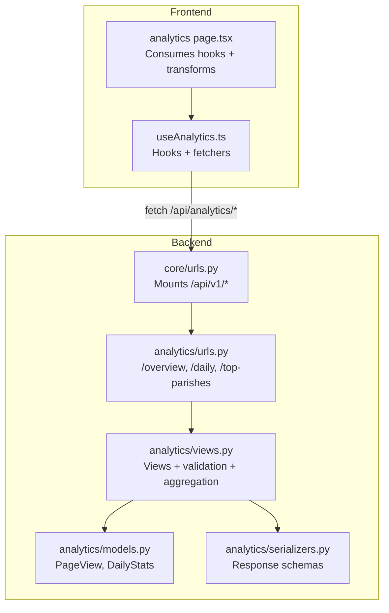
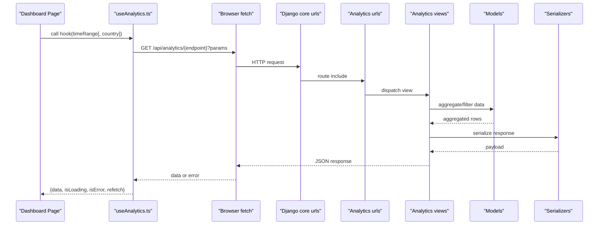
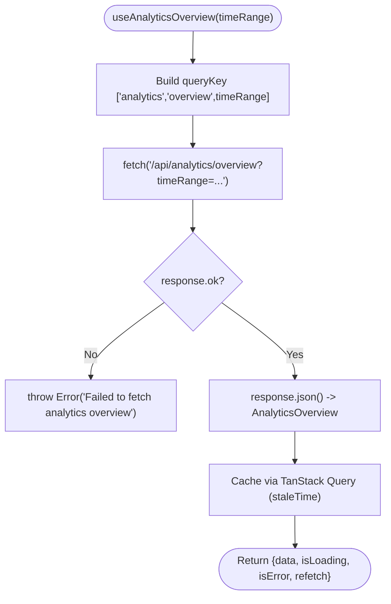
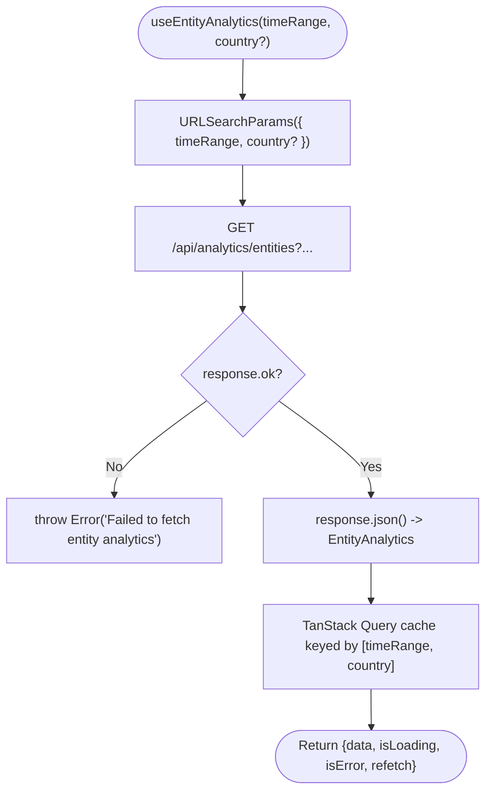
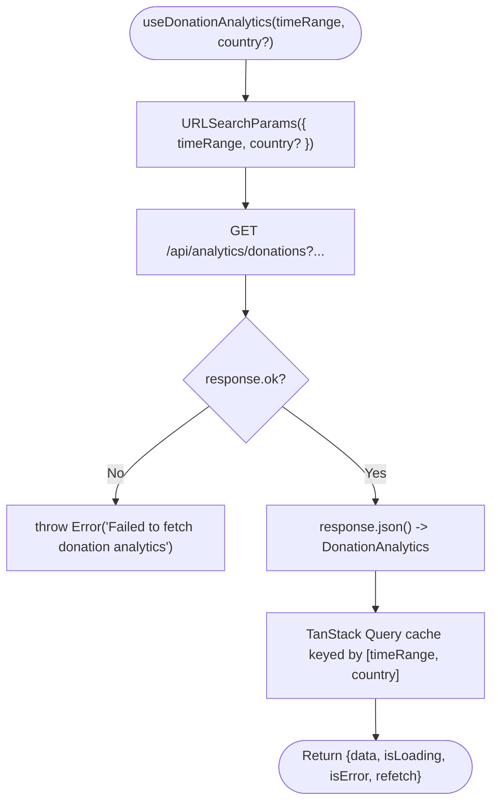
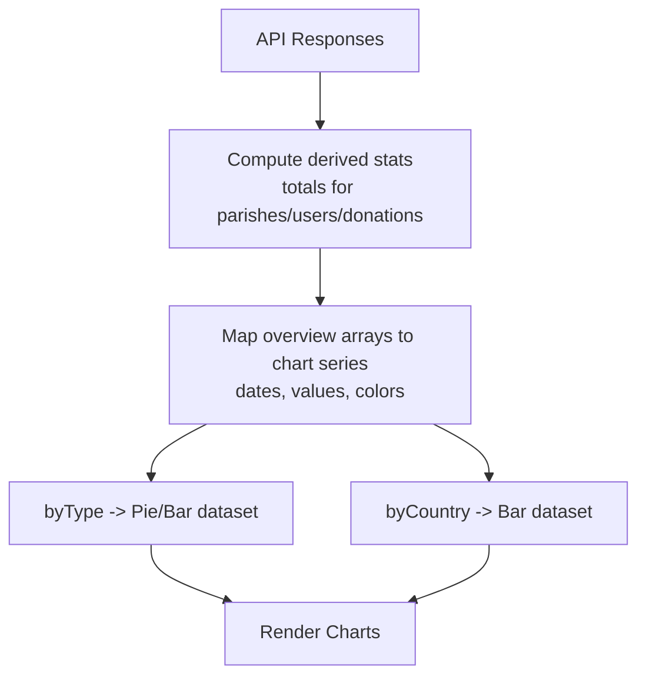
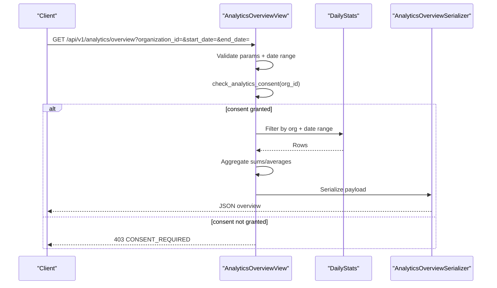
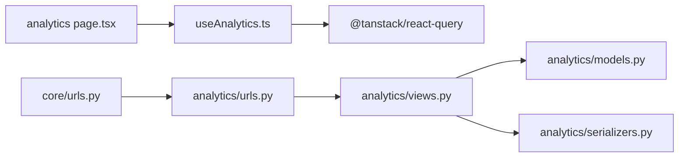

# Analytics Data Hooks & API Integration

<cite>
**Referenced Files in This Document**
- [useAnalytics.ts](file://frontend/apps/admin-dashboard/src/lib/hooks/useAnalytics.ts)
- [index.ts](file://frontend/apps/admin-dashboard/src/lib/hooks/index.ts)
- [analytics page](file://frontend/apps/admin-dashboard/src/app/(dashboard)/analytics/page.tsx)
- [views.py](file://backend/django/apps/analytics/views.py)
- [urls.py](file://backend/django/apps/analytics/urls.py)
- [models.py](file://backend/django/apps/analytics/models.py)
- [serializers.py](file://backend/django/apps/analytics/serializers.py)
- [core urls](file://backend/django/core/urls.py)
- [openapi-spec.yaml](file://docs/api/openapi-spec.yaml)
</cite>

## Table of Contents
1. Introduction
2. Project Structure
3. Core Components
4. Architecture Overview
5. Detailed Component Analysis
6. Dependency Analysis
7. Performance Considerations
8. Troubleshooting Guide
9. Conclusion
10. Appendices

## Introduction
This document explains the analytics data hooks that fetch and process dashboard metrics for platform-wide, entity-specific, and financial (donation) views. It covers:
- useAnalyticsOverview for platform-wide metrics
- useEntityAnalytics for entity-specific data
- useDonationAnalytics for financial metrics
It also details the end-to-end data transformation pipeline from API responses to chart-ready formats, error handling, loading states, caching strategies, and how to add new endpoints or custom hooks. Real-time update patterns are included as guidance.

## Project Structure
The analytics feature spans frontend hooks and backend Django views with clear separation:
- Frontend: React hooks using TanStack Query to fetch and cache analytics data; a dashboard page consumes these hooks and transforms data for charts.
- Backend: Django REST views that enforce consent, validate inputs, aggregate statistics, and return serialized responses. URLs are mounted under /api/v1/analytics/.

**Diagram sources**
- [useAnalytics.ts:33-61](file://frontend/apps/admin-dashboard/src/lib/hooks/useAnalytics.ts#L33-L61)
- [analytics page:39-72](file://frontend/apps/admin-dashboard/src/app/(dashboard)/analytics/page.tsx#L39-L72)
- [core urls:52-59](file://backend/django/core/urls.py#L52-L59)
- [urls.py:6-10](file://backend/django/apps/analytics/urls.py#L6-L10)
- [views.py:173-241](file://backend/django/apps/analytics/views.py#L173-L241)
- [models.py:12-174](file://backend/django/apps/analytics/models.py#L12-L174)
- [serializers.py:35-70](file://backend/django/apps/analytics/serializers.py#L35-L70)

**Section sources**
- [useAnalytics.ts:1-89](file://frontend/apps/admin-dashboard/src/lib/hooks/useAnalytics.ts#L1-L89)
- [analytics page:1-113](file://frontend/apps/admin-dashboard/src/app/(dashboard)/analytics/page.tsx#L1-L113)
- [core urls:38-63](file://backend/django/core/urls.py#L38-L63)
- [urls.py:1-11](file://backend/django/apps/analytics/urls.py#L1-L11)
- [views.py:1-458](file://backend/django/apps/analytics/views.py#L1-L458)
- [models.py:1-174](file://backend/django/apps/analytics/models.py#L1-L174)
- [serializers.py:1-70](file://backend/django/apps/analytics/serializers.py#L1-L70)

## Core Components
- useAnalyticsOverview(timeRange): Fetches platform-wide overview metrics via /api/analytics/overview?timeRange=... and caches results with TanStack Query.
- useEntityAnalytics(timeRange, country?): Fetches entity distribution by type and country via /api/analytics/entities?timeRange=...&country=....
- useDonationAnalytics(timeRange, country?): Fetches donation totals by country via /api/analytics/donations?timeRange=...&country=....

All three hooks:
- Use TanStack Query’s useQuery with query keys scoped by metric and parameters.
- Set staleTime to reduce redundant network calls.
- Throw errors on non-OK responses, which surfaces as loading/error states in components.

**Section sources**
- [useAnalytics.ts:33-88](file://frontend/apps/admin-dashboard/src/lib/hooks/useAnalytics.ts#L33-L88)
- [index.ts:21-26](file://frontend/apps/admin-dashboard/src/lib/hooks/index.ts#L21-L26)

## Architecture Overview
End-to-end flow from UI to backend and back:

**Diagram sources**
- [useAnalytics.ts:33-88](file://frontend/apps/admin-dashboard/src/lib/hooks/useAnalytics.ts#L33-L88)
- [core urls:52-59](file://backend/django/core/urls.py#L52-L59)
- [urls.py:6-10](file://backend/django/apps/analytics/urls.py#L6-L10)
- [views.py:173-241](file://backend/django/apps/analytics/views.py#L173-L241)
- [models.py:107-174](file://backend/django/apps/analytics/models.py#L107-L174)
- [serializers.py:35-70](file://backend/django/apps/analytics/serializers.py#L35-L70)

## Detailed Component Analysis

### useAnalyticsOverview
- Purpose: Platform-wide metrics over a time range.
- Request: GET /api/analytics/overview?timeRange=...
- Response shape consumed by UI includes arrays for parishes/users/donations over time plus summary fields.
- Caching: Uses TanStack Query with a stable query key and staleTime to avoid frequent refetches.
- Error handling: Non-OK responses throw an error surfaced to components.

**Diagram sources**
- [useAnalytics.ts:33-70](file://frontend/apps/admin-dashboard/src/lib/hooks/useAnalytics.ts#L33-L70)

**Section sources**
- [useAnalytics.ts:33-70](file://frontend/apps/admin-dashboard/src/lib/hooks/useAnalytics.ts#L33-L70)

### useEntityAnalytics
- Purpose: Entity distribution by type and by country.
- Request: GET /api/analytics/entities?timeRange=...&country=...
- Response shape: byType array and byCountry array.
- Caching: Scoped by timeRange and optional country.

**Diagram sources**
- [useAnalytics.ts:39-79](file://frontend/apps/admin-dashboard/src/lib/hooks/useAnalytics.ts#L39-L79)

**Section sources**
- [useAnalytics.ts:39-79](file://frontend/apps/admin-dashboard/src/lib/hooks/useAnalytics.ts#L39-L79)

### useDonationAnalytics
- Purpose: Financial metrics by country.
- Request: GET /api/analytics/donations?timeRange=...&country=...
- Response shape: byCountry array with totalAmount and transactionCount.
- Caching: Scoped by timeRange and optional country.

**Diagram sources**
- [useAnalytics.ts:51-88](file://frontend/apps/admin-dashboard/src/lib/hooks/useAnalytics.ts#L51-L88)

**Section sources**
- [useAnalytics.ts:51-88](file://frontend/apps/admin-dashboard/src/lib/hooks/useAnalytics.ts#L51-L88)

### Dashboard Data Transformation Pipeline
The analytics page consumes hooks and transforms raw API arrays into chart-ready structures:
- Aggregates totals from overview arrays.
- Maps dates to formatted labels for time series.
- Builds pie/bar chart datasets from byType/byCountry arrays.

**Diagram sources**
- [analytics page:43-72](file://frontend/apps/admin-dashboard/src/app/(dashboard)/analytics/page.tsx#L43-L72)

**Section sources**
- [analytics page:39-72](file://frontend/apps/admin-dashboard/src/app/(dashboard)/analytics/page.tsx#L39-L72)

### Backend Consent and Validation (Overview Endpoint)
The overview endpoint enforces consent and validates inputs before aggregating:
- Validates organization_id and date range.
- Checks analytics consent; denies access if not granted.
- Aggregates daily stats and serializes the result.

**Diagram sources**
- [views.py:173-241](file://backend/django/apps/analytics/views.py#L173-L241)
- [serializers.py:35-54](file://backend/django/apps/analytics/serializers.py#L35-L54)

**Section sources**
- [views.py:173-241](file://backend/django/apps/analytics/views.py#L173-L241)
- [serializers.py:35-54](file://backend/django/apps/analytics/serializers.py#L35-L54)

## Dependency Analysis
- Frontend hooks depend on TanStack Query for caching and lifecycle management.
- The dashboard page depends on hooks and local utilities for formatting and chart rendering.
- Backend routes mount analytics under /api/v1/analytics/, which delegates to views that read models and serialize responses.

**Diagram sources**
- [useAnalytics.ts:9-9](file://frontend/apps/admin-dashboard/src/lib/hooks/useAnalytics.ts#L9-L9)
- [analytics page:16-16](file://frontend/apps/admin-dashboard/src/app/(dashboard)/analytics/page.tsx#L16-L16)
- [core urls:52-59](file://backend/django/core/urls.py#L52-L59)
- [urls.py:6-10](file://backend/django/apps/analytics/urls.py#L6-L10)
- [views.py:173-241](file://backend/django/apps/analytics/views.py#L173-L241)
- [models.py:107-174](file://backend/django/apps/analytics/models.py#L107-L174)
- [serializers.py:35-70](file://backend/django/apps/analytics/serializers.py#L35-L70)

**Section sources**
- [useAnalytics.ts:1-89](file://frontend/apps/admin-dashboard/src/lib/hooks/useAnalytics.ts#L1-L89)
- [analytics page:1-113](file://frontend/apps/admin-dashboard/src/app/(dashboard)/analytics/page.tsx#L1-L113)
- [core urls:38-63](file://backend/django/core/urls.py#L38-L63)
- [urls.py:1-11](file://backend/django/apps/analytics/urls.py#L1-L11)
- [views.py:1-458](file://backend/django/apps/analytics/views.py#L1-L458)
- [models.py:1-174](file://backend/django/apps/analytics/models.py#L1-L174)
- [serializers.py:1-70](file://backend/django/apps/analytics/serializers.py#L1-L70)

## Performance Considerations
- Caching: All hooks set staleTime to reduce network load. Consider tuning based on dashboard refresh cadence.
- Query keys: Include all changing parameters (timeRange, country) to ensure correct cache isolation.
- Aggregation: Backend aggregates at the database level to minimize payload size.
- Consent checks: Early exit when consent is missing avoids unnecessary queries.

[No sources needed since this section provides general guidance]

## Troubleshooting Guide
Common issues and where they surface:
- Network or server errors: Hooks throw errors on non-OK responses; components should handle isLoading and isError states.
- Consent denied: Backend returns 403 with a consent-related error; ensure organizations have analytics consent enabled.
- Invalid parameters: Backend validates organization_id and date ranges; malformed inputs return 400 errors.

Recommendations:
- In components, display retry actions and user-friendly messages when errors occur.
- For consent errors, guide users to enable analytics consent in organization settings.
- Log client-side errors for observability and debugging.

**Section sources**
- [useAnalytics.ts:33-61](file://frontend/apps/admin-dashboard/src/lib/hooks/useAnalytics.ts#L33-L61)
- [views.py:186-241](file://backend/django/apps/analytics/views.py#L186-L241)

## Conclusion
The analytics hooks provide a clean, cached, and typed interface to platform, entity, and donation metrics. The backend enforces consent and input validation while aggregating data efficiently. The dashboard transforms API responses into chart-ready formats. Extending the system involves adding new endpoints and corresponding hooks following the established patterns.

[No sources needed since this section summarizes without analyzing specific files]

## Appendices

### Adding a New Analytics Endpoint
Steps:
1. Define a new view in backend/django/apps/analytics/views.py with input validation and consent checks.
2. Add URL pattern in backend/django/apps/analytics/urls.py.
3. Expose schema in docs/api/openapi-spec.yaml if applicable.
4. Create a new fetcher function and hook in frontend/apps/admin-dashboard/src/lib/hooks/useAnalytics.ts.
5. Re-export the hook from frontend/apps/admin-dashboard/src/lib/hooks/index.ts.
6. Consume the hook in your dashboard page and transform data for charts.

**Section sources**
- [views.py:173-241](file://backend/django/apps/analytics/views.py#L173-L241)
- [urls.py:6-10](file://backend/django/apps/analytics/urls.py#L6-L10)
- [openapi-spec.yaml:828-868](file://docs/api/openapi-spec.yaml#L828-L868)
- [useAnalytics.ts:33-88](file://frontend/apps/admin-dashboard/src/lib/hooks/useAnalytics.ts#L33-L88)
- [index.ts:21-26](file://frontend/apps/admin-dashboard/src/lib/hooks/index.ts#L21-L26)

### Creating Custom Hooks for New Metrics
- Follow the existing pattern: define a fetcher that builds URLSearchParams and calls fetch, then wrap with useQuery using a stable queryKey.
- Keep staleTime appropriate to your data freshness needs.
- Export the hook from index.ts for centralized imports.

**Section sources**
- [useAnalytics.ts:33-88](file://frontend/apps/admin-dashboard/src/lib/hooks/useAnalytics.ts#L33-L88)
- [index.ts:21-26](file://frontend/apps/admin-dashboard/src/lib/hooks/index.ts#L21-L26)

### Implementing Real-Time Data Updates
Options:
- Polling: Configure useQuery refetchInterval to periodically refresh data.
- Manual refresh: Expose refetch from hooks and trigger on user actions (e.g., Refresh button).
- Server push: If available, integrate WebSocket or SSE to invalidate queries on updates.

Note: Ensure polling intervals align with data latency and performance budgets.

[No sources needed since this section provides general guidance]