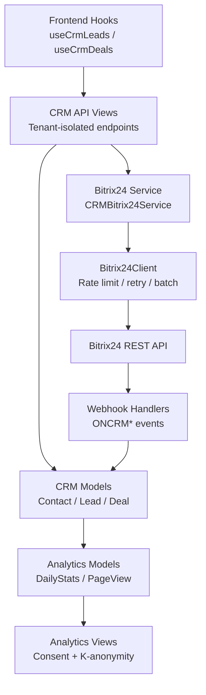
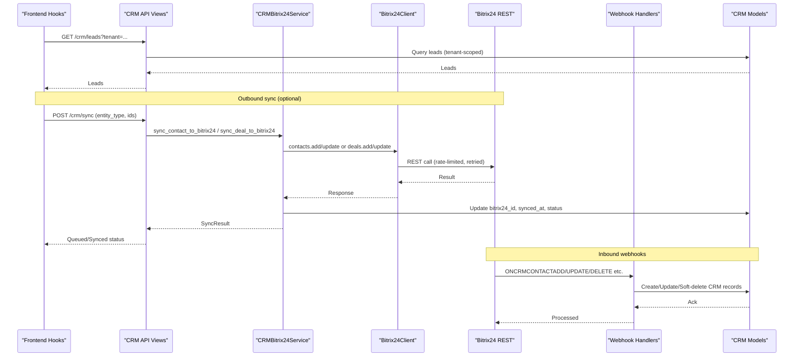
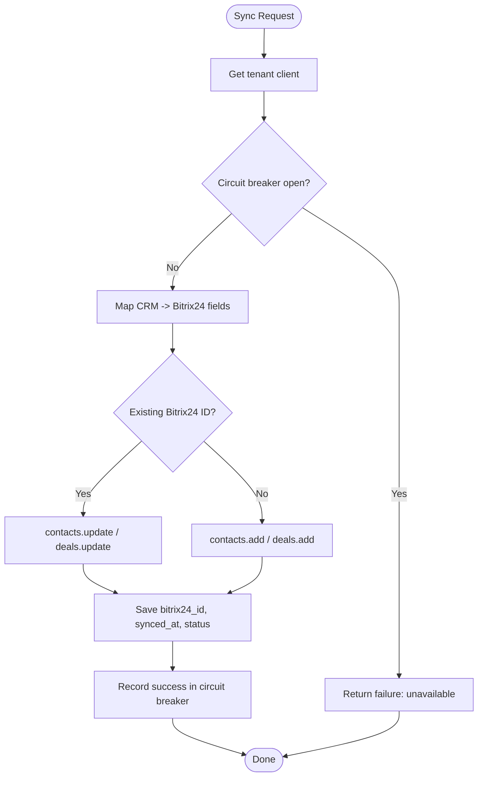
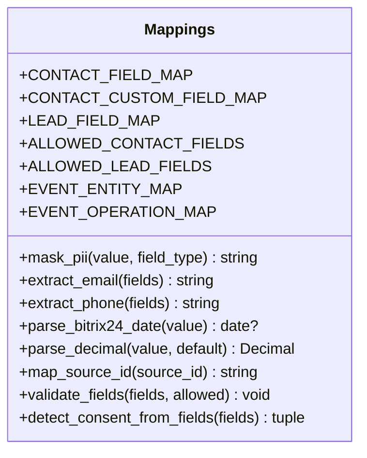
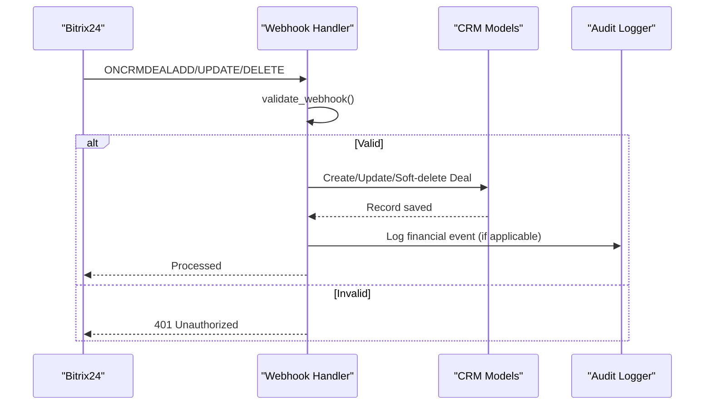
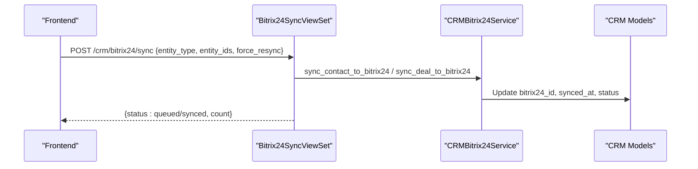
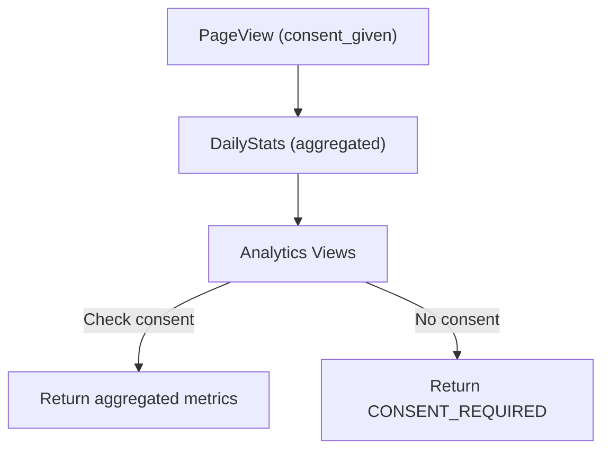
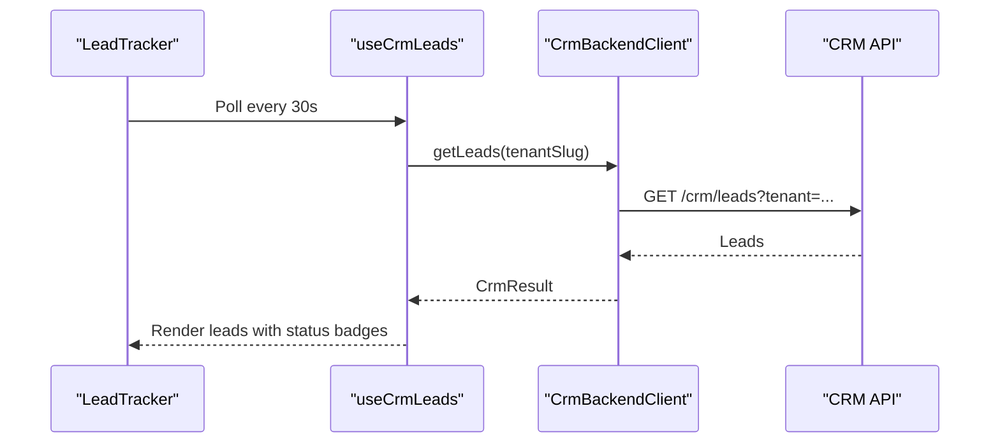
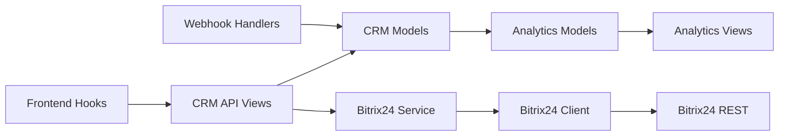

# CRM Integration & Lead Analytics

<cite>
**Referenced Files in This Document**
- [bitrix24_service.py](file://backend/django/apps/crm/bitrix24_service.py)
- [bitrix24_mappings.py](file://backend/django/apps/integrations/bitrix24_mappings.py)
- [client.py](file://backend/integrations/bitrix24/client.py)
- [models.py (CRM)](file://backend/django/apps/crm/models.py)
- [views.py (CRM API)](file://backend/django/apps/crm/api/views.py)
- [handlers.py (Webhooks)](file://backend/integrations/bitrix24/webhooks/handlers.py)
- [models.py (Analytics)](file://backend/django/apps/analytics/models.py)
- [views.py (Analytics)](file://backend/django/apps/analytics/views.py)
- [hooks.ts](file://frontend/packages/bitrix-sdk/src/hooks.ts)
- [backend-client.ts](file://frontend/packages/bitrix-sdk/src/backend-client.ts)
- [LeadTracker.tsx](file://frontend/apps/template-renderer/src/components/crm/LeadTracker.tsx)
</cite>

## Table of Contents
1. [Introduction](#introduction)
2. [Project Structure](#project-structure)
3. [Core Components](#core-components)
4. [Architecture Overview](#architecture-overview)
5. [Detailed Component Analysis](#detailed-component-analysis)
6. [Dependency Analysis](#dependency-analysis)
7. [Performance Considerations](#performance-considerations)
8. [Troubleshooting Guide](#troubleshooting-guide)
9. [Conclusion](#conclusion)
10. [Appendices](#appendices)

## Introduction
This document explains the CRM integration features that connect the platform to Bitrix24 for contact and deal synchronization, lead tracking, and conversion metrics. It covers how CRM data flows into analytics dashboards, how it contributes to lead scoring inputs, and how to configure connections, map fields, and generate CRM-specific reports. It also addresses data privacy and GDPR compliance throughout the pipeline.

## Project Structure
The CRM integration spans backend Django apps, a dedicated Bitrix24 integration layer, and frontend SDK hooks:
- Backend CRM app models and APIs expose tenant-scoped entities with consent, legal hold, and audit controls.
- The Bitrix24 abstraction provides client factory, circuit breaker, field mapping, and sync services.
- Webhook handlers receive events from Bitrix24 and synchronize them back into local CRM records.
- Analytics models store page views and daily stats; views enforce consent and k-anonymity.
- Frontend SDK exposes React hooks to fetch CRM data via the hub backend, never touching Bitrix24 directly.

**Diagram sources**
- [views.py (CRM API):739-769](file://backend/django/apps/crm/api/views.py#L739-L769)
- [bitrix24_service.py:238-572](file://backend/django/apps/crm/bitrix24_service.py#L238-L572)
- [client.py:91-362](file://backend/integrations/bitrix24/client.py#L91-L362)
- [handlers.py:173-396](file://backend/integrations/bitrix24/webhooks/handlers.py#L173-L396)
- [models.py (Analytics):12-174](file://backend/django/apps/analytics/models.py#L12-L174)
- [views.py (Analytics):173-458](file://backend/django/apps/analytics/views.py#L173-L458)

**Section sources**
- [bitrix24_service.py:1-572](file://backend/django/apps/crm/bitrix24_service.py#L1-L572)
- [client.py:1-403](file://backend/integrations/bitrix24/client.py#L1-L403)
- [handlers.py:1-514](file://backend/integrations/bitrix24/webhooks/handlers.py#L1-L514)
- [models.py (CRM):1-800](file://backend/django/apps/crm/models.py#L1-L800)
- [views.py (CRM API):1-769](file://backend/django/apps/crm/api/views.py#L1-L769)
- [models.py (Analytics):1-174](file://backend/django/apps/analytics/models.py#L1-L174)
- [views.py (Analytics):1-458](file://backend/django/apps/analytics/views.py#L1-L458)
- [hooks.ts:1-208](file://frontend/packages/bitrix-sdk/src/hooks.ts#L1-L208)
- [backend-client.ts:1-262](file://frontend/packages/bitrix-sdk/src/backend-client.ts#L1-L262)
- [LeadTracker.tsx:1-85](file://frontend/apps/template-renderer/src/components/crm/LeadTracker.tsx#L1-L85)

## Core Components
- Bitrix24 Abstraction Layer:
  - Tenant-aware client factory with caching and circuit breaker.
  - Field mappings for contacts and deals, including custom UF_* fields.
  - Async sync methods for contacts and deals with conflict resolution strategies and audit logging.
- CRM Models:
  - Contact, Lead, Deal with tenant isolation, consent, legal hold, and Bitrix24 sync tracking fields.
  - AuditEntry for tamper-evident logs.
- Webhook Handlers:
  - Validate and route Bitrix24 events to create/update/delete local CRM records.
  - Soft deletes for audit trail and PCI-DSS financial event logging.
- Analytics:
  - PageView and DailyStats with consent checks and k-anonymity enforcement in views.
- Frontend SDK:
  - React hooks to fetch CRM data via hub backend with polling and error handling.
  - Backend client enforces tenant scoping and retries on transient errors.

**Section sources**
- [bitrix24_service.py:109-572](file://backend/django/apps/crm/bitrix24_service.py#L109-L572)
- [models.py (CRM):71-800](file://backend/django/apps/crm/models.py#L71-L800)
- [handlers.py:63-514](file://backend/integrations/bitrix24/webhooks/handlers.py#L63-L514)
- [models.py (Analytics):12-174](file://backend/django/apps/analytics/models.py#L12-L174)
- [views.py (Analytics):173-458](file://backend/django/apps/analytics/views.py#L173-L458)
- [hooks.ts:1-208](file://frontend/packages/bitrix-sdk/src/hooks.ts#L1-L208)
- [backend-client.ts:1-262](file://frontend/packages/bitrix-sdk/src/backend-client.ts#L1-L262)

## Architecture Overview
The system uses a hub-backed CRM surface where the frontend never talks to Bitrix24 directly. Data flows through the backend’s CRM API, which coordinates with Bitrix24 via an abstraction layer and webhook handlers.

**Diagram sources**
- [views.py (CRM API):739-769](file://backend/django/apps/crm/api/views.py#L739-L769)
- [bitrix24_service.py:302-469](file://backend/django/apps/crm/bitrix24_service.py#L302-L469)
- [client.py:168-321](file://backend/integrations/bitrix24/client.py#L168-L321)
- [handlers.py:173-396](file://backend/integrations/bitrix24/webhooks/handlers.py#L173-L396)

## Detailed Component Analysis

### Bitrix24 Synchronization Service
- Responsibilities:
  - Tenant-aware client creation and caching.
  - Circuit breaker to protect against cascading failures.
  - Mapping CRM entities to Bitrix24 fields (standard and custom UF_*).
  - Bidirectional sync with conflict resolution strategies and audit entries.
- Key behaviors:
  - Lazy loading of Bitrix24 client per tenant.
  - Rate-limit and auth error handling with circuit breaker state updates.
  - Updates local entity sync metadata (id, timestamp, status).

**Diagram sources**
- [bitrix24_service.py:109-236](file://backend/django/apps/crm/bitrix24_service.py#L109-L236)
- [bitrix24_service.py:302-469](file://backend/django/apps/crm/bitrix24_service.py#L302-L469)

**Section sources**
- [bitrix24_service.py:109-572](file://backend/django/apps/crm/bitrix24_service.py#L109-L572)

### Field Mappings and Transformations
- Centralized mappings ensure deterministic transformations and reject unknown fields.
- PII masking for audit logs to comply with GDPR.
- Helpers extract emails/phones, parse dates, and convert source IDs.

**Diagram sources**
- [bitrix24_mappings.py:25-162](file://backend/django/apps/integrations/bitrix24_mappings.py#L25-L162)
- [bitrix24_mappings.py:169-368](file://backend/django/apps/integrations/bitrix24_mappings.py#L169-L368)

**Section sources**
- [bitrix24_mappings.py:1-368](file://backend/django/apps/integrations/bitrix24_mappings.py#L1-L368)

### Webhook Processing and Local CRM Sync
- Validates authenticity using application token and optional signature.
- Routes events to handlers for contacts and deals.
- Creates or updates local CRM records and maintains soft-deletes for audit trails.
- Logs financial transactions for PCI-DSS compliance.

**Diagram sources**
- [handlers.py:100-152](file://backend/integrations/bitrix24/webhooks/handlers.py#L100-L152)
- [handlers.py:295-396](file://backend/integrations/bitrix24/webhooks/handlers.py#L295-L396)

**Section sources**
- [handlers.py:1-514](file://backend/integrations/bitrix24/webhooks/handlers.py#L1-L514)

### CRM API and Sync Endpoint
- Provides tenant-isolated CRUD for contacts and deals.
- Includes actions for consent management, data export, payment marking, refunds, and statistics.
- Exposes a Bitrix24 sync endpoint to queue or trigger synchronization.

**Diagram sources**
- [views.py (CRM API):739-769](file://backend/django/apps/crm/api/views.py#L739-L769)
- [bitrix24_service.py:302-469](file://backend/django/apps/crm/bitrix24_service.py#L302-L469)

**Section sources**
- [views.py (CRM API):1-769](file://backend/django/apps/crm/api/views.py#L1-L769)

### Analytics Integration and Consent Controls
- PageView stores raw events with anonymized IPs and consent flags.
- DailyStats aggregates page views, unique visitors, sessions, bounce rate, and donation metrics.
- Analytics views enforce organization consent and apply k-anonymity to prevent re-identification.

**Diagram sources**
- [models.py (Analytics):12-174](file://backend/django/apps/analytics/models.py#L12-L174)
- [views.py (Analytics):173-458](file://backend/django/apps/analytics/views.py#L173-L458)

**Section sources**
- [models.py (Analytics):1-174](file://backend/django/apps/analytics/models.py#L1-L174)
- [views.py (Analytics):1-458](file://backend/django/apps/analytics/views.py#L1-L458)

### Frontend SDK Hooks and Lead Tracking
- React hooks provide CRM data access via hub backend with polling support.
- LeadTracker displays recent leads with status badges and refresh capability.
- Backend client handles retries, timeouts, and tenant scoping headers.

**Diagram sources**
- [hooks.ts:145-152](file://frontend/packages/bitrix-sdk/src/hooks.ts#L145-L152)
- [backend-client.ts:126-129](file://frontend/packages/bitrix-sdk/src/backend-client.ts#L126-L129)
- [LeadTracker.tsx:41-85](file://frontend/apps/template-renderer/src/components/crm/LeadTracker.tsx#L41-L85)

**Section sources**
- [hooks.ts:1-208](file://frontend/packages/bitrix-sdk/src/hooks.ts#L1-L208)
- [backend-client.ts:1-262](file://frontend/packages/bitrix-sdk/src/backend-client.ts#L1-L262)
- [LeadTracker.tsx:1-85](file://frontend/apps/template-renderer/src/components/crm/LeadTracker.tsx#L1-L85)

## Dependency Analysis
- CRM API depends on CRM models for tenant isolation and consent/legal hold checks.
- Bitrix24 service depends on Bitrix24 client for REST calls and on CRM models for persistence.
- Webhook handlers depend on CRM models to persist changes and on audit logger for compliance.
- Analytics views depend on analytics models and consent settings to gate data access.
- Frontend hooks depend on backend client to communicate with CRM API.

**Diagram sources**
- [views.py (CRM API):1-769](file://backend/django/apps/crm/api/views.py#L1-L769)
- [bitrix24_service.py:109-572](file://backend/django/apps/crm/bitrix24_service.py#L109-L572)
- [client.py:91-362](file://backend/integrations/bitrix24/client.py#L91-L362)
- [handlers.py:173-396](file://backend/integrations/bitrix24/webhooks/handlers.py#L173-L396)
- [models.py (Analytics):12-174](file://backend/django/apps/analytics/models.py#L12-L174)
- [views.py (Analytics):173-458](file://backend/django/apps/analytics/views.py#L173-L458)
- [hooks.ts:1-208](file://frontend/packages/bitrix-sdk/src/hooks.ts#L1-L208)

**Section sources**
- [views.py (CRM API):1-769](file://backend/django/apps/crm/api/views.py#L1-L769)
- [bitrix24_service.py:109-572](file://backend/django/apps/crm/bitrix24_service.py#L109-L572)
- [client.py:91-362](file://backend/integrations/bitrix24/client.py#L91-L362)
- [handlers.py:173-396](file://backend/integrations/bitrix24/webhooks/handlers.py#L173-L396)
- [models.py (Analytics):12-174](file://backend/django/apps/analytics/models.py#L12-L174)
- [views.py (Analytics):173-458](file://backend/django/apps/analytics/views.py#L173-L458)
- [hooks.ts:1-208](file://frontend/packages/bitrix-sdk/src/hooks.ts#L1-L208)

## Performance Considerations
- Use tenant-aware client caching to avoid repeated configuration loads.
- Employ circuit breaker to prevent cascading failures during Bitrix24 outages.
- Apply rate limiting and exponential backoff at the Bitrix24 client level.
- Batch operations where possible to reduce API calls.
- Enforce consent checks early in analytics views to minimize unnecessary queries.
- Use minimal serializers for list endpoints to reduce payload size.

[No sources needed since this section provides general guidance]

## Troubleshooting Guide
- Authentication failures:
  - Bitrix24AuthError indicates expired or invalid tokens; verify credentials and rotation process.
- Rate limits:
  - Bitrix24RateLimitError triggers retries with backoff; check Retry-After header and throttle usage.
- API errors:
  - Bitrix24ApiError includes error codes and descriptions; log and inspect details.
- Webhook validation:
  - Ensure application token matches and signature verification passes if configured.
- Consent gating:
  - Analytics endpoints return CONSENT_REQUIRED when organization lacks analytics consent.
- Tenant isolation:
  - Cross-tenant attempts raise validation errors; confirm current tenant context.

**Section sources**
- [client.py:23-49](file://backend/integrations/bitrix24/client.py#L23-L49)
- [client.py:246-321](file://backend/integrations/bitrix24/client.py#L246-L321)
- [handlers.py:100-152](file://backend/integrations/bitrix24/webhooks/handlers.py#L100-L152)
- [views.py (Analytics):173-241](file://backend/django/apps/analytics/views.py#L173-L241)
- [models.py (CRM):197-236](file://backend/django/apps/crm/models.py#L197-L236)

## Conclusion
The CRM integration provides robust Bitrix24 synchronization, lead tracking, and conversion metrics while enforcing strict tenant isolation, consent controls, and auditability. The architecture ensures secure data flow from frontend to backend to Bitrix24, with comprehensive error handling and performance safeguards. Analytics are consent-gated and privacy-preserving, enabling reliable reporting without exposing sensitive information.

[No sources needed since this section summarizes without analyzing specific files]

## Appendices

### Configuring CRM Connections
- Set Bitrix24 domain and credentials in settings; the client factory extracts tokens from webhook URLs when configured.
- Configure webhook secret and application token for webhook validation.
- Ensure organizations have portal IDs and webhook URLs set for tenant-specific clients.

**Section sources**
- [bitrix24_service.py:167-222](file://backend/django/apps/crm/bitrix24_service.py#L167-L222)
- [handlers.py:76-83](file://backend/integrations/bitrix24/webhooks/handlers.py#L76-L83)
- [client.py:51-73](file://backend/integrations/bitrix24/client.py#L51-L73)

### Mapping Fields Between Systems
- Use centralized mappings to map standard and custom fields between CRM and Bitrix24.
- Validate incoming fields against allowed sets to prevent data leakage.
- Extract multi-value fields like email and phone safely.

**Section sources**
- [bitrix24_mappings.py:25-162](file://backend/django/apps/integrations/bitrix24_mappings.py#L25-L162)
- [bitrix24_mappings.py:210-317](file://backend/django/apps/integrations/bitrix24_mappings.py#L210-L317)
- [bitrix24_mappings.py:323-368](file://backend/django/apps/integrations/bitrix24_mappings.py#L323-L368)

### Generating CRM-Specific Reports
- Use CRM API statistics endpoints to aggregate deals by type and stage.
- Export audit logs with integrity verification for compliance reporting.
- Leverage analytics views to retrieve aggregated metrics with consent checks.

**Section sources**
- [views.py (CRM API):415-445](file://backend/django/apps/crm/api/views.py#L415-L445)
- [views.py (CRM API):587-634](file://backend/django/apps/crm/api/views.py#L587-L634)
- [views.py (Analytics):173-241](file://backend/django/apps/analytics/views.py#L173-L241)

### Data Privacy and GDPR Compliance
- Consent tracking:
  - Contacts and leads track consent status and versions; analytics require explicit consent.
- Legal hold:
  - Records can be placed under legal hold to preserve data despite deletion requests.
- PII protection:
  - Mask PII in audit logs; anonymize IP addresses in page views.
- Data subject requests:
  - Support access and erasure workflows with legal hold checks and anonymization.
- Country-scoped routing:
  - Webhooks respect country context to keep data within jurisdiction boundaries.

**Section sources**
- [models.py (CRM):31-153](file://backend/django/apps/crm/models.py#L31-L153)
- [models.py (CRM):237-253](file://backend/django/apps/crm/models.py#L237-L253)
- [models.py (Analytics):12-53](file://backend/django/apps/analytics/models.py#L12-L53)
- [views.py (CRM API):497-543](file://backend/django/apps/crm/api/views.py#L497-L543)
- [handlers.py:6-10](file://backend/integrations/bitrix24/webhooks/handlers.py#L6-L10)