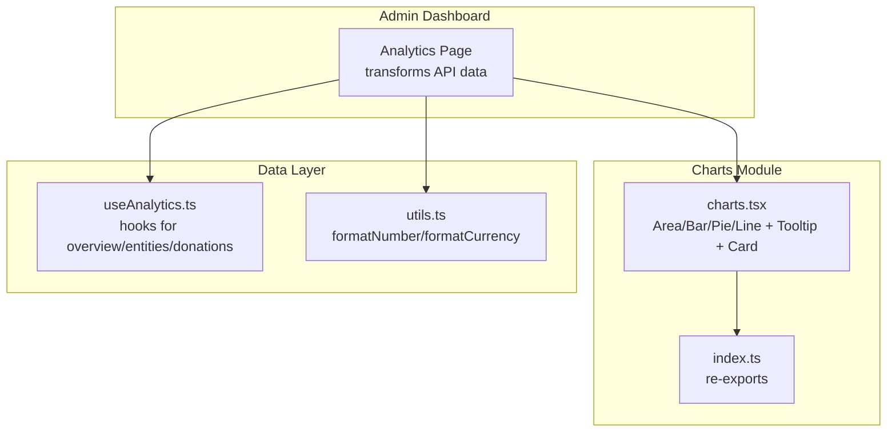
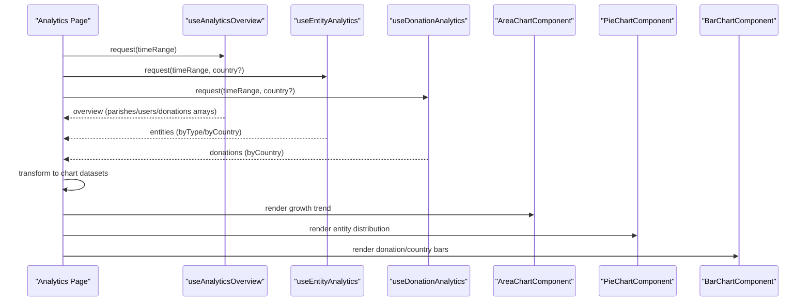
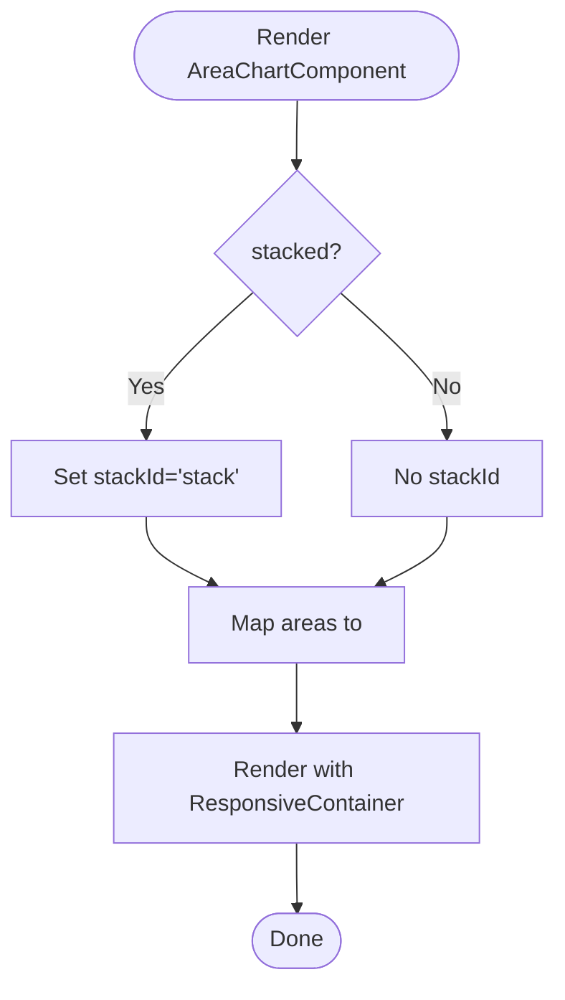
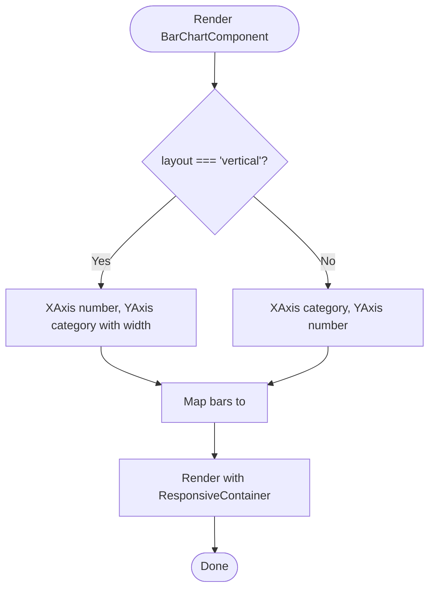
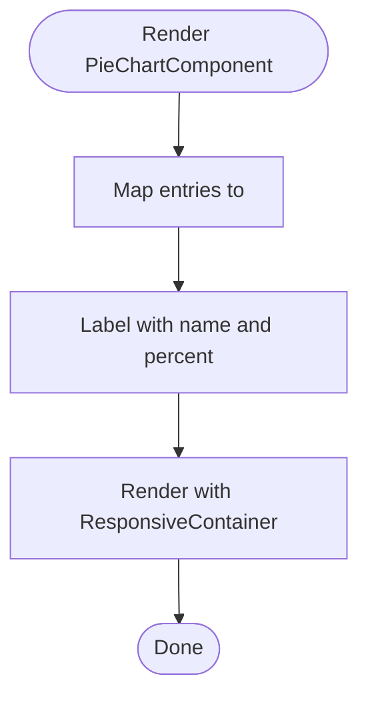
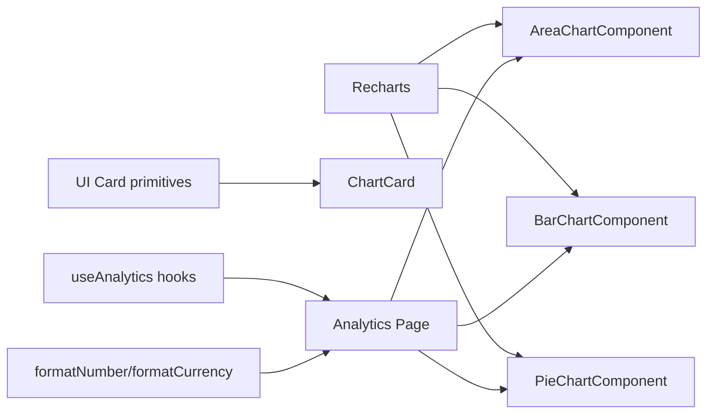

# Chart Components & Visualizations

<cite>
**Referenced Files in This Document**
- [charts.tsx](file://frontend/apps/admin-dashboard/src/components/charts/charts.tsx)
- [index.ts](file://frontend/apps/admin-dashboard/src/components/charts/index.ts)
- [page.tsx](file://frontend/apps/admin-dashboard/src/app/(dashboard)/analytics/page.tsx)
- [useAnalytics.ts](file://frontend/apps/admin-dashboard/src/lib/hooks/useAnalytics.ts)
- [utils.ts](file://frontend/apps/admin-dashboard/src/lib/utils.ts)
</cite>

## Table of Contents
1. Introduction
2. Project Structure
3. Core Components
4. Architecture Overview
5. Detailed Component Analysis
6. Dependency Analysis
7. Performance Considerations
8. Troubleshooting Guide
9. Conclusion
10. Appendices

## Introduction
This document explains the chart components AreaChartComponent, BarChartComponent, and PieChartComponent used in the admin dashboard. It covers configuration options, data transformation patterns, styling customization, integration with analytics hooks, handling different data formats, creating custom charts, adding new visualization types, implementing responsive layouts, and extending the CHART_COLORS palette.

## Project Structure
The charting system is implemented as a small set of reusable React components built on Recharts. The main implementation lives in a single module that exports typed props, shared colors, tooltips, and wrapper utilities. A dashboard page demonstrates how to transform analytics API responses into chart-ready datasets and render charts responsively.

**Diagram sources**
- [charts.tsx:1-43](file://frontend/apps/admin-dashboard/src/components/charts/charts.tsx#L1-L43)
- [index.ts:1-19](file://frontend/apps/admin-dashboard/src/components/charts/index.ts#L1-L19)
- [page.tsx:35-73](file://frontend/apps/admin-dashboard/src/app/(dashboard)/analytics/page.tsx#L35-L73)
- [useAnalytics.ts:33-88](file://frontend/apps/admin-dashboard/src/lib/hooks/useAnalytics.ts#L33-L88)
- [utils.ts:28-37](file://frontend/apps/admin-dashboard/src/lib/utils.ts#L28-L37)

**Section sources**
- [charts.tsx:1-43](file://frontend/apps/admin-dashboard/src/components/charts/charts.tsx#L1-L43)
- [index.ts:1-19](file://frontend/apps/admin-dashboard/src/components/charts/index.ts#L1-L19)
- [page.tsx:35-73](file://frontend/apps/admin-dashboard/src/app/(dashboard)/analytics/page.tsx#L35-L73)
- [useAnalytics.ts:33-88](file://frontend/apps/admin-dashboard/src/lib/hooks/useAnalytics.ts#L33-L88)
- [utils.ts:28-37](file://frontend/apps/admin-dashboard/src/lib/utils.ts#L28-L37)

## Core Components
- AreaChartComponent: Renders area series over time or categorical axes; supports stacking and per-area color overrides.
- BarChartComponent: Renders horizontal or vertical bar charts; supports per-bar color overrides and rounded corners.
- PieChartComponent: Renders pie/donut charts; supports inner/outer radius and percentage labels.
- ChartTooltip: Custom tooltip supporting value formatting via a formatter function.
- ChartCard: Wrapper card for consistent presentation of charts with title, description, and optional action.

Key shared elements:
- CHART_COLORS: Centralized palette including semantic tokens and a Recharts-friendly array of hex colors.
- ResponsiveContainer: Ensures charts adapt to container width and height.

**Section sources**
- [charts.tsx:26-43](file://frontend/apps/admin-dashboard/src/components/charts/charts.tsx#L26-L43)
- [charts.tsx:63-85](file://frontend/apps/admin-dashboard/src/components/charts/charts.tsx#L63-L85)
- [charts.tsx:163-230](file://frontend/apps/admin-dashboard/src/components/charts/charts.tsx#L163-L230)
- [charts.tsx:236-303](file://frontend/apps/admin-dashboard/src/components/charts/charts.tsx#L236-L303)
- [charts.tsx:309-359](file://frontend/apps/admin-dashboard/src/components/charts/charts.tsx#L309-L359)
- [charts.tsx:365-386](file://frontend/apps/admin-dashboard/src/components/charts/charts.tsx#L365-L386)

## Architecture Overview
The dashboard fetches aggregated analytics via hooks, transforms them into chart-compatible arrays, and renders charts using the shared components. Data flows from API endpoints through hooks into the page, where it is mapped to the expected shapes consumed by each chart component.

**Diagram sources**
- [page.tsx:35-73](file://frontend/apps/admin-dashboard/src/app/(dashboard)/analytics/page.tsx#L35-L73)
- [page.tsx:205-317](file://frontend/apps/admin-dashboard/src/app/(dashboard)/analytics/page.tsx#L205-L317)
- [useAnalytics.ts:33-88](file://frontend/apps/admin-dashboard/src/lib/hooks/useAnalytics.ts#L33-L88)

**Section sources**
- [page.tsx:35-73](file://frontend/apps/admin-dashboard/src/app/(dashboard)/analytics/page.tsx#L35-L73)
- [page.tsx:205-317](file://frontend/apps/admin-dashboard/src/app/(dashboard)/analytics/page.tsx#L205-L317)
- [useAnalytics.ts:33-88](file://frontend/apps/admin-dashboard/src/lib/hooks/useAnalytics.ts#L33-L88)

## Detailed Component Analysis

### AreaChartComponent
- Purpose: Visualize one or more numeric series over a common x-axis with filled areas. Supports stacking to show cumulative totals.
- Configuration:
  - data: Array of objects with an x-axis key and multiple numeric keys.
  - xKey: Key used for the x-axis.
  - areas: Array of series definitions with key, name, and optional color override.
  - height: Container height.
  - showGrid: Toggle grid lines.
  - showLegend: Toggle legend visibility.
  - stacked: Enable stackId to stack areas.
  - formatter: Optional function to format tooltip values.
- Styling:
  - Uses CHART_COLORS.colors for default series colors when not overridden.
  - Y-axis tickFormatter abbreviates large numbers (K/M).
  - Grid uses muted stroke style.
- Data shape: Same as LineChartData (key-value pairs with string/number values).

**Diagram sources**
- [charts.tsx:163-230](file://frontend/apps/admin-dashboard/src/components/charts/charts.tsx#L163-L230)

**Section sources**
- [charts.tsx:163-230](file://frontend/apps/admin-dashboard/src/components/charts/charts.tsx#L163-L230)

### BarChartComponent
- Purpose: Display categorical comparisons with horizontal or vertical orientation.
- Configuration:
  - data: Array of objects with category key and numeric keys.
  - xKey: Category key for the axis.
  - bars: Series definitions with key, name, and optional color.
  - layout: 'horizontal' or 'vertical'.
  - height, showGrid, showLegend, formatter: Similar to other charts.
- Styling:
  - Rounded top corners for bars.
  - Axis widths adjusted for vertical layout to accommodate labels.
  - Default colors from CHART_COLORS if not provided.

**Diagram sources**
- [charts.tsx:236-303](file://frontend/apps/admin-dashboard/src/components/charts/charts.tsx#L236-L303)

**Section sources**
- [charts.tsx:236-303](file://frontend/apps/admin-dashboard/src/components/charts/charts.tsx#L236-L303)

### PieChartComponent
- Purpose: Show part-to-whole relationships with labeled percentages.
- Configuration:
  - data: Array of { name, value, color? }.
  - height: Container height.
  - showLegend: Toggle legend.
  - innerRadius/outerRadius: Control donut vs full pie.
  - formatter: Optional function to format tooltip values.
- Styling:
  - Percentage labels derived from percent.
  - Colors from data or CHART_COLORS fallback.

**Diagram sources**
- [charts.tsx:309-359](file://frontend/apps/admin-dashboard/src/components/charts/charts.tsx#L309-L359)

**Section sources**
- [charts.tsx:309-359](file://frontend/apps/admin-dashboard/src/components/charts/charts.tsx#L309-L359)

### ChartTooltip and ChartCard
- ChartTooltip: Displays label and payload entries with colored indicators; supports custom formatter for values.
- ChartCard: Provides consistent header/footer structure for chart containers.

**Section sources**
- [charts.tsx:63-85](file://frontend/apps/admin-dashboard/src/components/charts/charts.tsx#L63-L85)
- [charts.tsx:365-386](file://frontend/apps/admin-dashboard/src/components/charts/charts.tsx#L365-L386)

## Dependency Analysis
- Charts depend on Recharts primitives (AreaChart/Area, BarChart/Bar, PieChart/Pie, XAxis/YAxis, CartesianGrid, Tooltip, Legend, ResponsiveContainer).
- UI primitives (Card, CardHeader, CardTitle, CardDescription, CardContent) are used by ChartCard.
- Dashboard page depends on analytics hooks to fetch and transform data.
- Formatting utilities provide number and currency formatting helpers.

**Diagram sources**
- [charts.tsx:1-20](file://frontend/apps/admin-dashboard/src/components/charts/charts.tsx#L1-L20)
- [page.tsx:35-73](file://frontend/apps/admin-dashboard/src/app/(dashboard)/analytics/page.tsx#L35-L73)
- [utils.ts:28-37](file://frontend/apps/admin-dashboard/src/lib/utils.ts#L28-L37)

**Section sources**
- [charts.tsx:1-20](file://frontend/apps/admin-dashboard/src/components/charts/charts.tsx#L1-L20)
- [page.tsx:35-73](file://frontend/apps/admin-dashboard/src/app/(dashboard)/analytics/page.tsx#L35-L73)
- [utils.ts:28-37](file://frontend/apps/admin-dashboard/src/lib/utils.ts#L28-L37)

## Performance Considerations
- Use ResponsiveContainer to avoid fixed sizing and ensure efficient reflows on resize.
- Keep data arrays reasonably sized; consider pagination or aggregation at the API layer for large datasets.
- Avoid excessive recomputation in parent components; memoize transformed datasets when possible.
- Prefer passing minimal props and leveraging defaults to reduce prop churn.
- For many series, consider limiting visible items or enabling lazy loading in tooltips.

[No sources needed since this section provides general guidance]

## Troubleshooting Guide
- Empty or missing data: Ensure hooks return non-empty arrays before rendering charts; display fallback messages as shown in the analytics page.
- Incorrect xKey: Verify that the xKey exists in every data object; mismatches cause silent failures or empty axes.
- Color conflicts: If overriding colors, ensure sufficient contrast; otherwise rely on CHART_COLORS for consistency.
- Tooltip formatting: Provide a formatter function when displaying currencies or localized numbers; use utils.formatCurrency or Intl.NumberFormat.
- Stacking issues: When using stacked areas, ensure all series share the same x-axis keys and numeric values.

**Section sources**
- [page.tsx:205-317](file://frontend/apps/admin-dashboard/src/app/(dashboard)/analytics/page.tsx#L205-L317)
- [utils.ts:28-37](file://frontend/apps/admin-dashboard/src/lib/utils.ts#L28-L37)

## Conclusion
The chart components provide a cohesive, configurable, and responsive way to visualize analytics data. They integrate cleanly with analytics hooks, support flexible data transformations, and offer consistent styling via CHART_COLORS. Extending the system with new chart types or customizing behavior follows predictable patterns centered around typed props, shared color tokens, and Recharts primitives.

[No sources needed since this section summarizes without analyzing specific files]

## Appendices

### Chart Configuration Options Summary
- AreaChartComponent
  - data: LineChartData[]
  - xKey: string
  - areas: [{ key, name, color? }]
  - height?: number
  - showGrid?: boolean
  - showLegend?: boolean
  - stacked?: boolean
  - formatter?(value, name): string
- BarChartComponent
  - data: LineChartData[]
  - xKey: string
  - bars: [{ key, name, color? }]
  - height?: number
  - showGrid?: boolean
  - showLegend?: boolean
  - layout?: 'horizontal' | 'vertical'
  - formatter?(value, name): string
- PieChartComponent
  - data: PieChartData[]
  - height?: number
  - showLegend?: boolean
  - innerRadius?: number
  - outerRadius?: number
  - formatter?(value, name): string

**Section sources**
- [charts.tsx:163-230](file://frontend/apps/admin-dashboard/src/components/charts/charts.tsx#L163-L230)
- [charts.tsx:236-303](file://frontend/apps/admin-dashboard/src/components/charts/charts.tsx#L236-L303)
- [charts.tsx:309-359](file://frontend/apps/admin-dashboard/src/components/charts/charts.tsx#L309-L359)

### Data Transformation Patterns
- Growth trend: Map overview arrays into a unified dataset keyed by date with multiple series.
- Entity distribution: Convert byType counts into name/value/color tuples for pie charts.
- Country breakdowns: Map byCountry metrics into bar datasets with multiple series.

**Section sources**
- [page.tsx:48-73](file://frontend/apps/admin-dashboard/src/app/(dashboard)/analytics/page.tsx#L48-L73)

### Integration with Analytics Hooks
- useAnalyticsOverview returns parishes, users, and donations arrays for time-based trends.
- useEntityAnalytics returns byType and byCountry aggregations.
- useDonationAnalytics returns donation amounts and transaction counts by country.

**Section sources**
- [useAnalytics.ts:33-88](file://frontend/apps/admin-dashboard/src/lib/hooks/useAnalytics.ts#L33-L88)

### Handling Different Data Formats
- Numeric formatting: Use formatNumber for counts and formatCurrency for monetary values.
- Date formatting: Use formatDate or formatDateTime for labels and tooltips.
- Localization: Leverage Intl APIs via utils for consistent formatting across locales.

**Section sources**
- [utils.ts:8-37](file://frontend/apps/admin-dashboard/src/lib/utils.ts#L8-L37)

### Creating Custom Charts
- Extend existing patterns: Define a new component wrapping a Recharts primitive, accept typed props similar to Area/Bar/Pie, and reuse ChartTooltip and CHART_COLORS.
- Add a new series type: Introduce a new prop array (e.g., segments, slices) and map to corresponding Recharts elements.
- Export types: Update index.ts to re-export new components and types for consumers.

**Section sources**
- [index.ts:1-19](file://frontend/apps/admin-dashboard/src/components/charts/index.ts#L1-L19)
- [charts.tsx:1-20](file://frontend/apps/admin-dashboard/src/components/charts/charts.tsx#L1-L20)

### Adding New Visualization Types
- Choose appropriate Recharts primitive based on data semantics (e.g., scatter, radar, funnel).
- Implement responsive container and axes configuration.
- Provide sensible defaults for colors, legends, and tooltips.
- Wire into dashboard pages with example transformations.

[No sources needed since this section provides general guidance]

### Implementing Responsive Chart Layouts
- Wrap charts in ResponsiveContainer with width="100%" and dynamic height.
- Adjust margins and axis widths for vertical/horizontal layouts.
- Combine with CSS grid/flex to create multi-chart dashboards that adapt to screen size.

**Section sources**
- [charts.tsx:118-156](file://frontend/apps/admin-dashboard/src/components/charts/charts.tsx#L118-L156)
- [charts.tsx:188-229](file://frontend/apps/admin-dashboard/src/components/charts/charts.tsx#L188-L229)
- [charts.tsx:263-302](file://frontend/apps/admin-dashboard/src/components/charts/charts.tsx#L263-L302)
- [charts.tsx:332-358](file://frontend/apps/admin-dashboard/src/components/charts/charts.tsx#L332-L358)

### CHART_COLORS System and Extending the Palette
- CHART_COLORS includes semantic tokens (primary, secondary, accent, muted, destructive) and a Recharts-friendly colors array.
- Components fall back to CHART_COLORS.colors when no explicit color is provided.
- To extend:
  - Add new semantic tokens if needed.
  - Append additional hex colors to the colors array for more series.
  - Reference tokens or colors consistently across components and pages.

**Section sources**
- [charts.tsx:26-43](file://frontend/apps/admin-dashboard/src/components/charts/charts.tsx#L26-L43)
- [page.tsx:56-73](file://frontend/apps/admin-dashboard/src/app/(dashboard)/analytics/page.tsx#L56-L73)