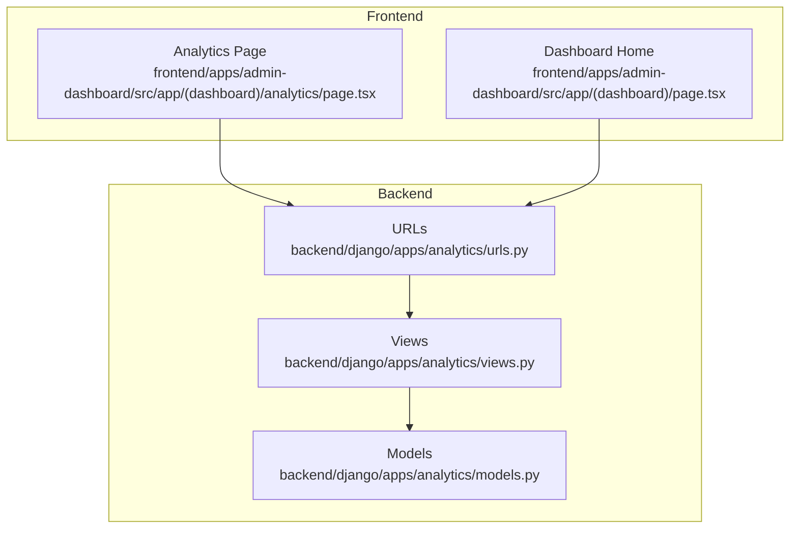
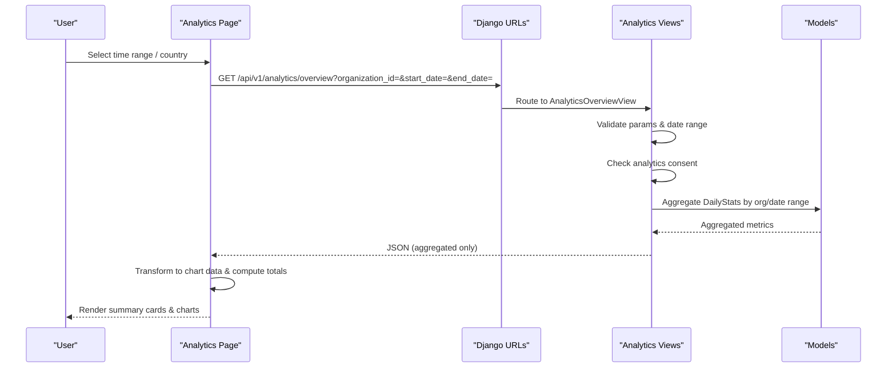
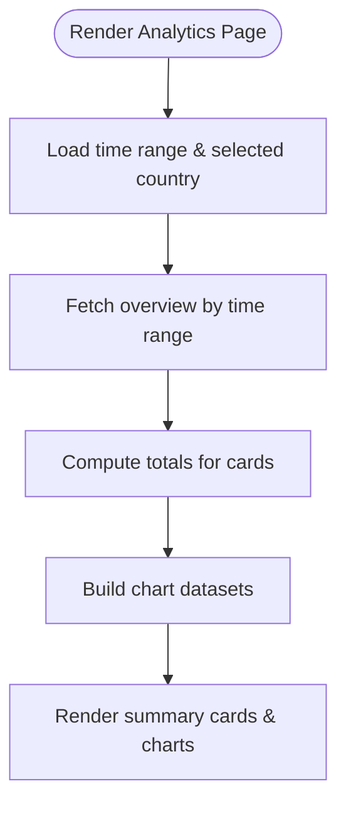
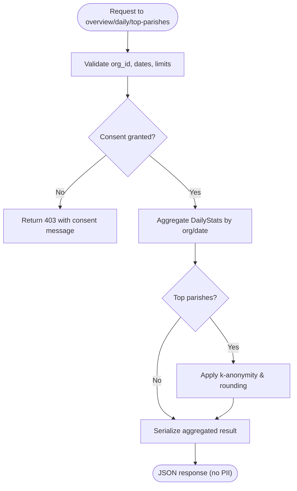
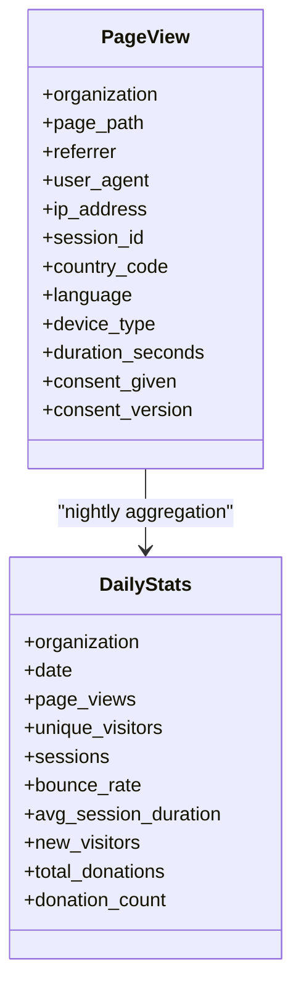
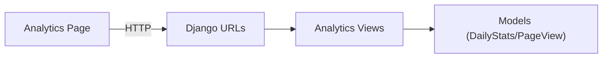

# Dashboard Overview & Metrics

<cite>
**Referenced Files in This Document**
- [analytics/page.tsx](file://frontend/apps/admin-dashboard/src/app/(dashboard)/analytics/page.tsx)
- [dashboard/page.tsx](file://frontend/apps/admin-dashboard/src/app/(dashboard)/page.tsx)
- [views.py](file://backend/django/apps/analytics/views.py)
- [models.py](file://backend/django/apps/analytics/models.py)
- [urls.py](file://backend/django/apps/analytics/urls.py)
</cite>

## Table of Contents
1. Introduction
2. Project Structure
3. Core Components
4. Architecture Overview
5. Detailed Component Analysis
6. Dependency Analysis
7. Performance Considerations
8. Troubleshooting Guide
9. Conclusion
10. Appendices

## Introduction
This document explains the analytics dashboard overview and core metrics display for the admin application. It covers:
- The main analytics page structure and summary statistics cards (total entities, active users, donations, country coverage).
- Time range filtering (7d, 30d, 90d, 1y) and country-based data filtering.
- GDPR Article 44 compliance ensuring aggregated data only with no PII displayed.
- Practical guidance to add new metric cards, customize time ranges, and implement country-specific filtering.

## Project Structure
The analytics feature spans a Next.js client page and Django backend views that serve aggregated, consent-gated metrics.

**Diagram sources**
- [analytics/page.tsx:1-333](file://frontend/apps/admin-dashboard/src/app/(dashboard)/analytics/page.tsx#L1-L333)
- [dashboard/page.tsx:1-287](file://frontend/apps/admin-dashboard/src/app/(dashboard)/page.tsx#L1-L287)
- [urls.py:1-11](file://backend/django/apps/analytics/urls.py#L1-L11)
- [views.py:1-458](file://backend/django/apps/analytics/views.py#L1-L458)
- [models.py:1-174](file://backend/django/apps/analytics/models.py#L1-L174)

**Section sources**
- [analytics/page.tsx:1-333](file://frontend/apps/admin-dashboard/src/app/(dashboard)/analytics/page.tsx#L1-L333)
- [dashboard/page.tsx:1-287](file://frontend/apps/admin-dashboard/src/app/(dashboard)/page.tsx#L1-L287)
- [urls.py:1-11](file://backend/django/apps/analytics/urls.py#L1-L11)
- [views.py:1-458](file://backend/django/apps/analytics/views.py#L1-L458)
- [models.py:1-174](file://backend/django/apps/analytics/models.py#L1-L174)

## Core Components
- Analytics Page: Presents summary cards, charts, and filters for time range and country. Computes totals from overview data and transforms datasets for charts.
- Dashboard Home: Shows high-level stats and a growth trend chart using a fixed short time window.
- Backend Views: Provide consent-gated, aggregated analytics endpoints with strict input validation and k-anonymity safeguards.
- Models: Store raw page view events and pre-aggregated daily statistics per organization.

Key responsibilities:
- Frontend: UI composition, state management for filters, data transformation for visualization.
- Backend: Consent checks, parameter validation, aggregation, anonymization, and secure responses.

**Section sources**
- [analytics/page.tsx:35-194](file://frontend/apps/admin-dashboard/src/app/(dashboard)/analytics/page.tsx#L35-L194)
- [dashboard/page.tsx:23-152](file://frontend/apps/admin-dashboard/src/app/(dashboard)/page.tsx#L23-L152)
- [views.py:173-241](file://backend/django/apps/analytics/views.py#L173-L241)
- [models.py:12-66](file://backend/django/apps/analytics/models.py#L12-L66)
- [models.py:107-134](file://backend/django/apps/analytics/models.py#L107-L134)

## Architecture Overview
The analytics flow enforces privacy-first design:
- Client requests filtered metrics via hooks.
- Backend validates inputs, verifies consent, aggregates data, applies k-anonymity where applicable, and returns summarized results without PII.
- Charts render aggregated series; no identifiers are exposed.

**Diagram sources**
- [urls.py:6-10](file://backend/django/apps/analytics/urls.py#L6-L10)
- [views.py:173-241](file://backend/django/apps/analytics/views.py#L173-L241)
- [models.py:107-134](file://backend/django/apps/analytics/models.py#L107-L134)
- [analytics/page.tsx:35-194](file://frontend/apps/admin-dashboard/src/app/(dashboard)/analytics/page.tsx#L35-L194)

## Detailed Component Analysis

### Analytics Page: Summary Cards and Filters
- Summary cards:
  - Total Entities: Sum of parish counts from overview data.
  - Active Users: Sum of user counts from overview data.
  - Total Donations: Sum of donation amounts from overview data.
  - Countries: Count of EU member states supported.
- Filters:
  - Time Range: 7d, 30d, 90d, 1y selection drives query parameters.
  - Country Filter: Dropdown populated from a curated list; passed to entity/donation analytics hooks.
- Data transformation:
  - Growth trend series built from overview arrays.
  - Entity distribution and geographic breakdown prepared for charts.

**Diagram sources**
- [analytics/page.tsx:35-194](file://frontend/apps/admin-dashboard/src/app/(dashboard)/analytics/page.tsx#L35-L194)

**Section sources**
- [analytics/page.tsx:35-194](file://frontend/apps/admin-dashboard/src/app/(dashboard)/analytics/page.tsx#L35-L194)

### Backend: Consent-Gated Aggregation and K-Anonymity
- Input validation:
  - Organization ID validated as UUID and sanitized.
  - Date parameters validated and bounded to prevent DoS.
- Consent enforcement:
  - Only organizations with explicit analytics consent enabled return data.
- Aggregation:
  - Sums across page views, visitors, sessions, donations within the requested date range.
- K-anonymity:
  - Top parishes endpoint applies k-anonymity thresholds and rounds small counts, grouping tiny entities into an “Other” bucket.

**Diagram sources**
- [views.py:33-138](file://backend/django/apps/analytics/views.py#L33-L138)
- [views.py:141-170](file://backend/django/apps/analytics/views.py#L141-L170)
- [views.py:173-241](file://backend/django/apps/analytics/views.py#L173-L241)
- [views.py:280-451](file://backend/django/apps/analytics/views.py#L280-L451)

**Section sources**
- [views.py:33-138](file://backend/django/apps/analytics/views.py#L33-L138)
- [views.py:141-170](file://backend/django/apps/analytics/views.py#L141-L170)
- [views.py:173-241](file://backend/django/apps/analytics/views.py#L173-L241)
- [views.py:280-451](file://backend/django/apps/analytics/views.py#L280-L451)

### Data Models: Raw Events and Aggregates
- PageView: Stores individual page view events with consent flags and anonymized IP handling.
- DailyStats: Pre-aggregated daily metrics per organization used for efficient querying.

**Diagram sources**
- [models.py:12-66](file://backend/django/apps/analytics/models.py#L12-L66)
- [models.py:107-134](file://backend/django/apps/analytics/models.py#L107-L134)

**Section sources**
- [models.py:12-66](file://backend/django/apps/analytics/models.py#L12-L66)
- [models.py:107-134](file://backend/django/apps/analytics/models.py#L107-L134)

## Dependency Analysis
- Frontend depends on:
  - UI components (cards, tabs, selects).
  - Chart components and color palettes.
  - Hooks for fetching analytics data (not shown here but referenced in the page).
- Backend depends on:
  - URL routing to map endpoints to views.
  - Views performing validation, consent checks, and aggregation.
  - Models providing storage and indexes for efficient queries.

**Diagram sources**
- [urls.py:6-10](file://backend/django/apps/analytics/urls.py#L6-L10)
- [views.py:173-241](file://backend/django/apps/analytics/views.py#L173-L241)
- [models.py:107-134](file://backend/django/apps/analytics/models.py#L107-L134)
- [analytics/page.tsx:35-194](file://frontend/apps/admin-dashboard/src/app/(dashboard)/analytics/page.tsx#L35-L194)

**Section sources**
- [urls.py:6-10](file://backend/django/apps/analytics/urls.py#L6-L10)
- [views.py:173-241](file://backend/django/apps/analytics/views.py#L173-L241)
- [models.py:107-134](file://backend/django/apps/analytics/models.py#L107-L134)
- [analytics/page.tsx:35-194](file://frontend/apps/admin-dashboard/src/app/(dashboard)/analytics/page.tsx#L35-L194)

## Performance Considerations
- Use pre-aggregated DailyStats for fast rollups over date ranges.
- Enforce maximum date ranges to avoid heavy queries.
- Limit top lists and apply k-anonymity post-query to reduce payload size and protect privacy.
- Cache frequently accessed summaries at the API layer if needed.
- On the frontend, memoize derived chart data to minimize re-renders when filters change.

[No sources needed since this section provides general guidance]

## Troubleshooting Guide
Common issues and resolutions:
- Validation errors:
  - Invalid organization_id format or forbidden characters will be rejected.
  - Dates must be in ISO format and within allowed ranges.
- Consent required:
  - If an organization has not enabled analytics consent, endpoints return a consent-required response.
- Empty data:
  - Ensure the selected time range includes data and that consent is enabled for the organization.
- Tenant context violations:
  - Attempts to write analytics data outside the current tenant context are blocked.

Actionable checks:
- Verify organization_id is a valid UUID.
- Confirm start_date <= end_date and within maximum range.
- Ensure analytics consent is enabled for the target organization.
- Review logs for tenant validation errors when writing data.

**Section sources**
- [views.py:33-138](file://backend/django/apps/analytics/views.py#L33-L138)
- [views.py:141-170](file://backend/django/apps/analytics/views.py#L141-L170)
- [views.py:173-241](file://backend/django/apps/analytics/views.py#L173-L241)
- [models.py:67-105](file://backend/django/apps/analytics/models.py#L67-L105)
- [models.py:136-173](file://backend/django/apps/analytics/models.py#L136-L173)

## Conclusion
The analytics dashboard presents aggregated, privacy-compliant metrics through a clear UI with time range and country filters. The backend enforces consent, validates inputs, aggregates efficiently, and applies k-anonymity to protect small groups. This design ensures GDPR-aligned reporting while remaining performant and extensible for additional metrics and visualizations.

[No sources needed since this section summarizes without analyzing specific files]

## Appendices

### How to Add a New Metric Card
Steps:
- Define or fetch the metric via existing or new hooks/APIs.
- In the analytics page, compute the card value from the fetched dataset.
- Add a new Card component with title, icon, formatted value, and description.
- Wire up any necessary filter dependencies (time range, country).

Reference locations:
- Summary cards layout and computation: [analytics/page.tsx:135-194](file://frontend/apps/admin-dashboard/src/app/(dashboard)/analytics/page.tsx#L135-L194)
- Example pattern in dashboard home: [dashboard/page.tsx:89-152](file://frontend/apps/admin-dashboard/src/app/(dashboard)/page.tsx#L89-L152)

**Section sources**
- [analytics/page.tsx:135-194](file://frontend/apps/admin-dashboard/src/app/(dashboard)/analytics/page.tsx#L135-L194)
- [dashboard/page.tsx:89-152](file://frontend/apps/admin-dashboard/src/app/(dashboard)/page.tsx#L89-L152)

### How to Customize Time Ranges
Steps:
- Extend the time range selector options in the analytics page.
- Update the hook calls to pass the selected range to the backend.
- Ensure backend supports the new ranges or derive them from start/end dates.

Reference locations:
- Time range state and select options: [analytics/page.tsx:35-133](file://frontend/apps/admin-dashboard/src/app/(dashboard)/analytics/page.tsx#L35-L133)
- Backend date validation and defaults: [views.py:67-116](file://backend/django/apps/analytics/views.py#L67-L116)
- Overview endpoint date handling: [views.py:186-200](file://backend/django/apps/analytics/views.py#L186-L200)

**Section sources**
- [analytics/page.tsx:35-133](file://frontend/apps/admin-dashboard/src/app/(dashboard)/analytics/page.tsx#L35-L133)
- [views.py:67-116](file://backend/django/apps/analytics/views.py#L67-L116)
- [views.py:186-200](file://backend/django/apps/analytics/views.py#L186-L200)

### How to Implement Country-Specific Filtering
Steps:
- Maintain a curated list of countries in the frontend.
- Pass the selected country code to relevant analytics hooks.
- On the backend, ensure queries filter by country where applicable and respect consent.

Reference locations:
- Country dropdown and mapping: [analytics/page.tsx:115-133](file://frontend/apps/admin-dashboard/src/app/(dashboard)/analytics/page.tsx#L115-L133)
- Country fields in models and aggregation: [models.py:23-34](file://backend/django/apps/analytics/models.py#L23-L34)
- Aggregation including country in top parishes: [views.py:362-381](file://backend/django/apps/analytics/views.py#L362-L381)

**Section sources**
- [analytics/page.tsx:115-133](file://frontend/apps/admin-dashboard/src/app/(dashboard)/analytics/page.tsx#L115-L133)
- [models.py:23-34](file://backend/django/apps/analytics/models.py#L23-L34)
- [views.py:362-381](file://backend/django/apps/analytics/views.py#L362-L381)

### GDPR Article 44 Compliance Notes
- All analytics endpoints return aggregated data only; no PII is exposed.
- Consent checks gate access to analytics data.
- K-anonymity protects small groups in leaderboards and rankings.
- Tenant isolation prevents cross-tenant data leakage.

Reference locations:
- Consent gating and aggregated responses: [views.py:141-170](file://backend/django/apps/analytics/views.py#L141-L170), [views.py:173-241](file://backend/django/apps/analytics/views.py#L173-L241)
- K-anonymity implementation: [views.py:392-451](file://backend/django/apps/analytics/views.py#L392-L451)
- Tenant validation on writes: [models.py:67-105](file://backend/django/apps/analytics/models.py#L67-L105), [models.py:136-173](file://backend/django/apps/analytics/models.py#L136-L173)

**Section sources**
- [views.py:141-170](file://backend/django/apps/analytics/views.py#L141-L170)
- [views.py:173-241](file://backend/django/apps/analytics/views.py#L173-L241)
- [views.py:392-451](file://backend/django/apps/analytics/views.py#L392-L451)
- [models.py:67-105](file://backend/django/apps/analytics/models.py#L67-L105)
- [models.py:136-173](file://backend/django/apps/analytics/models.py#L136-L173)