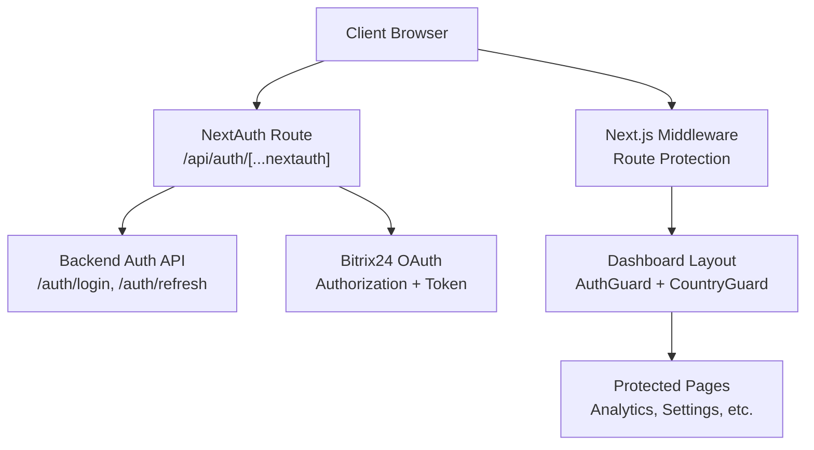
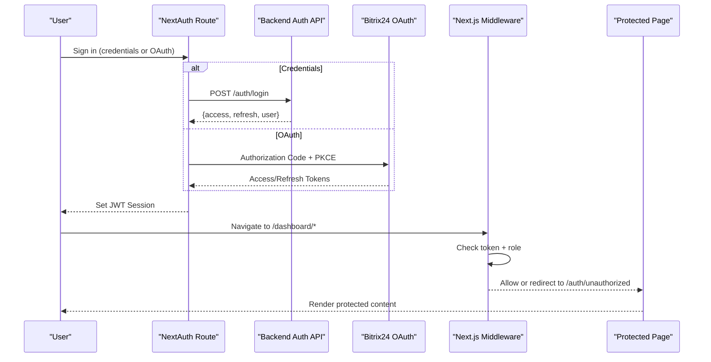
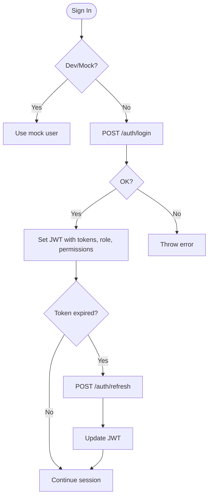
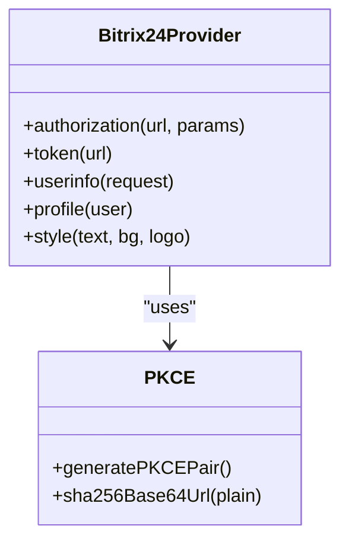
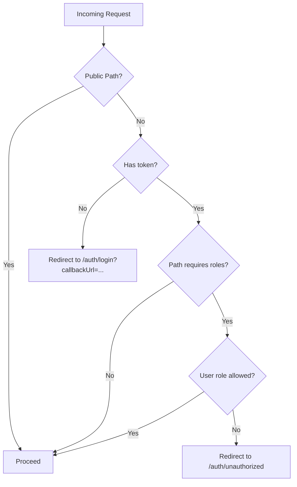
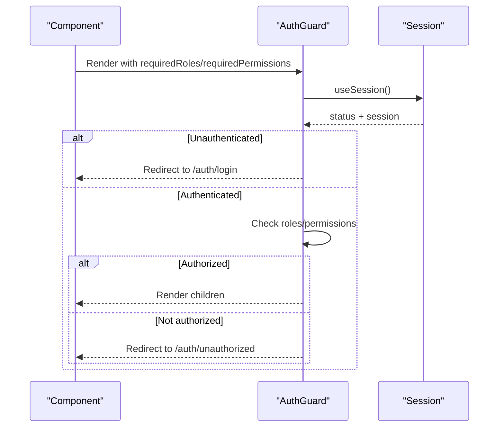
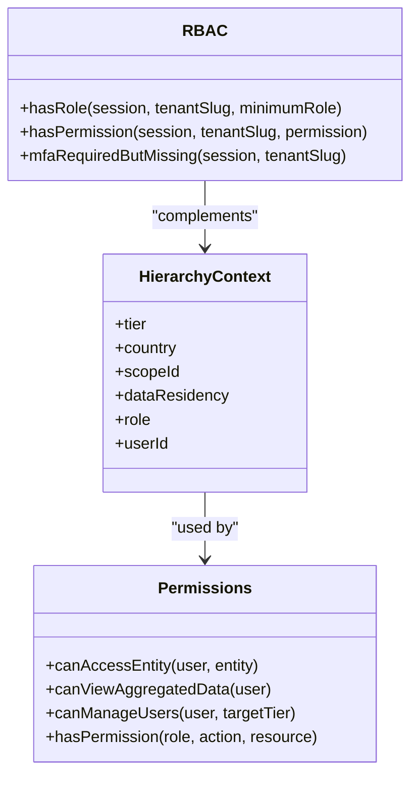
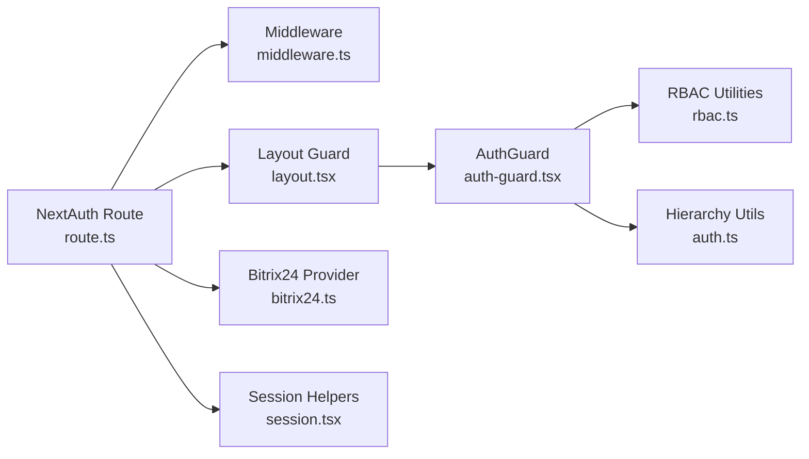

# Authentication & Authorization

<cite>
**Referenced Files in This Document**
- [route.ts](file://frontend/apps/admin-dashboard/src/app/api/auth/[...nextauth]/route.ts)
- [middleware.ts](file://frontend/apps/admin-dashboard/src/middleware.ts)
- [auth-guard.tsx](file://frontend/apps/admin-dashboard/src/components/auth/auth-guard.tsx)
- [layout.tsx](file://frontend/apps/admin-dashboard/src/app/(dashboard)/layout.tsx)
- [auth-options.ts](file://frontend/packages/auth/src/auth-options.ts)
- [bitrix24.ts](file://frontend/packages/auth/src/providers/bitrix24.ts)
- [session.tsx](file://frontend/packages/auth/src/session.tsx)
- [rbac.ts](file://frontend/packages/auth/src/oidc/rbac.ts)
- [auth.ts](file://frontend/apps/admin-dashboard/src/lib/auth.ts)
</cite>

## Table of Contents
1. [Introduction](#introduction)
2. [Project Structure](#project-structure)
3. [Core Components](#core-components)
4. [Architecture Overview](#architecture-overview)
5. [Detailed Component Analysis](#detailed-component-analysis)
6. [Dependency Analysis](#dependency-analysis)
7. [Performance Considerations](#performance-considerations)
8. [Troubleshooting Guide](#troubleshooting-guide)
9. [Conclusion](#conclusion)
10. [Appendices](#appendices)

## Introduction
This document explains the authentication and authorization system for the Admin Dashboard. It covers NextAuth.js integration, JWT token management, role-based access control (RBAC), middleware-based route protection, and the end-to-end flow from login to session management. It also documents the Bitrix24 OAuth provider configuration and how to extend or secure additional routes. Where applicable, it references multi-factor authentication (MFA) requirements for privileged roles as enforced by shared RBAC utilities.

## Project Structure
The Admin Dashboard implements a layered security model:
- NextAuth.js API route handles credential and OAuth flows and manages JWT sessions.
- Next.js middleware enforces authentication and role checks at the edge.
- Client-side guards protect dashboard layouts and pages.
- Shared auth package provides Bitrix24 OAuth provider, session helpers, and OIDC/RBAC utilities.
- Local hierarchy and permission utilities define fine-grained access rules for the 4-tier federation model.

**Diagram sources**
- [route.ts:1-235](file://frontend/apps/admin-dashboard/src/app/api/auth/[...nextauth]/route.ts#L1-L235)
- [middleware.ts:1-82](file://frontend/apps/admin-dashboard/src/middleware.ts#L1-L82)
- [layout.tsx:1-33](file://frontend/apps/admin-dashboard/src/app/(dashboard)/layout.tsx#L1-L33)
- [bitrix24.ts:214-307](file://frontend/packages/auth/src/providers/bitrix24.ts#L214-L307)

**Section sources**
- [route.ts:1-235](file://frontend/apps/admin-dashboard/src/app/api/auth/[...nextauth]/route.ts#L1-L235)
- [middleware.ts:1-82](file://frontend/apps/admin-dashboard/src/middleware.ts#L1-L82)
- [layout.tsx:1-33](file://frontend/apps/admin-dashboard/src/app/(dashboard)/layout.tsx#L1-L33)

## Core Components
- NextAuth.js credentials provider with mock fallback for development and real backend calls in production.
- JWT strategy with short-lived access tokens and refresh flow via backend endpoints.
- Next.js middleware that redirects unauthenticated users and enforces per-route roles.
- Client-side AuthGuard component that validates session state and required roles/permissions before rendering protected content.
- Bitrix24 OAuth provider with PKCE support and profile mapping.
- Shared RBAC utilities for tenant-scoped permissions and MFA enforcement for privileged roles.
- Hierarchy and permission utilities for 4-tier federation access control.

**Section sources**
- [route.ts:38-122](file://frontend/apps/admin-dashboard/src/app/api/auth/[...nextauth]/route.ts#L38-L122)
- [route.ts:124-196](file://frontend/apps/admin-dashboard/src/app/api/auth/[...nextauth]/route.ts#L124-L196)
- [route.ts:198-235](file://frontend/apps/admin-dashboard/src/app/api/auth/[...nextauth]/route.ts#L198-L235)
- [middleware.ts:8-66](file://frontend/apps/admin-dashboard/src/middleware.ts#L8-L66)
- [auth-guard.tsx:18-76](file://frontend/apps/admin-dashboard/src/components/auth/auth-guard.tsx#L18-L76)
- [bitrix24.ts:214-307](file://frontend/packages/auth/src/providers/bitrix24.ts#L214-L307)
- [rbac.ts:31-84](file://frontend/packages/auth/src/oidc/rbac.ts#L31-L84)
- [auth.ts:71-132](file://frontend/apps/admin-dashboard/src/lib/auth.ts#L71-L132)

## Architecture Overview
The authentication flow combines server-side NextAuth.js handling with client-side guards and middleware:

**Diagram sources**
- [route.ts:47-121](file://frontend/apps/admin-dashboard/src/app/api/auth/[...nextauth]/route.ts#L47-L121)
- [route.ts:135-173](file://frontend/apps/admin-dashboard/src/app/api/auth/[...nextauth]/route.ts#L135-L173)
- [bitrix24.ts:232-307](file://frontend/packages/auth/src/providers/bitrix24.ts#L232-L307)
- [middleware.ts:8-66](file://frontend/apps/admin-dashboard/src/middleware.ts#L8-L66)

## Detailed Component Analysis

### NextAuth.js Integration and JWT Management
- Credentials Provider authenticates against the backend’s /auth/login endpoint and stores access/refresh tokens in the JWT.
- Development mode supports mock users when the backend is unavailable; otherwise it falls back to the real backend.
- JWT callbacks persist user identity, roles, and permissions into the token and session.
- Token refresh logic calls /auth/refresh when the access token expires and updates the JWT accordingly.
- Logout event notifies the backend to invalidate server-side sessions.

**Diagram sources**
- [route.ts:47-121](file://frontend/apps/admin-dashboard/src/app/api/auth/[...nextauth]/route.ts#L47-L121)
- [route.ts:135-173](file://frontend/apps/admin-dashboard/src/app/api/auth/[...nextauth]/route.ts#L135-L173)
- [route.ts:198-235](file://frontend/apps/admin-dashboard/src/app/api/auth/[...nextauth]/route.ts#L198-L235)

**Section sources**
- [route.ts:47-121](file://frontend/apps/admin-dashboard/src/app/api/auth/[...nextauth]/route.ts#L47-L121)
- [route.ts:124-196](file://frontend/apps/admin-dashboard/src/app/api/auth/[...nextauth]/route.ts#L124-L196)
- [route.ts:198-235](file://frontend/apps/admin-dashboard/src/app/api/auth/[...nextauth]/route.ts#L198-L235)

### Bitrix24 OAuth Provider Configuration
- The Bitrix24 provider uses OAuth2 Authorization Code flow with PKCE (S256) for enhanced security.
- Authorization, token, and userinfo endpoints are configured to the Bitrix24 domain.
- Profile mapping includes custom fields such as bitrixId, bitrixDomain, role, parishIds, and workPosition.
- Token refresh utility supports refreshing Bitrix24 tokens using refresh_token grant type.

**Diagram sources**
- [bitrix24.ts:75-88](file://frontend/packages/auth/src/providers/bitrix24.ts#L75-L88)
- [bitrix24.ts:214-307](file://frontend/packages/auth/src/providers/bitrix24.ts#L214-L307)

**Section sources**
- [bitrix24.ts:75-88](file://frontend/packages/auth/src/providers/bitrix24.ts#L75-L88)
- [bitrix24.ts:214-307](file://frontend/packages/auth/src/providers/bitrix24.ts#L214-L307)
- [auth-options.ts:21-104](file://frontend/packages/auth/src/auth-options.ts#L21-L104)

### Middleware-Based Route Protection
- Next.js middleware wraps requests with withAuth, allowing public paths (/auth/login, /auth/error, /auth/unauthorized).
- Unauthenticated requests are redirected to /auth/login with callbackUrl preserved.
- Role-based checks enforce allowed roles per path prefix (e.g., analytics, users, settings).
- User info is forwarded via response headers for downstream API calls.

**Diagram sources**
- [middleware.ts:8-66](file://frontend/apps/admin-dashboard/src/middleware.ts#L8-L66)

**Section sources**
- [middleware.ts:8-66](file://frontend/apps/admin-dashboard/src/middleware.ts#L8-L66)

### Client-Side Guards and Protected Layouts
- AuthGuard component ensures the user is authenticated and has required roles/permissions before rendering children.
- Dashboard layout composes AuthGuard with CountryGuard to enforce both role and country context.
- Hooks provide convenient checks for roles and permissions within components.

**Diagram sources**
- [auth-guard.tsx:18-76](file://frontend/apps/admin-dashboard/src/components/auth/auth-guard.tsx#L18-L76)
- [layout.tsx:17-31](file://frontend/apps/admin-dashboard/src/app/(dashboard)/layout.tsx#L17-L31)

**Section sources**
- [auth-guard.tsx:18-76](file://frontend/apps/admin-dashboard/src/components/auth/auth-guard.tsx#L18-L76)
- [layout.tsx:17-31](file://frontend/apps/admin-dashboard/src/app/(dashboard)/layout.tsx#L17-L31)

### Role-Based Access Control and Federation Hierarchy
- Local hierarchy utilities define a 4-tier model (super, country, diocese, facility) with strict data residency enforcement.
- Permission matrix and role mappings provide granular controls for actions on resources.
- Shared OIDC RBAC utilities define tenant-scoped permissions and require MFA for privileged roles.

**Diagram sources**
- [auth.ts:33-40](file://frontend/apps/admin-dashboard/src/lib/auth.ts#L33-L40)
- [auth.ts:71-132](file://frontend/apps/admin-dashboard/src/lib/auth.ts#L71-L132)
- [rbac.ts:31-84](file://frontend/packages/auth/src/oidc/rbac.ts#L31-L84)

**Section sources**
- [auth.ts:71-132](file://frontend/apps/admin-dashboard/src/lib/auth.ts#L71-L132)
- [rbac.ts:31-84](file://frontend/packages/auth/src/oidc/rbac.ts#L31-L84)

### Multi-Factor Authentication (MFA) Support
- Privileged roles (admin) require MFA enrollment per shared RBAC policy; UI should enforce enrollment and IdP enforces challenge at login.
- For Bitrix24 OAuth, ensure your IdP enforces MFA for admin-level roles during sign-in.

**Section sources**
- [rbac.ts:86-94](file://frontend/packages/auth/src/oidc/rbac.ts#L86-L94)

## Dependency Analysis
The following diagram shows key dependencies between authentication components:

**Diagram sources**
- [route.ts:1-235](file://frontend/apps/admin-dashboard/src/app/api/auth/[...nextauth]/route.ts#L1-L235)
- [middleware.ts:1-82](file://frontend/apps/admin-dashboard/src/middleware.ts#L1-L82)
- [layout.tsx:1-33](file://frontend/apps/admin-dashboard/src/app/(dashboard)/layout.tsx#L1-L33)
- [auth-guard.tsx:1-119](file://frontend/apps/admin-dashboard/src/components/auth/auth-guard.tsx#L1-L119)
- [bitrix24.ts:1-360](file://frontend/packages/auth/src/providers/bitrix24.ts#L1-L360)
- [session.tsx:1-90](file://frontend/packages/auth/src/session.tsx#L1-L90)
- [rbac.ts:1-122](file://frontend/packages/auth/src/oidc/rbac.ts#L1-L122)
- [auth.ts:1-356](file://frontend/apps/admin-dashboard/src/lib/auth.ts#L1-L356)

**Section sources**
- [route.ts:1-235](file://frontend/apps/admin-dashboard/src/app/api/auth/[...nextauth]/route.ts#L1-L235)
- [middleware.ts:1-82](file://frontend/apps/admin-dashboard/src/middleware.ts#L1-L82)
- [auth-guard.tsx:1-119](file://frontend/apps/admin-dashboard/src/components/auth/auth-guard.tsx#L1-L119)
- [bitrix24.ts:1-360](file://frontend/packages/auth/src/providers/bitrix24.ts#L1-L360)
- [session.tsx:1-90](file://frontend/packages/auth/src/session.tsx#L1-L90)
- [rbac.ts:1-122](file://frontend/packages/auth/src/oidc/rbac.ts#L1-L122)
- [auth.ts:1-356](file://frontend/apps/admin-dashboard/src/lib/auth.ts#L1-L356)

## Performance Considerations
- Prefer server-side checks (middleware and API routes) for critical authorization decisions to avoid client-side bypass.
- Minimize client-side re-renders by caching session state and only fetching necessary data after authentication.
- Use token refresh sparingly; batch API calls to reduce network overhead.
- Keep JWT payloads small; store only essential claims (id, role, permissions) to improve performance.

[No sources needed since this section provides general guidance]

## Troubleshooting Guide
Common issues and resolutions:
- Missing environment variables for Bitrix24 OAuth will cause provider initialization failures; verify BITRIX_AUTH_URL, BITRIX_CLIENT_ID, and BITRIX_CLIENT_SECRET.
- If token refresh fails, check backend /auth/refresh endpoint availability and ensure refresh tokens are valid.
- Middleware redirects may loop if public paths are not correctly whitelisted; confirm matcher excludes auth pages and static assets.
- Client-side guard loops can occur if required roles/permissions are missing; verify session.user.role and permissions match route requirements.

**Section sources**
- [auth-options.ts:122-164](file://frontend/packages/auth/src/auth-options.ts#L122-L164)
- [route.ts:198-235](file://frontend/apps/admin-dashboard/src/app/api/auth/[...nextauth]/route.ts#L198-L235)
- [middleware.ts:68-82](file://frontend/apps/admin-dashboard/src/middleware.ts#L68-L82)
- [auth-guard.tsx:28-76](file://frontend/apps/admin-dashboard/src/components/auth/auth-guard.tsx#L28-L76)

## Conclusion
The Admin Dashboard employs a robust, layered authentication and authorization system combining NextAuth.js, JWT sessions, middleware guards, and client-side protections. It supports both credentials and Bitrix24 OAuth flows, enforces role-based access control across a 4-tier federation model, and integrates shared RBAC utilities to mandate MFA for privileged roles. Extending the system involves adding new providers, roles, and route protections while maintaining defense-in-depth principles.

[No sources needed since this section summarizes without analyzing specific files]

## Appendices

### How to Add a Custom Auth Provider
- Create or configure a provider in the NextAuth options within the dashboard’s auth route or shared auth package.
- Map provider profiles to internal roles and permissions.
- Ensure token refresh logic handles provider-specific expiration and refresh flows.

**Section sources**
- [route.ts:38-122](file://frontend/apps/admin-dashboard/src/app/api/auth/[...nextauth]/route.ts#L38-L122)
- [bitrix24.ts:214-307](file://frontend/packages/auth/src/providers/bitrix24.ts#L214-L307)

### How to Add New Roles and Permissions
- Define new roles in local hierarchy utilities and map them to tiers where appropriate.
- Extend the permission matrix and role labels/badges for UI consistency.
- Update middleware role checks and client-side guards to enforce new roles.

**Section sources**
- [auth.ts:240-356](file://frontend/apps/admin-dashboard/src/lib/auth.ts#L240-L356)
- [middleware.ts:26-41](file://frontend/apps/admin-dashboard/src/middleware.ts#L26-L41)
- [auth-guard.tsx:38-58](file://frontend/apps/admin-dashboard/src/components/auth/auth-guard.tsx#L38-L58)

### How to Secure Additional Routes
- Add path prefixes to middleware requiredRoles mapping to enforce server-side checks.
- Wrap page groups with AuthGuard requiring specific roles/permissions on the client side.
- Validate sensitive operations in API endpoints using the same role/permission checks.

**Section sources**
- [middleware.ts:26-41](file://frontend/apps/admin-dashboard/src/middleware.ts#L26-L41)
- [layout.tsx:17-31](file://frontend/apps/admin-dashboard/src/app/(dashboard)/layout.tsx#L17-L31)
- [auth-guard.tsx:38-58](file://frontend/apps/admin-dashboard/src/components/auth/auth-guard.tsx#L38-L58)