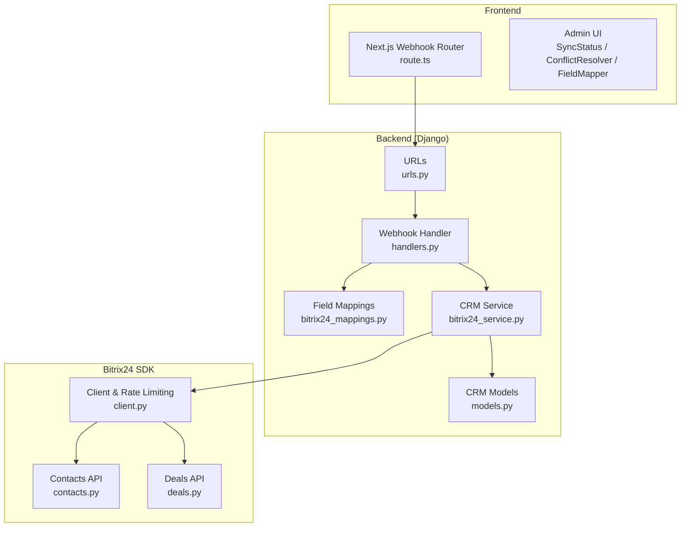
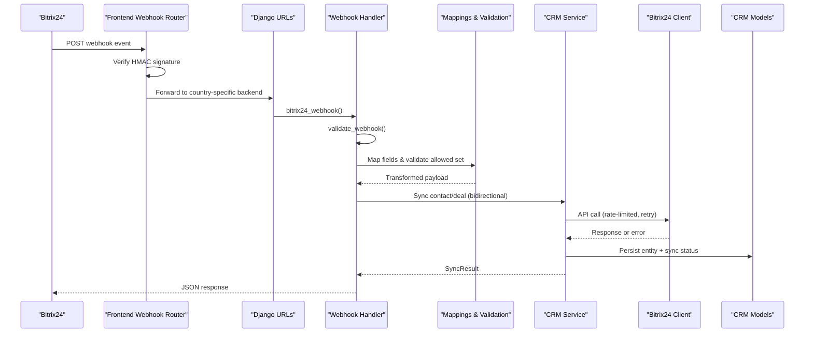
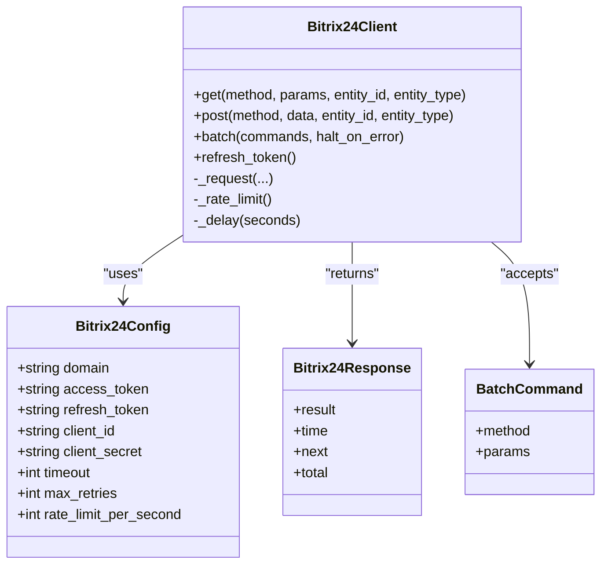
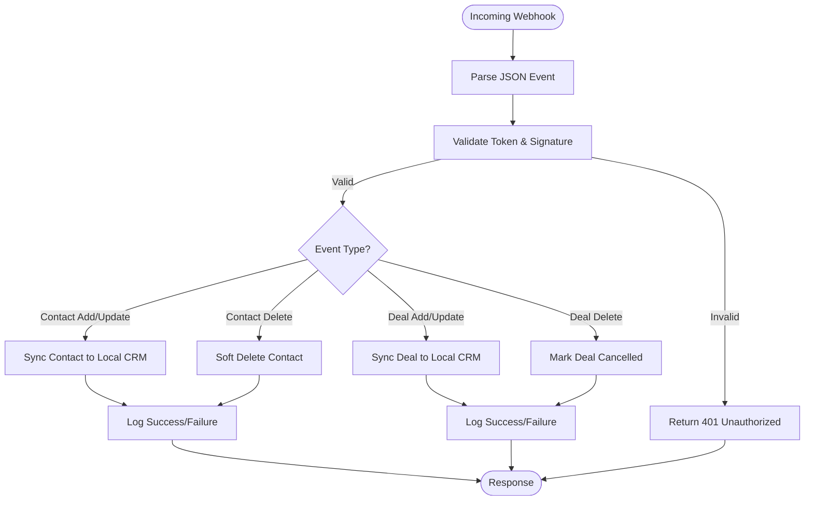
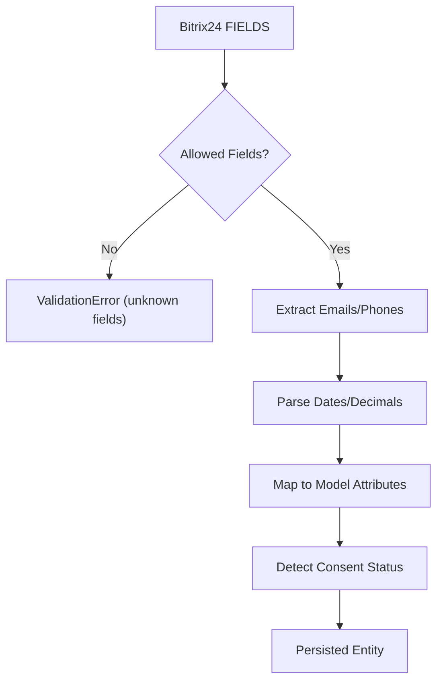
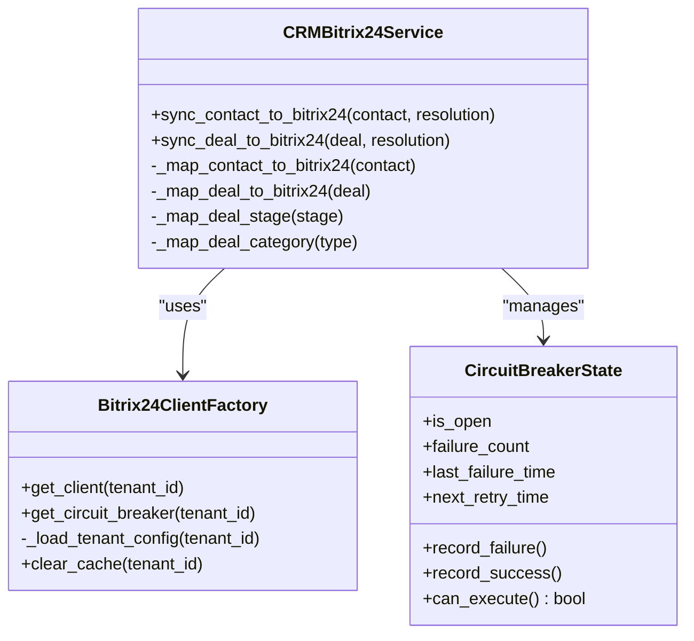
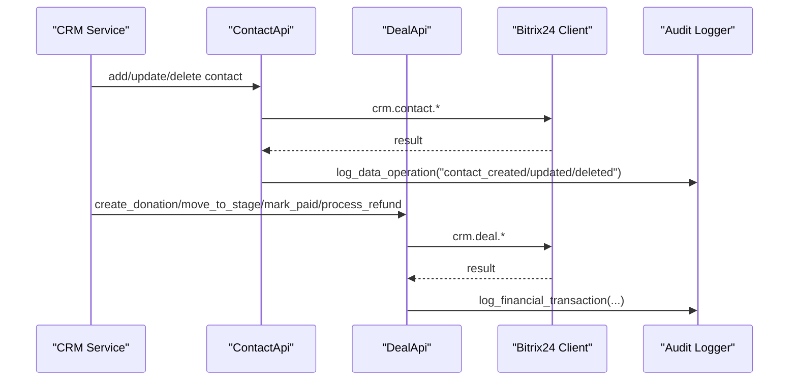
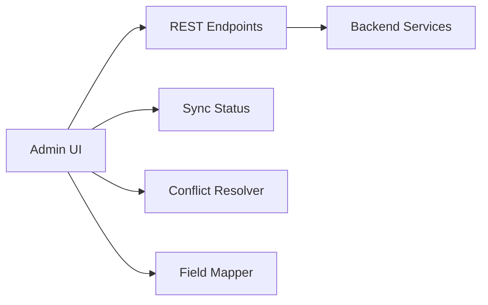
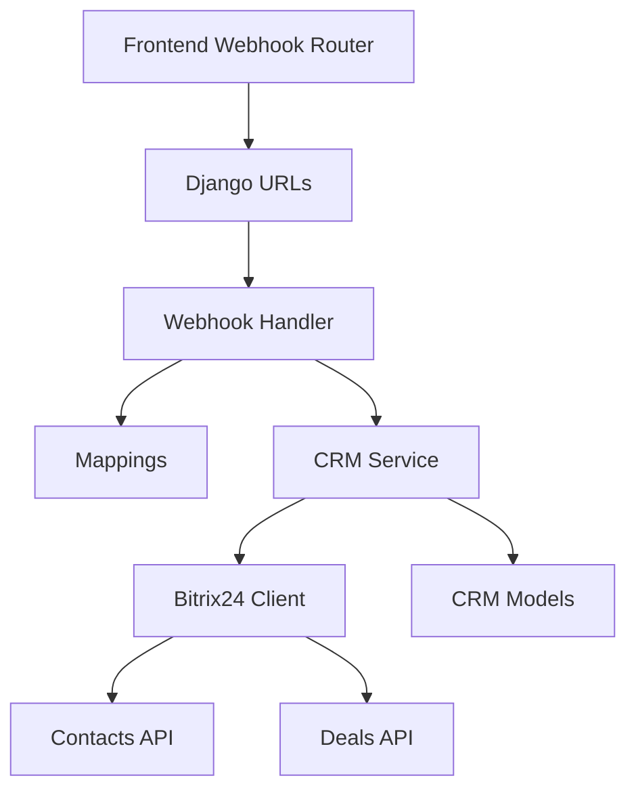

# Bitrix24 CRM Integration

<cite>
**Referenced Files in This Document**
- [client.py](file://backend/integrations/bitrix24/client.py)
- [handlers.py](file://backend/integrations/bitrix24/webhooks/handlers.py)
- [bitrix24_mappings.py](file://backend/django/apps/integrations/bitrix24_mappings.py)
- [bitrix24_service.py](file://backend/django/apps/crm/bitrix24_service.py)
- [contacts.py](file://backend/integrations/bitrix24/api/contacts.py)
- [deals.py](file://backend/integrations/bitrix24/api/deals.py)
- [models.py](file://backend/django/apps/crm/models.py)
- [urls.py](file://backend/django/apps/integrations/urls.py)
- [bitrix24.yml](file://countries/lt/config/bitrix24.yml)
- [route.ts](file://frontend/apps/admin-dashboard/src/app/api/bitrix24/webhook/route.ts)
- [ConflictResolver.tsx](file://frontend/apps/admin-dashboard/src/components/bitrix24/ConflictResolver.tsx)
- [SyncStatus.tsx](file://frontend/apps/admin-dashboard/src/components/bitrix24/SyncStatus.tsx)
- [FieldMapper.tsx](file://frontend/apps/admin-dashboard/src/components/bitrix24/FieldMapper.tsx)
</cite>

## Table of Contents
1. [Introduction](#introduction)
2. [Project Structure](#project-structure)
3. [Core Components](#core-components)
4. [Architecture Overview](#architecture-overview)
5. [Detailed Component Analysis](#detailed-component-analysis)
6. [Dependency Analysis](#dependency-analysis)
7. [Performance Considerations](#performance-considerations)
8. [Troubleshooting Guide](#troubleshooting-guide)
9. [Conclusion](#conclusion)
10. [Appendices](#appendices)

## Introduction
This document explains the Bitrix24 CRM integration that enables bi-directional synchronization between the platform and external CRM systems. It covers sync status monitoring, field mapping configuration, conflict resolution mechanisms, webhook handlers for real-time updates, error handling strategies, data transformation pipelines, API endpoints for CRM operations, authentication methods, rate limiting, and practical examples for configuring mappings, resolving conflicts, and debugging issues.

## Project Structure
The integration spans backend services (Django), a Bitrix24 SDK client, webhooks, and a frontend admin dashboard for monitoring and management.

**Diagram sources**
- [route.ts:351-494](file://frontend/apps/admin-dashboard/src/app/api/bitrix24/webhook/route.ts#L351-L494)
- [urls.py:6-16](file://backend/django/apps/integrations/urls.py#L6-L16)
- [handlers.py:486-513](file://backend/integrations/bitrix24/webhooks/handlers.py#L486-L513)
- [bitrix24_mappings.py:25-162](file://backend/django/apps/integrations/bitrix24_mappings.py#L25-L162)
- [bitrix24_service.py:238-572](file://backend/django/apps/crm/bitrix24_service.py#L238-L572)
- [client.py:91-361](file://backend/integrations/bitrix24/client.py#L91-L361)
- [contacts.py:138-290](file://backend/integrations/bitrix24/api/contacts.py#L138-L290)
- [deals.py:149-386](file://backend/integrations/bitrix24/api/deals.py#L149-L386)
- [models.py:154-177](file://backend/django/apps/crm/models.py#L154-L177)

**Section sources**
- [route.ts:351-494](file://frontend/apps/admin-dashboard/src/app/api/bitrix24/webhook/route.ts#L351-L494)
- [urls.py:6-16](file://backend/django/apps/integrations/urls.py#L6-L16)
- [handlers.py:486-513](file://backend/integrations/bitrix24/webhooks/handlers.py#L486-L513)
- [bitrix24_service.py:238-572](file://backend/django/apps/crm/bitrix24_service.py#L238-L572)
- [client.py:91-361](file://backend/integrations/bitrix24/client.py#L91-L361)
- [contacts.py:138-290](file://backend/integrations/bitrix24/api/contacts.py#L138-L290)
- [deals.py:149-386](file://backend/integrations/bitrix24/api/deals.py#L149-L386)
- [models.py:154-177](file://backend/django/apps/crm/models.py#L154-L177)

## Core Components
- Bitrix24 Client: Handles authentication, rate limiting, retries, batch requests, and audit logging.
- Webhook Handlers: Validate, route, and process Bitrix24 events with GDPR-compliant logging.
- Field Mapping Layer: Centralized, explicit mappings and transformations from Bitrix24 to Django models with validation and PII masking.
- CRM Service: Orchestrates bidirectional sync, conflict resolution strategies, circuit breaker, and tenant-aware client factory.
- API Modules: Type-safe Contacts and Deals APIs over the Bitrix24 REST endpoints.
- Frontend Admin: Monitoring sync status, resolving conflicts, and managing field mappings.

**Section sources**
- [client.py:91-361](file://backend/integrations/bitrix24/client.py#L91-L361)
- [handlers.py:63-170](file://backend/integrations/bitrix24/webhooks/handlers.py#L63-L170)
- [bitrix24_mappings.py:25-162](file://backend/django/apps/integrations/bitrix24_mappings.py#L25-L162)
- [bitrix24_service.py:238-572](file://backend/django/apps/crm/bitrix24_service.py#L238-L572)
- [contacts.py:138-290](file://backend/integrations/bitrix24/api/contacts.py#L138-L290)
- [deals.py:149-386](file://backend/integrations/bitrix24/api/deals.py#L149-L386)

## Architecture Overview
End-to-end flow for real-time updates and scheduled syncs:

**Diagram sources**
- [route.ts:351-494](file://frontend/apps/admin-dashboard/src/app/api/bitrix24/webhook/route.ts#L351-L494)
- [urls.py:6-16](file://backend/django/apps/integrations/urls.py#L6-L16)
- [handlers.py:486-513](file://backend/integrations/bitrix24/webhooks/handlers.py#L486-L513)
- [bitrix24_mappings.py:323-344](file://backend/django/apps/integrations/bitrix24_mappings.py#L323-L344)
- [bitrix24_service.py:302-468](file://backend/django/apps/crm/bitrix24_service.py#L302-L468)
- [client.py:168-321](file://backend/integrations/bitrix24/client.py#L168-L321)
- [models.py:154-177](file://backend/django/apps/crm/models.py#L154-L177)

## Detailed Component Analysis

### Bitrix24 Client
- Responsibilities:
  - Authentication via access token; supports refresh flow using refresh token and client credentials.
  - Rate limiting per second; exponential backoff on 429 responses.
  - Retry logic with configurable max retries and timeouts.
  - Batch request support for multiple API calls in one HTTP request.
  - Audit logging for API calls and errors.
- Error taxonomy:
  - Bitrix24AuthError (including expired tokens).
  - Bitrix24RateLimitError (with retry_after hint).
  - Bitrix24ApiError (error code, message, status, details).
- Data structures:
  - Bitrix24Config, Bitrix24Response, BatchCommand.

**Diagram sources**
- [client.py:51-127](file://backend/integrations/bitrix24/client.py#L51-L127)
- [client.py:168-361](file://backend/integrations/bitrix24/client.py#L168-L361)

**Section sources**
- [client.py:23-62](file://backend/integrations/bitrix24/client.py#L23-L62)
- [client.py:91-361](file://backend/integrations/bitrix24/client.py#L91-L361)

### Webhook Handlers
- Endpoints:
  - Django view receives Bitrix24 webhooks at integrations/webhooks/bitrix24/.
- Security:
  - Validates application token and optional HMAC signature.
- Processing:
  - Routes events to handlers for contacts, deals, calendar entries.
  - Performs soft deletes for deleted entities to preserve audit trails.
  - Logs all processing outcomes for compliance.

**Diagram sources**
- [handlers.py:486-513](file://backend/integrations/bitrix24/webhooks/handlers.py#L486-L513)
- [handlers.py:100-170](file://backend/integrations/bitrix24/webhooks/handlers.py#L100-L170)
- [handlers.py:173-291](file://backend/integrations/bitrix24/webhooks/handlers.py#L173-L291)
- [handlers.py:295-396](file://backend/integrations/bitrix24/webhooks/handlers.py#L295-L396)

**Section sources**
- [handlers.py:63-170](file://backend/integrations/bitrix24/webhooks/handlers.py#L63-L170)
- [handlers.py:173-396](file://backend/integrations/bitrix24/webhooks/handlers.py#L173-L396)
- [handlers.py:486-513](file://backend/integrations/bitrix24/webhooks/handlers.py#L486-L513)

### Field Mapping Configuration
- Explicit mappings define which Bitrix24 fields map to Django model attributes.
- Whitelisting prevents unknown fields from being persisted, reducing risk from undocumented API changes.
- Helpers extract multi-value fields (emails, phones), parse dates, decimals, and map source IDs.
- Consent detection reads custom fields to determine GDPR consent status.

**Diagram sources**
- [bitrix24_mappings.py:25-162](file://backend/django/apps/integrations/bitrix24_mappings.py#L25-L162)
- [bitrix24_mappings.py:210-317](file://backend/django/apps/integrations/bitrix24_mappings.py#L210-L317)
- [bitrix24_mappings.py:323-368](file://backend/django/apps/integrations/bitrix24_mappings.py#L323-L368)

**Section sources**
- [bitrix24_mappings.py:25-162](file://backend/django/apps/integrations/bitrix24_mappings.py#L25-L162)
- [bitrix24_mappings.py:210-317](file://backend/django/apps/integrations/bitrix24_mappings.py#L210-L317)
- [bitrix24_mappings.py:323-368](file://backend/django/apps/integrations/bitrix24_mappings.py#L323-L368)

### CRM Service (Bidirectional Sync & Conflict Resolution)
- Tenant-aware client factory loads per-tenant Bitrix24 config and caches clients and circuit breakers.
- Sync methods map local CRM entities to Bitrix24 format and create/update accordingly.
- Conflict resolution strategies:
  - LOCAL_WINS, REMOTE_WINS, LATEST_WINS, MANUAL.
- Circuit breaker protects against cascading failures and manages recovery windows.
- Audit entries record sync operations and outcomes.

**Diagram sources**
- [bitrix24_service.py:109-236](file://backend/django/apps/crm/bitrix24_service.py#L109-L236)
- [bitrix24_service.py:238-572](file://backend/django/apps/crm/bitrix24_service.py#L238-L572)

**Section sources**
- [bitrix24_service.py:43-107](file://backend/django/apps/crm/bitrix24_service.py#L43-L107)
- [bitrix24_service.py:109-236](file://backend/django/apps/crm/bitrix24_service.py#L109-L236)
- [bitrix24_service.py:238-572](file://backend/django/apps/crm/bitrix24_service.py#L238-L572)

### API Modules (Contacts and Deals)
- Contacts API:
  - CRUD operations with GDPR-compliant audit logging.
  - Upsert by email and queries by parish code.
- Deals API:
  - Financial transaction handling with PCI-DSS compliant logging.
  - Donation creation, stage transitions, marking paid, refunds.
  - Queries by contact and parish.

**Diagram sources**
- [contacts.py:138-290](file://backend/integrations/bitrix24/api/contacts.py#L138-L290)
- [deals.py:149-386](file://backend/integrations/bitrix24/api/deals.py#L149-L386)
- [client.py:168-321](file://backend/integrations/bitrix24/client.py#L168-L321)

**Section sources**
- [contacts.py:138-290](file://backend/integrations/bitrix24/api/contacts.py#L138-L290)
- [deals.py:149-386](file://backend/integrations/bitrix24/api/deals.py#L149-L386)

### Frontend Admin Dashboard
- Sync Status: Displays success/failure counts and pending items for last 24 hours.
- Conflict Resolver: Presents local vs remote versions and allows manual merge or accept local/remote.
- Field Mapper: UI to configure entity-type-scoped mappings, directions, transforms, and enable/disable flags.

**Diagram sources**
- [SyncStatus.tsx:114-151](file://frontend/apps/admin-dashboard/src/components/bitrix24/SyncStatus.tsx#L114-L151)
- [ConflictResolver.tsx:50-206](file://frontend/apps/admin-dashboard/src/components/bitrix24/ConflictResolver.tsx#L50-L206)
- [FieldMapper.tsx:69-196](file://frontend/apps/admin-dashboard/src/components/bitrix24/FieldMapper.tsx#L69-L196)

**Section sources**
- [SyncStatus.tsx:114-151](file://frontend/apps/admin-dashboard/src/components/bitrix24/SyncStatus.tsx#L114-L151)
- [ConflictResolver.tsx:50-206](file://frontend/apps/admin-dashboard/src/components/bitrix24/ConflictResolver.tsx#L50-L206)
- [FieldMapper.tsx:69-196](file://frontend/apps/admin-dashboard/src/components/bitrix24/FieldMapper.tsx#L69-L196)

## Dependency Analysis
- The CRM service depends on the Bitrix24 client for network I/O and uses the CRM models for persistence.
- Webhook handlers depend on mapping utilities and CRM service to persist changes.
- Frontend routes forward webhooks to country-specific backends and provide admin interfaces for monitoring and management.

**Diagram sources**
- [route.ts:351-494](file://frontend/apps/admin-dashboard/src/app/api/bitrix24/webhook/route.ts#L351-L494)
- [urls.py:6-16](file://backend/django/apps/integrations/urls.py#L6-L16)
- [handlers.py:486-513](file://backend/integrations/bitrix24/webhooks/handlers.py#L486-L513)
- [bitrix24_mappings.py:25-162](file://backend/django/apps/integrations/bitrix24_mappings.py#L25-L162)
- [bitrix24_service.py:238-572](file://backend/django/apps/crm/bitrix24_service.py#L238-L572)
- [client.py:91-361](file://backend/integrations/bitrix24/client.py#L91-L361)
- [contacts.py:138-290](file://backend/integrations/bitrix24/api/contacts.py#L138-L290)
- [deals.py:149-386](file://backend/integrations/bitrix24/api/deals.py#L149-L386)

**Section sources**
- [route.ts:351-494](file://frontend/apps/admin-dashboard/src/app/api/bitrix24/webhook/route.ts#L351-L494)
- [urls.py:6-16](file://backend/django/apps/integrations/urls.py#L6-L16)
- [handlers.py:486-513](file://backend/integrations/bitrix24/webhooks/handlers.py#L486-L513)
- [bitrix24_mappings.py:25-162](file://backend/django/apps/integrations/bitrix24_mappings.py#L25-L162)
- [bitrix24_service.py:238-572](file://backend/django/apps/crm/bitrix24_service.py#L238-L572)
- [client.py:91-361](file://backend/integrations/bitrix24/client.py#L91-L361)
- [contacts.py:138-290](file://backend/integrations/bitrix24/api/contacts.py#L138-L290)
- [deals.py:149-386](file://backend/integrations/bitrix24/api/deals.py#L149-L386)

## Performance Considerations
- Rate Limiting:
  - Client enforces per-second limits and handles 429 with retry-after delays.
  - Configurable max retries and exponential backoff reduce load spikes.
- Batch Requests:
  - Use batch endpoint to minimize round trips when performing multiple operations.
- Circuit Breaker:
  - Prevents cascading failures by opening after threshold failures and allowing half-open retries.
- Caching:
  - Tenant configs and clients are cached to avoid repeated lookups.
- Async Processing:
  - Webhook handlers use async patterns and can be extended with Celery tasks for heavy workloads.

[No sources needed since this section provides general guidance]

## Troubleshooting Guide
Common issues and how to address them:

- Invalid webhook signature:
  - Ensure HMAC secret is configured and headers match expected values.
  - Check frontend verification and forwarding headers.
- Authentication failures:
  - Confirm access token validity and refresh flow; handle expired tokens gracefully.
- Rate limit exceeded:
  - Observe retry-after header and adjust client rate_limit_per_second if needed.
- Unknown fields rejected:
  - Update ALLOWED_* sets and mappings when new Bitrix24 fields are introduced.
- Sync conflicts:
  - Use conflict resolver UI to choose local wins, remote wins, or manual merge.
- Monitoring:
  - Use SyncStatus component to track success/failure counts and pending items.

**Section sources**
- [handlers.py:100-170](file://backend/integrations/bitrix24/webhooks/handlers.py#L100-L170)
- [client.py:246-321](file://backend/integrations/bitrix24/client.py#L246-L321)
- [bitrix24_mappings.py:323-344](file://backend/django/apps/integrations/bitrix24_mappings.py#L323-L344)
- [ConflictResolver.tsx:50-206](file://frontend/apps/admin-dashboard/src/components/bitrix24/ConflictResolver.tsx#L50-L206)
- [SyncStatus.tsx:114-151](file://frontend/apps/admin-dashboard/src/components/bitrix24/SyncStatus.tsx#L114-L151)

## Conclusion
The Bitrix24 CRM integration provides robust, secure, and GDPR-compliant bi-directional synchronization. It features explicit field mappings, strong validation, comprehensive error handling, rate limiting, and tenant-aware orchestration. The frontend tools enable operators to monitor sync health, resolve conflicts, and manage mappings effectively.

[No sources needed since this section summarizes without analyzing specific files]

## Appendices

### API Endpoints for CRM Operations
- Django URL routes:
  - Integrations webhooks:
    - POST /integrations/webhooks/bitrix24/ — Receives Bitrix24 webhooks.
    - GET /integrations/webhooks/bitrix24/health/ — Health check for webhook service.
- Bitrix24 REST endpoints used by SDK:
  - Contacts:
    - crm.contact.get, crm.contact.list, crm.contact.add, crm.contact.update, crm.contact.delete.
  - Deals:
    - crm.deal.get, crm.deal.list, crm.deal.add, crm.deal.update.
  - Batch:
    - batch — Execute multiple commands in one request.

**Section sources**
- [urls.py:6-16](file://backend/django/apps/integrations/urls.py#L6-L16)
- [contacts.py:148-290](file://backend/integrations/bitrix24/api/contacts.py#L148-L290)
- [deals.py:160-386](file://backend/integrations/bitrix24/api/deals.py#L160-L386)
- [client.py:204-244](file://backend/integrations/bitrix24/client.py#L204-L244)

### Authentication Methods
- Access token-based authentication for REST calls.
- OAuth token refresh using refresh_token, client_id, and client_secret.
- Webhook authenticity verified via application token and HMAC signature.

**Section sources**
- [client.py:338-361](file://backend/integrations/bitrix24/client.py#L338-L361)
- [handlers.py:100-127](file://backend/integrations/bitrix24/webhooks/handlers.py#L100-L127)
- [route.ts:113-151](file://frontend/apps/admin-dashboard/src/app/api/bitrix24/webhook/route.ts#L113-L151)

### Rate Limiting
- Client-level rate limiter enforces requests per second.
- Handles 429 responses with retry-after delays and exponential backoff.
- Configurable thresholds in Bitrix24 config and country-specific settings.

**Section sources**
- [client.py:323-336](file://backend/integrations/bitrix24/client.py#L323-L336)
- [client.py:263-303](file://backend/integrations/bitrix24/client.py#L263-L303)
- [bitrix24.yml:292-296](file://countries/lt/config/bitrix24.yml#L292-L296)

### Examples

- Configure new field mappings:
  - Extend CONTACT_FIELD_MAP or CONTACT_CUSTOM_FIELD_MAP to include new Bitrix24 fields.
  - Update ALLOWED_CONTACT_FIELDS to whitelist new fields.
  - Use helpers to extract and transform values before persisting.

**Section sources**
- [bitrix24_mappings.py:25-80](file://backend/django/apps/integrations/bitrix24_mappings.py#L25-L80)
- [bitrix24_mappings.py:210-317](file://backend/django/apps/integrations/bitrix24_mappings.py#L210-L317)

- Handle sync conflicts:
  - Choose resolution strategy (local_wins, remote_wins, latest_wins, manual).
  - Use admin UI to compare local vs remote data and apply merged changes.

**Section sources**
- [bitrix24_service.py:51-57](file://backend/django/apps/crm/bitrix24_service.py#L51-L57)
- [ConflictResolver.tsx:50-206](file://frontend/apps/admin-dashboard/src/components/bitrix24/ConflictResolver.tsx#L50-L206)

- Debug integration issues:
  - Inspect webhook logs and audit entries for failed events.
  - Verify HMAC signatures and application tokens.
  - Check circuit breaker status and retry queues.

**Section sources**
- [handlers.py:154-170](file://backend/integrations/bitrix24/webhooks/handlers.py#L154-L170)
- [route.ts:351-494](file://frontend/apps/admin-dashboard/src/app/api/bitrix24/webhook/route.ts#L351-L494)
- [SyncStatus.tsx:114-151](file://frontend/apps/admin-dashboard/src/components/bitrix24/SyncStatus.tsx#L114-L151)