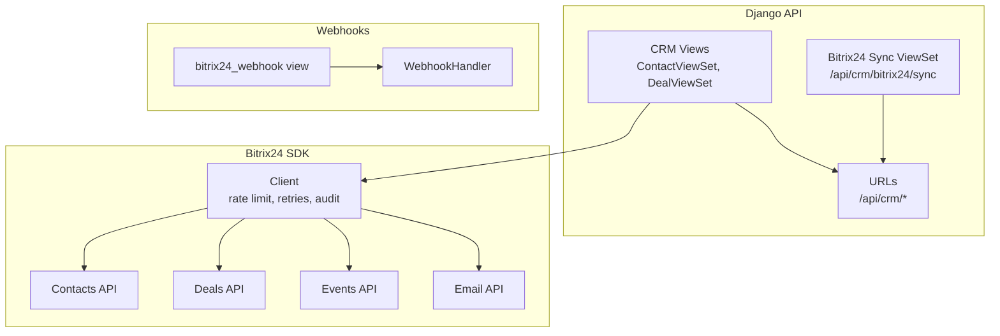
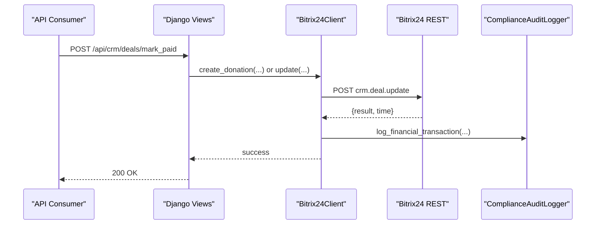
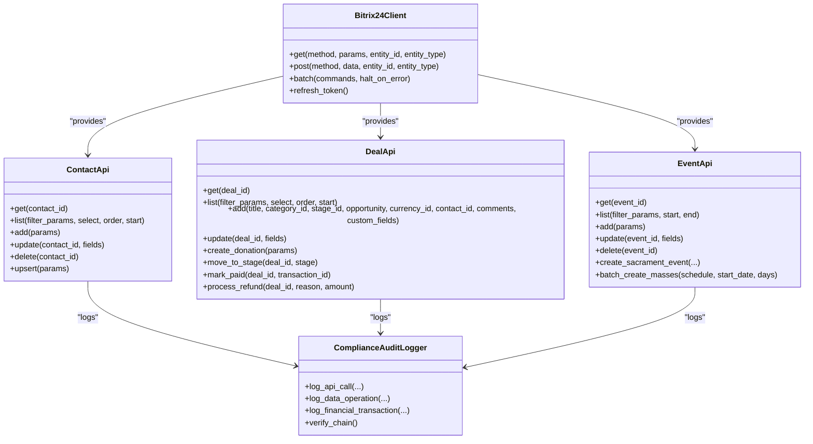
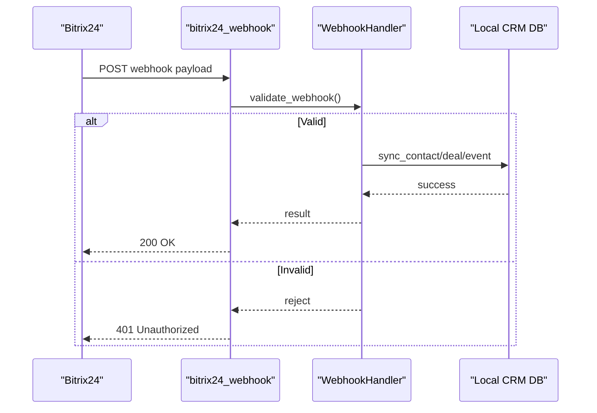
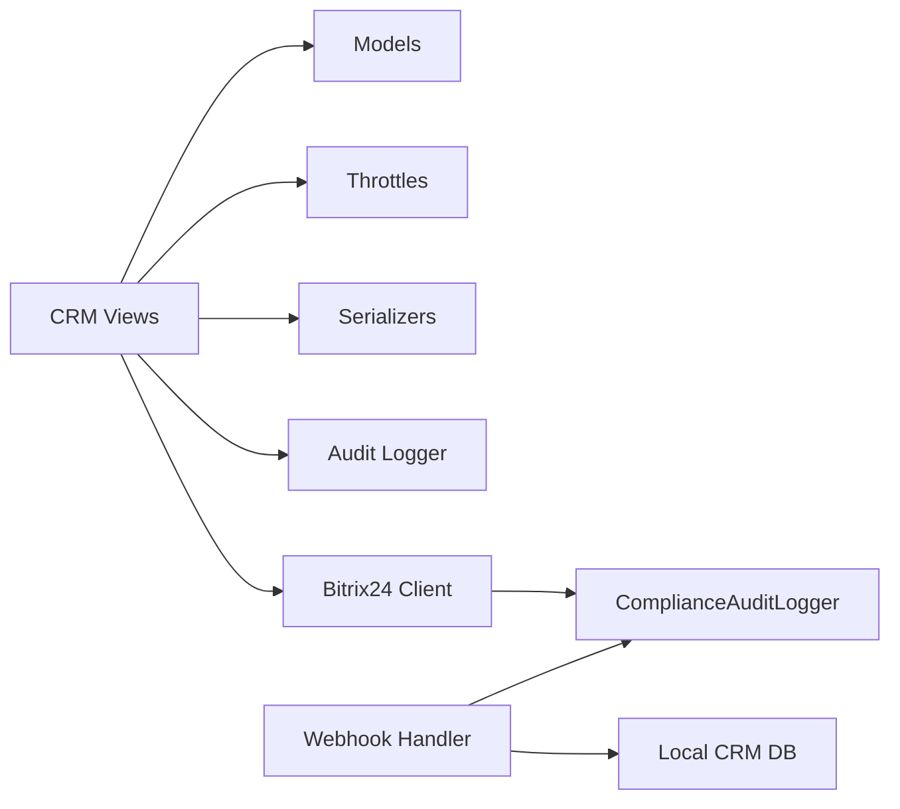

# CRM API Endpoints

<cite>
**Referenced Files in This Document**
- [client.py](file://backend/integrations/bitrix24/client.py)
- [contacts.py](file://backend/integrations/bitrix24/api/contacts.py)
- [deals.py](file://backend/integrations/bitrix24/api/deals.py)
- [events.py](file://backend/integrations/bitrix24/api/events.py)
- [handlers.py](file://backend/integrations/bitrix24/webhooks/handlers.py)
- [logger.py](file://backend/integrations/bitrix24/audit/logger.py)
- [views.py](file://backend/django/apps/crm/api/views.py)
- [urls.py](file://backend/django/apps/crm/api/urls.py)
- [models.py](file://backend/django/apps/crm/models.py)
</cite>

## Table of Contents
1. [Introduction](#introduction)
2. [Project Structure](#project-structure)
3. [Core Components](#core-components)
4. [Architecture Overview](#architecture-overview)
5. [Detailed Component Analysis](#detailed-component-analysis)
6. [Dependency Analysis](#dependency-analysis)
7. [Performance Considerations](#performance-considerations)
8. [Troubleshooting Guide](#troubleshooting-guide)
9. [Conclusion](#conclusion)
10. [Appendices](#appendices)

## Introduction
This document provides API documentation for the Bitrix24 CRM integration endpoints exposed by the Django backend and the internal SDK used to interact with Bitrix24. It covers:
- RESTful CRM operations for contacts, deals, and calendar events
- Authentication using JWT tokens at the Django API layer and token-based access to Bitrix24
- Rate limiting policies for both Django views and Bitrix24 client calls
- Error handling patterns and retry strategies
- Webhook endpoints for real-time CRM events
- Security considerations, data validation rules, and performance optimization tips

## Project Structure
The integration spans two layers:
- Django API layer (DRF ViewSets) exposing authenticated endpoints for CRM entities and Bitrix24 sync
- Bitrix24 SDK layer providing typed clients for contacts, deals, events, email, and batch operations

**Diagram sources**
- [urls.py:18-31](file://backend/django/apps/crm/api/urls.py#L18-L31)
- [views.py:141-769](file://backend/django/apps/crm/api/views.py#L141-L769)
- [client.py:91-166](file://backend/integrations/bitrix24/client.py#L91-L166)
- [handlers.py:486-513](file://backend/integrations/bitrix24/webhooks/handlers.py#L486-L513)

**Section sources**
- [urls.py:1-32](file://backend/django/apps/crm/api/urls.py#L1-L32)
- [views.py:1-769](file://backend/django/apps/crm/api/views.py#L1-L769)
- [client.py:1-403](file://backend/integrations/bitrix24/client.py#L1-L403)

## Core Components
- Bitrix24Client: Async HTTP client with rate limiting, retries, batch support, and compliance audit logging.
- ContactApi: CRUD for Bitrix24 contacts with GDPR-compliant audit logs.
- DealApi: Financial deal management with PCI-DSS compliant transaction logging.
- EventApi: Calendar event management for masses, sacraments, and church events.
- WebhookHandler: Receives and processes Bitrix24 webhooks with signature verification and tenant-scoped routing.
- ComplianceAuditLogger: Tamper-evident audit chain for GDPR and PCI-DSS compliance.

**Section sources**
- [client.py:91-166](file://backend/integrations/bitrix24/client.py#L91-L166)
- [contacts.py:138-290](file://backend/integrations/bitrix24/api/contacts.py#L138-L290)
- [deals.py:149-386](file://backend/integrations/bitrix24/api/deals.py#L149-L386)
- [events.py:175-349](file://backend/integrations/bitrix24/api/events.py#L175-L349)
- [handlers.py:63-153](file://backend/integrations/bitrix24/webhooks/handlers.py#L63-L153)
- [logger.py:58-175](file://backend/integrations/bitrix24/audit/logger.py#L58-L175)

## Architecture Overview
The system exposes a secure Django API for CRM operations and integrates with Bitrix24 via an SDK that handles authentication, rate limiting, retries, and audit logging. Webhooks from Bitrix24 are received by a dedicated endpoint, validated, and processed to keep local CRM records in sync.

**Diagram sources**
- [views.py:334-350](file://backend/django/apps/crm/api/views.py#L334-L350)
- [deals.py:247-295](file://backend/integrations/bitrix24/api/deals.py#L247-L295)
- [client.py:187-202](file://backend/integrations/bitrix24/client.py#L187-L202)
- [logger.py:236-285](file://backend/integrations/bitrix24/audit/logger.py#L236-L285)

## Detailed Component Analysis

### Authentication and Authorization
- Django API uses JWT-based authentication via DRF’s IsAuthenticated and organization membership checks. All CRM endpoints require an authenticated user within the correct tenant context.
- Bitrix24 API calls use an access token passed as a query parameter in requests; token refresh is supported via OAuth flow.

Key behaviors:
- Tenant isolation enforced at viewsets and model managers to prevent cross-tenant access.
- Sensitive operations have stricter throttling (e.g., financial operations).

**Section sources**
- [views.py:141-176](file://backend/django/apps/crm/api/views.py#L141-L176)
- [views.py:291-332](file://backend/django/apps/crm/api/views.py#L291-L332)
- [client.py:168-202](file://backend/integrations/bitrix24/client.py#L168-L202)
- [client.py:338-361](file://backend/integrations/bitrix24/client.py#L338-L361)
- [models.py:48-68](file://backend/django/apps/crm/models.py#L48-L68)

### Rate Limiting Policies
- Django API throttles:
  - Standard CRM operations: ~100/hour
  - Financial operations (mark paid, refund): ~20/hour
  - GDPR exports: ~5/hour
  - GDPR deletions: ~3/hour
- Bitrix24 client enforces per-second rate limits and exponential backoff on 429 responses.

**Section sources**
- [views.py:59-77](file://backend/django/apps/crm/api/views.py#L59-L77)
- [client.py:323-336](file://backend/integrations/bitrix24/client.py#L323-L336)
- [client.py:263-266](file://backend/integrations/bitrix24/client.py#L263-L266)

### Error Handling Patterns
- Bitrix24 client raises specific exceptions:
  - Bitrix24AuthError for expired/invalid tokens
  - Bitrix24RateLimitError for 429 responses
  - Bitrix24ApiError for other API errors
- Retry logic with exponential backoff for timeouts and rate limits.
- Webhook handler validates signatures and application tokens; returns appropriate error responses for invalid payloads.

**Section sources**
- [client.py:23-49](file://backend/integrations/bitrix24/client.py#L23-L49)
- [client.py:246-321](file://backend/integrations/bitrix24/client.py#L246-L321)
- [handlers.py:100-127](file://backend/integrations/bitrix24/webhooks/handlers.py#L100-L127)
- [handlers.py:486-513](file://backend/integrations/bitrix24/webhooks/handlers.py#L486-L513)

### Data Validation Rules
- Django models enforce:
  - Tenant isolation (organization_id required)
  - Legal hold constraints preventing deletion when active
  - Consent tracking and versioning
  - Unique constraints for emails and Bitrix24 IDs per tenant
- Serializers validate request payloads for CRM endpoints.

**Section sources**
- [models.py:71-187](file://backend/django/apps/crm/models.py#L71-L187)
- [models.py:255-375](file://backend/django/apps/crm/models.py#L255-L375)
- [models.py:523-745](file://backend/django/apps/crm/models.py#L523-L745)

### Performance Optimization Tips
- Use list endpoints with select/filter/order parameters to minimize payload size.
- Leverage batch operations in Bitrix24 client for multiple calls.
- Apply caching headers where appropriate for read-only analytics endpoints.
- Use minimal serializers for list views to reduce bandwidth.

**Section sources**
- [contacts.py:158-181](file://backend/integrations/bitrix24/api/contacts.py#L158-L181)
- [deals.py:170-193](file://backend/integrations/bitrix24/api/deals.py#L170-L193)
- [client.py:204-244](file://backend/integrations/bitrix24/client.py#L204-L244)
- [views.py:171-175](file://backend/django/apps/crm/api/views.py#L171-L175)

## Dependency Analysis

**Diagram sources**
- [client.py:91-166](file://backend/integrations/bitrix24/client.py#L91-L166)
- [contacts.py:138-290](file://backend/integrations/bitrix24/api/contacts.py#L138-L290)
- [deals.py:149-386](file://backend/integrations/bitrix24/api/deals.py#L149-L386)
- [events.py:175-349](file://backend/integrations/bitrix24/api/events.py#L175-L349)
- [logger.py:58-175](file://backend/integrations/bitrix24/audit/logger.py#L58-L175)

**Section sources**
- [client.py:91-166](file://backend/integrations/bitrix24/client.py#L91-L166)
- [contacts.py:138-290](file://backend/integrations/bitrix24/api/contacts.py#L138-L290)
- [deals.py:149-386](file://backend/integrations/bitrix24/api/deals.py#L149-L386)
- [events.py:175-349](file://backend/integrations/bitrix24/api/events.py#L175-L349)
- [logger.py:58-175](file://backend/integrations/bitrix24/audit/logger.py#L58-L175)

## Detailed Component Analysis

### Contacts API
- Methods:
  - GET contact by ID
  - LIST contacts with filters/select/order
  - ADD contact
  - UPDATE contact
  - DELETE contact (GDPR right to erasure)
  - UPSERT by email
  - Get by parish code
- Request/response schemas:
  - Input uses typed dataclasses mapping to Bitrix24 fields and custom UF_* fields
  - Responses map to Bitrix24Contact with parsed dates and booleans
- Audit logging:
  - Create/update/delete operations logged for GDPR compliance

Example flows:
- Syncing a contact from Bitrix24 to local CRM via webhook triggers upsert logic based on email.

**Section sources**
- [contacts.py:13-81](file://backend/integrations/bitrix24/api/contacts.py#L13-L81)
- [contacts.py:83-136](file://backend/integrations/bitrix24/api/contacts.py#L83-L136)
- [contacts.py:148-290](file://backend/integrations/bitrix24/api/contacts.py#L148-L290)

### Deals API
- Methods:
  - GET deal by ID
  - LIST deals with filters/select/order
  - ADD deal
  - UPDATE deal
  - CREATE donation deal with financial logging
  - Move to stage, mark paid, process refund
  - Get by contact or parish
- Request/response schemas:
  - Typed enums for categories, stages, payment methods, donation types
  - Custom fields for tax-deductible, receipt sent, recurring flags
- Audit logging:
  - Financial transactions logged for PCI-DSS compliance

Example flows:
- Marking a deal as paid updates stage and logs a financial transaction.

**Section sources**
- [deals.py:15-53](file://backend/integrations/bitrix24/api/deals.py#L15-L53)
- [deals.py:55-132](file://backend/integrations/bitrix24/api/deals.py#L55-L132)
- [deals.py:134-147](file://backend/integrations/bitrix24/api/deals.py#L134-L147)
- [deals.py:160-386](file://backend/integrations/bitrix24/api/deals.py#L160-L386)

### Events API
- Methods:
  - GET event by ID
  - LIST events with date range filters
  - ADD event
  - UPDATE event
  - DELETE event
  - Create sacrament events
  - Batch create mass schedules
- Request/response schemas:
  - Typed enums for event and sacrament types
  - Custom fields for parish code, celebrant, intention, language

Example flows:
- Generating scheduled masses over a period and creating events in bulk.

**Section sources**
- [events.py:14-37](file://backend/integrations/bitrix24/api/events.py#L14-L37)
- [events.py:39-89](file://backend/integrations/bitrix24/api/events.py#L39-L89)
- [events.py:91-173](file://backend/integrations/bitrix24/api/events.py#L91-L173)
- [events.py:185-349](file://backend/integrations/bitrix24/api/events.py#L185-L349)

### Webhooks for Real-Time CRM Events
- Endpoint: bitrix24_webhook (POST)
- Validation:
  - Application token check
  - HMAC signature verification if configured
- Handlers:
  - Contact add/update/delete
  - Deal add/update/delete
  - Calendar entry add/update/delete
- Processing:
  - Syncs changes to local CRM database
  - Soft deletes for GDPR audit trail
  - Logs processing outcomes

**Diagram sources**
- [handlers.py:100-153](file://backend/integrations/bitrix24/webhooks/handlers.py#L100-L153)
- [handlers.py:173-201](file://backend/integrations/bitrix24/webhooks/handlers.py#L173-L201)
- [handlers.py:295-320](file://backend/integrations/bitrix24/webhooks/handlers.py#L295-L320)
- [handlers.py:486-513](file://backend/integrations/bitrix24/webhooks/handlers.py#L486-L513)

**Section sources**
- [handlers.py:37-61](file://backend/integrations/bitrix24/webhooks/handlers.py#L37-L61)
- [handlers.py:63-153](file://backend/integrations/bitrix24/webhooks/handlers.py#L63-L153)
- [handlers.py:173-201](file://backend/integrations/bitrix24/webhooks/handlers.py#L173-L201)
- [handlers.py:295-320](file://backend/integrations/bitrix24/webhooks/handlers.py#L295-L320)
- [handlers.py:486-513](file://backend/integrations/bitrix24/webhooks/handlers.py#L486-L513)

### Django API Endpoints
- Contacts:
  - List, retrieve, create, update, delete
  - Actions: grant_consent, withdraw_consent, export
- Deals:
  - List, retrieve, create, update, delete
  - Actions: mark_paid, refund, send_receipt, statistics
- Bitrix24 Sync:
  - Action: sync (queues entities to sync to Bitrix24)

Authentication and authorization:
- Requires authenticated user and organization membership
- Tenant isolation enforced

Rate limiting:
- Different throttle classes for sensitive operations

**Section sources**
- [urls.py:18-31](file://backend/django/apps/crm/api/urls.py#L18-L31)
- [views.py:141-276](file://backend/django/apps/crm/api/views.py#L141-L276)
- [views.py:291-446](file://backend/django/apps/crm/api/views.py#L291-L446)
- [views.py:743-769](file://backend/django/apps/crm/api/views.py#L743-L769)

## Dependency Analysis

**Diagram sources**
- [views.py:141-769](file://backend/django/apps/crm/api/views.py#L141-L769)
- [models.py:71-187](file://backend/django/apps/crm/models.py#L71-L187)
- [client.py:91-166](file://backend/integrations/bitrix24/client.py#L91-L166)
- [handlers.py:63-153](file://backend/integrations/bitrix24/webhooks/handlers.py#L63-L153)
- [logger.py:58-175](file://backend/integrations/bitrix24/audit/logger.py#L58-L175)

**Section sources**
- [views.py:141-769](file://backend/django/apps/crm/api/views.py#L141-L769)
- [models.py:71-187](file://backend/django/apps/crm/models.py#L71-L187)
- [client.py:91-166](file://backend/integrations/bitrix24/client.py#L91-L166)
- [handlers.py:63-153](file://backend/integrations/bitrix24/webhooks/handlers.py#L63-L153)
- [logger.py:58-175](file://backend/integrations/bitrix24/audit/logger.py#L58-L175)

## Performance Considerations
- Use selective field retrieval (select) in list endpoints to reduce payload sizes.
- Employ batch operations for multiple Bitrix24 calls to minimize network overhead.
- Apply caching for read-heavy analytics endpoints where appropriate.
- Enforce strict throttling on sensitive operations to protect resources.
- Avoid full object serialization in list views by using minimal serializers.

[No sources needed since this section provides general guidance]

## Troubleshooting Guide
Common issues and resolutions:
- Authentication failures:
  - Ensure JWT token is valid and includes correct tenant context
  - Verify organization membership permissions
- Rate limiting errors:
  - Respect Retry-After headers from Bitrix24 429 responses
  - Adjust client rate_limit_per_second settings if necessary
- Webhook validation failures:
  - Check application token configuration
  - Validate HMAC signature using configured secret
- Data integrity:
  - Use audit log integrity verification to detect tampering
  - Review legal hold status before attempting deletions

**Section sources**
- [client.py:263-321](file://backend/integrations/bitrix24/client.py#L263-L321)
- [handlers.py:100-127](file://backend/integrations/bitrix24/webhooks/handlers.py#L100-L127)
- [logger.py:356-403](file://backend/integrations/bitrix24/audit/logger.py#L356-L403)
- [models.py:225-235](file://backend/django/apps/crm/models.py#L225-L235)

## Conclusion
The Bitrix24 CRM integration provides a robust, secure, and compliant API surface for managing contacts, deals, and events while maintaining GDPR and PCI-DSS standards. The architecture separates concerns between Django API endpoints and the Bitrix24 SDK, ensuring clear boundaries, strong security controls, and comprehensive auditability. Webhooks enable real-time synchronization, and rate limiting plus retry logic ensure resilience under load.

[No sources needed since this section summarizes without analyzing specific files]

## Appendices

### API Reference Summary
- Django CRM endpoints:
  - Contacts: list, retrieve, create, update, delete, consent actions, export
  - Deals: list, retrieve, create, update, delete, mark_paid, refund, send_receipt, statistics
  - Bitrix24 Sync: sync action
- Bitrix24 SDK methods:
  - Contacts: get, list, add, update, delete, upsert, find_by_email, get_by_parish
  - Deals: get, list, add, update, create_donation, move_to_stage, mark_paid, process_refund, get_by_contact, get_by_parish
  - Events: get, list, add, update, delete, create_sacrament_event, batch_create_masses

**Section sources**
- [urls.py:18-31](file://backend/django/apps/crm/api/urls.py#L18-L31)
- [views.py:141-769](file://backend/django/apps/crm/api/views.py#L141-L769)
- [contacts.py:148-290](file://backend/integrations/bitrix24/api/contacts.py#L148-L290)
- [deals.py:160-386](file://backend/integrations/bitrix24/api/deals.py#L160-L386)
- [events.py:185-349](file://backend/integrations/bitrix24/api/events.py#L185-L349)