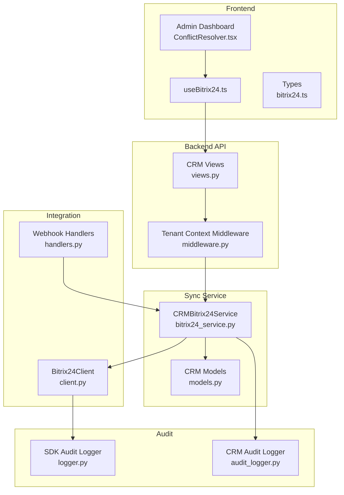
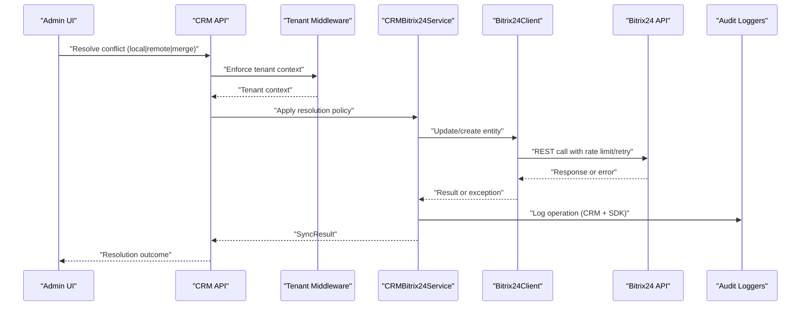
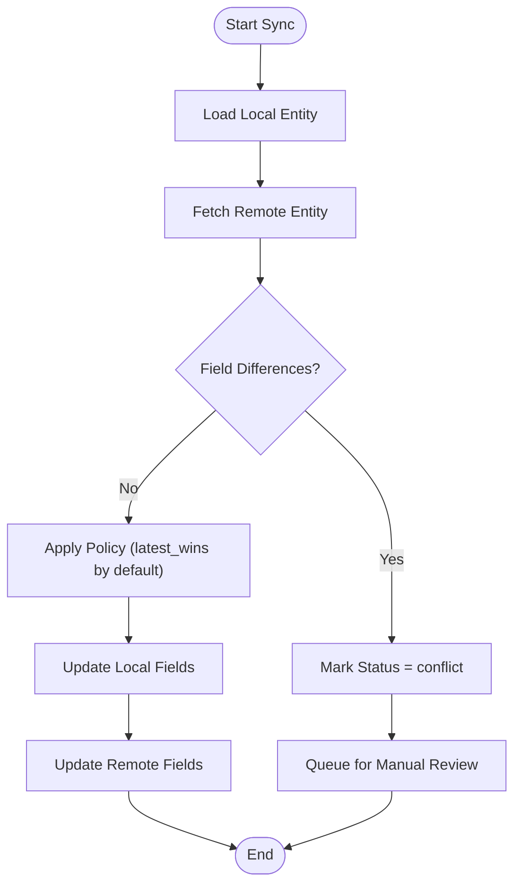
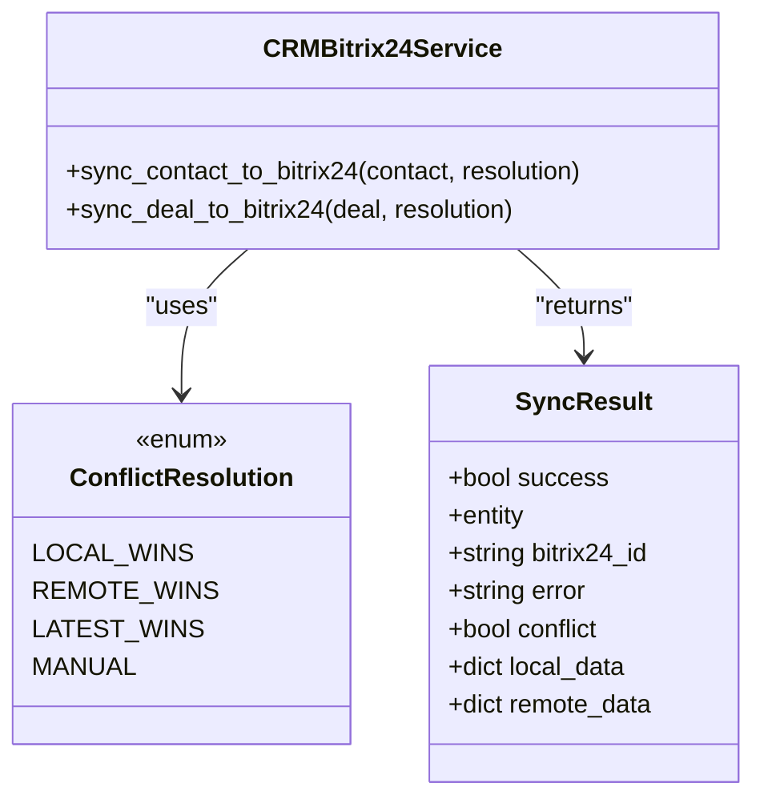
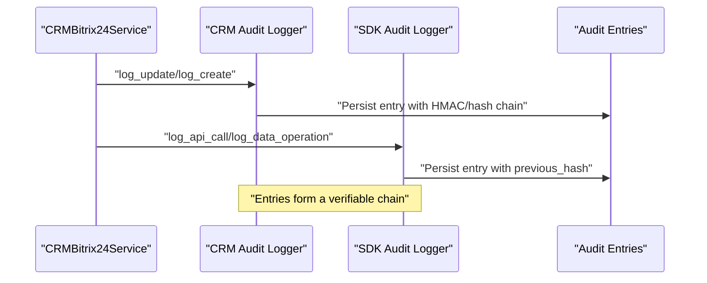
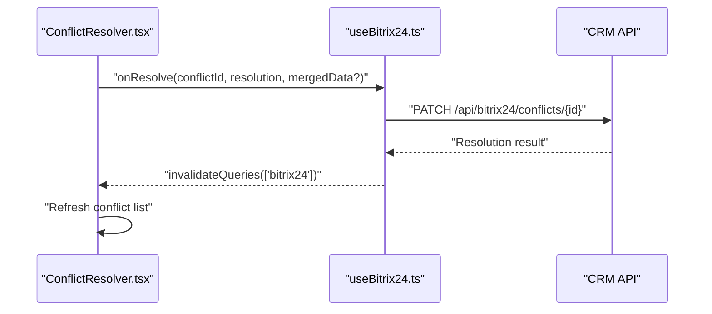
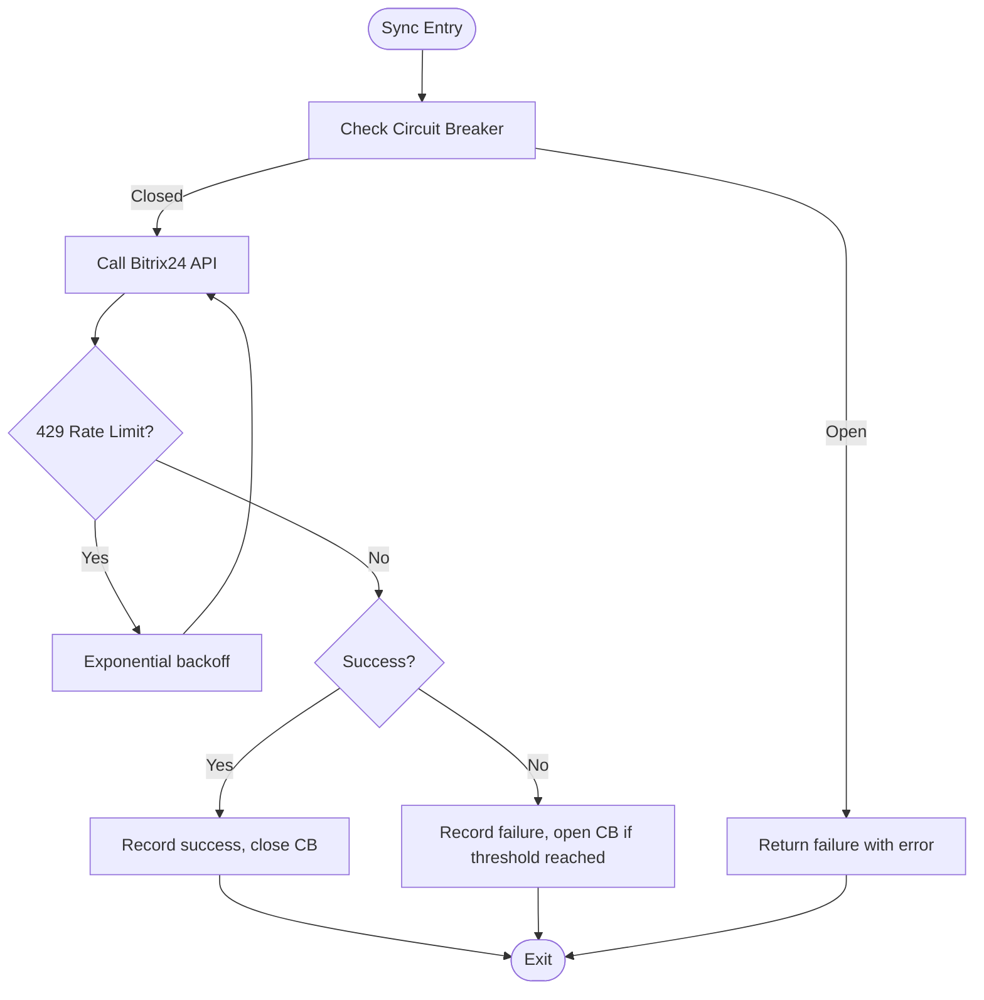
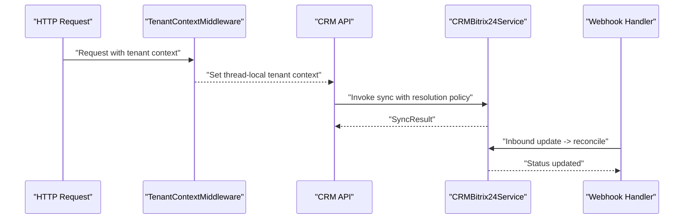
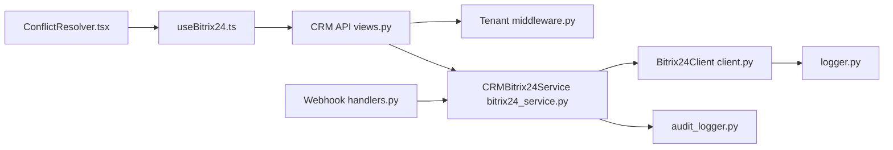

# Conflict Resolution Engine

<cite>
**Referenced Files in This Document**
- [bitrix24_service.py](file://backend/django/apps/crm/bitrix24_service.py)
- [client.py](file://backend/integrations/bitrix24/client.py)
- [handlers.py](file://backend/integrations/bitrix24/webhooks/handlers.py)
- [middleware.py](file://backend/django/apps/crm/middleware.py)
- [models.py](file://backend/django/apps/crm/models.py)
- [views.py](file://backend/django/apps/crm/api/views.py)
- [ConflictResolver.tsx](file://frontend/apps/admin-dashboard/src/components/bitrix24/ConflictResolver.tsx)
- [useBitrix24.ts](file://frontend/apps/admin-dashboard/src/hooks/useBitrix24.ts)
- [bitrix24.ts](file://frontend/apps/admin-dashboard/src/types/bitrix24.ts)
- [logger.py](file://backend/integrations/bitrix24/audit/logger.py)
- [audit_logger.py](file://backend/django/apps/crm/audit_logger.py)
</cite>

## Table of Contents
1. Introduction
2. Project Structure
3. Core Components
4. Architecture Overview
5. Detailed Component Analysis
6. Dependency Analysis
7. Performance Considerations
8. Troubleshooting Guide
9. Conclusion

## Introduction
This document explains the conflict resolution engine that synchronizes data between the platform and Bitrix24 CRM. It covers how conflicts are detected, resolved (automatic policies and manual workflows), tracked in audit logs, and surfaced to users through an admin interface. It also details middleware that enforces tenant isolation and supports safe operations during synchronization.

## Project Structure
The conflict resolution system spans backend services, integration clients, webhooks, models, API endpoints, and a frontend UI:
- Backend service layer defines sync flows, strategies, and circuit breaker protection.
- Integration client handles Bitrix24 API calls with retries and rate limiting.
- Webhook handlers receive updates from Bitrix24 and reconcile them into local CRM entities.
- Models track sync state and support conflict status.
- API exposes sync and conflict resolution endpoints.
- Frontend provides a UI for reviewing and resolving conflicts.
- Audit loggers record tamper-evident events for compliance.

**Diagram sources**
- [ConflictResolver.tsx:1-206](file://frontend/apps/admin-dashboard/src/components/bitrix24/ConflictResolver.tsx#L1-L206)
- [useBitrix24.ts:117-159](file://frontend/apps/admin-dashboard/src/hooks/useBitrix24.ts#L117-L159)
- [bitrix24.ts:55-118](file://frontend/apps/admin-dashboard/src/types/bitrix24.ts#L55-L118)
- [views.py:735-769](file://backend/django/apps/crm/api/views.py#L735-L769)
- [middleware.py:96-154](file://backend/django/apps/crm/middleware.py#L96-L154)
- [bitrix24_service.py:238-393](file://backend/django/apps/crm/bitrix24_service.py#L238-L393)
- [client.py:91-321](file://backend/integrations/bitrix24/client.py#L91-L321)
- [handlers.py:173-269](file://backend/integrations/bitrix24/webhooks/handlers.py#L173-L269)
- [logger.py:58-174](file://backend/integrations/bitrix24/audit/logger.py#L58-L174)
- [audit_logger.py:154-347](file://backend/django/apps/crm/audit_logger.py#L154-L347)

**Section sources**
- [bitrix24_service.py:238-393](file://backend/django/apps/crm/bitrix24_service.py#L238-L393)
- [client.py:91-321](file://backend/integrations/bitrix24/client.py#L91-L321)
- [handlers.py:173-269](file://backend/integrations/bitrix24/webhooks/handlers.py#L173-L269)
- [middleware.py:96-154](file://backend/django/apps/crm/middleware.py#L96-L154)
- [models.py:154-177](file://backend/django/apps/crm/models.py#L154-L177)
- [views.py:735-769](file://backend/django/apps/crm/api/views.py#L735-L769)
- [ConflictResolver.tsx:1-206](file://frontend/apps/admin-dashboard/src/components/bitrix24/ConflictResolver.tsx#L1-L206)
- [useBitrix24.ts:117-159](file://frontend/apps/admin-dashboard/src/hooks/useBitrix24.ts#L117-L159)
- [bitrix24.ts:55-118](file://frontend/apps/admin-dashboard/src/types/bitrix24.ts#L55-L118)
- [logger.py:58-174](file://backend/integrations/bitrix24/audit/logger.py#L58-L174)
- [audit_logger.py:154-347](file://backend/django/apps/crm/audit_logger.py#L154-L347)

## Core Components
- Conflict resolution strategies: local_wins, remote_wins, latest_wins, manual.
- Sync result model carrying success flags, entity references, and conflict payloads.
- Circuit breaker protecting Bitrix24 calls under failures or rate limits.
- Webhook-based inbound reconciliation from Bitrix24 to local CRM.
- Tenant context middleware ensuring isolated operations and audit context.
- Models tracking sync status and Bitrix24 IDs for conflict detection.
- Admin UI enabling manual resolution with merge support.
- Audit logging for tamper-evident records across SDK and CRM layers.

**Section sources**
- [bitrix24_service.py:43-106](file://backend/django/apps/crm/bitrix24_service.py#L43-L106)
- [bitrix24_service.py:238-393](file://backend/django/apps/crm/bitrix24_service.py#L238-L393)
- [client.py:91-321](file://backend/integrations/bitrix24/client.py#L91-L321)
- [handlers.py:173-269](file://backend/integrations/bitrix24/webhooks/handlers.py#L173-L269)
- [middleware.py:96-154](file://backend/django/apps/crm/middleware.py#L96-L154)
- [models.py:154-177](file://backend/django/apps/crm/models.py#L154-L177)
- [ConflictResolver.tsx:1-206](file://frontend/apps/admin-dashboard/src/components/bitrix24/ConflictResolver.tsx#L1-L206)
- [useBitrix24.ts:117-159](file://frontend/apps/admin-dashboard/src/hooks/useBitrix24.ts#L117-L159)
- [bitrix24.ts:55-118](file://frontend/apps/admin-dashboard/src/types/bitrix24.ts#L55-L118)
- [logger.py:58-174](file://backend/integrations/bitrix24/audit/logger.py#L58-L174)
- [audit_logger.py:154-347](file://backend/django/apps/crm/audit_logger.py#L154-L347)

## Architecture Overview
The system uses a bidirectional sync approach:
- Outbound: Platform writes to Bitrix24 via CRMBitrix24Service, applying configured conflict strategies and circuit breaker protection.
- Inbound: Bitrix24 webhooks update local CRM entities; webhook handlers reconcile changes and log events.
- UI: Admin dashboard surfaces conflicts and allows manual resolution, invoking backend APIs.
- Audit: Both SDK and CRM layers produce tamper-evident logs for compliance.

**Diagram sources**
- [views.py:735-769](file://backend/django/apps/crm/api/views.py#L735-L769)
- [middleware.py:96-154](file://backend/django/apps/crm/middleware.py#L96-L154)
- [bitrix24_service.py:238-393](file://backend/django/apps/crm/bitrix24_service.py#L238-L393)
- [client.py:168-321](file://backend/integrations/bitrix24/client.py#L168-L321)
- [logger.py:176-196](file://backend/integrations/bitrix24/audit/logger.py#L176-L196)
- [audit_logger.py:218-347](file://backend/django/apps/crm/audit_logger.py#L218-L347)

## Detailed Component Analysis

### Conflict Detection Algorithms
- Field-level comparison: The frontend types define conflict structures including field, localValue, remoteValue, and timestamps, enabling side-by-side review.
- Status-driven detection: CRM models include bitrix24_sync_status with a “conflict” state, allowing queries to surface unresolved issues.
- Inbound vs outbound timing: Webhook handlers update local entities; outbound syncs may detect differences when attempting to push changes, marking conflicts accordingly.

**Diagram sources**
- [bitrix24_service.py:302-393](file://backend/django/apps/crm/bitrix24_service.py#L302-L393)
- [handlers.py:203-269](file://backend/integrations/bitrix24/webhooks/handlers.py#L203-L269)
- [models.py:154-177](file://backend/django/apps/crm/models.py#L154-L177)
- [bitrix24.ts:61-71](file://frontend/apps/admin-dashboard/src/types/bitrix24.ts#L61-L71)

**Section sources**
- [bitrix24_service.py:302-393](file://backend/django/apps/crm/bitrix24_service.py#L302-L393)
- [handlers.py:203-269](file://backend/integrations/bitrix24/webhooks/handlers.py#L203-L269)
- [models.py:154-177](file://backend/django/apps/crm/models.py#L154-L177)
- [bitrix24.ts:61-71](file://frontend/apps/admin-dashboard/src/types/bitrix24.ts#L61-L71)

### Resolution Strategies
- Automatic strategies:
  - local_wins: Prefer platform values.
  - remote_wins: Prefer Bitrix24 values.
  - latest_wins: Use most recent timestamp (default in sync methods).
- Manual strategy:
  - Users select “Keep Local”, “Accept Remote”, or “Merge Manually” via the admin UI.
  - Merge payload is sent to backend for application.

**Diagram sources**
- [bitrix24_service.py:43-106](file://backend/django/apps/crm/bitrix24_service.py#L43-L106)
- [bitrix24_service.py:302-393](file://backend/django/apps/crm/bitrix24_service.py#L302-L393)

**Section sources**
- [bitrix24_service.py:43-106](file://backend/django/apps/crm/bitrix24_service.py#L43-L106)
- [bitrix24_service.py:302-393](file://backend/django/apps/crm/bitrix24_service.py#L302-L393)

### Conflict History Tracking and Audit Logging
- CRM audit logger creates tamper-evident entries for create/update/delete/access events, including sync-related operations.
- SDK audit logger records API calls and data operations with hash chaining and anchors for integrity verification.
- Export and statistics endpoints allow auditing and verification of chain integrity.

**Diagram sources**
- [audit_logger.py:218-347](file://backend/django/apps/crm/audit_logger.py#L218-L347)
- [logger.py:176-196](file://backend/integrations/bitrix24/audit/logger.py#L176-L196)
- [views.py:547-634](file://backend/django/apps/crm/api/views.py#L547-L634)

**Section sources**
- [audit_logger.py:218-347](file://backend/django/apps/crm/audit_logger.py#L218-L347)
- [logger.py:176-196](file://backend/integrations/bitrix24/audit/logger.py#L176-L196)
- [views.py:547-634](file://backend/django/apps/crm/api/views.py#L547-L634)

### User Interface for Reviewing and Resolving Conflicts
- ConflictResolver component displays local vs remote versions and offers actions: Keep Local, Accept Remote, Merge Manually.
- useBitrix24 hook provides mutations to resolve conflicts and retry syncs, invalidating cached queries on success.
- Types define conflict structure including entity metadata and timestamps.

**Diagram sources**
- [ConflictResolver.tsx:1-206](file://frontend/apps/admin-dashboard/src/components/bitrix24/ConflictResolver.tsx#L1-L206)
- [useBitrix24.ts:117-159](file://frontend/apps/admin-dashboard/src/hooks/useBitrix24.ts#L117-L159)
- [bitrix24.ts:109-118](file://frontend/apps/admin-dashboard/src/types/bitrix24.ts#L109-L118)

**Section sources**
- [ConflictResolver.tsx:1-206](file://frontend/apps/admin-dashboard/src/components/bitrix24/ConflictResolver.tsx#L1-L206)
- [useBitrix24.ts:117-159](file://frontend/apps/admin-dashboard/src/hooks/useBitrix24.ts#L117-L159)
- [bitrix24.ts:109-118](file://frontend/apps/admin-dashboard/src/types/bitrix24.ts#L109-L118)

### Automated Conflict Resolution Policies
- Default strategy in sync methods is latest_wins, comparing timestamps to determine winner.
- Circuit breaker prevents further attempts when Bitrix24 is unavailable or rate-limited, reducing noise and preserving resources.
- Retry logic with exponential backoff and rate limiting ensures robustness.

**Diagram sources**
- [bitrix24_service.py:286-300](file://backend/django/apps/crm/bitrix24_service.py#L286-L300)
- [client.py:246-321](file://backend/integrations/bitrix24/client.py#L246-L321)

**Section sources**
- [bitrix24_service.py:286-300](file://backend/django/apps/crm/bitrix24_service.py#L286-L300)
- [client.py:246-321](file://backend/integrations/bitrix24/client.py#L246-L321)

### Conflict Prevention Mechanisms
- Tenant isolation middleware ensures operations occur within correct tenant context, preventing cross-tenant conflicts.
- Data classification and legal hold fields help prevent unintended modifications to sensitive records.
- Webhook validation (signature and token checks) prevents malicious or malformed updates from causing conflicts.

**Section sources**
- [middleware.py:96-154](file://backend/django/apps/crm/middleware.py#L96-L154)
- [models.py:154-177](file://backend/django/apps/crm/models.py#L154-L177)
- [handlers.py:100-127](file://backend/integrations/bitrix24/webhooks/handlers.py#L100-L127)

### Middleware That Intercepts Updates and Implements Policies
- TenantContextMiddleware injects tenant context into requests, enabling consistent filtering and access control.
- CRMBitrix24Service applies resolution policies before persisting changes and logs outcomes.
- Webhook handlers route inbound updates to appropriate sync functions, maintaining sync status and audit trails.

**Diagram sources**
- [middleware.py:96-154](file://backend/django/apps/crm/middleware.py#L96-L154)
- [views.py:735-769](file://backend/django/apps/crm/api/views.py#L735-L769)
- [bitrix24_service.py:238-393](file://backend/django/apps/crm/bitrix24_service.py#L238-L393)
- [handlers.py:173-269](file://backend/integrations/bitrix24/webhooks/handlers.py#L173-L269)

**Section sources**
- [middleware.py:96-154](file://backend/django/apps/crm/middleware.py#L96-L154)
- [views.py:735-769](file://backend/django/apps/crm/api/views.py#L735-L769)
- [bitrix24_service.py:238-393](file://backend/django/apps/crm/bitrix24_service.py#L238-L393)
- [handlers.py:173-269](file://backend/integrations/bitrix24/webhooks/handlers.py#L173-L269)

## Dependency Analysis
Key dependencies and relationships:
- CRMBitrix24Service depends on Bitrix24ClientFactory and Bitrix24Client for API interactions.
- Webhook handlers depend on CRM models to persist changes and on audit loggers for compliance.
- Frontend components depend on hooks and types to manage conflict UI state and API calls.
- Middleware provides tenant context used across views and services.

**Diagram sources**
- [ConflictResolver.tsx:1-206](file://frontend/apps/admin-dashboard/src/components/bitrix24/ConflictResolver.tsx#L1-L206)
- [useBitrix24.ts:117-159](file://frontend/apps/admin-dashboard/src/hooks/useBitrix24.ts#L117-L159)
- [views.py:735-769](file://backend/django/apps/crm/api/views.py#L735-L769)
- [middleware.py:96-154](file://backend/django/apps/crm/middleware.py#L96-L154)
- [bitrix24_service.py:238-393](file://backend/django/apps/crm/bitrix24_service.py#L238-L393)
- [client.py:91-321](file://backend/integrations/bitrix24/client.py#L91-L321)
- [handlers.py:173-269](file://backend/integrations/bitrix24/webhooks/handlers.py#L173-L269)
- [audit_logger.py:154-347](file://backend/django/apps/crm/audit_logger.py#L154-L347)
- [logger.py:58-174](file://backend/integrations/bitrix24/audit/logger.py#L58-L174)

**Section sources**
- [ConflictResolver.tsx:1-206](file://frontend/apps/admin-dashboard/src/components/bitrix24/ConflictResolver.tsx#L1-L206)
- [useBitrix24.ts:117-159](file://frontend/apps/admin-dashboard/src/hooks/useBitrix24.ts#L117-L159)
- [views.py:735-769](file://backend/django/apps/crm/api/views.py#L735-L769)
- [middleware.py:96-154](file://backend/django/apps/crm/middleware.py#L96-L154)
- [bitrix24_service.py:238-393](file://backend/django/apps/crm/bitrix24_service.py#L238-L393)
- [client.py:91-321](file://backend/integrations/bitrix24/client.py#L91-L321)
- [handlers.py:173-269](file://backend/integrations/bitrix24/webhooks/handlers.py#L173-L269)
- [audit_logger.py:154-347](file://backend/django/apps/crm/audit_logger.py#L154-L347)
- [logger.py:58-174](file://backend/integrations/bitrix24/audit/logger.py#L58-L174)

## Performance Considerations
- Circuit breaker reduces load on Bitrix24 during outages or rate limits.
- Exponential backoff and rate limiting minimize retries and throttling penalties.
- Tenant caching avoids repeated lookups for configuration and context.
- Query optimizations in views limit results and filter by tenant to reduce overhead.

[No sources needed since this section provides general guidance]

## Troubleshooting Guide
Common issues and resolutions:
- Authentication errors: Verify Bitrix24 credentials and token refresh flow; check audit logs for auth failures.
- Rate limiting: Observe retry-after headers and adjust pacing; monitor circuit breaker status.
- Conflicts remain unresolved: Use admin UI to select resolution; ensure merged data is valid JSON when merging manually.
- Audit integrity concerns: Use export and verify_integrity endpoints to validate hash chains.

**Section sources**
- [client.py:246-321](file://backend/integrations/bitrix24/client.py#L246-L321)
- [views.py:547-634](file://backend/django/apps/crm/api/views.py#L547-L634)
- [ConflictResolver.tsx:1-206](file://frontend/apps/admin-dashboard/src/components/bitrix24/ConflictResolver.tsx#L1-L206)

## Conclusion
The conflict resolution engine integrates automated policies, manual workflows, and robust audit logging to maintain consistency between the platform and Bitrix24 CRM. Tenant isolation, circuit breaker protection, and comprehensive monitoring ensure reliable synchronization while providing clear interfaces for administrators to resolve conflicts and verify integrity.

[No sources needed since this section summarizes without analyzing specific files]