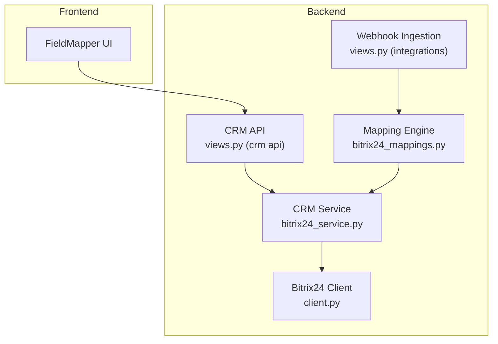
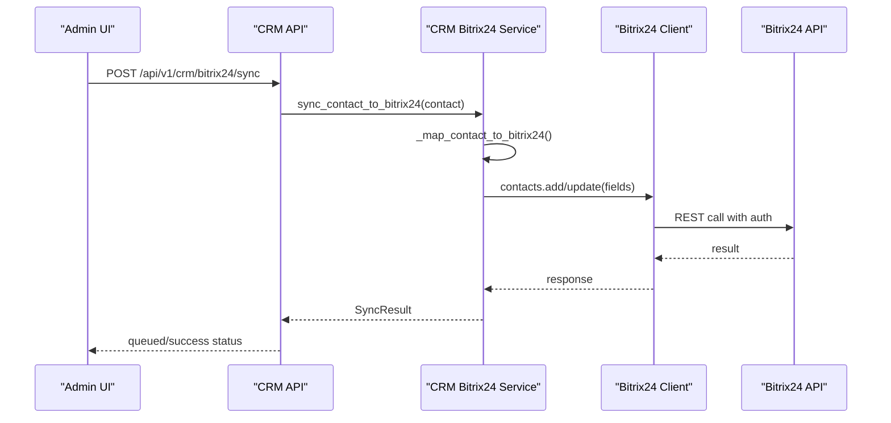
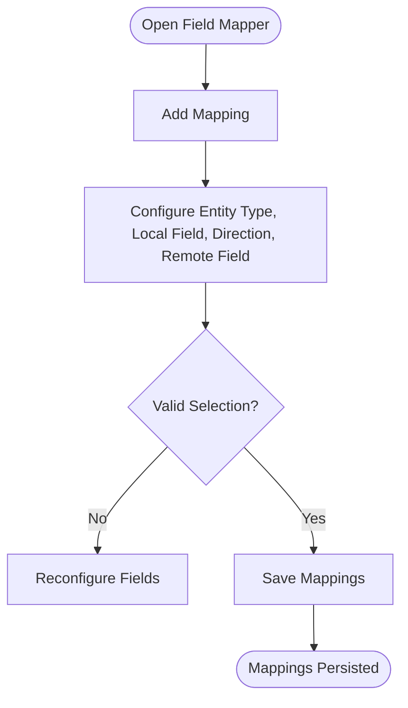
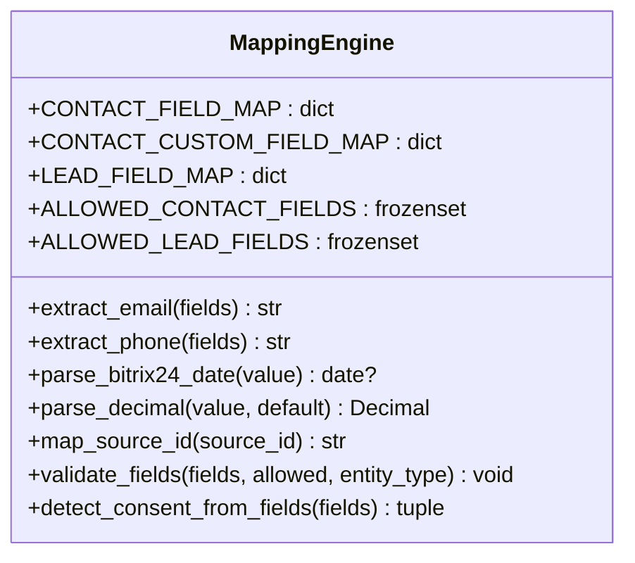
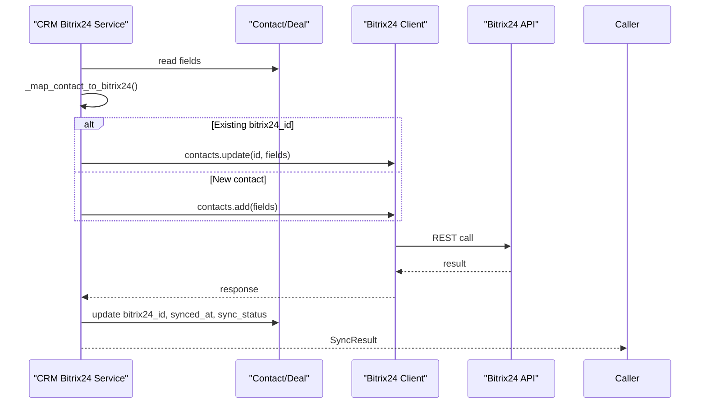
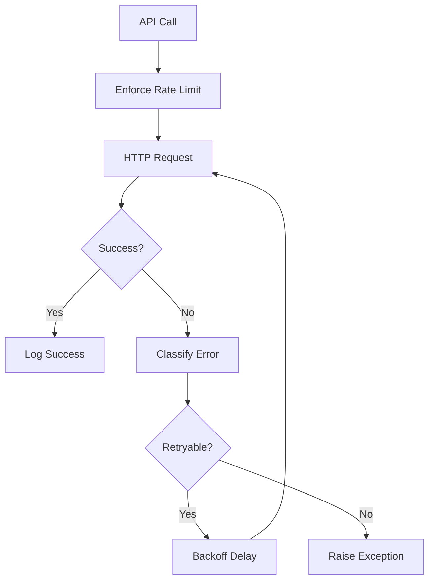
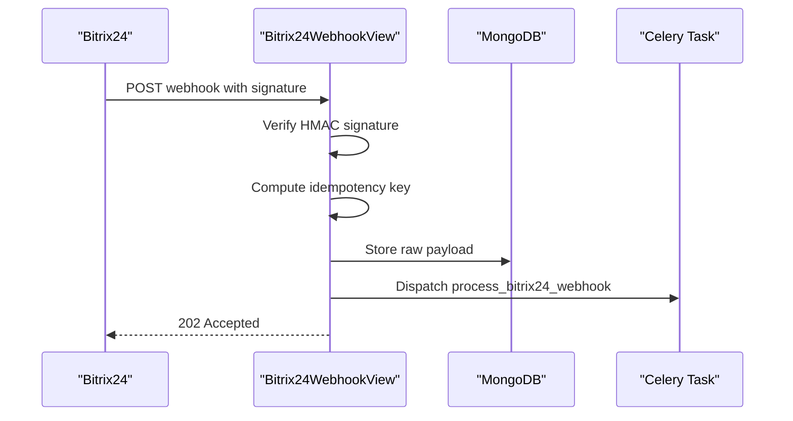
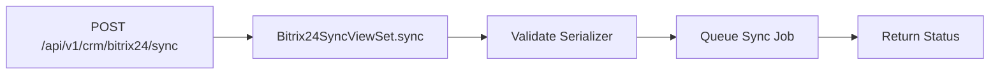
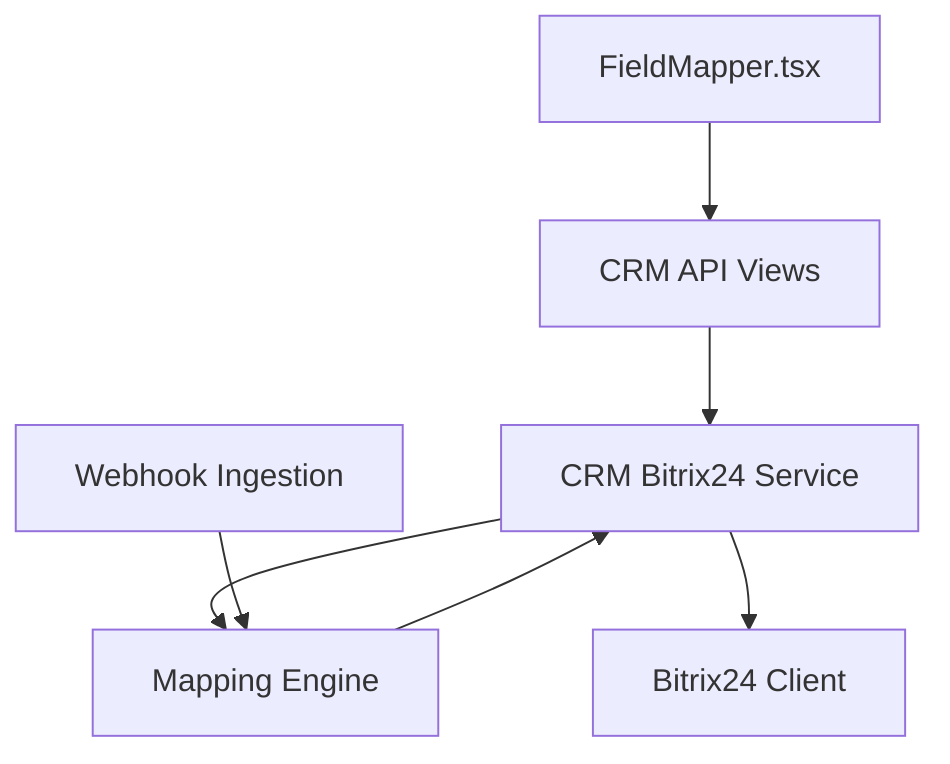

# Field Mapping Configuration

<cite>
**Referenced Files in This Document**
- [FieldMapper.tsx](file://frontend/apps/admin-dashboard/src/components/bitrix24/FieldMapper.tsx)
- [bitrix24_mappings.py](file://backend/django/apps/integrations/bitrix24_mappings.py)
- [bitrix24_service.py](file://backend/django/apps/crm/bitrix24_service.py)
- [client.py](file://backend/integrations/bitrix24/client.py)
- [views.py (integrations)](file://backend/django/apps/integrations/views.py)
- [models.py (integrations)](file://backend/django/apps/integrations/models.py)
- [urls.py (crm api)](file://backend/django/apps/crm/api/urls.py)
- [views.py (crm api)](file://backend/django/apps/crm/api/views.py)
- [serializers.py (crm api)](file://backend/django/apps/crm/api/serializers.py)
</cite>

## Table of Contents
1. Introduction
2. Project Structure
3. Core Components
4. Architecture Overview
5. Detailed Component Analysis
6. Dependency Analysis
7. Performance Considerations
8. Troubleshooting Guide
9. Conclusion

## Introduction
This document explains the field mapping configuration system that enables bi-directional data synchronization between platform entities and Bitrix24 CRM fields. It covers:
- The field mapping interface used to configure mappings
- Supported data types and transformation rules
- Validation constraints and allowed fields
- How to configure new mappings, handle optional fields, and manage dependencies
- Examples for complex objects and debugging mapping issues
- The backend mapping engine and API endpoints for programmatic configuration and sync operations

## Project Structure
The field mapping system spans frontend UI, backend mapping definitions, Bitrix24 integration services, webhook ingestion, and API endpoints:
- Frontend: Interactive field mapper UI for configuring entity-to-Bitrix24 field mappings
- Backend mapping engine: Centralized mappings and transformations for Contacts, Leads, and Deals
- Integration service: Abstraction layer for syncing CRM entities to Bitrix24 with conflict resolution and circuit breaker protection
- Webhook ingestion: Secure, idempotent handling of Bitrix24 webhooks for inbound updates
- API endpoints: Programmatic access to CRM resources and Bitrix24 sync operations

**Diagram sources**
- [FieldMapper.tsx:69-113](file://frontend/apps/admin-dashboard/src/components/bitrix24/FieldMapper.tsx#L69-L113)
- [bitrix24_mappings.py:25-131](file://backend/django/apps/integrations/bitrix24_mappings.py#L25-L131)
- [bitrix24_service.py:238-572](file://backend/django/apps/crm/bitrix24_service.py#L238-L572)
- [client.py:91-336](file://backend/integrations/bitrix24/client.py#L91-L336)
- [views.py (integrations):54-293](file://backend/django/apps/integrations/views.py#L54-L293)
- [views.py (crm api):735-769](file://backend/django/apps/crm/api/views.py#L735-L769)

**Section sources**
- [FieldMapper.tsx:69-113](file://frontend/apps/admin-dashboard/src/components/bitrix24/FieldMapper.tsx#L69-L113)
- [bitrix24_mappings.py:25-131](file://backend/django/apps/integrations/bitrix24_mappings.py#L25-L131)
- [bitrix24_service.py:238-572](file://backend/django/apps/crm/bitrix24_service.py#L238-L572)
- [client.py:91-336](file://backend/integrations/bitrix24/client.py#L91-L336)
- [views.py (integrations):54-293](file://backend/django/apps/integrations/views.py#L54-L293)
- [views.py (crm api):735-769](file://backend/django/apps/crm/api/views.py#L735-L769)

## Core Components
- Field Mapper UI: Allows administrators to define per-entity-type mappings between local fields and Bitrix24 fields, set sync direction (bidirectional, local-to-remote, remote-to-local), enable/disable mappings, and apply transforms.
- Mapping Engine: Centralized, explicit mappings from Bitrix24 fields to Django model attributes, whitelists of allowed fields, and helpers for type-safe transformations (dates, decimals, multi-value fields).
- CRM Service: Encapsulates sync logic for contacts and deals, including mapping to/from Bitrix24 formats, conflict resolution strategies, audit logging, and circuit breaker protection.
- Bitrix24 Client: Low-level HTTP client with rate limiting, retries, batch support, and error classification.
- Webhook Ingestion: Secure, idempotent receiver for Bitrix24 webhooks, storing raw payloads and dispatching background tasks.
- CRM API: Endpoints for managing CRM entities and triggering Bitrix24 sync operations.

**Section sources**
- [FieldMapper.tsx:39-113](file://frontend/apps/admin-dashboard/src/components/bitrix24/FieldMapper.tsx#L39-L113)
- [bitrix24_mappings.py:25-131](file://backend/django/apps/integrations/bitrix24_mappings.py#L25-L131)
- [bitrix24_service.py:238-572](file://backend/django/apps/crm/bitrix24_service.py#L238-L572)
- [client.py:91-336](file://backend/integrations/bitrix24/client.py#L91-L336)
- [views.py (integrations):54-293](file://backend/django/apps/integrations/views.py#L54-L293)
- [views.py (crm api):735-769](file://backend/django/apps/crm/api/views.py#L735-L769)

## Architecture Overview
The system supports both outbound (platform → Bitrix24) and inbound (Bitrix24 → platform) synchronization:
- Outbound: CRM service maps platform entities to Bitrix24 format using explicit field maps and custom UF_* mappings, then calls Bitrix24 via the client.
- Inbound: Bitrix24 webhooks are received, validated, stored, and processed asynchronously; mapping engine validates and transforms incoming fields into platform models.

**Diagram sources**
- [views.py (crm api):735-769](file://backend/django/apps/crm/api/views.py#L735-L769)
- [bitrix24_service.py:302-393](file://backend/django/apps/crm/bitrix24_service.py#L302-L393)
- [client.py:168-202](file://backend/integrations/bitrix24/client.py#L168-L202)

## Detailed Component Analysis

### Field Mapper Interface (Frontend)
- Purpose: Configure per-entity-type mappings between local fields and Bitrix24 fields.
- Capabilities:
  - Add/remove mappings
  - Select entity type, local field, remote field
  - Set sync direction: bidirectional, local-to-remote, remote-to-local
  - Enable/disable mappings
  - Apply transform functions (placeholder for future extensibility)
- Data Types: Local fields include string, email, phone, text, url; Remote fields include standard Bitrix24 fields and custom UF_* fields.

**Diagram sources**
- [FieldMapper.tsx:69-113](file://frontend/apps/admin-dashboard/src/components/bitrix24/FieldMapper.tsx#L69-L113)
- [FieldMapper.tsx:151-271](file://frontend/apps/admin-dashboard/src/components/bitrix24/FieldMapper.tsx#L151-L271)

**Section sources**
- [FieldMapper.tsx:39-113](file://frontend/apps/admin-dashboard/src/components/bitrix24/FieldMapper.tsx#L39-L113)
- [FieldMapper.tsx:151-271](file://frontend/apps/admin-dashboard/src/components/bitrix24/FieldMapper.tsx#L151-L271)

### Mapping Engine (Backend)
- Explicit Mappings:
  - Contact: Standard fields (name, last name, middle name, birthdate, address components) mapped to Django model attributes
  - Custom UF_* fields: e.g., envelope_number, parish_code, family_id
  - Lead: Title, names, status, source, opportunity, currency, comments
- Allowed Fields Whitelist: Enforces strict allowlist per entity type; unknown fields trigger validation errors to prevent data leakage from undocumented API changes.
- Transformation Helpers:
  - extract_email: Parses primary email from list-of-dicts structure
  - extract_phone: Parses primary phone from list-of-dicts structure
  - parse_bitrix24_date: Converts ISO date strings to Python date
  - parse_decimal: Safely converts numeric values to Decimal
  - map_source_id: Maps Bitrix24 source IDs to Django choices
- PII Masking: Masks emails and phones for audit logs to comply with GDPR.
- Consent Detection: Reads UF_CONSENT_GRANTED to determine consent status.

**Diagram sources**
- [bitrix24_mappings.py:25-131](file://backend/django/apps/integrations/bitrix24_mappings.py#L25-L131)
- [bitrix24_mappings.py:210-317](file://backend/django/apps/integrations/bitrix24_mappings.py#L210-L317)
- [bitrix24_mappings.py:323-368](file://backend/django/apps/integrations/bitrix24_mappings.py#L323-L368)

**Section sources**
- [bitrix24_mappings.py:25-131](file://backend/django/apps/integrations/bitrix24_mappings.py#L25-L131)
- [bitrix24_mappings.py:210-317](file://backend/django/apps/integrations/bitrix24_mappings.py#L210-L317)
- [bitrix24_mappings.py:323-368](file://backend/django/apps/integrations/bitrix24_mappings.py#L323-L368)

### CRM Service (Outbound Sync)
- Responsibilities:
  - Map platform entities to Bitrix24 format using explicit field maps and custom UF_* mappings
  - Create or update contacts/deals in Bitrix24
  - Update platform entity metadata (bitrix24_id, synced_at, sync_status)
  - Conflict resolution strategies: local_wins, remote_wins, latest_wins, manual
  - Circuit breaker protection to avoid cascading failures
  - Audit logging for compliance
- Data Types:
  - Emails and phones are formatted as lists of dicts with VALUE and TYPE
  - Dates converted to ISO strings where required
  - Deal stages and categories mapped to Bitrix24 identifiers

**Diagram sources**
- [bitrix24_service.py:302-393](file://backend/django/apps/crm/bitrix24_service.py#L302-L393)
- [bitrix24_service.py:470-519](file://backend/django/apps/crm/bitrix24_service.py#L470-L519)
- [client.py:168-202](file://backend/integrations/bitrix24/client.py#L168-L202)

**Section sources**
- [bitrix24_service.py:238-572](file://backend/django/apps/crm/bitrix24_service.py#L238-L572)

### Bitrix24 Client (Integration Layer)
- Features:
  - Rate limiting and retry with exponential backoff
  - Batch request support
  - Error classification: authentication, rate limit, API errors
  - Token refresh capability
  - Audit logging for API calls
- Usage: Used by CRM service to perform create/update operations on contacts and deals.

**Diagram sources**
- [client.py:168-336](file://backend/integrations/bitrix24/client.py#L168-L336)

**Section sources**
- [client.py:91-336](file://backend/integrations/bitrix24/client.py#L91-L336)

### Webhook Ingestion (Inbound Sync)
- Security: HMAC-SHA256 signature verification against configured secret
- Idempotency: Derives deterministic key from payload fields or SHA-256 of raw body
- Storage: Raw payload stored in MongoDB with tenant context and auto TTL expiry
- Processing: Dispatches Celery task for async processing; returns 202 Accepted quickly to respect Bitrix24 timeouts
- Country Routing: Extracts country code for GDPR Article 44 routing

**Diagram sources**
- [views.py (integrations):54-293](file://backend/django/apps/integrations/views.py#L54-L293)
- [models.py (integrations):12-47](file://backend/django/apps/integrations/models.py#L12-L47)

**Section sources**
- [views.py (integrations):54-293](file://backend/django/apps/integrations/views.py#L54-L293)
- [models.py (integrations):12-47](file://backend/django/apps/integrations/models.py#L12-L47)

### API Endpoints (Programmatic Access)
- CRM API:
  - Contacts, Deals, DSR, Audit endpoints with tenant isolation and throttling
  - Bitrix24 sync endpoint: POST /api/v1/crm/bitrix24/sync to queue sync operations
- URL Registration:
  - CRM router registers sync under bitrix24/ path

**Diagram sources**
- [urls.py (crm api):18-31](file://backend/django/apps/crm/api/urls.py#L18-L31)
- [views.py (crm api):735-769](file://backend/django/apps/crm/api/views.py#L735-L769)
- [serializers.py (crm api):344-353](file://backend/django/apps/crm/api/serializers.py#L344-L353)

**Section sources**
- [urls.py (crm api):18-31](file://backend/django/apps/crm/api/urls.py#L18-L31)
- [views.py (crm api):735-769](file://backend/django/apps/crm/api/views.py#L735-L769)
- [serializers.py (crm api):344-353](file://backend/django/apps/crm/api/serializers.py#L344-L353)

## Dependency Analysis
- Frontend FieldMapper depends on entity types and field definitions to render mapping controls
- Backend mapping engine defines explicit relationships between Bitrix24 fields and Django model attributes
- CRM service depends on mapping engine for inbound/outbound transformations and uses Bitrix24 client for network operations
- Webhook ingestion depends on secure signature verification and idempotency checks before queuing tasks
- API endpoints depend on serializers for validation and viewsets for business logic orchestration

**Diagram sources**
- [FieldMapper.tsx:69-113](file://frontend/apps/admin-dashboard/src/components/bitrix24/FieldMapper.tsx#L69-L113)
- [views.py (crm api):735-769](file://backend/django/apps/crm/api/views.py#L735-L769)
- [bitrix24_service.py:238-572](file://backend/django/apps/crm/bitrix24_service.py#L238-L572)
- [bitrix24_mappings.py:25-131](file://backend/django/apps/integrations/bitrix24_mappings.py#L25-L131)
- [client.py:91-336](file://backend/integrations/bitrix24/client.py#L91-L336)
- [views.py (integrations):54-293](file://backend/django/apps/integrations/views.py#L54-L293)

**Section sources**
- [FieldMapper.tsx:69-113](file://frontend/apps/admin-dashboard/src/components/bitrix24/FieldMapper.tsx#L69-L113)
- [bitrix24_service.py:238-572](file://backend/django/apps/crm/bitrix24_service.py#L238-L572)
- [bitrix24_mappings.py:25-131](file://backend/django/apps/integrations/bitrix24_mappings.py#L25-L131)
- [client.py:91-336](file://backend/integrations/bitrix24/client.py#L91-L336)
- [views.py (integrations):54-293](file://backend/django/apps/integrations/views.py#L54-L293)
- [views.py (crm api):735-769](file://backend/django/apps/crm/api/views.py#L735-L769)

## Performance Considerations
- Webhook ingestion returns 202 Accepted immediately to respect Bitrix24 timeouts and reduce retry pressure
- Bitrix24 client implements rate limiting and retry with exponential backoff to handle API constraints
- Circuit breaker in CRM service prevents cascading failures when Bitrix24 is unavailable
- Tenant-specific client caching reduces configuration overhead
- Audit logging is performed efficiently without blocking critical paths

[No sources needed since this section provides general guidance]

## Troubleshooting Guide
Common issues and resolutions:
- Unknown fields rejected: Ensure all Bitrix24 fields are in the allowed whitelist; add mappings explicitly to prevent data leakage
- Date parsing failures: Verify ISO format dates; use helper functions for robust parsing
- Email/phone extraction: Confirm multi-value field structures; use extraction helpers
- Signature verification failures: Check webhook secret configuration and header presence
- Idempotency conflicts: Review idempotency keys; ensure unique event processing
- Rate limiting: Implement backoff strategies and monitor retry counts

**Section sources**
- [bitrix24_mappings.py:323-368](file://backend/django/apps/integrations/bitrix24_mappings.py#L323-L368)
- [views.py (integrations):101-148](file://backend/django/apps/integrations/views.py#L101-L148)
- [client.py:246-321](file://backend/integrations/bitrix24/client.py#L246-L321)

## Conclusion
The field mapping configuration system provides a robust, secure, and scalable approach to bi-directional synchronization between platform entities and Bitrix24 CRM. Through explicit mappings, strict validation, and comprehensive transformation helpers, it ensures data integrity and compliance while offering flexible configuration through both UI and API interfaces. The architecture supports high-throughput webhook processing and reliable outbound synchronization with fail-safe mechanisms.

[No sources needed since this section summarizes without analyzing specific files]