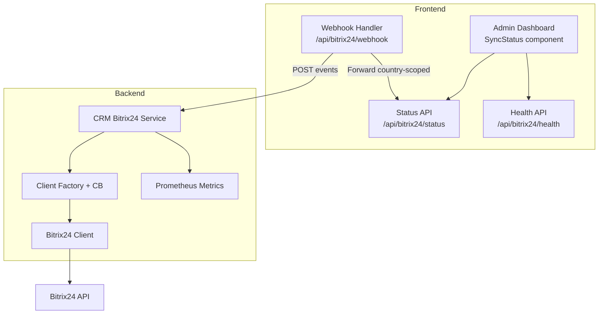
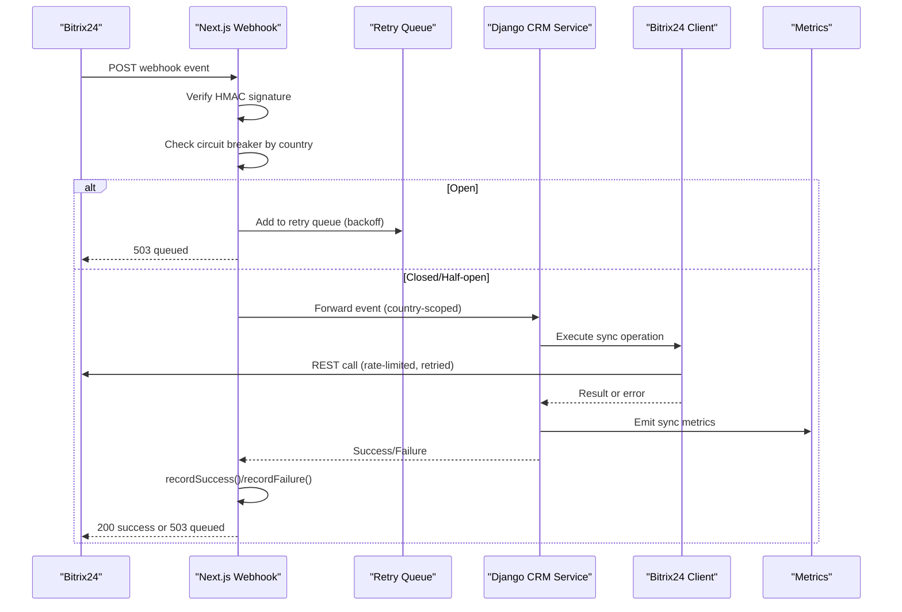
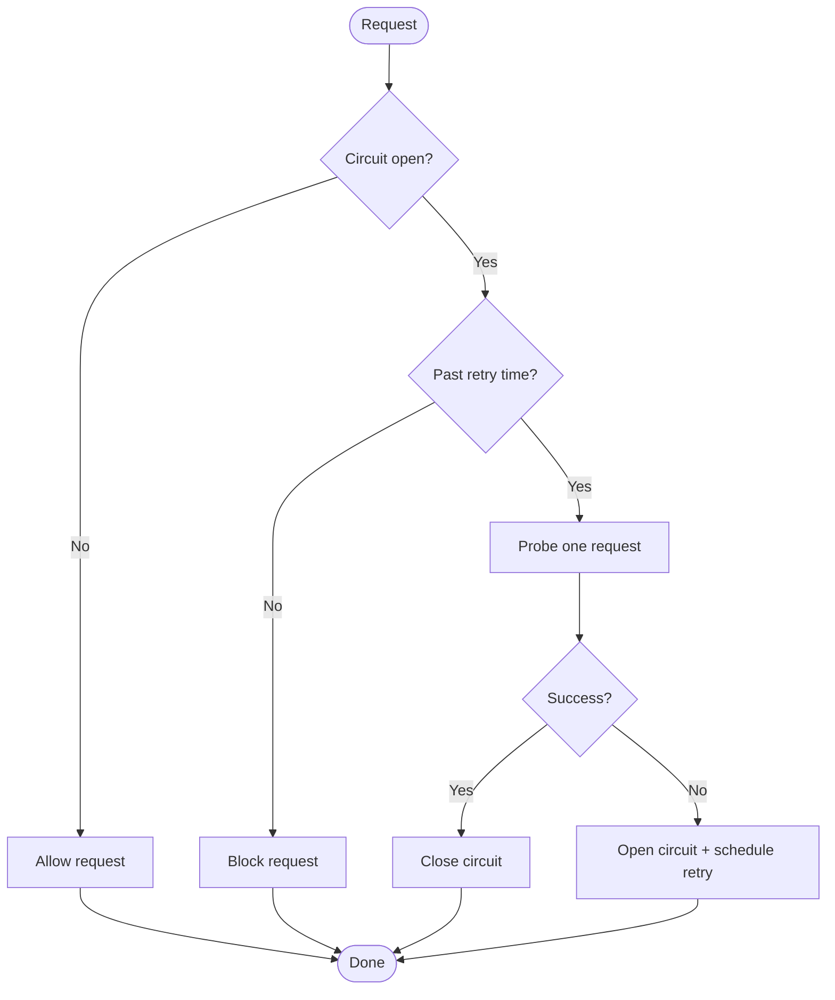
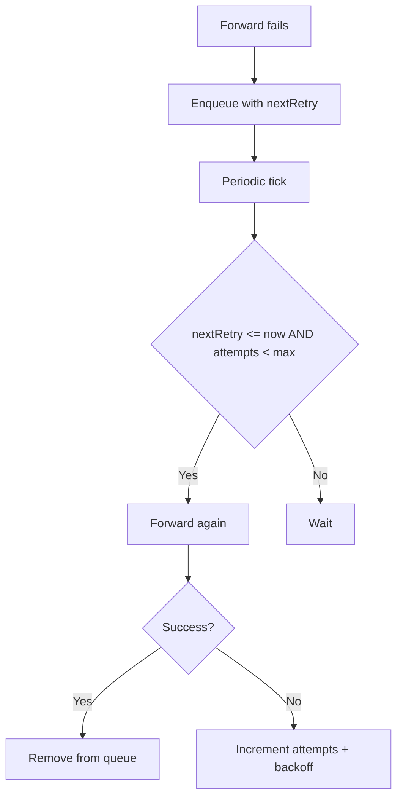
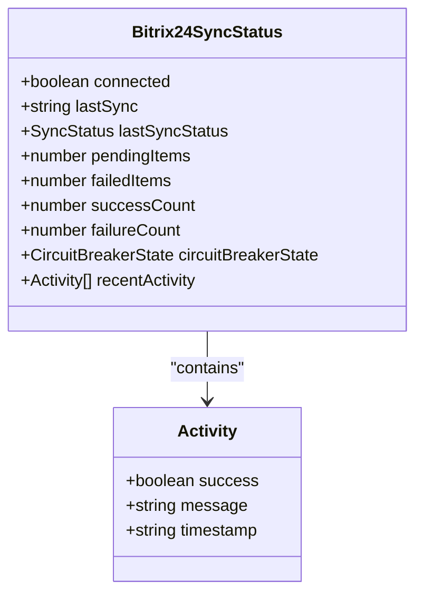
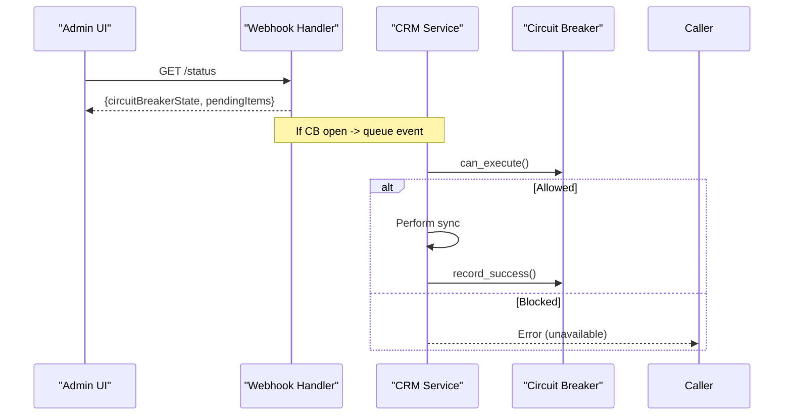
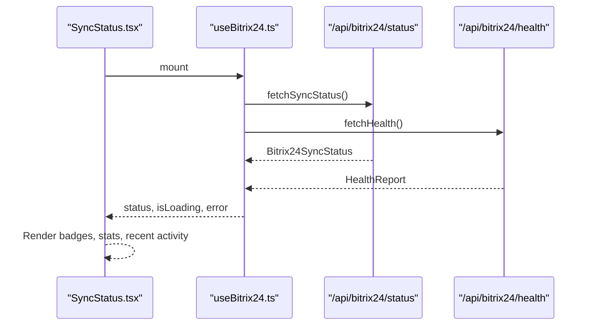
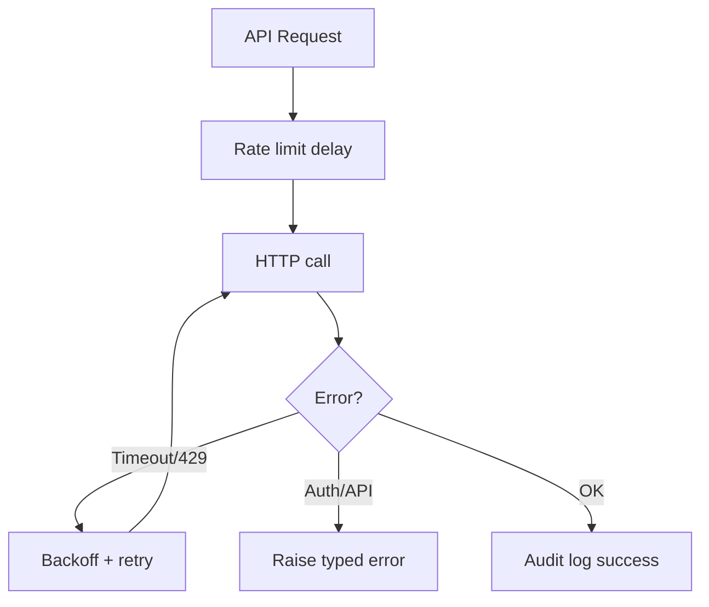
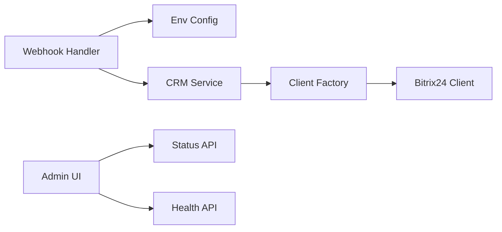

# Sync Status Monitoring

<cite>
**Referenced Files in This Document**
- [bitrix24_service.py](file://backend/django/apps/crm/bitrix24_service.py)
- [client.py](file://backend/integrations/bitrix24/client.py)
- [route.ts (webhook)](file://frontend/apps/admin-dashboard/src/app/api/bitrix24/webhook/route.ts)
- [route.ts (status)](file://frontend/apps/admin-dashboard/src/app/api/bitrix24/status/route.ts)
- [route.ts (health)](file://frontend/apps/admin-dashboard/src/app/api/bitrix24/health/route.ts)
- [SyncStatus.tsx](file://frontend/apps/admin-dashboard/src/components/bitrix24/SyncStatus.tsx)
- [useBitrix24.ts](file://frontend/apps/admin-dashboard/src/hooks/useBitrix24.ts)
- [bitrix24.ts](file://frontend/apps/admin-dashboard/src/types/bitrix24.ts)
- [metrics.py](file://backend/django/apps/crm/observability/metrics.py)
</cite>

## Table of Contents
1. [Introduction](#introduction)
2. [Project Structure](#project-structure)
3. [Core Components](#core-components)
4. [Architecture Overview](#architecture-overview)
5. [Detailed Component Analysis](#detailed-component-analysis)
6. [Dependency Analysis](#dependency-analysis)
7. [Performance Considerations](#performance-considerations)
8. [Troubleshooting Guide](#troubleshooting-guide)
9. [Conclusion](#conclusion)
10. [Appendices](#appendices)

## Introduction
This document explains the Bitrix24 sync status monitoring system, focusing on:
- Circuit breaker pattern for connection health and automatic failover
- Real-time sync state visualization in the admin dashboard
- Sync statistics tracking (success/failure counts, pending items queue, recent activity)
- Configuration examples for sync intervals, failure handling, and custom monitoring logic

The system spans a Next.js webhook handler with an in-memory retry queue and circuit breakers, a Django CRM service that wraps Bitrix24 API calls with tenant-scoped circuit breakers, and a React-based admin UI that polls status endpoints to render live metrics.

## Project Structure
Key areas involved in sync monitoring:
- Frontend webhook handler and APIs: route handlers for receiving webhooks, exposing status/health, and managing retries
- Backend CRM service: tenant-aware client factory, circuit breaker, and sync operations
- Bitrix24 client: HTTP client with rate limiting, retries, and audit logging
- Admin UI: components and hooks to poll status and visualize sync state

**Diagram sources**
- [route.ts (webhook):157-221](file://frontend/apps/admin-dashboard/src/app/api/bitrix24/webhook/route.ts#L157-L221)
- [route.ts (status):1-12](file://frontend/apps/admin-dashboard/src/app/api/bitrix24/status/route.ts#L1-L12)
- [route.ts (health):1-14](file://frontend/apps/admin-dashboard/src/app/api/bitrix24/health/route.ts#L1-L14)
- [bitrix24_service.py:109-165](file://backend/django/apps/crm/bitrix24_service.py#L109-L165)
- [client.py:91-166](file://backend/integrations/bitrix24/client.py#L91-L166)
- [metrics.py:94-113](file://backend/django/apps/crm/observability/metrics.py#L94-L113)

**Section sources**
- [route.ts (webhook):157-221](file://frontend/apps/admin-dashboard/src/app/api/bitrix24/webhook/route.ts#L157-L221)
- [bitrix24_service.py:109-165](file://backend/django/apps/crm/bitrix24_service.py#L109-L165)
- [client.py:91-166](file://backend/integrations/bitrix24/client.py#L91-L166)
- [metrics.py:94-113](file://backend/django/apps/crm/observability/metrics.py#L94-L113)

## Core Components
- Webhook handler with circuit breaker and retry queue
- Django CRM service with per-tenant circuit breaker and sync methods
- Bitrix24 client with rate limiting, retries, and audit logging
- Admin UI components and hooks for real-time status polling and visualization
- Observability metrics for sync operations and circuit breaker states

**Section sources**
- [route.ts (webhook):157-221](file://frontend/apps/admin-dashboard/src/app/api/bitrix24/webhook/route.ts#L157-L221)
- [bitrix24_service.py:71-106](file://backend/django/apps/crm/bitrix24_service.py#L71-L106)
- [client.py:246-321](file://backend/integrations/bitrix24/client.py#L246-L321)
- [SyncStatus.tsx:28-112](file://frontend/apps/admin-dashboard/src/components/bitrix24/SyncStatus.tsx#L28-L112)
- [useBitrix24.ts:17-42](file://frontend/apps/admin-dashboard/src/hooks/useBitrix24.ts#L17-L42)
- [metrics.py:94-113](file://backend/django/apps/crm/observability/metrics.py#L94-L113)

## Architecture Overview
End-to-end flow for incoming Bitrix24 webhooks and outgoing syncs:

**Diagram sources**
- [route.ts (webhook):381-494](file://frontend/apps/admin-dashboard/src/app/api/bitrix24/webhook/route.ts#L381-L494)
- [bitrix24_service.py:302-393](file://backend/django/apps/crm/bitrix24_service.py#L302-L393)
- [client.py:246-321](file://backend/integrations/bitrix24/client.py#L246-L321)
- [metrics.py:94-113](file://backend/django/apps/crm/observability/metrics.py#L94-L113)

## Detailed Component Analysis

### Circuit Breaker Pattern
Two complementary implementations exist:
- Frontend (Next.js): Per-country in-memory circuit breaker with closed/open/half-open states, thresholds, and reset timeouts. It gates webhook forwarding and integrates with the retry queue.
- Backend (Django): Per-tenant circuit breaker guarding sync operations, with configurable failure threshold and recovery timeout.

**Diagram sources**
- [route.ts (webhook):157-221](file://frontend/apps/admin-dashboard/src/app/api/bitrix24/webhook/route.ts#L157-L221)
- [bitrix24_service.py:71-106](file://backend/django/apps/crm/bitrix24_service.py#L71-L106)

**Section sources**
- [route.ts (webhook):157-221](file://frontend/apps/admin-dashboard/src/app/api/bitrix24/webhook/route.ts#L157-L221)
- [bitrix24_service.py:71-106](file://backend/django/apps/crm/bitrix24_service.py#L71-L106)

### Retry Queue and Exponential Backoff
- The webhook handler maintains an in-memory queue keyed by event type and entity ID.
- Failed forwards are requeued with exponential backoff plus jitter, up to a maximum attempt count.
- A periodic processor attempts to forward queued events; successful ones are removed and successes recorded.

**Diagram sources**
- [route.ts (webhook):227-299](file://frontend/apps/admin-dashboard/src/app/api/bitrix24/webhook/route.ts#L227-L299)

**Section sources**
- [route.ts (webhook):227-299](file://frontend/apps/admin-dashboard/src/app/api/bitrix24/webhook/route.ts#L227-L299)

### Sync Statistics Tracking
- The frontend displays successCount, failureCount, and pendingItems from the status endpoint.
- The backend exposes Prometheus metrics for sync operations and latency, including a gauge for circuit breaker state.
- Recent activity is surfaced via the status payload and rendered in the UI.

**Diagram sources**
- [bitrix24.ts:7-17](file://frontend/apps/admin-dashboard/src/types/bitrix24.ts#L7-L17)

**Section sources**
- [SyncStatus.tsx:114-151](file://frontend/apps/admin-dashboard/src/components/bitrix24/SyncStatus.tsx#L114-L151)
- [metrics.py:94-113](file://backend/django/apps/crm/observability/metrics.py#L94-L113)

### Automatic Failover Mechanisms
- Frontend: When the circuit breaker opens for a country, new webhooks are queued instead of forwarded, preventing overload and allowing recovery.
- Backend: Sync operations check the per-tenant circuit breaker before executing; failures increment counters and may open the circuit, while successes reset it.

**Diagram sources**
- [route.ts (webhook):412-428](file://frontend/apps/admin-dashboard/src/app/api/bitrix24/webhook/route.ts#L412-L428)
- [bitrix24_service.py:286-300](file://backend/django/apps/crm/bitrix24_service.py#L286-L300)

**Section sources**
- [route.ts (webhook):412-428](file://frontend/apps/admin-dashboard/src/app/api/bitrix24/webhook/route.ts#L412-L428)
- [bitrix24_service.py:286-300](file://backend/django/apps/crm/bitrix24_service.py#L286-L300)

### Real-Time Sync State Visualization
- The SyncStatus component shows connection state, circuit breaker badge, and key metrics (successes, failures, pending).
- It uses a hook that polls status and health endpoints at a fixed interval to keep the UI fresh.

**Diagram sources**
- [useBitrix24.ts:17-42](file://frontend/apps/admin-dashboard/src/hooks/useBitrix24.ts#L17-L42)
- [SyncStatus.tsx:28-112](file://frontend/apps/admin-dashboard/src/components/bitrix24/SyncStatus.tsx#L28-L112)

**Section sources**
- [useBitrix24.ts:17-42](file://frontend/apps/admin-dashboard/src/hooks/useBitrix24.ts#L17-L42)
- [SyncStatus.tsx:28-112](file://frontend/apps/admin-dashboard/src/components/bitrix24/SyncStatus.tsx#L28-L112)

### Bitrix24 Client and Rate Limiting
- The client enforces rate limits, retries on timeouts and rate-limit errors, and logs audit entries for API calls.
- Errors are categorized (auth, rate limit, API), enabling targeted handling upstream.

**Diagram sources**
- [client.py:246-321](file://backend/integrations/bitrix24/client.py#L246-L321)

**Section sources**
- [client.py:246-321](file://backend/integrations/bitrix24/client.py#L246-L321)

## Dependency Analysis
- The webhook handler depends on environment variables for secrets and routing, and forwards events to country-specific backends.
- The CRM service depends on the Bitrix24 client and Django cache for tenant configuration.
- The UI depends on status/health endpoints and renders based on the returned types.

**Diagram sources**
- [route.ts (webhook):69-91](file://frontend/apps/admin-dashboard/src/app/api/bitrix24/webhook/route.ts#L69-L91)
- [bitrix24_service.py:109-165](file://backend/django/apps/crm/bitrix24_service.py#L109-L165)
- [useBitrix24.ts:17-42](file://frontend/apps/admin-dashboard/src/hooks/useBitrix24.ts#L17-L42)

**Section sources**
- [route.ts (webhook):69-91](file://frontend/apps/admin-dashboard/src/app/api/bitrix24/webhook/route.ts#L69-L91)
- [bitrix24_service.py:109-165](file://backend/django/apps/crm/bitrix24_service.py#L109-L165)
- [useBitrix24.ts:17-42](file://frontend/apps/admin-dashboard/src/hooks/useBitrix24.ts#L17-L42)

## Performance Considerations
- Use persistent storage for circuit breaker state and retry queues in production (e.g., Redis) to survive restarts and scale horizontally.
- Tune circuit breaker thresholds and reset timeouts based on observed failure rates and SLAs.
- Configure Bitrix24 client rate limits and retries to match API quotas and avoid throttling.
- Batch or throttle webhook processing during spikes; consider moving heavy work off the request path.
- Monitor Prometheus metrics (sync operations, latency, circuit breaker state) to detect degradation early.

[No sources needed since this section provides general guidance]

## Troubleshooting Guide
Common issues and where to look:
- Webhook rejected due to invalid signature: verify HMAC secret and headers in the webhook handler.
- Events stuck in retry queue: inspect queue size and process manually via admin endpoints; ensure backend is reachable.
- Circuit breaker open: check failure counts and last failure timestamps; wait for retry window or investigate root cause.
- Sync failures in backend: review CRM service logs and Bitrix24 client errors (auth, rate limit, API errors).
- UI not updating: confirm status/health endpoints return valid data and polling interval is appropriate.

**Section sources**
- [route.ts (webhook):100-151](file://frontend/apps/admin-dashboard/src/app/api/bitrix24/webhook/route.ts#L100-L151)
- [route.ts (webhook):227-299](file://frontend/apps/admin-dashboard/src/app/api/bitrix24/webhook/route.ts#L227-L299)
- [bitrix24_service.py:302-393](file://backend/django/apps/crm/bitrix24_service.py#L302-L393)
- [client.py:246-321](file://backend/integrations/bitrix24/client.py#L246-L321)

## Conclusion
The system combines robust fault tolerance (circuit breakers and retry queues) with clear observability (metrics and UI) to maintain reliable Bitrix24 synchronization. By tuning thresholds, persisting state, and monitoring metrics, teams can ensure resilience and visibility across sync operations.

[No sources needed since this section summarizes without analyzing specific files]

## Appendices

### Configuration Examples
- Sync intervals: adjust the polling interval in the frontend hook to balance freshness and load.
- Circuit breaker thresholds: set failure thresholds and reset timeouts in both frontend and backend to match operational needs.
- Retry behavior: configure base delay, max delay, and max attempts in the webhook handler’s retry queue.
- Custom monitoring: instrument additional metrics around sync steps and integrate with alerting systems.

**Section sources**
- [useBitrix24.ts:17-18](file://frontend/apps/admin-dashboard/src/hooks/useBitrix24.ts#L17-L18)
- [route.ts (webhook):72-77](file://frontend/apps/admin-dashboard/src/app/api/bitrix24/webhook/route.ts#L72-L77)
- [bitrix24_service.py:71-80](file://backend/django/apps/crm/bitrix24_service.py#L71-L80)
- [metrics.py:94-113](file://backend/django/apps/crm/observability/metrics.py#L94-L113)