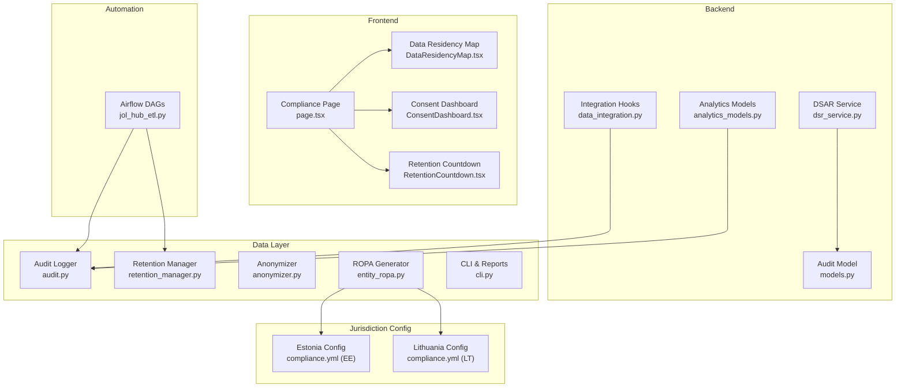
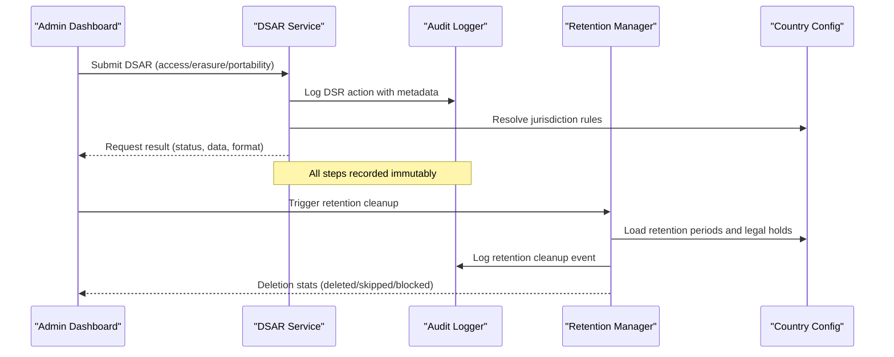
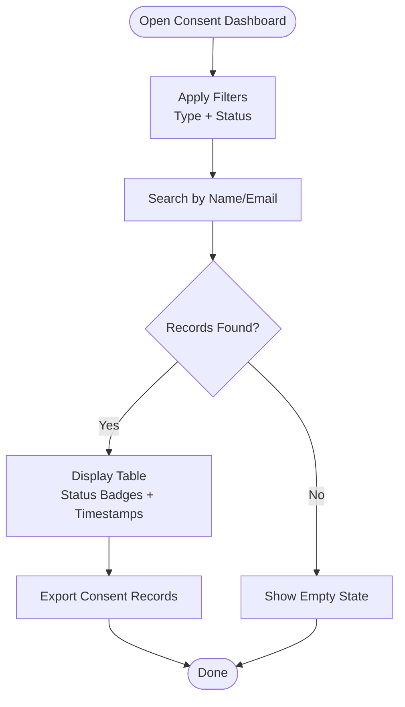
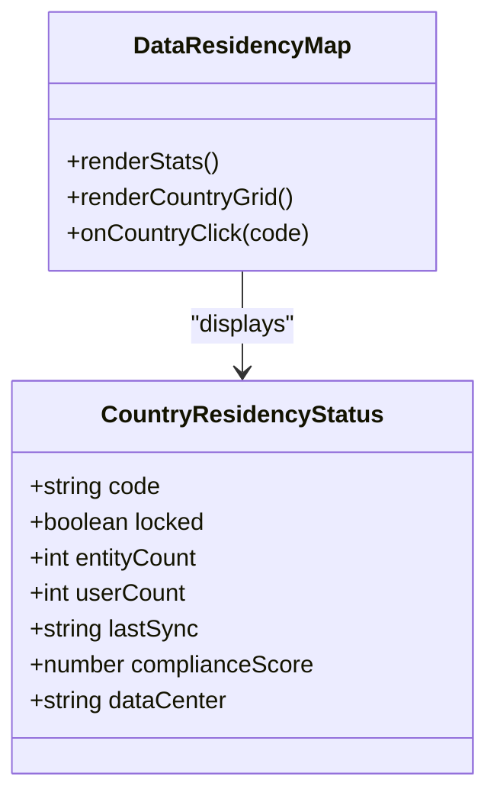
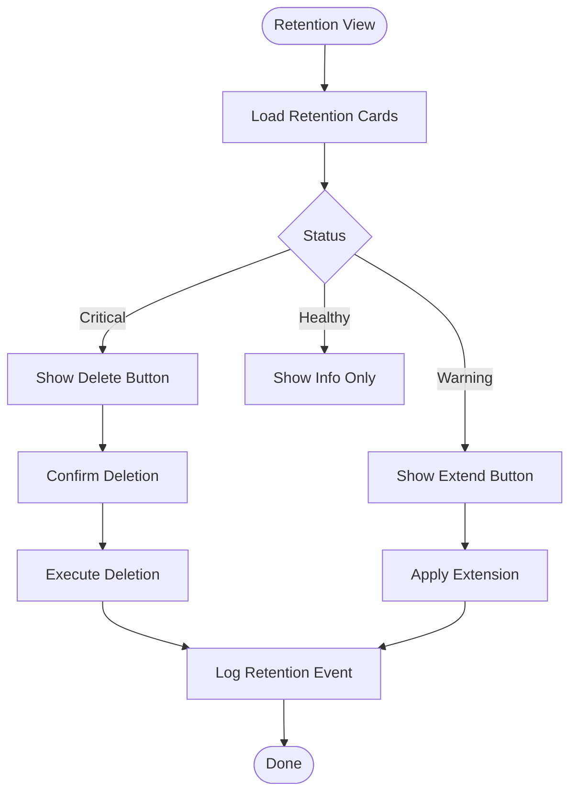
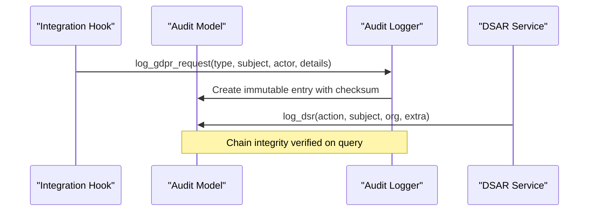
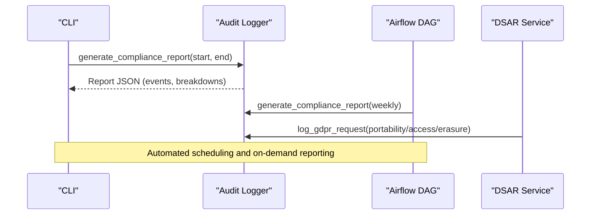
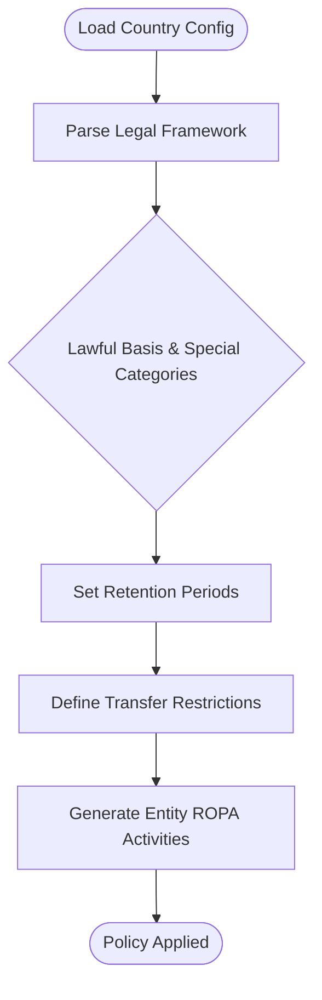
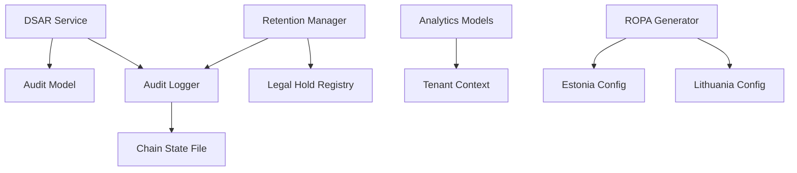

# Compliance & GDPR Tools

<cite>
**Referenced Files in This Document**
- [page.tsx](file://frontend/apps/admin-dashboard/src/app/(dashboard)/compliance/page.tsx)
- [DataResidencyMap.tsx](file://frontend/apps/admin-dashboard/src/components/compliance/DataResidencyMap.tsx)
- [ConsentDashboard.tsx](file://frontend/apps/admin-dashboard/src/components/compliance/ConsentDashboard.tsx)
- [RetentionCountdown.tsx](file://frontend/apps/admin-dashboard/src/components/compliance/RetentionCountdown.tsx)
- [models.py](file://backend/django/apps/core/models.py)
- [dsr_service.py](file://backend/django/apps/core/dsr_service.py)
- [data_integration.py](file://backend/django/apps/core/data_integration.py)
- [audit.py](file://data/src/audit.py)
- [retention_manager.py](file://data/src/gdpr/retention_manager.py)
- [anonymizer.py](file://data/src/gdpr/anonymizer.py)
- [entity_ropa.py](file://data/src/gdpr/entity_ropa.py)
- [cli.py](file://data/src/cli.py)
- [jol_hub_etl.py](file://data/airflow/dags/jol_hub_etl.py)
- [analytics_models.py](file://backend/django/apps/analytics/models.py)
- [compliance.yml (Estonia)](file://countries/ee/config/compliance.yml)
- [compliance.yml (Lithuania)](file://countries/lt/config/compliance.yml)
</cite>

## Table of Contents
1. Introduction
2. Project Structure
3. Core Components
4. Architecture Overview
5. Detailed Component Analysis
6. Dependency Analysis
7. Performance Considerations
8. Troubleshooting Guide
9. Conclusion
10. Appendices

## Introduction
This document explains the compliance and GDPR monitoring tools that help administrators maintain regulatory compliance across jurisdictions. It covers:
- Consent management dashboard for tracking user permissions
- Data residency mapping for geographic compliance
- Retention countdown timers for automatic data purging
- GDPR hooks that automate compliance workflows and audit logging
- Reporting capabilities for compliance audits and data subject request handling
- Examples of configuring jurisdiction-specific rules, generating compliance reports, and managing data retention policies

## Project Structure
The compliance system spans frontend dashboards, backend services, data processing pipelines, and jurisdictional configuration files:
- Frontend admin dashboard provides interactive tabs for overview, data residency, consent, retention, and audit logs
- Backend Django apps implement audit models, DSAR processing, and integration hooks
- Data layer includes anonymization, retention management, ROPA generation, and CLI/reporting utilities
- Airflow DAGs schedule cleanup and reporting tasks
- Country configs define legal frameworks, retention periods, and transfer restrictions

**Diagram sources**
- [page.tsx:1-268](file://frontend/apps/admin-dashboard/src/app/(dashboard)/compliance/page.tsx#L1-L268)
- [DataResidencyMap.tsx:1-227](file://frontend/apps/admin-dashboard/src/components/compliance/DataResidencyMap.tsx#L1-L227)
- [ConsentDashboard.tsx:1-308](file://frontend/apps/admin-dashboard/src/components/compliance/ConsentDashboard.tsx#L1-L308)
- [RetentionCountdown.tsx:1-171](file://frontend/apps/admin-dashboard/src/components/compliance/RetentionCountdown.tsx#L1-L171)
- [models.py:67-227](file://backend/django/apps/core/models.py#L67-L227)
- [dsr_service.py:115-341](file://backend/django/apps/core/dsr_service.py#L115-L341)
- [data_integration.py:224-266](file://backend/django/apps/core/data_integration.py#L224-L266)
- [audit.py:205-644](file://data/src/audit.py#L205-L644)
- [retention_manager.py:188-336](file://data/src/gdpr/retention_manager.py#L188-L336)
- [anonymizer.py:106-180](file://data/src/gdpr/anonymizer.py#L106-L180)
- [entity_ropa.py:39-800](file://data/src/gdpr/entity_ropa.py#L39-L800)
- [cli.py:49-90](file://data/src/cli.py#L49-L90)
- [jol_hub_etl.py:44-70](file://data/airflow/dags/jol_hub_etl.py#L44-L70)
- [analytics_models.py:12-174](file://backend/django/apps/analytics/models.py#L12-L174)
- [compliance.yml (Estonia):1-241](file://countries/ee/config/compliance.yml#L1-L241)
- [compliance.yml (Lithuania):1-201](file://countries/lt/config/compliance.yml#L1-L201)

**Section sources**
- [page.tsx:1-268](file://frontend/apps/admin-dashboard/src/app/(dashboard)/compliance/page.tsx#L1-L268)
- [DataResidencyMap.tsx:1-227](file://frontend/apps/admin-dashboard/src/components/compliance/DataResidencyMap.tsx#L1-L227)
- [ConsentDashboard.tsx:1-308](file://frontend/apps/admin-dashboard/src/components/compliance/ConsentDashboard.tsx#L1-L308)
- [RetentionCountdown.tsx:1-171](file://frontend/apps/admin-dashboard/src/components/compliance/RetentionCountdown.tsx#L1-L171)
- [models.py:67-227](file://backend/django/apps/core/models.py#L67-L227)
- [dsr_service.py:115-341](file://backend/django/apps/core/dsr_service.py#L115-L341)
- [data_integration.py:224-266](file://backend/django/apps/core/data_integration.py#L224-L266)
- [audit.py:205-644](file://data/src/audit.py#L205-L644)
- [retention_manager.py:188-336](file://data/src/gdpr/retention_manager.py#L188-L336)
- [anonymizer.py:106-180](file://data/src/gdpr/anonymizer.py#L106-L180)
- [entity_ropa.py:39-800](file://data/src/gdpr/entity_ropa.py#L39-L800)
- [cli.py:49-90](file://data/src/cli.py#L49-L90)
- [jol_hub_etl.py:44-70](file://data/airflow/dags/jol_hub_etl.py#L44-L70)
- [analytics_models.py:12-174](file://backend/django/apps/analytics/models.py#L12-L174)
- [compliance.yml (Estonia):1-241](file://countries/ee/config/compliance.yml#L1-L241)
- [compliance.yml (Lithuania):1-201](file://countries/lt/config/compliance.yml#L1-L201)

## Core Components
- Consent Management Dashboard: Tracks consent types, statuses, timestamps, and versions; supports filtering and export
- Data Residency Map: Visualizes EU data locks per country with entity/user counts and compliance scores
- Retention Countdown: Displays days remaining, record counts, status indicators, and actions to delete or extend retention
- Audit Logging: Immutable, hash-chained audit events with HMAC signatures and chain verification
- DSAR Processing: Handles access, rectification, erasure, restriction, portability, and objection requests with audit trails
- Jurisdictional Rules: Country-specific configurations for lawful basis, special categories, retention periods, and transfer restrictions
- Anonymization: K-anonymity thresholds by country and hashing of direct identifiers
- ROPA Generation: Entity-specific processing activities for GDPR Article 30 records

**Section sources**
- [ConsentDashboard.tsx:1-308](file://frontend/apps/admin-dashboard/src/components/compliance/ConsentDashboard.tsx#L1-L308)
- [DataResidencyMap.tsx:1-227](file://frontend/apps/admin-dashboard/src/components/compliance/DataResidencyMap.tsx#L1-L227)
- [RetentionCountdown.tsx:1-171](file://frontend/apps/admin-dashboard/src/components/compliance/RetentionCountdown.tsx#L1-L171)
- [audit.py:205-644](file://data/src/audit.py#L205-L644)
- [dsr_service.py:115-341](file://backend/django/apps/core/dsr_service.py#L115-L341)
- [compliance.yml (Estonia):1-241](file://countries/ee/config/compliance.yml#L1-L241)
- [compliance.yml (Lithuania):1-201](file://countries/lt/config/compliance.yml#L1-L201)
- [anonymizer.py:106-180](file://data/src/gdpr/anonymizer.py#L106-L180)
- [entity_ropa.py:39-800](file://data/src/gdpr/entity_ropa.py#L39-L800)

## Architecture Overview
The compliance architecture integrates UI dashboards with backend services and data pipelines to enforce GDPR principles:
- The compliance page aggregates stats and renders tabs for residency, consent, retention, and audit
- DSAR service orchestrates collection, formatting, and auditing of data subject requests
- Audit logger ensures tamper-evident logs with chain integrity and signature verification
- Retention manager enforces deletion rules while respecting legal holds
- Jurisdiction configs drive policy enforcement for lawful basis, transfers, and retention
- Airflow DAGs schedule periodic cleanup and report generation

**Diagram sources**
- [dsr_service.py:115-341](file://backend/django/apps/core/dsr_service.py#L115-L341)
- [audit.py:391-407](file://data/src/audit.py#L391-L407)
- [retention_manager.py:206-336](file://data/src/gdpr/retention_manager.py#L206-L336)
- [compliance.yml (Estonia):137-147](file://countries/ee/config/compliance.yml#L137-L147)
- [compliance.yml (Lithuania):137-146](file://countries/lt/config/compliance.yml#L137-L146)

## Detailed Component Analysis

### Consent Management Dashboard
- Tracks consent type (marketing, analytics, cookies, third party), status (granted, withdrawn, pending), timestamps, IP, country, and version
- Provides search and filters for quick lookup and export capability
- Aligns with GDPR Article 7 requirements for freely given, specific, informed, and unambiguous consent

**Diagram sources**
- [ConsentDashboard.tsx:91-308](file://frontend/apps/admin-dashboard/src/components/compliance/ConsentDashboard.tsx#L91-L308)

**Section sources**
- [ConsentDashboard.tsx:1-308](file://frontend/apps/admin-dashboard/src/components/compliance/ConsentDashboard.tsx#L1-L308)

### Data Residency Mapping
- Visualizes EU countries with lock/unlock status, entity/user counts, data center labels, and compliance scores
- Enforces GDPR Article 44 by ensuring data remains within EEA unless covered by adequacy decisions or safeguards
- Supports click interactions to drill into country details

**Diagram sources**
- [DataResidencyMap.tsx:22-53](file://frontend/apps/admin-dashboard/src/components/compliance/DataResidencyMap.tsx#L22-L53)
- [DataResidencyMap.tsx:141-203](file://frontend/apps/admin-dashboard/src/components/compliance/DataResidencyMap.tsx#L141-L203)

**Section sources**
- [DataResidencyMap.tsx:1-227](file://frontend/apps/admin-dashboard/src/components/compliance/DataResidencyMap.tsx#L1-L227)

### Retention Countdown Timers
- Shows days remaining, record counts, and status (healthy/warning/critical)
- Provides actions to delete now (when critical) or extend retention
- Integrates with retention policies and legal hold checks

**Diagram sources**
- [RetentionCountdown.tsx:51-163](file://frontend/apps/admin-dashboard/src/components/compliance/RetentionCountdown.tsx#L51-L163)
- [retention_manager.py:206-336](file://data/src/gdpr/retention_manager.py#L206-L336)

**Section sources**
- [RetentionCountdown.tsx:1-171](file://frontend/apps/admin-dashboard/src/components/compliance/RetentionCountdown.tsx#L1-L171)
- [retention_manager.py:188-336](file://data/src/gdpr/retention_manager.py#L188-L336)

### GDPR Hooks and Audit Logging
- Audit model defines immutable entries with checksums and tenant validation
- Audit logger implements hash chains, HMAC signatures, sequence numbers, and chain verification
- Integration hooks log GDPR requests consistently across systems
- Analytics models enforce consent flags and tenant isolation

**Diagram sources**
- [data_integration.py:224-266](file://backend/django/apps/core/data_integration.py#L224-L266)
- [models.py:67-227](file://backend/django/apps/core/models.py#L67-L227)
- [audit.py:391-407](file://data/src/audit.py#L391-L407)
- [dsr_service.py:115-127](file://backend/django/apps/core/dsr_service.py#L115-L127)

**Section sources**
- [data_integration.py:224-266](file://backend/django/apps/core/data_integration.py#L224-L266)
- [models.py:67-227](file://backend/django/apps/core/models.py#L67-L227)
- [audit.py:205-644](file://data/src/audit.py#L205-L644)
- [analytics_models.py:12-174](file://backend/django/apps/analytics/models.py#L12-L174)

### Reporting Capabilities and DSAR Handling
- CLI generates compliance reports over configurable date ranges
- Airflow DAGs schedule cleanup and report generation tasks
- DSAR service processes rights (access, rectification, erasure, restriction, portability, objection) with audit trails
- ROPA generator produces entity-specific processing activity records for GDPR Article 30

**Diagram sources**
- [cli.py:49-90](file://data/src/cli.py#L49-L90)
- [jol_hub_etl.py:44-70](file://data/airflow/dags/jol_hub_etl.py#L44-L70)
- [dsr_service.py:130-341](file://backend/django/apps/core/dsr_service.py#L130-L341)
- [audit.py:475-511](file://data/src/audit.py#L475-L511)

**Section sources**
- [cli.py:49-90](file://data/src/cli.py#L49-L90)
- [jol_hub_etl.py:44-70](file://data/airflow/dags/jol_hub_etl.py#L44-L70)
- [dsr_service.py:130-341](file://backend/django/apps/core/dsr_service.py#L130-L341)
- [entity_ropa.py:762-797](file://data/src/gdpr/entity_ropa.py#L762-L797)

### Jurisdiction-Specific Rules Configuration
- Estonia config defines lawful basis, special categories, retention periods, breach notification, and children’s data rules
- Lithuania config mirrors similar structure with local authority details and retention timelines
- ROPA generator references entity-specific activities aligned with Canon Law and GDPR articles

**Diagram sources**
- [compliance.yml (Estonia):20-147](file://countries/ee/config/compliance.yml#L20-L147)
- [compliance.yml (Lithuania):20-146](file://countries/lt/config/compliance.yml#L20-L146)
- [entity_ropa.py:39-800](file://data/src/gdpr/entity_ropa.py#L39-L800)

**Section sources**
- [compliance.yml (Estonia):1-241](file://countries/ee/config/compliance.yml#L1-L241)
- [compliance.yml (Lithuania):1-201](file://countries/lt/config/compliance.yml#L1-L201)
- [entity_ropa.py:39-800](file://data/src/gdpr/entity_ropa.py#L39-L800)

## Dependency Analysis
Key dependencies and relationships:
- DSAR service depends on audit model for immutable logging and organization context
- Retention manager relies on legal hold registry and audit logger for safe deletions
- Audit logger maintains chain state and secret keys for integrity verification
- Analytics models enforce tenant isolation and consent flags before aggregation
- Jurisdiction configs influence ROPA generation and retention policies

**Diagram sources**
- [dsr_service.py:115-341](file://backend/django/apps/core/dsr_service.py#L115-L341)
- [models.py:67-227](file://backend/django/apps/core/models.py#L67-L227)
- [audit.py:225-364](file://data/src/audit.py#L225-L364)
- [retention_manager.py:109-185](file://data/src/gdpr/retention_manager.py#L109-L185)
- [analytics_models.py:67-105](file://backend/django/apps/analytics/models.py#L67-L105)
- [entity_ropa.py:39-800](file://data/src/gdpr/entity_ropa.py#L39-L800)

**Section sources**
- [dsr_service.py:115-341](file://backend/django/apps/core/dsr_service.py#L115-L341)
- [models.py:67-227](file://backend/django/apps/core/models.py#L67-L227)
- [audit.py:225-364](file://data/src/audit.py#L225-L364)
- [retention_manager.py:109-185](file://data/src/gdpr/retention_manager.py#L109-L185)
- [analytics_models.py:67-105](file://backend/django/apps/analytics/models.py#L67-L105)
- [entity_ropa.py:39-800](file://data/src/gdpr/entity_ropa.py#L39-L800)

## Performance Considerations
- Audit logging uses append-only files with daily rotation to minimize overhead and ensure integrity
- Chain state persistence avoids recomputation and supports continuous integrity checks
- Retention cleanup is scheduled via Airflow to avoid peak-time impacts
- K-anonymity grouping operates on quasi-identifiers; consider dataset size and group-by fields for efficiency
- DSAR collection aggregates from multiple processors; batch operations and error isolation improve throughput

[No sources needed since this section provides general guidance]

## Troubleshooting Guide
Common issues and resolutions:
- Cross-tenant violations: Ensure organization_id matches current tenant context; analytics and audit models validate tenant context on save
- Audit chain breaks: Verify prev_hash continuity, sequence monotonicity, and HMAC signatures using chain verification
- Retention blocked by legal hold: Check active legal holds before deletion; lift holds when appropriate
- DSAR processing errors: Inspect processor exceptions and audit logs for category-level failures
- Consent not applied: Confirm consent_given flag and version are set correctly in analytics models

**Section sources**
- [analytics_models.py:67-105](file://backend/django/apps/analytics/models.py#L67-L105)
- [audit.py:513-589](file://data/src/audit.py#L513-L589)
- [retention_manager.py:257-336](file://data/src/gdpr/retention_manager.py#L257-L336)
- [dsr_service.py:130-341](file://backend/django/apps/core/dsr_service.py#L130-L341)
- [analytics_models.py:41-52](file://backend/django/apps/analytics/models.py#L41-L52)

## Conclusion
The compliance and GDPR tools provide a comprehensive framework for maintaining regulatory adherence across jurisdictions. The consent dashboard, data residency map, and retention countdown offer actionable visibility, while robust audit logging and DSAR processing ensure accountability and rights fulfillment. Jurisdiction-specific configurations enable tailored policy enforcement, and automated pipelines support scalable compliance operations.

[No sources needed since this section summarizes without analyzing specific files]

## Appendices

### Example: Configuring Jurisdiction-Specific Rules
- Set lawful basis and special categories per country configuration
- Define retention periods for sacramental, financial, and operational data
- Configure transfer restrictions and breach notification thresholds

**Section sources**
- [compliance.yml (Estonia):20-147](file://countries/ee/config/compliance.yml#L20-L147)
- [compliance.yml (Lithuania):20-146](file://countries/lt/config/compliance.yml#L20-L146)

### Example: Generating Compliance Reports
- Use CLI to generate reports for a specified number of days
- Schedule weekly reports via Airflow DAGs
- Query audit events and verify chain integrity for audits

**Section sources**
- [cli.py:49-90](file://data/src/cli.py#L49-L90)
- [jol_hub_etl.py:60-70](file://data/airflow/dags/jol_hub_etl.py#L60-L70)
- [audit.py:475-511](file://data/src/audit.py#L475-L511)

### Example: Managing Data Retention Policies
- Define retention rules for different data types
- Check legal holds before deletion
- Execute cleanup tasks and log outcomes

**Section sources**
- [retention_manager.py:78-106](file://data/src/gdpr/retention_manager.py#L78-L106)
- [retention_manager.py:206-336](file://data/src/gdpr/retention_manager.py#L206-L336)