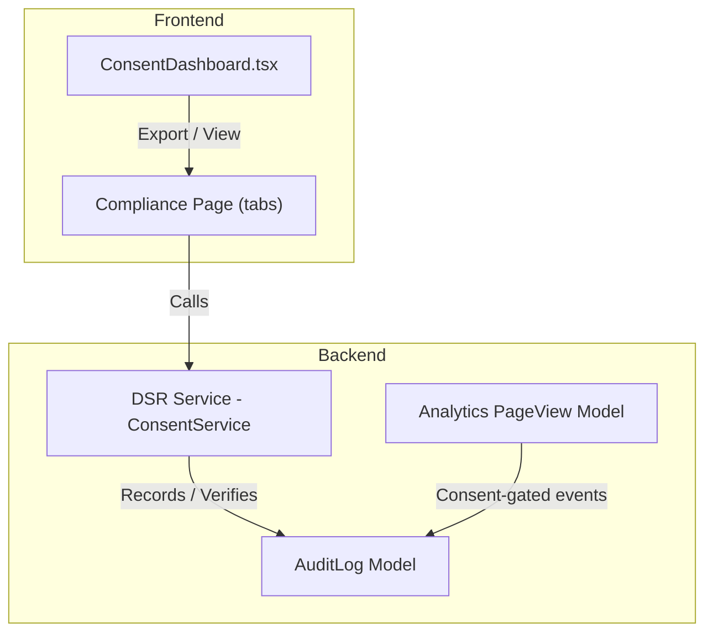
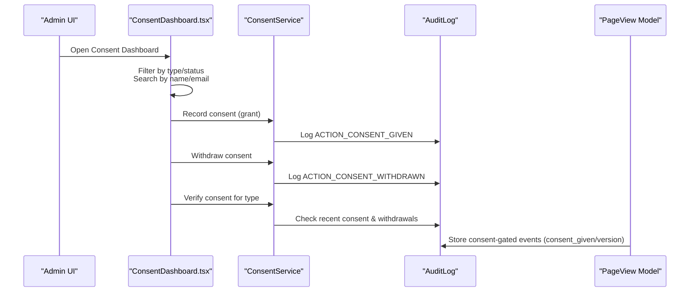
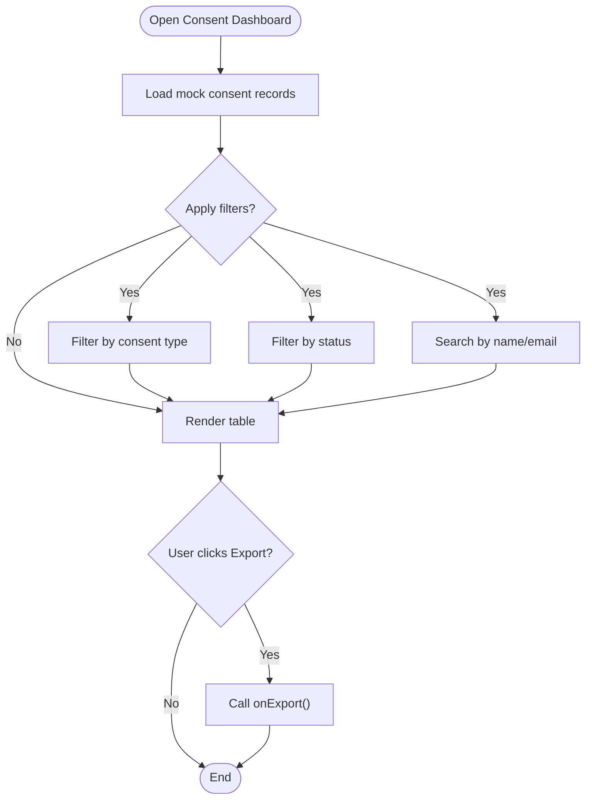
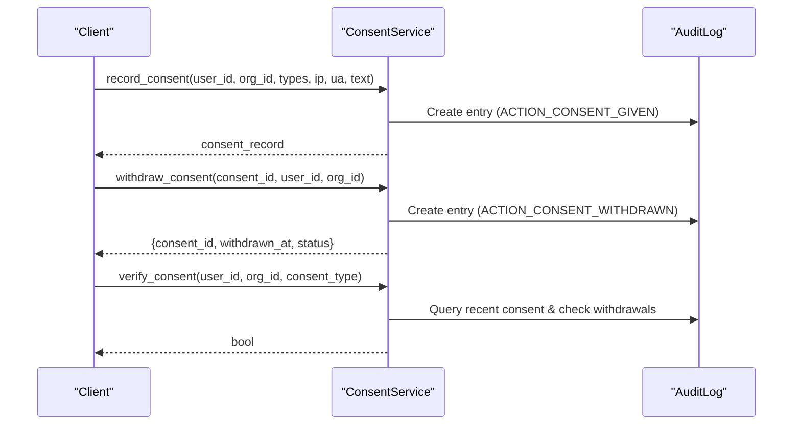
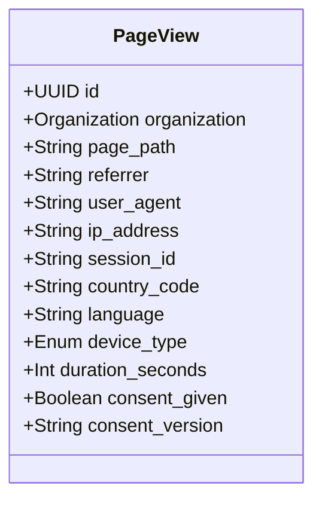
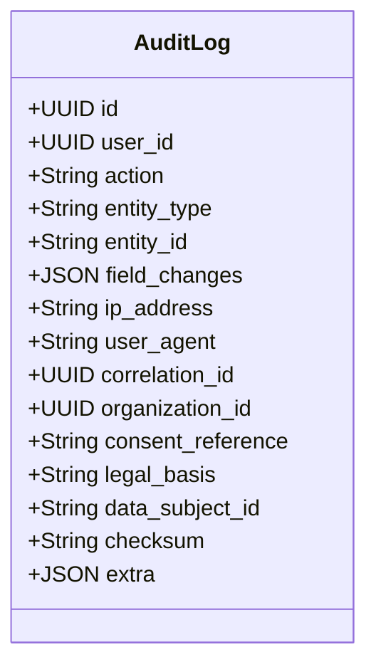
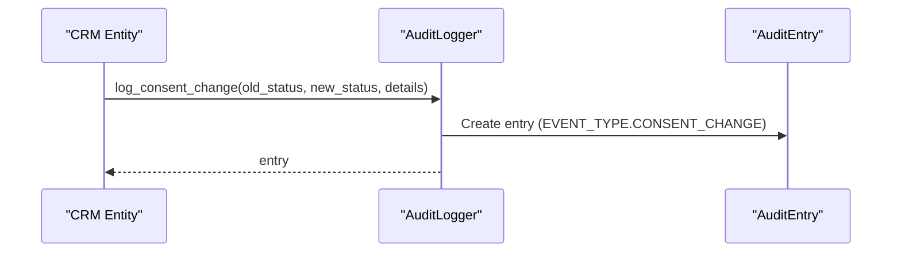
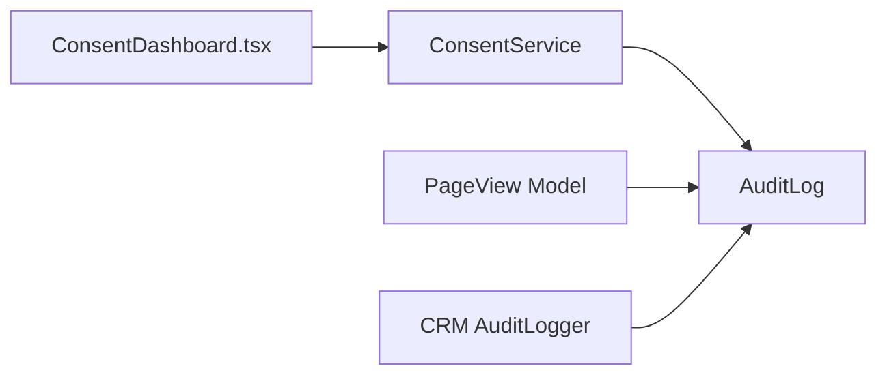

# Consent Management Dashboard

<cite>
**Referenced Files in This Document**
- [ConsentDashboard.tsx](file://frontend/apps/admin-dashboard/src/components/compliance/ConsentDashboard.tsx)
- [compliance page](file://frontend/apps/admin-dashboard/src/app/(dashboard)/compliance/page.tsx)
- [Analytics models](file://backend/django/apps/analytics/models.py)
- [DSR service (consent)](file://backend/django/apps/core/dsr_service.py)
- [Core audit log model](file://backend/django/apps/core/models.py)
- [CRM audit logger consent change](file://backend/django/apps/crm/audit_logger.py)
- [GDPR checklist](file://docs/compliance/GDPR-checklist.md)
</cite>

## Table of Contents
1. Introduction
2. Project Structure
3. Core Components
4. Architecture Overview
5. Detailed Component Analysis
6. Dependency Analysis
7. Performance Considerations
8. Troubleshooting Guide
9. Conclusion

## Introduction
This document describes the Consent Management Dashboard that supports GDPR Article 7 compliance for tracking and managing user consents across marketing, analytics, third-party, and cookies. It explains the user interface capabilities (filtering by consent type and status, search), the consent record structure, export features for compliance reporting, and the backend workflows for consent recording, withdrawal, verification, and audit trails.

## Project Structure
The consent management feature spans frontend UI components and backend services:
- Frontend: A React-based dashboard component renders a table of consent records with filtering, search, and export actions.
- Backend: Django services implement consent recording, withdrawal, verification, and immutable audit logging to support regulatory compliance.

**Diagram sources**
- [ConsentDashboard.tsx:91-307](file://frontend/apps/admin-dashboard/src/components/compliance/ConsentDashboard.tsx#L91-L307)
- [compliance page:190-227](file://frontend/apps/admin-dashboard/src/app/(dashboard)/compliance/page.tsx#L190-L227)
- [DSR service (consent):378-496](file://backend/django/apps/core/dsr_service.py#L378-L496)
- [Core audit log model:67-151](file://backend/django/apps/core/models.py#L67-L151)
- [Analytics models:12-62](file://backend/django/apps/analytics/models.py#L12-L62)

**Section sources**
- [ConsentDashboard.tsx:91-307](file://frontend/apps/admin-dashboard/src/components/compliance/ConsentDashboard.tsx#L91-L307)
- [compliance page:190-227](file://frontend/apps/admin-dashboard/src/app/(dashboard)/compliance/page.tsx#L190-L227)

## Core Components
- ConsentDashboard (frontend): Displays consent records, provides search by name/email, filters by consent type and status, shows summary stats, and triggers export.
- ConsentService (backend): Records consent, withdraws consent, verifies consent validity, and logs all actions to an immutable audit trail.
- AuditLog (backend): Immutable tamper-evident log capturing consent-related actions with metadata such as IP address, user agent, organization context, and consent reference.
- Analytics PageView (backend): Stores page-view events with explicit consent flags and versioning to ensure only consented data is aggregated.

Key responsibilities:
- User Interface: Search, filter, view, and export consent records.
- Data Integrity: Enforce tenant isolation and immutability via audit logs.
- Compliance: Track consent versions, timestamps, and withdrawal events; support verification checks before processing.

**Section sources**
- [ConsentDashboard.tsx:32-44](file://frontend/apps/admin-dashboard/src/components/compliance/ConsentDashboard.tsx#L32-L44)
- [DSR service (consent):378-496](file://backend/django/apps/core/dsr_service.py#L378-L496)
- [Core audit log model:67-151](file://backend/django/apps/core/models.py#L67-L151)
- [Analytics models:12-62](file://backend/django/apps/analytics/models.py#L12-L62)

## Architecture Overview
The dashboard integrates with backend services to manage consent lifecycle and maintain an auditable trail.

**Diagram sources**
- [ConsentDashboard.tsx:91-307](file://frontend/apps/admin-dashboard/src/components/compliance/ConsentDashboard.tsx#L91-L307)
- [DSR service (consent):391-496](file://backend/django/apps/core/dsr_service.py#L391-L496)
- [Core audit log model:67-151](file://backend/django/apps/core/models.py#L67-L151)
- [Analytics models:12-62](file://backend/django/apps/analytics/models.py#L12-L62)

## Detailed Component Analysis

### ConsentDashboard (Frontend)
- Purpose: Provide a GDPR Article 7-compliant interface to view, search, filter, and export consent records.
- Key fields displayed: userId, userName, userEmail, consentType, status, grantedAt, withdrawnAt, ipAddress, country, version.
- Filtering:
  - By consent type: marketing, analytics, cookies, third_party.
  - By status: granted, withdrawn, pending.
- Search: Name or email substring match.
- Export: Triggers onExport callback for compliance reporting.
- Stats: Total, granted, withdrawn, pending counts.

**Diagram sources**
- [ConsentDashboard.tsx:91-307](file://frontend/apps/admin-dashboard/src/components/compliance/ConsentDashboard.tsx#L91-L307)

**Section sources**
- [ConsentDashboard.tsx:32-44](file://frontend/apps/admin-dashboard/src/components/compliance/ConsentDashboard.tsx#L32-L44)
- [ConsentDashboard.tsx:91-307](file://frontend/apps/admin-dashboard/src/components/compliance/ConsentDashboard.tsx#L91-L307)

### ConsentService (Backend)
- Purpose: Implement GDPR Article 7 consent operations with full auditability.
- Functions:
  - Record consent: Creates a consent record and logs ACTION_CONSENT_GIVEN with metadata (IP, user agent, consent text shown, version).
  - Withdraw consent: Logs ACTION_CONSENT_WITHDRAWN with timestamp and returns withdrawal confirmation.
  - Verify consent: Checks for a recent non-withdrawn consent entry for a specific type and user/organization context.

**Diagram sources**
- [DSR service (consent):391-496](file://backend/django/apps/core/dsr_service.py#L391-L496)
- [Core audit log model:67-151](file://backend/django/apps/core/models.py#L67-L151)

**Section sources**
- [DSR service (consent):391-496](file://backend/django/apps/core/dsr_service.py#L391-L496)

### Analytics Consent-Gating
- Purpose: Ensure analytics events are only aggregated when users have given consent.
- Fields: consent_given (boolean), consent_version (string).
- Behavior: Only page views with consent_given=True are included in aggregated statistics.

**Diagram sources**
- [Analytics models:12-62](file://backend/django/apps/analytics/models.py#L12-L62)

**Section sources**
- [Analytics models:12-62](file://backend/django/apps/analytics/models.py#L12-L62)

### Audit Trail and Compliance Logging
- Purpose: Maintain an immutable, tamper-evident audit trail for all consent-related actions.
- Capabilities:
  - Action types include consent given and consent withdrawn.
  - Stores IP address, user agent, organization context, consent reference, legal basis, and extra metadata.
  - Generates checksums for integrity and enforces tenant isolation.

**Diagram sources**
- [Core audit log model:67-151](file://backend/django/apps/core/models.py#L67-L151)

**Section sources**
- [Core audit log model:67-151](file://backend/django/apps/core/models.py#L67-L151)

### CRM Consent Change Logging
- Purpose: Capture consent status changes within CRM entities and link them to audit entries with GDPR basis and consent version details.

**Diagram sources**
- [CRM audit logger consent change:504-546](file://backend/django/apps/crm/audit_logger.py#L504-L546)

**Section sources**
- [CRM audit logger consent change:504-546](file://backend/django/apps/crm/audit_logger.py#L504-L546)

## Dependency Analysis
- Frontend depends on UI primitives and state hooks to render filtered tables and trigger exports.
- Backend services depend on the core audit log model for immutable records and enforce tenant isolation.
- Analytics module depends on consent flags to gate aggregation.

**Diagram sources**
- [ConsentDashboard.tsx:91-307](file://frontend/apps/admin-dashboard/src/components/compliance/ConsentDashboard.tsx#L91-L307)
- [DSR service (consent):391-496](file://backend/django/apps/core/dsr_service.py#L391-L496)
- [Core audit log model:67-151](file://backend/django/apps/core/models.py#L67-L151)
- [Analytics models:12-62](file://backend/django/apps/analytics/models.py#L12-L62)
- [CRM audit logger consent change:504-546](file://backend/django/apps/crm/audit_logger.py#L504-L546)

**Section sources**
- [ConsentDashboard.tsx:91-307](file://frontend/apps/admin-dashboard/src/components/compliance/ConsentDashboard.tsx#L91-L307)
- [DSR service (consent):391-496](file://backend/django/apps/core/dsr_service.py#L391-L496)
- [Core audit log model:67-151](file://backend/django/apps/core/models.py#L67-L151)
- [Analytics models:12-62](file://backend/django/apps/analytics/models.py#L12-L62)
- [CRM audit logger consent change:504-546](file://backend/django/apps/crm/audit_logger.py#L504-L546)

## Performance Considerations
- Filtering and search are performed client-side on the current dataset; for large datasets, consider server-side pagination and filtering.
- Audit log writes are append-only and indexed for efficient querying by entity and time ranges.
- Consent verification queries should be optimized with indexes on user_id, organization_id, and created_at to minimize latency.

[No sources needed since this section provides general guidance]

## Troubleshooting Guide
- No consent records found:
  - Ensure filters and search terms are correct; clear filters to show all records.
- Consent not verified:
  - Confirm a recent consent was recorded and not subsequently withdrawn; check audit logs for ACTION_CONSENT_GIVEN and ACTION_CONSENT_WITHDRAWN.
- Analytics not aggregating:
  - Verify consent_given flag is True and consent_version is set for page views.
- Tenant isolation errors:
  - Ensure organization_id matches current tenant context when creating audit logs or analytics entries.

**Section sources**
- [DSR service (consent):467-496](file://backend/django/apps/core/dsr_service.py#L467-L496)
- [Analytics models:12-62](file://backend/django/apps/analytics/models.py#L12-L62)
- [Core audit log model:156-200](file://backend/django/apps/core/models.py#L156-L200)

## Conclusion
The Consent Management Dashboard provides a comprehensive, GDPR Article 7-compliant interface for managing user consents across multiple categories. It integrates with robust backend services to record, withdraw, and verify consent while maintaining an immutable audit trail. The system supports filtering, search, and export capabilities essential for compliance reporting and auditing.

[No sources needed since this section summarizes without analyzing specific files]