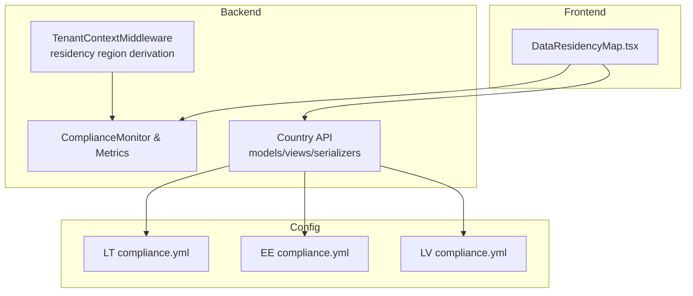
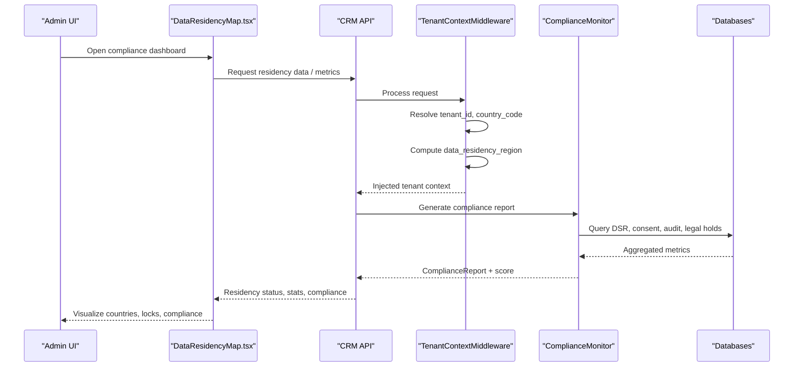
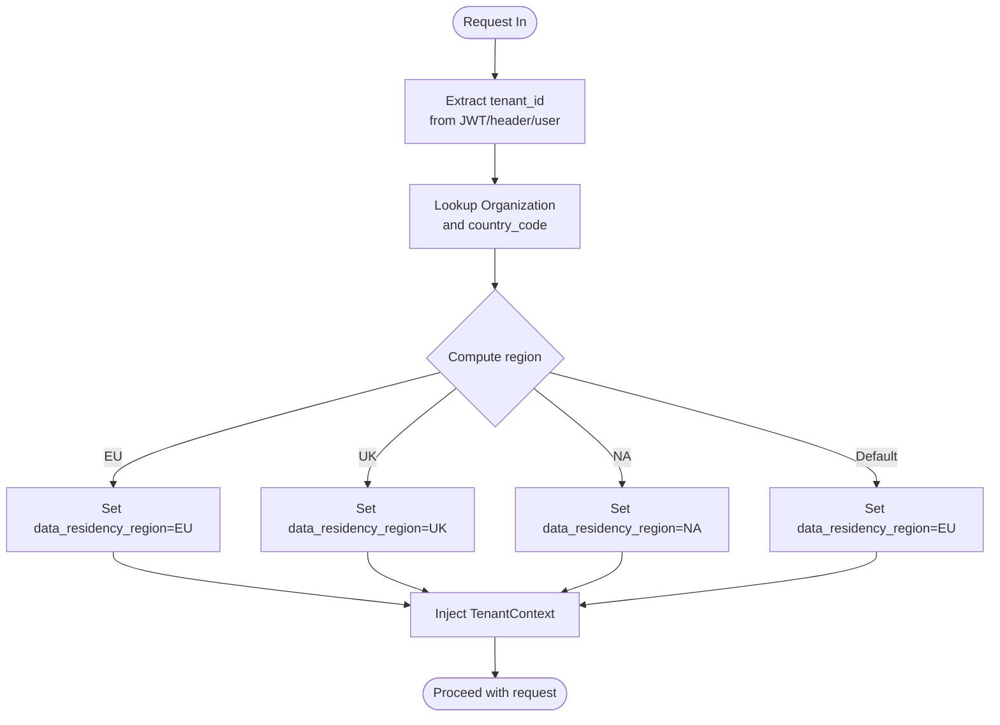
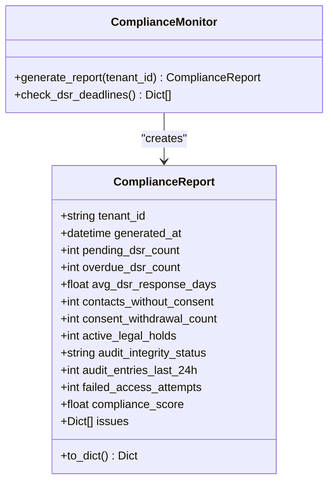
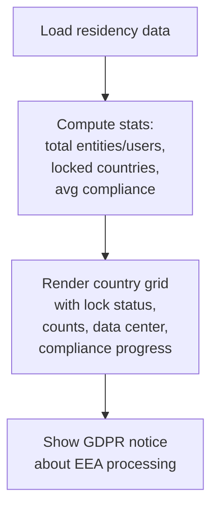
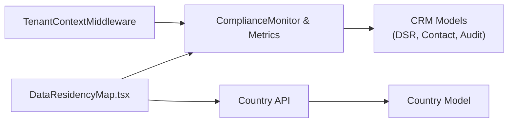

# Data Residency Mapping

<cite>
**Referenced Files in This Document**
- [middleware.py](file://backend/django/apps/crm/middleware.py)
- [metrics.py](file://backend/django/apps/crm/observability/metrics.py)
- [DataResidencyMap.tsx](file://frontend/apps/admin-dashboard/src/components/compliance/DataResidencyMap.tsx)
- [compliance.yml (Lithuania)](file://countries/lt/config/compliance.yml)
- [compliance.yml (Estonia)](file://countries/ee/config/compliance.yml)
- [compliance.yml (Latvia)](file://countries/lv/config/compliance.yml)
- [models.py](file://backend/django/apps/countries/models.py)
- [views.py](file://backend/django/apps/countries/views.py)
- [serializers.py](file://backend/django/apps/countries/serializers.py)
</cite>

## Table of Contents
1. Introduction
2. Project Structure
3. Core Components
4. Architecture Overview
5. Detailed Component Analysis
6. Dependency Analysis
7. Performance Considerations
8. Troubleshooting Guide
9. Conclusion
10. Appendices

## Introduction
This document explains the data residency mapping tool that visualizes geographic compliance across jurisdictions for multi-tenant environments. It covers how storage locations, regional restrictions, and compliance boundaries are displayed and enforced; how country-specific configurations integrate with tenant context; and how administrators can monitor data movement across borders. It also includes examples for configuring residency policies, monitoring data movement, and ensuring compliance with local data protection laws.

## Project Structure
The data residency mapping capability spans backend services, frontend visualization, and per-country compliance configuration:
- Backend enforces tenant isolation and derives a data residency region from tenant country metadata.
- Frontend renders a compliance dashboard showing locked/unlocked countries, entity/user counts, data centers, and compliance scores.
- Per-country YAML files define legal frameworks, transfer rules, retention periods, and consent requirements.
- Country model and API expose platform-level settings used by the system to align behavior with jurisdictional rules.

**Diagram sources**
- [DataResidencyMap.tsx:37-69](file://frontend/apps/admin-dashboard/src/components/compliance/DataResidencyMap.tsx#L37-L69)
- [middleware.py:96-197](file://backend/django/apps/crm/middleware.py#L96-L197)
- [metrics.py:125-179](file://backend/django/apps/crm/observability/metrics.py#L125-L179)
- [models.py:12-39](file://backend/django/apps/countries/models.py#L12-L39)
- [views.py:7-22](file://backend/django/apps/countries/views.py#L7-L22)
- [serializers.py:6-15](file://backend/django/apps/countries/serializers.py#L6-L15)

**Section sources**
- [middleware.py:96-197](file://backend/django/apps/crm/middleware.py#L96-L197)
- [DataResidencyMap.tsx:37-69](file://frontend/apps/admin-dashboard/src/components/compliance/DataResidencyMap.tsx#L37-L69)
- [compliance.yml (Lithuania):1-201](file://countries/lt/config/compliance.yml#L1-L201)
- [compliance.yml (Estonia):1-241](file://countries/ee/config/compliance.yml#L1-L241)
- [compliance.yml (Latvia):1-218](file://countries/lv/config/compliance.yml#L1-L218)
- [models.py:12-39](file://backend/django/apps/countries/models.py#L12-L39)
- [views.py:7-22](file://backend/django/apps/countries/views.py#L7-L22)
- [serializers.py:6-15](file://backend/django/apps/countries/serializers.py#L6-L15)

## Core Components
- Tenant Context Middleware: Extracts tenant identity, resolves country code, and computes data residency region (e.g., EU, UK, NA). It caches tenant info and injects context into requests for downstream enforcement and auditing.
- Compliance Monitoring and Metrics: Aggregates GDPR-related metrics (DSR status, consent, legal holds), audit integrity, security events, and produces a compliance score and issues list. Exposes Prometheus metrics for observability.
- Country Configuration Model and API: Stores platform-level country settings (consent age, VAT, supervisory authority, feature flags) and exposes read-only endpoints for clients.
- Admin Dashboard Visualization: Renders per-country residency status, entity/user counts, data center location, and compliance progress bars; summarizes totals and average compliance.

**Section sources**
- [middleware.py:37-71](file://backend/django/apps/crm/middleware.py#L37-L71)
- [middleware.py:96-197](file://backend/django/apps/crm/middleware.py#L96-L197)
- [middleware.py:267-283](file://backend/django/apps/crm/middleware.py#L267-L283)
- [metrics.py:125-179](file://backend/django/apps/crm/observability/metrics.py#L125-L179)
- [metrics.py:182-301](file://backend/django/apps/crm/observability/metrics.py#L182-L301)
- [models.py:12-39](file://backend/django/apps/countries/models.py#L12-L39)
- [views.py:7-22](file://backend/django/apps/countries/views.py#L7-L22)
- [serializers.py:6-15](file://backend/django/apps/countries/serializers.py#L6-L15)
- [DataResidencyMap.tsx:22-69](file://frontend/apps/admin-dashboard/src/components/compliance/DataResidencyMap.tsx#L22-L69)

## Architecture Overview
The system establishes a request-scoped tenant context, determines the data residency region based on the tenant’s country, and surfaces this information in the admin dashboard while enforcing cross-tenant isolation and compliance checks.

**Diagram sources**
- [middleware.py:122-197](file://backend/django/apps/crm/middleware.py#L122-L197)
- [metrics.py:196-301](file://backend/django/apps/crm/observability/metrics.py#L196-L301)
- [DataResidencyMap.tsx:37-69](file://frontend/apps/admin-dashboard/src/components/compliance/DataResidencyMap.tsx#L37-L69)

## Detailed Component Analysis

### Tenant Context and Residency Region Derivation
- The middleware extracts tenant ID from JWT or headers, validates against active organizations, and builds a thread-local TenantContext including country_code and data_residency_region.
- Region is derived from a country-code map (EU, UK, NA) with a default policy for JOL.
- Access logging helpers record operations with tenant context for audit trails.

**Diagram sources**
- [middleware.py:156-197](file://backend/django/apps/crm/middleware.py#L156-L197)
- [middleware.py:267-283](file://backend/django/apps/crm/middleware.py#L267-L283)

**Section sources**
- [middleware.py:96-197](file://backend/django/apps/crm/middleware.py#L96-L197)
- [middleware.py:267-283](file://backend/django/apps/crm/middleware.py#L267-L283)
- [middleware.py:380-405](file://backend/django/apps/crm/middleware.py#L380-L405)

### Compliance Monitoring and Reporting
- Generates a per-tenant compliance report aggregating GDPR DSR metrics, consent status, legal holds, audit integrity, and security events.
- Computes an overall compliance score and lists issues with severity and codes.
- Exposes Prometheus metrics for request volume, latency, data access, GDPR requests, security events, and audit entries.

**Diagram sources**
- [metrics.py:125-179](file://backend/django/apps/crm/observability/metrics.py#L125-L179)
- [metrics.py:182-301](file://backend/django/apps/crm/observability/metrics.py#L182-L301)

**Section sources**
- [metrics.py:125-179](file://backend/django/apps/crm/observability/metrics.py#L125-L179)
- [metrics.py:182-301](file://backend/django/apps/crm/observability/metrics.py#L182-L301)

### Country-Specific Compliance Configuration
- Each supported country has a compliance YAML defining:
  - Data Protection Authority details
  - Legal framework references
  - GDPR implementation specifics (lawful basis, special categories, erasure exceptions)
  - Data transfer rules (restricted and permitted destinations)
  - Consent requirements and text templates
  - Retention periods for various record types
  - Data subject rights handling
  - Breach notification procedures
  - Audit frequencies and standards

Examples:
- Lithuania: Defines restricted destinations (e.g., US, RU, BY, CN), permitted EU destinations, retention periods (e.g., funeral/cemetery records 75 years), canonical records exceptions, and DPA contact.
- Estonia/Latvia: Similar structure with local DPA, legal references, and nuanced church-specific notes where applicable.

These configs inform policy enforcement and reporting, and can be consumed by backend logic and dashboards to reflect jurisdictional constraints.

**Section sources**
- [compliance.yml (Lithuania):1-201](file://countries/lt/config/compliance.yml#L1-L201)
- [compliance.yml (Estonia):1-241](file://countries/ee/config/compliance.yml#L1-L241)
- [compliance.yml (Latvia):1-218](file://countries/lv/config/compliance.yml#L1-L218)

### Admin Dashboard Visualization
- Displays per-country residency status with lock icons indicating whether data is confined within allowed regions.
- Shows entity and user counts, last sync timestamp, data center identifier, and a compliance progress bar.
- Provides summary cards for total entities/users, locked countries count, average compliance percentage, and total countries.
- Includes a notice referencing GDPR Article 44 to communicate EEA processing/storage constraints.

**Diagram sources**
- [DataResidencyMap.tsx:37-69](file://frontend/apps/admin-dashboard/src/components/compliance/DataResidencyMap.tsx#L37-L69)
- [DataResidencyMap.tsx:132-203](file://frontend/apps/admin-dashboard/src/components/compliance/DataResidencyMap.tsx#L132-L203)
- [DataResidencyMap.tsx:206-223](file://frontend/apps/admin-dashboard/src/components/compliance/DataResidencyMap.tsx#L206-L223)

**Section sources**
- [DataResidencyMap.tsx:22-69](file://frontend/apps/admin-dashboard/src/components/compliance/DataResidencyMap.tsx#L22-L69)
- [DataResidencyMap.tsx:132-203](file://frontend/apps/admin-dashboard/src/components/compliance/DataResidencyMap.tsx#L132-L203)
- [DataResidencyMap.tsx:206-223](file://frontend/apps/admin-dashboard/src/components/compliance/DataResidencyMap.tsx#L206-L223)

### Conceptual Overview
Conceptually, the system maps tenants to jurisdictions, enforces residency boundaries at runtime, and visualizes compliance posture for administrators. Country-specific policies drive what is considered “locked” or “unlocked,” and compliance metrics feed into dashboards and alerts.

[No sources needed since this section doesn't analyze specific source files]

## Dependency Analysis
- Frontend depends on country metadata and compliance metrics to render accurate residency visuals.
- Backend middleware depends on organization data to resolve country_code and compute residency region.
- ComplianceMonitor depends on CRM models (DSRs, contacts, audit entries) to aggregate metrics.
- Country API provides read-only platform settings used across the system.

**Diagram sources**
- [DataResidencyMap.tsx:37-69](file://frontend/apps/admin-dashboard/src/components/compliance/DataResidencyMap.tsx#L37-L69)
- [middleware.py:96-197](file://backend/django/apps/crm/middleware.py#L96-L197)
- [metrics.py:196-301](file://backend/django/apps/crm/observability/metrics.py#L196-L301)
- [models.py:12-39](file://backend/django/apps/countries/models.py#L12-L39)
- [views.py:7-22](file://backend/django/apps/countries/views.py#L7-L22)

**Section sources**
- [middleware.py:96-197](file://backend/django/apps/crm/middleware.py#L96-L197)
- [metrics.py:196-301](file://backend/django/apps/crm/observability/metrics.py#L196-L301)
- [DataResidencyMap.tsx:37-69](file://frontend/apps/admin-dashboard/src/components/compliance/DataResidencyMap.tsx#L37-L69)
- [models.py:12-39](file://backend/django/apps/countries/models.py#L12-L39)
- [views.py:7-22](file://backend/django/apps/countries/views.py#L7-L22)

## Performance Considerations
- Tenant info caching reduces repeated lookups for residency region and compliance level.
- Compliance reports are cached briefly to avoid heavy aggregation on every request.
- Prometheus metrics enable performance and compliance trend analysis without impacting core flows.
- Frontend uses memoization to minimize re-renders when computing stats.

[No sources needed since this section provides general guidance]

## Troubleshooting Guide
Common issues and diagnostics:
- Missing tenant context: Ensure JWT or X-Tenant-ID header is present and valid; verify middleware injection and cleanup.
- Incorrect residency region: Validate organization country_code and region mapping logic; confirm cache freshness.
- Compliance score drops: Review overdue DSRs, audit integrity status, and consent gaps reported in the compliance report.
- Data access anomalies: Check audit logs and security event counters for failed access attempts and isolation violations.

**Section sources**
- [middleware.py:122-154](file://backend/django/apps/crm/middleware.py#L122-L154)
- [metrics.py:267-301](file://backend/django/apps/crm/observability/metrics.py#L267-L301)

## Conclusion
The data residency mapping tool integrates tenant context, country-specific compliance configurations, and robust monitoring to visualize and enforce data storage locations and jurisdictional boundaries. Administrators can rely on the dashboard to understand tenant data distribution, compliance status indicators, and enforcement of residency policies, while backend mechanisms ensure secure, compliant data handling across borders.

[No sources needed since this section summarizes without analyzing specific files]

## Appendices

### Examples: Configuring Residency Policies
- Define per-country transfer rules in compliance YAML (restricted/permitted destinations).
- Set retention periods aligned with local law and canonical requirements.
- Configure consent banners and data subject rights workflows per jurisdiction.

**Section sources**
- [compliance.yml (Lithuania):81-147](file://countries/lt/config/compliance.yml#L81-L147)
- [compliance.yml (Estonia):81-147](file://countries/ee/config/compliance.yml#L81-L147)
- [compliance.yml (Latvia):81-147](file://countries/lv/config/compliance.yml#L81-L147)

### Examples: Monitoring Data Movement
- Use compliance reports to track DSR deadlines, consent status, and audit integrity.
- Observe Prometheus metrics for GDPR requests, data access, and security events.
- Leverage admin dashboard summaries to identify regions with low compliance or high risk.

**Section sources**
- [metrics.py:196-301](file://backend/django/apps/crm/observability/metrics.py#L196-L301)
- [DataResidencyMap.tsx:55-69](file://frontend/apps/admin-dashboard/src/components/compliance/DataResidencyMap.tsx#L55-L69)

### Ensuring Compliance with Local Laws
- Align lawful basis and special category handling with national implementations.
- Honor canonical records exceptions where applicable and maintain immutable audit trails.
- Follow breach notification timelines and thresholds defined per country.

**Section sources**
- [compliance.yml (Lithuania):31-79](file://countries/lt/config/compliance.yml#L31-L79)
- [compliance.yml (Estonia):31-79](file://countries/ee/config/compliance.yml#L31-L79)
- [compliance.yml (Latvia):31-79](file://countries/lv/config/compliance.yml#L31-L79)