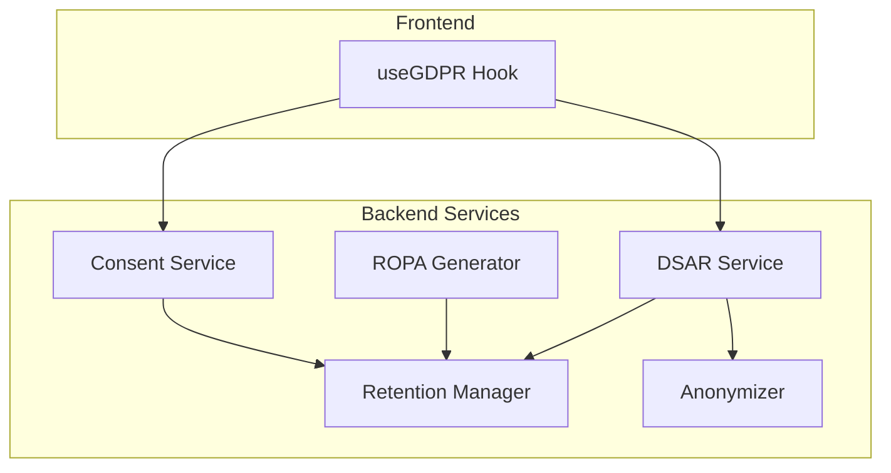
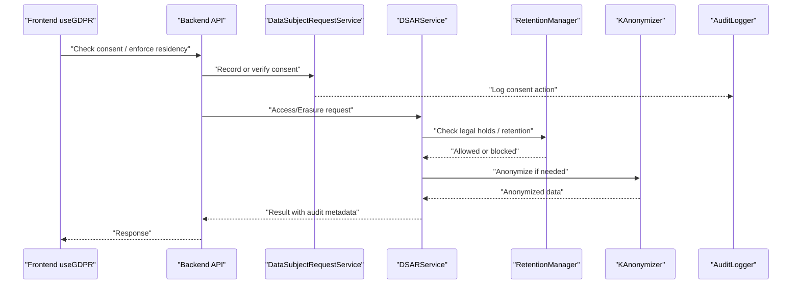
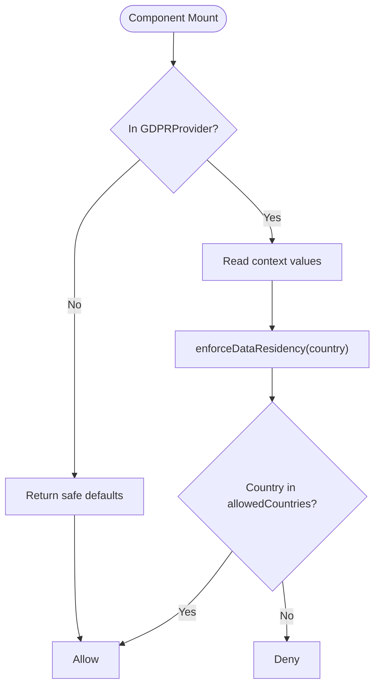
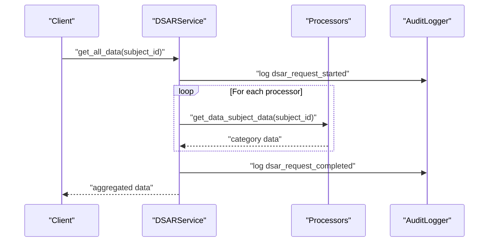
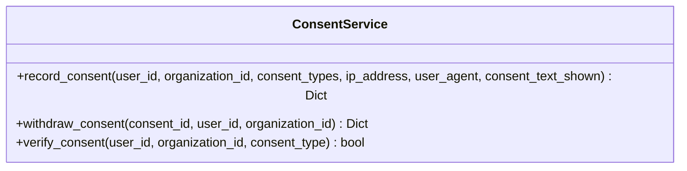
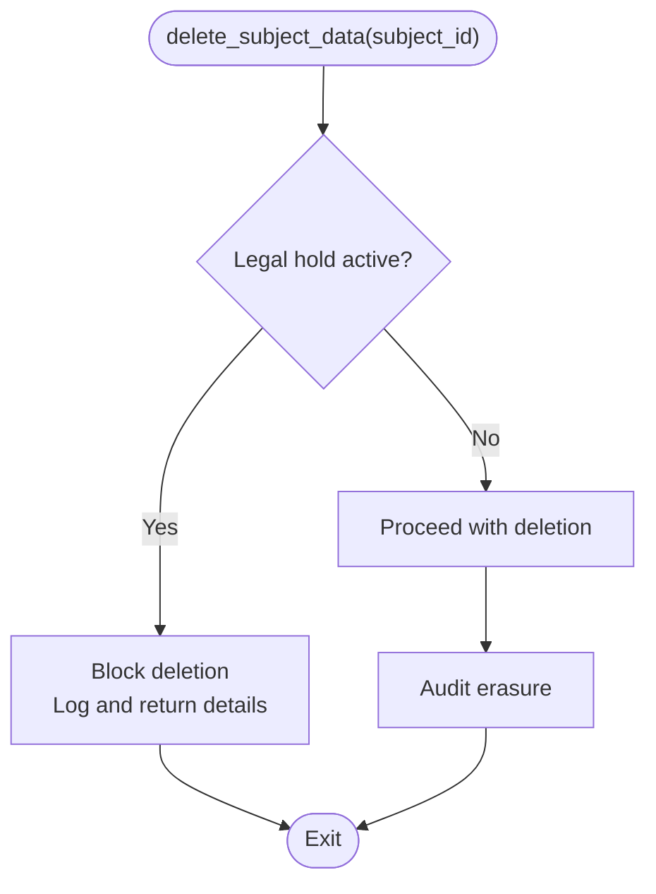
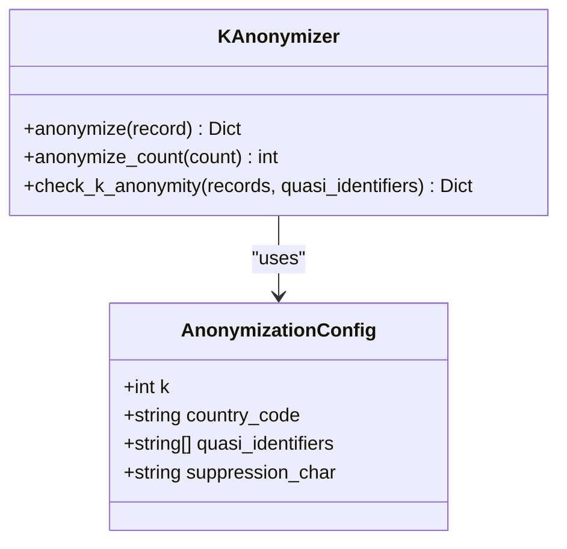
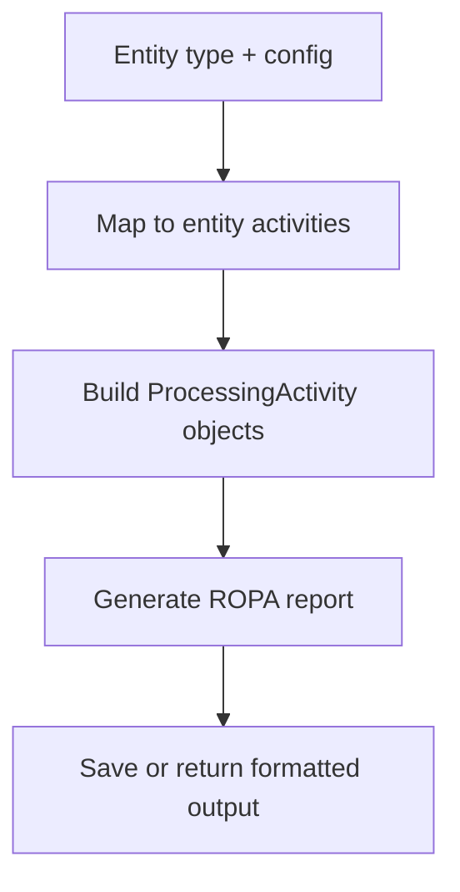
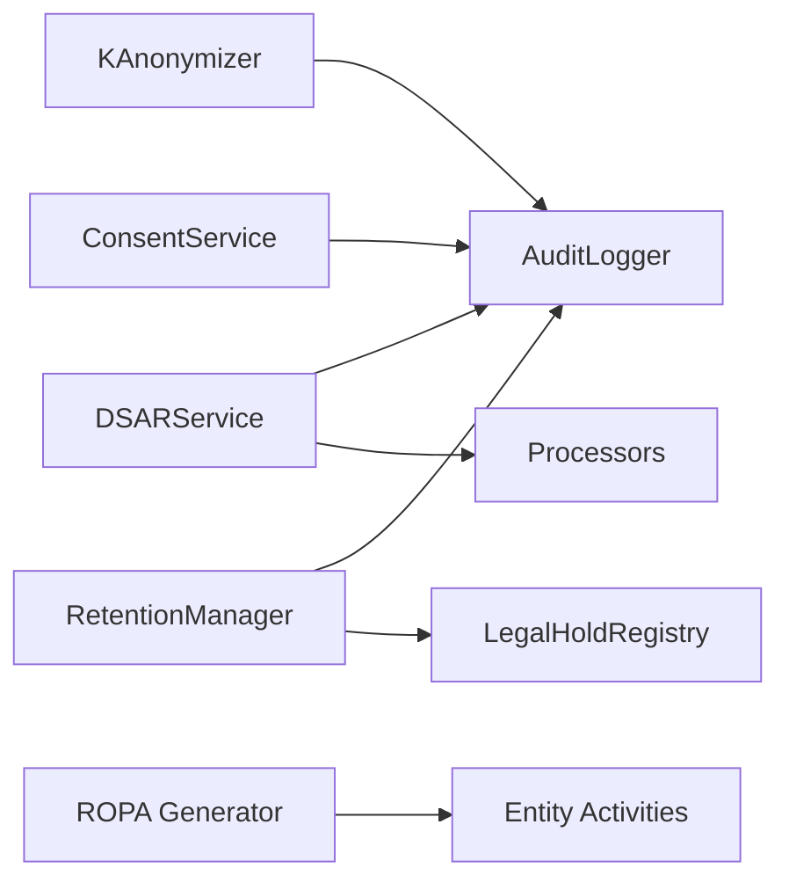

# GDPR Hooks & Automation

<cite>
**Referenced Files in This Document**
- [useGDPR.tsx](file://frontend/apps/admin-dashboard/src/hooks/useGDPR.tsx)
- [anonymizer.py](file://data/src/gdpr/anonymizer.py)
- [retention_manager.py](file://data/src/gdpr/retention_manager.py)
- [entity_ropa.py](file://data/src/gdpr/entity_ropa.py)
- [ropa_generator.py](file://data/src/gdpr/ropa_generator.py)
- [dsar_service.py](file://data/src/dsar_service.py)
- [dsr_service.py](file://backend/django/apps/core/dsr_service.py)
- [models.py](file://backend/django/apps/crm/models.py)
- [gdpr_consent_validation.py](file://data/src/quality/expectations/gdpr_consent_validation.py)
</cite>

## Table of Contents
1. [Introduction](#introduction)
2. [Project Structure](#project-structure)
3. [Core Components](#core-components)
4. [Architecture Overview](#architecture-overview)
5. [Detailed Component Analysis](#detailed-component-analysis)
6. [Dependency Analysis](#dependency-analysis)
7. [Performance Considerations](#performance-considerations)
8. [Troubleshooting Guide](#troubleshooting-guide)
9. [Conclusion](#conclusion)
10. [Appendices](#appendices)

## Introduction
This document explains the GDPR automation across the application, focusing on custom React hooks and backend services that enforce consent validation, process data subject requests (DSR), manage privacy preferences, and verify compliance. It covers:
- Consent management and verification
- Data anonymization and k-anonymity thresholds
- Retention rules and legal hold enforcement
- Records of Processing Activities (ROPA) generation
- DSAR orchestration for access, erasure, portability, restriction, and objection
- Audit trails and error handling strategies
- Testing approaches for GDPR-related functionality

## Project Structure
The GDPR automation spans frontend hooks and backend services:
- Frontend: a client-side hook to enforce data residency and expose consent-related UI state
- Backend: services for DSAR processing, consent recording/verification, retention management, anonymization, and ROPA generation

**Diagram sources**
- [useGDPR.tsx:1-59](file://frontend/apps/admin-dashboard/src/hooks/useGDPR.tsx#L1-L59)
- [dsar_service.py:59-157](file://data/src/dsar_service.py#L59-L157)
- [dsr_service.py:36-128](file://backend/django/apps/core/dsr_service.py#L36-L128)
- [retention_manager.py:188-336](file://data/src/gdpr/retention_manager.py#L188-L336)
- [anonymizer.py:106-180](file://data/src/gdpr/anonymizer.py#L106-L180)
- [ropa_generator.py:103-182](file://data/src/gdpr/ropa_generator.py#L103-L182)

**Section sources**
- [useGDPR.tsx:1-59](file://frontend/apps/admin-dashboard/src/hooks/useGDPR.tsx#L1-L59)
- [dsar_service.py:59-157](file://data/src/dsar_service.py#L59-L157)
- [dsr_service.py:36-128](file://backend/django/apps/core/dsr_service.py#L36-L128)
- [retention_manager.py:188-336](file://data/src/gdpr/retention_manager.py#L188-L336)
- [anonymizer.py:106-180](file://data/src/gdpr/anonymizer.py#L106-L180)
- [ropa_generator.py:103-182](file://data/src/gdpr/ropa_generator.py#L103-L182)

## Core Components
- useGDPR Hook: Provides data residency enforcement and country allow-listing at the UI layer.
- DSAR Service: Orchestrates access and erasure requests across processors with audit logging.
- Consent Service: Records, verifies, and withdraws consent with immutable audit entries.
- Retention Manager: Enforces storage limitation and right to erasure while respecting legal holds.
- Anonymizer: Applies k-anonymity thresholds per country and pseudonymizes direct identifiers.
- ROPA Generator: Produces Article 30 records of processing activities, including entity-specific mappings.

**Section sources**
- [useGDPR.tsx:10-58](file://frontend/apps/admin-dashboard/src/hooks/useGDPR.tsx#L10-L58)
- [dsar_service.py:59-157](file://data/src/dsar_service.py#L59-L157)
- [dsr_service.py:376-496](file://backend/django/apps/core/dsr_service.py#L376-L496)
- [retention_manager.py:188-336](file://data/src/gdpr/retention_manager.py#L188-L336)
- [anonymizer.py:86-180](file://data/src/gdpr/anonymizer.py#L86-L180)
- [entity_ropa.py:39-65](file://data/src/gdpr/entity_ropa.py#L39-L65)
- [ropa_generator.py:19-42](file://data/src/gdpr/ropa_generator.py#L19-L42)

## Architecture Overview
The system enforces GDPR through layered controls:
- Consent gating at the UI via the hook
- Backend consent recording and verification
- DSAR workflows with cross-processor coordination
- Retention and legal hold checks before deletion
- Anonymization for analytics and reporting
- ROPA generation for compliance documentation

**Diagram sources**
- [useGDPR.tsx:19-58](file://frontend/apps/admin-dashboard/src/hooks/useGDPR.tsx#L19-L58)
- [dsr_service.py:376-496](file://backend/django/apps/core/dsr_service.py#L376-L496)
- [dsar_service.py:88-157](file://data/src/dsar_service.py#L88-L157)
- [retention_manager.py:257-336](file://data/src/gdpr/retention_manager.py#L257-L336)
- [anonymizer.py:112-143](file://data/src/gdpr/anonymizer.py#L112-L143)

## Detailed Component Analysis

### useGDPR Hook (Frontend)
Purpose:
- Expose data residency enforcement and allowed countries list
- Provide a simple method to check whether a target country is permitted

Key behaviors:
- Default-enforced residency policy when provider is active
- Safe fallback values when used outside provider context

Integration points:
- Can gate features or routes based on enforceDataResidency(targetCountry)
- Combine with consent checks from backend services before sensitive operations

**Diagram sources**
- [useGDPR.tsx:19-58](file://frontend/apps/admin-dashboard/src/hooks/useGDPR.tsx#L19-L58)

**Section sources**
- [useGDPR.tsx:10-58](file://frontend/apps/admin-dashboard/src/hooks/useGDPR.tsx#L10-L58)

### DSAR Service (Access and Erasure Orchestration)
Responsibilities:
- Aggregate personal data across processors for Art. 15 access
- Coordinate erasure across processors for Art. 17, honoring exemptions
- Export data for Art. 20 portability
- Emit comprehensive audit events for each step

Methods:
- get_all_data(subject_id): Collects and returns user data
- delete_all_data(subject_id, dry_run, skip_categories): Deletes or simulates deletion
- export_to_json(subject_id, output_path): Writes portable JSON

**Diagram sources**
- [dsar_service.py:88-157](file://data/src/dsar_service.py#L88-L157)

**Section sources**
- [dsar_service.py:59-157](file://data/src/dsar_service.py#L59-L157)
- [dsar_service.py:159-267](file://data/src/dsar_service.py#L159-L267)

### Consent Service (Recording, Verification, Withdrawal)
Capabilities:
- Record consent with versioning, IP, user agent, and shown text
- Verify current validity by checking latest consent and any subsequent withdrawal
- Log withdrawals immutably

Usage patterns:
- Gate marketing/analytics features based on verify_consent(user_id, organization_id, consent_type)
- Persist consent artifacts for audits and inspections

**Diagram sources**
- [dsr_service.py:376-496](file://backend/django/apps/core/dsr_service.py#L376-L496)

**Section sources**
- [dsr_service.py:376-496](file://backend/django/apps/core/dsr_service.py#L376-L496)

### Retention Manager (Storage Limitation and Legal Holds)
Features:
- Enforce retention periods per data type
- Block deletions when legal holds are active
- Provide pre-checks for deletion allowance
- Audit all retention actions

Important flows:
- Before erasure: check legal holds; if present, block and log
- Batch cleanup: compute cutoff dates and report stats

**Diagram sources**
- [retention_manager.py:257-336](file://data/src/gdpr/retention_manager.py#L257-L336)

**Section sources**
- [retention_manager.py:188-336](file://data/src/gdpr/retention_manager.py#L188-L336)

### Anonymizer (k-Anonymity and Pseudonymization)
Highlights:
- Country-specific k thresholds with environment override support
- Hash-based pseudonymization for direct identifiers
- Grouping and violation detection for k-anonymity

Typical usage:
- Apply anonymization to analytics datasets
- Validate dataset compliance against k-thresholds

**Diagram sources**
- [anonymizer.py:86-180](file://data/src/gdpr/anonymizer.py#L86-L180)

**Section sources**
- [anonymizer.py:25-84](file://data/src/gdpr/anonymizer.py#L25-L84)
- [anonymizer.py:106-180](file://data/src/gdpr/anonymizer.py#L106-L180)

### ROPA Generator and Entity-Specific Activities
Functions:
- Generate Article 30 records of processing activities in JSON or Markdown
- Map entity types to specific processing activities with legal bases, retention, and security measures

Outputs:
- Controller metadata, activity lists, summaries, and compliance frameworks

**Diagram sources**
- [entity_ropa.py:39-65](file://data/src/gdpr/entity_ropa.py#L39-L65)
- [ropa_generator.py:103-182](file://data/src/gdpr/ropa_generator.py#L103-L182)

**Section sources**
- [entity_ropa.py:39-65](file://data/src/gdpr/entity_ropa.py#L39-L65)
- [ropa_generator.py:19-42](file://data/src/gdpr/ropa_generator.py#L19-L42)
- [ropa_generator.py:103-182](file://data/src/gdpr/ropa_generator.py#L103-L182)

### Data Subject Request Model and Tracking
Tracks all GDPR rights:
- Access, Rectification, Erasure, Restriction, Portability, Objection
- Stores requester identity, status, assigned owner, due date, and response data

Use cases:
- Workflow management for DSR teams
- Reporting and SLA tracking

**Section sources**
- [models.py:973-1055](file://backend/django/apps/crm/models.py#L973-L1055)

### Consent Validation Expectations
Provides structured validation for consent quality:
- Ensures consent is freely given, specific, informed, unambiguous
- Documents required consents per processing type
- Validates consent records and timestamps

**Section sources**
- [gdpr_consent_validation.py:52-93](file://data/src/quality/expectations/gdpr_consent_validation.py#L52-L93)

## Dependency Analysis
Key relationships:
- DSAR Service depends on processors and audit logger
- Retention Manager depends on legal hold registry and audit logger
- Consent Service writes to audit logs for consent lifecycle
- Anonymizer supports analytics and reporting pipelines
- ROPA Generator composes entity-specific activities into reports

**Diagram sources**
- [dsar_service.py:79-86](file://data/src/dsar_service.py#L79-L86)
- [retention_manager.py:188-205](file://data/src/gdpr/retention_manager.py#L188-L205)
- [dsr_service.py:422-433](file://backend/django/apps/core/dsr_service.py#L422-L433)
- [anonymizer.py:15-22](file://data/src/gdpr/anonymizer.py#L15-L22)
- [entity_ropa.py:39-65](file://data/src/gdpr/entity_ropa.py#L39-L65)

**Section sources**
- [dsar_service.py:79-86](file://data/src/dsar_service.py#L79-L86)
- [retention_manager.py:188-205](file://data/src/gdpr/retention_manager.py#L188-L205)
- [dsr_service.py:422-433](file://backend/django/apps/core/dsr_service.py#L422-L433)
- [anonymizer.py:15-22](file://data/src/gdpr/anonymizer.py#L15-L22)
- [entity_ropa.py:39-65](file://data/src/gdpr/entity_ropa.py#L39-L65)

## Performance Considerations
- DSAR aggregation: batch queries per processor; consider pagination for large datasets
- Anonymization: group-by operations scale with record count; tune quasi-identifier sets
- Retention cleanup: compute cutoffs efficiently; avoid full scans where possible
- Consent verification: cache recent consent decisions to reduce repeated lookups
- ROPA generation: memoize entity mappings; generate reports on demand or scheduled jobs

[No sources needed since this section provides general guidance]

## Troubleshooting Guide
Common issues and resolutions:
- Erasure blocked by legal hold: review active holds and lift when appropriate
- Consent not recognized: ensure latest consent recorded and not withdrawn; verify organization scope
- DSAR partial completion: inspect processor errors and retry failed categories
- k-anonymity violations: adjust quasi-identifiers or increase k threshold per jurisdiction
- ROPA inconsistencies: validate entity configuration and mapping functions

**Section sources**
- [retention_manager.py:257-336](file://data/src/gdpr/retention_manager.py#L257-L336)
- [dsr_service.py:467-496](file://backend/django/apps/core/dsr_service.py#L467-L496)
- [dsar_service.py:159-267](file://data/src/dsar_service.py#L159-L267)
- [anonymizer.py:127-143](file://data/src/gdpr/anonymizer.py#L127-L143)

## Conclusion
The GDPR automation integrates frontend consent enforcement with robust backend services for DSAR processing, consent lifecycle management, retention control, anonymization, and ROPA generation. Together, these components provide end-to-end compliance with clear audit trails, configurable thresholds, and safeguards such as legal holds. Teams can build compliant features by combining the useGDPR hook with backend consent and DSAR APIs, ensuring user rights are respected and documented.

[No sources needed since this section summarizes without analyzing specific files]

## Appendices

### Implementing GDPR-Compliant Features
- Consent gating: call verify_consent before enabling marketing/analytics features
- Data residency: wrap feature toggles with enforceDataResidency(targetCountry)
- DSAR integration: route user requests to DSAR endpoints; track via DSR model
- Anonymization: apply k-anonymity to analytics exports; validate groups before publishing
- ROPA updates: regenerate reports after adding new processing activities

[No sources needed since this section provides general guidance]

### Error Handling Patterns
- Return structured results with status, reasons, and audit references
- Log all compliance actions with legal basis and metadata
- Surface actionable errors to operators (e.g., legal hold details)

**Section sources**
- [retention_manager.py:257-336](file://data/src/gdpr/retention_manager.py#L257-L336)
- [dsar_service.py:159-267](file://data/src/dsar_service.py#L159-L267)

### State Management for Consent Preferences
- Store consent version and timestamp
- Track withdrawals separately to preserve history
- Scope consent by organization and user

**Section sources**
- [dsr_service.py:376-496](file://backend/django/apps/core/dsr_service.py#L376-L496)

### Testing Strategies
- Unit tests for consent verification paths (given/withdrawn states)
- Integration tests for DSAR flows across processors
- Property tests for k-anonymity thresholds and grouping logic
- Contract tests for ROPA outputs and entity mappings

[No sources needed since this section provides general guidance]