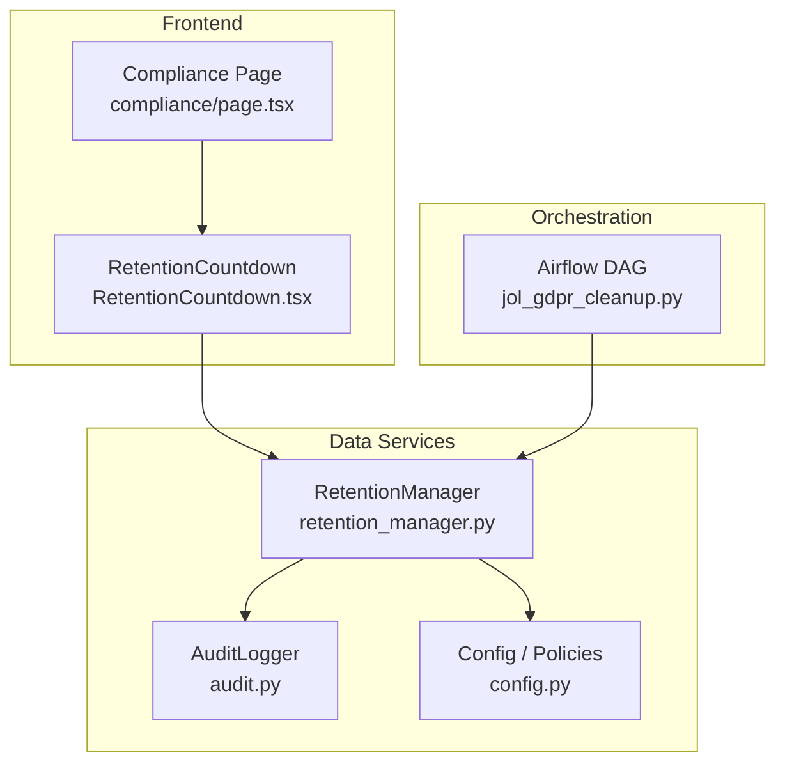
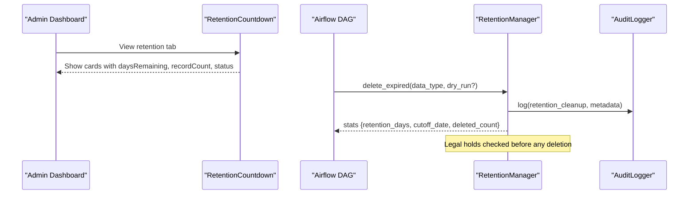
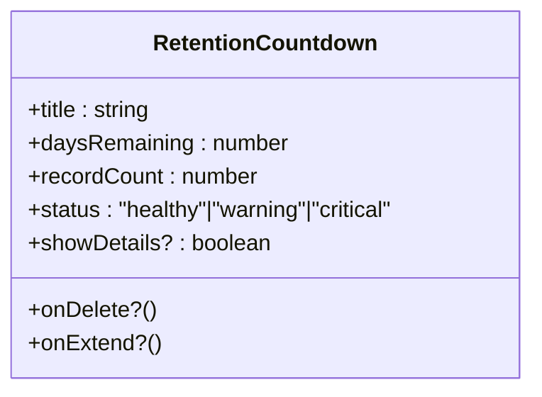
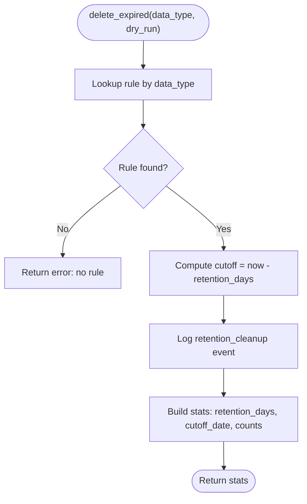
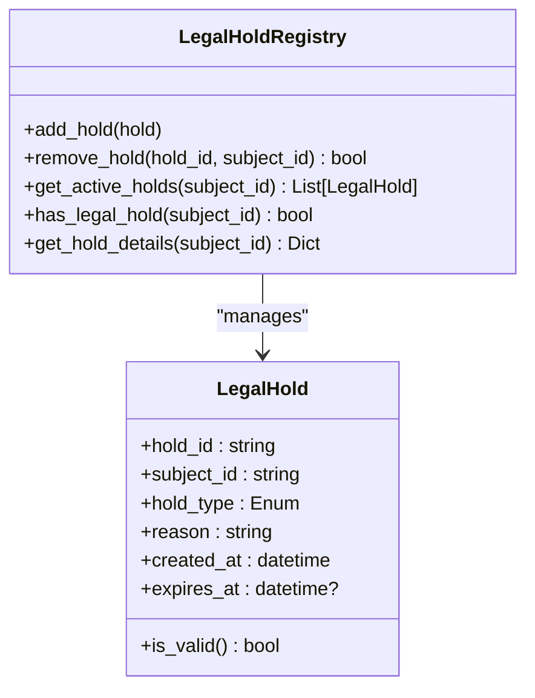
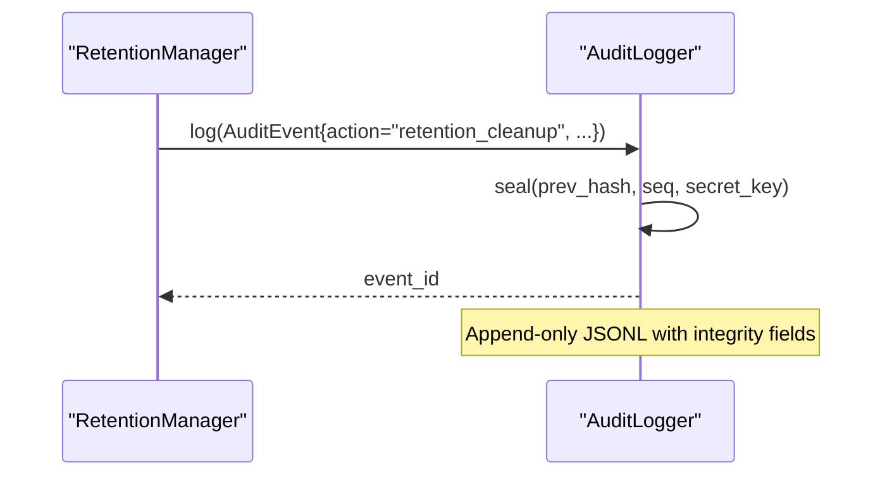
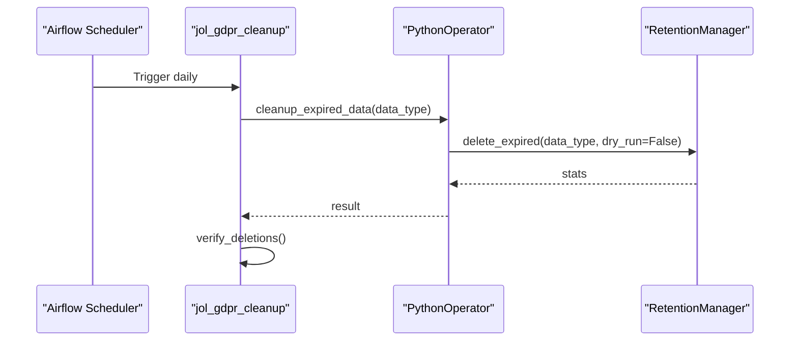
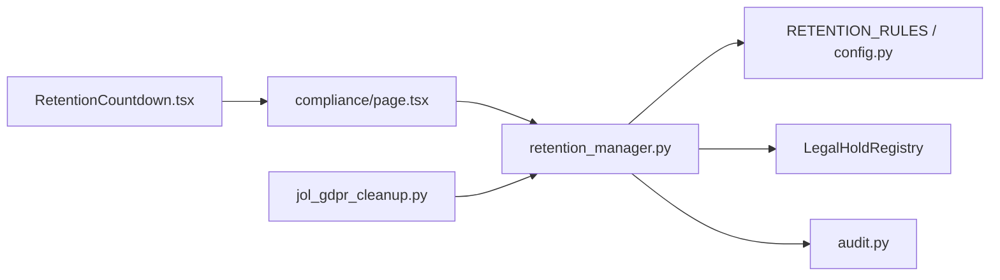

# Retention Countdown Timer

<cite>
**Referenced Files in This Document**
- [RetentionCountdown.tsx](file://frontend/apps/admin-dashboard/src/components/compliance/RetentionCountdown.tsx)
- [compliance/page.tsx](file://frontend/apps/admin-dashboard/src/app/(dashboard)/compliance/page.tsx)
- [retention_manager.py](file://data/src/gdpr/retention_manager.py)
- [audit.py](file://data/src/audit.py)
- [jol_gdpr_cleanup.py](file://data/airflow/dags/jol_gdpr_cleanup.py)
- [config.py](file://data/src/config.py)
- [test_gdpr.py](file://data/tests/test_gdpr.py)
- [data_integration.py](file://backend/django/apps/core/data_integration.py)
</cite>

## Table of Contents
1. [Introduction](#introduction)
2. [Project Structure](#project-structure)
3. [Core Components](#core-components)
4. [Architecture Overview](#architecture-overview)
5. [Detailed Component Analysis](#detailed-component-analysis)
6. [Dependency Analysis](#dependency-analysis)
7. [Performance Considerations](#performance-considerations)
8. [Troubleshooting Guide](#troubleshooting-guide)
9. [Conclusion](#conclusion)
10. [Appendices](#appendices)

## Introduction
This document explains the retention countdown timer component that provides visibility into data aging and scheduled purging based on retention policies. It covers how the frontend displays countdowns for upcoming retention actions, how automated cleanup runs via Airflow, how legal holds protect data from deletion, and how audit logging supports compliance reporting. It also includes configuration guidance, examples for setting up rules, monitoring progress, and handling exceptions to automatic purging.

## Project Structure
The retention system spans three layers:
- Frontend dashboard: displays countdowns and status for different data categories.
- Backend/data services: define retention rules, enforce legal holds, and log actions.
- Orchestration: schedules periodic cleanup tasks and verification.

**Diagram sources**
- [compliance/page.tsx:120-268](file://frontend/apps/admin-dashboard/src/app/(dashboard)/compliance/page.tsx#L120-L268)
- [RetentionCountdown.tsx:24-168](file://frontend/apps/admin-dashboard/src/components/compliance/RetentionCountdown.tsx#L24-L168)
- [retention_manager.py:188-336](file://data/src/gdpr/retention_manager.py#L188-L336)
- [audit.py:205-370](file://data/src/audit.py#L205-L370)
- [jol_gdpr_cleanup.py:21-67](file://data/airflow/dags/jol_gdpr_cleanup.py#L21-L67)
- [config.py:20-26](file://data/src/config.py#L20-L26)

**Section sources**
- [compliance/page.tsx:120-268](file://frontend/apps/admin-dashboard/src/app/(dashboard)/compliance/page.tsx#L120-L268)
- [RetentionCountdown.tsx:24-168](file://frontend/apps/admin-dashboard/src/components/compliance/RetentionCountdown.tsx#L24-L168)
- [retention_manager.py:78-106](file://data/src/gdpr/retention_manager.py#L78-L106)
- [audit.py:205-370](file://data/src/audit.py#L205-L370)
- [jol_gdpr_cleanup.py:21-67](file://data/airflow/dags/jol_gdpr_cleanup.py#L21-L67)
- [config.py:20-26](file://data/src/config.py#L20-L26)

## Core Components
- RetentionCountdown (UI): Renders a card with title, days remaining, record count, status-based styling, progress bar, and optional details/actions (delete now, extend).
- Compliance page: Aggregates multiple RetentionCountdown instances to show overall retention posture and tabs including “Data Retention.”
- RetentionManager: Implements retention rules, legal hold checks, subject erasure flows, and dry-run reporting; integrates with AuditLogger.
- AuditLogger: Provides tamper-evident, chain-backed audit logs for all retention-related actions and GDPR requests.
- Airflow DAG: Schedules daily cleanup tasks for specific data types and verifies completion.
- Config: Defines retention policy durations used across the system.

**Section sources**
- [RetentionCountdown.tsx:24-168](file://frontend/apps/admin-dashboard/src/components/compliance/RetentionCountdown.tsx#L24-L168)
- [compliance/page.tsx:160-268](file://frontend/apps/admin-dashboard/src/app/(dashboard)/compliance/page.tsx#L160-L268)
- [retention_manager.py:188-336](file://data/src/gdpr/retention_manager.py#L188-L336)
- [audit.py:205-370](file://data/src/audit.py#L205-L370)
- [jol_gdpr_cleanup.py:21-67](file://data/airflow/dags/jol_gdpr_cleanup.py#L21-L67)
- [config.py:20-26](file://data/src/config.py#L20-L26)

## Architecture Overview
The system combines UI visibility with backend enforcement and scheduled automation:
- The dashboard shows countdowns per data category.
- Automated jobs run nightly to purge expired records according to configured rules.
- Legal holds block deletions when active.
- All actions are recorded in an integrity-protected audit log for compliance reporting.

**Diagram sources**
- [RetentionCountdown.tsx:24-168](file://frontend/apps/admin-dashboard/src/components/compliance/RetentionCountdown.tsx#L24-L168)
- [retention_manager.py:206-246](file://data/src/gdpr/retention_manager.py#L206-L246)
- [audit.py:330-370](file://data/src/audit.py#L330-L370)
- [jol_gdpr_cleanup.py:21-67](file://data/airflow/dags/jol_gdpr_cleanup.py#L21-L67)

## Detailed Component Analysis

### RetentionCountdown (Frontend)
- Purpose: Visualize aging and upcoming purges per data category.
- Inputs: title, daysRemaining, recordCount, status, optional showDetails, onDelete, onExtend.
- Behavior: Displays status-colored badge, progress bar, record counts, and action buttons when details are enabled. In production, daysRemaining would be driven by backend metrics or API responses.

**Diagram sources**
- [RetentionCountdown.tsx:24-49](file://frontend/apps/admin-dashboard/src/components/compliance/RetentionCountdown.tsx#L24-L49)

**Section sources**
- [RetentionCountdown.tsx:24-168](file://frontend/apps/admin-dashboard/src/components/compliance/RetentionCountdown.tsx#L24-L168)

### Compliance Page (Dashboard)
- Purpose: Aggregate multiple RetentionCountdown components to present retention posture and navigate to related tabs (consent, retention, audit).
- Usage: Instantiates cards for parish records, donation records, user data, session data, etc., with varying daysRemaining and statuses.

**Section sources**
- [compliance/page.tsx:160-268](file://frontend/apps/admin-dashboard/src/app/(dashboard)/compliance/page.tsx#L160-L268)

### RetentionManager (Backend)
- Purpose: Enforce storage limitation and right-to-erasure workflows while respecting legal holds.
- Key capabilities:
  - Rule lookup by data_type and calculation of cutoff dates.
  - Dry-run reporting for planned deletions.
  - Subject-level erasure with legal hold checks and audit logging.
  - Pre-check helper to determine if deletion is allowed.

**Diagram sources**
- [retention_manager.py:206-246](file://data/src/gdpr/retention_manager.py#L206-L246)

**Section sources**
- [retention_manager.py:78-106](file://data/src/gdpr/retention_manager.py#L78-L106)
- [retention_manager.py:188-336](file://data/src/gdpr/retention_manager.py#L188-L336)

### Legal Holds
- Purpose: Prevent deletion when litigation, investigation, audit, subpoena, or law enforcement holds are active.
- Behavior:
  - Registry tracks active holds per subject.
  - Deletion paths check holds and return detailed reasons when blocked.
  - Hold details include type, reason, creation time, and case reference.

**Diagram sources**
- [retention_manager.py:28-67](file://data/src/gdpr/retention_manager.py#L28-L67)
- [retention_manager.py:109-174](file://data/src/gdpr/retention_manager.py#L109-L174)

**Section sources**
- [retention_manager.py:28-67](file://data/src/gdpr/retention_manager.py#L28-L67)
- [retention_manager.py:109-174](file://data/src/gdpr/retention_manager.py#L109-L174)

### Audit Logging
- Purpose: Provide tamper-evident, chain-backed logs for all retention and GDPR-related actions.
- Features:
  - Hash chain linking events, HMAC signatures, sequence numbers.
  - Methods to log general events and GDPR requests.
  - Querying and report generation for compliance periods.

**Diagram sources**
- [retention_manager.py:240-246](file://data/src/gdpr/retention_manager.py#L240-L246)
- [audit.py:330-370](file://data/src/audit.py#L330-L370)

**Section sources**
- [audit.py:205-370](file://data/src/audit.py#L205-L370)
- [audit.py:475-511](file://data/src/audit.py#L475-L511)

### Airflow Orchestration
- Purpose: Schedule and execute retention cleanup tasks daily at a fixed time.
- Tasks:
  - Cleanup operational logs and user activity logs using RetentionManager.
  - Verify deletions post-execution.

**Diagram sources**
- [jol_gdpr_cleanup.py:21-67](file://data/airflow/dags/jol_gdpr_cleanup.py#L21-L67)
- [retention_manager.py:206-246](file://data/src/gdpr/retention_manager.py#L206-L246)

**Section sources**
- [jol_gdpr_cleanup.py:21-67](file://data/airflow/dags/jol_gdpr_cleanup.py#L21-L67)

### Configuration and Rules
- Retention rules define retention_days and legal_basis per data type.
- Policy enums provide standard durations for financial, user data, donations, logs, and backups.

**Section sources**
- [retention_manager.py:78-106](file://data/src/gdpr/retention_manager.py#L78-L106)
- [config.py:20-26](file://data/src/config.py#L20-L26)

## Dependency Analysis
- Frontend depends on RetentionCountdown component and renders it within the compliance page.
- RetentionManager depends on:
  - Retention rules (configuration).
  - LegalHoldRegistry (to prevent deletion under holds).
  - AuditLogger (for compliance records).
- Airflow DAG depends on RetentionManager to perform cleanup tasks.
- Backend integration layer can access RetentionManager and legal hold registry to enforce pre-deletion checks.

**Diagram sources**
- [RetentionCountdown.tsx:24-168](file://frontend/apps/admin-dashboard/src/components/compliance/RetentionCountdown.tsx#L24-L168)
- [compliance/page.tsx:160-268](file://frontend/apps/admin-dashboard/src/app/(dashboard)/compliance/page.tsx#L160-L268)
- [retention_manager.py:78-106](file://data/src/gdpr/retention_manager.py#L78-L106)
- [retention_manager.py:109-174](file://data/src/gdpr/retention_manager.py#L109-L174)
- [audit.py:205-370](file://data/src/audit.py#L205-L370)
- [jol_gdpr_cleanup.py:21-67](file://data/airflow/dags/jol_gdpr_cleanup.py#L21-L67)

**Section sources**
- [retention_manager.py:188-336](file://data/src/gdpr/retention_manager.py#L188-L336)
- [data_integration.py:149-188](file://backend/django/apps/core/data_integration.py#L149-L188)

## Performance Considerations
- Keep RetentionCountdown stateless where possible; derive daysRemaining from server-side calculations to avoid client drift.
- Use dry_run mode in RetentionManager during large cleanup runs to estimate impact before actual deletion.
- Ensure Airflow tasks are idempotent and retry-safe; verify deletions post-run.
- Audit logging should append-only and rotated to prevent I/O bottlenecks.

## Troubleshooting Guide
Common issues and resolutions:
- No retention rule for data_type:
  - Symptom: delete_expired returns an error indicating missing rule.
  - Resolution: Add a corresponding RetentionRule entry or adjust data_type mapping.
- Deletion blocked by legal hold:
  - Symptom: Erasure attempts return blocked status with hold details.
  - Resolution: Review active holds and lift them when appropriate; re-attempt deletion after hold removal.
- Audit log integrity issues:
  - Symptom: Chain verification reports hash mismatches or signature failures.
  - Resolution: Investigate log directory permissions and secret key management; regenerate chain state only under controlled conditions.

**Section sources**
- [retention_manager.py:206-246](file://data/src/gdpr/retention_manager.py#L206-L246)
- [retention_manager.py:257-317](file://data/src/gdpr/retention_manager.py#L257-L317)
- [audit.py:513-589](file://data/src/audit.py#L513-L589)

## Conclusion
The retention countdown timer provides clear visibility into data aging and upcoming purges, while the backend enforces retention policies with legal hold protections and comprehensive audit logging. Scheduled orchestration ensures consistent cleanup, and configuration-driven rules allow flexible policy management. Together, these components deliver a robust, compliant data lifecycle management system.

## Appendices

### Examples and Best Practices

- Setting up retention rules:
  - Define RetentionRule entries with retention_days and legal_basis for each data type.
  - Align durations with organizational and regulatory requirements.

- Monitoring countdown progress:
  - Use the compliance page’s retention tab to view cards with daysRemaining and recordCount.
  - Integrate backend metrics to populate daysRemaining dynamically.

- Handling exceptions to automatic purging:
  - Apply legal holds to subjects requiring preservation.
  - Use dry_run mode to preview deletions before execution.
  - Leverage pre-check helpers to confirm deletion allowance.

- Notification systems for pending deletions:
  - Extend the UI to surface warnings when daysRemaining approaches thresholds.
  - Emit alerts via your notification channel when legal holds block deletions or when cleanup tasks complete.

- Compliance reporting:
  - Generate reports using the audit logger’s reporting utilities for defined periods.
  - Include breakdowns of actions, resource types, and GDPR request volumes.

**Section sources**
- [retention_manager.py:78-106](file://data/src/gdpr/retention_manager.py#L78-L106)
- [retention_manager.py:206-246](file://data/src/gdpr/retention_manager.py#L206-L246)
- [retention_manager.py:257-317](file://data/src/gdpr/retention_manager.py#L257-L317)
- [audit.py:475-511](file://data/src/audit.py#L475-L511)
- [test_gdpr.py:57-84](file://data/tests/test_gdpr.py#L57-L84)
- [data_integration.py:149-188](file://backend/django/apps/core/data_integration.py#L149-L188)