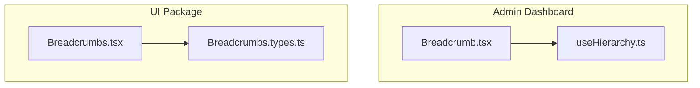
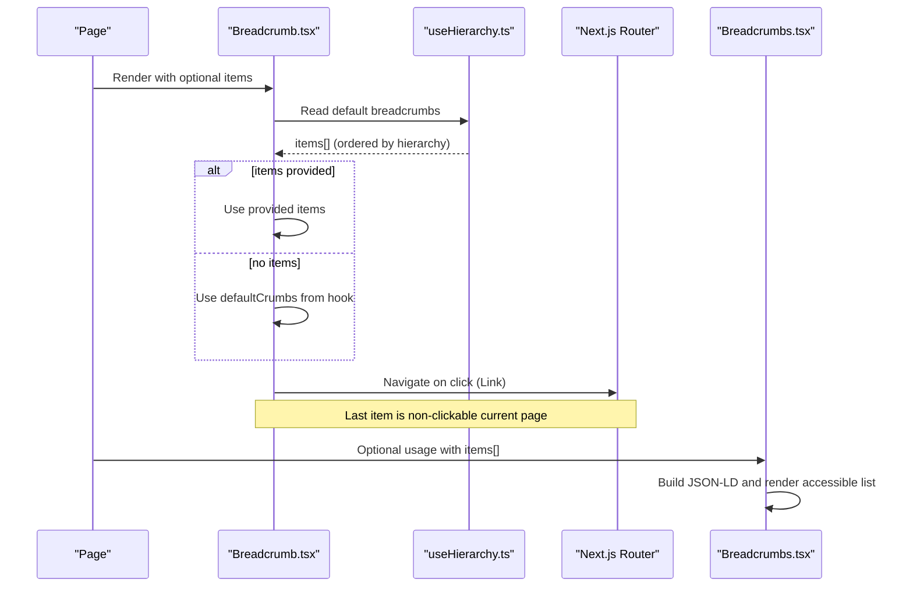
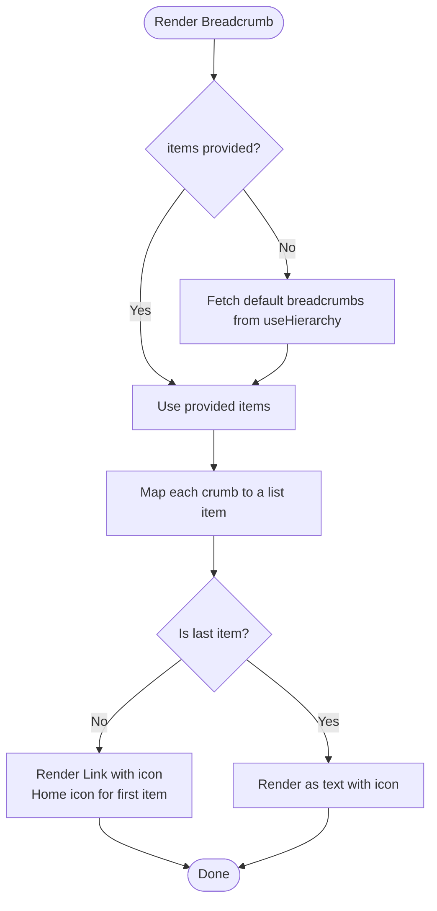
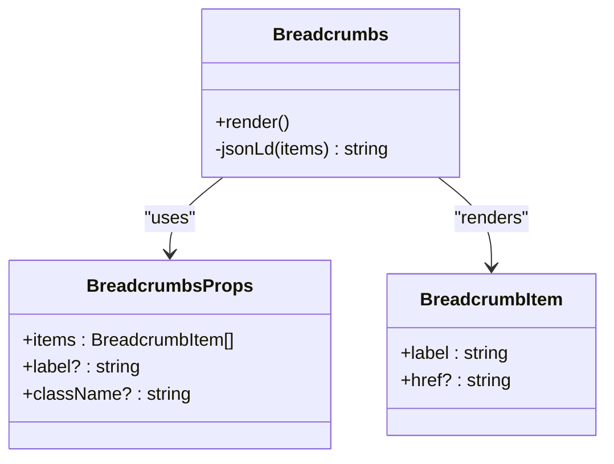
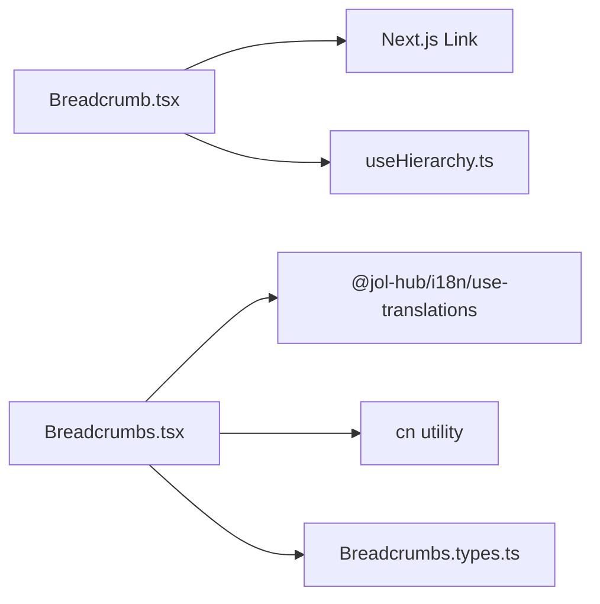

# Breadcrumb Navigation

<cite>
**Referenced Files in This Document**
- [Breadcrumb.tsx](file://frontend/apps/admin-dashboard/src/components/layout/Breadcrumb.tsx)
- [useHierarchy.ts](file://frontend/apps/admin-dashboard/src/hooks/useHierarchy.ts)
- [Breadcrumbs.tsx](file://frontend/packages/ui/src/components/layout/breadcrumbs/Breadcrumbs.tsx)
- [Breadcrumbs.types.ts](file://frontend/packages/ui/src/components/layout/breadcrumbs/Breadcrumbs.types.ts)
</cite>

## Table of Contents
1. [Introduction](#introduction)
2. [Project Structure](#project-structure)
3. [Core Components](#core-components)
4. [Architecture Overview](#architecture-overview)
5. [Detailed Component Analysis](#detailed-component-analysis)
6. [Dependency Analysis](#dependency-analysis)
7. [Performance Considerations](#performance-considerations)
8. [Troubleshooting Guide](#troubleshooting-guide)
9. [Conclusion](#conclusion)
10. [Appendices](#appendices)

## Introduction
This document explains the breadcrumb navigation components that provide hierarchical page navigation and context awareness across the application. It covers automatic route parsing, dynamic breadcrumb generation, click-to-navigate behavior, adaptation to different page hierarchies, deep nesting support, integration with routing, customization options (separators, custom items), and styling variations.

## Project Structure
The breadcrumb functionality is implemented in two places:
- A domain-specific breadcrumb component for the admin dashboard that uses a hierarchy-aware hook to build breadcrumbs from the current federation/country/diocese/parish context.
- A reusable UI package component that renders a generic breadcrumb trail with accessibility and SEO enhancements.

**Diagram sources**
- [Breadcrumb.tsx:1-68](file://frontend/apps/admin-dashboard/src/components/layout/Breadcrumb.tsx#L1-L68)
- [useHierarchy.ts:1-200](file://frontend/apps/admin-dashboard/src/hooks/useHierarchy.ts#L1-L200)
- [Breadcrumbs.tsx:1-62](file://frontend/packages/ui/src/components/layout/breadcrumbs/Breadcrumbs.tsx#L1-L62)
- [Breadcrumbs.types.ts:1-17](file://frontend/packages/ui/src/components/layout/breadcrumbs/Breadcrumbs.types.ts#L1-L17)

**Section sources**
- [Breadcrumb.tsx:1-68](file://frontend/apps/admin-dashboard/src/components/layout/Breadcrumb.tsx#L1-L68)
- [Breadcrumbs.tsx:1-62](file://frontend/packages/ui/src/components/layout/breadcrumbs/Breadcrumbs.tsx#L1-L62)
- [Breadcrumbs.types.ts:1-17](file://frontend/packages/ui/src/components/layout/breadcrumbs/Breadcrumbs.types.ts#L1-L17)

## Core Components
- Admin Dashboard Breadcrumb: Renders a contextual navigation trail based on the current hierarchy (e.g., global → country → diocese → parish). It supports icons per tier, a home link for the root, and click-to-navigate via Next.js Link.
- UI Package Breadcrumbs: A generic, accessible breadcrumb list that supports schema.org JSON-LD, ARIA attributes, and customizable separators and styles.

Key responsibilities:
- Generate or accept a list of breadcrumb items representing the path from root to current page.
- Render clickable links for all but the last item; mark the current page appropriately.
- Provide accessibility and SEO benefits through semantic markup and structured data.

**Section sources**
- [Breadcrumb.tsx:13-67](file://frontend/apps/admin-dashboard/src/components/layout/Breadcrumb.tsx#L13-L67)
- [Breadcrumbs.tsx:13-61](file://frontend/packages/ui/src/components/layout/breadcrumbs/Breadcrumbs.tsx#L13-L61)
- [Breadcrumbs.types.ts:1-17](file://frontend/packages/ui/src/components/layout/breadcrumbs/Breadcrumbs.types.ts#L1-L17)

## Architecture Overview
The breadcrumb system combines a domain-specific implementation with a shared UI primitive:
- The admin dashboard component consumes a hook that resolves the current hierarchy and returns an ordered list of breadcrumb items.
- The UI package provides a robust, accessible renderer that can be used anywhere with any list of items.

**Diagram sources**
- [Breadcrumb.tsx:25-67](file://frontend/apps/admin-dashboard/src/components/layout/Breadcrumb.tsx#L25-L67)
- [useHierarchy.ts:1-200](file://frontend/apps/admin-dashboard/src/hooks/useHierarchy.ts#L1-L200)
- [Breadcrumbs.tsx:26-61](file://frontend/packages/ui/src/components/layout/breadcrumbs/Breadcrumbs.tsx#L26-L61)

## Detailed Component Analysis

### Admin Dashboard Breadcrumb
- Purpose: Show a hierarchical navigation trail specific to the federation model (global → country → diocese → parish).
- Data source: Uses a hierarchy hook to compute default breadcrumbs; accepts an override prop for explicit control.
- Rendering:
  - Root item links to home with a home icon.
  - Intermediate items are links with a tier-specific icon.
  - Final item is plain text representing the current page.
  - Separator is a chevron between items.
- Accessibility: Uses a nav landmark and aria-label for the breadcrumb region.

**Diagram sources**
- [Breadcrumb.tsx:25-67](file://frontend/apps/admin-dashboard/src/components/layout/Breadcrumb.tsx#L25-L67)

**Section sources**
- [Breadcrumb.tsx:13-67](file://frontend/apps/admin-dashboard/src/components/layout/Breadcrumb.tsx#L13-L67)

### UI Package Breadcrumbs
- Purpose: Generic, accessible breadcrumb list suitable for any page hierarchy.
- Data model: Accepts an array of items where each has a label and optional href; the last item is always rendered as text.
- Accessibility:
  - Nav landmark with a label (defaults to i18n key).
  - Current page marked with aria-current="page".
  - Separators are visually hidden from assistive tech using aria-hidden.
- SEO: Injects schema.org BreadcrumbList JSON-LD describing the trail.
- Styling: Supports className prop for overrides; default styling uses neutral colors and subtle separators.

**Diagram sources**
- [Breadcrumbs.tsx:13-61](file://frontend/packages/ui/src/components/layout/breadcrumbs/Breadcrumbs.tsx#L13-L61)
- [Breadcrumbs.types.ts:1-17](file://frontend/packages/ui/src/components/layout/breadcrumbs/Breadcrumbs.types.ts#L1-L17)

**Section sources**
- [Breadcrumbs.tsx:13-61](file://frontend/packages/ui/src/components/layout/breadcrumbs/Breadcrumbs.tsx#L13-L61)
- [Breadcrumbs.types.ts:1-17](file://frontend/packages/ui/src/components/layout/breadcrumbs/Breadcrumbs.types.ts#L1-L17)

### Automatic Route Parsing and Dynamic Generation
- The admin dashboard component relies on a hook to resolve the current hierarchy and produce an ordered list of breadcrumbs. This enables automatic generation without hardcoding routes.
- The UI package component does not parse routes itself; it expects a precomputed list of items. This separation allows flexible integration with any routing strategy.

Practical implications:
- When the route changes, the hook recomputes the hierarchy and updates the breadcrumb trail automatically.
- Pages can also pass explicit items to override defaults when needed.

**Section sources**
- [Breadcrumb.tsx:25-29](file://frontend/apps/admin-dashboard/src/components/layout/Breadcrumb.tsx#L25-L29)
- [useHierarchy.ts:1-200](file://frontend/apps/admin-dashboard/src/hooks/useHierarchy.ts#L1-L200)

### Click-to-Navigate Behavior
- Admin dashboard: Non-final items are rendered as Next.js Links, enabling client-side navigation within the app. The final item is non-interactive to indicate the current page.
- UI package: Non-final items without href are rendered as text; those with href are standard anchor elements. The final item is always text.

**Section sources**
- [Breadcrumb.tsx:43-60](file://frontend/apps/admin-dashboard/src/components/layout/Breadcrumb.tsx#L43-L60)
- [Breadcrumbs.tsx:46-54](file://frontend/packages/ui/src/components/layout/breadcrumbs/Breadcrumbs.tsx#L46-L54)

### Adapting to Different Hierarchies and Deep Nesting
- The admin dashboard component maps each tier to an icon and renders them in order, naturally supporting deep hierarchies as long as the hook returns a correctly ordered list.
- The UI package component handles arbitrary depth by rendering each item sequentially with separators; there is no artificial limit on nesting depth.

Best practices:
- Ensure the hierarchy hook returns a complete path from root to current page.
- Keep labels concise for deep hierarchies to avoid overflow.

**Section sources**
- [Breadcrumb.tsx:18-23](file://frontend/apps/admin-dashboard/src/components/layout/Breadcrumb.tsx#L18-L23)
- [Breadcrumb.tsx:34-63](file://frontend/apps/admin-dashboard/src/components/layout/Breadcrumb.tsx#L34-L63)
- [Breadcrumbs.tsx:36-58](file://frontend/packages/ui/src/components/layout/breadcrumbs/Breadcrumbs.tsx#L36-L58)

### Integration with Routing System
- Admin dashboard: Uses Next.js Link for seamless client-side navigation.
- UI package: Uses native anchors; integrate with your router by providing appropriate href values or wrapping with your router’s Link component if needed.

**Section sources**
- [Breadcrumb.tsx:49-59](file://frontend/apps/admin-dashboard/src/components/layout/Breadcrumb.tsx#L49-L59)
- [Breadcrumbs.tsx:46-54](file://frontend/packages/ui/src/components/layout/breadcrumbs/Breadcrumbs.tsx#L46-L54)

## Dependency Analysis
- Admin Dashboard Breadcrumb depends on:
  - Next.js Link for navigation.
  - A hierarchy hook to compute default breadcrumbs.
  - Icon components for visual cues.
- UI Package Breadcrumbs depends on:
  - i18n for accessible labels.
  - Utility functions for class merging.
  - Types for strict item definitions.

**Diagram sources**
- [Breadcrumb.tsx:8-11](file://frontend/apps/admin-dashboard/src/components/layout/Breadcrumb.tsx#L8-L11)
- [Breadcrumb.tsx:25-27](file://frontend/apps/admin-dashboard/src/components/layout/Breadcrumb.tsx#L25-L27)
- [Breadcrumbs.tsx:8-11](file://frontend/packages/ui/src/components/layout/breadcrumbs/Breadcrumbs.tsx#L8-L11)
- [Breadcrumbs.types.ts:1-17](file://frontend/packages/ui/src/components/layout/breadcrumbs/Breadcrumbs.types.ts#L1-L17)

**Section sources**
- [Breadcrumb.tsx:8-11](file://frontend/apps/admin-dashboard/src/components/layout/Breadcrumb.tsx#L8-L11)
- [Breadcrumbs.tsx:8-11](file://frontend/packages/ui/src/components/layout/breadcrumbs/Breadcrumbs.tsx#L8-L11)
- [Breadcrumbs.types.ts:1-17](file://frontend/packages/ui/src/components/layout/breadcrumbs/Breadcrumbs.types.ts#L1-L17)

## Performance Considerations
- Minimal re-renders: Both components render only what is necessary; the admin dashboard conditionally renders nothing when there are no items.
- Lightweight JSON-LD: The UI package generates a compact structured data object only when items exist.
- Avoid excessive nesting: While deep hierarchies are supported, consider truncating or collapsing very deep paths to maintain usability.

[No sources needed since this section provides general guidance]

## Troubleshooting Guide
- Empty breadcrumbs: If no items are provided and the hook returns none, the admin dashboard component renders nothing. Verify that the hierarchy hook resolves the current context correctly.
- Missing separators: In the UI package, separators are inserted between items; ensure you pass a non-empty items array to see separators.
- Incorrect current page marking: The last item is always treated as the current page. If your items array is incomplete, the wrong page may appear as current.
- Accessibility issues: Ensure the nav landmark has a meaningful label (or rely on the default i18n label) and that the last item remains non-link text.

**Section sources**
- [Breadcrumb.tsx:25-29](file://frontend/apps/admin-dashboard/src/components/layout/Breadcrumb.tsx#L25-L29)
- [Breadcrumbs.tsx:26-35](file://frontend/packages/ui/src/components/layout/breadcrumbs/Breadcrumbs.tsx#L26-L35)
- [Breadcrumbs.tsx:36-58](file://frontend/packages/ui/src/components/layout/breadcrumbs/Breadcrumbs.tsx#L36-L58)

## Conclusion
The breadcrumb system offers both a domain-specific, hierarchy-aware component and a flexible, accessible UI primitive. Together, they enable automatic generation of navigation trails, robust click-to-navigate behavior, and strong SEO and accessibility support. By leveraging the hierarchy hook and passing well-formed item arrays, applications can adapt to varied page structures and deep nesting while maintaining consistent user experience.

[No sources needed since this section summarizes without analyzing specific files]

## Appendices

### Customization Examples

- Customize separator:
  - UI package: Replace the default slash separator by overriding styles or wrapping items with your own separator element.
  - Admin dashboard: Replace the chevron icon with a different icon or style.

- Add custom breadcrumb items:
  - Pass an explicit items array to either component to override defaults. For example, include a custom step in the middle of the trail with its own label and href.

- Styling variations:
  - UI package: Use the className prop to apply custom classes. Adjust colors, spacing, and typography to match your design system.
  - Admin dashboard: Modify Tailwind classes around the nav and list to change appearance.

- Schema.org SEO:
  - UI package automatically injects JSON-LD for breadcrumbs. Ensure your items reflect the true navigation path for accurate search results.

[No sources needed since this section provides general guidance]