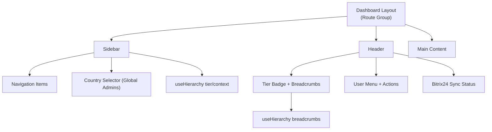
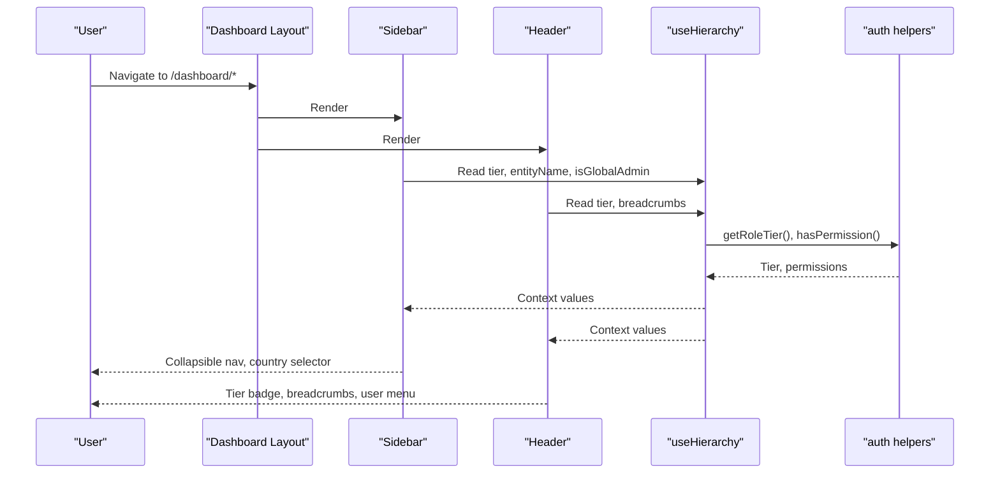
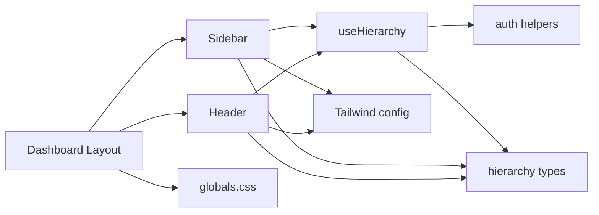

# Dashboard Layout & Navigation

<cite>
**Referenced Files in This Document**
- [layout.tsx](file://frontend/apps/admin-dashboard/src/app/(dashboard)/layout.tsx)
- [sidebar.tsx](file://frontend/apps/admin-dashboard/src/components/layout/sidebar.tsx)
- [header.tsx](file://frontend/apps/admin-dashboard/src/components/layout/header.tsx)
- [Breadcrumb.tsx](file://frontend/apps/admin-dashboard/src/components/layout/Breadcrumb.tsx)
- [useHierarchy.ts](file://frontend/apps/admin-dashboard/src/hooks/useHierarchy.ts)
- [hierarchy.ts](file://frontend/apps/admin-dashboard/src/types/hierarchy.ts)
- [auth.ts](file://frontend/apps/admin-dashboard/src/lib/auth.ts)
- [tailwind.config.ts](file://frontend/apps/admin-dashboard/tailwind.config.ts)
- [globals.css](file://frontend/apps/admin-dashboard/src/styles/globals.css)
</cite>

## Table of Contents
1. [Introduction](#introduction)
2. [Project Structure](#project-structure)
3. [Core Components](#core-components)
4. [Architecture Overview](#architecture-overview)
5. [Detailed Component Analysis](#detailed-component-analysis)
6. [Dependency Analysis](#dependency-analysis)
7. [Performance Considerations](#performance-considerations)
8. [Troubleshooting Guide](#troubleshooting-guide)
9. [Conclusion](#conclusion)
10. [Appendices](#appendices)

## Introduction
This document explains the dashboard layout system that provides responsive navigation, sidebar management, and breadcrumb navigation for deep page hierarchies. It covers the main container, collapsible sidebar with role-aware menus, header with user controls, and dynamic breadcrumbs. It also details responsive design patterns, role-based menu visibility, theming, accessibility considerations, and keyboard navigation support. Practical examples show how to add new navigation items, customize the sidebar, and implement role-based UI elements.

## Project Structure
The dashboard is implemented as a Next.js route group that composes a Sidebar, Header, and main content area. The hierarchy context drives breadcrumbs and role-based features. Theming and responsive utilities are provided via Tailwind CSS and global CSS variables.

**Diagram sources**
- [layout.tsx:12-31](file://frontend/apps/admin-dashboard/src/app/(dashboard)/layout.tsx#L12-L31)
- [sidebar.tsx:51-200](file://frontend/apps/admin-dashboard/src/components/layout/sidebar.tsx#L51-L200)
- [header.tsx:27-170](file://frontend/apps/admin-dashboard/src/components/layout/header.tsx#L27-L170)
- [useHierarchy.ts:33-159](file://frontend/apps/admin-dashboard/src/hooks/useHierarchy.ts#L33-L159)

**Section sources**
- [layout.tsx:12-31](file://frontend/apps/admin-dashboard/src/app/(dashboard)/layout.tsx#L12-L31)
- [tailwind.config.ts:11-69](file://frontend/apps/admin-dashboard/tailwind.config.ts#L11-L69)
- [globals.css:12-88](file://frontend/apps/admin-dashboard/src/styles/globals.css#L12-L88)

## Core Components
- Main container: The dashboard route group wraps the app shell with guards, then renders Sidebar, Header, and a scrollable main region.
- Sidebar: Collapsible navigation with active state detection, country selector for global admins, emergency stop, and user profile section.
- Header: Displays current tier badge, breadcrumbs, search, Bitrix24 sync status, notifications, theme toggle, and user dropdown.
- Breadcrumb: Renders a hierarchical trail using icons per tier and links back up the hierarchy.

Key behaviors:
- Role-based visibility: Country selector shows only for global admins; certain actions may be gated by roles.
- Dynamic breadcrumbs: Built from session data and current tier.
- Responsive layout: Flexbox layout with overflow handling; sidebar collapses on small screens via width transitions.

**Section sources**
- [layout.tsx:12-31](file://frontend/apps/admin-dashboard/src/app/(dashboard)/layout.tsx#L12-L31)
- [sidebar.tsx:51-200](file://frontend/apps/admin-dashboard/src/components/layout/sidebar.tsx#L51-L200)
- [header.tsx:27-170](file://frontend/apps/admin-dashboard/src/components/layout/header.tsx#L27-L170)
- [Breadcrumb.tsx:25-67](file://frontend/apps/admin-dashboard/src/components/layout/Breadcrumb.tsx#L25-L67)
- [useHierarchy.ts:33-159](file://frontend/apps/admin-dashboard/src/hooks/useHierarchy.ts#L33-L159)

## Architecture Overview
The layout composes components around a shared hierarchy context. The hook derives tier, entity identifiers, and breadcrumbs from the session. The sidebar and header consume this context to render appropriate UI.

**Diagram sources**
- [layout.tsx:12-31](file://frontend/apps/admin-dashboard/src/app/(dashboard)/layout.tsx#L12-L31)
- [sidebar.tsx:51-200](file://frontend/apps/admin-dashboard/src/components/layout/sidebar.tsx#L51-L200)
- [header.tsx:27-170](file://frontend/apps/admin-dashboard/src/components/layout/header.tsx#L27-L170)
- [useHierarchy.ts:33-159](file://frontend/apps/admin-dashboard/src/hooks/useHierarchy.ts#L33-L159)
- [auth.ts:218-333](file://frontend/apps/admin-dashboard/src/lib/auth.ts#L218-L333)

## Detailed Component Analysis

### Dashboard Layout (Route Group)
- Wraps children with authentication and country guards.
- Renders a flex container with Sidebar and a flexible main area containing Header and scrollable content.

Responsibilities:
- Enforce access control at the route level.
- Provide consistent chrome across all dashboard pages.

**Section sources**
- [layout.tsx:12-31](file://frontend/apps/admin-dashboard/src/app/(dashboard)/layout.tsx#L12-L31)

### Sidebar
- Collapsible panel with logo, tier indicator, navigation list, country selector (global admins only), emergency stop, and user profile.
- Active link detection based on pathname.
- Uses lucide icons and role labels for display.

Responsive behavior:
- Width transitions between collapsed and expanded states.
- Text hidden when collapsed; tooltips via title attributes for accessibility.

Extensibility:
- Add new items by extending the navigation array.
- Gate visibility by checking session role or hierarchy flags.

**Section sources**
- [sidebar.tsx:41-159](file://frontend/apps/admin-dashboard/src/components/layout/sidebar.tsx#L41-L159)
- [sidebar.tsx:161-199](file://frontend/apps/admin-dashboard/src/components/layout/sidebar.tsx#L161-L199)
- [auth.ts:318-344](file://frontend/apps/admin-dashboard/src/lib/auth.ts#L318-L344)

### Header
- Displays tier badge, inline breadcrumbs, search input, Bitrix24 sync status, emergency stop, notifications, theme toggle, and user dropdown.
- Reads session and hierarchy context to render contextual information.

Accessibility:
- Semantic header element.
- Dropdown uses accessible menu primitives.
- Theme toggle exposes clear affordance.

**Section sources**
- [header.tsx:27-170](file://frontend/apps/admin-dashboard/src/components/layout/header.tsx#L27-L170)

### Breadcrumb Component
- Renders a navigable trail with tier-specific icons and links.
- Defaults to hierarchy-provided crumbs; can accept custom items.

Accessibility:
- Uses an ordered list and aria-label for semantic structure.
- Last item is non-link text indicating current location.

**Section sources**
- [Breadcrumb.tsx:25-67](file://frontend/apps/admin-dashboard/src/components/layout/Breadcrumb.tsx#L25-L67)

### Hierarchy Hook and Types
- Derives tier, entity IDs, names, parent ID, breadcrumbs, and scope filters from session data.
- Provides permission checks and boolean flags for each tier.
- Types define federation tiers, scopes, permissions, and breadcrumb shape.

Data flow:
- Session -> useHierarchy -> Sidebar/Header/Breadcrumb.

**Section sources**
- [useHierarchy.ts:33-159](file://frontend/apps/admin-dashboard/src/hooks/useHierarchy.ts#L33-L159)
- [hierarchy.ts:7-92](file://frontend/apps/admin-dashboard/src/types/hierarchy.ts#L7-L92)
- [auth.ts:218-333](file://frontend/apps/admin-dashboard/src/lib/auth.ts#L218-L333)

### Theming and Responsive Design
- Tailwind configuration extends colors for sidebar, primary, accent, and sacred palette.
- Global CSS defines light/dark tokens and utility classes for liturgical and GDPR-related visuals.
- Dark mode toggled via next-themes; header includes a theme switch.

Responsive patterns:
- Flex layout adapts to viewport size.
- Sidebar collapses to icon-only mode.
- Breadcrumbs hide on small screens within header; fallback available via dedicated component.

**Section sources**
- [tailwind.config.ts:11-69](file://frontend/apps/admin-dashboard/tailwind.config.ts#L11-L69)
- [globals.css:12-88](file://frontend/apps/admin-dashboard/src/styles/globals.css#L12-L88)
- [header.tsx:119-126](file://frontend/apps/admin-dashboard/src/components/layout/header.tsx#L119-L126)

## Dependency Analysis
The following diagram maps key dependencies among layout components, hooks, types, and auth utilities.

**Diagram sources**
- [layout.tsx:12-31](file://frontend/apps/admin-dashboard/src/app/(dashboard)/layout.tsx#L12-L31)
- [sidebar.tsx:51-200](file://frontend/apps/admin-dashboard/src/components/layout/sidebar.tsx#L51-L200)
- [header.tsx:27-170](file://frontend/apps/admin-dashboard/src/components/layout/header.tsx#L27-L170)
- [useHierarchy.ts:33-159](file://frontend/apps/admin-dashboard/src/hooks/useHierarchy.ts#L33-L159)
- [hierarchy.ts:7-92](file://frontend/apps/admin-dashboard/src/types/hierarchy.ts#L7-L92)
- [auth.ts:218-333](file://frontend/apps/admin-dashboard/src/lib/auth.ts#L218-L333)
- [tailwind.config.ts:11-69](file://frontend/apps/admin-dashboard/tailwind.config.ts#L11-L69)
- [globals.css:12-88](file://frontend/apps/admin-dashboard/src/styles/globals.css#L12-L88)

**Section sources**
- [useHierarchy.ts:33-159](file://frontend/apps/admin-dashboard/src/hooks/useHierarchy.ts#L33-L159)
- [auth.ts:218-333](file://frontend/apps/admin-dashboard/src/lib/auth.ts#L218-L333)

## Performance Considerations
- Memoization: The hierarchy hook memoizes derived values (tier, ids, breadcrumbs) to avoid unnecessary recalculations on re-renders.
- Lightweight UI: Icons and simple DOM structures keep rendering fast.
- Conditional rendering: Country selector and admin-only sections render only when needed.
- Theme switching: Toggling theme does not require full page reloads.

[No sources needed since this section provides general guidance]

## Troubleshooting Guide
Common issues and resolutions:
- Breadcrumbs not showing: Ensure session contains required fields (country code/name, diocese/parish ids). Verify useHierarchy builds items correctly.
- Country selector missing: Confirm user role maps to global tier and isGlobalAdmin flag is true.
- Active link highlighting off: Check pathname matching logic and ensure href paths match routes.
- Theme toggle not working: Verify next-themes provider is configured at app root and class toggles are applied.
- Permission checks fail: Validate role-to-tier mapping and permission definitions in auth helpers.

**Section sources**
- [useHierarchy.ts:79-117](file://frontend/apps/admin-dashboard/src/hooks/useHierarchy.ts#L79-L117)
- [sidebar.tsx:140-159](file://frontend/apps/admin-dashboard/src/components/layout/sidebar.tsx#L140-L159)
- [auth.ts:218-333](file://frontend/apps/admin-dashboard/src/lib/auth.ts#L218-L333)

## Conclusion
The dashboard layout provides a robust, role-aware foundation for multi-tier administration. It combines a collapsible sidebar, a context-rich header, and dynamic breadcrumbs to navigate deep hierarchies. Theming and responsive utilities ensure a consistent experience across devices and preferences. Extending navigation and enforcing role-based visibility is straightforward through the existing hook and helper utilities.

[No sources needed since this section summarizes without analyzing specific files]

## Appendices

### Adding a New Navigation Item
Steps:
- Open the sidebar file and extend the navigation array with a new entry including name, href, and icon.
- Ensure the target route exists under the dashboard route group.
- If the item should be role-restricted, wrap it with a condition based on hierarchy flags or permission checks.

References:
- [sidebar.tsx:41-49](file://frontend/apps/admin-dashboard/src/components/layout/sidebar.tsx#L41-L49)
- [auth.ts:306-333](file://frontend/apps/admin-dashboard/src/lib/auth.ts#L306-L333)

**Section sources**
- [sidebar.tsx:41-49](file://frontend/apps/admin-dashboard/src/components/layout/sidebar.tsx#L41-L49)
- [auth.ts:306-333](file://frontend/apps/admin-dashboard/src/lib/auth.ts#L306-L333)

### Customizing the Sidebar
Options:
- Toggle collapse state programmatically or via UI controls.
- Adjust widths and spacing via Tailwind classes.
- Add sections or badges using existing UI primitives.
- Integrate additional context (e.g., feature flags) to show/hide items.

References:
- [sidebar.tsx:71-99](file://frontend/apps/admin-dashboard/src/components/layout/sidebar.tsx#L71-L99)
- [tailwind.config.ts:51-60](file://frontend/apps/admin-dashboard/tailwind.config.ts#L51-L60)

**Section sources**
- [sidebar.tsx:71-99](file://frontend/apps/admin-dashboard/src/components/layout/sidebar.tsx#L71-L99)
- [tailwind.config.ts:51-60](file://frontend/apps/admin-dashboard/tailwind.config.ts#L51-L60)

### Implementing Role-Based UI Elements
Approach:
- Use the hierarchy hook to derive tier and flags (e.g., isGlobalAdmin).
- Use permission helpers to check specific actions/resources before rendering sensitive controls.
- Apply visual indicators (badges, labels) using role mappings and color utilities.

References:
- [useHierarchy.ts:119-159](file://frontend/apps/admin-dashboard/src/hooks/useHierarchy.ts#L119-L159)
- [auth.ts:248-333](file://frontend/apps/admin-dashboard/src/lib/auth.ts#L248-L333)
- [auth.ts:336-355](file://frontend/apps/admin-dashboard/src/lib/auth.ts#L336-L355)

**Section sources**
- [useHierarchy.ts:119-159](file://frontend/apps/admin-dashboard/src/hooks/useHierarchy.ts#L119-L159)
- [auth.ts:248-333](file://frontend/apps/admin-dashboard/src/lib/auth.ts#L248-L333)
- [auth.ts:336-355](file://frontend/apps/admin-dashboard/src/lib/auth.ts#L336-L355)

### Responsive Design Patterns
- Mobile-first layout: Flex containers adapt to screen size; sidebar collapses to icon-only mode.
- Hidden elements: Inline breadcrumbs hide on small screens; rely on dedicated breadcrumb component when needed.
- Touch-friendly targets: Buttons and links sized appropriately for touch interactions.

References:
- [layout.tsx:20-27](file://frontend/apps/admin-dashboard/src/app/(dashboard)/layout.tsx#L20-L27)
- [header.tsx:61-70](file://frontend/apps/admin-dashboard/src/components/layout/header.tsx#L61-L70)
- [sidebar.tsx:71-99](file://frontend/apps/admin-dashboard/src/components/layout/sidebar.tsx#L71-L99)

**Section sources**
- [layout.tsx:20-27](file://frontend/apps/admin-dashboard/src/app/(dashboard)/layout.tsx#L20-L27)
- [header.tsx:61-70](file://frontend/apps/admin-dashboard/src/components/layout/header.tsx#L61-L70)
- [sidebar.tsx:71-99](file://frontend/apps/admin-dashboard/src/components/layout/sidebar.tsx#L71-L99)

### Accessibility and Keyboard Navigation
- Semantic landmarks: Header and aside provide meaningful structure.
- ARIA attributes: Breadcrumb uses aria-label and ordered lists for screen readers.
- Focus management: Dropdown menus and inputs follow accessible patterns.
- Keyboard support: Standard interactive elements are focusable and operable via keyboard.

References:
- [Breadcrumb.tsx:31-66](file://frontend/apps/admin-dashboard/src/components/layout/Breadcrumb.tsx#L31-L66)
- [header.tsx:128-167](file://frontend/apps/admin-dashboard/src/components/layout/header.tsx#L128-L167)

**Section sources**
- [Breadcrumb.tsx:31-66](file://frontend/apps/admin-dashboard/src/components/layout/Breadcrumb.tsx#L31-L66)
- [header.tsx:128-167](file://frontend/apps/admin-dashboard/src/components/layout/header.tsx#L128-L167)