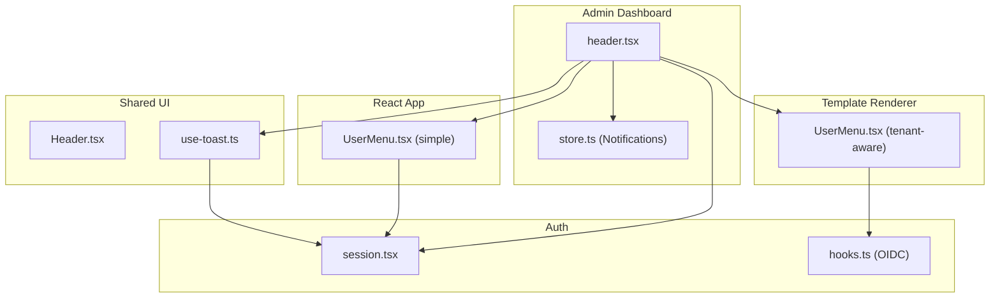
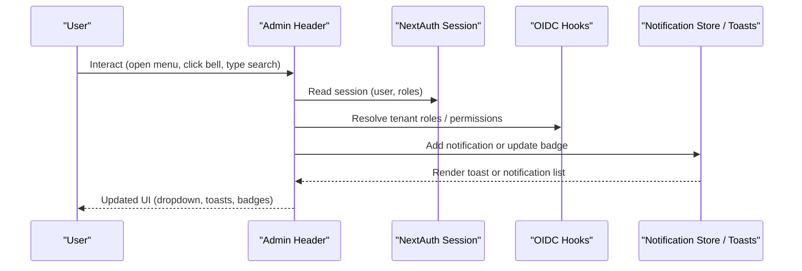
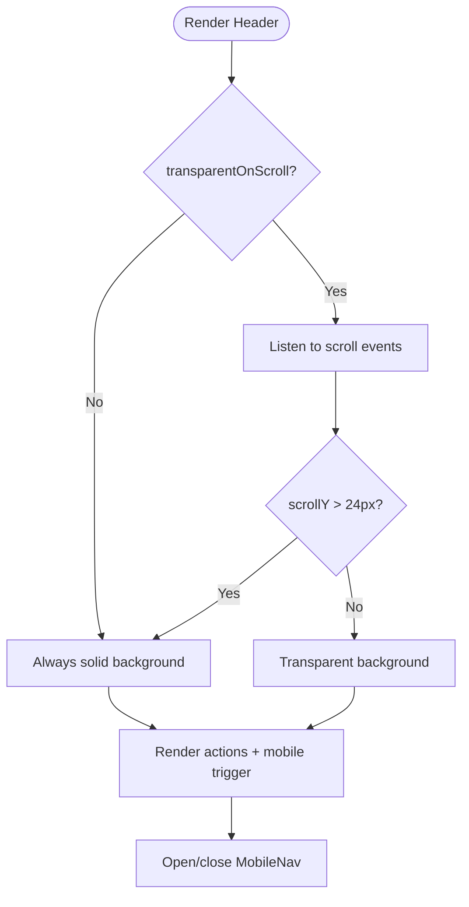
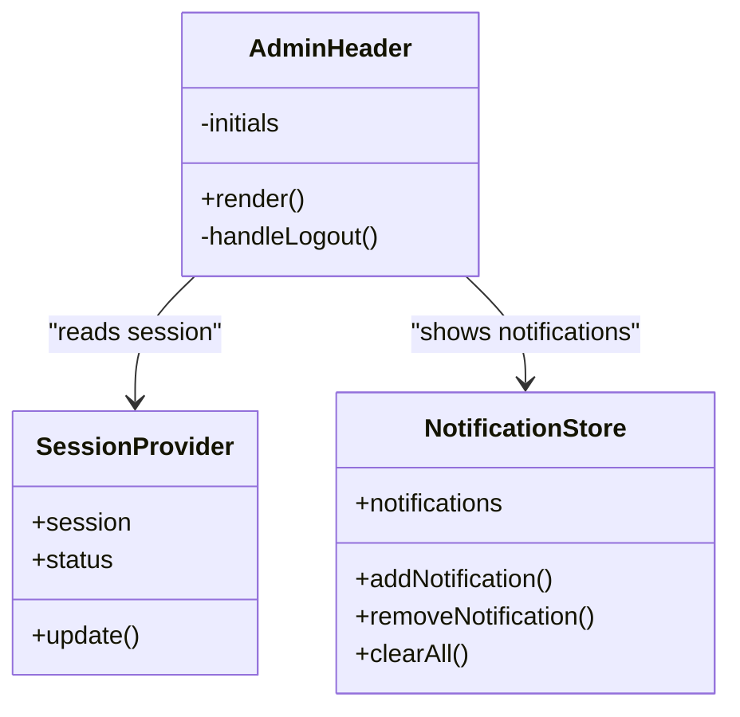
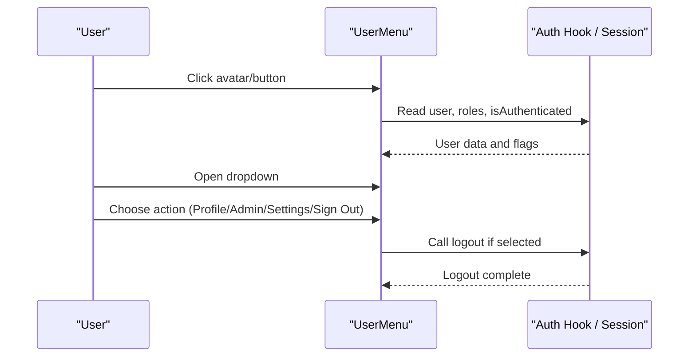
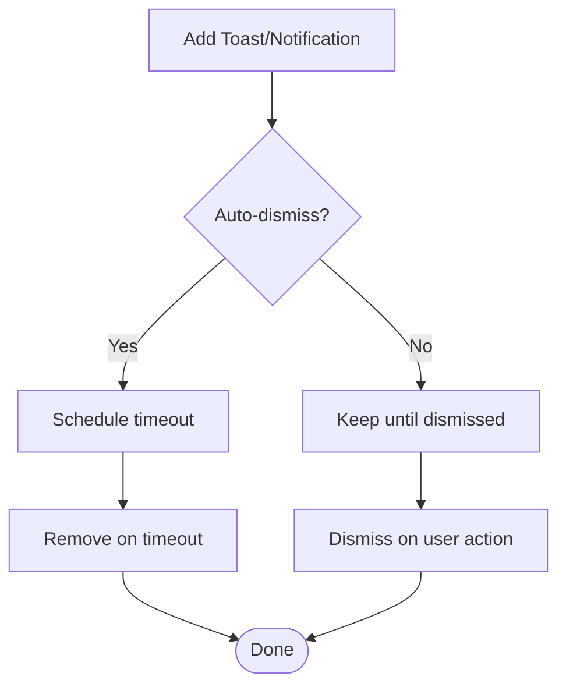
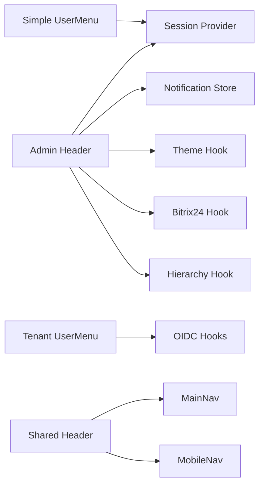

# Header Component

<cite>
**Referenced Files in This Document**
- [Header.tsx](file://frontend/packages/ui/src/components/layout/header/Header.tsx)
- [header.tsx](file://frontend/apps/admin-dashboard/src/components/layout/header.tsx)
- [UserMenu.tsx](file://frontend/apps/template-renderer/src/components/auth/UserMenu.tsx)
- [UserMenu.tsx](file://frontend/react/src/components/UserMenu.tsx)
- [use-toast.ts](file://frontend/packages/ui/src/components/use-toast.ts)
- [store.ts](file://frontend/apps/admin-dashboard/src/lib/store.ts)
- [toaster.tsx](file://frontend/apps/master-site/src/components/toaster.tsx)
- [session.tsx](file://frontend/packages/auth/src/session.tsx)
- [hooks.ts](file://frontend/packages/auth/src/oidc/hooks.ts)
</cite>

## Table of Contents
1. [Introduction](#introduction)
2. [Project Structure](#project-structure)
3. [Core Components](#core-components)
4. [Architecture Overview](#architecture-overview)
5. [Detailed Component Analysis](#detailed-component-analysis)
6. [Dependency Analysis](#dependency-analysis)
7. [Performance Considerations](#performance-considerations)
8. [Troubleshooting Guide](#troubleshooting-guide)
9. [Conclusion](#conclusion)
10. [Appendices](#appendices)

## Introduction
This document explains the header component system across the frontend applications, focusing on user authentication controls, notifications, global actions, search, and mobile navigation. It covers:
- The shared site header with logo, main navigation, actions, and a mobile drawer toggle
- The admin dashboard header with user profile dropdown, notification bell, theme toggle, search, and emergency stop
- User menu implementations for tenant-aware RBAC and simple logout flows
- Integration with authentication state via NextAuth session context and OIDC hooks
- Notification systems using toasts and an in-app notification store
- Responsive design patterns and accessibility considerations

## Project Structure
The header-related code is organized into reusable UI primitives and application-specific headers:
- Shared UI header: provides layout, sticky behavior, scroll transparency, and mobile drawer integration
- Admin dashboard header: integrates auth session, hierarchy breadcrumbs, Bitrix24 sync status, notifications, theme toggle, and user menu
- User menus: one tenant-aware implementation with role-based links; another minimal implementation with avatar and logout
- Notifications: a toast system (global toasts) and an in-memory notification store for app-level alerts
- Authentication: session provider wrapping NextAuth and OIDC hooks that expose user, roles, login/logout

**Diagram sources**
- [Header.tsx:23-82](file://frontend/packages/ui/src/components/layout/header/Header.tsx#L23-L82)
- [header.tsx:27-172](file://frontend/apps/admin-dashboard/src/components/layout/header.tsx#L27-L172)
- [UserMenu.tsx:25-121](file://frontend/apps/template-renderer/src/components/auth/UserMenu.tsx#L25-L121)
- [UserMenu.tsx:18-87](file://frontend/react/src/components/UserMenu.tsx#L18-L87)
- [use-toast.ts:72-187](file://frontend/packages/ui/src/components/use-toast.ts#L72-L187)
- [store.ts:90-129](file://frontend/apps/admin-dashboard/src/lib/store.ts#L90-L129)
- [session.tsx:21-51](file://frontend/packages/auth/src/session.tsx#L21-L51)
- [hooks.ts:24-65](file://frontend/packages/auth/src/oidc/hooks.ts#L24-L65)

**Section sources**
- [Header.tsx:23-82](file://frontend/packages/ui/src/components/layout/header/Header.tsx#L23-L82)
- [header.tsx:27-172](file://frontend/apps/admin-dashboard/src/components/layout/header.tsx#L27-L172)
- [UserMenu.tsx:25-121](file://frontend/apps/template-renderer/src/components/auth/UserMenu.tsx#L25-L121)
- [UserMenu.tsx:18-87](file://frontend/react/src/components/UserMenu.tsx#L18-L87)
- [use-toast.ts:72-187](file://frontend/packages/ui/src/components/use-toast.ts#L72-L187)
- [store.ts:90-129](file://frontend/apps/admin-dashboard/src/lib/store.ts#L90-L129)
- [session.tsx:21-51](file://frontend/packages/auth/src/session.tsx#L21-L51)
- [hooks.ts:24-65](file://frontend/packages/auth/src/oidc/hooks.ts#L24-L65)

## Core Components
- Site Header (shared): Renders logo, MainNav, action slots, and a mobile drawer trigger. Supports sticky positioning and optional transparent-on-scroll behavior.
- Admin Dashboard Header: Integrates NextAuth session, tier badge, breadcrumbs, search input, Bitrix24 sync indicator, emergency stop, notification bell, theme toggle, and user dropdown.
- User Menus: 
  - Tenant-aware UserMenu: shows identity, tenant role badge, profile/admin/settings links gated by roles, and sign out.
  - Simple UserMenu: shows avatar/name/email and sign out.
- Notifications:
  - Toast system: global toasts with add/update/dismiss/remove lifecycle and auto-dismiss timers.
  - In-app notification store: typed notifications with auto-remove after duration.

**Section sources**
- [Header.tsx:23-82](file://frontend/packages/ui/src/components/layout/header/Header.tsx#L23-L82)
- [header.tsx:27-172](file://frontend/apps/admin-dashboard/src/components/layout/header.tsx#L27-L172)
- [UserMenu.tsx:25-121](file://frontend/apps/template-renderer/src/components/auth/UserMenu.tsx#L25-L121)
- [UserMenu.tsx:18-87](file://frontend/react/src/components/UserMenu.tsx#L18-L87)
- [use-toast.ts:72-187](file://frontend/packages/ui/src/components/use-toast.ts#L72-L187)
- [store.ts:90-129](file://frontend/apps/admin-dashboard/src/lib/store.ts#L90-L129)

## Architecture Overview
The header composes multiple concerns:
- Authentication state from NextAuth session provider and OIDC hooks
- Global actions (theme, emergency stop, sync status)
- Search input wired to application search logic
- Notification center (bell + toasts or in-app notifications)
- User profile dropdown with role-gated actions
- Mobile drawer for responsive navigation

**Diagram sources**
- [header.tsx:27-172](file://frontend/apps/admin-dashboard/src/components/layout/header.tsx#L27-L172)
- [session.tsx:21-51](file://frontend/packages/auth/src/session.tsx#L21-L51)
- [hooks.ts:24-65](file://frontend/packages/auth/src/oidc/hooks.ts#L24-L65)
- [use-toast.ts:72-187](file://frontend/packages/ui/src/components/use-toast.ts#L72-L187)
- [store.ts:90-129](file://frontend/apps/admin-dashboard/src/lib/store.ts#L90-L129)

## Detailed Component Analysis

### Site Header (Shared)
Responsibilities:
- Sticky header with optional transparent background that becomes solid after scrolling
- Renders logo, main navigation, and action slot
- Opens mobile drawer with accessible attributes
- Uses i18n for labels

Key behaviors:
- Scroll listener toggles solid background based on threshold
- Mobile drawer controlled by local state and aria attributes

**Diagram sources**
- [Header.tsx:23-82](file://frontend/packages/ui/src/components/layout/header/Header.tsx#L23-L82)

**Section sources**
- [Header.tsx:23-82](file://frontend/packages/ui/src/components/layout/header/Header.tsx#L23-L82)

### Admin Dashboard Header
Responsibilities:
- Displays tier badge and breadcrumbs
- Provides search input
- Shows Bitrix24 sync status indicator
- Offers emergency stop button
- Notification bell with unread indicator
- Theme toggle
- User dropdown with profile, settings, security, and sign out

Integration points:
- NextAuth session for user data and sign out
- Hierarchy hook for tier and breadcrumbs
- Bitrix24 hook for sync status
- Optional integration with toast/notification systems

**Diagram sources**
- [header.tsx:27-172](file://frontend/apps/admin-dashboard/src/components/layout/header.tsx#L27-L172)
- [session.tsx:21-51](file://frontend/packages/auth/src/session.tsx#L21-L51)
- [store.ts:90-129](file://frontend/apps/admin-dashboard/src/lib/store.ts#L90-L129)

**Section sources**
- [header.tsx:27-172](file://frontend/apps/admin-dashboard/src/components/layout/header.tsx#L27-L172)

### User Menu Implementations
Tenant-aware UserMenu:
- Reads current user and tenant role
- Conditionally renders admin/dashboard and settings links based on roles
- Closes on outside click or Escape key
- Sign out triggers tenant-scoped logout

Simple UserMenu:
- Displays avatar or initials and user info
- Sign out navigates to login page

**Diagram sources**
- [UserMenu.tsx:25-121](file://frontend/apps/template-renderer/src/components/auth/UserMenu.tsx#L25-L121)
- [UserMenu.tsx:18-87](file://frontend/react/src/components/UserMenu.tsx#L18-L87)
- [hooks.ts:24-65](file://frontend/packages/auth/src/oidc/hooks.ts#L24-L65)
- [session.tsx:21-51](file://frontend/packages/auth/src/session.tsx#L21-L51)

**Section sources**
- [UserMenu.tsx:25-121](file://frontend/apps/template-renderer/src/components/auth/UserMenu.tsx#L25-L121)
- [UserMenu.tsx:18-87](file://frontend/react/src/components/UserMenu.tsx#L18-L87)
- [hooks.ts:24-65](file://frontend/packages/auth/src/oidc/hooks.ts#L24-L65)
- [session.tsx:21-51](file://frontend/packages/auth/src/session.tsx#L21-L51)

### Notification System
Two complementary approaches are present:
- Global toasts: centralized state machine with add/update/dismiss/remove and auto-dismiss timers
- In-app notifications: typed notifications with durations and removal APIs

**Diagram sources**
- [use-toast.ts:72-187](file://frontend/packages/ui/src/components/use-toast.ts#L72-L187)
- [store.ts:90-129](file://frontend/apps/admin-dashboard/src/lib/store.ts#L90-L129)

**Section sources**
- [use-toast.ts:72-187](file://frontend/packages/ui/src/components/use-toast.ts#L72-L187)
- [store.ts:90-129](file://frontend/apps/admin-dashboard/src/lib/store.ts#L90-L129)

### Search Functionality
- Admin header includes a search input field integrated into the header layout
- Typically bound to application-wide search handlers or debounced queries
- Placeholder text indicates scope (entities, users, content)

Implementation guidance:
- Wire input onChange to a search handler
- Debounce rapid keystrokes
- Display results in a modal or sidebar depending on app layout

**Section sources**
- [header.tsx:73-83](file://frontend/apps/admin-dashboard/src/components/layout/header.tsx#L73-L83)

### Mobile Menu Toggle
- Shared header exposes a hamburger button that opens a mobile drawer
- Drawer receives navigation items and close callback
- Accessible attributes ensure proper screen reader support

**Section sources**
- [Header.tsx:61-79](file://frontend/packages/ui/src/components/layout/header/Header.tsx#L61-L79)

## Dependency Analysis
- Admin header depends on:
  - NextAuth session provider for user data and sign out
  - Hierarchy and Bitrix24 hooks for contextual UI
  - UI components for buttons, inputs, avatars, badges, dropdowns
  - Optional toast/notification systems
- User menus depend on:
  - Auth hooks for user, roles, and logout
  - i18n for localized labels
- Shared header depends on:
  - MainNav and MobileNav for navigation
  - i18n for labels
  - Utility functions for class names

**Diagram sources**
- [header.tsx:27-172](file://frontend/apps/admin-dashboard/src/components/layout/header.tsx#L27-L172)
- [UserMenu.tsx:25-121](file://frontend/apps/template-renderer/src/components/auth/UserMenu.tsx#L25-L121)
- [UserMenu.tsx:18-87](file://frontend/react/src/components/UserMenu.tsx#L18-L87)
- [Header.tsx:23-82](file://frontend/packages/ui/src/components/layout/header/Header.tsx#L23-L82)
- [session.tsx:21-51](file://frontend/packages/auth/src/session.tsx#L21-L51)
- [hooks.ts:24-65](file://frontend/packages/auth/src/oidc/hooks.ts#L24-L65)

**Section sources**
- [header.tsx:27-172](file://frontend/apps/admin-dashboard/src/components/layout/header.tsx#L27-L172)
- [UserMenu.tsx:25-121](file://frontend/apps/template-renderer/src/components/auth/UserMenu.tsx#L25-L121)
- [UserMenu.tsx:18-87](file://frontend/react/src/components/UserMenu.tsx#L18-L87)
- [Header.tsx:23-82](file://frontend/packages/ui/src/components/layout/header/Header.tsx#L23-L82)
- [session.tsx:21-51](file://frontend/packages/auth/src/session.tsx#L21-L51)
- [hooks.ts:24-65](file://frontend/packages/auth/src/oidc/hooks.ts#L24-L65)

## Performance Considerations
- Avoid heavy computations inside header render paths; defer to memoized hooks or effects
- Debounce search input changes to reduce API calls
- Use passive scroll listeners where possible (already used in shared header)
- Keep dropdowns lightweight; avoid re-renders by lifting state minimally
- Prefer lazy loading for non-critical header sections (e.g., complex notification lists)

[No sources needed since this section provides general guidance]

## Troubleshooting Guide
Common issues and resolutions:
- Dropdown not closing: Ensure event listeners for outside clicks and Escape keys are attached and cleaned up
- Notifications not appearing: Verify toast provider is mounted and notification store is initialized
- Auth state inconsistent: Confirm SessionProvider wraps the app and hooks are used within provider scope
- Mobile drawer not accessible: Check aria-expanded and aria-controls attributes on trigger and container

**Section sources**
- [UserMenu.tsx:33-50](file://frontend/apps/template-renderer/src/components/auth/UserMenu.tsx#L33-L50)
- [use-toast.ts:125-187](file://frontend/packages/ui/src/components/use-toast.ts#L125-L187)
- [session.tsx:21-51](file://frontend/packages/auth/src/session.tsx#L21-L51)
- [Header.tsx:61-79](file://frontend/packages/ui/src/components/layout/header/Header.tsx#L61-L79)

## Conclusion
The header system combines a flexible shared layout with application-specific features:
- Robust authentication integration via NextAuth and OIDC hooks
- Clear separation between global toasts and in-app notifications
- Role-aware user menus for tenant-scoped access control
- Responsive design with accessible mobile navigation
- Extensible action slots for custom global actions

Use the provided examples to add custom header actions, implement notification handlers, and customize layout while maintaining performance and accessibility.

[No sources needed since this section summarizes without analyzing specific files]

## Appendices

### Adding Custom Header Actions
- Insert new action elements into the actions slot of the shared header or append to the admin header’s action group
- For authenticated-only actions, guard rendering with session checks or role hooks
- Example pattern: conditionally render a button that triggers a side effect or navigates to a route

**Section sources**
- [Header.tsx:61-73](file://frontend/packages/ui/src/components/layout/header/Header.tsx#L61-L73)
- [header.tsx:85-167](file://frontend/apps/admin-dashboard/src/components/layout/header.tsx#L85-L167)

### Implementing Notification Handlers
- Use the toast API to show transient messages with optional actions and dismiss behavior
- For persistent in-app notifications, use the notification store to add, remove, and clear notifications
- Integrate with backend events or websockets to push real-time updates into the notification store or toast queue

**Section sources**
- [use-toast.ts:72-187](file://frontend/packages/ui/src/components/use-toast.ts#L72-L187)
- [store.ts:90-129](file://frontend/apps/admin-dashboard/src/lib/store.ts#L90-L129)

### Customizing Header Layout
- Adjust sticky and transparent-on-scroll options in the shared header
- Modify responsive breakpoints for navigation visibility
- Compose additional UI elements (badges, indicators) into the header’s action area
- Ensure accessibility attributes (aria-label, aria-expanded) are set for interactive elements

**Section sources**
- [Header.tsx:23-82](file://frontend/packages/ui/src/components/layout/header/Header.tsx#L23-L82)
- [header.tsx:44-172](file://frontend/apps/admin-dashboard/src/components/layout/header.tsx#L44-L172)