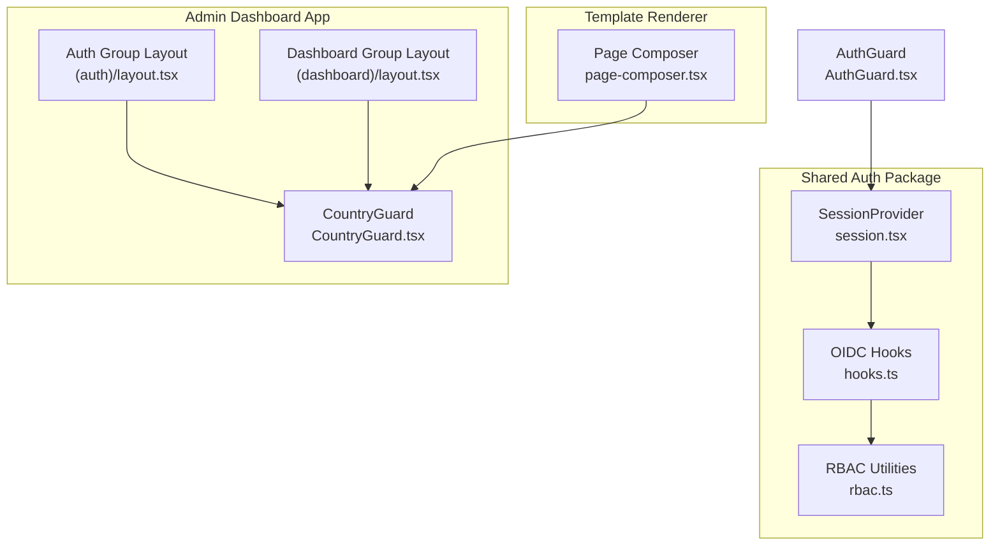
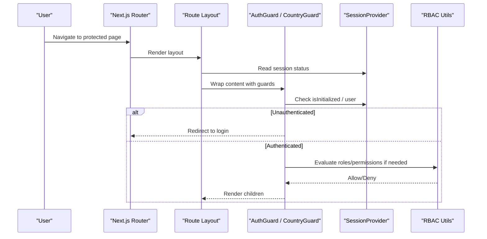
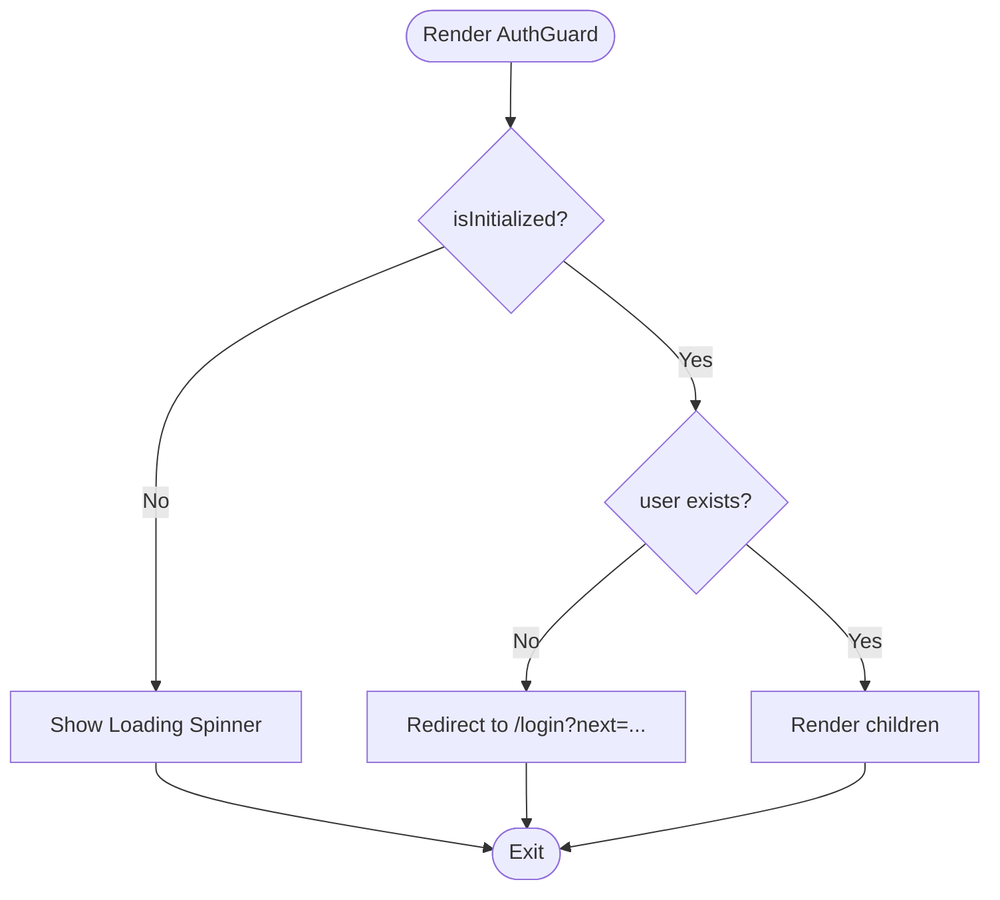
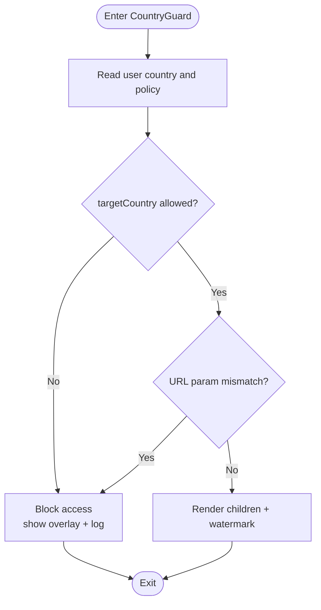
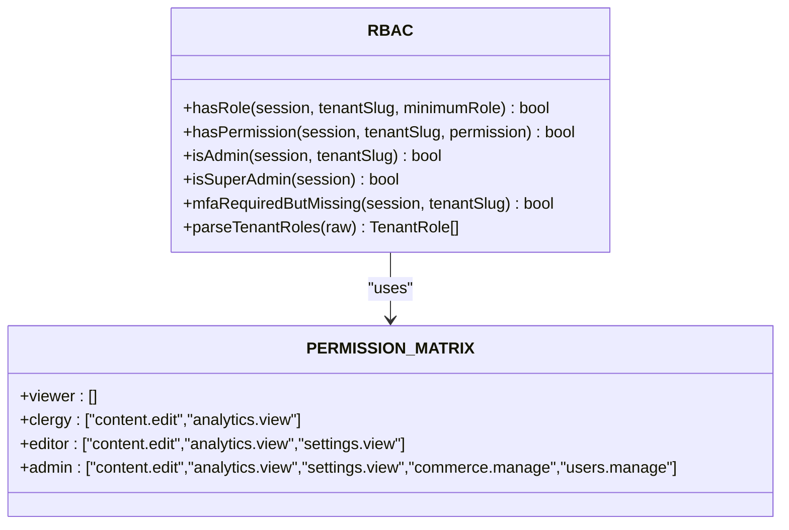
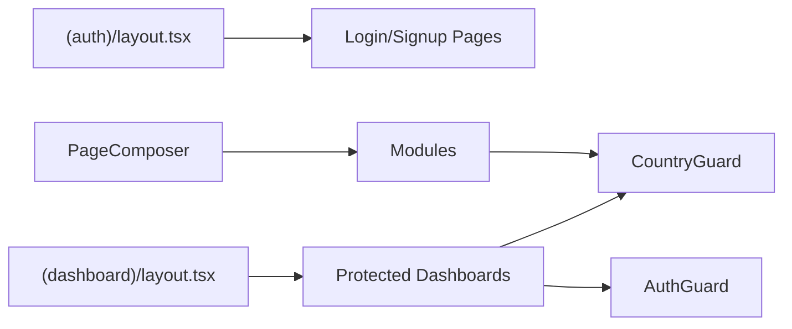
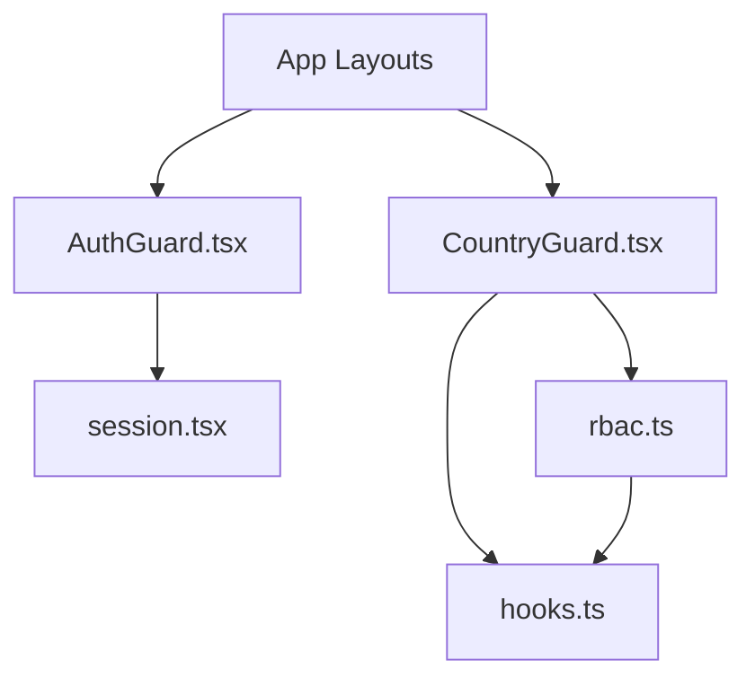

# Layout Providers & Guards

<cite>
**Referenced Files in This Document**
- [AuthGuard.tsx](file://frontend/react/src/components/AuthGuard.tsx)
- [CountryGuard.tsx](file://frontend/apps/admin-dashboard/src/components/layout/CountryGuard.tsx)
- [rbac.ts](file://frontend/packages/auth/src/oidc/rbac.ts)
- [hooks.ts](file://frontend/packages/auth/src/oidc/hooks.ts)
- [session.tsx](file://frontend/packages/auth/src/session.tsx)
- [layout.tsx (admin dashboard auth group)](file://frontend/apps/admin-dashboard/src/app/(auth)/layout.tsx)
- [layout.tsx (admin dashboard dashboard group)](file://frontend/apps/admin-dashboard/src/app/(dashboard)/layout.tsx)
- [page-composer.tsx](file://frontend/apps/template-renderer/src/lib/page-composer.tsx)
</cite>

## Table of Contents
1. [Introduction](#introduction)
2. [Project Structure](#project-structure)
3. [Core Components](#core-components)
4. [Architecture Overview](#architecture-overview)
5. [Detailed Component Analysis](#detailed-component-analysis)
6. [Dependency Analysis](#dependency-analysis)
7. [Performance Considerations](#performance-considerations)
8. [Troubleshooting Guide](#troubleshooting-guide)
9. [Conclusion](#conclusion)
10. [Appendices](#appendices)

## Introduction
This document explains the layout provider system that composes authenticated and region-restricted experiences across the frontend applications. It focuses on:
- AuthGuard for client-side authentication gating
- CountryGuard for GDPR Article 44 data residency enforcement
- Role-based access control (RBAC) via the shared auth package
- How providers wrap content, orchestrate authentication flows, and enforce security policies at both UI and route levels

The goal is to help you understand how to add new guards, implement custom authentication logic, and configure role-based permissions consistently across apps.

## Project Structure
The guard and provider system spans multiple packages and apps:
- Shared auth package provides session context, OIDC hooks, and RBAC utilities
- Apps compose layouts and route groups with guards and providers
- Template renderer composes page modules with layout options

**Diagram sources**
- [session.tsx:21-40](file://frontend/packages/auth/src/session.tsx#L21-L40)
- [hooks.ts:24-65](file://frontend/packages/auth/src/oidc/hooks.ts#L24-L65)
- [rbac.ts:31-84](file://frontend/packages/auth/src/oidc/rbac.ts#L31-L84)
- [layout.tsx (admin dashboard auth group):9-45](file://frontend/apps/admin-dashboard/src/app/(auth)/layout.tsx#L9-L45)
- [layout.tsx (admin dashboard dashboard group):1-45](file://frontend/apps/admin-dashboard/src/app/(dashboard)/layout.tsx#L1-L45)
- [CountryGuard.tsx:25-65](file://frontend/apps/admin-dashboard/src/components/layout/CountryGuard.tsx#L25-L65)
- [page-composer.tsx:70-83](file://frontend/apps/template-renderer/src/lib/page-composer.tsx#L70-L83)
- [AuthGuard.tsx:33-56](file://frontend/react/src/components/AuthGuard.tsx#L33-L56)

**Section sources**
- [session.tsx:21-40](file://frontend/packages/auth/src/session.tsx#L21-L40)
- [hooks.ts:24-65](file://frontend/packages/auth/src/oidc/hooks.ts#L24-L65)
- [rbac.ts:31-84](file://frontend/packages/auth/src/oidc/rbac.ts#L31-L84)
- [layout.tsx (admin dashboard auth group):9-45](file://frontend/apps/admin-dashboard/src/app/(auth)/layout.tsx#L9-L45)
- [layout.tsx (admin dashboard dashboard group):1-45](file://frontend/apps/admin-dashboard/src/app/(dashboard)/layout.tsx#L1-L45)
- [CountryGuard.tsx:25-65](file://frontend/apps/admin-dashboard/src/components/layout/CountryGuard.tsx#L25-L65)
- [page-composer.tsx:70-83](file://frontend/apps/template-renderer/src/lib/page-composer.tsx#L70-L83)
- [AuthGuard.tsx:33-56](file://frontend/react/src/components/AuthGuard.tsx#L33-L56)

## Core Components
- SessionProvider: Wraps the app with NextAuth session state and exposes a typed context for consumers.
- OIDC Hooks: Map NextAuth session to an internal AuthSession and expose login/logout and flags like isAuthenticated.
- RBAC Utilities: Define roles, permission matrix, and helpers such as hasRole, hasPermission, isAdmin, isSuperAdmin, and mfaRequiredButMissing.
- AuthGuard: Client-side guard that renders children only when initialized and authenticated; otherwise redirects to login.
- CountryGuard: Enforces data residency by validating target country against user’s allowed countries and blocking cross-border access attempts.

Key responsibilities:
- Provide consistent session state across components
- Gate routes and pages based on authentication and roles
- Enforce regional compliance at the UI layer with visual feedback and navigation safeguards

**Section sources**
- [session.tsx:21-40](file://frontend/packages/auth/src/session.tsx#L21-L40)
- [hooks.ts:24-65](file://frontend/packages/auth/src/oidc/hooks.ts#L24-L65)
- [rbac.ts:31-84](file://frontend/packages/auth/src/oidc/rbac.ts#L31-L84)
- [AuthGuard.tsx:33-56](file://frontend/react/src/components/AuthGuard.tsx#L33-L56)
- [CountryGuard.tsx:25-65](file://frontend/apps/admin-dashboard/src/components/layout/CountryGuard.tsx#L25-L65)

## Architecture Overview
The layout composition follows a layered approach:
- App-level providers initialize session and i18n/theme contexts
- Route groups define layout boundaries (e.g., auth vs dashboard)
- Page-level or module-level guards enforce authentication and regional restrictions
- RBAC decisions are made using shared utilities for tenant-scoped permissions

**Diagram sources**
- [session.tsx:21-40](file://frontend/packages/auth/src/session.tsx#L21-L40)
- [hooks.ts:24-65](file://frontend/packages/auth/src/oidc/hooks.ts#L24-L65)
- [rbac.ts:31-84](file://frontend/packages/auth/src/oidc/rbac.ts#L31-L84)
- [AuthGuard.tsx:33-56](file://frontend/react/src/components/AuthGuard.tsx#L33-L56)
- [CountryGuard.tsx:50-65](file://frontend/apps/admin-dashboard/src/components/layout/CountryGuard.tsx#L50-L65)

## Detailed Component Analysis

### AuthGuard
Purpose:
- Ensures a user is authenticated before rendering protected content
- Shows a loading indicator while session initializes
- Redirects unauthenticated users to login with a next parameter

Behavior:
- Reads session from context
- Waits until initialization completes
- Redirects if no user is present
- Renders children when authenticated

**Diagram sources**
- [AuthGuard.tsx:33-56](file://frontend/react/src/components/AuthGuard.tsx#L33-L56)

**Section sources**
- [AuthGuard.tsx:33-56](file://frontend/react/src/components/AuthGuard.tsx#L33-L56)

### CountryGuard
Purpose:
- Enforces GDPR Article 44 data residency at the UI level
- Blocks cross-border access attempts and displays clear warnings
- Provides a safe fallback path and visual watermark indicating enforcement

Behavior:
- Uses GDPR and country hooks to determine allowed countries and current context
- Validates target country against policy
- Detects URL manipulation attempts and blocks them
- Renders blocked overlay or warning when access is restricted
- Otherwise renders children with a subtle watermark

**Diagram sources**
- [CountryGuard.tsx:25-65](file://frontend/apps/admin-dashboard/src/components/layout/CountryGuard.tsx#L25-L65)
- [CountryGuard.tsx:67-81](file://frontend/apps/admin-dashboard/src/components/layout/CountryGuard.tsx#L67-L81)
- [CountryGuard.tsx:95-166](file://frontend/apps/admin-dashboard/src/components/layout/CountryGuard.tsx#L95-L166)
- [CountryGuard.tsx:168-196](file://frontend/apps/admin-dashboard/src/components/layout/CountryGuard.tsx#L168-L196)

**Section sources**
- [CountryGuard.tsx:25-65](file://frontend/apps/admin-dashboard/src/components/layout/CountryGuard.tsx#L25-L65)
- [CountryGuard.tsx:67-81](file://frontend/apps/admin-dashboard/src/components/layout/CountryGuard.tsx#L67-L81)
- [CountryGuard.tsx:95-166](file://frontend/apps/admin-dashboard/src/components/layout/CountryGuard.tsx#L95-L166)
- [CountryGuard.tsx:168-196](file://frontend/apps/admin-dashboard/src/components/layout/CountryGuard.tsx#L168-L196)

### RBAC Utilities
Purpose:
- Define tenant-scoped roles and permissions
- Provide helpers to check roles, permissions, and MFA requirements

Key elements:
- Permission matrix mapping roles to permissions
- Helpers: hasRole, hasPermission, isAdmin, isSuperAdmin, mfaRequiredButMissing
- Defensive parsing of tenant roles from IdP claims

**Diagram sources**
- [rbac.ts:31-84](file://frontend/packages/auth/src/oidc/rbac.ts#L31-L84)
- [rbac.ts:91-121](file://frontend/packages/auth/src/oidc/rbac.ts#L91-L121)

**Section sources**
- [rbac.ts:31-84](file://frontend/packages/auth/src/oidc/rbac.ts#L31-L84)
- [rbac.ts:91-121](file://frontend/packages/auth/src/oidc/rbac.ts#L91-L121)

### Layout Composition and Providers
- Admin dashboard uses route groups to separate auth and dashboard layouts
- Each layout can wrap content with guards and providers
- Template renderer composes page modules with layout classes and spacing tokens

**Diagram sources**
- [layout.tsx (admin dashboard auth group):9-45](file://frontend/apps/admin-dashboard/src/app/(auth)/layout.tsx#L9-L45)
- [layout.tsx (admin dashboard dashboard group):1-45](file://frontend/apps/admin-dashboard/src/app/(dashboard)/layout.tsx#L1-L45)
- [page-composer.tsx:70-83](file://frontend/apps/template-renderer/src/lib/page-composer.tsx#L70-L83)

**Section sources**
- [layout.tsx (admin dashboard auth group):9-45](file://frontend/apps/admin-dashboard/src/app/(auth)/layout.tsx#L9-L45)
- [layout.tsx (admin dashboard dashboard group):1-45](file://frontend/apps/admin-dashboard/src/app/(dashboard)/layout.tsx#L1-L45)
- [page-composer.tsx:70-83](file://frontend/apps/template-renderer/src/lib/page-composer.tsx#L70-L83)

## Dependency Analysis
- AuthGuard depends on session context and routing utilities
- CountryGuard depends on GDPR/country hooks and UI primitives
- RBAC utilities are pure functions used by both server and client code
- Layouts compose these components to enforce policies at different layers

**Diagram sources**
- [AuthGuard.tsx:33-56](file://frontend/react/src/components/AuthGuard.tsx#L33-L56)
- [session.tsx:21-40](file://frontend/packages/auth/src/session.tsx#L21-L40)
- [CountryGuard.tsx:25-65](file://frontend/apps/admin-dashboard/src/components/layout/CountryGuard.tsx#L25-L65)
- [hooks.ts:24-65](file://frontend/packages/auth/src/oidc/hooks.ts#L24-L65)
- [rbac.ts:31-84](file://frontend/packages/auth/src/oidc/rbac.ts#L31-L84)

**Section sources**
- [AuthGuard.tsx:33-56](file://frontend/react/src/components/AuthGuard.tsx#L33-L56)
- [session.tsx:21-40](file://frontend/packages/auth/src/session.tsx#L21-L40)
- [CountryGuard.tsx:25-65](file://frontend/apps/admin-dashboard/src/components/layout/CountryGuard.tsx#L25-L65)
- [hooks.ts:24-65](file://frontend/packages/auth/src/oidc/hooks.ts#L24-L65)
- [rbac.ts:31-84](file://frontend/packages/auth/src/oidc/rbac.ts#L31-L84)

## Performance Considerations
- Minimize re-renders by placing guards close to the route boundary
- Use Suspense in layouts to avoid layout shifts during session resolution
- Avoid heavy computations inside guards; delegate to pure RBAC functions
- Cache session updates where appropriate to reduce network calls

[No sources needed since this section provides general guidance]

## Troubleshooting Guide
Common issues and resolutions:
- Infinite redirect loop: Ensure AuthGuard waits for initialization before redirecting
- Cross-border access not blocked: Verify CountryGuard receives correct targetCountry and that GDPR hooks return expected values
- RBAC denies unexpectedly: Confirm tenant slug and role grants match expectations; use RBAC helpers to debug
- MFA gating: For privileged roles, ensure MFA enrollment is enforced and reflected in session

**Section sources**
- [AuthGuard.tsx:33-56](file://frontend/react/src/components/AuthGuard.tsx#L33-L56)
- [CountryGuard.tsx:50-65](file://frontend/apps/admin-dashboard/src/components/layout/CountryGuard.tsx#L50-L65)
- [rbac.ts:91-121](file://frontend/packages/auth/src/oidc/rbac.ts#L91-L121)

## Conclusion
The layout provider system combines session management, authentication guards, and regional compliance to deliver secure, compliant user experiences. By composing providers and guards at the right layers, teams can enforce consistent security policies while maintaining flexibility for feature development.

[No sources needed since this section summarizes without analyzing specific files]

## Appendices

### Adding a New Guard
Steps:
- Create a component that reads necessary context (session, country, features)
- Implement decision logic early in render to block or redirect
- Compose it within the relevant layout or page wrapper
- Add tests covering allow/deny paths

Example references:
- See AuthGuard pattern for authentication gating
- See CountryGuard pattern for regional compliance

**Section sources**
- [AuthGuard.tsx:33-56](file://frontend/react/src/components/AuthGuard.tsx#L33-L56)
- [CountryGuard.tsx:25-65](file://frontend/apps/admin-dashboard/src/components/layout/CountryGuard.tsx#L25-L65)

### Implementing Custom Authentication Logic
- Extend OIDC hooks to map additional session fields
- Update SessionProvider to include new session properties
- Use RBAC helpers to gate access based on new roles or permissions

**Section sources**
- [hooks.ts:24-65](file://frontend/packages/auth/src/oidc/hooks.ts#L24-L65)
- [session.tsx:21-40](file://frontend/packages/auth/src/session.tsx#L21-L40)
- [rbac.ts:31-84](file://frontend/packages/auth/src/oidc/rbac.ts#L31-L84)

### Configuring Role-Based Permissions
- Update the permission matrix to reflect new roles and permissions
- Use hasPermission and hasRole in guards and UI to enforce access
- Ensure MFA checks are applied for privileged roles

**Section sources**
- [rbac.ts:31-84](file://frontend/packages/auth/src/oidc/rbac.ts#L31-L84)
- [rbac.ts:91-121](file://frontend/packages/auth/src/oidc/rbac.ts#L91-L121)