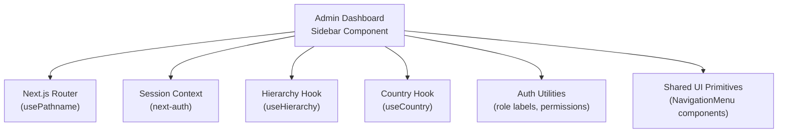
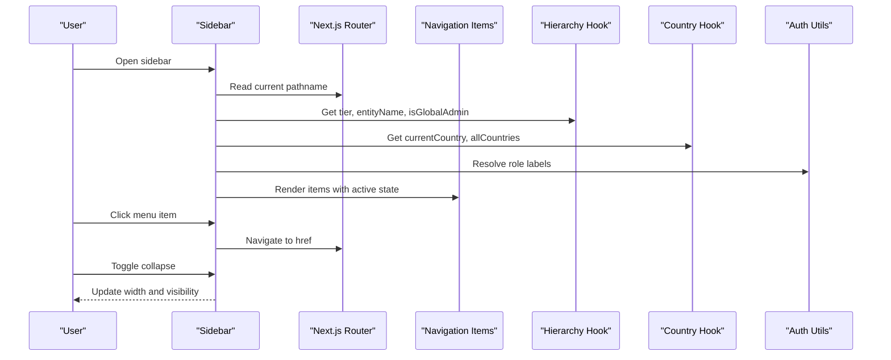
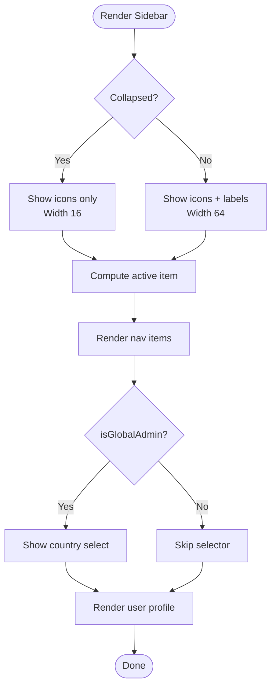
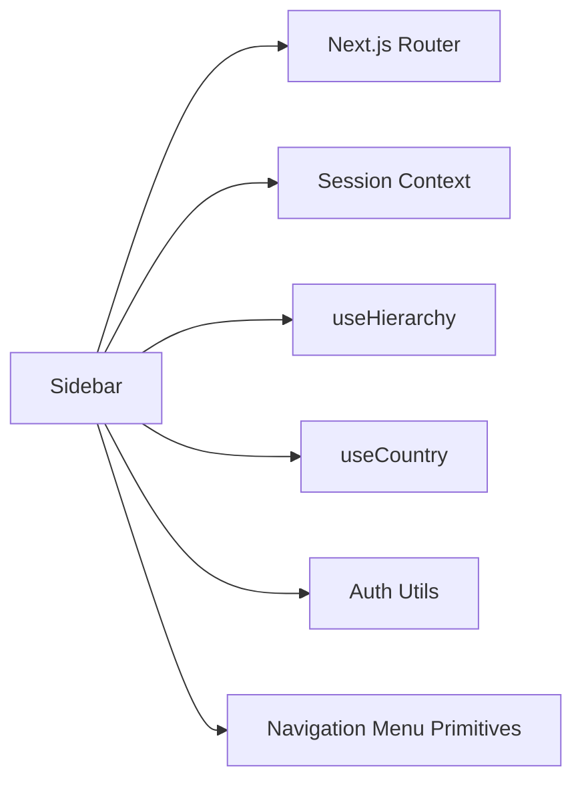

# Sidebar Navigation Component

<cite>
**Referenced Files in This Document**
- [sidebar.tsx](file://frontend/apps/admin-dashboard/src/components/layout/sidebar.tsx)
- [navigation-menu.tsx](file://frontend/packages/ui/src/components/navigation-menu.tsx)
- [auth.ts](file://frontend/apps/admin-dashboard/src/lib/auth.ts)
- [useHierarchy.ts](file://frontend/apps/admin-dashboard/src/hooks/useHierarchy.ts)
- [useCountry.tsx](file://frontend/apps/admin-dashboard/src/hooks/useCountry.tsx)
- [hierarchy.ts](file://frontend/apps/admin-dashboard/src/types/hierarchy.ts)
</cite>

## Table of Contents
1. [Introduction](#introduction)
2. [Project Structure](#project-structure)
3. [Core Components](#core-components)
4. [Architecture Overview](#architecture-overview)
5. [Detailed Component Analysis](#detailed-component-analysis)
6. [Dependency Analysis](#dependency-analysis)
7. [Performance Considerations](#performance-considerations)
8. [Troubleshooting Guide](#troubleshooting-guide)
9. [Conclusion](#conclusion)
10. [Appendices](#appendices)

## Introduction
This document explains the sidebar navigation component used in the admin dashboard. It covers:
- Collapsible menu structure and responsive behavior
- Role-based visibility for menu sections and features
- Active state management based on current route
- Keyboard accessibility considerations
- How to add new menu items, implement role-based access control, and customize appearance
- Examples for hierarchical menus, handling clicks, and integrating with routing

The implementation is a client-side React component that integrates with Next.js routing and session context to render a collapsible sidebar with contextual information (tier, country) and user profile.

## Project Structure
The sidebar lives under the admin dashboard app and uses shared UI primitives from the packages layer. Key files:
- Admin dashboard sidebar component
- Shared navigation menu primitives (Radix-based)
- Auth and hierarchy utilities for permissions and scope
- Hooks for federation tier and country context

**Diagram sources**
- [sidebar.tsx:1-203](file://frontend/apps/admin-dashboard/src/components/layout/sidebar.tsx#L1-L203)
- [navigation-menu.tsx:1-122](file://frontend/packages/ui/src/components/navigation-menu.tsx#L1-L122)
- [auth.ts:1-356](file://frontend/apps/admin-dashboard/src/lib/auth.ts#L1-L356)
- [useHierarchy.ts:1-160](file://frontend/apps/admin-dashboard/src/hooks/useHierarchy.ts#L1-L160)
- [useCountry.tsx:1-65](file://frontend/apps/admin-dashboard/src/hooks/useCountry.tsx#L1-L65)

**Section sources**
- [sidebar.tsx:1-203](file://frontend/apps/admin-dashboard/src/components/layout/sidebar.tsx#L1-L203)
- [navigation-menu.tsx:1-122](file://frontend/packages/ui/src/components/navigation-menu.tsx#L1-L122)
- [auth.ts:1-356](file://frontend/apps/admin-dashboard/src/lib/auth.ts#L1-L356)
- [useHierarchy.ts:1-160](file://frontend/apps/admin-dashboard/src/hooks/useHierarchy.ts#L1-L160)
- [useCountry.tsx:1-65](file://frontend/apps/admin-dashboard/src/hooks/useCountry.tsx#L1-L65)

## Core Components
- Sidebar: Renders a collapsible aside with logo, tier/country context, navigation list, country selector (for global admins), emergency stop button, and user profile.
- Navigation Menu Primitives: Radix-based accessible navigation menu components for dropdowns and nested menus (used elsewhere in the app).
- Hierarchy Hook: Derives user tier, entity info, breadcrumbs, and permission checks from session data.
- Country Hook: Provides country context and switching capability.
- Auth Utilities: Define roles, tiers, permissions, and helpers for mapping roles to tiers and checking permissions.

Key behaviors:
- Collapsible via local state; width transitions for compact vs expanded modes.
- Active link detection using pathname matching.
- Conditional rendering of country selector based on global admin status.
- User role label display via role mapping.

**Section sources**
- [sidebar.tsx:51-203](file://frontend/apps/admin-dashboard/src/components/layout/sidebar.tsx#L51-L203)
- [navigation-menu.tsx:9-121](file://frontend/packages/ui/src/components/navigation-menu.tsx#L9-L121)
- [useHierarchy.ts:33-159](file://frontend/apps/admin-dashboard/src/hooks/useHierarchy.ts#L33-L159)
- [useCountry.tsx:23-64](file://frontend/apps/admin-dashboard/src/hooks/useCountry.tsx#L23-L64)
- [auth.ts:218-356](file://frontend/apps/admin-dashboard/src/lib/auth.ts#L218-L356)

## Architecture Overview
The sidebar composes several concerns:
- Routing integration: Uses Next.js router to determine active links.
- Session and roles: Reads user session to derive role and visibility.
- Federation context: Uses hierarchy hook to show tier and build breadcrumbs.
- Country context: Allows global admins to switch country context.
- UI primitives: Uses shared UI components for consistent styling and accessibility.

**Diagram sources**
- [sidebar.tsx:51-138](file://frontend/apps/admin-dashboard/src/components/layout/sidebar.tsx#L51-L138)
- [useHierarchy.ts:33-159](file://frontend/apps/admin-dashboard/src/hooks/useHierarchy.ts#L33-L159)
- [useCountry.tsx:23-64](file://frontend/apps/admin-dashboard/src/hooks/useCountry.tsx#L23-L64)
- [auth.ts:218-356](file://frontend/apps/admin-dashboard/src/lib/auth.ts#L218-L356)

## Detailed Component Analysis

### Sidebar Component
Responsibilities:
- Manage collapsed state and responsive width
- Display tier and country context
- Render navigation items with active state
- Provide country selector for global admins
- Show emergency stop action
- Show user profile with role label

Implementation highlights:
- Collapsible state toggles width and content visibility
- Active link computed by comparing pathname with item href
- Country selector only visible when global admin flag is true
- Role label resolved via role mapping utility

**Diagram sources**
- [sidebar.tsx:51-203](file://frontend/apps/admin-dashboard/src/components/layout/sidebar.tsx#L51-L203)

**Section sources**
- [sidebar.tsx:51-203](file://frontend/apps/admin-dashboard/src/components/layout/sidebar.tsx#L51-L203)

### Navigation Menu Primitives
Purpose:
- Provide accessible, keyboard-friendly navigation menu components built on Radix primitives
- Support triggers, content, viewport, and indicators for dropdowns and nested menus

Usage:
- Reusable across apps for consistent navigation patterns
- Exposes components like NavigationMenu, NavigationMenuList, NavigationMenuItem, NavigationMenuTrigger, NavigationMenuContent, NavigationMenuViewport, NavigationMenuIndicator

**Section sources**
- [navigation-menu.tsx:9-121](file://frontend/packages/ui/src/components/navigation-menu.tsx#L9-L121)

### Hierarchy Hook
Responsibilities:
- Determine user’s federation tier from session role
- Derive entity ID, name, parent entity, and breadcrumbs
- Provide canAccess helper using auth utilities
- Generate scope filters for API calls based on tier

Behavior:
- Maps session role to tier
- Builds breadcrumb trail reflecting current scope
- Returns boolean flags for different admin levels

**Section sources**
- [useHierarchy.ts:33-159](file://frontend/apps/admin-dashboard/src/hooks/useHierarchy.ts#L33-L159)
- [auth.ts:218-356](file://frontend/apps/admin-dashboard/src/lib/auth.ts#L218-L356)

### Country Hook
Responsibilities:
- Maintain selected country code
- Provide current country object and full list
- Allow switching country context

Behavior:
- Defaults to null if no country selected
- Provides safe fallback when not wrapped in provider

**Section sources**
- [useCountry.tsx:23-64](file://frontend/apps/admin-dashboard/src/hooks/useCountry.tsx#L23-L64)

### Types and Permissions
- FederationTier defines the four-tier hierarchy
- EntityType enumerates resources for permissions
- Permission describes allowed actions per resource
- Role mappings and labels enable UI display and access checks

**Section sources**
- [hierarchy.ts:7-93](file://frontend/apps/admin-dashboard/src/types/hierarchy.ts#L7-L93)
- [auth.ts:240-356](file://frontend/apps/admin-dashboard/src/lib/auth.ts#L240-L356)

## Dependency Analysis
The sidebar depends on:
- Next.js router for active state
- next-auth session for user role and identity
- useHierarchy for tier and scope
- useCountry for country context
- Auth utilities for role labels and permissions
- Shared UI primitives for consistent navigation patterns

**Diagram sources**
- [sidebar.tsx:1-203](file://frontend/apps/admin-dashboard/src/components/layout/sidebar.tsx#L1-L203)
- [useHierarchy.ts:1-160](file://frontend/apps/admin-dashboard/src/hooks/useHierarchy.ts#L1-L160)
- [useCountry.tsx:1-65](file://frontend/apps/admin-dashboard/src/hooks/useCountry.tsx#L1-L65)
- [auth.ts:1-356](file://frontend/apps/admin-dashboard/src/lib/auth.ts#L1-L356)
- [navigation-menu.tsx:1-122](file://frontend/packages/ui/src/components/navigation-menu.tsx#L1-L122)

**Section sources**
- [sidebar.tsx:1-203](file://frontend/apps/admin-dashboard/src/components/layout/sidebar.tsx#L1-L203)
- [useHierarchy.ts:1-160](file://frontend/apps/admin-dashboard/src/hooks/useHierarchy.ts#L1-L160)
- [useCountry.tsx:1-65](file://frontend/apps/admin-dashboard/src/hooks/useCountry.tsx#L1-L65)
- [auth.ts:1-356](file://frontend/apps/admin-dashboard/src/lib/auth.ts#L1-L356)
- [navigation-menu.tsx:1-122](file://frontend/packages/ui/src/components/navigation-menu.tsx#L1-L122)

## Performance Considerations
- Collapsed state is local; minimal re-renders when toggling
- Active link computation is O(n) over menu items; acceptable for small lists
- Avoid heavy computations inside render; memoize derived values where possible
- Use shared UI primitives for consistent performance and accessibility

[No sources needed since this section provides general guidance]

## Troubleshooting Guide
Common issues and resolutions:
- Links not highlighting correctly: Ensure href matches route paths and pathname comparison logic is correct
- Country selector not visible: Verify isGlobalAdmin flag from hierarchy hook and session role mapping
- Role label missing: Confirm role exists in role mapping and session contains expected role field
- Accessibility problems: Ensure keyboard navigation works with provided primitives; test focus order and aria attributes

**Section sources**
- [sidebar.tsx:117-138](file://frontend/apps/admin-dashboard/src/components/layout/sidebar.tsx#L117-L138)
- [useHierarchy.ts:33-159](file://frontend/apps/admin-dashboard/src/hooks/useHierarchy.ts#L33-L159)
- [auth.ts:218-356](file://frontend/apps/admin-dashboard/src/lib/auth.ts#L218-L356)

## Conclusion
The sidebar component delivers a flexible, role-aware navigation experience with collapsible layout, active state management, and contextual controls. It integrates cleanly with Next.js routing, session context, and shared UI primitives. Extending it involves adding menu items, applying role-based visibility, and leveraging hooks for hierarchy and country context.

[No sources needed since this section summarizes without analyzing specific files]

## Appendices

### Adding New Menu Items
Steps:
- Add an entry to the navigation configuration array with name, href, and icon
- Optionally wrap items in nested structures using shared navigation primitives for dropdowns
- Ensure href matches application routes for active state detection

Examples:
- Simple top-level item: Add a new object with href and icon
- Nested submenu: Use NavigationMenuTrigger and NavigationMenuContent to group related items

**Section sources**
- [sidebar.tsx:42-49](file://frontend/apps/admin-dashboard/src/components/layout/sidebar.tsx#L42-L49)
- [navigation-menu.tsx:9-121](file://frontend/packages/ui/src/components/navigation-menu.tsx#L9-L121)

### Implementing Role-Based Access Control for Menu Sections
Approach:
- Use hierarchy hook to get tier and flags (e.g., isGlobalAdmin)
- Use auth utilities to check permissions for specific resources/actions
- Conditionally render menu items or sections based on permissions

Example pattern:
- Wrap sensitive items with a conditional that checks canAccess(resource, action)
- Hide entire sections based on tier flags

**Section sources**
- [useHierarchy.ts:119-159](file://frontend/apps/admin-dashboard/src/hooks/useHierarchy.ts#L119-L159)
- [auth.ts:240-356](file://frontend/apps/admin-dashboard/src/lib/auth.ts#L240-L356)

### Customizing Sidebar Appearance
Options:
- Adjust widths and spacing via className modifiers
- Change colors using theme tokens (background, foreground, accent)
- Modify icon sizes and typography for compact vs expanded states
- Replace or extend icons for better visual cues

Guidelines:
- Keep accessible contrast ratios
- Maintain consistent spacing and alignment
- Test both collapsed and expanded views

**Section sources**
- [sidebar.tsx:71-99](file://frontend/apps/admin-dashboard/src/components/layout/sidebar.tsx#L71-L99)

### Handling Menu Item Clicks and Routing Integration
Behavior:
- Each menu item is a Link to its href
- Active state determined by pathname comparison
- For programmatic navigation, use router methods if needed

Best practices:
- Ensure hrefs are stable and match defined routes
- Handle external links appropriately
- Preserve scroll position and focus management

**Section sources**
- [sidebar.tsx:117-138](file://frontend/apps/admin-dashboard/src/components/layout/sidebar.tsx#L117-L138)

### Keyboard Navigation and Accessibility
Recommendations:
- Rely on shared primitives for keyboard support (arrow keys, Enter, Escape)
- Ensure focus is visible and logical tab order
- Provide meaningful labels and titles for collapsed items

Notes:
- The sidebar uses native Link elements for basic keyboard support
- For complex dropdowns, use the provided navigation primitives which handle ARIA states

**Section sources**
- [navigation-menu.tsx:9-121](file://frontend/packages/ui/src/components/navigation-menu.tsx#L9-L121)