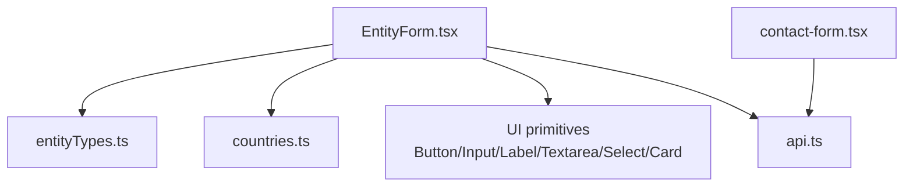
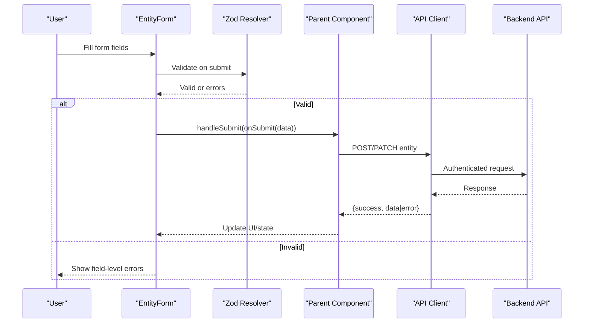
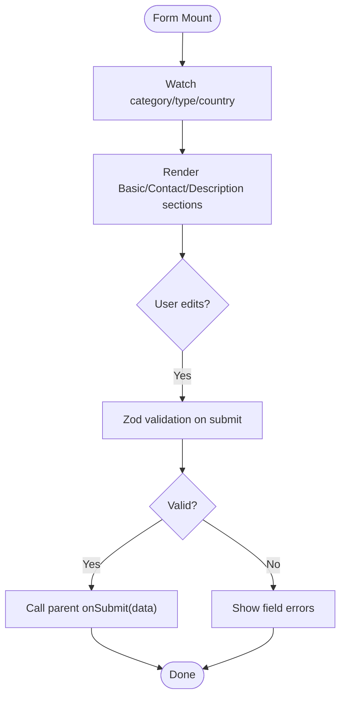
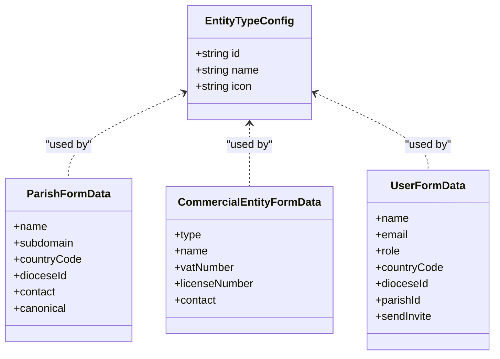
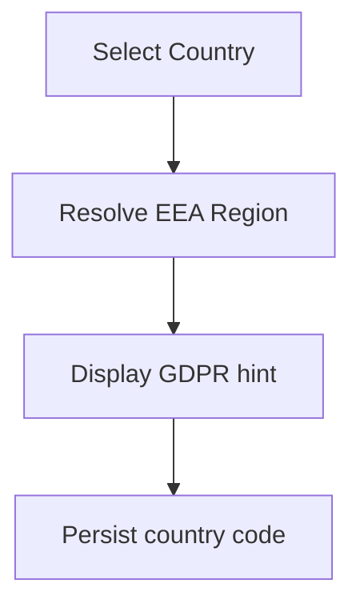
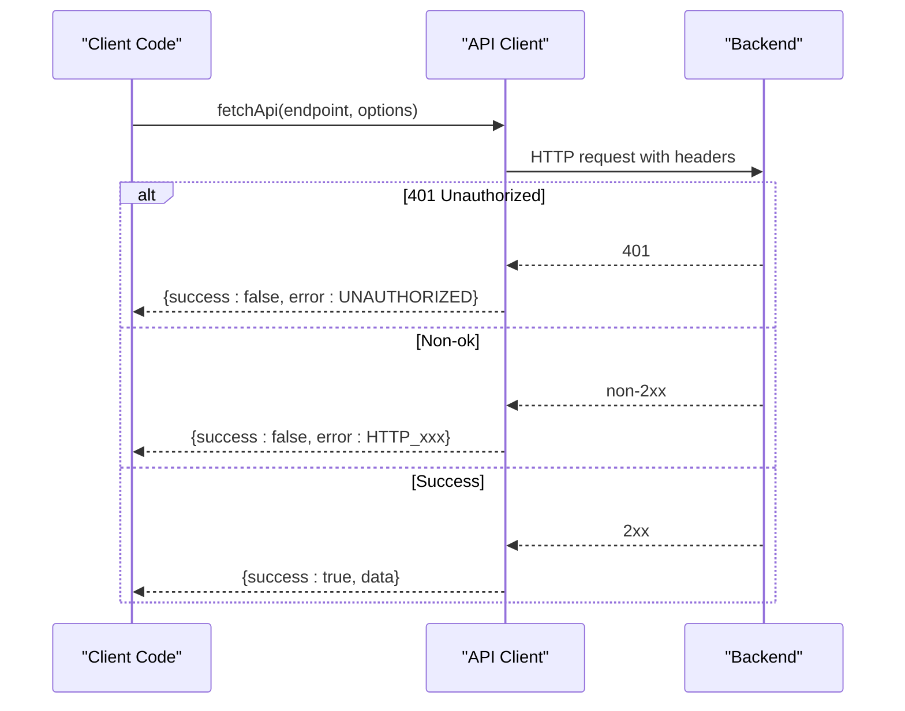
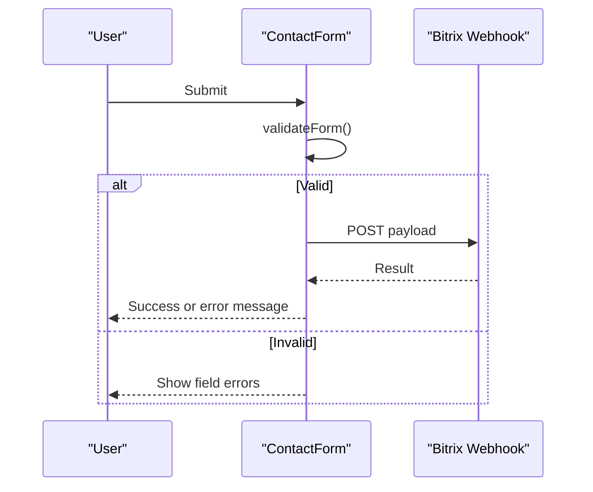
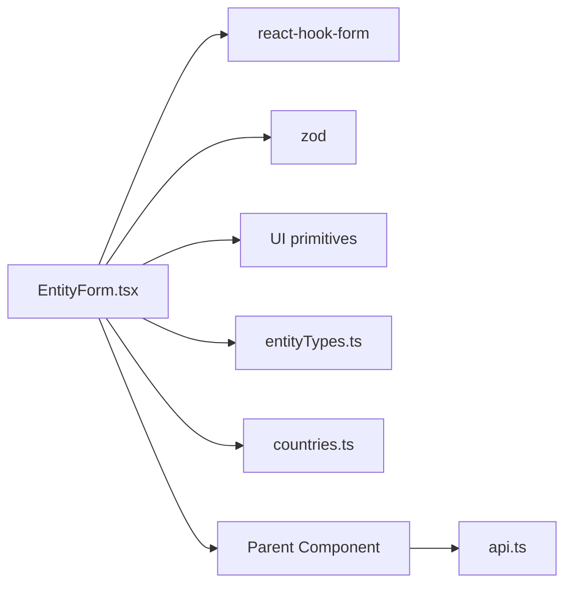

# Entity Form Component

<cite>
**Referenced Files in This Document**
- [EntityForm.tsx](file://frontend/apps/admin-dashboard/src/components/entities/EntityForm.tsx)
- [entityTypes.ts](file://frontend/apps/admin-dashboard/src/lib/entityTypes.ts)
- [countries.ts](file://frontend/apps/admin-dashboard/src/lib/countries.ts)
- [api.ts](file://frontend/apps/admin-dashboard/src/lib/api.ts)
- [contact-form.tsx](file://frontend/packages/ui/src/components/contact-form.tsx)
</cite>

## Table of Contents
1. Introduction
2. Project Structure
3. Core Components
4. Architecture Overview
5. Detailed Component Analysis
6. Dependency Analysis
7. Performance Considerations
8. Troubleshooting Guide
9. Conclusion
10. Appendices

## Introduction
This document provides comprehensive documentation for the EntityForm component used to create and edit platform entities with robust validation, conditional fields, and dependencies. It explains form schema definition, validation rules, error handling strategies, dynamic field rendering based on entity types, and integration patterns with backend APIs. It also covers accessibility considerations, keyboard navigation, and mobile responsiveness patterns observed in the codebase.

## Project Structure
The EntityForm is implemented as a client-side React component using react-hook-form and Zod for validation. It renders a multi-section form (Basic Information, Contact Information, Description) with conditional fields based on selected category and type. Supporting modules include:
- Entity type definitions and schemas
- Country configuration for GDPR data residency
- API client for authenticated requests and error handling
- A reusable contact form pattern demonstrating validation and submission flow

**Diagram sources**
- [EntityForm.tsx:1-344](file://frontend/apps/admin-dashboard/src/components/entities/EntityForm.tsx#L1-L344)
- [entityTypes.ts:1-123](file://frontend/apps/admin-dashboard/src/lib/entityTypes.ts#L1-L123)
- [countries.ts:1-387](file://frontend/apps/admin-dashboard/src/lib/countries.ts#L1-L387)
- [api.ts:1-534](file://frontend/apps/admin-dashboard/src/lib/api.ts#L1-L534)
- [contact-form.tsx:1-421](file://frontend/packages/ui/src/components/contact-form.tsx#L1-L421)

**Section sources**
- [EntityForm.tsx:1-344](file://frontend/apps/admin-dashboard/src/components/entities/EntityForm.tsx#L1-L344)
- [entityTypes.ts:1-123](file://frontend/apps/admin-dashboard/src/lib/entityTypes.ts#L1-L123)
- [countries.ts:1-387](file://frontend/apps/admin-dashboard/src/lib/countries.ts#L1-L387)
- [api.ts:1-534](file://frontend/apps/admin-dashboard/src/lib/api.ts#L1-L534)
- [contact-form.tsx:1-421](file://frontend/packages/ui/src/components/contact-form.tsx#L1-L421)

## Core Components
- EntityForm: Central form component for creating/editing entities with dynamic fields and validation.
- Entity Types and Schemas: Defines available entity types, statuses, categories, and Zod schemas for specific forms.
- Countries: Provides EU country metadata including EEA region and GDPR flags.
- API Client: Generic fetch wrapper with authentication, error normalization, and token management.
- ContactForm: Reusable example of validation, submission, and error handling patterns.

Key responsibilities:
- Schema-driven validation via Zod resolver
- Conditional field visibility based on category/type
- Accessible labels and error messaging
- Submission state handling and disabled states during loading

**Section sources**
- [EntityForm.tsx:29-98](file://frontend/apps/admin-dashboard/src/components/entities/EntityForm.tsx#L29-L98)
- [entityTypes.ts:11-123](file://frontend/apps/admin-dashboard/src/lib/entityTypes.ts#L11-L123)
- [countries.ts:8-22](file://frontend/apps/admin-dashboard/src/lib/countries.ts#L8-L22)
- [api.ts:54-128](file://frontend/apps/admin-dashboard/src/lib/api.ts#L54-L128)
- [contact-form.tsx:154-181](file://frontend/packages/ui/src/components/contact-form.tsx#L154-L181)

## Architecture Overview
The EntityForm orchestrates user input, validates it against a Zod schema, and delegates submission to an onSubmit handler provided by the parent. The API client encapsulates authentication and error handling. Country selection influences data residency hints and can drive downstream logic.

**Diagram sources**
- [EntityForm.tsx:71-98](file://frontend/apps/admin-dashboard/src/components/entities/EntityForm.tsx#L71-L98)
- [EntityForm.tsx:104-341](file://frontend/apps/admin-dashboard/src/components/entities/EntityForm.tsx#L104-L341)
- [api.ts:54-128](file://frontend/apps/admin-dashboard/src/lib/api.ts#L54-L128)

## Detailed Component Analysis

### EntityForm: Schema, Validation, and Dynamic Rendering
- Schema and validation:
  - Uses react-hook-form with zodResolver to enforce required fields and formats (email, URL).
  - Field-level errors are displayed inline beneath inputs.
- Dynamic fields:
  - Category-based visibility: Diocese shown for Catholic; VAT Number shown for Commercial.
  - Type selector driven by ENTITY_TYPES list.
  - Country selector uses EU_COUNTRIES with GDPR hint text.
- Accessibility:
  - Labels associated with inputs via htmlFor/id.
  - Error messages are placed near fields and styled for visibility.
- Mobile responsiveness:
  - Grid layouts adapt to md breakpoints for two-column sections.
- Submission UX:
  - Submit button disabled while loading or when no changes detected.
  - Loading spinner indicates ongoing submission.

**Diagram sources**
- [EntityForm.tsx:71-98](file://frontend/apps/admin-dashboard/src/components/entities/EntityForm.tsx#L71-L98)
- [EntityForm.tsx:104-341](file://frontend/apps/admin-dashboard/src/components/entities/EntityForm.tsx#L104-L341)

**Section sources**
- [EntityForm.tsx:29-98](file://frontend/apps/admin-dashboard/src/components/entities/EntityForm.tsx#L29-L98)
- [EntityForm.tsx:104-341](file://frontend/apps/admin-dashboard/src/components/entities/EntityForm.tsx#L104-L341)

### Entity Types and Schemas
- ENTITY_TYPES defines selectable entity options with icons and names.
- Statuses, categories, and color/label maps support consistent UI representation.
- Dedicated Zod schemas exist for parish, commercial entity, and user forms, enabling fine-grained validation per domain.

**Diagram sources**
- [entityTypes.ts:11-123](file://frontend/apps/admin-dashboard/src/lib/entityTypes.ts#L11-L123)

**Section sources**
- [entityTypes.ts:11-123](file://frontend/apps/admin-dashboard/src/lib/entityTypes.ts#L11-L123)

### Country Configuration and Data Residency
- EU_COUNTRIES includes metadata such as language, currency, EEA region, and GDPR implementation status.
- The form displays a GDPR note tied to the selected country, informing users about regional storage implications.

**Diagram sources**
- [countries.ts:8-22](file://frontend/apps/admin-dashboard/src/lib/countries.ts#L8-L22)
- [EntityForm.tsx:168-192](file://frontend/apps/admin-dashboard/src/components/entities/EntityForm.tsx#L168-L192)

**Section sources**
- [countries.ts:8-22](file://frontend/apps/admin-dashboard/src/lib/countries.ts#L8-L22)
- [EntityForm.tsx:168-192](file://frontend/apps/admin-dashboard/src/components/entities/EntityForm.tsx#L168-L192)

### API Integration and Error Handling
- The API client centralizes:
  - Base URL configuration
  - Authorization header injection
  - Token refresh and session expiry handling
  - Normalized response envelope with success/error
- Forms should use this client to ensure consistent error handling and auth flows.

**Diagram sources**
- [api.ts:54-128](file://frontend/apps/admin-dashboard/src/lib/api.ts#L54-L128)

**Section sources**
- [api.ts:54-128](file://frontend/apps/admin-dashboard/src/lib/api.ts#L54-L128)

### Contact Form Pattern (Validation and Submission)
- Demonstrates manual validation, error state management, and submission to an external CRM via webhook.
- Shows accessible patterns: aria attributes, role="alert", and descriptive error messages.

**Diagram sources**
- [contact-form.tsx:154-181](file://frontend/packages/ui/src/components/contact-form.tsx#L154-L181)
- [contact-form.tsx:196-226](file://frontend/packages/ui/src/components/contact-form.tsx#L196-L226)
- [contact-form.tsx:73-128](file://frontend/packages/ui/src/components/contact-form.tsx#L73-L128)

**Section sources**
- [contact-form.tsx:154-181](file://frontend/packages/ui/src/components/contact-form.tsx#L154-L181)
- [contact-form.tsx:196-226](file://frontend/packages/ui/src/components/contact-form.tsx#L196-L226)
- [contact-form.tsx:73-128](file://frontend/packages/ui/src/components/contact-form.tsx#L73-L128)

## Dependency Analysis
- EntityForm depends on:
  - react-hook-form and zodResolver for form state and validation
  - UI primitives for accessible, themed components
  - ENTITY_TYPES and EU_COUNTRIES for dynamic content
  - Parent-provided onSubmit/onCancel handlers for submission and cancellation
- API client abstracts network concerns and centralizes error handling.

**Diagram sources**
- [EntityForm.tsx:1-28](file://frontend/apps/admin-dashboard/src/components/entities/EntityForm.tsx#L1-L28)
- [entityTypes.ts:1-123](file://frontend/apps/admin-dashboard/src/lib/entityTypes.ts#L1-L123)
- [countries.ts:1-387](file://frontend/apps/admin-dashboard/src/lib/countries.ts#L1-L387)
- [api.ts:1-534](file://frontend/apps/admin-dashboard/src/lib/api.ts#L1-L534)

**Section sources**
- [EntityForm.tsx:1-28](file://frontend/apps/admin-dashboard/src/components/entities/EntityForm.tsx#L1-L28)
- [api.ts:1-534](file://frontend/apps/admin-dashboard/src/lib/api.ts#L1-L534)

## Performance Considerations
- Keep form schemas focused and minimal to reduce validation overhead.
- Use controlled selects with precomputed lists (ENTITY_TYPES, EU_COUNTRIES) to avoid re-renders.
- Debounce expensive operations if adding real-time validations that call APIs.
- Prefer server-side validation for complex business rules; use client-side for immediate feedback.

[No sources needed since this section provides general guidance]

## Troubleshooting Guide
Common issues and resolutions:
- Validation errors not clearing: Ensure onChange handlers clear previous errors or rely on form library behavior.
- Submit disabled unexpectedly: Check isDirty state and isLoading flags; ensure parent passes correct props.
- Network errors: Inspect normalized error responses from the API client; handle UNAUTHORIZED by redirecting to login.
- Missing environment variables: For integrations like CRM webhooks, verify configured URLs and secrets.

**Section sources**
- [api.ts:78-128](file://frontend/apps/admin-dashboard/src/lib/api.ts#L78-L128)
- [contact-form.tsx:196-226](file://frontend/packages/ui/src/components/contact-form.tsx#L196-L226)

## Conclusion
The EntityForm component provides a robust, accessible, and extensible foundation for managing platform entities. Its schema-driven validation, conditional fields, and integration-ready design make it suitable for complex workflows. By following the patterns outlined here—centralized API client, clear error handling, and accessible UI—you can extend the form to support additional entity types, file uploads, rich text editing, and multi-step processes while maintaining consistency and reliability.

[No sources needed since this section summarizes without analyzing specific files]

## Appendices

### Implementing Custom Validators
- Extend the existing Zod schema with custom checks for domain-specific rules.
- For cross-field validation, use Zod’s refine or superRefine to enforce dependencies between fields.
- Surface errors through the form’s error state to maintain consistent UX.

**Section sources**
- [EntityForm.tsx:34-48](file://frontend/apps/admin-dashboard/src/components/entities/EntityForm.tsx#L34-L48)
- [entityTypes.ts:62-123](file://frontend/apps/admin-dashboard/src/lib/entityTypes.ts#L62-L123)

### Handling File Uploads
- Add a file input bound to the form state and integrate with multipart/form-data when submitting.
- Validate file size, type, and count before upload.
- Provide progress indicators and clear error messages for failures.

[No sources needed since this section provides general guidance]

### Rich Text Editing
- Replace the description textarea with a rich text editor component.
- Sanitize output on the client and server to prevent XSS.
- Persist formatted content and provide fallback plain-text views.

[No sources needed since this section provides general guidance]

### Multi-Step Forms
- Split the form into steps using tabs or stepper UI.
- Maintain step state and validate each step before proceeding.
- Persist partial data to allow resuming later.

[No sources needed since this section provides general guidance]

### Backend Integration Patterns
- Use the API client to send create/update requests with proper authentication.
- Handle normalized responses and map them to UI states (loading, success, error).
- Implement retry logic for transient network errors where appropriate.

**Section sources**
- [api.ts:54-128](file://frontend/apps/admin-dashboard/src/lib/api.ts#L54-L128)

### Accessibility and Keyboard Navigation
- Ensure all inputs have associated labels and error descriptions.
- Use aria-invalid and aria-describedby to convey validation state.
- Maintain logical tab order and visible focus indicators.

**Section sources**
- [contact-form.tsx:271-416](file://frontend/packages/ui/src/components/contact-form.tsx#L271-L416)

### Mobile Responsiveness
- Leverage responsive grid utilities to stack fields on small screens.
- Ensure touch targets are adequately sized and spacing is comfortable.
- Test forms on various devices to confirm usability.

**Section sources**
- [EntityForm.tsx:232-289](file://frontend/apps/admin-dashboard/src/components/entities/EntityForm.tsx#L232-L289)