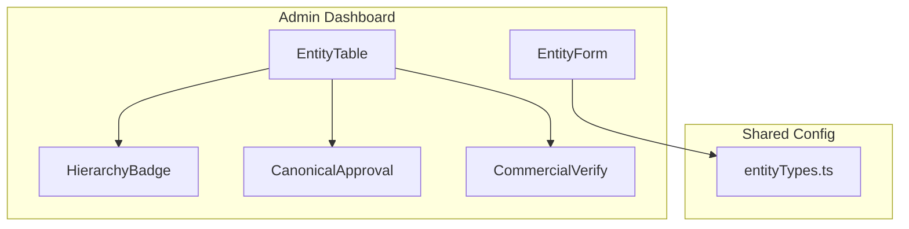
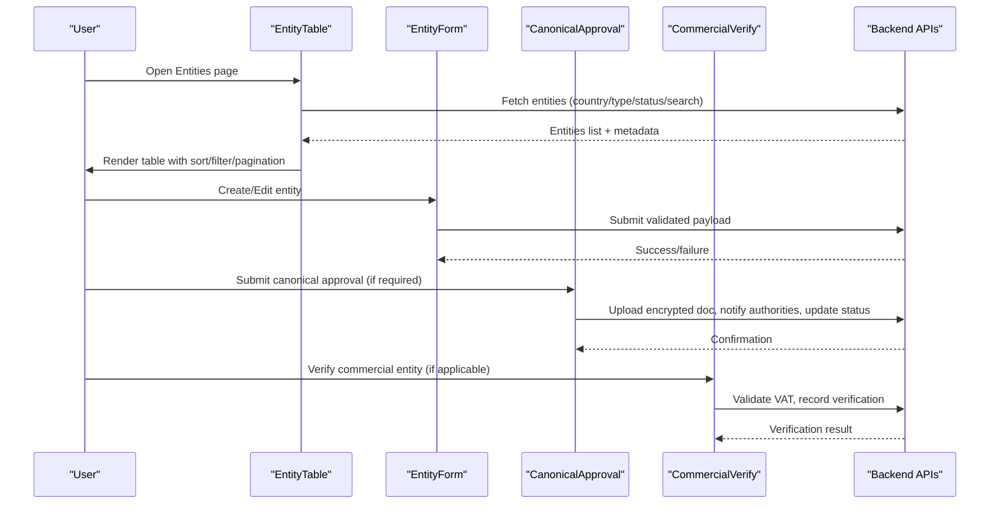
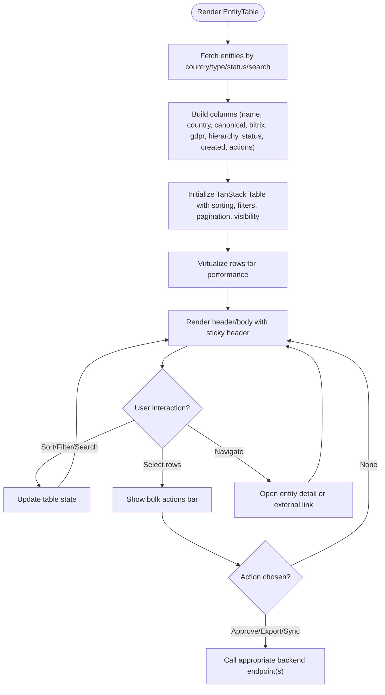
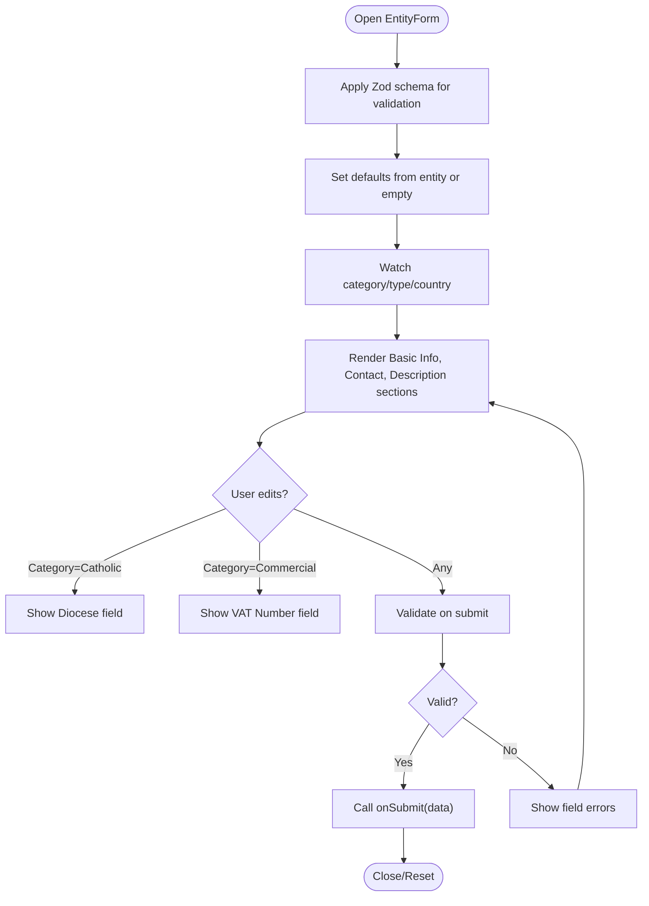
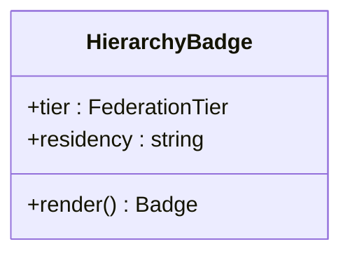
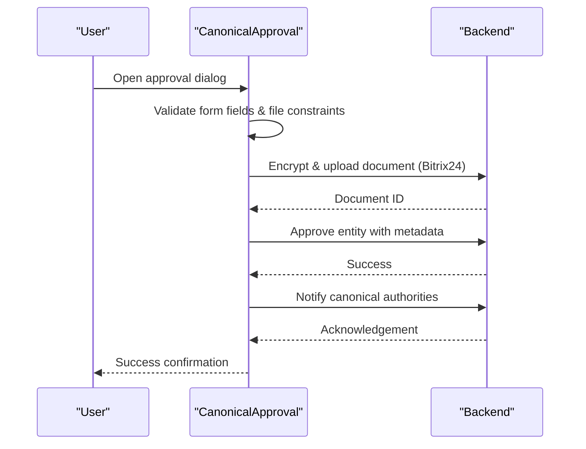
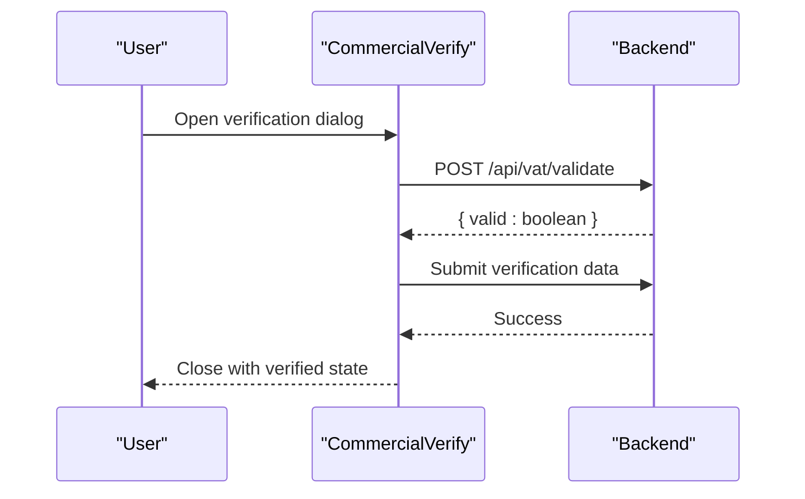
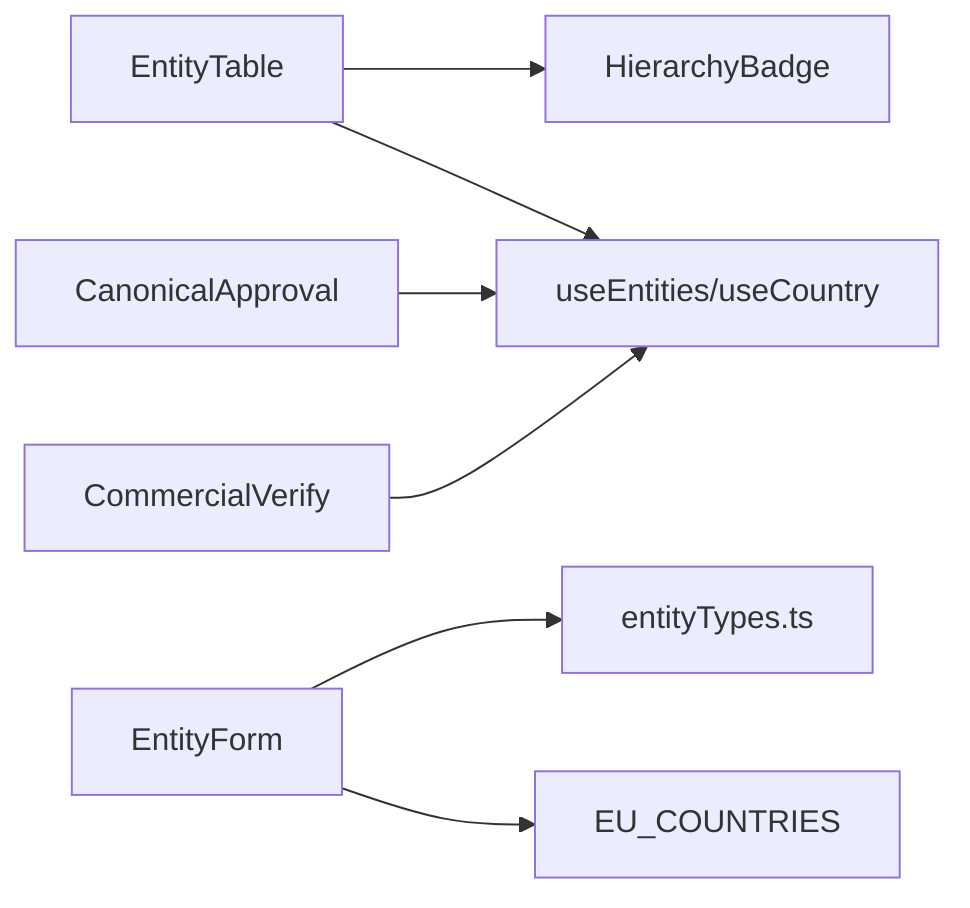

# Entity Management Interface

<cite>
**Referenced Files in This Document**
- [EntityTable.tsx](file://frontend/apps/admin-dashboard/src/components/entities/EntityTable.tsx)
- [EntityForm.tsx](file://frontend/apps/admin-dashboard/src/components/entities/EntityForm.tsx)
- [HierarchyBadge.tsx](file://frontend/apps/admin-dashboard/src/components/entities/HierarchyBadge.tsx)
- [CanonicalApproval.tsx](file://frontend/apps/admin-dashboard/src/components/entities/CanonicalApproval.tsx)
- [CommercialVerify.tsx](file://frontend/apps/admin-dashboard/src/components/entities/CommercialVerify.tsx)
- [entityTypes.ts](file://frontend/apps/admin-dashboard/src/lib/entityTypes.ts)
</cite>

## Table of Contents
1. [Introduction](#introduction)
2. [Project Structure](#project-structure)
3. [Core Components](#core-components)
4. [Architecture Overview](#architecture-overview)
5. [Detailed Component Analysis](#detailed-component-analysis)
6. [Dependency Analysis](#dependency-analysis)
7. [Performance Considerations](#performance-considerations)
8. [Troubleshooting Guide](#troubleshooting-guide)
9. [Conclusion](#conclusion)
10. [Appendices](#appendices)

## Introduction
This document explains the entity management interface used to create, edit, and organize platform entities across countries and categories. It focuses on:
- EntityTable for listing, sorting, filtering, pagination, and bulk operations
- EntityForm for data entry with validation rules and field dependencies
- HierarchyBadge and hierarchy visualization for federation tiers
- Canonical approval workflow for Catholic entities
- Commercial verification workflow for business entities
- Extensibility patterns for adding new entity types, customizing forms, implementing bulk operations, and handling relationships

## Project Structure
The entity management UI is implemented in the admin dashboard under a dedicated components directory. Supporting configuration for entity types lives in a shared library file. Related workflows (canonical approval and commercial verification) are provided as dialog-based components that integrate with the table and form flows.

**Diagram sources**
- [EntityTable.tsx:121-378](file://frontend/apps/admin-dashboard/src/components/entities/EntityTable.tsx#L121-L378)
- [EntityForm.tsx:34-101](file://frontend/apps/admin-dashboard/src/components/entities/EntityForm.tsx#L34-L101)
- [HierarchyBadge.tsx:17-33](file://frontend/apps/admin-dashboard/src/components/entities/HierarchyBadge.tsx#L17-L33)
- [CanonicalApproval.tsx:92-113](file://frontend/apps/admin-dashboard/src/components/entities/CanonicalApproval.tsx#L92-L113)
- [CommercialVerify.tsx:51-69](file://frontend/apps/admin-dashboard/src/components/entities/CommercialVerify.tsx#L51-L69)
- [entityTypes.ts:1-200](file://frontend/apps/admin-dashboard/src/lib/entityTypes.ts#L1-L200)

**Section sources**
- [EntityTable.tsx:121-378](file://frontend/apps/admin-dashboard/src/components/entities/EntityTable.tsx#L121-L378)
- [EntityForm.tsx:34-101](file://frontend/apps/admin-dashboard/src/components/entities/EntityForm.tsx#L34-L101)
- [HierarchyBadge.tsx:17-33](file://frontend/apps/admin-dashboard/src/components/entities/HierarchyBadge.tsx#L17-L33)
- [CanonicalApproval.tsx:92-113](file://frontend/apps/admin-dashboard/src/components/entities/CanonicalApproval.tsx#L92-L113)
- [CommercialVerify.tsx:51-69](file://frontend/apps/admin-dashboard/src/components/entities/CommercialVerify.tsx#L51-L69)
- [entityTypes.ts:1-200](file://frontend/apps/admin-dashboard/src/lib/entityTypes.ts#L1-L200)

## Core Components
- EntityTable: A virtualized, sortable, filterable, paginated table with column visibility toggling, global search, row selection, and bulk actions. It integrates with hooks to fetch country-scoped entities and renders hierarchy badges per row.
- EntityForm: A dynamic form with Zod validation, conditional fields by category/type, and GDPR residency selection. It supports creating and updating entities.
- HierarchyBadge: Displays federation tier (global/country/diocese/parish) with an icon and residency code.
- CanonicalApproval: Dialog-driven workflow to submit canonical approval documents, notify authorities, and update entity status.
- CommercialVerify: Dialog-driven workflow to validate VAT numbers and verify commercial entities.

**Section sources**
- [EntityTable.tsx:121-378](file://frontend/apps/admin-dashboard/src/components/entities/EntityTable.tsx#L121-L378)
- [EntityForm.tsx:34-101](file://frontend/apps/admin-dashboard/src/components/entities/EntityForm.tsx#L34-L101)
- [HierarchyBadge.tsx:17-33](file://frontend/apps/admin-dashboard/src/components/entities/HierarchyBadge.tsx#L17-L33)
- [CanonicalApproval.tsx:92-113](file://frontend/apps/admin-dashboard/src/components/entities/CanonicalApproval.tsx#L92-L113)
- [CommercialVerify.tsx:51-69](file://frontend/apps/admin-dashboard/src/components/entities/CommercialVerify.tsx#L51-L69)

## Architecture Overview
The interface composes several React components to deliver a complete entity lifecycle:
- Data fetching and state are handled via hooks; the table uses TanStack Table for sorting/filtering/pagination and TanStack Virtual for performance at scale.
- Forms use React Hook Form with Zod schemas for robust validation and type safety.
- Workflows like canonical approval and commercial verification are encapsulated in dialogs and call backend endpoints to persist changes and trigger notifications.

**Diagram sources**
- [EntityTable.tsx:143-151](file://frontend/apps/admin-dashboard/src/components/entities/EntityTable.tsx#L143-L151)
- [EntityForm.tsx:71-94](file://frontend/apps/admin-dashboard/src/components/entities/EntityForm.tsx#L71-L94)
- [CanonicalApproval.tsx:150-246](file://frontend/apps/admin-dashboard/src/components/entities/CanonicalApproval.tsx#L150-L246)
- [CommercialVerify.tsx:92-128](file://frontend/apps/admin-dashboard/src/components/entities/CommercialVerify.tsx#L92-L128)

## Detailed Component Analysis

### EntityTable
Responsibilities:
- Fetches entities scoped by country, type, status, and search query using hooks.
- Provides sorting, column filters, global search, pagination, and column visibility toggle.
- Renders hierarchy information via HierarchyBadge.
- Supports row selection and exposes bulk action placeholders (approve/export/sync).
- Uses TanStack Table and TanStack Virtual to efficiently render large datasets.

Key behaviors:
- Sorting: Columns such as name and created date support ascending/descending toggles.
- Filtering: Column-level filters for status and canonical status; global text search.
- Pagination: Configurable page size with navigation controls.
- Bulk operations: Selection state drives a toolbar with actions; integration points exist for approve/export/sync.
- Performance: Virtualization renders only visible rows plus overscan to maintain smooth scrolling.

**Diagram sources**
- [EntityTable.tsx:157-348](file://frontend/apps/admin-dashboard/src/components/entities/EntityTable.tsx#L157-L348)
- [EntityTable.tsx:354-378](file://frontend/apps/admin-dashboard/src/components/entities/EntityTable.tsx#L354-L378)
- [EntityTable.tsx:389-396](file://frontend/apps/admin-dashboard/src/components/entities/EntityTable.tsx#L389-L396)
- [EntityTable.tsx:512-526](file://frontend/apps/admin-dashboard/src/components/entities/EntityTable.tsx#L512-L526)

**Section sources**
- [EntityTable.tsx:121-378](file://frontend/apps/admin-dashboard/src/components/entities/EntityTable.tsx#L121-L378)
- [EntityTable.tsx:389-396](file://frontend/apps/admin-dashboard/src/components/entities/EntityTable.tsx#L389-L396)
- [EntityTable.tsx:452-648](file://frontend/apps/admin-dashboard/src/components/entities/EntityTable.tsx#L452-L648)

### EntityForm
Responsibilities:
- Collects entity data with strong validation via Zod.
- Presents category-driven fields: diocese for Catholic entities, VAT number for commercial entities.
- Enforces GDPR residency by requiring a country selection.
- Supports both create and update modes with default values from an existing entity.

Validation highlights:
- Required fields: name, type, category, country.
- Optional fields: email, phone, address, city, postalCode, website, description, diocese, vatNumber.
- Conditional rendering based on selected category and type.

**Diagram sources**
- [EntityForm.tsx:34-48](file://frontend/apps/admin-dashboard/src/components/entities/EntityForm.tsx#L34-L48)
- [EntityForm.tsx:71-101](file://frontend/apps/admin-dashboard/src/components/entities/EntityForm.tsx#L71-L101)
- [EntityForm.tsx:194-219](file://frontend/apps/admin-dashboard/src/components/entities/EntityForm.tsx#L194-L219)

**Section sources**
- [EntityForm.tsx:34-101](file://frontend/apps/admin-dashboard/src/components/entities/EntityForm.tsx#L34-L101)
- [EntityForm.tsx:103-343](file://frontend/apps/admin-dashboard/src/components/entities/EntityForm.tsx#L103-L343)

### HierarchyBadge
Responsibilities:
- Visualizes the federation tier and residency code for an entity.
- Maps each tier to an icon and color-coded badge.

Usage:
- Rendered within the table’s hierarchy column to quickly communicate organizational context.

**Diagram sources**
- [HierarchyBadge.tsx:17-33](file://frontend/apps/admin-dashboard/src/components/entities/HierarchyBadge.tsx#L17-L33)

**Section sources**
- [HierarchyBadge.tsx:17-33](file://frontend/apps/admin-dashboard/src/components/entities/HierarchyBadge.tsx#L17-L33)

### CanonicalApproval
Responsibilities:
- Guides users through a multi-step approval process for Catholic entities.
- Validates bishop details, diocese, dates, and optional decree/recognitio numbers.
- Handles file upload with encryption notice and uploads to Bitrix24.
- Notifies canonical authorities and updates entity status upon success.

Workflow:
- Verify checklist -> Upload document -> Confirm submission -> Notify authorities -> Update status.

**Diagram sources**
- [CanonicalApproval.tsx:150-246](file://frontend/apps/admin-dashboard/src/components/entities/CanonicalApproval.tsx#L150-L246)
- [CanonicalApproval.tsx:252-319](file://frontend/apps/admin-dashboard/src/components/entities/CanonicalApproval.tsx#L252-L319)

**Section sources**
- [CanonicalApproval.tsx:92-113](file://frontend/apps/admin-dashboard/src/components/entities/CanonicalApproval.tsx#L92-L113)
- [CanonicalApproval.tsx:150-246](file://frontend/apps/admin-dashboard/src/components/entities/CanonicalApproval.tsx#L150-L246)
- [CanonicalApproval.tsx:252-319](file://frontend/apps/admin-dashboard/src/components/entities/CanonicalApproval.tsx#L252-L319)

### CommercialVerify
Responsibilities:
- Validates VAT numbers against backend services and records verification results.
- Captures company details, registration numbers, and notes.
- Integrates with external VAT validation resources.

Workflow:
- Enter VAT and country -> Validate via API -> Record verification -> Close dialog.

**Diagram sources**
- [CommercialVerify.tsx:92-128](file://frontend/apps/admin-dashboard/src/components/entities/CommercialVerify.tsx#L92-L128)

**Section sources**
- [CommercialVerify.tsx:51-69](file://frontend/apps/admin-dashboard/src/components/entities/CommercialVerify.tsx#L51-L69)
- [CommercialVerify.tsx:92-128](file://frontend/apps/admin-dashboard/src/components/entities/CommercialVerify.tsx#L92-L128)

## Dependency Analysis
- EntityTable depends on:
  - Hooks for data fetching and country context
  - TanStack Table utilities for sorting, filtering, pagination
  - TanStack Virtual for efficient rendering
  - HierarchyBadge for hierarchy display
  - UI primitives (table, button, badge, input, select, dropdown, checkbox)
- EntityForm depends on:
  - React Hook Form and Zod resolver
  - Shared entity types configuration
  - Country list for GDPR residency selection
- CanonicalApproval and CommercialVerify depend on:
  - Hooks for entity retrieval and mutation
  - Backend endpoints for document upload, notifications, and verification

**Diagram sources**
- [EntityTable.tsx:61-64](file://frontend/apps/admin-dashboard/src/components/entities/EntityTable.tsx#L61-L64)
- [EntityForm.tsx:24-27](file://frontend/apps/admin-dashboard/src/components/entities/EntityForm.tsx#L24-L27)
- [CanonicalApproval.tsx:33-34](file://frontend/apps/admin-dashboard/src/components/entities/CanonicalApproval.tsx#L33-L34)
- [CommercialVerify.tsx:27-28](file://frontend/apps/admin-dashboard/src/components/entities/CommercialVerify.tsx#L27-L28)

**Section sources**
- [EntityTable.tsx:61-64](file://frontend/apps/admin-dashboard/src/components/entities/EntityTable.tsx#L61-L64)
- [EntityForm.tsx:24-27](file://frontend/apps/admin-dashboard/src/components/entities/EntityForm.tsx#L24-L27)
- [CanonicalApproval.tsx:33-34](file://frontend/apps/admin-dashboard/src/components/entities/CanonicalApproval.tsx#L33-L34)
- [CommercialVerify.tsx:27-28](file://frontend/apps/admin-dashboard/src/components/entities/CommercialVerify.tsx#L27-L28)

## Performance Considerations
- Virtualization: The table uses virtualization to render only visible rows plus overscan, enabling smooth scrolling with thousands of rows.
- Stable column definitions: Columns are memoized to avoid unnecessary re-renders.
- Efficient state updates: Sorting, filtering, and pagination are managed by TanStack Table, minimizing manual DOM manipulation.
- Selective rendering: Only necessary columns are rendered; hidden columns reduce layout work.

[No sources needed since this section provides general guidance]

## Troubleshooting Guide
Common issues and resolutions:
- No entities displayed:
  - Check country filter and context; ensure the correct country is selected.
  - Verify network requests for entity fetching and inspect error states.
- Sorting not working:
  - Ensure column headers are interactive and sorting state is bound to table instance.
- Filters not applied:
  - Confirm column filter functions are set and global filter input is bound to table state.
- Pagination glitches:
  - Verify total count vs. data length; ensure pageSize changes propagate correctly.
- Form validation errors:
  - Review Zod schema messages; confirm required fields are filled and formats are correct.
- Canonical approval failures:
  - Check file size and type constraints; ensure encryption/upload steps complete before submission.
- Commercial verification failures:
  - Validate VAT number format and country; check backend response for validity.

**Section sources**
- [EntityTable.tsx:424-446](file://frontend/apps/admin-dashboard/src/components/entities/EntityTable.tsx#L424-L446)
- [EntityForm.tsx:71-94](file://frontend/apps/admin-dashboard/src/components/entities/EntityForm.tsx#L71-L94)
- [CanonicalApproval.tsx:321-347](file://frontend/apps/admin-dashboard/src/components/entities/CanonicalApproval.tsx#L321-L347)
- [CommercialVerify.tsx:130-134](file://frontend/apps/admin-dashboard/src/components/entities/CommercialVerify.tsx#L130-L134)

## Conclusion
The entity management interface provides a robust, scalable foundation for managing platform entities across jurisdictions and categories. The combination of a high-performance table, a strongly validated form, and specialized workflows ensures compliance and operational efficiency. Extensibility is supported through configurable entity types, conditional fields, and modular dialogs for domain-specific processes.

[No sources needed since this section summarizes without analyzing specific files]

## Appendices

### Adding a New Entity Type
Steps:
- Define the new type in the shared entity types configuration.
- Add any additional fields to the form schema if required.
- Update conditional logic in the form to show/hide fields based on the new type.
- Optionally add new columns or filters to the table to expose relevant attributes.

**Section sources**
- [entityTypes.ts:1-200](file://frontend/apps/admin-dashboard/src/lib/entityTypes.ts#L1-L200)
- [EntityForm.tsx:34-48](file://frontend/apps/admin-dashboard/src/components/entities/EntityForm.tsx#L34-L48)
- [EntityForm.tsx:194-219](file://frontend/apps/admin-dashboard/src/components/entities/EntityForm.tsx#L194-L219)

### Customizing Forms
Recommendations:
- Use Zod schemas to enforce validation rules consistently.
- Leverage React Hook Form for controlled inputs and efficient re-renders.
- Implement conditional fields based on category/type selections.
- Provide clear error messages and inline validation feedback.

**Section sources**
- [EntityForm.tsx:34-48](file://frontend/apps/admin-dashboard/src/components/entities/EntityForm.tsx#L34-L48)
- [EntityForm.tsx:71-94](file://frontend/apps/admin-dashboard/src/components/entities/EntityForm.tsx#L71-L94)

### Implementing Bulk Operations
Guidance:
- Use row selection state to track selected entities.
- Expose bulk actions in a toolbar when selections exist.
- Map actions to backend endpoints (e.g., approve/export/sync).
- Provide user feedback during asynchronous operations.

**Section sources**
- [EntityTable.tsx:136-140](file://frontend/apps/admin-dashboard/src/components/entities/EntityTable.tsx#L136-L140)
- [EntityTable.tsx:512-526](file://frontend/apps/admin-dashboard/src/components/entities/EntityTable.tsx#L512-L526)

### Handling Entity Relationships
Approach:
- Represent hierarchy via a structured object with tier and parent references.
- Display hierarchy context using HierarchyBadge in the table.
- For tree-like structures, consider expanding parent-child views or drill-down pages.
- Ensure CRUD operations respect hierarchical constraints (e.g., parent must exist).

**Section sources**
- [EntityTable.tsx:78-90](file://frontend/apps/admin-dashboard/src/components/entities/EntityTable.tsx#L78-L90)
- [EntityTable.tsx:277-286](file://frontend/apps/admin-dashboard/src/components/entities/EntityTable.tsx#L277-L286)
- [HierarchyBadge.tsx:17-33](file://frontend/apps/admin-dashboard/src/components/entities/HierarchyBadge.tsx#L17-L33)