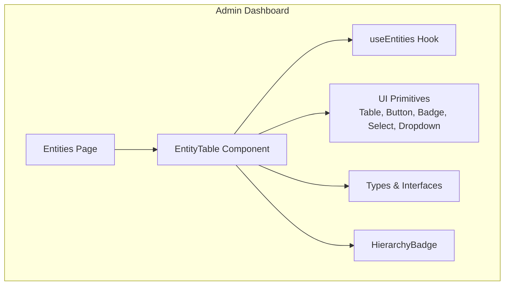
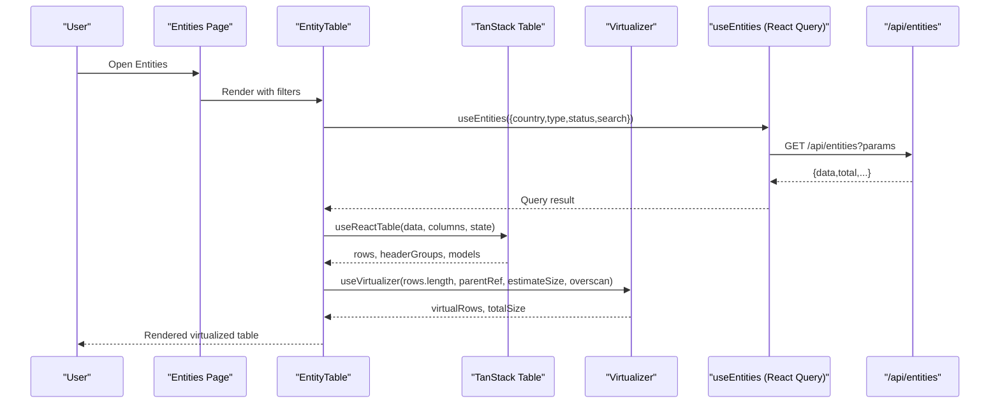
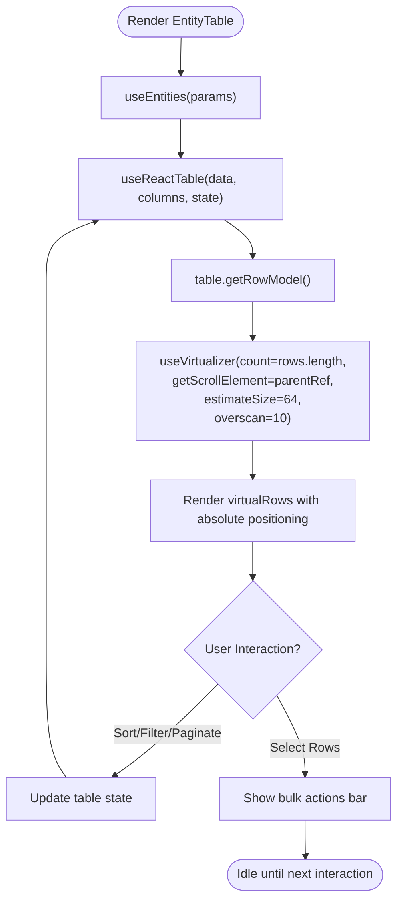
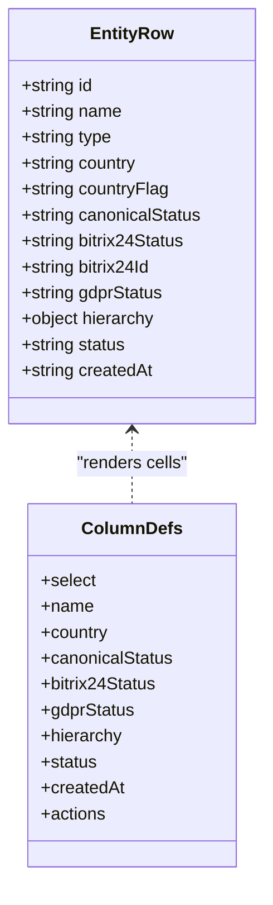
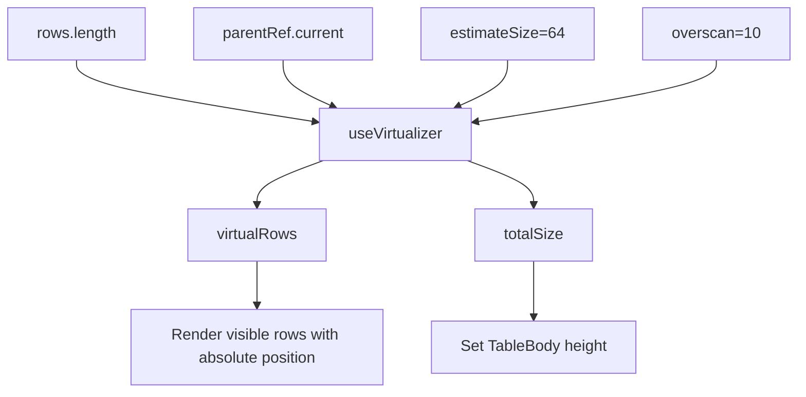
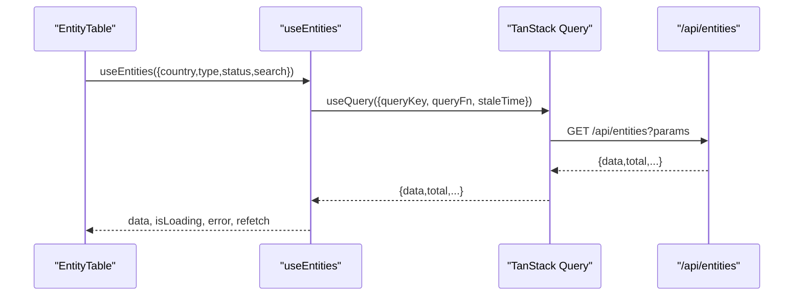
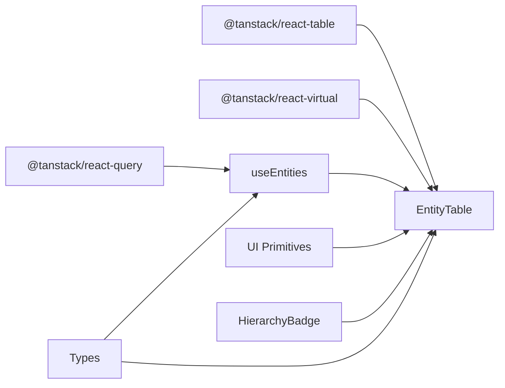

# Entity Table Component

<cite>
**Referenced Files in This Document**
- [EntityTable.tsx](file://frontend/apps/admin-dashboard/src/components/entities/EntityTable.tsx)
- [useEntities.ts](file://frontend/apps/admin-dashboard/src/lib/hooks/useEntities.ts)
- [HierarchyBadge.tsx](file://frontend/apps/admin-dashboard/src/components/entities/HierarchyBadge.tsx)
- [entities page (usage)](file://frontend/apps/admin-dashboard/src/app/(dashboard)/entities/page.tsx)
- [types/index.ts](file://frontend/apps/admin-dashboard/src/types/index.ts)
- [breakpoints.ts](file://frontend/packages/ui/src/tokens/breakpoints.ts)
</cite>

## Table of Contents
1. [Introduction](#introduction)
2. [Project Structure](#project-structure)
3. [Core Components](#core-components)
4. [Architecture Overview](#architecture-overview)
5. [Detailed Component Analysis](#detailed-component-analysis)
6. [Dependency Analysis](#dependency-analysis)
7. [Performance Considerations](#performance-considerations)
8. [Troubleshooting Guide](#troubleshooting-guide)
9. [Conclusion](#conclusion)
10. [Appendices](#appendices)

## Introduction
This document provides comprehensive documentation for the EntityTable component, a virtualized, high-performance table designed to manage platform entities at scale. It integrates TanStack Table for sorting, filtering, pagination, and column visibility controls, and uses @tanstack/react-virtual to efficiently render 10,000+ rows by only rendering visible rows plus a small overscan buffer. The table exposes columns for entity name, country (GDPR residency), canonical status, Bitrix24 sync status, GDPR compliance status, hierarchy information, and actions. It also demonstrates row selection, bulk operations UI, responsive design patterns, and integration with the useEntities hook for data fetching and state management.

## Project Structure
The EntityTable lives within the admin dashboard application and is composed of:
- A React component that wires up TanStack Table and TanStack Virtual
- A custom hook for data fetching via TanStack Query
- Supporting UI components (table primitives, badges, buttons, dropdowns)
- Types defining entities, responses, and hierarchy context

**Diagram sources**
- [entities page (usage):118-156](file://frontend/apps/admin-dashboard/src/app/(dashboard)/entities/page.tsx#L118-L156)
- [EntityTable.tsx:1-650](file://frontend/apps/admin-dashboard/src/components/entities/EntityTable.tsx#L1-L650)
- [useEntities.ts:1-108](file://frontend/apps/admin-dashboard/src/lib/hooks/useEntities.ts#L1-L108)
- [HierarchyBadge.tsx:1-34](file://frontend/apps/admin-dashboard/src/components/entities/HierarchyBadge.tsx#L1-L34)
- [types/index.ts:22-37](file://frontend/apps/admin-dashboard/src/types/index.ts#L22-L37)

**Section sources**
- [EntityTable.tsx:1-650](file://frontend/apps/admin-dashboard/src/components/entities/EntityTable.tsx#L1-L650)
- [useEntities.ts:1-108](file://frontend/apps/admin-dashboard/src/lib/hooks/useEntities.ts#L1-L108)
- [entities page (usage):118-156](file://frontend/apps/admin-dashboard/src/app/(dashboard)/entities/page.tsx#L118-L156)
- [HierarchyBadge.tsx:1-34](file://frontend/apps/admin-dashboard/src/components/entities/HierarchyBadge.tsx#L1-L34)
- [types/index.ts:22-37](file://frontend/apps/admin-dashboard/src/types/index.ts#L22-L37)

## Core Components
- EntityTable: A client-side React component implementing a virtualized table with TanStack Table features and @tanstack/react-virtual for performance.
- useEntities: A TanStack Query-based hook that fetches paginated entity lists and mutations for approval/verification, invalidating queries on success.
- HierarchyBadge: Displays federation tier and residency as a compact badge.

Key responsibilities:
- Data binding and state synchronization between TanStack Table and React state
- Virtualization configuration for large datasets
- Column definitions with sorting, filtering, and visibility toggles
- Row selection and bulk action UI scaffolding
- Responsive layout using Tailwind utility classes

**Section sources**
- [EntityTable.tsx:157-348](file://frontend/apps/admin-dashboard/src/components/entities/EntityTable.tsx#L157-L348)
- [EntityTable.tsx:354-397](file://frontend/apps/admin-dashboard/src/components/entities/EntityTable.tsx#L354-L397)
- [useEntities.ts:12-27](file://frontend/apps/admin-dashboard/src/lib/hooks/useEntities.ts#L12-L27)
- [HierarchyBadge.tsx:12-34](file://frontend/apps/admin-dashboard/src/components/entities/HierarchyBadge.tsx#L12-L34)

## Architecture Overview
The EntityTable orchestrates data fetching, table state, and rendering through a clear separation of concerns:
- Data layer: useEntities uses TanStack Query to fetch entities with query parameters (country, type, status, search).
- State layer: TanStack Table manages sorting, filtering, pagination, column visibility, and row selection.
- Rendering layer: @tanstack/react-virtual renders only visible rows with an overscan buffer inside a scrollable container.

**Diagram sources**
- [EntityTable.tsx:142-151](file://frontend/apps/admin-dashboard/src/components/entities/EntityTable.tsx#L142-L151)
- [EntityTable.tsx:354-397](file://frontend/apps/admin-dashboard/src/components/entities/EntityTable.tsx#L354-L397)
- [useEntities.ts:12-27](file://frontend/apps/admin-dashboard/src/lib/hooks/useEntities.ts#L12-L27)

## Detailed Component Analysis

### EntityTable: Virtualized Table with TanStack Table
- Integrates TanStack Table features:
  - Sorting: Columns like name and createdAt support ascending/descending toggles.
  - Filtering: Global filter input and per-column filters (e.g., canonicalStatus, status).
  - Pagination: Configurable page size and navigation controls.
  - Column visibility: Dropdown menu to toggle column visibility.
  - Row selection: Checkbox column and “select all” control; selected count drives bulk actions UI.
- Virtualization:
  - Uses @tanstack/react-virtual’s useVirtualizer with a fixed row height estimate and overscan to render only visible rows plus a buffer.
  - Renders rows absolutely positioned within a relative container sized to total virtual height.
- Data integration:
  - Binds to useEntities for data fetching with query parameters derived from current country context and user filters.
  - Exposes totalCount for accurate pagination metadata.

**Diagram sources**
- [EntityTable.tsx:142-151](file://frontend/apps/admin-dashboard/src/components/entities/EntityTable.tsx#L142-L151)
- [EntityTable.tsx:354-397](file://frontend/apps/admin-dashboard/src/components/entities/EntityTable.tsx#L354-L397)
- [EntityTable.tsx:528-585](file://frontend/apps/admin-dashboard/src/components/entities/EntityTable.tsx#L528-L585)

**Section sources**
- [EntityTable.tsx:157-348](file://frontend/apps/admin-dashboard/src/components/entities/EntityTable.tsx#L157-L348)
- [EntityTable.tsx:354-397](file://frontend/apps/admin-dashboard/src/components/entities/EntityTable.tsx#L354-L397)
- [EntityTable.tsx:452-646](file://frontend/apps/admin-dashboard/src/components/entities/EntityTable.tsx#L452-L646)

### Column Definitions
- Select: Checkbox for row-level and “select all” operations.
- Name: Displays entity name and type; supports sorting.
- Country: Shows flag and country code; represents GDPR residency scope.
- Canonical Status: Color-coded badge indicating canonical lifecycle state.
- Bitrix24 Sync: Visual dot indicator with status label.
- GDPR: Compact status indicator referencing compliance posture.
- Hierarchy: Renders HierarchyBadge showing tier and residency.
- Status: Badge representing entity lifecycle status.
- Created: Formatted date with sort support.
- Actions: View details and optional link to Bitrix24 record.

**Diagram sources**
- [EntityTable.tsx:78-90](file://frontend/apps/admin-dashboard/src/components/entities/EntityTable.tsx#L78-L90)
- [EntityTable.tsx:157-348](file://frontend/apps/admin-dashboard/src/components/entities/EntityTable.tsx#L157-L348)

**Section sources**
- [EntityTable.tsx:157-348](file://frontend/apps/admin-dashboard/src/components/entities/EntityTable.tsx#L157-L348)

### Virtualization Implementation
- Uses useVirtualizer with:
  - count: number of rows from TanStack Table
  - getScrollElement: returns the scrollable container ref
  - estimateSize: fixed row height for performance predictability
  - overscan: renders extra rows above/below viewport for smooth scrolling
- Renders only visible items via virtualRows, applying absolute positioning and transform to place each row correctly within a tall container sized to totalSize.

**Diagram sources**
- [EntityTable.tsx:387-397](file://frontend/apps/admin-dashboard/src/components/entities/EntityTable.tsx#L387-L397)
- [EntityTable.tsx:528-585](file://frontend/apps/admin-dashboard/src/components/entities/EntityTable.tsx#L528-L585)

**Section sources**
- [EntityTable.tsx:387-397](file://frontend/apps/admin-dashboard/src/components/entities/EntityTable.tsx#L387-L397)
- [EntityTable.tsx:528-585](file://frontend/apps/admin-dashboard/src/components/entities/EntityTable.tsx#L528-L585)

### Integration with useEntities Hook
- useEntities wraps a fetch call to /api/entities with query parameters (country, type, status, search).
- Returns cached results with staleTime to reduce network calls.
- Mutations for approve/verify invalidate relevant queries to keep UI consistent.

**Diagram sources**
- [useEntities.ts:12-27](file://frontend/apps/admin-dashboard/src/lib/hooks/useEntities.ts#L12-L27)
- [useEntities.ts:59-71](file://frontend/apps/admin-dashboard/src/lib/hooks/useEntities.ts#L59-L71)
- [useEntities.ts:84-107](file://frontend/apps/admin-dashboard/src/lib/hooks/useEntities.ts#L84-L107)

**Section sources**
- [useEntities.ts:12-27](file://frontend/apps/admin-dashboard/src/lib/hooks/useEntities.ts#L12-L27)
- [useEntities.ts:59-71](file://frontend/apps/admin-dashboard/src/lib/hooks/useEntities.ts#L59-L71)
- [useEntities.ts:84-107](file://frontend/apps/admin-dashboard/src/lib/hooks/useEntities.ts#L84-L107)

### Examples and Patterns

#### Custom Filters
- Global search input binds to globalFilter and updates the search parameter passed to useEntities.
- Per-column filters are enabled for fields like canonicalStatus and status using filterFn implementations.

Implementation references:
- Global filter input and handler: [EntityTable.tsx:464-473](file://frontend/apps/admin-dashboard/src/components/entities/EntityTable.tsx#L464-L473)
- Column filter functions: [EntityTable.tsx:236-239](file://frontend/apps/admin-dashboard/src/components/entities/EntityTable.tsx#L236-L239), [EntityTable.tsx:293-296](file://frontend/apps/admin-dashboard/src/components/entities/EntityTable.tsx#L293-L296)

#### Bulk Operations
- When rows are selected, a banner displays selected count and offers bulk actions (approve, export, sync).
- These buttons provide hooks for future implementation of batch endpoints.

Implementation references:
- Selection state and banner: [EntityTable.tsx:418-426](file://frontend/apps/admin-dashboard/src/components/entities/EntityTable.tsx#L418-L426), [EntityTable.tsx:512-526](file://frontend/apps/admin-dashboard/src/components/entities/EntityTable.tsx#L512-L526)

#### Row Selection
- Checkbox column enables single-row selection and select-all behavior via table APIs.

Implementation references:
- Select column definition: [EntityTable.tsx:159-177](file://frontend/apps/admin-dashboard/src/components/entities/EntityTable.tsx#L159-L177)

#### Responsive Design Patterns
- The table header is sticky for better navigation when scrolling.
- Layout uses responsive Tailwind classes to stack controls on smaller screens and align them horizontally on larger screens.
- Breakpoints are defined centrally for consistency across the app.

Implementation references:
- Sticky header and responsive layout: [EntityTable.tsx:535-549](file://frontend/apps/admin-dashboard/src/components/entities/EntityTable.tsx#L535-L549), [EntityTable.tsx:452-509](file://frontend/apps/admin-dashboard/src/components/entities/EntityTable.tsx#L452-L509)
- Breakpoints token: [breakpoints.ts:1-15](file://frontend/packages/ui/src/tokens/breakpoints.ts#L1-L15)

**Section sources**
- [EntityTable.tsx:159-177](file://frontend/apps/admin-dashboard/src/components/entities/EntityTable.tsx#L159-L177)
- [EntityTable.tsx:236-239](file://frontend/apps/admin-dashboard/src/components/entities/EntityTable.tsx#L236-L239)
- [EntityTable.tsx:293-296](file://frontend/apps/admin-dashboard/src/components/entities/EntityTable.tsx#L293-L296)
- [EntityTable.tsx:418-426](file://frontend/apps/admin-dashboard/src/components/entities/EntityTable.tsx#L418-L426)
- [EntityTable.tsx:452-509](file://frontend/apps/admin-dashboard/src/components/entities/EntityTable.tsx#L452-L509)
- [EntityTable.tsx:512-526](file://frontend/apps/admin-dashboard/src/components/entities/EntityTable.tsx#L512-L526)
- [EntityTable.tsx:535-549](file://frontend/apps/admin-dashboard/src/components/entities/EntityTable.tsx#L535-L549)
- [breakpoints.ts:1-15](file://frontend/packages/ui/src/tokens/breakpoints.ts#L1-L15)

## Dependency Analysis
- External libraries:
  - @tanstack/react-table: Table core, models, and utilities
  - @tanstack/react-virtual: High-performance virtualization
  - @tanstack/react-query: Data fetching, caching, and mutation invalidation
  - lucide-react: Icons used throughout the UI
- Internal dependencies:
  - UI primitives (Table, Button, Badge, Input, Select, DropdownMenu)
  - useEntities hook for data access
  - HierarchyBadge for hierarchy visualization
  - Types for shared contracts

**Diagram sources**
- [EntityTable.tsx:1-64](file://frontend/apps/admin-dashboard/src/components/entities/EntityTable.tsx#L1-L64)
- [useEntities.ts:1-10](file://frontend/apps/admin-dashboard/src/lib/hooks/useEntities.ts#L1-L10)
- [HierarchyBadge.tsx:1-11](file://frontend/apps/admin-dashboard/src/components/entities/HierarchyBadge.tsx#L1-L11)

**Section sources**
- [EntityTable.tsx:1-64](file://frontend/apps/admin-dashboard/src/components/entities/EntityTable.tsx#L1-L64)
- [useEntities.ts:1-10](file://frontend/apps/admin-dashboard/src/lib/hooks/useEntities.ts#L1-L10)
- [HierarchyBadge.tsx:1-11](file://frontend/apps/admin-dashboard/src/components/entities/HierarchyBadge.tsx#L1-L11)

## Performance Considerations
- Virtualization: Only ~20 rows are rendered at any time, regardless of dataset size, enabling smooth scrolling with 10,000+ rows.
- Fixed row height estimation improves virtualizer accuracy and reduces reflows.
- Overscan balances responsiveness and memory usage.
- TanStack Query caching reduces redundant network requests and keeps UI responsive during edits.
- Sticky headers improve usability without impacting performance.

[No sources needed since this section provides general guidance]

## Troubleshooting Guide
- Empty or missing data:
  - Ensure useEntities receives correct parameters (country, type, status, search).
  - Verify backend endpoint responds with expected structure.
- Sorting not updating:
  - Confirm column headers trigger column.toggleSorting and state is bound to table state.
- Filtering not working:
  - Check filterFn implementations and ensure columnFilters are passed into table state.
- Pagination mismatch:
  - Validate totalCount vs. displayed rows and ensure pageSize changes propagate.
- Virtualization glitches:
  - Ensure parentRef points to a scrollable container with explicit height.
  - Verify estimateSize matches actual row height closely.

**Section sources**
- [EntityTable.tsx:142-151](file://frontend/apps/admin-dashboard/src/components/entities/EntityTable.tsx#L142-L151)
- [EntityTable.tsx:354-397](file://frontend/apps/admin-dashboard/src/components/entities/EntityTable.tsx#L354-L397)
- [EntityTable.tsx:424-446](file://frontend/apps/admin-dashboard/src/components/entities/EntityTable.tsx#L424-L446)

## Conclusion
The EntityTable component delivers a robust, scalable table interface for managing platform entities. By combining TanStack Table’s feature-rich state management with @tanstack/react-virtual’s efficient rendering, it handles large datasets gracefully while providing powerful sorting, filtering, pagination, and column visibility controls. Its integration with useEntities ensures reliable data fetching and caching, and its modular design allows easy extension for custom filters, bulk operations, and responsive layouts.

[No sources needed since this section summarizes without analyzing specific files]

## Appendices

### API Contract and Types
- PaginatedResponse defines the shape of list responses including data, total, page, pageSize, and totalPages.
- Entity types define core fields such as id, name, type, country, canonicalStatus, bitrix24Status, gdprStatus, and timestamps.

**Section sources**
- [types/index.ts:22-37](file://frontend/apps/admin-dashboard/src/types/index.ts#L22-L37)
- [types/index.ts:1-17](file://frontend/apps/admin-dashboard/src/types/index.ts#L1-L17)

### Usage Example
- The Entities page composes filters and passes them to EntityTable, demonstrating real-world integration.

**Section sources**
- [entities page (usage):118-156](file://frontend/apps/admin-dashboard/src/app/(dashboard)/entities/page.tsx#L118-L156)